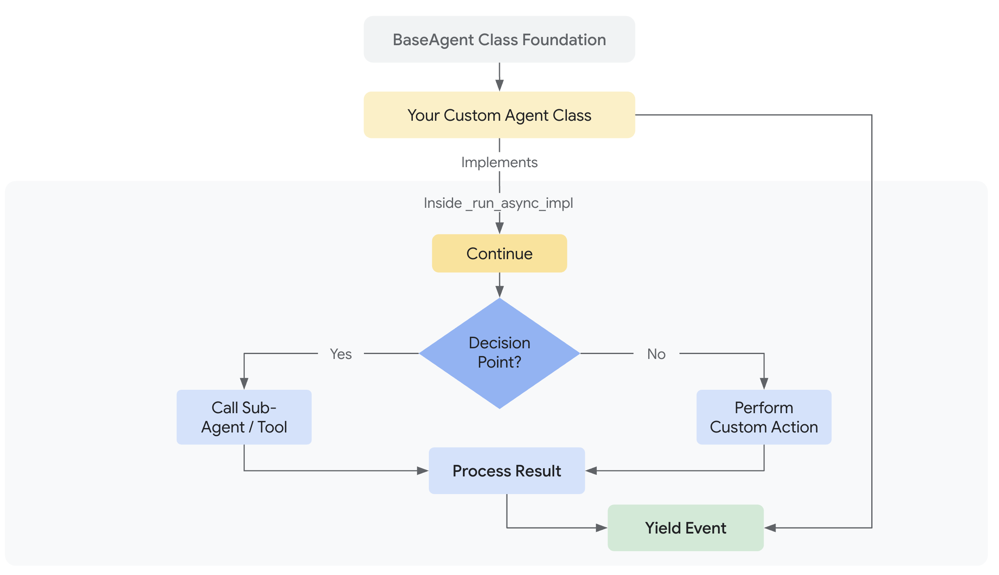

# カスタムエージェント

<div class="language-support-tag">
  <span class="lst-supported">ADKでサポート</span><span class="lst-python">Python v0.1.0</span><span class="lst-go">Go v0.1.0</span><span class="lst-java">Java v0.2.0</span>
</div>

カスタムエージェントは、`BaseAgent`を直接継承し、独自の制御フローを実装することで**任意のオーケストレーションロジック**を定義でき、ADKにおいて究極の柔軟性を提供します。これは、`SequentialAgent`、`LoopAgent`、`ParallelAgent`といった事前定義されたパターンを超え、非常に特殊で複雑なエージェントワークフローを構築することを可能にします。

!!! warning "高度な概念"

    `_run_async_impl`（または他の言語での同等のメソッド）を直接実装してカスタムエージェントを構築することは、強力な制御を提供しますが、事前定義された`LlmAgent`や標準の`WorkflowAgent`タイプを使用するよりも複雑です。カスタムオーケストレーションロジックに取り組む前に、これらの基本的なエージェントタイプをまず理解することをお勧めします。

## はじめに：事前定義されたワークフローを超えて

### カスタムエージェントとは？

カスタムエージェントとは、本質的に`google.adk.agents.BaseAgent`を継承し、その中核となる実行ロジックを`_run_async_impl`非同期メソッド内に実装して作成する任意のクラスです。このメソッドが他のエージェント（サブエージェント）をどのように呼び出し、状態を管理し、イベントを処理するかを完全に制御できます。

!!! Note
    エージェントの中核となる非同期ロジックを実装するための特定のメソッド名は、SDKの言語によって若干異なる場合があります（例：Javaでは`runAsyncImpl`、Pythonでは`_run_async_impl`）。詳細は、各言語のAPIドキュメントを参照してください。

### なぜ使用するのか？

標準の[ワークフローエージェント](workflow-agents/index.md)（`SequentialAgent`、`LoopAgent`、`ParallelAgent`）は一般的なオーケストレーションパターンをカバーしていますが、要件に以下が含まれる場合はカスタムエージェントが必要になります。

*   **条件付きロジック:** 実行時の条件や前のステップの結果に基づいて、異なるサブエージェントを実行したり、異なるパスをたどる場合。
*   **複雑な状態管理:** 単純な逐次的な受け渡しを超えて、ワークフロー全体で状態を維持・更新するための複雑なロジックを実装する場合。
*   **外部との統合:** オーケストレーションのフロー制御内で、外部API、データベース、またはカスタムライブラリへの呼び出しを直接組み込む場合。
*   **動的なエージェント選択:** 状況や入力の動的な評価に基づいて、次に実行するサブエージェントを選択する場合。
*   **独自のワークフローパターン:** 標準的なシーケンシャル、パラレル、またはループ構造に適合しないオーケストレーションロジックを実装する場合。



## カスタムロジックの実装：

すべてのカスタムエージェントの中核は、その独自の非同期動作を定義するメソッドです。このメソッドにより、サブエージェントをオーケストレーションし、実行の流れを管理できます。

=== "Python"

      すべてのカスタムエージェントの中心は`_run_async_impl`メソッドです。ここで独自の動作を定義します。
      
      *   **シグネチャ:** `async def _run_async_impl(self, ctx: InvocationContext) -> AsyncGenerator[Event, None]:`
      *   **非同期ジェネレーター:** `async def`関数であり、`AsyncGenerator`を返す必要があります。これにより、サブエージェントや自身のロジックによって生成されたイベントを`yield`でランナーに返すことができます。
      *   **`ctx` (InvocationContext):** 重要な実行時情報、特に`ctx.session.state`へのアクセスを提供します。これは、カスタムエージェントがオーケストレーションするステップ間でデータを共有する主要な方法です。

=== "Go"

    Goでは、`agent.Agent`インターフェースを満たす構造体の一部として`Run`メソッドを実装します。実際のロジックは通常、カスタムエージェント構造体のメソッドとなります。

    *   **シグネチャ:** `Run(ctx agent.InvocationContext) iter.Seq2[*session.Event, error]`
    *   **イテレータ:** `Run`メソッドは、イベントとエラーを生成するイテレータ（`iter.Seq2`）を返します。これは、エージェントの実行からストリーミング結果を処理する標準的な方法です。
    *   **`ctx` (InvocationContext):** `agent.InvocationContext`は、状態を含むセッションやその他の重要な実行時情報へのアクセスを提供します。
    *   **セッション状態:** `ctx.Session().State()`を介してセッション状態にアクセスできます。

=== "Java"

    すべてのカスタムエージェントの中心は、`BaseAgent`からオーバーライドする`runAsyncImpl`メソッドです。

    *   **シグネチャ:** `protected Flowable<Event> runAsyncImpl(InvocationContext ctx)`
    *   **リアクティブストリーム (`Flowable`):** `io.reactivex.rxjava3.core.Flowable<Event>`を返す必要があります。この`Flowable`は、カスタムエージェントのロジックによって生成されるイベントのストリームを表し、しばしば複数のサブエージェントからの`Flowable`を組み合わせたり変換したりして作成されます。
    *   **`ctx` (InvocationContext):** 重要な実行時情報、特に`java.util.concurrent.ConcurrentMap<String, Object>`である`ctx.session().state()`へのアクセスを提供します。これは、カスタムエージェントがオーケストレーションするステップ間でデータを共有する主要な方法です。

**中核となる非同期メソッド内の主要な機能：**

=== "Python"

    1. **サブエージェントの呼び出し:** `run_async`メソッドを使用して（通常は`self.my_llm_agent`などのインスタンス属性として格納されている）サブエージェントを呼び出し、そのイベントをyieldします。

          ```python
          async for event in self.some_sub_agent.run_async(ctx):
              # オプションでイベントを検査またはログ記録
              yield event # イベントを上位に渡す
          ```

    2. **状態管理:** セッション状態辞書（`ctx.session.state`）の読み書きを行い、サブエージェントの呼び出し間でデータを渡したり、意思決定を行ったりします。
          ```python
          # 前のエージェントが設定したデータを読み込む
          previous_result = ctx.session.state.get("some_key")
      
          # 状態に基づいて意思決定
          if previous_result == "some_value":
              # ... 特定のサブエージェントを呼び出す ...
          else:
              # ... 別のサブエージェントを呼び出す ...
      
          # 後のステップのために結果を保存する（サブエージェントのoutput_keyを介して行われることが多い）
          # ctx.session.state["my_custom_result"] = "calculated_value"
          ```

    3. **制御フローの実装:** 標準のPython構文（`if`/`elif`/`else`、`for`/`while`ループ、`try`/`except`）を使用して、サブエージェントを含む洗練された、条件付きまたは反復的なワークフローを作成します。

=== "Go"

    1. **サブエージェントの呼び出し:** `Run`メソッドを呼び出してサブエージェントを起動します。

          ```go
          // 例：サブエージェントを1つ実行し、そのイベントをyieldする
          for event, err := range someSubAgent.Run(ctx) {
              if err != nil {
                  // エラーを処理または伝播する
                  return
              }
              // イベントを呼び出し元にyieldする
              if !yield(event, nil) {
                return
              }
          }
          ```

    2. **状態管理:** セッション状態の読み書きを行い、サブエージェントの呼び出し間でデータを渡したり、意思決定を行ったりします。
          ```go
          // `ctx`（`agent.InvocationContext`）はエージェントの`Run`関数に直接渡される
          // 前のエージェントが設定したデータを読み込む
          previousResult, err := ctx.Session().State().Get("some_key")
          if err != nil {
              // キーがまだ存在しない可能性のあるケースを処理
          }

          // 状態に基づいて意思決定
          if val, ok := previousResult.(string); ok && val == "some_value" {
              // ... 特定のサブエージェントを呼び出す ...
          } else {
              // ... 別のサブエージェントを呼び出す ...
          }

          // 後のステップのために結果を保存する
          if err := ctx.Session().State().Set("my_custom_result", "calculated_value"); err != nil {
              // エラー処理
          }
          ```

    3. **制御フローの実装:** 標準のGo構文（`if`/`else`、`for`/`switch`ループ、ゴルーチン、チャネル）を使用して、サブエージェントを含む洗練された、条件付きまたは反復的なワークフローを作成します。

=== "Java"

    1. **サブエージェントの呼び出し:** 非同期実行メソッドを使用して（通常はインスタンス属性やオブジェクトとして格納されている）サブエージェントを呼び出し、そのイベントストリームを返します。

           通常、`concatWith`、`flatMapPublisher`、`concatArray`などのRxJava演算子を使用して、サブエージェントからの`Flowable`を連鎖させます。

           ```java
           // 例：サブエージェントを1つ実行
           // return someSubAgent.runAsync(ctx);
      
           // 例：サブエージェントを順次実行
           Flowable<Event> firstAgentEvents = someSubAgent1.runAsync(ctx)
               .doOnNext(event -> System.out.println("エージェント1からのイベント: " + event.id()));
      
           Flowable<Event> secondAgentEvents = Flowable.defer(() ->
               someSubAgent2.runAsync(ctx)
                   .doOnNext(event -> System.out.println("エージェント2からのイベント: " + event.id()))
           );
      
           return firstAgentEvents.concatWith(secondAgentEvents);
           ```
           `Flowable.defer()`は、後続ステージの実行が前のステージの完了や状態に依存する場合によく使用されます。

    2. **状態管理:** セッション状態の読み書きを行い、サブエージェントの呼び出し間でデータを渡したり、意思決定を行ったりします。セッション状態は`ctx.session().state()`を介して取得される`java.util.concurrent.ConcurrentMap<String, Object>`です。
        
        ```java
        // 前のエージェントが設定したデータを読み込む
        Object previousResult = ctx.session().state().get("some_key");

        // 状態に基づいて意思決定
        if ("some_value".equals(previousResult)) {
            // ... 特定のサブエージェントのFlowableを含めるロジック ...
        } else {
            // ... 別のサブエージェントのFlowableを含めるロジック ...
        }

        // 後のステップのために結果を保存する（サブエージェントのoutput_keyを介して行われることが多い）
        // ctx.session().state().put("my_custom_result", "calculated_value");
        ```

    3. **制御フローの実装:** 標準の言語構文（`if`/`else`、ループ、`try`/`catch`）とリアクティブ演算子（RxJava）を組み合わせて、洗練されたワークフローを作成します。

          *   **条件付き:** 条件に基づいてどの`Flowable`を購読するかを選択するための`Flowable.defer()`、またはストリーム内でイベントをフィルタリングする場合は`filter()`。
          *   **反復:** `repeat()`、`retry()`などの演算子、または条件に基づいて`Flowable`チェーンの一部を再帰的に呼び出すように構造化する（`flatMapPublisher`や`concatMap`で管理されることが多い）。

## サブエージェントと状態の管理

通常、カスタムエージェントは他のエージェント（`LlmAgent`、`LoopAgent`など）をオーケストレーションします。

*   **初期化:** 通常、これらのサブエージェントのインスタンスをカスタムエージェントのコンストラクタに渡し、インスタンスフィールド/属性として格納します（例: `this.story_generator = story_generator_instance` または `self.story_generator = story_generator_instance`）。これにより、カスタムエージェントの中核となる非同期実行ロジック（`_run_async_impl`メソッドなど）内からアクセス可能になります。
*   **サブエージェントリスト:** `super()`コンストラクタを使用して`BaseAgent`を初期化する際に、`sub agents`リストを渡すべきです。このリストは、このカスタムエージェントの直接の階層に属するエージェントをADKフレームワークに伝えます。これは、中核となる実行ロジック（`_run_async_impl`）が`self.xxx_agent`を介してエージェントを直接呼び出す場合でも、ライフサイクル管理、イントロスペクション、そして将来のルーティング機能などのフレームワーク機能にとって重要です。カスタムロジックがトップレベルで直接呼び出すエージェントを含めてください。
*   **状態:** 前述の通り、`ctx.session.state`は、サブエージェント（特に`output key`を使用する`LlmAgent`）が結果をオーケストレーターに返し、オーケストレーターが必要な入力を渡すための標準的な方法です。

## デザインパターン例： `StoryFlowAgent`

条件付きロジックを持つ多段階のコンテンツ生成ワークフローという例のパターンで、カスタムエージェントの強力さを示しましょう。

**目標:** 物語を生成し、批評と修正を通じて反復的に洗練させ、最終チェックを行い、そして重要なことに、*最終的なトーンチェックに失敗した場合は物語を再生成する*システムを作成します。

**なぜカスタムか？** ここでカスタムエージェントが必要となる中核的な要件は、**トーンチェックに基づく条件付き再生成**です。標準のワークフローエージェントには、サブエージェントのタスクの結果に基づく条件分岐機能が組み込まれていません。オーケストレーター内にカスタムロジック（`if tone == "negative": ...`）が必要です。

---

### パート1：簡略化されたカスタムエージェントの初期化 { #part-1-simplified-custom-agent-initialization }

=== "Python"

    `BaseAgent`を継承する`StoryFlowAgent`を定義します。`__init__`では、（渡された）必要なサブエージェントをインスタンス属性として格納し、このカスタムエージェントが直接オーケストレーションするトップレベルのエージェントを`BaseAgent`フレームワークに伝えます。
    
    ```python
    --8<-- "examples/python/snippets/agents/custom-agent/storyflow_agent.py:init"
    ```

=== "Go"

    `StoryFlowAgent`構造体とコンストラクタを定義します。コンストラクタでは、必要なサブエージェントを格納し、このカスタムエージェントが直接オーケストレーションするトップレベルのエージェントを`BaseAgent`フレームワークに伝えます。

    ```go
    --8<-- "examples/go/snippets/agents/custom-agent/storyflow_agent.go:init"
    ```

=== "Java"

    `BaseAgent`を拡張して`StoryFlowAgentExample`を定義します。その**コンストラクタ**で、（パラメータとして渡された）必要なサブエージェントのインスタンスをインスタンスフィールドとして格納します。このカスタムエージェントが直接オーケストレーションするこれらのトップレベルのサブエージェントは、`BaseAgent`の`super`コンストラクタにもリストとして渡されます。

    ```java
    --8<-- "examples/java/snippets/src/main/java/agents/StoryFlowAgentExample.java:init"
    ```

---

### パート2：カスタム実行ロジックの定義 { #part-2-defining-the-custom-execution-logic }

=== "Python"

    このメソッドは、標準のPython async/awaitと制御フローを使用してサブエージェントをオーケストレーションします。
    
    ```python
    --8<-- "examples/python/snippets/agents/custom-agent/storyflow_agent.py:executionlogic"
    ```
    **ロジックの説明:**

    1. 初期の`story_generator`が実行されます。その出力は`ctx.session.state["current_story"]`にあると期待されます。
    2. `loop_agent`が実行され、内部で`critic`と`reviser`を`max_iterations`回、順次呼び出します。これらは状態から`current_story`と`criticism`を読み書きします。
    3. `sequential_agent`が実行され、`grammar_check`、次に`tone_check`を呼び出し、`current_story`を読み込んで`grammar_suggestions`と`tone_check_result`を状態に書き込みます。
    4. **カスタム部分:** `if`文が状態から`tone_check_result`をチェックします。もし"negative"であれば、`story_generator`が*再度*呼び出され、状態の`current_story`を上書きします。そうでなければ、フローは終了します。

=== "Go"

    `Run`メソッドは、各サブエージェントの`Run`メソッドをループ内で呼び出し、そのイベントをyieldすることでサブエージェントをオーケストレーションします。

    ```go
    --8<-- "examples/go/snippets/agents/custom-agent/storyflow_agent.go:executionlogic"
    ```
    **ロジックの説明:**

    1. 初期の`storyGenerator`が実行されます。その出力はセッション状態のキー`"current_story"`にあると期待されます。
    2. `revisionLoopAgent`が実行され、内部で`critic`と`reviser`を`max_iterations`回、順次呼び出します。これらは状態から`current_story`と`criticism`を読み書きします。
    3. `postProcessorAgent`が実行され、`grammar_check`、次に`tone_check`を呼び出し、`current_story`を読み込んで`grammar_suggestions`と`tone_check_result`を状態に書き込みます。
    4. **カスタム部分:** コードが状態から`tone_check_result`をチェックします。もし"negative"であれば、`story_generator`が*再度*呼び出され、状態の`current_story`を上書きします。そうでなければ、フローは終了します。

=== "Java"
    
    `runAsyncImpl`メソッドは、RxJavaのFlowableストリームと演算子を使用して、非同期制御フローでサブエージェントをオーケストレーションします。

    ```java
    --8<-- "examples/java/snippets/src/main/java/agents/StoryFlowAgentExample.java:executionlogic"
    ```
    **ロジックの説明:**

    1. 初期の`storyGenerator.runAsync(invocationContext)` Flowableが実行されます。その出力は`invocationContext.session().state().get("current_story")`にあると期待されます。
    2. (`Flowable.concatArray`と`Flowable.defer`により)`loopAgent`のFlowableが次に実行されます。LoopAgentは内部で`critic`と`reviser`サブエージェントを最大`maxIterations`回、順次呼び出します。これらは状態から`current_story`と`criticism`を読み書きします。
    3. 次に、`sequentialAgent`のFlowableが実行されます。これは`grammar_check`、次に`tone_check`を呼び出し、`current_story`を読み込んで`grammar_suggestions`と`tone_check_result`を状態に書き込みます。
    4. **カスタム部分:** sequentialAgentが完了した後、`Flowable.defer`内のロジックが`invocationContext.session().state()`から"tone_check_result"をチェックします。もし"negative"であれば、`storyGenerator`のFlowableが*条件付きで連結*されて再度実行され、"current_story"を上書きします。そうでなければ、空のFlowableが使用され、全体のワークフローは完了へと進みます。

---

### パート3：LLMサブエージェントの定義 { #part-3-defining-the-llm-sub-agents }

これらは特定のタスクを担当する標準の`LlmAgent`定義です。`output key`パラメータは、結果を`session.state`に配置し、他のエージェントやカスタムオーケストレーターがアクセスできるようにするために重要です。

!!! tip "指示文への状態の直接注入"
    `story_generator`の指示文に注目してください。`{var}`構文はプレースホルダーです。指示文がLLMに送信される前に、ADKフレームワークは自動的に（例：`{topic}`）を`session.state['topic']`の値に置き換えます。これは、指示文内でテンプレートを使用してエージェントにコンテキストを提供する推奨方法です。詳細は、[状態のドキュメント](../sessions/state.md#accessing-session-state-in-agent-instructions)を参照してください。

=== "Python"

    ```python
    GEMINI_2_FLASH = "gemini-2.0-flash" # モデル定数を定義
    --8<-- "examples/python/snippets/agents/custom-agent/storyflow_agent.py:llmagents"
    ```
=== "Java"

    ```java
    --8<-- "examples/java/snippets/src/main/java/agents/StoryFlowAgentExample.java:llmagents"
    ```

=== "Go"

    ```go
    --8<-- "examples/go/snippets/agents/custom-agent/storyflow_agent.go:llmagents"
    ```

---

### パート4：カスタムエージェントのインスタンス化と実行 { #part-4-instantiating-and-running-the-custom-agent }

最後に、`StoryFlowAgent`をインスタンス化し、通常通り`Runner`を使用します。

=== "Python"

    ```python
    --8<-- "examples/python/snippets/agents/custom-agent/storyflow_agent.py:story_flow_agent"
    ```

=== "Go"

    ```go
    --8<-- "examples/go/snippets/agents/custom-agent/storyflow_agent.go:story_flow_agent"
    ```

=== "Java"

    ```java
    --8<-- "examples/java/snippets/src/main/java/agents/StoryFlowAgentExample.java:story_flow_agent"
    ```

*(注：インポートや実行ロジックを含む完全な実行可能コードは、以下のリンク先にあります。)*

---

## 完全なコード例

???+ "Storyflowエージェント"

    === "Python"
    
        ```python
        # StoryFlowAgentの例の完全な実行可能コード
        --8<-- "examples/python/snippets/agents/custom-agent/storyflow_agent.py"
        ```
    
    === "Go"

        ```go
        # StoryFlowAgentの例の完全な実行可能コード
        --8<-- "examples/go/snippets/agents/custom-agent/storyflow_agent.go:full_code"
        ```

    === "Java"
    
        ```java
        # StoryFlowAgentの例の完全な実行可能コード
        --8<-- "examples/java/snippets/src/main/java/agents/StoryFlowAgentExample.java:full_code"
        ```