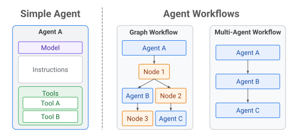

# エージェント

  ADKでサポートPythonTypeScriptGoJava

Agent Development Kit（ADK）における ***エージェント（Agent）***、または ***LlmAgent*** は、特定の目標を達成するために自律的に動作するよう設計された自己完結型の実行単位です。エージェントはタスクを実行し、ユーザーと対話し、外部ツールを利用し、他のエージェントと連携できます。***Agent*** の基本構成要素は、人工知能（AI）モデル、タスク指示、そして必要に応じてエージェントが使用するツールのセットです。エージェントのタスクと複雑さが増すにつれて、ADK 開発フレームワークを使用してそれらを *ワークフロー* に拡張できます。ワークフローでは、複数のエージェントとコード実行タスクを組み合わせてオーケストレーションできます。

**図 1.** ADK におけるシンプルなエージェントとエージェント ワークフロー

モデル、指示、ツールだけでエージェントを構築することは、多くの開発者にとって優れた出発点です。エージェントの機能と複雑さが増すにつれて、その動作をより適切に管理し、モデルの動作コンテキスト制限内で作業し、コードをモジュール化して管理しやすくするために、エージェント アプリケーションの機能を分割したくなるでしょう。ADK エージェントの ***ワークフロー*** アーキテクチャを使うと、エージェントをモノリシックな構造から、よりモジュール化されたコードとプロジェクト構造へ発展させることができます。

## 単一エージェントからワークフローへ拡張する

ADK では、複数のエージェントまたは実行可能な *ノード（Node）* を持つエージェント アプリケーションはワークフローと見なされます。ADK は、単一エージェント アーキテクチャからマルチエージェントまたはグラフベースの ***ワークフロー*** アーキテクチャへ移行することについて、厳格な要件を課しません。プロジェクトのニーズに応じて、または次のような単一エージェント方式の制約を見つけたときに、その変更を行うかどうかを判断できます。

* **指示追従の性能:** 複数ステップの指示セットが一定の長さや複雑さを超えると、単一のエージェントがすべての指示を確実に完了できなかったり、必要な品質や速度で実行できなかったりする場合があります。
* **コンテキストの制限:** エージェント タスクの実行に必要なデータ量が、使用している AI モデルのコンテキスト ウィンドウ制限を超えることがあります。
* **エージェント コードのモジュール性:** エージェント コードの複雑さや構成が増すにつれて、コードを管理しやすくしたり、他のエージェント プロジェクトで再利用できるようにしたりするために、エージェント機能を分割したくなることがあります。
* **決定的タスクと非決定的タスクの混在:** より複雑な問題を解くエージェントを構築する際、タスク全体の実行管理を非決定的な AI モデルだけに任せるのではなく、AI モデルの非決定的な機能と決定的なコードを組み合わせたエージェントを設計・構築したくなる場合があります。詳しくは [グラフベース ワークフロー](/ja/graphs/) を参照してください。

ADK ワークフローとエージェント プロジェクト アーキテクチャの詳細については、[ワークフロー](/ja/workflows/) セクションを参照してください。

## エージェント機能

ADK エージェントの機能は、次の機能を使って拡張できます。

*   [**AI モデル**](/ja/agents/models/):
    Google やその他のプロバイダーの生成 AI モデルと統合して、エージェントの基盤となる知能を入れ替えます。

*   [**事前構築済みツールと統合**](/ja/integrations/):
    Web サイト、MCP ツール、アプリケーション、データベース、プログラミング インターフェースなど、外部世界とやり取りするための幅広いツール、プラグイン、その他の統合をエージェントに装備します。

*   [**カスタムツール**](/ja/tools-custom/):
    特定の問題を精密に制御して解決するための、タスク固有のツールを自分で作成します。

*   [**アーティファクト**](/ja/artifacts/):
    会話ライフサイクルを超えて存在するファイル、コード、ドキュメントなどの永続的な出力を、エージェントが作成・管理できるようにします。

*   [**スキル**](/ja/skills/):
    事前構築済みまたはカスタムの [Agent Skills](https://agentskills.io/) を使用して、AI コンテキスト ウィンドウの制限内で効率的に動作する形でエージェント機能を拡張します。

*   [**プラグイン**](/ja/plugins/):
    複雑な事前パッケージ化済みの動作やサードパーティ サービスを、エージェントのワークフローに直接統合します。

*   [**コールバック**](/ja/callbacks/):
    エージェントの実行ライフサイクル中の特定イベントにフックし、コアのエージェント ロジックを変更せずにロギング、モニタリング、またはカスタムの副作用を追加します。

## 次のステップ

ADK で利用できるさまざまなエージェント タイプの概要を理解したら、それらの仕組みと効果的な使い方をさらに掘り下げてみましょう。

* [**シンプルなエージェント:**](/ja/agents/llm-agents/) 指示の設定、ツールの提供、計画やコード実行などの高度な機能の有効化を含め、AI モデルを搭載したエージェントを構成する方法を学びます。
* [**Managed agents (マネージドエージェント):**](/ja/agents/managed-agents/) Web 検索やコード実行などの組み込みサーバーサイドツールを備えた、Google のファーストパーティ製の即座に利用可能なエージェント（Managed Agents API を搭載）を ADK フローで直接使用します。
* [**グラフ ワークフロー:**](/ja/graphs/) プレーンな言語指示から、AI 推論と決定的なコード ロジックを組み合わせた、構成可能で信頼性の高い実行パスへエージェントを進化させる方法を確認します。
* [**マルチエージェント ワークフロー:**](/ja/workflows/) 複数のエージェント、実行ノード、さまざまなタスク実行制御メカニズムを組み合わせ、プロジェクトのニーズに合ったエージェント アプリケーションを構築する方法を学びます。
