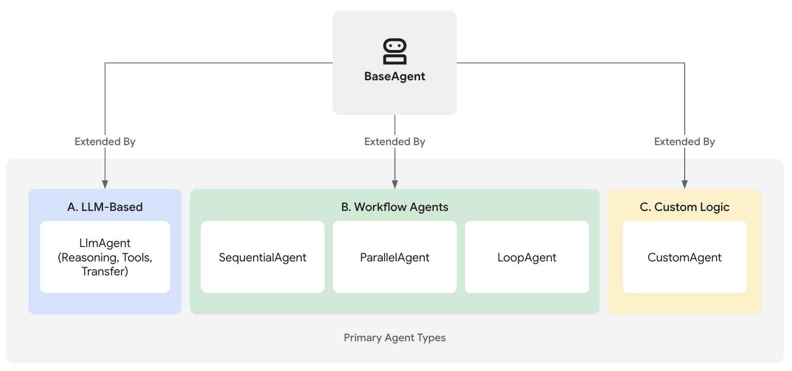

# エージェント

  ADKでサポートPythonGoJava

エージェント開発キット（ADK）において、**エージェント（Agent）**とは、特定の目標を達成するために自律的に動作するように設計された、自己完結型の実行単位です。エージェントはタスクを実行し、ユーザーと対話し、外部ツールを利用し、他のエージェントと連携することができます。

ADKにおけるすべてのエージェントの基盤は`BaseAgent`クラスです。これは基本的な設計図として機能します。機能的なエージェントを作成するには、通常、3つの主要な方法のいずれかで`BaseAgent`を拡張し、知的推論から構造化されたプロセス制御まで、さまざまなニーズに対応します。

## 主要なエージェントカテゴリ

ADKは、洗練されたアプリケーションを構築するために、明確に区別されたエージェントカテゴリを提供します。

1. [**LLMエージェント (`LlmAgent`, `Agent`)**](llm-agents.md): これらのエージェントは、大規模言語モデル（LLM）を中核エンジンとして利用し、自然言語の理解、推論、計画、応答生成を行い、進行方法や使用するツールを動的に決定します。そのため、言語中心の柔軟なタスクに最適です。[LLMエージェントについて詳しく見る...](llm-agents.md)

2. [**ワークフローエージェント (`SequentialAgent`, `ParallelAgent`, `LoopAgent`)**](workflow-agents/index.md): これらの特化されたエージェントは、フロー制御自体にLLMを使用せず、事前定義された決定的なパターン（シーケンシャル、パラレル、またはループ）で他のエージェントの実行フローを制御します。予測可能な実行が必要な構造化されたプロセスに最適です。[ワークフローエージェントを探る...](workflow-agents/index.md)

3. [**カスタムエージェント**](custom-agents.md): `BaseAgent`を直接拡張して作成されるこれらのエージェントは、標準タイプではカバーされない独自の運用ロジック、特定の制御フロー、または特化した統合を実装でき、高度にカスタマイズされたアプリケーション要件に対応します。[カスタムエージェントの構築方法を発見する...](custom-agents.md)

## 適切なエージェントタイプの選択

以下の表は、エージェントタイプ間の違いを区別するのに役立つ概要比較を提供します。後続のセクションで各タイプをより詳細に検討するにつれて、これらの違いはより明確になります。

| 特徴 | LLMエージェント (`LlmAgent`) | ワークフローエージェント | カスタムエージェント (`BaseAgent`のサブクラス) |
| :--- | :--- | :--- | :--- |
| **主な機能** | 推論、生成、ツール使用 | エージェント実行フローの制御 | 独自のロジック/統合の実装 |
| **中核エンジン** | 大規模言語モデル（LLM） | 事前定義されたロジック（シーケンシャル、パラレル、ループ） | カスタムコード |
| **決定性** | 非決定的（柔軟） | 決定的（予測可能） | 実装によりどちらも可能 |
| **主な用途** | 言語タスク、動的な意思決定 | 構造化されたプロセス、オーケストレーション | カスタマイズされた要件、特定のワークフロー |

## 連携するエージェント：マルチエージェントシステム

各エージェントタイプは異なる目的を果たしますが、真の力は、これらを組み合わせることで発揮されることがよくあります。複雑なアプリケーションでは、次のような[マルチエージェントアーキテクチャ](multi-agents.md)が頻繁に採用されます。

* **LLMエージェント**は、知的で言語ベースのタスク実行を担当します。
* **ワークフローエージェント**は、標準パターンを使用してプロセス全体のフローを管理します。
* **カスタムエージェント**は、独自の統合に必要な特化した機能やルールを提供します。

これらの主要なタイプを理解することは、ADKで洗練された有能なAIアプリケーションを構築するための第一歩です。

---

## 次のステップ

ADKで利用可能なさまざまなエージェントタイプの概要を理解したところで、それらがどのように機能し、効果的に使用する方法についてさらに深く掘り下げてみましょう。

* [**LLMエージェント:**](llm-agents.md) 指示の設定、ツールの提供、計画やコード実行などの高度な機能の有効化など、大規模言語モデルを搭載したエージェントの設定方法を探ります。
* [**ワークフローエージェント:**](workflow-agents/index.md) `SequentialAgent`、`ParallelAgent`、`LoopAgent`を使用して、構造化され予測可能なプロセスのためにタスクをオーケストレーションする方法を学びます。
* [**カスタムエージェント:**](custom-agents.md) 特定のニーズに合わせて独自のロジックと統合を備えたエージェントを構築するために`BaseAgent`を拡張する原則を発見します。
* [**マルチエージェント:**](multi-agents.md) 複雑な問題に取り組むことができる洗練された協調システムを作成するために、さまざまなエージェントタイプを組み合わせる方法を理解します。
* [**モデル:**](models.md) 利用可能なさまざまなLLM統合について学び、エージェントに適したモデルを選択する方法を学びます。