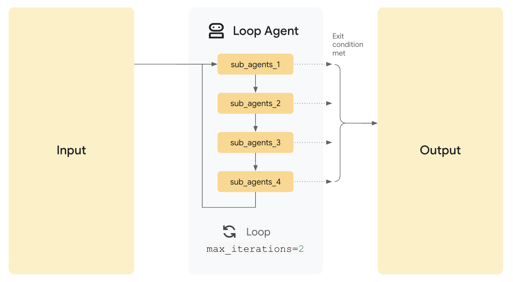

# ループエージェント

<div class="language-support-tag">
  <span class="lst-supported">ADKでサポート</span><span class="lst-python">Python v0.1.0</span><span class="lst-typescript">TypeScript v0.2.0</span><span class="lst-go">Go v0.1.0</span><span class="lst-java">Java v0.2.0</span>
</div>

`LoopAgent`は、サブエージェントをループ（つまり反復的）で実行するワークフローエージェントです。指定された反復回数、または終了条件が満たされるまで、**一連のエージェントを繰り返し実行します**。

コードの修正など、ワークフローに繰り返しや反復的な改善が含まれる場合に`LoopAgent`を使用します。

### 例

*   食べ物の画像を生成するエージェントを構築したいが、特定の数のアイテム（例：5本のバナナ）を生成したいときに、画像内に異なる数のアイテム（例：7本のバナナの画像）が生成されることがあるとします。あなたには`画像を生成`と`食品アイテムを数える`という2つのツールがあります。指定された数のアイテムを正しく生成するか、一定の反復回数に達するまで画像の生成を続けたいので、`LoopAgent`を使用してエージェントを構築すべきです。

他の[ワークフローエージェント](index.md)と同様に、`LoopAgent`はLLMによって駆動されないため、その実行方法は決定論的（deterministic）です。ただし、ワークフローエージェントが関与するのはその実行（つまりループ内での実行）のみであり、内部ロジックではありません。ワークフローエージェントのツールやサブエージェントは、LLMを利用する場合もあれば、しない場合もあります。

### 仕組み

`LoopAgent`の`Run Async`メソッドが呼び出されると、以下の処理を実行します。

1.  **サブエージェントの実行:**  サブエージェントのリストを_順番に_反復処理します。_各_サブエージェントに対して、そのエージェントの`Run Async`メソッドを呼び出します。
2.  **終了チェック:**

    _重要なのは_、`LoopAgent`自体はいつループを停止するかを本質的に決定_しない_ということです。無限ループを防ぐために、終了メカニズムを実装する_必要があります_。一般的な戦略は次のとおりです。

    *   **最大反復回数 (Max Iterations)**: `LoopAgent`に最大反復回数を設定します。**ループはその回数だけ反復した後に終了します**。
    *   **サブエージェントからの通知 (Escalation from sub-agent)**: 1つ以上のサブエージェントが条件（例：「ドキュメントの品質は十分か？」「合意に達したか？」）を評価するように設計します。条件が満たされた場合、サブエージェントは終了を通知（例：カスタムイベントの発行、共有コンテキストでのフラグ設定、特定の値の返却など）できます。



### 完全な例：反復的なドキュメント改善

ドキュメントを反復的に改善するシナリオを想像してみてください。

*   **ライターエージェント (Writer Agent):** あるトピックに関する下書きを生成または改善する`LlmAgent`です。
*   **批評家エージェント (Critic Agent):** 下書きを批評し、改善点を特定する`LlmAgent`です。

    ```py
    LoopAgent(sub_agents=[WriterAgent, CriticAgent], max_iterations=5)
    ```

この設定では、`LoopAgent`が反復プロセスを管理します。`Critic Agent`は、**ドキュメントが満足のいく品質レベルに達したときに「STOP」信号を返すように設計**することで、それ以上の反復を防ぐことができます。あるいは、`max_iterations`パラメータを使用してプロセスを固定回数に制限したり、停止決定を行うための外部ロジックを実装したりすることもできます。**ループは最大5回実行**され、反復的な改善が無限に続かないように保証します。

???+ "全コード"

    === "Python"
        ```py
        --8<-- "examples/python/snippets/agents/workflow-agents/loop_agent_doc_improv_agent.py:init"
        ```

    === "Go"
        ```go
        --8<-- "examples/go/snippets/agents/workflow-agents/loop/main.go:init"
        ```

    === "Java"
        ```java
        --8<-- "examples/java/snippets/src/main/java/agents/workflow/LoopAgentExample.java:init"
        ```
