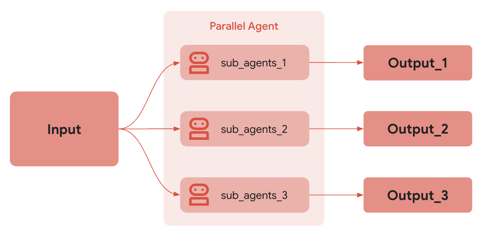

# 並列エージェント

<div class="language-support-tag">
  <span class="lst-supported">ADKでサポート</span><span class="lst-python">Python v0.1.0</span><span class="lst-go">Go v0.1.0</span><span class="lst-java">Java v0.2.0</span>
</div>

`ParallelAgent`は、サブエージェントを*並列(concurrently)*で実行する[ワークフローエージェント](index.md)です。これにより、タスクが独立して実行可能なワークフローを劇的に高速化します。

`ParallelAgent`は次の場合に使用します：速度を優先し、独立したリソース集約型のタスクを伴うシナリオでは、`ParallelAgent`が効率的な並列実行を促進します。**サブエージェントが依存関係なしで動作する場合、タスクを並列に実行でき**、全体の処理時間を大幅に短縮できます。

他の[ワークフローエージェント](index.md)と同様に、`ParallelAgent`はLLMによって駆動されないため、その実行方法は決定論的（deterministic）です。ただし、ワークフローエージェントが関与するのはその実行（つまり、サブエージェントを並列実行すること）のみであり、内部ロジックではありません。ワークフローエージェントのツールやサブエージェントは、LLMを利用する場合もあれば、しない場合もあります。

### 例

このアプローチは、複数ソースからのデータ取得や重い計算処理のような操作に特に有益で、並列化によって大幅なパフォーマンス向上が得られます。重要なのは、この戦略では、並列実行されるエージェント間で共有ステートや直接的な情報交換が本質的に不要であると想定している点です。

### 仕組み

`ParallelAgent`の`run_async()`メソッドが呼び出されると：

1.  **並列実行:** `sub_agents`リストに存在する*各*サブエージェントの`run_async()`メソッドを*並列で*開始します。これは、すべてのエージェントが（ほぼ）同時に実行を開始することを意味します。
2.  **独立したブランチ:** 各サブエージェントは独自の実行ブランチで動作します。実行中、これらのブランチ間で会話履歴やステートが***自動的に*共有されることはありません**。
3.  **結果の収集:** `ParallelAgent`は並列実行を管理し、通常、各サブエージェントが完了した後にその結果にアクセスする方法（例：結果やイベントのリストを通じて）を提供します。結果の順序は決定論的でない場合があります。

### 独立した実行と状態管理

`ParallelAgent`内のサブエージェントが独立して実行されることを理解することが*極めて重要です*。これらのエージェント間で通信やデータ共有が*必要な場合*は、明示的に実装する必要があります。考えられるアプローチは以下の通りです。

*   **共有`InvocationContext`:** 各サブエージェントに共有の`InvocationContext`オブジェクトを渡すことができます。このオブジェクトは共有データストアとして機能します。ただし、競合状態（race condition）を避けるために、この共有コンテキストへの同時アクセスを（例：ロックを使用して）慎重に管理する必要があります。
*   **外部状態管理:** 外部データベース、メッセージキュー、または他のメカニズムを使用して、共有ステートを管理し、エージェント間の通信を促進します。
*   **後処理 (Post-Processing):** 各ブランチから結果を収集し、その後にデータを調整するロジックを実装します。

{: width="600"}

### 完全な例：並列ウェブ調査

複数のトピックを同時に調査する状況を想像してみてください。

1.  **リサーチャーエージェント1:** 「再生可能エネルギー源」を調査する`LlmAgent`です。
2.  **リサーチャーエージェント2:** 「電気自動車技術」を調査する`LlmAgent`です。
3.  **リサーチャーエージェント3:** 「炭素回収方法」を調査する`LlmAgent`です。

    ```py
    ParallelAgent(sub_agents=[ResearcherAgent1, ResearcherAgent2, ResearcherAgent3])
    ```

これらの調査タスクは独立しています。`ParallelAgent`を使用すると、これらを並列実行でき、シーケンシャルに実行する場合と比較して、総調査時間を大幅に短縮できる可能性があります。各エージェントからの結果は、完了後に個別に収集されます。

???+ "全コード"

    === "Python"
        ```py
         --8<-- "examples/python/snippets/agents/workflow-agents/parallel_agent_web_research.py:init"
        ```

    === "Go"
        ```go
         --8<-- "examples/go/snippets/agents/workflow-agents/parallel/main.go:init"
        ```

    === "Java"
        ```java
         --8<-- "examples/java/snippets/src/main/java/agents/workflow/ParallelResearchPipeline.java:full_code"
        ```
