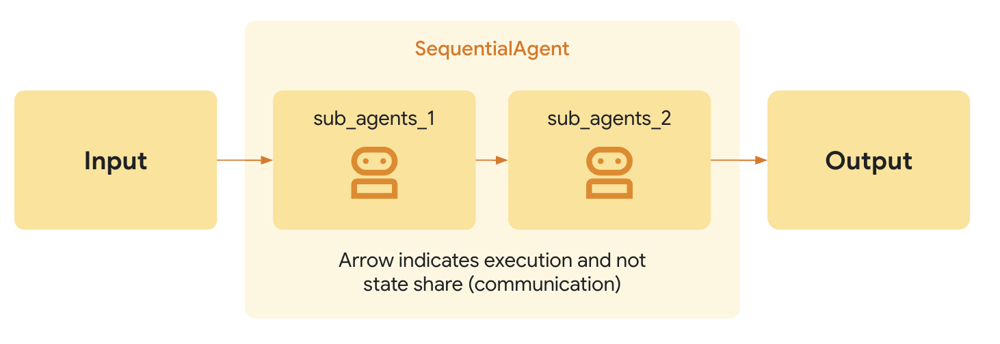

# シーケンシャルエージェント

<div class="language-support-tag">
  <span class="lst-supported">ADKでサポート</span><span class="lst-python">Python v0.1.0</span><span class="lst-typescript">TypeScript v0.2.0</span><span class="lst-go">Go v0.1.0</span><span class="lst-java">Java v0.2.0</span>
</div>

`SequentialAgent` は、サブエージェントをリストで指定された順序で実行する[ワークフローエージェント](index.md)です。
実行を固定的で厳密な順序で行いたい場合に `SequentialAgent` を使用します。

### 例

*   `Get Page Contents` と `Summarize Page` という2つのツールを使用して、任意のウェブページを要約できるエージェントを構築したいとします。エージェントは常に `Summarize Page` を呼び出す前に `Get Page Contents` を呼び出す必要があるため（`何もない状態からは要約できないため！`）、`SequentialAgent` を使用してエージェントを構築すべきです。

他の[ワークフローエージェント](index.md)と同様に、`SequentialAgent`はLLMによって駆動されないため、その実行方法は決定論的（deterministic）です。ただし、ワークフローエージェントが関与するのはその実行（つまりシーケンス）のみであり、内部ロジックではありません。ワークフローエージェントのツールやサブエージェントは、LLMを利用する場合もあれば、しない場合もあります。

### 仕組み

`SequentialAgent` の `Run Async` メソッドが呼び出されると、以下の処理を実行します。

1.  **イテレーション(Iteration):** 提供された順序でサブエージェントのリストを反復処理します。
2.  **サブエージェントの実行(Sub-Agent Execution):** リスト内の各サブエージェントに対して、そのサブエージェントの `Run Async` メソッドを呼び出します。

{: width="600"}

### 完全な例：コード開発パイプライン

簡略化されたコード開発パイプラインを考えてみましょう。

*   **コードライターエージェント (Code Writer Agent):**  仕様に基づいて初期コードを生成するLLMエージェントです。
*   **コードレビューアーエージェント (Code Reviewer Agent):**  生成されたコードのエラー、スタイル上の問題、ベストプラクティスへの準拠などをレビューするLLMエージェントです。コードライターエージェントの出力を受け取ります。
*   **コードリファクターエージェント (Code Refactorer Agent):** レビューされたコード（とレビュー担当者のコメント）を受け取り、品質を向上させ問題を修正するためにリファクタリングするLLMエージェントです。

このような場合に `SequentialAgent` は最適です。

```py
SequentialAgent(sub_agents=[CodeWriterAgent, CodeReviewerAgent, CodeRefactorerAgent])
```

これにより、コードが記述され、*次に*レビューされ、*最後に*リファクタリングされるという、厳密で信頼性の高い順序が保証されます。**各サブエージェントからの出力は、[出力キー (Output Key)](../llm-agents.md#structuring-data-input_schema-output_schema-output_key) を介して状態 (state) に保存され、次のエージェントに渡されます。**

!!! note "共有のInvocationContext"
    `SequentialAgent`は、各サブエージェントに同じ `InvocationContext` を渡します。これは、すべてのサブエージェントが一時的な (`temp:`) 名前空間を含む同じセッション状態を共有することを意味し、単一のターン内でステップ間のデータ受け渡しを容易にします。

???+ "コード"

    === "Python"
        ```py
        --8<-- "examples/python/snippets/agents/workflow-agents/sequential_agent_code_development_agent.py:init"
        ```

    === "Go"
        ```go
        --8<-- "examples/go/snippets/agents/workflow-agents/sequential/main.go:init"
        ```

    === "Java"
        ```java
        --8<-- "examples/java/snippets/src/main/java/agents/workflow/SequentialAgentExample.java:init"
        ```