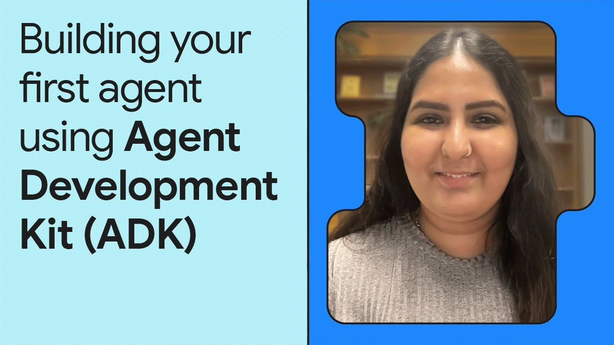
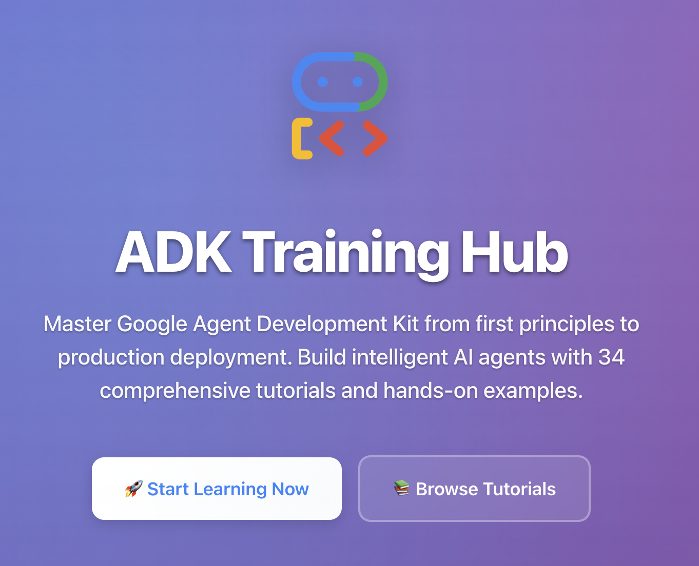
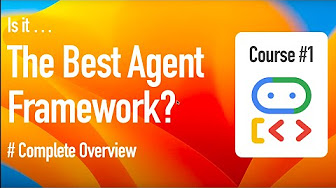
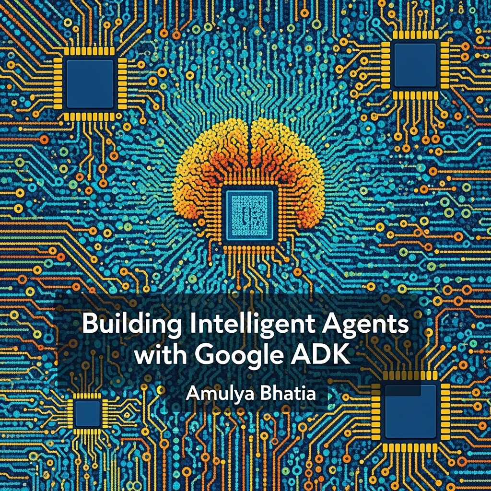
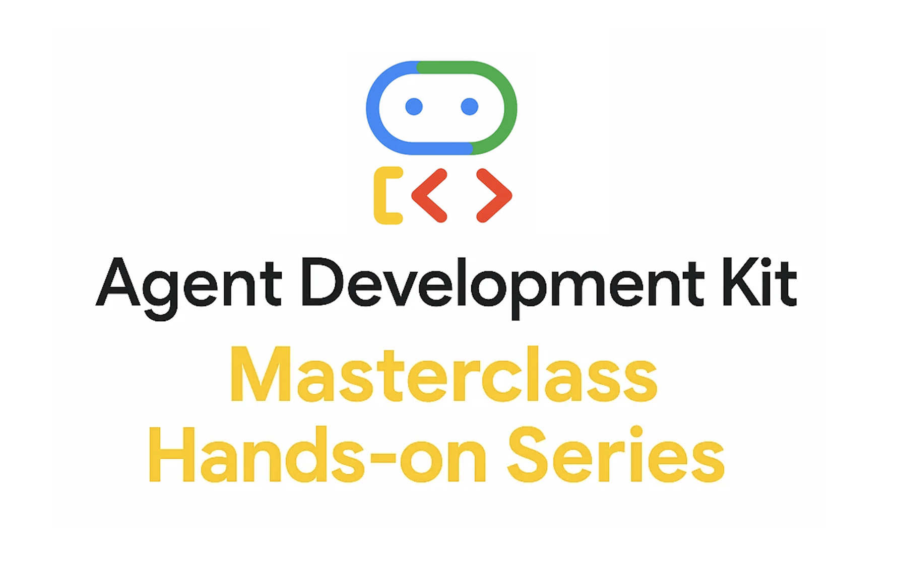
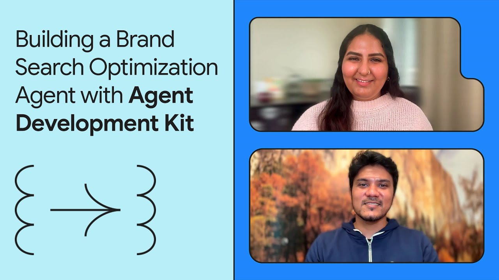
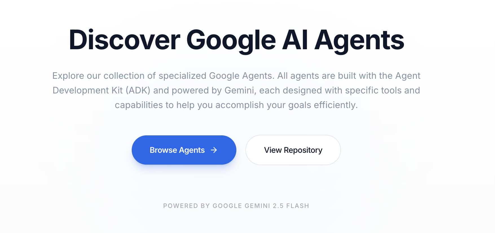
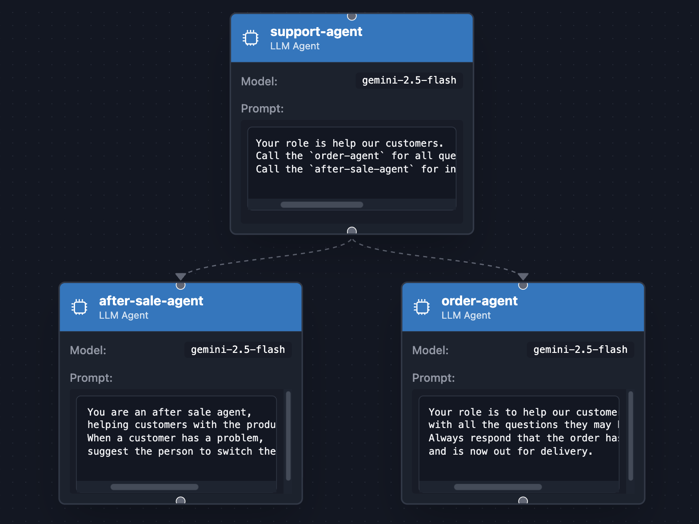

# コミュニティリソース

ようこそ！このページでは、Agent Development Kit コミュニティによって作成・維持されているリソースを紹介します。

!!! info

    Google と ADK チームは、これらの外部コミュニティリソースにリンクされているコンテンツをサポートしていません。

## はじめに

  <a href="https://www.youtube.com/watch?v=zgrOwow_uTQ" class="resource-card">
    

      
    

    

      
デモ動画

      <h3>📺 Agent Development Kit の紹介</h3>
      
コアとなる設計原則を示す、マルチエージェント旅行プランナー構築のデモです。

    

  </a>
  <a href="https://www.youtube.com/watch?v=44C8u0CDtSo" class="resource-card">
    

      
    

    

      
動画

      <h3>📺 Agent Development Kit を始める</h3>
      
エージェント定義の基礎と、最初のエージェントの実行・デバッグ方法を学べます。

    

  </a>
  <a href="https://www.youtube.com/watch?v=5ZmaWY7UX6k" class="resource-card">
    

      
    

    

      
動画

      <h3>📺 ADK ツール入門</h3>
      
MCP や Google Search などのツールを使って、ソフトウェアバグアシスタントを構築するためのガイドです。

    

  </a>

## ADK コミュニティコール

!!! tip "つながりを保つ"

    更新情報、カレンダー招待、ADK コミュニティとの交流のために、[ADK Community Google Group](https://groups.google.com/g/adk-community) に参加してください。

    以下の最近の録画を確認するか、[YouTube プレイリスト](https://www.youtube.com/playlist?list=PLwi6PfxEP7zZbBPmWiZ8QbPcuKyAY5RR3) で過去のすべてのコールをご覧ください。

  <a href="https://www.youtube.com/watch?v=bPngDY7EuOQ" class="resource-card">
    

      
    

    

      
コミュニティコール

      <h3>📞 2026年3月 録画</h3>
      
ADK 2.0 アルファリリース、グラフベースのエージェント構成向け Workflows、構造化されたマルチエージェント連携のための Agent Modes、そして Restate の永続エージェントに関するコミュニティスポットライトを扱っています。

    

  </a>
  <a href="https://www.youtube.com/watch?v=cXDr4RYJxK0" class="resource-card">
    

      
    

    

      
コミュニティコール

      <h3>📞 2026年2月 録画</h3>
      
組み込みメトリクスを使った ADK 評価、トークンベースのコンテキスト圧縮、BigQuery observability プラグイン、そして Redis 連携に関するコミュニティスポットライトを扱っています。

    

  </a>
  <a href="https://www.youtube.com/watch?v=h9Lueiqo89E" class="resource-card">
    

      
    

    

      
コミュニティコール

      <h3>📞 2026年1月 録画</h3>
      
クロス言語サポート向けの Session Service スキーマ、TypeScript マルチエージェントデモ、MCP サーバー向け API Registry、サードパーティツール統合を扱っています。

    

  </a>

## コースと深掘り

  <a href="https://www.kaggle.com/learn-guide/5-day-agents" class="resource-card">
    

      
    

    

      
オンラインコース

      <h3>🎓 Google と学ぶ 5日間 AI エージェント集中コース</h3>
      
モデル、ツール、メモリ、評価、デプロイを含む ADK の中核コンポーネントを使って構築します。

    

  </a>
  <a href="https://www.youtube.com/watch?v=P4VFL9nIaIA" class="resource-card">
    

      
    

    

      
動画コース

      <h3>🎓 ADK マスタークラス: AI エージェント構築とワークフロー自動化</h3>
      
12の実践例を通じて、初心者から上級者まで導く完全な短期集中コースです。

    

  </a>
  <a href="https://raphaelmansuy.github.io/adk_training/" class="resource-card">
    

      
    

    

      
Webサイト

      <h3>🎓 ADK Training Hub</h3>
      
基礎原理から本番運用まで、包括的なチュートリアルと例で ADK を習得できます。

    

  </a>
  <a href="https://www.youtube.com/playlist?list=PLLrA_pU9-Gz2HwepRUVpq1TEPuYWo_fSi" class="resource-card">
    

      
    

    

      
YouTube プレイリスト

      <h3>🎓 ADK でエージェンティック AI をマスターする</h3>
      
セットアップからエージェントのデプロイとスケーリングまで、すべてをカバーするステップバイステップのプレイリストです。

    

  </a>
  <a href="https://www.youtube.com/playlist?list=PL6tW9BrhiPTAZts0W5nQS9dbW6VMnLKab" class="resource-card">
    

      
    

    

      
YouTube プレイリスト

      <h3>🎓 Google ADK エンドツーエンドコース</h3>
      
この詳細なコースシリーズで、本番対応のエージェントを構築、デプロイ、スケールします。

    

  </a>
  <a href="https://iamulya.one/tags/building-intelligent-agents-with-google-adk/" class="resource-card">
    

      
    

    

      
ブログシリーズ

      <h3>🎓 Google ADK でインテリジェントエージェントを構築する</h3>
      
Google のコードファーストな Python ツールキットでインテリジェントエージェントを構築するための開発者向けガイドです。

    

  </a>
  <a href="https://github.com/arjunprabhulal/google-adk-masterclass" class="resource-card">
    

      
    

    

      
オンラインコース

      <h3>🎓 Google ADK マスタークラス: 実践シリーズ</h3>
      
エージェント、ワークフロー、ツール、メモリ、MCP 連携を扱う20モジュールで、本番対応の AI エージェントを構築します。

    

  </a>
  <a href="https://www.youtube.com/playlist?list=PL0Zc2RFDZsM_MkHOzWNJpaT4EH5fQxA8n" class="resource-card">
      

        
      

      

        
YouTube プレイリスト

        <h3>📻️ ADK News - 日本語版 ADK ポッドキャスト</h3>
        
コミットログ、リリースノート、ブログ記事を扱う ADK エージェントによって作成された、自動生成の日本語 ADK ポッドキャストです。

      

    </a>

## エージェントチュートリアルとデモ

  <a href="https://www.youtube.com/watch?v=efcUXoMX818" class="resource-card">
    

      
    

    

      
動画チュートリアル

      <h3>📖 ADK でデータサイエンスエージェントを構築する方法</h3>
      
データベースクエリ、Python 分析、BigQuery ML のためのマルチエージェントシステム構築を詳しく解説します。

    

  </a>
  <a href="https://www.youtube.com/watch?v=hPzjkQFV5yI" class="resource-card">
    

      
    

    

      
動画チュートリアル

      <h3>📖 ADK と Selenium を使ったブラウザ利用エージェントの構築</h3>
      
不足している情報を補って小売サイトの商品データを強化するエージェントの作り方を学びます。

    

  </a>
  <a href="https://github.com/google/adk-docs/blob/main/examples/python/notebooks/shop_agent.ipynb" class="resource-card">
    

      
    

    

      
Jupyter Notebook

      <h3>📖 Eコマース推薦エージェントを構築する</h3>
      
生成AIによる E コマース推薦のためのシンプルなマルチエージェントシステムを作成するチュートリアルです。

    

  </a>
  <a href="https://medium.com/google-cloud/google-adk-vertex-ai-live-api-125238982d5e" class="resource-card">
    

      
    

    

      
ブログ記事

      <h3>📖 Google ADK + Vertex AI Live API</h3>
      
Live API を使ってリアルタイムのストリーミング体験を構築し、ADK CLI の先へ進みましょう。

    

  </a>
  <a href="https://www.youtube.com/watch?v=LwHPYyw7u6U" class="resource-card">
    

      
    

    

      
デモ動画

      <h3>📺 ショッパーズコンシェルジュのデモ</h3>
      
パーソナライズされたリアルタイムのおすすめで、AI エージェントがショッピングをどう変えるかをご覧ください。

    

  </a>
  <a href="https://agentdirectory.folch.ai/" class="resource-card">
    

      
    

    

      
ギャラリー

      <h3>📖 ADK Agent Directory</h3>
      
Web 検索、画像生成、リサーチなどに使える本番対応の ADK エージェントを見つけて試せます。

    

  </a>

## Java 向け ADK

  <a href="https://www.youtube.com/watch?v=L6V6aQixOZU" class="resource-card">
    

      
    

    

      
講演動画

      <h3>☕ AI エージェント構築のための ADK Java を知る</h3>
      
Java で最初の AI エージェントを構築するためのプレゼンテーションです。

    

  </a>
  <a href="https://www.youtube.com/playlist?list=PLLMxXO6kMiNhP87WYQ8CeC3xpV3EnF9cu" class="resource-card">
    

      
    

    

      
YouTube プレイリスト

      <h3>☕ Google ADK for Java チュートリアル</h3>
      
Java における A2A、MCP、マルチエージェントシステム、コールバックを扱うステップバイステップのチュートリアルです。

    

  </a>
  <a href="https://codelabs.developers.google.com/adk-java-getting-started" class="resource-card">
    

      
    

    

      
Codelab

      <h3>☕ ADK for Java で AI エージェントを構築する</h3>
      
単純な LLM 呼び出しを超えて、推論し、計画し、ツールを使う自律型 Java エージェントを作成します。

    

  </a>

## 翻訳

コミュニティによる ADK ドキュメントの翻訳です。

<ul class="translation-list">
  <li><a href="https://adk.wiki/">🇨🇳 中国語（中文）ドキュメント</a></li>
  <li><a href="https://adk.dev/ko/">🇰🇷 韓国語（한국어）ドキュメント</a></li>
  <li><a href="https://adk.dev/ja/">🇯🇵 日本語（日本語）ドキュメント</a></li>
  <li><a href="https://adk-es.fabian-castro-c.dev/">🇪🇸 スペイン語（Español）ドキュメント</a></li>
</ul>

## リソースを提供する

共有したい ADK リソースがありますか。チュートリアル、翻訳、ツール、動画、サンプルなど、何でも歓迎です。

参加方法の詳細は、**[コントリビューションガイド](/community/contributing-guide/)** の手順をご覧ください。

Agent Development Kit へのご貢献に感謝します！ ❤️
