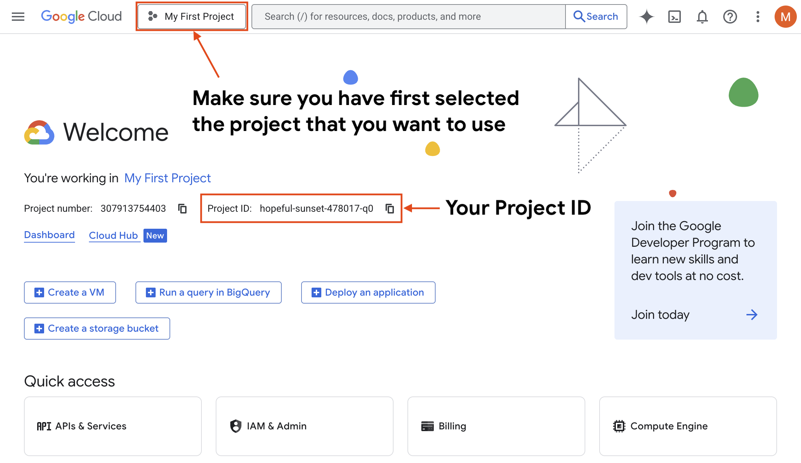

# エージェント ランタイムにデプロイする

<div class="language-support-tag" title="Agent Runtime currently supports only Python.">
    <span class="lst-supported">Supported in ADK</span><span class="lst-python">Python</span>
</div>

この展開手順では、標準的な展開を実行する方法について説明します。
Google Cloud への ADK エージェント コード
[Agent Runtime](https://cloud.google.com/vertex-ai/generative-ai/docs/agent-engine/overview)。
既存の Google Cloud がある場合は、このデプロイ パスに従う必要があります。
プロジェクト、およびエージェントへの ADK エージェントのデプロイを慎重に管理したい場合
実行環境。これらの手順では、Cloud Console、gcloud を使用します。
コマンド ライン インターフェイス、および ADK コマンド ライン インターフェイス (ADK CLI)。この道
すでに Google Cloud の構成に慣れているユーザーに推奨します
プロジェクト、および運用環境への展開を準備しているユーザー。

これらの手順では、ADK プロジェクトを Google Cloud Agent にデプロイする方法について説明します。
ランタイム環境には次の段階が含まれます。

* [Setup Google Cloud project](#setup-cloud-project)
* [Prepare agent project folder](#define-your-agent)
* [Deploy the agent](#deploy-agent)

## Google Cloud プロジェクトをセットアップします {#setup-cloud-project}

エージェントをエージェント ランタイムにデプロイするには、Google Cloud プロジェクトが必要です。

1. **Google Cloud にログイン**:
    * Google Cloud の**既存ユーザー**の場合:
        * 経由でサインインします
          [https://console.cloud.google.com](https://console.cloud.google.com)
        * 以前に有効期限が切れた無料トライアルを使用したことがある場合は、次の操作が必要になる場合があります。
          にアップグレードする
          [Paid billing account](https://docs.cloud.google.com/free/docs/free-cloud-features#how-to-upgrade)。
    * Google Cloud の**新規ユーザー**の場合:
        * に登録できます。
          [Free Trial program](https://docs.cloud.google.com/free/docs/free-cloud-features)。
          無料トライアルでは、91 日間以上さまざまなサービスに使用できる 300 ドルのウェルカム クレジットが付与されます。
          [Google Cloud products](https://docs.cloud.google.com/free/docs/free-cloud-features#during-free-trial)
          そして料金は請求されません。無料トライアル期間中は、次の機能にもアクセスできます。
          [Google Cloud Free Tier](https://docs.cloud.google.com/free/docs/free-cloud-features#free-tier)、
          毎月指定された期間まで、選択した製品を無料で使用できるようになります
          制限、および製品固有の無料トライアルまで。

2. **Google Cloud プロジェクトを作成します**
    ※ すでに既存の Google Cloud プロジェクトがある場合はそれを使用できますが、
      このプロセスでは、プロジェクトに新しいサービスが追加される可能性があることに注意してください。
    * 新しい Google Cloud プロジェクトを作成したい場合は、新しいプロジェクトを作成できます
      [Create Project](https://console.cloud.google.com/projectcreate) で
      ページ。

3. **Google Cloud プロジェクト ID を取得します**
    * Google Cloud プロジェクト ID が必要です。これは GCP で確認できます。
      ホームページ。プロジェクト ID (ハイフン付きの英数字) を必ずメモしてください。
      プロジェクト番号 (数値) ではありません。

    

4. **プロジェクトでエージェント プラットフォームを有効にする**
    ※Agent Runtimeを使用するには、[enable the Agent Platform API](https://console.cloud.google.com/apis/library/aiplatform.googleapis.com)が必要です。 「有効にする」ボタンをクリックして API を有効にします。有効にすると、
    「API が有効」と表示されるはずです。

5. **プロジェクトで Cloud Resource Manager API を有効にする**
    ※Agent Runtimeを使用するには、[enable the Cloud Resource Manager API](https://console.developers.google.com/apis/api/cloudresourcemanager.googleapis.com/overview)が必要です。 「有効にする」ボタンをクリックして API を有効にします。有効にすると、「API 有効」と表示されます。

## コーディング環境をセットアップする {#prerequisites-coding-env}

Google Cloud プロジェクトの準備が完了したので、コーディングに戻ることができます。
環境。これらの手順では、コーディング内のターミナルにアクセスする必要があります。
コマンドライン命令を実行する環境。

### Google Cloud でコーディング環境を認証する

* あなたとあなたのコーディング環境を認証する必要があります。
    コードは Google Cloud とやり取りできます。これを行うには、gcloud CLI が必要です。
    gcloud CLI を使用したことがない場合は、まず次のことを行う必要があります。
    [download and install it](https://docs.cloud.google.com/sdk/docs/install-sdk)
    以下の手順に進む前に、次のことを行ってください。

* ターミナルで次のコマンドを実行して Google Cloud にアクセスします
    ユーザーとしてプロジェクトを実行します。

    ```shell
    gcloud auth login
    ```

    認証後、次のメッセージが表示されます。
    `You are now authenticated with the gcloud CLI!`。

* 次のコマンドを実行してコードを認証し、動作できるようにします。
    Googleクラウド:

    ```shell
    gcloud auth application-default login
    ```

    認証後、次のメッセージが表示されます。
    `You are now authenticated with the gcloud CLI!`。

* (オプション) gcloud でデフォルトのプロジェクトを設定または変更する必要がある場合は、
    使用できます:

    ```shell
    gcloud config set project MY-PROJECT-ID
    ```

### エージェントを定義します {#define-your-agent}

Google Cloud とコーディング環境が準備できたら、デプロイする準備が整いました。
あなたのエージェント。この手順では、エージェント プロジェクト フォルダーがあることを前提としています。
のような:

```shell
multi_tool_agent/
├── .env
├── __init__.py
└── agent.py
```

プロジェクト ファイルと形式の詳細については、
[multi_tool_agent](https://github.com/google/adk-docs/tree/main/examples/python/snippets/get-started/multi_tool_agent)
コードサンプル。

## エージェントをデプロイする {#deploy-agent}

`adk deploy` コマンド ライン ツールを使用して、端末からデプロイできます。これ
プロセスはコードをパッケージ化し、コンテナーに構築して、
マネージド エージェント ランタイム サービス。このプロセスには数分かかる場合があります。

次のデプロイ コマンドの例では、`multi_tool_agent` サンプル コードを次のように使用します。
デプロイするプロジェクト:

```shell
PROJECT_ID=my-project-id
LOCATION_ID=us-central1

adk deploy agent_engine \
        --project=$PROJECT_ID \
        --region=$LOCATION_ID \
        --display_name="My First Agent" \
        multi_tool_agent
```

`region` の場合、サポートされている地域のリストは、
[Agent Builder locations page](https://docs.cloud.google.com/agent-builder/locations#supported-regions-agent-engine)。
`adk deploy agent_engine` コマンドの CLI オプションについては、「
[ADK CLI Reference](/api-reference/cli/#adk-deploy-agent-engine)。

### デプロイコマンドの出力

正常にデプロイされると、次の出力が表示されるはずです。

```shell
Creating AgentEngine
Create AgentEngine backing LRO: projects/123456789/locations/us-central1/reasoningEngines/751619551677906944/operations/2356952072064073728
View progress and logs at https://console.cloud.google.com/logs/query?project=hopeful-sunset-478017-q0
AgentEngine created. Resource name: projects/123456789/locations/us-central1/reasoningEngines/751619551677906944
To use this AgentEngine in another session:
agent_engine = vertexai.agent_engines.get('projects/123456789/locations/us-central1/reasoningEngines/751619551677906944')
Cleaning up the temp folder: /var/folders/k5/pv70z5m92s30k0n7hfkxszfr00mz24/T/agent_engine_deploy_src/20251219_134245
```

これで、エージェントがデプロイされた `RESOURCE_ID` が作成されたことに注意してください (これは
上の例では `751619551677906944`)。このID番号も必要です
エージェント ランタイムでエージェントを使用するには、他の値を使用します。

## エージェント ランタイムでのエージェントの使用

ADK プロジェクトのデプロイが完了したら、エージェントにクエリを実行できます。
Agent Platform SDK、Python リクエスト ライブラリ、または REST API クライアントを使用します。これ
このセクションでは、エージェントと対話するために必要な情報について説明します。
また、エージェントの REST API と対話するための URL を構築する方法も説明します。

Agent Runtime でエージェントと対話するには、次のものが必要です。

* **PROJECT_ID** (例: "my-project-id")。
    [project details page](https://console.cloud.google.com/iam-admin/settings)
* **LOCATION_ID** (例: "us-central1")、エージェントのデプロイに使用しました
* **RESOURCE_ID** (例: "751619551677906944")。
    [Agent Runtime UI](https://console.cloud.google.com/vertex-ai/agents/agent-engines)

クエリ URL の構造は次のとおりです。

```shell
https://$(LOCATION_ID)-aiplatform.googleapis.com/v1/projects/$(PROJECT_ID)/locations/$(LOCATION_ID)/reasoningEngines/$(RESOURCE_ID):query
```

この URL 構造を使用して、エージェントからリクエストを行うことができます。詳細については
リクエストの作成方法については、エージェント ランタイムのドキュメントの手順を参照してください。
[Use an Agent Development Kit agent](https://docs.cloud.google.com/agent-builder/agent-engine/use/adk#rest-api)。
エージェント ランタイムのドキュメントを確認して、エージェント ランタイムの管理方法について学ぶこともできます。
[deployed agent](https://docs.cloud.google.com/agent-builder/agent-engine/manage/overview)。
導入されたエージェントのテストと対話の詳細については、次を参照してください。
[Test deployed agents in Agent Runtime](/deploy/agent-runtime/test/)。

### 監視と検証

*展開ステータスは、
    [Agent Runtime UI](https://console.cloud.google.com/vertex-ai/agents/agent-engines)
    Google Cloud コンソールで。
* 詳細については、エージェント ランタイムのドキュメントを参照してください。
    [deploying an agent](https://cloud.google.com/vertex-ai/generative-ai/docs/agent-engine/deploy)
    そして
    [managing deployed agents](https://cloud.google.com/vertex-ai/generative-ai/docs/agent-engine/manage/overview)。

## デプロイされたエージェントをテストする

ADK エージェントのデプロイメントが完了したら、ワークフローをテストする必要があります。
新しいホスト環境。 ADK エージェントのテストの詳細については、
エージェント ランタイムにデプロイされます。を参照してください。
[Test deployed agents in Agent Runtime](/deploy/agent-runtime/test/)。
