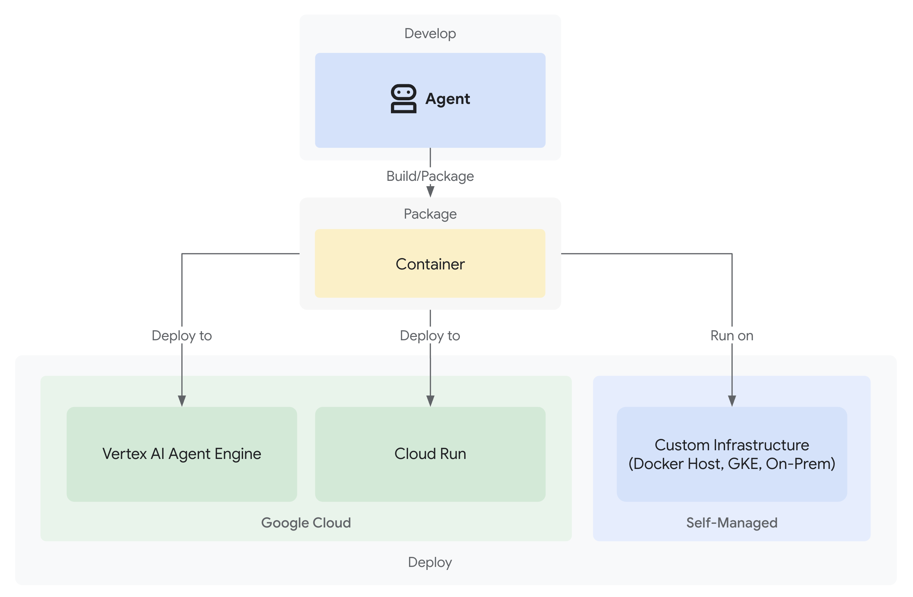

# エージェントのデプロイ

ADK を使用してエージェントをビルドしてテストしたら、次のステップは、本番環境でアクセス、クエリ、使用したり、他のアプリケーションと統合したりできるようにデプロイすることです。デプロイにより、エージェントはローカルの開発マシンからスケーラブルで信頼性の高い環境に移動します。

## デプロイオプション

ADK エージェントは、本番環境への対応やカスタムの柔軟性に関するニーズに基づいて、さまざまな環境にデプロイできます。

### Vertex AI のエージェント エンジン

[エージェント エンジン](agent-engine.md) は、ADK などのフレームワークで構築された AI エージェントのデプロイ、管理、スケーリングのために特別に設計された、Google Cloud 上のフルマネージドの自動スケーリング サービスです。

[Vertex AI エージェント エンジンへのエージェントのデプロイ](agent-engine.md) の詳細をご覧ください。

### Cloud Run

[Cloud Run](https://cloud.google.com/run) は、エージェントをコンテナベースのアプリケーションとして実行できる、Google Cloud 上のマネージド自動スケーリング コンピューティング プラットフォームです。

[Cloud Run へのエージェントのデプロイ](cloud-run.md) の詳細をご覧ください。

### Google Kubernetes Engine (GKE)

[Google Kubernetes Engine (GKE)](https://cloud.google.com/kubernetes-engine) は、エージェントをコンテナ化された環境で実行できる、Google Cloud のマネージド Kubernetes サービスです。GKE は、デプロイをより詳細に制御する必要がある場合や、オープンモデルを実行する場合に適したオプションです。

[GKE へのエージェントのデプロイ](gke.md) の詳細をご覧ください。

### その他のコンテナ対応インフラストラクチャ

エージェントを手動でコンテナ イメージにパッケージ化し、コンテナ イメージをサポートする任意の環境で実行できます。たとえば、Docker または Podman でローカルに実行できます。これは、オフラインまたは切断された状態で実行する場合や、Google Cloud に接続されていないシステムで実行する場合に適したオプションです。

[Cloud Run へのエージェントのデプロイ](cloud-run.md#deployment-commands) の手順に従ってください。gcloud CLI の「デプロイ コマンド」セクションに、FastAPI エントリ ポイントと Dockerfile の例があります。
