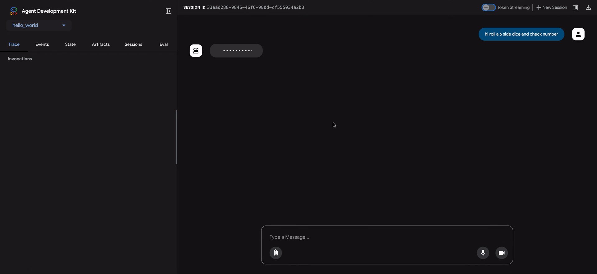

# なぜエージェントを評価するのか

<div class="language-support-tag">
    <span class="lst-supported">ADKでサポート</span><span class="lst-python">Python</span>
</div>

従来のソフトウェア開発では、単体テストと統合テストによって、コードが期待どおりに機能し、変更を通じて安定しているという確信が得られます。これらのテストは、明確な「合格/不合格」のシグナルを提供し、さらなる開発を導きます。しかし、LLMエージェントは、従来のテストアプローチでは不十分なレベルの変動性を導入します。

モデルの確率的な性質により、決定論的な「合格/不合格」のアサーションは、エージェントのパフォーマンス評価にはしばしば不適切です。代わりに、最終的な出力とエージェントの軌跡（解決策に到達するために実行された一連のステップ）の両方の定性的な評価が必要です。これには、エージェントの決定の質、その推論プロセス、および最終結果の評価が含まれます。

これは設定に多くの余分な作業が必要なように思えるかもしれませんが、評価を自動化するための投資はすぐに元が取れます。プロトタイプを超えて進歩するつもりなら、これは強く推奨されるベストプラクティスです。


## エージェント評価の準備

エージェント評価を自動化する前に、明確な目標と成功基準を定義します。

* **成功の定義：** エージェントにとって成功した結果とは何ですか？
* **重要なタスクの特定：** エージェントが達成しなければならない重要なタスクは何ですか？
* **関連するメトリックの選択：** パフォーマンスを測定するために追跡するメトリックは何ですか？

これらの考慮事項は、評価シナリオの作成を導き、実際の展開でエージェントの動作を効果的に監視できるようにします。

## 何を評価するか？

概念実証と本番環境に対応したAIエージェントの間のギャップを埋めるには、堅牢で自動化された評価フレームワークが不可欠です。主に最終的な出力に焦点を当てる生成モデルの評価とは異なり、エージェントの評価には、意思決定プロセスのより深い理解が必要です。エージェントの評価は、次の2つのコンポーネントに分けることができます。

1. **軌跡とツールの使用の評価：** ツールの選択、戦略、アプローチの効率など、エージェントが解決策に到達するために実行するステップを分析します。
2. **最終応答の評価：** エージェントの最終的な出力の品質、関連性、および正確性を評価します。

軌跡は、エージェントがユーザーに戻る前に実行したステップのリストにすぎません。それを、エージェントが実行したと予想されるステップのリストと比較できます。

### 軌跡とツールの使用の評価

ユーザーに応答する前に、エージェントは通常、「軌跡」と呼ばれる一連のアクションを実行します。用語を明確にするためにユーザー入力をセッション履歴と比較したり、ポリシー文書を検索したり、ナレッジベースを検索したり、チケットを保存するためにAPIを呼び出したりする場合があります。これをアクションの「軌跡」と呼びます。エージェントのパフォーマンスを評価するには、その実際の軌跡を予想される、または理想的な軌跡と比較する必要があります。この比較により、エージェントのプロセスのエラーと非効率性が明らかになる可能性があります。予想される軌跡は、エージェントが実行すると予想されるステップのリストであるグラウンドトゥルースを表します。

例：

```python
# 軌跡評価は比較します
expected_steps = ["determine_intent", "use_tool", "review_results", "report_generation"]
actual_steps = ["determine_intent", "use_tool", "review_results", "report_generation"]
```

ADKは、グラウンドトゥルースベースとルーブリックベースの両方のツール使用評価メトリックを提供します。エージェントの特定の要件と目標に適したメトリックを選択するには、[基準に関する推奨事項](#recommendations-on-criteria)を参照してください。

## ADKによる評価の仕組み

ADKは、事前に定義されたデータセットと評価基準に対してエージェントのパフォーマンスを評価するための2つの方法を提供します。概念的には似ていますが、処理できるデータの量が異なり、通常、それぞれに適したユースケースが決まります。

### 最初のアプローチ：テストファイルの使用

このアプローチでは、それぞれが単一の単純なエージェントとモデルの相互作用（セッション）を表す個別のテストファイルを作成します。これは、アクティブなエージェント開発中に最も効果的であり、単体テストの一形態として機能します。これらのテストは、迅速な実行のために設計されており、単純なセッションの複雑さに焦点を当てる必要があります。各テストファイルには、複数のターンで構成される単一のセッションが含まれています。ターンは、ユーザーとエージェント間の単一の相互作用を表します。各ターンには次のものが含まれます。

-   `ユーザーコンテンツ`：ユーザーが発行したクエリ。
-   `予想される中間ツールの使用軌跡`：エージェントがユーザーのクエリに正しく応答するために行うと予想されるツールの呼び出し。
-   `予想される中間エージェントの応答`：これらは、エージェント（またはサブエージェント）が最終的な回答を生成する過程で生成する自然言語の応答です。これらの自然言語の応答は、通常、ルートエージェントが目標を達成するためにサブエージェントに依存するマルチエージェントシステムのアーティファクトです。これらの中間応答は、エンドユーザーにとっては興味がないかもしれませんが、システムの開発者/所有者にとっては、エージェントが最終的な応答を生成するために正しいパスをたどったという確信を与えるため、非常に重要です。
-   `最終応答`：エージェントからの予想される最終応答。

ファイルには、たとえば`evaluation.test.json`のような任意の名前を付けることができます。フレームワークは`.test.json`サフィックスのみをチェックし、ファイル名の前の部分は制約されません。テストファイルは、正式なPydanticデータモデルによってサポートされています。2つの主要なスキーマファイルは、[Eval Set](https://github.com/google/adk-python/blob/main/src/google/adk/evaluation/eval_set.py)と[Eval Case](https://github.com/google/adk-python/blob/main/src/google/adk/evaluation/eval_case.py)です。以下に、いくつかの例を含むテストファイルを示します。

*（注：コメントは説明のために含まれており、JSONを有効にするには削除する必要があります。）*

```json
# このドキュメントを読みやすくするために、一部のフィールドは削除されていることに注意してください。
{
  "eval_set_id": "home_automation_agent_light_on_off_set",
  "name": "",
  "description": "これは、エージェントの`x`の動作を単体テストするために使用される評価セットです",
  "eval_cases": [
    {
      "eval_id": "eval_case_id",
      "conversation": [
        {
          "invocation_id": "b7982664-0ab6-47cc-ab13-326656afdf75", # 呼び出しの一意の識別子。
          "user_content": { # この呼び出しでユーザーが提供したコンテンツ。これがクエリです。
            "parts": [
              {
                "text": "寝室のdevice_2をオフにしてください。"
              }
            ],
            "role": "user"
          },
          "final_response": { # ベンチマークの参照として機能するエージェントからの最終応答。
            "parts": [
              {
                "text": "device_2のステータスをオフに設定しました。"
              }
            ],
            "role": "model"
          },
          "intermediate_data": {
            "tool_uses": [ # 時系列のツール使用軌跡。
              {
                "args": {
                  "location": "Bedroom",
                  "device_id": "device_2",
                  "status": "OFF"
                },
                "name": "set_device_info"
              }
            ],
            "intermediate_responses": [] # 中間サブエージェントの応答。
          }
        }
      ],
      "session_input": { # 初期のセッション入力。
        "app_name": "home_automation_agent",
        "user_id": "test_user",
        "state": {}
      }
    }
  ]
}
```

テストファイルはフォルダに整理できます。オプションで、フォルダには評価基準を指定する`test_config.json`ファイルを含めることもできます。

#### Pydanticスキーマでサポートされていないテストファイルを移行する方法は？

注：テストファイルが[EvalSet](https://github.com/google/adk-python/blob/main/src/google/adk/evaluation/eval_set.py)スキーマファイルに準拠していない場合は、このセクションが該当します。

既存の`*.test.json`ファイルをPydanticでサポートされているスキーマに移行するには、`AgentEvaluator.migrate_eval_data_to_new_schema`を使用してください。

このユーティリティは、現在のテストデータファイルとオプションの初期セッションファイルを受け取り、新しい形式でシリアル化されたデータを含む単一の出力jsonファイルを生成します。新しいスキーマはよりまとまりがあるため、古いテストデータファイルと初期セッションファイルの両方を無視（または削除）できます。

### 2番目のアプローチ：Evalsetファイルの使用

evalsetアプローチでは、「evalset」と呼ばれる専用のデータセットを利用して、エージェントとモデルの相互作用を評価します。テストファイルと同様に、evalsetにはサンプルの相互作用が含まれています。ただし、evalsetには複数の、場合によっては長いセッションを含めることができるため、複雑なマルチターンの会話をシミュレートするのに理想的です。複雑なセッションを表すことができるため、evalsetは統合テストに適しています。これらのテストは、より広範な性質のため、通常、単体テストよりも頻繁に実行されません。

evalsetファイルには、それぞれが個別のセッションを表す複数の「eval」が含まれています。各evalは、ユーザーのクエリ、予想されるツールの使用、予想される中間エージェントの応答、および参照応答を含む1つ以上の「ターン」で構成されます。これらのフィールドは、テストファイルアプローチと同じ意味を持ちます。あるいは、evalは、エージェントとのユーザーの相互作用を[動的にシミュレート](./user-sim.md)するために使用される*会話シナリオ*を定義できます。各evalは一意の名前で識別されます。さらに、各evalには関連する初期セッション状態が含まれています。

evalsetを手動で作成するのは複雑な場合があるため、関連するセッションをキャプチャし、evalset内でevalに簡単に変換するのに役立つUIツールが提供されています。評価にWeb UIを使用する方法の詳細については、以下を参照してください。以下に、2つのセッションを含むevalsetの例を示します。evalセットファイルは、正式なPydanticデータモデルによってサポートされています。2つの主要なスキーマファイルは、[Eval Set](https://github.com/google/adk-python/blob/main/src/google/adk/evaluation/eval_set.py)と[Eval Case](https://github.com/google/adk-python/blob/main/src/google/adk/evaluation/eval_case.py)です。

!!! warning
    このevalset評価方法では、有料サービスである[Vertex Gen AI Evaluation Service API](https://cloud.google.com/vertex-ai/generative-ai/docs/model-reference/evaluation)を使用する必要があります。

*（注：コメントは説明のために含まれており、JSONを有効にするには削除する必要があります。）*

```json
# このドキュメントを読みやすくするために、一部のフィールドは削除されていることに注意してください。
{
  "eval_set_id": "eval_set_example_with_multiple_sessions",
  "name": "複数のセッションを持つ評価セット",
  "description": "この評価セットは、評価セットに複数のセッションを含めることができることを示す例です。",
  "eval_cases": [
    {
      "eval_id": "session_01",
      "conversation": [
        {
          "invocation_id": "e-0067f6c4-ac27-4f24-81d7-3ab994c28768",
          "user_content": {
            "parts": [
              {
                "text": "何ができますか？"
              }
            ],
            "role": "user"
          },
          "final_response": {
            "parts": [
              {

                "text": "さまざまなサイズのサイコロを振ったり、数字が素数かどうかを確認したりできます。"
              }
            ],
            "role": null
          },
          "intermediate_data": {
            "tool_uses": [],
            "intermediate_responses": []
          }
        },
      ],
      "session_input": {
        "app_name": "hello_world",
        "user_id": "user",
        "state": {}
      }
    },
    {
      "eval_id": "session_02",
      "conversation": [
        {
          "invocation_id": "e-92d34c6d-0a1b-452a-ba90-33af2838647a",
          "user_content": {
            "parts": [
              {
                "text": "19面体のサイコロを振ってください"
              }
            ],
            "role": "user"
          },
          "final_response": {
            "parts": [
              {
                "text": "17が出ました。"
              }
            ],
            "role": null
          },
          "intermediate_data": {
            "tool_uses": [],
            "intermediate_responses": []
          }
        },
        {
          "invocation_id": "e-bf8549a1-2a61-4ecc-a4ee-4efbbf25a8ea",
          "user_content": {
            "parts": [
              {
                "text": "10面体のサイコロを2回振って、9が素数かどうかを確認してください"
              }
            ],
            "role": "user"
          },
          "final_response": {
            "parts": [
              {
                "text": "サイコロを振って4と7が出ました。9は素数ではありません。\n"
              }
            ],
            "role": null
          },
          "intermediate_data": {
            "tool_uses": [
              {
                "id": "adk-1a3f5a01-1782-4530-949f-07cf53fc6f05",
                "args": {
                  "sides": 10
                },
                "name": "roll_die"
              },
              {
                "id": "adk-52fc3269-caaf-41c3-833d-511e454c7058",
                "args": {
                  "sides": 10
                },
                "name": "roll_die"
              },
              {
                "id": "adk-5274768e-9ec5-4915-b6cf-f5d7f0387056",
                "args": {
                  "nums": [
                    9
                  ]
                },
                "name": "check_prime"
              }
            ],
            "intermediate_responses": [
              [
                "data_processing_agent",
                [
                  {
                    "text": "10面体のサイコロを2回振りました。1回目は5、2回目は3です。\n"
                  }
                ]
              ]
            ]
          },
        }
      ],
      "session_input": {
        "app_name": "hello_world",
        "user_id": "user",
        "state": {}
      }
    }
  ]
}
```

#### Pydanticスキーマでサポートされていない評価セットファイルを移行する方法は？

注：評価セットファイルが[EvalSet](https://github.com/google/adk-python/blob/main/src/google/adk/evaluation/eval_set.py)スキーマファイルに準拠していない場合は、このセクションが該当します。

評価セットデータの保守担当者に応じて、2つのルートがあります。

1.  **ADK UIによって保守される評価セットデータ** ADK UIを使用して評価セットデータを保守する場合は、*何もする必要はありません*。

2.  **手動で開発および保守され、ADK評価CLIで使用される評価セットデータ** 移行ツールが開発中です。それまでは、ADK評価CLIコマンドは古い形式のデータを引き続きサポートします。

### 評価基準

ADKは、ツールの軌跡の一致からLLMベースの応答品質評価まで、エージェントのパフォーマンスを評価するためのいくつかの組み込み基準を提供します。利用可能な基準の詳細なリストとそれらを使用するタイミングに関するガイダンスについては、[評価基準](./criteria.md)を参照してください。

以下は、利用可能なすべての基準の概要です。

*   `tool_trajectory_avg_score`：ツール呼び出しの軌跡の完全一致。
*   `response_match_score`：参照応答とのROUGE-1類似度。
*   `final_response_match_v2`：参照応答とのLLM判定による意味的一致。
*   `rubric_based_final_response_quality_v1`：カスタムルーブリックに基づくLLM判定による最終応答品質。
*   `rubric_based_tool_use_quality_v1`：カスタムルーブリックに基づくLLM判定によるツール使用品質。
*   `hallucinations_v1`：コンテキストに対するエージェント応答のLLM判定によるグラウンディング。
*   `safety_v1`：エージェント応答の安全性/無害性。

評価基準が指定されていない場合は、次のデフォルト構成が使用されます。

* `tool_trajectory_avg_score`：デフォルトは1.0で、ツール使用軌跡で100％の一致が必要です。
* `response_match_score`：デフォルトは0.8で、エージェントの自然言語応答にわずかな誤差を許容します。

以下は、カスタム評価基準を指定する`test_config.json`ファイルの例です。

```json
{
  "criteria": {
    "tool_trajectory_avg_score": 1.0,
    "response_match_score": 0.8
  }
}
```

#### 基準に関する推奨事項

評価目標に基づいて基準を選択します。

*   **CI/CDパイプラインまたは回帰テストでテストを有効にする：** `tool_trajectory_avg_score`と`response_match_score`を使用します。これらの基準は高速で予測可能であり、頻繁な自動チェックに適しています。
*   **信頼できる参照応答を評価する：** `final_response_match_v2`を使用して意味的同等性を評価します。このLLMベースのチェックは、完全一致よりも柔軟であり、エージェントの応答が参照応答と同じ意味を持つかどうかをより適切にキャプチャします。
*   **参照応答なしで応答品質を評価する：** `rubric_based_final_response_quality_v1`を使用します。これは、信頼できる参照がないが、良い応答の属性を定義できる場合に役立ちます（例：「応答は簡潔です」、「応答は役立つトーンです」）。
*   **ツール使用の正しさを評価する：** `rubric_based_tool_use_quality_v1`を使用します。これにより、特定のツールが呼び出されたことや、ツールが正しい順序で呼び出されたこと（例：「ツールAはツールBの前に呼び出す必要があります」）などを確認することで、エージェントの推論プロセスを検証できます。
*   **応答がコンテキストに基づいているかどうかを確認する：** `hallucinations_v1`を使用して、エージェントが利用可能な情報（ツールの出力など）によって裏付けられていない、または矛盾する主張をしているかどうかを検出します。
*   **有害なコンテンツを確認する：** `safety_v1`を使用して、エージェントの応答が安全であり、安全ポリシーに違反していないことを確認します。

さらに、予想されるエージェントツールの使用および/または応答に関する情報を必要とする基準は、[ユーザーシミュレーション](./user-sim.md)との組み合わせではサポートされていません。現在、`hallucinations_v1`および`safety_v1`基準のみがそのような評価をサポートしています。

### ユーザーシミュレーション

会話型エージェントを評価する場合、会話が予期しない方向に進む可能性があるため、固定されたユーザープロンプトのセットを使用することは必ずしも実用的ではありません。たとえば、エージェントがタスクを実行するためにユーザーに2つの値を指定する必要がある場合、それらの値を一度に1つずつ、または一度に両方要求する場合があります。この問題を解決するために、ADKでは、AIモデルによって動的に生成されるユーザープロンプトを使用して、特定の*会話シナリオ*でエージェントの動作をテストできます。ユーザーシミュレーションを使用した評価の設定の詳細については、[ユーザーシミュレーション](./user-sim.md)を参照してください。

## ADKで評価を実行する方法

開発者は、次の方法でADKを使用してエージェントを評価できます。

1. **WebベースのUI（**`adk web`**）：** Webベースのインターフェイスを介してエージェントを対話的に評価します。
2. **プログラムで（**`pytest`**）：** `pytest`とテストファイルを使用して、評価をテストパイプラインに統合します。
3. **コマンドラインインターフェイス（**`adk eval`**）：** コマンドラインから直接、既存の評価セットファイルで評価を実行します。

### 1. `adk web` - Web UIを介して評価を実行する

Web UIは、エージェントを対話的に評価し、評価データセットを生成し、エージェントの動作を詳細に検査するための対話的な方法を提供します。

#### ステップ1：テストケースの作成と保存

1. `adk web <path_to_your_agents_folder>`を実行してWebサーバーを起動します。
2. Webインターフェイスで、エージェントを選択し、それと対話してセッションを作成します。
3. インターフェイスの右側にある**Eval**タブに移動します。
4. 新しい評価セットを作成するか、既存のものを選択します。
5. **「現在のセッションを追加」**をクリックして、会話を新しい評価ケースとして保存します。

#### ステップ2：テストケースの表示と編集

ケースが保存されると、リスト内のそのIDをクリックして検査できます。変更を加えるには、**現在の評価ケースを編集**アイコン（鉛筆）をクリックします。この対話型ビューでは、次のことができます。

* **変更** エージェントのテキスト応答を変更して、テストシナリオを洗練します。
* **削除** 会話から個々のエージェントメッセージを削除します。
* **削除** 不要になった場合は、評価ケース全体を削除します。


#### ステップ3：カスタムメトリックで評価を実行する

1. 評価セットから1つ以上のテストケースを選択します。
2. **評価を実行**をクリックします。**評価メトリック**ダイアログが表示されます。
3. ダイアログで、スライダーを使用して次のしきい値を構成します。
    * **ツール軌跡の平均スコア**
    * **応答一致スコア**
4. **開始**をクリックして、カスタム基準を使用して評価を実行します。評価履歴には、各実行に使用されたメトリックが記録されます。


#### ステップ4：結果の分析

実行が完了したら、結果を分析できます。

* **実行の失敗を分析する**：**合格**または**不合格**の結果をクリックします。失敗の場合は、`不合格`ラベルにカーソルを合わせると、**実際と予想の出力**の並べて比較と、失敗の原因となったスコアが表示されます。

### トレースビューによるデバッグ

ADK Web UIには、エージェントの動作をデバッグするための強力な**トレース**タブが含まれています。この機能は、評価中だけでなく、すべてのエージェントセッションで利用できます。

**トレース**タブは、エージェントの実行フローを詳細かつ対話的に検査する方法を提供します。トレースはユーザーメッセージごとに自動的にグループ化されるため、イベントの連鎖を簡単に追跡できます。

各トレース行は対話的です。

* トレース行にカーソルを合わせると、チャットウィンドウの対応するメッセージが強調表示されます。
* トレース行をクリックすると、4つのタブを持つ詳細な検査パネルが開きます。
    * **イベント**：生のイベントデータ。
    * **リクエスト**：モデルに送信されたリクエスト。
    * **応答**：モデルから受信した応答。
    * **グラフ**：ツール呼び出しとエージェントロジックフローの視覚的な表現。




トレースビューの青い行は、その相互作用からイベントが生成されたことを示します。これらの青い行をクリックすると、下部のイベント詳細パネルが開き、エージェントの実行フローに関するより深い洞察が得られます。

### 2. `pytest` - プログラムでテストを実行する

**`pytest`**を使用して、統合テストの一部としてテストファイルを実行することもできます。

#### コマンド例

```shell
pytest tests/integration/
```

#### テストコードの例

以下は、単一のテストファイルを実行する`pytest`テストケースの例です。

```py
from google.adk.evaluation.agent_evaluator import AgentEvaluator
import pytest

@pytest.mark.asyncio
async def test_with_single_test_file():
    """セッションファイルを介してエージェントの基本的な能力をテストします。"""
    await AgentEvaluator.evaluate(
        agent_module="home_automation_agent",
        eval_dataset_file_path_or_dir="tests/integration/fixture/home_automation_agent/simple_test.test.json",
    )
```

このアプローチにより、エージェントの評価をCI/CDパイプラインまたはより大きなテストスイートに統合できます。テストの初期セッション状態を指定する場合は、セッションの詳細をファイルに保存し、それを`AgentEvaluator.evaluate`メソッドに渡すことで実行できます。

### 3. `adk eval` - CLIを介して評価を実行する

コマンドラインインターフェイス（CLI）を介して評価セットファイルの評価を実行することもできます。これはUIで実行されるのと同じ評価を実行しますが、自動化に役立ちます。つまり、このコマンドを通常のビルド生成および検証プロセスの一部として追加できます。

コマンドは次のとおりです。

```shell
adk eval \
    <AGENT_MODULE_FILE_PATH> \
    <EVAL_SET_FILE_PATH> \
    [--config_file_path=<PATH_TO_TEST_JSON_CONFIG_FILE>] \
    [--print_detailed_results]
```

例：

```shell
adk eval \
    samples_for_testing/hello_world \
    samples_for_testing/hello_world/hello_world_eval_set_001.evalset.json
```

各コマンドライン引数の詳細は次のとおりです。

* `AGENT_MODULE_FILE_PATH`：「agent」という名前のモジュールを含む`__init__.py`ファイルへのパス。「agent」モジュールには`root_agent`が含まれています。
* `EVAL_SET_FILE_PATH`：評価ファイルへのパス。1つ以上の評価セットファイルパスを指定できます。各ファイルについて、デフォルトですべての評価が実行されます。評価セットから特定の評価のみを実行する場合は、まず評価名のコンマ区切りリストを作成し、それをコロン`:`で区切って評価セットファイル名のサフィックスとして追加します。
* 例：`sample_eval_set_file.json:eval_1,eval_2,eval_3`
  `これにより、sample_eval_set_file.jsonからeval_1、eval_2、eval_3のみが実行されます`
* `CONFIG_FILE_PATH`：構成ファイルへのパス。
* `PRINT_DETAILED_RESULTS`：コンソールに詳細な結果を出力します。
