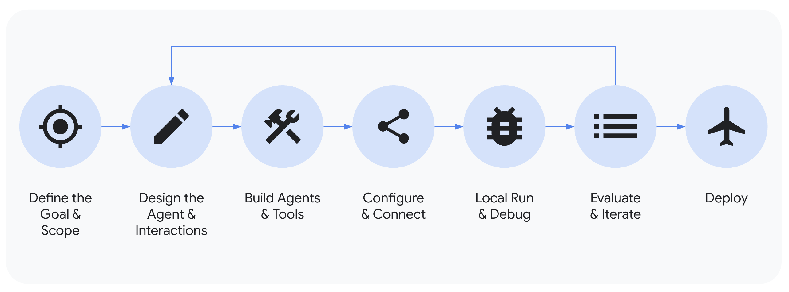

# Agent Development Kit (ADK)

 <b> エージェントの構築、評価、デプロイをシームレスに！ </b> 

ADKは、開発者がAI搭載エージェントを構築、管理、評価、デプロイできるように設計されています。ADKは、複雑なタスクやワークフローを処理できる、対話型および非対話型のエージェントを作成するための、堅牢で柔軟な環境を提供します。

## コアコンセプト

ADKは、その強力さと柔軟性を実現する、いくつかの主要な要素とコンセプトを中心に構築されています。以下にその要点を示します:

*   **エージェント (Agent):** 特定のタスクのために設計された基本的な作業単位(worker unit)です。エージェントは、複雑な推論のために言語モデル(`LlmAgent`)を使用したり、実行を決定論的に制御するコントローラー（「[ワークフローエージェント](../agents/workflow-agents/index.md)」と呼ばれる`SequentialAgent`, `ParallelAgent`, `LoopAgent`）として機能したりします。
*   **ツール (Tool):** エージェントに会話能力を超える機能を与え、外部APIとの対話、情報検索、コード実行、他のサービスの呼び出しなどを可能にします。
*   **コールバック (Callbacks):** エージェントのプロセスの特定の時点で実行するために提供するカスタムコードスニペットで、チェック、ロギング、または動作の変更を可能にします。
*   **セッション管理 (`Session` & `State`):** 単一の会話のコンテキスト(`Session`)を処理します。これには、その履歴(`Events`)とその会話におけるエージェントの作業メモリ(`State`)が含まれます。
*   **メモリ (Memory):** エージェントが*複数*のセッションにわたってユーザーに関する情報を記憶できるようにし、長期的なコンテキストを提供します（短期的なセッション`State`とは区別されます）。
*   **アーティファクト管理 (`Artifact`):** エージェントがセッションやユーザーに関連するファイルやバイナリデータ（画像、PDFなど）を保存、ロード、管理できるようにします。
*   **コード実行 (Code Execution):** エージェントが（通常はツールを介して）複雑な計算やアクションを実行するためにコードを生成・実行する能力です。
*   **プランニング (Planning):** エージェントが複雑な目標をより小さなステップに分解し、ReActプランナーのようにそれらを達成する方法を計画できる高度な機能です。
*   **モデル (Models):** `LlmAgent`を動かす基盤となるLLMで、その推論能力と言語理解能力を可能にします。
*   **イベント (Event):** セッション中に発生した事柄（ユーザーメッセージ、エージェントの返信、ツールの使用など）を表す基本的な通信単位であり、会話履歴を形成します。
*   **ランナー (Runner):** 実行フローを管理し、イベントに基づいてエージェントの相互作用を調整し、バックエンドサービスと連携するエンジンです。

***注:** マルチモーダルストリーミング、評価、デプロイ、デバッグ、トレースなどの機能も、より広範なADKエコシステムの一部であり、リアルタイムの対話と開発ライフサイクルをサポートします。*

## 主な機能

ADKは、エージェントアプリケーションを構築する開発者に、いくつかの主要な利点を提供します:

1.  **マルチエージェントシステムの設計:** 階層的に配置された、複数の特化したエージェントで構成されるアプリケーションを容易に構築できます。エージェントは複雑なタスクを連携して処理し、LLM駆動の転送や明示的な`AgentTool`呼び出しを用いてサブタスクを委任することで、モジュール式でスケーラブルなソリューションを実現します。
2.  **豊富なツールエコシステム:** エージェントに多様な機能を提供します。ADKは、カスタム関数(`FunctionTool`)の統合、他のエージェントをツールとして使用(`AgentTool`)、コード実行などの組み込み機能の活用、外部データソースやAPI（例: 検索、データベース）との対話をサポートします。長時間実行ツール（long-running tools）のサポートにより、非同期操作を効果的に処理できます。
3.  **柔軟なオーケストレーション:** 組み込みのワークフローエージェント(`SequentialAgent`, `ParallelAgent`, `LoopAgent`)とLLM駆動の動的ルーティングを併用して、複雑なエージェントのワークフローを定義します。これにより、予測可能なパイプラインと適応的なエージェントの振る舞いの両方が可能になります。
4.  **統合された開発者向けツール:** ローカルでの開発とイテレーションを容易にします。ADKには、エージェントの実行、実行ステップ（イベント、状態変化）の検査、対話のデバッグ、エージェント定義の可視化のためのコマンドラインインターフェース（CLI）や開発者UIなどのツールが含まれています。
5.  **ネイティブなストリーミングサポート:** 双方向ストリーミング（テキストおよび音声）のネイティブサポートにより、リアルタイムでインタラクティブな体験を構築します。これは、[Gemini開発者API向けのマルチモーダルLive API](https://ai.google.dev/gemini-api/docs/live)（または[Vertex AI向け](https://cloud.google.com/vertex-ai/generative-ai/docs/model-reference/multimodal-live)）のような基盤機能とシームレスに統合され、多くの場合、簡単な設定変更で有効化できます。
6.  **組み込みのエージェント評価:** エージェントのパフォーマンスを体系的に評価します。フレームワークには、マルチターンの評価データセットを作成し、品質を測定して改善を導くためにローカルで（CLIまたは開発UIを介して）評価を実行するツールが含まれています。
7.  **広範なLLMサポート:** GoogleのGeminiモデルに最適化されていますが、フレームワークは柔軟性を重視して設計されており、`BaseLlm`インターフェースを介してさまざまなLLM（オープンソースやファインチューニングされたモデルを含む可能性がある）との統合が可能です。
8.  **アーティファクト管理:** エージェントがファイルやバイナリデータを扱えるようにします。フレームワークは、エージェントが実行中に画像、ドキュメント、生成されたレポートなどのバージョン管理されたアーティファクトを保存、ロード、管理するためのメカニズム（`ArtifactService`、コンテキストメソッド）を提供します。
9.  **拡張性と相互運用性:** ADKはオープンなエコシステムを推進します。コアツールを提供しつつ、開発者がサードパーティのツールやデータコネクタを簡単に統合・再利用できるようにします。
10. **状態とメモリの管理:** `SessionService`によって管理される短期的な会話メモリ（`Session`内の`State`）を自動的に処理します。長期的な`Memory`サービスのための統合ポイントを提供し、エージェントが複数のセッションにわたってユーザー情報を記憶できるようにします。

## はじめに

*   最初のエージェントを構築する準備はできましたか？ [クイックスタートをお試しください](./quickstart.md)