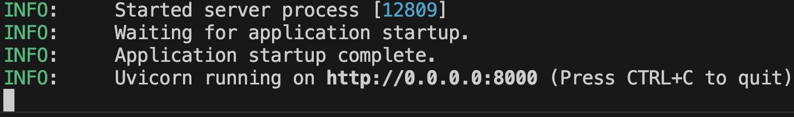

# マルチツールエージェントの構築

このクイックスタートでは、Agent Development Kit（ADK）のインストール、複数のツールを使用した基本的なエージェントの設定、ターミナルまたはインタラクティブなブラウザベースの開発UIでのローカル実行について説明します。

<!--  -->

このクイックスタートでは、Python 3.9以降またはJava 17以降とターミナルアクセスを備えたローカルIDE（VS Code、PyCharm、IntelliJ IDEAなど）を想定しています。この方法では、アプリケーションをマシン上で完全に実行し、内部開発に推奨されます。

## 1. 環境のセットアップとADKのインストール { #set-up-environment-install-adk }

=== "Python"

    仮想環境の作成とアクティブ化（推奨）：

    ```bash
    # 作成
    python -m venv .venv
    # アクティブ化（新しいターミナルごと）
    # macOS/Linux: source .venv/bin/activate
    # Windows CMD: .venv\Scripts\activate.bat
    # Windows PowerShell: .venv\Scripts\Activate.ps1
    ```

    ADKのインストール：

    ```bash
    pip install google-adk
    ```

=== "Java"

    ADKをインストールして環境をセットアップするには、次の手順に進みます。

## 2. エージェントプロジェクトの作成 { #create-agent-project }

### プロジェクトの構造

=== "Python"

    次のプロジェクト構造を作成する必要があります。

    ```console
    parent_folder/
        multi_tool_agent/
            __init__.py
            agent.py
            .env
    ```

    `multi_tool_agent`フォルダを作成します。

    ```bash
    mkdir multi_tool_agent/
    ```

    !!! info "Windowsユーザーへの注意"

        次のいくつかの手順でWindowsでADKを使用する場合、次のコマンド（`mkdir`、`echo`）は通常、ヌルバイトや不正なエンコーディングでファイルを生成するため、ファイルエクスプローラーまたはIDEを使用してPythonファイルを作成することをお勧めします。

    ### `__init__.py`

    次に、フォルダに`__init__.py`ファイルを作成します。

    ```shell
    echo "from . import agent" > multi_tool_agent/__init__.py
    ```

    これで、`__init__.py`は次のようになります。

    ```python title="multi_tool_agent/__init__.py"
    --8<-- "examples/python/snippets/get-started/multi_tool_agent/__init__.py"
    ```

    ### `agent.py`

    同じフォルダに`agent.py`ファイルを作成します。

    === "OS X &amp; Linux"
        ```shell
        touch multi_tool_agent/agent.py
        ```

    === "Windows"
        ```shell
        type nul > multi_tool_agent/agent.py
        ```

    次のコードをコピーして`agent.py`に貼り付けます。

    ```python title="multi_tool_agent/agent.py"
    --8<-- "examples/python/snippets/get-started/multi_tool_agent/agent.py"
    ```

    ### `.env`

    同じフォルダに`.env`ファイルを作成します。

    === "OS X &amp; Linux"
        ```shell
        touch multi_tool_agent/.env
        ```

    === "Windows"
        ```shell
        type nul > multi_tool_agent\.env
        ```

    このファイルの詳細については、[モデルのセットアップ](#set-up-the-model)の次のセクションで説明します。

=== "Java"

    Javaプロジェクトは通常、次のプロジェクト構造を特徴としています。

    ```console
    project_folder/
    ├── pom.xml (または build.gradle)
    ├── src/
    ├──    └── main/
    │       └── java/
    │           └── agents/
    │               └── multitool/
    └── test/
    ```

    ### `MultiToolAgent.java`の作成

    `src/main/java/agents/multitool/`ディレクトリの`agents.multitool`パッケージに`MultiToolAgent.java`ソースファイルを作成します。

    次のコードをコピーして`MultiToolAgent.java`に貼り付けます。

    ```java title="agents/multitool/MultiToolAgent.java"
    --8<-- "examples/java/cloud-run/src/main/java/agents/multitool/MultiToolAgent.java:full_code"
    ```


## 3. モデルのセットアップ { #set-up-the-model }

エージェントがユーザーの要求を理解し、応答を生成する能力は、大規模言語モデル（LLM）によって支えられています。エージェントは、この外部LLMサービスに安全に呼び出しを行う必要があり、そのためには**認証資格情報**が必要です。有効な認証がない場合、LLMサービスはエージェントの要求を拒否し、エージェントは機能できなくなります。

!!!tip "モデル認証ガイド"
    さまざまなモデルへの認証に関する詳細なガイドについては、[認証ガイド](../agents/models.md#google-ai-studio)を参照してください。これは、エージェントがLLMサービスに呼び出しを行えるようにするための重要なステップです。

=== "Gemini - Google AI Studio"
    1. [Google AI Studio](https://aistudio.google.com/apikey)からAPIキーを取得します。
    2. Pythonを使用している場合は、（`multi_tool_agent/`内にある）**`.env`**ファイルを開き、次のコードをコピーして貼り付けます。

        ```env title="multi_tool_agent/.env"
        GOOGLE_GENAI_USE_VERTEXAI=FALSE
        GOOGLE_API_KEY=PASTE_YOUR_ACTUAL_API_KEY_HERE
        ```

        Javaを使用している場合は、環境変数を定義します。

        ```console title="terminal"
        export GOOGLE_GENAI_USE_VERTEXAI=FALSE
        export GOOGLE_API_KEY=PASTE_YOUR_ACTUAL_API_KEY_HERE
        ```

    3. `PASTE_YOUR_ACTUAL_API_KEY_HERE`を実際の`API KEY`に置き換えます。

=== "Gemini - Google Cloud Vertex AI"
    1. [Google Cloudプロジェクト](https://cloud.google.com/vertex-ai/generative-ai/docs/start/quickstarts/quickstart-multimodal#setup-gcp)をセットアップし、[Vertex AI APIを有効](https://console.cloud.google.com/flows/enableapi?apiid=aiplatform.googleapis.com)にします。
    2. [gcloud CLI](https://cloud.google.com/vertex-ai/generative-ai/docs/start/quickstarts/quickstart-multimodal#setup-local)をセットアップします。
    3. `gcloud auth application-default login`を実行して、ターミナルからGoogle Cloudに認証します。
    4. Pythonを使用している場合は、（`multi_tool_agent/`内にある）**`.env`**ファイルを開きます。次のコードをコピーして貼り付け、プロジェクトIDと場所を更新します。

        ```env title="multi_tool_agent/.env"
        GOOGLE_GENAI_USE_VERTEXAI=TRUE
        GOOGLE_CLOUD_PROJECT=YOUR_PROJECT_ID
        GOOGLE_CLOUD_LOCATION=LOCATION
        ```

        Javaを使用している場合は、環境変数を定義します。

        ```console title="terminal"
        export GOOGLE_GENAI_USE_VERTEXAI=TRUE
        export GOOGLE_CLOUD_PROJECT=YOUR_PROJECT_ID
        export GOOGLE_CLOUD_LOCATION=LOCATION
        ```

=== "Gemini - Google Cloud Vertex AI（Expressモード）"
    1. 無料のGoogle Cloudプロジェクトにサインアップして、対象のアカウントでGeminiを無料で使用できます！
        * [Vertex AI Expressモードを使用したGoogle Cloudプロジェクト](https://cloud.google.com/vertex-ai/generative-ai/docs/start/express-mode/overview)のセットアップ
        * ExpressモードプロジェクトからAPIキーを取得します。このキーはADKで使用してGeminiモデルを無料で使用したり、Agent Engineサービスにアクセスしたりできます。
    2. Pythonを使用している場合は、（`multi_tool_agent/`内にある）**`.env`**ファイルを開きます。次のコードをコピーして貼り付け、プロジェクトIDと場所を更新します。

        ```env title="multi_tool_agent/.env"
        GOOGLE_GENAI_USE_VERTEXAI=TRUE
        GOOGLE_API_KEY=PASTE_YOUR_ACTUAL_EXPRESS_MODE_API_KEY_HERE
        ```

        Javaを使用している場合は、環境変数を定義します。

        ```console title="terminal"
        export GOOGLE_GENAI_USE_VERTEXAI=TRUE
        export GOOGLE_API_KEY=PASTE_YOUR_ACTUAL_EXPRESS_MODE_API_KEY_HERE
        ```

## 4. エージェントの実行 { #run-your-agent }

=== "Python"

    ターミナルを使用して、エージェントプロジェクトの親ディレクトリに移動します（例：`cd ..`を使用）。

    ```console
    parent_folder/      <-- このディレクトリに移動します
        multi_tool_agent/
            __init__.py
            agent.py
            .env
    ```

    エージェントと対話するには、複数の方法があります。

    === "開発UI（adk web）"

        !!! success "Vertex AIユーザー向けの認証設定"
            前の手順で**「Gemini - Google Cloud Vertex AI」**を選択した場合は、開発UIを起動する前にGoogle Cloudで認証する必要があります。

            このコマンドを実行し、プロンプトに従います。
            ```bash
            gcloud auth application-default login
            ```

            **注：**「Gemini - Google AI Studio」を使用している場合は、この手順をスキップしてください。

        次のコマンドを実行して、**開発UI**を起動します。

        ```shell
        adk web
        ```

        !!!info "Windowsユーザーへの注意"

            `_make_subprocess_transport NotImplementedError`が発生した場合は、代わりに`adk web --no-reload`を使用することを検討してください。


        **ステップ1：** 提供されたURL（通常は`http://localhost:8000`または`http://127.0.0.1:8000`）をブラウザで直接開きます。

        **ステップ2.** UIの左上隅にあるドロップダウンでエージェントを選択できます。「multi_tool_agent」を選択します。

        !!!note "トラブルシューティング"

            ドロップダウンメニューに「multi_tool_agent」が表示されない場合は、エージェントフォルダの**親フォルダ**（つまり、multi_tool_agentの親フォルダ）で`adk web`を実行していることを確認してください。

        **ステップ3.** これで、テキストボックスを使用してエージェントとチャットできます。

        


        **ステップ4.** 左側の`Events`タブを使用すると、アクションをクリックして個々の関数呼び出し、応答、モデル応答を検査できます。

        

        `Events`タブでは、`Trace`ボタンをクリックして、各関数呼び出しの遅延を示す各イベントのトレースログを確認することもできます。

        

        **ステップ5.** マイクを有効にしてエージェントと話すこともできます。

        !!!note "音声/動画ストリーミングのモデルサポート"

            ADKで音声/動画ストリーミングを使用するには、Live APIをサポートするGeminiモデルを使用する必要があります。ドキュメントでGemini Live APIをサポートする**モデルID**を見つけることができます。

            - [Google AI Studio：Gemini Live API](https://ai.google.dev/gemini-api/docs/models#live-api)
            - [Vertex AI：Gemini Live API](https://cloud.google.com/vertex-ai/generative-ai/docs/live-api)

            その後、以前に作成した`agent.py`ファイルの`root_agent`の`model`文字列を置き換えることができます（[セクションにジャンプ](#agentpy)）。コードは次のようになります。

            ```py
            root_agent = Agent(
                name="weather_time_agent",
                model="replace-me-with-model-id", #例：gemini-1.5-flash-live-001
                ...
            ```

        

    === "ターミナル（adk run）"

        !!! tip

            `adk run`を使用する場合、次のようにコマンドにテキストをパイプ処理することで、エージェントにプロンプトを挿入して開始できます。

            ```shell
            echo "ファイルの一覧表示から始めてください" | adk run file_listing_agent
            ```

        次のコマンドを実行して、Weatherエージェントとチャットします。

        ```
        adk run multi_tool_agent
        ```

        

        終了するには、Cmd/Ctrl+Cを使用します。

    === "APIサーバー（adk api_server）"

        `adk api_server`を使用すると、単一のコマンドでローカルのFastAPIサーバーを作成でき、エージェントをデプロイする前にローカルのcURLリクエストをテストできます。

        

        テストに`adk api_server`を使用する方法については、[APIサーバーの使用に関するドキュメント](/adk-docs/ja/runtime/api-server/)を参照してください。

=== "Java"

    ターミナルを使用して、エージェントプロジェクトの親ディレクトリに移動します（例：`cd ..`を使用）。

    ```console
    project_folder/                <-- このディレクトリに移動します
    ├── pom.xml (または build.gradle)
    ├── src/
    ├──    └── main/
    │       └── java/
    │           └── agents/
    │               └── multitool/
    │                   └── MultiToolAgent.java
    └── test/
    ```

    === "開発UI"

        ターミナルから次のコマンドを実行して、開発UIを起動します。

        **開発UIサーバーのメインクラス名を変更しないでください。**

        ```console title="terminal"
        mvn exec:java \
            -Dexec.mainClass="com.google.adk.web.AdkWebServer" \
            -Dexec.args="--adk.agents.source-dir=src/main/java" \
            -Dexec.classpathScope="compile"
        ```

        **ステップ1：** 提供されたURL（通常は`http://localhost:8080`または`http://127.0.0.1:8080`）をブラウザで直接開きます。

        **ステップ2.** UIの左上隅にあるドロップダウンでエージェントを選択できます。「multi_tool_agent」を選択します。

        !!!note "トラブルシューティング"

            ドロップダウンメニューに「multi_tool_agent」が表示されない場合は、Javaソースコードがある場所（通常は`src/main/java`）で`mvn`コマンドを実行していることを確認してください。

        **ステップ3.** これで、テキストボックスを使用してエージェントとチャットできます。

        

        **ステップ4.** 個々の関数呼び出し、応答、モデル応答をクリックして検査することもできます。

        

    === "Maven"

        Mavenを使用して、次のコマンドでJavaクラスの`main()`メソッドを実行します。

        ```console title="terminal"
        mvn compile exec:java -Dexec.mainClass="agents.multitool.MultiToolAgent"
        ```

    === "Gradle"

        Gradleを使用する場合、`build.gradle`または`build.gradle.kts`ビルドファイルの`plugins`セクションに次のJavaプラグインが必要です。

        ```groovy
        plugins {
            id('java')
            // その他のプラグイン
        }
        ```

        次に、ビルドファイルの他の場所で、トップレベルで、エージェントの`main()`メソッドを実行する新しいタスクを作成します。

        ```groovy
        tasks.register('runAgent', JavaExec) {
            classpath = sourceSets.main.runtimeClasspath
            mainClass = 'agents.multitool.MultiToolAgent'
        }
        ```

        最後に、コマンドラインで次のコマンドを実行します。

        ```console
        gradle runAgent
        ```


### 📝 試してみるプロンプトの例

* ニューヨークの天気は？
* ニューヨークの時間は？
* パリの天気は？
* パリの時間は？

## 🎉 おめでとうございます！

ADKを使用して最初のエージェントを正常に作成し、対話しました！

---

## 🛣️ 次のステップ

* **チュートリアルに進む**：エージェントにメモリ、セッション、状態を追加する方法を学びます：[チュートリアル](../tutorials/index.md)。
* **高度な構成を詳しく調べる：** プロジェクトの構造、構成、その他のインターフェイスの詳細については、[セットアップ](installation.md)セクションを参照してください。
* **コアコンセプトを理解する：** [エージェントの概念](../agents/index.md)について学びます。
