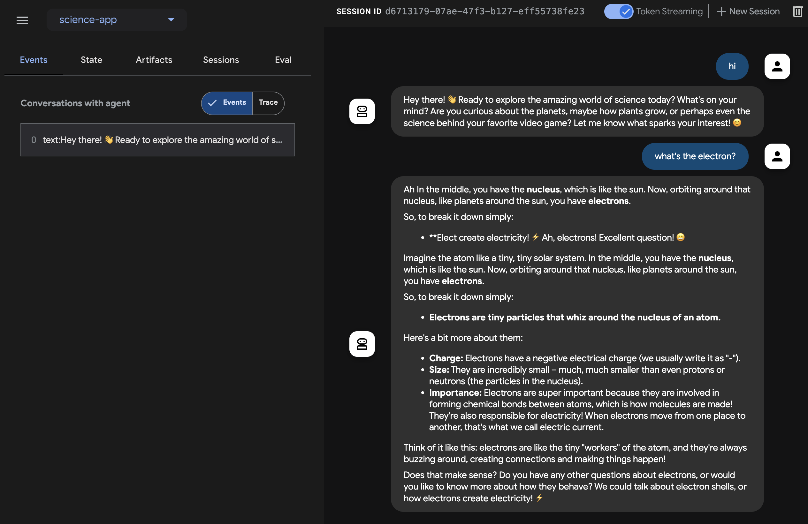

# Javaでストリーミングエージェントを構築する

このクイックスタートガイドでは、基本的なエージェントを作成し、Java で ADK ストリーミングを活用して、低遅延（Low-latency）の双方向音声インタラクションを実現する手順を説明します。

まず、Java と Maven の環境を設定し、プロジェクト構造を整理して、必要な依存関係を定義します。その後、シンプルな `ScienceTeacherAgent` を作成し、Dev UI を使用してテキストベースのストリーミング機能をテストします。さらに、ライブオーディオ通信を有効にして、エージェントを対話型の音声駆動アプリケーションへと進化させます。

## **最初のエージェントを作成する** {#create-your-first-agent}

### **前提条件**

*   このスタートガイドでは、Java でプログラミングを行います。マシンに **Java** がインストールされていることを確認してください。理想的には Java 17 以上を使用する必要があります（**java \-version** と入力して確認できます）。

*   Java 用の **Maven** ビルドツールも使用します。先に進む前に、[Maven がインストールされている](https://maven.apache.org/install.html)ことを確認してください（Cloud Top や Cloud Shell の場合はインストール済みですが、ご自身のノート PC の場合はインストールが必要かもしれません）。

### **プロジェクト構造の準備**

ADK Java を使い始めるために、以下のディレクトリ構造を持つ Maven プロジェクトを作成しましょう。

```
adk-agents/
├── pom.xml
└── src/
    └── main/
        └── java/
            └── agents/
                └── ScienceTeacherAgent.java
```

[インストール (Installation)](../../get-started/installation.md) ページの指示に従って `pom.xml` を追加し、ADK パッケージを使用できるようにしてください。

!!! Note
    プロジェクトのルートディレクトリには、好きな名前を使用できます（adk-agents でなくても構いません）。

### **コンパイルの実行**

コンパイルを実行して（**mvn compile** コマンド）、Maven がこのビルドを正常に処理できるか確認してみましょう。

```shell
$ mvn compile
[INFO] Scanning for projects...
[INFO]
[INFO] --------------------< adk-agents:adk-agents >--------------------
[INFO] Building adk-agents 1.0-SNAPSHOT
[INFO]   from pom.xml
[INFO] --------------------------------[ jar ]---------------------------------
[INFO]
[INFO] --- resources:3.3.1:resources (default-resources) @ adk-demo ---
[INFO] skip non existing resourceDirectory /home/user/adk-demo/src/main/resources
[INFO]
[INFO] --- compiler:3.13.0:compile (default-compile) @ adk-demo ---
[INFO] Nothing to compile - all classes are up to date.
[INFO] ------------------------------------------------------------------------
[INFO] BUILD SUCCESS
[INFO] ------------------------------------------------------------------------
[INFO] Total time:  1.347 s
[INFO] Finished at: 2025-05-06T15:38:08Z
[INFO] ------------------------------------------------------------------------
```

プロジェクトのコンパイル設定は適切に行われているようです！

### **エージェントの作成**

`src/main/java/agents/` ディレクトリの下に、以下の内容で **ScienceTeacherAgent.java** ファイルを作成します。

```java
package samples.liveaudio;

import com.google.adk.agents.BaseAgent;
import com.google.adk.agents.LlmAgent;

/** 理科の先生エージェント */
public class ScienceTeacherAgent {

  // Dev UI がエージェントを動的にロードするために期待するフィールド
  // (エージェントは宣言時に初期化される必要があります)
  public static final BaseAgent ROOT_AGENT = initAgent();

  // Live API をサポートする最新のモデル ID を次のドキュメントで確認してください。
  // https://google.github.io/adk-docs/get-started/streaming/quickstart-streaming/#supported-models
  public static BaseAgent initAgent() {
    return LlmAgent.builder()
        .name("science-app")
        .description("Science teacher agent")
        .model("...") // Live API 用の最新モデル ID を入力してください。
        .instruction("""
            You are a helpful science teacher that explains
            science concepts to kids and teenagers.
            """)
        .build();
  }
}
```

後ほど `Dev UI` を使用してこのエージェントを実行します。ツールがエージェントを自動的に認識するためには、その Java クラスが以下の 2 つのルールに準拠している必要があります。

*   エージェントは、**BaseAgent** 型の **ROOT\_AGENT** という名前のグローバルな **public static** 変数に格納され、宣言時に初期化されている必要があります。
*   エージェントの定義は、動的コンパイルクラスローダーによるクラス初期化中にロードできるように、**static** メソッドである必要があります。

## **Dev UI でエージェントを実行する** {#run-agent-with-adk-web-server}

`Dev UI` は、エージェント用の UI アプリケーションを自作することなく、開発目的でエージェントを迅速に実行およびテストできる Web サーバーです。

### **環境変数の定義**

サーバーを実行するには、2 つの環境変数をエクスポートする必要があります。

*   Gemini キー（[AI Studio から取得](https://ai.google.dev/gemini-api/docs/api-key)できます）
*   今回は Vertex AI を使用しないことを指定する変数

```shell
export GOOGLE_GENAI_USE_VERTEXAI=FALSE
export GOOGLE_API_KEY=YOUR_API_KEY
```

### **Dev UI の実行**

ターミナルから以下のコマンドを実行して、Dev UI を起動します。

```console title="terminal"
mvn exec:java \
    -Dexec.mainClass="com.google.adk.web.AdkWebServer" \
    -Dexec.args="--adk.agents.source-dir=." \
    -Dexec.classpathScope="compile"
```

**ステップ 1:** ブラウザで、表示された URL（通常は `http://localhost:8080` または `http://127.0.0.1:8080`）を直接開きます。

**ステップ 2:** UI の左上にあるドロップダウンでエージェントを選択できます。「science-app」を選択してください。

!!!note "トラブルシューティング (Troubleshooting)"

    ドロップダウンメニューに「science-app」が表示されない場合は、`mvn` コマンドを maven プロジェクトのルートから実行しているか確認してください。

!!! warning "注意: ADK Web は開発用途限定"

    ADK Web は***本番デプロイでの利用を想定していません***。
    ADK Web は開発とデバッグ用途でのみ使用してください。

## 音声とビデオで Dev UI を試す

お好みのブラウザで、以下にアクセスしてください: [http://127.0.0.1:8080/](http://127.0.0.1:8080/)

以下のようなインターフェースが表示されるはずです。



マイクボタンをクリックして音声入力を有効にし、`What's the electron?`（電子って何？）のような質問を音声でしてみてください。リアルタイムで音声回答が返ってきます。

ビデオを試すには、Web ブラウザをリロードしてカメラボタンをクリックし、ビデオ入力を有効にして「何が見えますか？」と質問してください。エージェントはビデオ入力で見えている内容を回答します。

### 注意事項

- native-audio モデルではテキストチャットを使用できません。`adk web` でテキストメッセージを入力するとエラーになる場合があります。

### ツールの停止

コンソールで `Ctrl-C` を押してツールを停止します。

## **カスタムライブオーディオアプリでエージェントを実行する** {#run-agent-with-live-audio}

今度は、エージェントとカスタムライブオーディオアプリケーションを使用して、オーディオストリーミングを試してみましょう。

### **Live Audio 用の Maven pom.xml ビルドファイル**

既存の `pom.xml` を以下の内容に置き換えてください。

```xml
<?xml version="1.0" encoding="UTF-8"?>
<project xmlns="http://maven.apache.org/POM/4.0.0"
  xmlns:xsi="http://www.w3.org/2001/XMLSchema-instance"
  xsi:schemaLocation="http://maven.apache.org/POM/4.0.0 http://maven.apache.org/xsd/maven-4.0.0.xsd">
  <modelVersion>4.0.0</modelVersion>

  <groupId>com.google.adk.samples</groupId>
  <artifactId>google-adk-sample-live-audio</artifactId>
  <version>0.1.0</version>
  <name>Google ADK - Sample - Live Audio</name>
  <description>
    ADK を使用したライブオーディオ会話を実演するサンプルアプリケーションです。
    samples.liveaudio.LiveAudioRun 経由で実行可能です。
  </description>
  <packaging>jar</packaging>

  <properties>
    <project.build.sourceEncoding>UTF-8</project.build.sourceEncoding>
    <java.version>17</java.version>
    <auto-value.version>1.11.0</auto-value.version>
    <!-- exec-maven-plugin 用のメインクラス -->
    <exec.mainClass>samples.liveaudio.LiveAudioRun</exec.mainClass>
    <google-adk.version>0.1.0</google-adk.version>
  </properties>

  <dependencyManagement>
    <dependencies>
      <dependency>
        <groupId>com.google.cloud</groupId>
        <artifactId>libraries-bom</artifactId>
        <version>26.53.0</version>
        <type>pom</type>
        <scope>import</scope>
      </dependency>
    </dependencies>
  </dependencyManagement>

  <dependencies>
    <dependency>
      <groupId>com.google.adk</groupId>
      <artifactId>google-adk</artifactId>
      <version>${google-adk.version}</version>
    </dependency>
    <dependency>
      <groupId>commons-logging</groupId>
      <artifactId>commons-logging</artifactId>
      <version>1.2</version> <!-- 親 POM で定義されている場合はプロパティを使用してください -->
    </dependency>
  </dependencies>

  <build>
    <plugins>
      <plugin>
        <groupId>org.apache.maven.plugins</groupId>
        <artifactId>maven-compiler-plugin</artifactId>
        <version>3.13.0</version>
        <configuration>
          <source>${java.version}</source>
          <target>${java.version}</target>
          <parameters>true</parameters>
          <annotationProcessorPaths>
            <path>
              <groupId>com.google.auto.value</groupId>
              <artifactId>auto-value</artifactId>
              <version>${auto-value.version}</version>
            </path>
          </annotationProcessorPaths>
        </configuration>
      </plugin>
      <plugin>
        <groupId>org.codehaus.mojo</groupId>
        <artifactId>build-helper-maven-plugin</artifactId>
        <version>3.6.0</version>
        <executions>
          <execution>
            <id>add-source</id>
            <phase>generate-sources</phase>
            <goals>
              <goal>add-source</goal>
            </goals>
            <configuration>
              <sources>
                <source>.</source>
              </sources>
            </configuration>
          </execution>
        </executions>
      </plugin>
      <plugin>
        <groupId>org.codehaus.mojo</groupId>
        <artifactId>exec-maven-plugin</artifactId>
        <version>3.2.0</version>
        <configuration>
          <mainClass>${exec.mainClass}</mainClass>
          <classpathScope>runtime</classpathScope>
        </configuration>
      </plugin>
    </plugins>
  </build>
</project>
```

### **Live Audio Run ツールの作成**

`src/main/java/` ディレクトリの下に、以下の内容で **LiveAudioRun.java** ファイルを作成します。このツールは、ライブオーディオ入出力を使ってエージェントを実行します。

```java

package samples.liveaudio;

import com.google.adk.agents.LiveRequestQueue;
import com.google.adk.agents.RunConfig;
import com.google.adk.events.Event;
import com.google.adk.runner.Runner;
import com.google.adk.sessions.InMemorySessionService;
import com.google.common.collect.ImmutableList;
import com.google.genai.types.Blob;
import com.google.genai.types.Modality;
import com.google.genai.types.PrebuiltVoiceConfig;
import com.google.genai.types.Content;
import com.google.genai.types.Part;
import com.google.genai.types.SpeechConfig;
import com.google.genai.types.VoiceConfig;
import io.reactivex.rxjava3.core.Flowable;
import java.io.ByteArrayOutputStream;
import java.io.InputStream;
import java.net.URL;
import javax.sound.sampled.AudioFormat;
import javax.sound.sampled.AudioInputStream;
import javax.sound.sampled.AudioSystem;
import javax.sound.sampled.DataLine;
import javax.sound.sampled.LineUnavailableException;
import javax.sound.sampled.Mixer;
import javax.sound.sampled.SourceDataLine;
import javax.sound.sampled.TargetDataLine;
import java.util.UUID;
import java.util.concurrent.ExecutorService;
import java.util.concurrent.ConcurrentHashMap;
import java.util.concurrent.ConcurrentMap;
import java.util.concurrent.Executors;
import java.util.concurrent.Future;
import java.util.concurrent.TimeUnit;
import java.util.concurrent.atomic.AtomicBoolean;
import agents.ScienceTeacherAgent;

/** 音声会話のために {@link LiveAudioAgent} を実行するデモ用メインクラスです。 */
public final class LiveAudioRun {
  private final String userId;
  private final String sessionId;
  private final Runner runner;

  private static final javax.sound.sampled.AudioFormat MIC_AUDIO_FORMAT =
      new javax.sound.sampled.AudioFormat(16000.0f, 16, 1, true, false);

  private static final javax.sound.sampled.AudioFormat SPEAKER_AUDIO_FORMAT =
      new javax.sound.sampled.AudioFormat(24000.0f, 16, 1, true, false);

  private static final int BUFFER_SIZE = 4096;

  public LiveAudioRun() {
    this.userId = "test_user";
    String appName = "LiveAudioApp";
    this.sessionId = UUID.randomUUID().toString();

    InMemorySessionService sessionService = new InMemorySessionService();
    this.runner = new Runner(ScienceTeacherAgent.ROOT_AGENT, appName, null, sessionService);

    ConcurrentMap<String, Object> initialState = new ConcurrentHashMap<>();
    var unused =
        sessionService.createSession(appName, userId, initialState, sessionId).blockingGet();
  }

  private void runConversation() throws Exception {
    System.out.println("Initializing microphone input and speaker output...");

    RunConfig runConfig =
        RunConfig.builder()
            .setStreamingMode(RunConfig.StreamingMode.BIDI)
            .setResponseModalities(ImmutableList.of(new Modality("AUDIO")))
            .setSpeechConfig(
                SpeechConfig.builder()
                    .voiceConfig(
                        VoiceConfig.builder()
                            .prebuiltVoiceConfig(
                                PrebuiltVoiceConfig.builder().voiceName("Aoede").build())
                            .build())
                    .languageCode("en-US")
                    .build())
            .build();

    LiveRequestQueue liveRequestQueue = new LiveRequestQueue();

    Flowable<Event> eventStream =
        this.runner.runLive(
            runner.sessionService().createSession(userId, sessionId).blockingGet(),
            liveRequestQueue,
            runConfig);

    AtomicBoolean isRunning = new AtomicBoolean(true);
    AtomicBoolean conversationEnded = new AtomicBoolean(false);
    ExecutorService executorService = Executors.newFixedThreadPool(2);

    // マイク入力をキャプチャするタスク
    Future<?> microphoneTask =
        executorService.submit(() -> captureAndSendMicrophoneAudio(liveRequestQueue, isRunning));

    // エージェントの応答を処理し、オーディオを再生するタスク
    Future<?> outputTask =
        executorService.submit(
            () -> {
              try {
                processAudioOutput(eventStream, isRunning, conversationEnded);
              } catch (Exception e) {
                System.err.println("Error processing audio output: " + e.getMessage());
                e.printStackTrace();
                isRunning.set(false);
              }
            });

    // ユーザーが Enter を押して会話を停止するのを待機
    System.out.println("Conversation started. Press Enter to stop...");
    System.in.read();

    System.out.println("Ending conversation...");
    isRunning.set(false);

    try {
      // 進行中の処理が完了するまで少し待機
      microphoneTask.get(2, TimeUnit.SECONDS);
      outputTask.get(2, TimeUnit.SECONDS);
    } catch (Exception e) {
      System.out.println("Stopping tasks...");
    }

    liveRequestQueue.close();
    executorService.shutdownNow();
    System.out.println("Conversation ended.");
  }

  private void captureAndSendMicrophoneAudio(
      LiveRequestQueue liveRequestQueue, AtomicBoolean isRunning) {
    TargetDataLine micLine = null;
    try {
      DataLine.Info info = new DataLine.Info(TargetDataLine.class, MIC_AUDIO_FORMAT);
      if (!AudioSystem.isLineSupported(info)) {
        System.err.println("Microphone line not supported!");
        return;
      }

      micLine = (TargetDataLine) AudioSystem.getLine(info);
      micLine.open(MIC_AUDIO_FORMAT);
      micLine.start();

      System.out.println("Microphone initialized. Start speaking...");

      byte[] buffer = new byte[BUFFER_SIZE];
      int bytesRead;

      while (isRunning.get()) {
        bytesRead = micLine.read(buffer, 0, buffer.length);

        if (bytesRead > 0) {
          byte[] audioChunk = new byte[bytesRead];
          System.arraycopy(buffer, 0, audioChunk, 0, bytesRead);

          Blob audioBlob = Blob.builder().data(audioChunk).mimeType("audio/pcm").build();

          liveRequestQueue.realtime(audioBlob);
        }
      }
    } catch (LineUnavailableException e) {
      System.err.println("Error accessing microphone: " + e.getMessage());
      e.printStackTrace();
    } finally {
      if (micLine != null) {
        micLine.stop();
        micLine.close();
      }
    }
  }

  private void processAudioOutput(
      Flowable<Event> eventStream, AtomicBoolean isRunning, AtomicBoolean conversationEnded) {
    SourceDataLine speakerLine = null;
    try {
      DataLine.Info info = new DataLine.Info(SourceDataLine.class, SPEAKER_AUDIO_FORMAT);
      if (!AudioSystem.isLineSupported(info)) {
        System.err.println("Speaker line not supported!");
        return;
      }

      final SourceDataLine finalSpeakerLine = (SourceDataLine) AudioSystem.getLine(info);
      finalSpeakerLine.open(SPEAKER_AUDIO_FORMAT);
      finalSpeakerLine.start();

      System.out.println("Speaker initialized.");

      for (Event event : eventStream.blockingIterable()) {
        if (!isRunning.get()) {
          break;
        }

        AtomicBoolean audioReceived = new AtomicBoolean(false);
        processEvent(event, audioReceived);
        
        event.content().ifPresent(content -> content.parts().ifPresent(parts -> parts.forEach(part -> playAudioData(part, finalSpeakerLine))));
      }

      speakerLine = finalSpeakerLine; // finally ブロックでのクリーンアップのために外部変数に代入
    } catch (LineUnavailableException e) {
      System.err.println("Error accessing speaker: " + e.getMessage());
      e.printStackTrace();
    } finally {
      if (speakerLine != null) {
        speakerLine.drain();
        speakerLine.stop();
        speakerLine.close();
      }
      conversationEnded.set(true);
    }
  }

  private void playAudioData(Part part, SourceDataLine speakerLine) {
    part.inlineData()
        .ifPresent(
            inlineBlob ->
                inlineBlob
                    .data()
                    .ifPresent(
                        audioBytes -> {
                          if (audioBytes.length > 0) {
                            System.out.printf(
                                "Playing audio (%s): %d bytes%n",
                                inlineBlob.mimeType(),
                                audioBytes.length);
                            speakerLine.write(audioBytes, 0, audioBytes.length);
                          }
                        }));
  }

  private void processEvent(Event event, java.util.concurrent.atomic.AtomicBoolean audioReceived) {
    event
        .content()
        .ifPresent(
            content ->
                content
                    .parts()
                    .ifPresent(parts -> parts.forEach(part -> logReceivedAudioData(part, audioReceived))));
  }

  private void logReceivedAudioData(Part part, AtomicBoolean audioReceived) {
    part.inlineData()
        .ifPresent(
            inlineBlob ->
                inlineBlob
                    .data()
                    .ifPresent(
                        audioBytes -> {
                          if (audioBytes.length > 0) {
                            System.out.printf(
                                "    Audio (%s): received %d bytes.%n",
                                inlineBlob.mimeType(),
                                audioBytes.length);
                            audioReceived.set(true);
                          } else {
                            System.out.printf(
                                "    Audio (%s): received empty audio data.%n",
                                inlineBlob.mimeType());
                          }
                        }));
  }

  public static void main(String[] args) throws Exception {
    LiveAudioRun liveAudioRun = new LiveAudioRun();
    liveAudioRun.runConversation();
    System.out.println("Exiting Live Audio Run.");
  }
}
```

### **Live Audio Run ツールの実行**

Live Audio Run ツールを実行するには、`adk-agents` ディレクトリで以下のコマンドを使用してください。

```
mvn compile exec:java
```

すると、以下のように表示されるはずです。

```
$ mvn compile exec:java
...
Initializing microphone input and speaker output...
Conversation started. Press Enter to stop...
Speaker initialized.
Microphone initialized. Start speaking...
```

このメッセージが表示されたら、ツールは音声入力を受け付ける準備ができています。`What's the electron?` などの質問をエージェントに投げかけてみてください。

!!! Caution
    エージェントが勝手に話し続けて止まらない現象が見られる場合は、エコーを抑えるためにイヤホンを使用してみてください。

## **まとめ** {#summary}

ADK のストリーミング機能により、開発者は低遅延の双方向音声およびビデオ通信が可能なエージェントを作成し、インタラクティブな体験を向上させることができます。この記事では、テキストストリーミングが ADK Agent の組み込み機能であり、特定の追加コードを必要としないことを示すとともに、エージェントとのリアルタイム音声対話を実現するライブオーディオ会話の実装方法も紹介しました。これにより、ユーザーはエージェントとシームレスに話したり聞いたりすることができ、より自然でダイナミックなコミュニケーションが可能になります。
