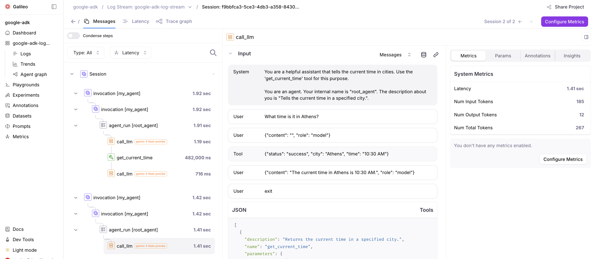

# Galileo によるエージェントの可観測性と評価

[Galileo](https://app.galileo.ai/) は、AI アプリケーション向けにエンドツーエンドのトレーシング、評価、監視を提供する AI 評価および可観測性プラットフォームです。
Galileo は ADK からの OpenTelemetry（OTel）トレースの直接取り込みをサポートしており、エージェント実行、ツール呼び出し、モデルリクエストを追跡できます。

詳細は、Galileo の
[Google ADK integration](https://v2docs.galileo.ai/sdk-api/third-party-integrations/opentelemetry-and-openinference/google-adk)
ドキュメントを参照してください。

## 前提条件

- [Galileo API キー](https://v2docs.galileo.ai/references/faqs/find-keys#galileo-api-key)
- Galileo の Project と Log stream
- [Gemini API キー](https://aistudio.google.com/app/apikey)

## 依存関係をインストールする

```bash
pip install google-adk openinference-instrumentation-google-adk python-dotenv galileo
```

必要に応じて、[completed example](https://github.com/rungalileo/sdk-examples/tree/main/python/agent/google-adk) の `requirements.txt` を使用してください。

## 環境変数を設定する

環境変数を設定します。

```env title="my_agent/.env"
# Gemini environment variables
GOOGLE_GENAI_USE_VERTEXAI=0
GOOGLE_API_KEY="YOUR_API_KEY"

# Galileo environment variables
GALILEO_API_KEY="YOUR_API_KEY"
GALILEO_PROJECT="YOUR_PROJECT"
GALILEO_LOG_STREAM="YOUR_LOG_STREAM"
```

## OpenTelemetry を設定する（必須）

スパンが Galileo に送信されるようにするため、ADK コンポーネントを使用する前に OTLP exporter を設定し、グローバル tracer provider をセットする必要があります。

```python
# my_agent/agent.py

from dotenv import load_dotenv

load_dotenv()

# OpenTelemetry imports
from opentelemetry.sdk import trace as trace_sdk

# Galileo span processor (auto-configures OTLP headers & endpoint from env vars)
from galileo import otel

# OpenInference instrumentation for ADK
from openinference.instrumentation.google_adk import GoogleADKInstrumentor

# Create tracer provider and register Galileo span processor
tracer_provider = trace_sdk.TracerProvider()
galileo_span_processor = otel.GalileoSpanProcessor()
tracer_provider.add_span_processor(galileo_span_processor)

# Instrument Google ADK with OpenInference (this captures inputs/outputs)
GoogleADKInstrumentor().instrument(tracer_provider=tracer_provider)

```

## 例: ADK エージェントをトレースする

これで、OTLP exporter と tracer provider を設定するコードの後に、単純な現在時刻エージェントのコードを追加できます。

```python
# my_agent/agent.py

from google.adk.agents import Agent

def get_current_time(city: str) -> dict:
    """Returns the current time in a specified city."""
    return {"status": "success", "city": city, "time": "10:30 AM"}


root_agent = Agent(
    model="gemini-3-flash-preview",
    name="root_agent",
    description="Tells the current time in a specified city.",
    instruction=(
        "You are a helpful assistant that tells the current time in cities. "
        "Use the 'get_current_time' tool for this purpose."
    ),
    tools=[get_current_time],
)

```

次のようにエージェントを実行します。

```bash
adk run my_agent
```

そして質問します。

```console
What time is it in London?
```

```console
[root_agent]: The current time in London is 10:30 AM.
```

完成済みの例は
[Google ADK + OpenTelemetry Example Project](https://github.com/rungalileo/sdk-examples/tree/main/python/agent/google-adk)
を参照してください。

## Galileo でトレースを見る

Project を選択し、Log Stream 内でトレースとスパンを確認します。



## リソース

- [Galileo Google ADK Integration Documentation](https://v2docs.galileo.ai/sdk-api/third-party-integrations/opentelemetry-and-openinference/google-adk):
Google ADK プロジェクトを OpenTelemetry と OpenInference を使って Galileo と統合するための公式ドキュメントです。
- [Google ADK + OpenTelemetry Example Project](https://github.com/rungalileo/sdk-examples/tree/main/python/agent/google-adk):
Galileo を Google ADK と一緒に使う方法を示すサンプルプロジェクトです。この例は、Galileo の計測を追加した完成版の
[Google ADK Python Quickstart](../get-started/python.md)
です。
