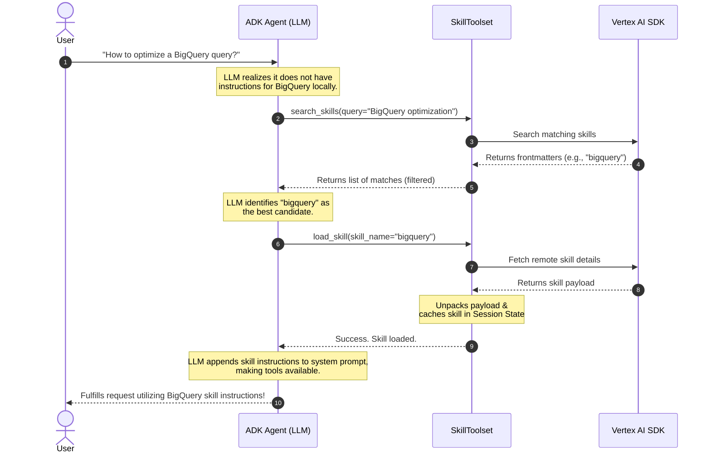

# Google Cloud Skill Registry

<div class="language-support-tag">
  <span class="lst-supported">ADKでサポート</span><span class="lst-python">Python v1.27.0</span><span class="lst-preview">プレビュー</span>
</div>

Agent Development Kit（ADK）の **Google Cloud Skill Registry** 統合により、
開発者は中央リポジトリにカタログ化されたリモート Skills を動的に検索、
発見、取得できます。

初期化時に利用可能なすべての skill をエージェントのコンテキストウィンドウへ
静的に注入する代わりに、Skill Registry は**必要なものだけをオンデマンドで
取得する**ことを可能にします。専門機能のカタログが数百、数千の skill に
拡大しても、エージェントはユーザー意図に基づいて必要な指示とツールを
動的に発見、ダウンロード、有効化できます。Skills Registry サービスの詳細は、
[Google Cloud Skills Registry](https://docs.cloud.google.com/gemini-enterprise-agent-platform/build/skill-registry)
ドキュメントを参照してください。

!!! example "Preview リリース"
    Google Cloud Skills Registry 機能は Preview リリースです。詳細については
    [リリース段階の説明](https://cloud.google.com/products#product-launch-stages)を
    参照してください。

---

## ユースケース

*   **コンテキストウィンドウの最適化**: ユーザーのプロンプトで実際に
    必要な場合にのみ skill のシステム指示とツールを読み込み、貴重な
    トークンを節約します。
*   **エンタープライズでの再利用性**: 複数アプリケーションのエージェントが
    利用できる、共有およびプライベート skill の中央管理リポジトリを
    構築します。
*   **安全な分離**: 動的に読み込まれた skill を、エージェント固有の
    セッション状態または隔離されたサンドボックス環境内に自動で
    キャッシュします。

---

## 前提条件

*   [Google Cloud プロジェクト](https://docs.cloud.google.com/resource-manager/docs/creating-managing-projects)。
*   Google Cloud プロジェクトで **Skill Registry API** を有効化していること。
*   環境に合わせた認証設定。[Application Default Credentials](https://docs.cloud.google.com/docs/authentication/application-default-credentials)
    (`gcloud auth application-default login`) でログインすることを推奨します。
*   `GOOGLE_CLOUD_PROJECT` 環境変数をプロジェクト ID に、`GOOGLE_CLOUD_LOCATION`
    環境変数をデプロイリージョン（例: `us-central1`）に設定していること。

!!! warning "インターネットアクセス要件"
    GCP Skill Registry は Vertex AI Client SDK を使って Vertex AI サービスと
    通信するため、Vertex AI エンドポイントへの外向きネットワークアクセスが
    ないサンドボックス環境で実行されるエージェントは registry に到達できません。
    適切なネットワークアクセスを構成してください。構成されていない場合、
    システムはローカルファイルシステムから読み込む skill にフォールバックします。

---

## インストール

Skill Registry クライアントは ADK コアライブラリに含まれています。
pip でインストールします。

```bash
pip install google-adk
```

---

## エージェントで使用する

エージェントが必要に応じて skill を動的に発見して読み込むようにするには、
`GCPSkillRegistry` をインスタンス化し、`SkillToolset` の `registry`
パラメータとして渡します。

```python
import os
from google.adk import Agent
from google.adk.integrations.gcp_skill_registry import GCPSkillRegistry
from google.adk.tools.skill_toolset import SkillToolset

# 1. Initialize the GCP Skill Registry
# Project ID and location can also be set via GOOGLE_CLOUD_PROJECT
# and GOOGLE_CLOUD_LOCATION environment variables.
registry = GCPSkillRegistry(
    project_id=os.environ.get("GOOGLE_CLOUD_PROJECT"),
    location=os.environ.get("GOOGLE_CLOUD_LOCATION", "us-central1"),
)

# 2. Create the SkillToolset with the Registry
# You can optionally pre-load some local skills as well.
skill_toolset = SkillToolset(
    skills=[], 
    registry=registry
)

# 3. Define your Agent with the SkillToolset
agent = Agent(
    model="gemini-flash-latest",
    name="registry_agent",
    description="An agent that can dynamically discover and execute skills.",
    instruction="You are a helpful assistant. Use search_skills and load_skill to leverage remote capabilities.",
    tools=[skill_toolset],
)
```

---

## 仕組み

リモート registry で `SkillToolset` を設定すると、ADK は skill ライフサイクル
を管理する 2 つの組み込みツールをエージェントに自動的に提供します。



### セマンティック発見（`search_skills`）

エージェントが現在のシステム指示だけではユーザーのクエリに答えるのに
不十分だと判断すると、`search_skills` ツールを自動的に呼び出します。

*   **衝突防止**: 名前空間の衝突を防ぐため、ADK はローカルに読み込まれた
    skill と名前が重複する registry skill を自動的に除外します。

### オンデマンド読み込み（`load_skill`）

エージェントが一致するリモート skill（例: `"bigquery"`）を特定すると、
`load_skill` ツールを呼び出します。

*   **SDK 取得**: ADK は Vertex AI Client SDK を呼び出してリモート skill を
    取得します。
*   **抽出と解析**: リモート payload を展開し、実行可能な `Skill` オブジェクトに
    解析します。
*   **エージェントセッションへのキャッシュ**: 後続ターンで追加のリモート API
    呼び出しが不要になるよう、skill の指示とリソースを現在のエージェント
    セッション状態にキャッシュします。
*   **プロンプト拡張**: skill の指示がシステムプロンプトに追加され、skill が
    提供するスクリプトやツールをすぐに実行できるようになります。

---

## 設定と API リファレンス

### `GCPSkillRegistry` 設定

`GCPSkillRegistry` クライアントコンストラクタは、次のオプションを受け取ります。

| パラメータ | 型 | デフォルト | 説明 |
| :--- | :--- | :--- | :--- |
| `project_id` | `str` | `None` | Google Cloud プロジェクト ID です。省略した場合は `GOOGLE_CLOUD_PROJECT` 環境変数にフォールバックします。 |
| `location` | `str` | `None` | Google Cloud リージョン/ロケーションです。省略した場合は `GOOGLE_CLOUD_LOCATION` 環境変数にフォールバックします。 |

### メソッド

*   **`search_skills(query: str) -> List[Frontmatter]`**:
    registry カタログに対してセマンティックまたはキーワードクエリを実行し、
    skill frontmatter メタデータ（名前と説明）の一覧を返します。
*   **`get_skill(name: str, version: Optional[str] = None) -> Skill`**:
    特定の skill 名と任意の revision/version について、Vertex AI Client SDK
    でリモート skill payload を取得し、展開して読み込まれた `Skill`
    オブジェクトを返します。
