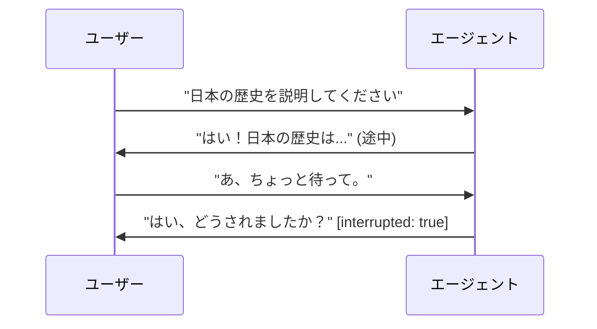

# ライブエージェントと音声エージェント

    ADKでサポートPython v0.5.0Java v0.2.0プレビュー

ADK はライブエージェントと音声エージェントを構築するためのフレームワークです。ライブエージェントはユーザーと双方向の常時接続を維持します。メッセージを送信して返信を待つのではなく、ユーザーとエージェントの双方が同時に話し、聞き、応答します。また、実際の会話で人間同士が遮るように、ユーザーはエージェントの発話途中に割り込んで中断（interrupt）することができます。ライブエージェントはテキスト、音声、動画の入力を受け付け、テキストまたは音声で応答します。

ライブエージェントは、他の場所で使用するのと同じエージェント、ツール、セッションの抽象化を使用して構築された ADK エージェントです。開発者はエージェントの動作を記述し、ADK はその下でリアルタイム接続、ツール実行、セッション状態を管理します。現在、この接続は [Gemini Live API](https://ai.google.dev/gemini-api/docs/live-api) 上で実行されます。プラットフォームが進化してもエージェントコードが変更されないように、ADK が配線を処理します。

  

    

      <iframe src="https://www.youtube-nocookie.com/embed/vLUkAGeLR1k" title="ADK Gemini Live API Toolkit in 5 minutes" frameborder="0" allow="accelerometer; autoplay; clipboard-write; encrypted-media; gyroscope; picture-in-picture; web-share" allowfullscreen></iframe>
    

  

  

    

      <iframe src="https://www.youtube-nocookie.com/embed/Hwx94smxT_0" title="Shopper's Concierge 2 Demo" frameborder="0" allow="accelerometer; autoplay; clipboard-write; encrypted-media; gyroscope; picture-in-picture; web-share" allowfullscreen></iframe>
    

  

## ライブエージェントの構築

-   :material-rocket-launch-outline: **使ってみる**

    ---

    最初のライブエージェントを構築し、ブラウザで対話してみましょう。

    - [ここから開始](get-started/index.md) — 言語を選択して構築する
    - [Python](get-started/streaming-python.md) または [Java](get-started/streaming-java.md) へ直接移動

-   :material-book-open-variant: **開発ガイド**

    ---

    必要となる順序でおおよそ並べられた機能別ガイドです。

    - [セッション](sessions.md) — `run_live()`、再開、スケール
    - [イベント](events.md) — 返されるイベントとその処理方法
    - [ツール](tools.md) — 自動実行とストリーミングツール
    - [ワークフロー](workflows.md) — ライブ接続下でのマルチエージェント
    - [音声と動画](audio-video.md) — フォーマットとストリーミング
    - [設定](configuration.md) — `RunConfig`、音声、文字起こし、ターン検出

-   :material-server-network: **本番環境への導入**

    ---

    `adk web` を超えてライブエージェントを運用します。

    - [評価](evaluation.md) — リリース前に音声会話をスコアリング
    - [カスタムサーバーの構築](custom-server.md)
    - [サポート対象モデル](models.md)

## どのストリーミングが必要ですか？

ADK における「ストリーミング」は 3 つの異なる機能をカバーしており、間違ったものを選択することが混乱の一般的な原因です。

| | 機能 | ユーザーによる割り込み | ユースケース | 場所 |
| :---- | :---- | :---- | :---- | :---- |
| **サーバーサイドストリーミング** | ライブフィードのように、サーバーからクライアントへの一方向の流れ。 | 不可 | 会話ではなくダッシュボードやフィードの更新をプッシュする場合。 | ADK 外部 |
| **トークンレベルストリーミング** | テキストが単語ごとに到着するが、次の送信前に完了を待機する。 | 不可 | 応答性の高いテキストチャットが必要な場合。 | `StreamingMode.SSE`（[設定](configuration.md#streamingmode-bidi-or-sse)） |
| **双方向ストリーミング** | 1つのオープンな接続を介して双方が同時に話し、聞き、応答する。 | **可能** | 音声または動画による会話を構築する場合。 | `runner.run_live()` — このセクションのドキュメント |

このセクションのドキュメントは 3 行目について説明しています。

## なぜ ADK でライブエージェントを構築するのか

Live API はストリーミングプロトコルを提供します。ADK はその周辺のすべてを提供するため、ストリーミングインフラストラクチャではなくエージェントの動作の記述に集中できます。

| | 生の Live API (`google-genai`) | ADK |
|---|---|---|
| ツール実行 | 手動 | [自動](tools.md#automatic-tool-execution) |
| 再接続 | 手動 | [自動セッション再開](sessions.md#session-resumption) |
| イベント | カスタム構造 | [統合イベントモデル](events.md) |
| 非同期調整 | 手動 | [`LiveRequestQueue` + `run_live()`](sessions.md) |
| セッションの永続化 | 手動 | [SQL、Agent Platform、インメモリ](../sessions/index.md) |
| マルチエージェント | 未提供 | [ワークフロー、サブエージェント、移譲](workflows.md) |

## デモとリソース

-   :material-shopping-outline: **LensMosaic: ライブ AI によるビジュアルショッピング**

    ---

    ライブカメラ入力、音声、製品検索を融合。カメラを任意のオブジェクトに向けて類似製品を見つけます。ADK ライブエージェント、Gemini Embedding、Vector Search、FastAPI で構築されています。

    - [ライブデモ](https://lens-mosaic-nhhfh7g7iq-uc.a.run.app)
    - [ソースコード](https://github.com/kazunori279/lens-mosaic)

-   :material-post-outline: **双方向ストリーミングのビジュアルガイド**

    ---

    ストリーミングの仕組みと ADK で対話型エージェントを構築する方法を解説した図解とイラスト。

    - [記事を読む](https://medium.com/google-cloud/adk-bidi-streaming-a-visual-guide-to-real-time-multimodal-ai-agent-development-62dd08c81399)

-   :material-post-outline: **Google ADK + Gemini Live API**

    ---

    リアルタイムの音声/動画向けライブエージェントの使用と、`LiveRequestQueue` 上に構築された Python サーバーの例。

    - [記事を読む](https://medium.com/google-cloud/google-adk-vertex-ai-live-api-125238982d5e)

