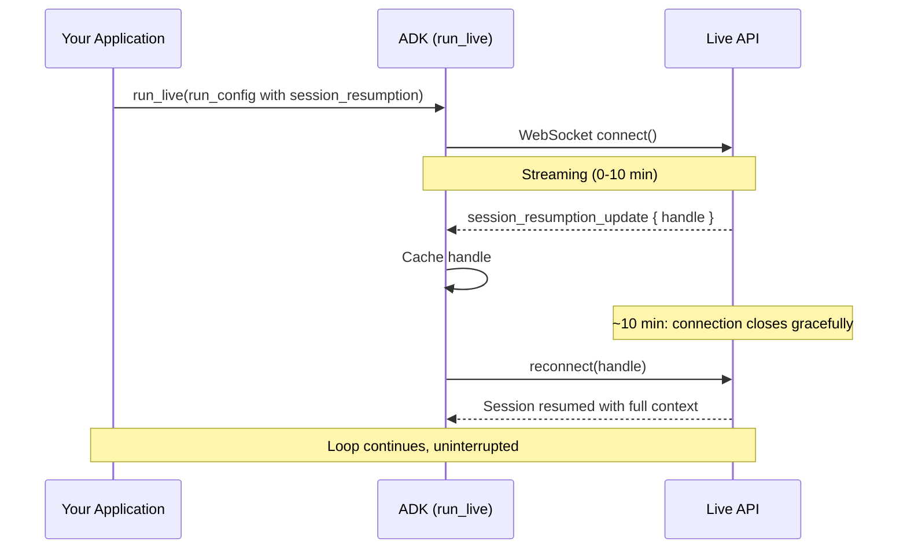

# ライブエージェント向けセッション

<div class="language-support-tag">
    <span class="lst-supported">ADKでサポート</span><span class="lst-python">Python v0.1.0</span>
</div>

ライブエージェントは、ユーザーが話し、聞き、割り込み、沈黙する間も接続が開かれたまま維持されます。

ライブエージェントは、他の ADK エージェントと同じ `Session`、`SessionService`、および状態モデルを使用します。これらはすべて [会話コンテキスト](../sessions/index.md) で解説されています。ライブセッションが追加するのは*接続（connection）*です。接続は切断されたり、タイムアウトしたり、モデルのコンテキストウィンドウを超過したりする可能性があります。その接続を通じて何が*出力*されるかについては [イベント](events.md) を、それを構成する設定については [設定](configuration.md) を参照してください。

## ライブアプリケーションのセットアップ

ライブアプリケーションには 2 種類のオブジェクトがあります。起動時に一度作成してすべてのセッションで再利用するものと、セッションごとに新しく作成するものです。

**一度作成して再利用するもの：**

- **`Agent`**: モデル、ツール、指示。ステートレスで再利用可能。
- **`SessionService`**: 会話履歴を保存し、再接続やプロセスの再起動後もセッションが維持されるようにする。
- **`Runner`**: エージェントを駆動しイベントを生成するランタイム。

```python
import os
from google.adk.agents import Agent
from google.adk.runners import Runner
from google.adk.sessions import InMemorySessionService
from google.adk.tools import google_search

APP_NAME = "live-agent"

agent = Agent(
    name="google_search_agent",
    model=os.getenv("DEMO_AGENT_MODEL", "gemini-live-2.5-flash-native-audio"),
    tools=[google_search],
    instruction="You are a helpful assistant that can search the web.",
)

runner = Runner(
    app_name=APP_NAME,
    agent=agent,
    session_service=InMemorySessionService(),
)
```

`InMemorySessionService` はプロセスが停止すると状態が失われます。本番環境では、`DatabaseSessionService`（SQLite、PostgreSQL、MySQL）または `VertexAiSessionService`（Google Cloud 上のマネージドサービス）を使用してください。[セッションサービス](../sessions/index.md) を参照してください。

**セッションごとに作成するもの：**

- ループを実行する前に取得または作成する [`Session`](#adk-session-vs-live-api-session)。
- ユーザーごとに異なり得る [`RunConfig`](configuration.md)（音声、文字起こし、制限）。
- ユーザー入力を送信するためのチャネルである [`LiveRequestQueue`](#liverequestqueue)。

```python
from google.adk.agents.live_request_queue import LiveRequestQueue
from google.adk.agents.run_config import RunConfig
from google.genai import types

# 取得または作成（get-or-create）により、新しい会話と再接続の両方を処理
session = await session_service.get_session(
    app_name=APP_NAME, user_id=user_id, session_id=session_id
)
if not session:
    await session_service.create_session(
        app_name=APP_NAME, user_id=user_id, session_id=session_id
    )

run_config = RunConfig(
    response_modalities=["AUDIO"],
    session_resumption=types.SessionResumptionConfig(),
)

live_request_queue = LiveRequestQueue()
```

`user_id` と `session_id` は開発者が定義する任意の文字列です。`session_id=None` を渡すと ADK が UUID を生成します。同じ識別子で `run_live()` を呼び出す前にセッションが存在している必要があります。そうでない場合、`run_live()` は `ValueError: Session not found` を発生させます。

!!! warning "セッションごとに 1 つのキュー"

    セッション間で `LiveRequestQueue` を再利用しないでください。終了シグナルがキューに残り、次のセッションに引き継がれてセッションが破損する恐れがあります。`run_live()` を呼び出すたびに新しいキューを作成してください。

## LiveRequestQueue

`LiveRequestQueue` は、エージェントにメッセージを送信するためのチャネルです。すべてのメッセージは、さまざまな種類の入力を保持する単一のコンテナである `LiveRequest` です。

```python title='リファレンス: <a href="../api-reference/python/google-adk.html#google.adk.agents.LiveRequestQueue">LiveRequestQueue</a>'
class LiveRequest(BaseModel):
    content: Optional[Content] = None            # テキストおよび構造化データ
    blob: Optional[Blob] = None                  # 音声/動画のバイト列
    activity_start: Optional[ActivityStart] = None  # 手動のターン開始
    activity_end: Optional[ActivityEnd] = None      # 手動のターン終了
    close: bool = False                          # 正常終了シグナル
```

`content` と `blob` は相互に排他的です。`LiveRequest` オブジェクトを自分で構築するのではなく、便利なヘルパーメソッドを使用してください。適切なフィールドが設定され、排他制約が維持されます。

| メソッド | 送信内容 | モード |
|---|---|---|
| `send_content(content)` | 個別のターンとしてのテキスト | ターンごと。モデルの応答をトリガー |
| `send_realtime(blob)` | 音声、画像、または動画のバイト列 | 連続ストリーミング |
| `send_activity_start()` / `send_activity_end()` | 手動のターン境界 | 自動 VAD が無効になっている場合のみ |
| `close()` | 終了シグナル | セッションを終了 |

```python
from google.genai import types

# テキストターン
live_request_queue.send_content(types.Content(parts=[types.Part(text=user_text)]))

# 音声チャンク（連続ストリーミング）
live_request_queue.send_realtime(
    types.Blob(mime_type="audio/pcm;rate=16000", data=audio_data)
)
```

音声、画像、動画のフォーマットについては、[音声と動画](audio-video.md) を参照してください。アクティビティシグナルによる手動のターン制御については、[音声活動検出（VAD）](configuration.md#voice-activity-detection-vad) を参照してください。

!!! note "呼び出しごとに 1 つのテキスト Part を送信"

    `send_content()` の呼び出しごとに 1 つのテキスト `Part` のみを送信してください。一部のライブモデルは、複数のパートを持つ `Content` を応答すべきターンではなく会話の初期シード（履歴の注入）として扱うことがあるため、呼び出しごとに 1 つのパートにすることでモデル間で一貫した動作を保つことができます。

### 同時実行性と順序付け

`LiveRequestQueue` は `asyncio.Queue` をラップしており、以下の 3 つの特徴があります。

- **送信メソッドは同期的です。** 内部で `put_nowait()` を呼び出すため、ブロックせず、`await` も不要です。
- **配信は FIFO であり、マージされません。** リクエストは送信順に、呼び出しごとに 1 つずつモデルに届きます。
- **キューは無制限（unbounded）です。** モデルが消費するよりも速く送信すると、バックプレッシャーがかかるのではなくメモリが増加するため、高レートの音声や動画を扱う場合は送信レートを独自に制御してください。

`run_live()` を実行するイベントループにバインドされるよう、非同期コンテキスト内でキューを作成してください。`asyncio.Queue` は、単一のイベントループスレッド内での同時アクセスに対して安全です。別のスレッドからデータを供給する場合は、`loop.call_soon_threadsafe()` を使用してください。

## run_live() ループ

`run_live()` は非同期ジェネレータです。バッファリングやポーリングを行うことなく、生成された瞬間に `Event` オブジェクトを出力（yield）します。その間、キューを通じて新しい入力を並行して送信できます。この同時実行性により、割り込み（インターラプト）が可能になります。エージェントが話している最中に、ユーザーが発話を被せることができます。

```python title='リファレンス: <a href="../api-reference/python/google-adk.html#google.adk.runners.Runner.run_live">Runner.run_live()</a>'
async for event in runner.run_live(
    user_id=user_id,
    session_id=session_id,
    live_request_queue=live_request_queue,
    run_config=run_config,
):
    await websocket.send_text(event.model_dump_json(exclude_none=True, by_alias=True))
```

`run_live()` は呼び出し時に Live API 接続を開き、ループの実行中に双方向でストリーミングを行い、`live_request_queue.close()` を呼び出すと接続を閉じます。出力されるイベントの種類とその処理方法については、[イベント](events.md) を参照してください。

### run_live() が終了するタイミング

| 終了条件 | トリガー | 正常終了（Graceful） |
|---|---|---|
| 手動クローズ | `live_request_queue.close()` | はい |
| ワークフロー完了 | ライブワークフロー内の最後のエージェントが `task_completed()` を呼び出す | はい |
| セッションタイムアウト | Live API の継続時間上限に到達（圧縮なしの場合） | 接続切断 |
| 早期終了 | ツールまたはコールバックによって `end_invocation` が設定される | はい |
| エラー | 接続障害または未処理の例外 | いいえ |

エラーが発生した場合でも、セッションが終了したら必ず `close()` を呼び出してください。これを怠ると Live API に正常終了シグナルが送られず、タイムアウトするまで [同時実行セッションの割り当て](#concurrent-sessions) を占有する「ゾンビ」セッションが残る可能性があります。

```python
try:
    await asyncio.gather(upstream_task(), downstream_task())
except WebSocketDisconnect:
    pass  # クライアントが正常に切断
finally:
    live_request_queue.close()  # 常にキューを閉じる
```

ループ内のエラー処理については [エラーイベント](events.md#handling-errors) を、アップストリーム/ダウンストリームの完全なサーバーパターンについては [カスタムサーバー](custom-server.md) を参照してください。

### セッションに保存される内容

`run_live()` が終了すると、一部のイベントのみが ADK `Session` に永続化されます。

- **保存されるもの：** 最終的な（非部分的な）文字起こし、使用量メタデータ、関数呼び出しとレスポンス、ほとんどの制御イベント。音声ファイルは [`save_live_blob`](configuration.md#save_live_blob) が `True` の場合のみ保存されます。
- **一時的なもの：** 生の音声バイト列（`inline_data`）および部分的な文字起こし。リアルタイムの再生や表示のために yield されますが、保存はされません。

## ADK Session と Live API session の違い

「セッション」という言葉は 2 つの異なる概念で共有されています。

- **ADK `Session`**（`SessionService` が管理）：永続的な会話ストレージ。複数の `run_live()` 呼び出しやアプリケーションの再起動をまたいで存続します。
- **Live API session**（Live API バックエンドが管理）：ループの実行中にのみ存在する一時的なストリーミングコンテキスト。

`run_live()` が開始されると、ADK は ADK `Session` から履歴を読み込み、それを使って新しい Live API セッションを初期化し、イベントが発生するたびに ADK `Session` を更新します。ループが終了すると Live API セッションは破棄されますが、ADK `Session` は保持されます。次回の呼び出しでは、保存された履歴から Live API セッションが再構築されます。この分離により、ネットワークの切断や再起動をまたいでも会話を継続できます。

トランスポート層では、信頼性の観点からもう 1 つの区別が重要になります。

- **接続（Connection）**：ADK と Live API 間の WebSocket リンク。タイムアウトする可能性があります。
- **セッション（Session）**：会話コンテキスト。[セッション再開](#session-resumption) により複数の接続にまたがることができます。

### プラットフォームの制限

両方のバックエンドで、接続時間、セッション時間、同時実行セッション数に上限が設けられています。正確な数値はバックエンドによって異なり、時間の経過とともに変更されるため、[サポート対象モデル](models.md#platform-limits-and-quotas) でまとめて追跡しています。

これらの制限のうち 2 つはコードの書き方に影響します。
[コンテキストウィンドウの圧縮](#context-window-compression) はセッション継続時間の制限を解除し、同時実行セッションの上限は [同時実行セッション](#concurrent-sessions) を考慮した設計を必要とします。

## セッションの再開（Session Resumption）

Live API は約 10 分後に各 WebSocket 接続を閉じます。
[セッションの再開](https://ai.google.dev/gemini-api/docs/live-api/session-management#session-resumption) は、接続をまたいで会話を移行し、制限を超えて継続できるようにします。これを有効にすると、**ADK がすべての再接続を自動的に処理**し、再開ハンドルのキャッシュ、切断の検出、バックグラウンドでの再接続を行います。`run_live()` ループは中断することなくイベントを出力し続けます。

```python
from google.genai import types

run_config = RunConfig(session_resumption=types.SessionResumptionConfig())
```

ADK は ADK と Live API 間の接続のみを管理します。アプリケーション自身のクライアント接続（たとえばユーザーとサーバー間の WebSocket）やクライアント側の再接続ロジックは、アプリケーション側で管理する必要があります。

ADK の再接続プロセス：

1. Live API が `session_resumption_update` メッセージを送信し、ADK は最新のハンドルをキャッシュします。
2. 制限時間に達する前に Live API が `go_away` 警告を送信することがあり、ADK は切断される*前*に再接続するため、ハンドオーバーはシームレスに行われます。
3. 接続が正常に切断されると、ADK のループはキャッシュされたハンドルを使用して再接続し、完全なコンテキストを維持したままセッションが継続されます。



!!! warning "再接続の試行回数には上限があります"

    ADK は最大 **5 回連続** の再接続を試行します（[`DEFAULT_MAX_RECONNECT_ATTEMPTS`](https://github.com/google/adk-python/blob/main/src/google/adk/flows/llm_flows/base_llm_flow.py)）。カウンターは再接続が成功するたびにリセットされるため、長時間の会話でも合計 5 回ではなく、*5 回連続の失敗* のみが制限となります。ADK は再開ハンドルが存在する場合にのみ再試行します。`session_resumption` が有効になっていない場合、最初の切断が `run_live()` から直接伝播するため、アプリケーション側で処理する必要があります。

短いセッション（10分未満）、ステートレスなリクエスト/レスポンスのやり取り、または実行ごとに新しいセッションでデバッグを容易にしたい開発時のみ、再開を無効にしてください。

## コンテキストウィンドウの圧縮

長時間の会話では、セッション継続時間の上限と、モデルのコンテキストウィンドウ（モデルによって異なる）という 2 つの制限に直面します。
[コンテキストウィンドウの圧縮](https://ai.google.dev/gemini-api/docs/live-api/session-management#context-window-compression) はその両方に対処します。トークン数がしきい値を超えると、スライディングウィンドウによって古い会話履歴が圧縮され、最近のターンはそのまま保持されます。**これを有効にすると、セッション継続時間の制限がなくなります。** トレードオフとして、古いコンテキストは逐語的な履歴ではなく要約になります。

```python
from google.genai import types
from google.adk.agents.run_config import RunConfig

# 128k コンテキストモデルの場合
run_config = RunConfig(
    context_window_compression=types.ContextWindowCompressionConfig(
        trigger_tokens=100000,  # ウィンドウの約 78% で圧縮を開始
        sliding_window=types.SlidingWindow(
            target_tokens=80000,  # 最近のターンを保持しながら約 62% まで圧縮
        ),
    )
)
```

余裕を持たせるため、`trigger_tokens` をモデルのコンテキストウィンドウの約 70〜80% に設定し、`target_tokens` を 60〜70% に設定して、各圧縮で数ターン分の十分なスペースが確保されるようにします。実際の会話パターンでテストしてください。セッションがプラットフォームの制限を超えて実行される必要がある場合や、トークン制限を超える可能性がある場合に圧縮を有効にします。短いセッションや、初期ターンの正確な想起が重要な場合は無効のままにしてください。

## 同時実行セッション { #concurrent-sessions }

各ユーザーには独自の Live API セッションが必要であり、両方のバックエンドで同時実行セッション数に上限が設けられています。同時実行セッションの上限は、同時接続ユーザー数のハードリミットとなります。現在の上限と引き上げのリクエスト方法については、[サポート対象モデル](models.md#platform-limits-and-quotas) を参照してください。

上限を考慮した設計：

- **ユーザーあたり 1 つのセッション** は、ピーク時の同時接続数がクォータ内に収まる場合のデフォルトかつ正しい選択です。
- **セッションプール**（キューを通じて割り当てられる固定されたセッションのセット）は、ピーク時の同時接続数がクォータを超える場合に、待機時間と引き換えにクォータ内に収めることができます。ユーザー間で会話が漏洩しないよう、解放時にセッションごとの状態をリセットしてください。

いずれの場合も、アクティブなセッション数を自前でカウントし、プラットフォーム側で拒否される前に新しい接続をキューに入れるか拒否してください。プラットフォームによるクォータ拒否は接続エラーとして現れるため、明確な待機順を表示するキューよりもユーザーエクスペリエンスが大幅に悪化します。
