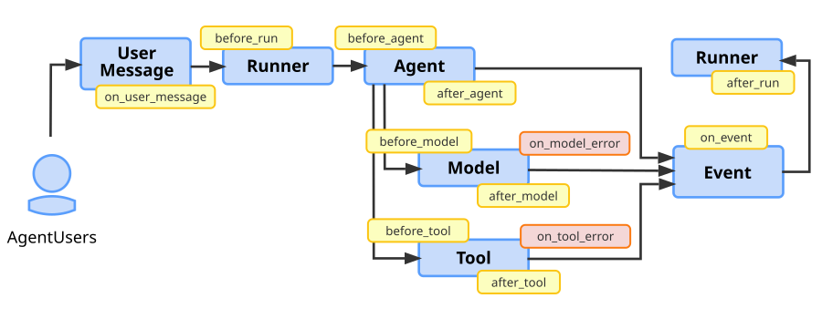

# プラグイン

<div class="language-support-tag">
    <span class="lst-supported">ADKでサポート</span><span class="lst-python">Python v1.7.0</span><span class="lst-typescript">TypeScript v0.2.5</span><span class="lst-go">Go v0.4.0</span><span class="lst-java">Java v0.3.0</span><span class="lst-kotlin">Kotlin v0.7.0</span>
</div>

Agent Development Kit (ADK) のプラグインは、コールバックフックを使用してエージェントワークフローのライフサイクルのさまざまな段階で実行できるカスタムコードモジュールです。プラグインは、エージェントワークフロー全体に適用される機能に使用します。プラグインの一般的な用途は次のとおりです。

-   **ロギングとトレース**: デバッグとパフォーマンス分析のために、エージェント、ツール、生成AIモデルのアクティビティの詳細なログを作成します。
-   **ポリシーの適用**: ユーザーが特定のツールを使用する権限があるかどうかを確認し、権限がない場合はその実行を防止する関数など、セキュリティガードレールを実装します。
-   **監視とメトリクス**: Prometheusや[Google Cloud Observability](https://cloud.google.com/stackdriver/docs) (旧Stackdriver) などの監視システムに、トークン使用量、実行時間、呼び出し回数に関するメトリクスを収集してエクスポートします。
-   **応答キャッシング**: リクエストが以前に行われたかどうかを確認して、コストがかかる、または時間がかかるAIモデルやツール呼び出しをスキップし、キャッシュされた応答を返すことができます。
-   **リクエストまたは応答の変更**: AIモデルのプロンプトに情報を動的に追加したり、ツールの出力応答を標準化したりします。

!!! tip "ヒント: セキュリティ機能にはプラグインを使用"
    セキュリティガードレールやポリシーの実装では、コールバックよりもモジュール性と柔軟性に優れたADKプラグインの利用を推奨します。詳細は[セキュリティガードレールのためのコールバックとプラグイン](/ja/safety/#callbacks-and-plugins-for-security-guardrails)を参照してください。

!!! tip "ヒント: ADK 統合"
    ADK向けの事前構築プラグインおよびその他の統合一覧は、[ツールと統合](/ja/integrations/)を参照してください。

## プラグインの仕組み

ADKプラグインは`BasePlugin`クラスを拡張し、プラグインがエージェントライフサイクルのどこで実行されるべきかを示す1つ以上の`callback`メソッドを含みます。プラグインは、エージェントの`Runner`クラス（Pythonの場合は`App`オブジェクト）に登録することでエージェントに統合します。エージェントアプリケーションでプラグインをトリガーする方法と場所の詳細については、[プラグインコールバックフック](#plugin-callback-hooks)を参照してください。

プラグイン機能は、ADKの拡張可能なアーキテクチャの主要な設計要素である[コールバック](../callbacks/index.md)に基づいて構築されています。一般的なエージェントコールバックが*特定のタスク*のために*単一のエージェント、単一のツール*に構成されるのに対し、プラグインは`Runner`（Pythonの場合は`App`）に*一度*登録され、そのコールバックは当該ランナーが管理するすべてのエージェント、ツール、LLM呼び出しに*グローバルに*適用されます。プラグインを使用すると、関連するコールバック関数をまとめてパッケージ化し、ワークフロー全体で使用できます。これにより、プラグインはエージェントアプリケーション全体にわたる機能を実装するための理想的なソリューションとなります。

## 事前構築済みプラグイン

ADKには、エージェントワークフローにすぐに追加できるいくつかのプラグインが含まれています。

*   [**リフレクトとリトライツール**](/ja/plugins/reflect-and-retry/):
    ツールの失敗を追跡し、ツールリクエストをインテリジェントに再試行します。
*   [**BigQueryアナリティクス**](/ja/observability/bigquery-agent-analytics/):
    BigQueryによるエージェントのロギングと分析を可能にします。
*   [**Model Armor**](/ja/integrations/model-armor/):
    Google Cloud Model Armor テンプレートに照らしてユーザー入力とモデル出力をスクリーニングします。
*   [**コンテキストフィルター**](https://github.com/google/adk-python/blob/main/src/google/adk/plugins/context_filter_plugin.py):
    生成AIのコンテキストをフィルタリングしてサイズを削減します。
*   [**グローバルインストラクション**](https://github.com/google/adk-python/blob/main/src/google/adk/plugins/global_instruction_plugin.py):
    Appレベルでグローバルインストラクション機能を提供するプラグインです。
*   [**ファイルをアーティファクトとして保存**](https://github.com/google/adk-python/blob/main/src/google/adk/plugins/save_files_as_artifacts_plugin.py):
    ユーザーメッセージに含まれるファイルをアーティファクトとして保存します。
*   [**自動トレース（Auto Tracing）**](https://github.com/google/adk-python/blob/main/src/google/adk/plugins/auto_tracing_plugin.py):
    エージェント固有のパッケージ内の関数を OpenTelemetry スパンでラップします。
*   [**マルチモーダルツール結果（Multimodal Tool Results）**](https://github.com/google/adk-python/blob/main/src/google/adk/plugins/multimodal_tool_results_plugin.py):
    関数ツールがコンテンツパーツをモデルに直接返せるようにします。
*   [**ロギング**](https://github.com/google/adk-python/blob/main/src/google/adk/plugins/logging_plugin.py):
    各エージェントワークフローのコールバックポイントで重要な情報をログに記録します。
*   [**デバッグロギング（Debug Logging）**](https://github.com/google/adk-python/blob/main/src/google/adk/plugins/debug_logging_plugin.py):
    各呼び出しの完全なデバッグ情報を YAML ファイルにキャプチャします。
*   [**モデルのリフレクトとリトライ（Reflect and Retry Model）**](https://github.com/google/adk-python/blob/main/src/google/adk/plugins/_reflect_retry_model_plugin.py):
    不正な形式の関数呼び出しなど、応答がエラーで終了した場合にモデルに再試行を要求します。
*   [**ツール呼び出しの整合性（Tool Call Integrity）**](https://github.com/google/adk-python/blob/main/src/google/adk/plugins/_tool_call_integrity_plugin.py):
    セッションに保存された各関数呼び出しに秘密鍵で署名し、呼び出しの署名が検証された場合にのみツールを実行します。ワークフローノードとして実行されるツールはチェックされません。

エージェント向けのネイティブおよびサードパーティの追加プラグインについては、[ADK インテグレーション](/ja/integrations/) ページをご覧ください。

## プラグインの定義と登録

このセクションでは、プラグインクラスを定義し、エージェントワークフローの一部として登録する方法について説明します。完全なコード例については、リポジトリの[プラグインの基本](https://github.com/google/adk-python/tree/main/contributing/samples/plugins/plugin_basic)を参照してください。

### プラグインクラスの作成

`BasePlugin`クラスを拡張し、次のコード例に示すように1つ以上の`callback`メソッドを追加することから始めます。

```py title="count_plugin.py"
from google.adk.agents.base_agent import BaseAgent
from google.adk.agents.callback_context import CallbackContext
from google.adk.models.llm_request import LlmRequest
from google.adk.plugins.base_plugin import BasePlugin

class CountInvocationPlugin(BasePlugin):
  """エージェントとツールの呼び出し回数をカウントするカスタムプラグインです。"""

  def __init__(self) -> None:
    """カウンターでプラグインを初期化します。"""
    super().__init__(name="count_invocation")
    self.agent_count: int = 0
    self.tool_count: int = 0
    self.llm_request_count: int = 0

  async def before_agent_callback(
      self, *, agent: BaseAgent, callback_context: CallbackContext
  ) -> None:
    """エージェントの実行回数をカウントします。"""
    self.agent_count += 1
    print(f"[Plugin] エージェントの実行回数: {self.agent_count}")

  async def before_model_callback(
      self, *, callback_context: CallbackContext, llm_request: LlmRequest
  ) -> None:
    """LLMリクエストの数をカウントします。"""
    self.llm_request_count += 1
    print(f"[Plugin] LLMリクエストの数: {self.llm_request_count}")
```

**TypeScript**

```typescript title="count_plugin.ts"
import { BaseAgent, BasePlugin, Context } from "@google/adk";
import type { LlmRequest, LlmResponse } from "@google/adk";
import type { Content } from "@google/genai";

export class CountInvocationPlugin extends BasePlugin {
    public agentCount = 0;
    public toolCount = 0;
    public llmRequestCount = 0;

    constructor() {
        super("count_invocation");
    }

    async beforeAgentCallback(
        agent: BaseAgent,
        context: Context
    ): Promise<Content | undefined> {
        this.agentCount++;
        console.log(`[Plugin] Agent run count: ${this.agentCount}`);
        return undefined;
    }

    async beforeModelCallback(
        context: Context,
        llmRequest: LlmRequest
    ): Promise<LlmResponse | undefined> {
        this.llmRequestCount++;
        console.log(`[Plugin] LLM request count: ${this.llmRequestCount}`);
        return undefined;
    }
}
```

**Java**

```java title="CountInvocationPlugin.java"
import com.google.adk.agents.BaseAgent;
import com.google.adk.agents.CallbackContext;
import com.google.adk.models.LlmRequest;
import com.google.adk.models.LlmResponse;
import com.google.adk.plugins.BasePlugin;
import com.google.genai.types.Content;
import io.reactivex.rxjava3.core.Maybe;

public class CountInvocationPlugin extends BasePlugin {
  public int agentCount = 0;
  public int toolCount = 0;
  public int llmRequestCount = 0;

  public CountInvocationPlugin() {
    super("count_invocation");
  }

  @Override
  public Maybe<Content> beforeAgentCallback(BaseAgent agent, CallbackContext callbackContext) {
    agentCount++;
    System.out.println("[Plugin] Agent run count: " + agentCount);
    return Maybe.empty();
  }

  @Override
  public Maybe<LlmResponse> beforeModelCallback(
      CallbackContext callbackContext, LlmRequest.Builder llmRequest) {
    llmRequestCount++;
    System.out.println("[Plugin] LLM request count: " + llmRequestCount);
    return Maybe.empty();
  }
}
```

=== "Kotlin"

    ```kotlin
    --8<-- "examples/kotlin/snippets/plugins/CountInvocationPlugin.kt:create_plugin"
    ```

このコード例は、エージェントのライフサイクル中にこれらのタスクの実行をカウントするために、`before_agent_callback`と`before_model_callback`のコールバックを実装しています。

### プラグインクラスの登録

`plugins`パラメータを使用して、エージェントの初期化時に`Runner`クラス（Pythonの場合は`App`オブジェクト）の一部としてプラグインクラスを登録して統合します。このパラメータで複数のプラグインを指定できます。次のコード例は、前のセクションで定義した`CountInvocationPlugin`プラグインをシンプルなADKエージェントに登録する方法を示しています。

!!! note "Python: `Runner(plugins=...)` ではなく `App(plugins=...)` を使用する"

    Pythonでは、`Runner` および `InMemoryRunner` の `plugins` パラメータは非推奨であり、`DeprecationWarning` が発生します。代わりに [`App`](../apps/index.md) に `plugins` を設定し、その `App` を `InMemoryRunner(app=app)` としてランナーに渡してください。`plugins` と `app` の両方を渡すと `ValueError` が発生します。

```py
from google.adk.runners import InMemoryRunner
from google.adk import Agent
from google.adk.apps import App
from google.adk.tools.tool_context import ToolContext
from google.genai import types
import asyncio

# プラグインをインポートします。
from .count_plugin import CountInvocationPlugin

async def hello_world(tool_context: ToolContext, query: str):
  print(f'Hello world: query is [{query}]')

root_agent = Agent(
    model='gemini-flash-latest',
    name='hello_world',
    description='ユーザーのクエリでハローワールドを出力します。',
    instruction="""
    ハローワールドツールを使用してハローワールドとユーザーのクエリを出力してください。
    """,
    tools=[hello_world],
)

app = App(
    name='test_app_with_plugin',
    root_agent=root_agent,

    # ここにプラグインを追加します。複数のプラグインを追加できます。
    plugins=[CountInvocationPlugin()],
)

async def main():
  """エージェントのメインエントリポイントです。"""
  prompt = 'hello world'
  runner = InMemoryRunner(app=app)

  # 残りは通常のADKランナーを起動するのと同じです。
  session = await runner.session_service.create_session(
      user_id='user',
      app_name='test_app_with_plugin',
  )

  async for event in runner.run_async(
      user_id='user',
      session_id=session.id,
      new_message=types.Content(
        role='user', parts=[types.Part.from_text(text=prompt)]
      )
  ):
    print(f'** {event.author}からのイベントを受け取りました')

if __name__ == "__main__":
  asyncio.run(main())
```

**TypeScript**

```typescript
import { InMemoryRunner, LlmAgent, FunctionTool } from "@google/adk";
import { z } from "zod";
import { CountInvocationPlugin } from "./count_plugin.ts";

const HelloWorldInput = z.object({
    query: z.string().describe("The query string to print."),
});

async function helloWorld({ query }: z.infer<typeof HelloWorldInput>): Promise<{ result: string }> {
    const output = `Hello world: query is [${query}]`;
    console.log(output);
    return { result: output };
}

const helloWorldTool = new FunctionTool({
    name: "hello_world",
    description: "Prints hello world with user query.",
    parameters: HelloWorldInput,
    execute: helloWorld,
});

const rootAgent = new LlmAgent({
    model: "gemini-flash-latest",
    name: "hello_world",
    description: "Prints hello world with user query.",
    instruction: `Use hello_world tool to print hello world and user query.`,
    tools: [helloWorldTool],
});

async function main(): Promise<void> {
    const prompt = "hello world";
    const runner = new InMemoryRunner({
        agent: rootAgent,
        appName: "test_app_with_plugin",
        plugins: [new CountInvocationPlugin()],
    });

    const session = await runner.sessionService.createSession({
        appName: "test_app_with_plugin",
        userId: "user",
    });

    for await (const event of runner.runAsync({
        userId: "user",
        sessionId: session.id,
        newMessage: { role: "user", parts: [{ text: prompt }] },
    })) {
        console.log(`** Got event from ${event.author}`);
    }
}

main();
```

**Java**

```java
import com.google.adk.agents.LlmAgent;
import com.google.adk.runner.InMemoryRunner;
import com.google.adk.sessions.Session;
import com.google.adk.tools.Annotations.Schema;
import com.google.adk.tools.FunctionTool;
import com.google.genai.types.Content;
import com.google.genai.types.Part;
import java.util.Collections;
import java.util.List;
import java.util.Map;

public class Main {
  public static class HelloTool {
    @Schema(name = "hello_world", description = "Prints hello world with user query.")
    public static Map<String, Object> helloWorld(
        @Schema(name = "query", description = "The query string to print.") String query) {
      String output = "Hello world: query is [" + query + "]";
      System.out.println(output);
      return Map.of("result", output);
    }
  }

  public static void main(String[] args) {
    LlmAgent rootAgent = LlmAgent.builder()
        .model("gemini-flash-latest")
        .name("hello_world")
        .description("Prints hello world with user query.")
        .instruction("Use hello_world tool to print hello world and user query.")
        .tools(FunctionTool.create(HelloTool.class, "helloWorld"))
        .build();

    InMemoryRunner runner = new InMemoryRunner(
        rootAgent,
        "test_app_with_plugin",
        Collections.singletonList(new CountInvocationPlugin())
    );

    Session session = runner.sessionService().createSession(
        "test_app_with_plugin",
        "user"
    ).blockingGet();

    Content newContent = Content.builder()
        .role("user")
        .parts(List.of(Part.builder().text("hello world").build()))
        .build();

    runner.runAsync("user", session.id(), newContent).blockingForEach(event -> {
      if (event.author() != null) {
        System.out.println("** Got event from " + event.author());
      }
    });
  }
}
```

=== "Kotlin"

    ```kotlin
    --8<-- "examples/kotlin/snippets/plugins/CountInvocationPlugin.kt:register_plugin"
    ```

Pythonでは、`--extra_plugins` オプションを使用してインポートパスを `adk web` または `adk api_server` に渡すことで、エージェントコードを変更せずにプラグインを読み込むこともできます。ADKは、`App` が登録したプラグインの後にそれを追加します。コンストラクタが `name` 引数を受け入れる場合にのみクラスを渡し、そうでない場合はモジュールレベルで定義されたプラグインインスタンスを渡してください。複数のプラグインを読み込むには、このオプションを繰り返し指定します。

```shell
adk web --extra_plugins=google.adk.plugins.LoggingPlugin /path/to/agents
```

### プラグインでエージェントを実行する

通常通りプラグインを実行します。以下はコマンドラインの実行方法を示しています。

```sh
python3 -m path.to.main
```

**Java**

```sh
./mvnw -q clean compile exec:java -Dexec.mainClass="com.example.Main"
```

プラグインは[ADKウェブインターフェース](../evaluate/#1-adk-web-run-evaluations-via-the-web-ui)ではサポートされていません。ADKワークフローでプラグインを使用する場合は、ウェブインターフェースなしでワークフローを実行する必要があります。

この以前に説明したエージェントの出力は、次のようになります。

```log
[Plugin] エージェントの実行回数: 1
[Plugin] LLMリクエストの数: 1
** hello_worldからのイベントを受け取りました
Hello world: query is [hello world]
** hello_worldからのイベントを受け取りました
[Plugin] LLMリクエストの数: 2
** hello_worldからのイベントを受け取りました
```


ADKエージェントの実行に関する詳細については、[エージェントランタイム](/ja/runtime/#ways-to-run-agents)ガイドを参照してください。

## プラグインでワークフローを構築する

プラグインコールバックフックは、エージェントの実行ライフサイクルをインターセプト、変更、さらには制御するロジックを実装するためのメカニズムです。各フックは、プラグインクラス内の特定のメソッドであり、重要な瞬間にコードを実行するように実装できます。フックの戻り値に基づいて、2つの操作モードを選択できます。

-   **監視する場合:** 戻り値のないフック (`None`) を実装します。このアプローチは、ロギングやメトリクス収集などのタスクに使用され、エージェントのワークフローが中断することなく次のステップに進むことができます。たとえば、プラグインの`after_tool_callback`を使用して、デバッグのためにすべてのツールの結果をログに記録できます。
-   **介入する場合:** フックを実装し、値を返します。このアプローチは、ワークフローをショートサーキットします。`Runner`は処理を停止し、後続のプラグインと、モデル呼び出しなどの本来意図されたアクションをスキップし、プラグインコールバックの戻り値を結果として使用します。一般的な使用例は、キャッシュされた`LlmResponse`を返すように`before_model_callback`を実装し、冗長でコストのかかるAPI呼び出しを防ぐことです。
-   **修正する場合:** フックを実装し、Contextオブジェクトを変更します。このアプローチにより、モジュールの実行を中断することなく、実行されるモジュールのコンテキストデータを変更できます。たとえば、Modelオブジェクトの実行のための追加の標準化されたプロンプトテキストを追加するなどです。

**注意:** プラグインコールバック関数は、オブジェクトレベルで実装されたコールバックよりも優先されます。この動作は、プラグインレベルのコールバックコードが、エージェント、モデル、またはツールオブジェクトのコールバックが実行される*前に*実行されることを意味します。さらに、プラグインレベルのエージェントコールバックが空でない (`None`ではない) 応答を返す場合、エージェント、モデル、またはツールレベルのコールバックは*実行されません* (スキップされます)。

Pythonで複数のプラグインを登録する場合は、次の動作に注意してください。

-   **順序:** ADKは `plugins` リストにプラグインが現れる順序で各コールバックを実行し、`None` 以外の値を返した最初のプラグインで停止します。
-   **名前:** 各プラグインには一意の `name` が必要です。同じ名前の2つのプラグインがあると、`Runner` の作成時に `ValueError` が発生するため、同じクラスの各インスタンスにはそれぞれ独自の名前を付けてください。
-   **例外:** プラグインコールバックで発生した例外は、元の例外を `__cause__` として持つ `RuntimeError` としてコードに到達します。
    `on_agent_error_callback` フックと `on_run_error_callback` フックは異なる動作をします。
    ADKはすべてのプラグインでそれらを実行し、その中で発生した例外は送出する代わりにログに記録します。

プラグイン設計は、コード実行の階層を確立し、グローバルな関心事をローカルエージェントロジックから分離します。プラグインは、`PerformanceMonitoringPlugin`などの構築するステートフルな*モジュール*であり、コールバックフックは、そのモジュール内で実行される特定の*関数*です。このアーキテクチャは、次の重要な点で標準のエージェントコールバックとは根本的に異なります。

-   **スコープ:** プラグインフックは*グローバル*です。プラグインは`Runner`（Pythonの場合は`App`）に一度登録され、そのフックは管理するすべてのAgent、Model、およびToolに普遍的に適用されます。対照的に、エージェントコールバックは*ローカル*であり、特定のAgentインスタンスで個別に構成されます。
-   **実行順序:** プラグインが*優先*します。任意のイベントに対して、プラグインフックは常に、対応するエージェントコールバックよりも先に実行されます。このシステム動作により、プラグインはセキュリティポリシー、ユニバーサルキャッシング、アプリケーション全体の一貫したロギングなどの横断的な機能を実装するための正しいアーキテクチャの選択となります。

### エージェントのコールバックとプラグイン

前のセクションで述べたように、プラグインとエージェントのコールバックには機能的な類似点がいくつかあります。次の表は、プラグインとエージェントのコールバックの違いをより詳細に比較しています。

<table>
  <thead>
    <tr>
      <th></th>
      <th><strong>プラグイン</strong></th>
      <th><strong>エージェントのコールバック</strong></th>
    </tr>
  </thead>
  <tbody>
    <tr>
      <td><strong>スコープ</strong></td>
      <td><strong>グローバル</strong>: <code>Runner</code>内のすべてのエージェント/ツール/LLMに適用されます。</td>
      <td><strong>ローカル</strong>: 構成されている特定のエージェントインスタンスにのみ適用されます。</td>
    </tr>
    <tr>
      <td><strong>主なユースケース</strong></td>
      <td><strong>横断的機能</strong>: ロギング、ポリシー、監視、グローバルキャッシング。</td>
      <td><strong>特定のエージェントロジック</strong>: 単一のエージェントの動作または状態の変更。</td>
    </tr>
    <tr>
      <td><strong>構成</strong></td>
      <td><code>Runner</code>（Pythonの場合は<code>App</code>）で一度構成します。</td>
      <td>各<code>BaseAgent</code>インスタンスで個別に構成します。</td>
    </tr>
    <tr>
      <td><strong>実行順序</strong></td>
      <td>プラグインのコールバックはエージェントのコールバック<strong>の前に</strong>実行されます。</td>
      <td>エージェントのコールバックはプラグインのコールバック<strong>の後に</strong>実行されます。</td>
    </tr>
  </tbody>
</table>

## プラグインコールバックフック

プラグインクラスで定義するコールバック関数を使用して、プラグインが呼び出されるタイミングを定義します。コールバックは、ユーザーメッセージが受信されたとき、`Runner`、`Agent`、`Model`、または`Tool`が呼び出される前と後、`Events`に対して、および`Model`または`Tool`エラーが発生したときに利用できます。Pythonでは、`Agent`が例外を発生させたときや、実行自体が失敗したときにもエラーコールバックが実行されます。これらのコールバックには、Agent、Model、およびToolクラス内で定義されたすべてのコールバックが含まれ、それらよりも優先されます。

次の図は、エージェントワークフロー中にプラグイン機能をアタッチして実行できるコールバックポイントを示しています。


**図1.** プラグインコールバックフックの場所を含むADKエージェントワークフロー図。

次のセクションでは、プラグインで利用可能なコールバックフックについて詳しく説明します。

-   [ユーザーメッセージコールバック](#user-message-callbacks)
-   [ランナー開始コールバック](#runner-start-callbacks)
-   [エージェント実行コールバック](#agent-execution-callbacks)
-   [モデルコールバック](#model-callbacks)
-   [ツールコールバック](#tool-callbacks)
-   [イベントコールバック](#event-callbacks)
-   [ランナー終了コールバック](#runner-end-callbacks)

### ユーザーメッセージコールバック

*ユーザーメッセージ*コールバック (`on_user_message_callback`) は、ユーザーがメッセージを送信したときに発生します。`on_user_message_callback`は最初に実行されるフックであり、初期入力を検査または変更する機会を提供します。

-   **実行タイミング:** `runner.run()`の直後、他の処理の前に発生します。
-   **目的:** ユーザーの生入力を検査または変更する最初の機会です。
-   **フロー制御:** ユーザーの元のメッセージを**置き換える**`types.Content`オブジェクトを返します。

次のコード例は、このコールバックの基本的な構文を示しています。

```py
async def on_user_message_callback(
    self,
    *,
    invocation_context: InvocationContext,
    user_message: types.Content,
) -> Optional[types.Content]:
```

```java
@Override
public Maybe<Content> onUserMessageCallback(
  InvocationContext invocationContext, Content userMessage) {
  return Maybe.empty();
}
```

### ランナー開始コールバック

*ランナー開始*コールバック (`before_run_callback`) は、`Runner`オブジェクトが変更された可能性のあるユーザーメッセージを受け取り、実行を準備するときに発生します。`before_run_callback`はここで発火し、エージェントロジックが開始される前にグローバルなセットアップを可能にします。

-   **実行タイミング:** ユーザーメッセージが処理された後、エージェントの実行が開始される前に発生します。
-   **目的:** 呼び出しが実行される前のグローバルなセットアップまたは初期化です。
-   **フロー制御:** `types.Content`オブジェクトを返して**実行を停止**します。`Runner`は早期に終了し、そのコンテンツを結果として実行を終了します。Pythonでは、この早期終了は`LlmAgent`や`Workflow`を含むすべてのルートエージェントに適用されます。通常どおり続行するには`None`を返します。

次のコード例は、このコールバックの基本的な構文を示しています。

```py
async def before_run_callback(
    self, *, invocation_context: InvocationContext
) -> Optional[types.Content]:
```

```java
@Override
public Maybe<Content> beforeRunCallback(InvocationContext invocationContext) {
  return Maybe.empty();
}
```

### エージェント実行コールバック

*エージェント実行*コールバック (`before_agent`、`after_agent`) は、`Runner`オブジェクトがエージェントを呼び出したときに発生します。`before_agent_callback`はエージェントの主要な作業が開始される直前に実行されます。主要な作業には、モデルやツールの呼び出しを含む、リクエストを処理するためのエージェントのプロセス全体が含まれます。エージェントがすべてのステップを完了し、結果を準備した後、`after_agent_callback`が実行されます。Pythonでは、エージェントの実行で例外が発生した場合、`after_agent_callback`の代わりに`on_agent_error_callback(*, agent, callback_context, error)`が実行されます。このコールバックは失敗を監視するだけであり、戻り値は無視され、元の例外がそのまま送出されます。

**注意:** これらのコールバックを実装するプラグインは、エージェントレベルのコールバックが実行される*前に*実行されます。さらに、プラグインレベルのエージェントコールバックが`None`またはnull応答以外の何かを返す場合、エージェントレベルのコールバックは*実行されません* (スキップされます)。

Agentオブジェクトの一部として定義されたAgentコールバックの詳細については、[コールバックの種類](../callbacks/types-of-callbacks.md#agent-lifecycle-callbacks)を参照してください。

### モデルコールバック

モデルコールバック **(`before_model`、`after_model`、`on_model_error`)** は、Modelオブジェクトが実行される前後、またはモデル呼び出しが失敗したときに次のように発生します。

-   エージェントがAIモデルを呼び出す必要がある場合、`before_model_callback`が最初に実行されます。
-   モデル呼び出しが成功した場合、次に`after_model_callback`が実行されます。
-   モデル呼び出しが例外で失敗した場合、代わりに`on_model_error_callback`がトリガーされ、正常な回復が可能になります。

**注意:** **`before_model`** および **`after_model`** コールバックメソッドを実装するプラグインは、モデルレベルのコールバックが実行される*前に*実行されます。さらに、プラグインレベルのモデルコールバックが`None`またはnull応答以外の何かを返す場合、モデルレベルのコールバックは*実行されません* (スキップされます)。

#### モデルエラー時コールバックの詳細

Modelオブジェクトのエラー時コールバックは次のように機能します。

-   **実行タイミング:** モデル呼び出し中に例外が発生した場合。
-   **一般的なユースケース:** 正常なエラー処理、特定のエラーのロギング、または「AIサービスは現在利用できません」のようなフォールバック応答の返却。
-   **フロー制御:** 
    -   `LlmResponse`オブジェクトを返して**例外を抑制**し、フォールバック結果を提供します。
    -   `None`を返して、元の例外が発生することを許可します。

**注**: Modelオブジェクトの実行が`LlmResponse`を返す場合、システムは実行フローを再開し、`after_model_callback`が通常どおりトリガーされます。

次のコード例は、このコールバックの基本的な構文を示しています。

```py
async def on_model_error_callback(
    self,
    *,
    callback_context: CallbackContext,
    llm_request: LlmRequest,
    error: Exception,
) -> Optional[LlmResponse]:
```

```java
@Override
public Maybe<LlmResponse> onModelErrorCallback(
  CallbackContext callbackContext, LlmRequest.Builder llmRequest, Throwable error) {
  return Maybe.empty();
}
```

### ツールコールバック

プラグインのツールコールバック **(`before_tool`、`after_tool`、`on_tool_error`)** は、ツールの実行前または実行後、あるいはエラーが発生したときに次のように発生します。

-   エージェントがツールを実行する場合、最初に`before_tool_callback`が実行されます。
-   ツールが正常に実行されると、次に`after_tool_callback`が実行されます。
-   ツールが例外を発生させた場合、代わりに`on_tool_error_callback`がトリガーされ、失敗を処理する機会が与えられます。`on_tool_error_callback`が辞書を返す場合、`after_tool_callback`が通常どおりトリガーされます。

**注意:** これらのコールバックを実装するプラグインは、ツールレベルのコールバックが実行される*前に*実行されます。さらに、プラグインレベルのツールコールバックが`None`またはnull応答以外の何かを返す場合、ツールレベルのコールバックは*実行されません* (スキップされます)。

#### ツールエラー時コールバックの詳細

ツールオブジェクトのエラー時コールバックは次のように機能します。

-   **実行タイミング:** ツールの`run`メソッドの実行中に例外が発生した場合。
-   **目的:** 特定のツール例外 (`APIError`など) を捕捉し、失敗をログに記録し、LLMにユーザーフレンドリーなエラーメッセージを提供します。
-   **フロー制御:** `dict`を返して**例外を抑制**し、フォールバック結果を提供します。`None`を返して、元の例外が発生することを許可します。

**注**: `dict`を返すことで、実行フローが再開され、`after_tool_callback`が通常どおりトリガーされます。

次のコード例は、このコールバックの基本的な構文を示しています。

```py
async def on_tool_error_callback(
    self,
    *,
    tool: BaseTool,
    tool_args: dict[str, Any],
    tool_context: ToolContext,
    error: Exception,
) -> Optional[dict]:
```

```java
@Override
public Maybe<Map<String, Object>> onToolErrorCallback(
  BaseTool tool, Map<String, Object> toolArgs, ToolContext toolContext, Throwable error) {
  return Maybe.empty();
}
```

### イベントコールバック

*イベントコールバック* (`on_event_callback`) は、エージェントがテキスト応答やツール呼び出しの結果などの出力を生成し、それらを`Event`オブジェクトとして生成するときに発生します。`on_event_callback`は各イベントに対して発火し、クライアントにストリーミングされる前にイベントを変更できるようにします。

-   **実行タイミング:** エージェントが`Event`を生成した後、ユーザーに送信される前。エージェントの実行は複数のイベントを生成する可能性があります。
-   **目的:** イベントの変更またはエンリッチメント (例: メタデータの追加)、または特定のイベントに基づいた副作用のトリガーに役立ちます。
-   **フロー制御:** 元のイベントを**オーバーライド**する`Event`オブジェクトを返します。Pythonでは、ADKは返されたイベントを元のイベントにマージします。設定したフィールドのみが適用され、`id`、`invocation_id`、`timestamp`は常に元のイベントから引き継がれます。

次のコード例は、このコールバックの基本的な構文を示しています。

```py
async def on_event_callback(
    self, *, invocation_context: InvocationContext, event: Event
) -> Optional[Event]:
```

```java
@Override
public Maybe<Event> onEventCallback(InvocationContext invocationContext, Event event) {
  return Maybe.empty();
}
```

### ランナー終了コールバック

*ランナー終了*コールバック **(`after_run_callback`)** は、エージェントがプロセス全体を完了し、すべてのイベントが処理された後、`Runner`が実行を完了したときに発生します。`after_run_callback`は最後のフックであり、クリーンアップと最終レポートに最適です。

-   **実行タイミング:** `Runner`がリクエストの実行を完全に完了した後。
-   **目的:** 接続のクローズやログとメトリクスデータの最終化など、グローバルなクリーンアップタスクに最適です。
-   **フロー制御:** このコールバックはティアダウン専用であり、最終結果を変更することはできません。

次のコード例は、このコールバックの基本的な構文を示しています。

```py
async def after_run_callback(
    self, *, invocation_context: InvocationContext
) -> None:
```

```java
@Override
public Completable afterRunCallback(InvocationContext invocationContext) {
  return Completable.complete();
}
```

Pythonでは、ADKはプラグインにさらに2つのライフサイクルイベントを通知します。

-   **`on_run_error_callback(*, invocation_context, error)`**: 未処理の例外によって実行が失敗したときに、`after_run_callback`の代わりに実行されます。このコールバックは失敗を監視するだけであり、戻り値は無視され、元の例外がそのまま送出されます。
-   **`close()`**: 実行ごとに1回ではなく、`await runner.close()`で`Runner`を閉じたときにプラグインごとに1回実行されます。HTTPクライアントやメトリクスエクスポーターなど、プラグインが所有するリソースを解放するために使用します。各`close()`呼び出しは、ランナーの`plugin_close_timeout`（デフォルトは5秒）によって制限されます。

## コールバックフックのタブ要約

### ユーザーメッセージの要点

=== "概要"

    ユーザー入力を監視し、プロンプト改変や監査ログに使います。

=== "Python"

    `before_agent_callback` の前処理で入力検査を挟めます。

=== "TypeScript"

    入力整形の前処理を `beforeAgentCallback` にまとめます。

=== "Java"

    Java では `beforeAgentCallback` で同様の前処理を行います。

### ランナー開始の要点

=== "概要"

    ワークフロー開始時にメトリクスやトレースの初期化を行います。

=== "Python"

    `before_run_callback` 相当のフックで初期化します。

=== "TypeScript"

    起動時のセットアップを `beforeRunCallback` に集約します。

=== "Java"

    Java でも起動直後の初期化を 1 箇所にまとめます。

### エージェント実行の要点

=== "概要"

    agent ごとのロギング、ポリシー確認、状態注入に使います。

=== "Python"

    `before_agent_callback` / `after_agent_callback` を使います。

=== "TypeScript"

    Agent の実行前後で `beforeAgentCallback` を使います。

=== "Java"

    `beforeAgentCallback` と対応する後処理を使います。

### モデルの要点

=== "概要"

    モデルリクエストやレスポンスの整形、エラーの標準化に使います。

=== "Python"

    `before_model_callback` で LLMRequest を調整します。

=== "TypeScript"

    `beforeModelCallback` で LLM 入出力を整形します。

=== "Java"

    Java では `beforeModelCallback` を使って同様に制御します。

### ツールの要点

=== "概要"

    ツール実行前後で権限チェック、監査、エラー処理を行います。

=== "Python"

    `before_tool_callback` / `after_tool_callback` を使います。

=== "TypeScript"

    `beforeToolCallback` / `afterToolCallback` で制御します。

=== "Java"

    Java でもツール呼び出しの前後でフックできます。

### イベントコールバックの要点

=== "概要"

    `Event` を加工して、送信前のメタデータ追加や副作用を実行します。

=== "Python"

    `on_event_callback` でイベント差し替えや監査ログを行えます。

=== "TypeScript"

    `onEventCallback` でストリーミング前の整形を集約します。

=== "Java"

    Java でもイベント送信前の加工をフックできます。

### ランナー終了コールバックの要点

=== "概要"

    全イベント処理後のクリーンアップと最終レポートに使います。

=== "Python"

    `after_run_callback` で接続やメトリクスを閉じます。

=== "TypeScript"

    `afterRunCallback` で後処理をまとめます。

=== "Java"

    Java でも終了後のティアダウンを 1 箇所に集約します。

## 次のステップ

ADKプロジェクトにプラグインを開発して適用するためのこれらのリソースを確認してください。

-   より多くのADKプラグインコードの例については、[ADK Samplesリポジトリ](https://github.com/google/adk-samples)を参照してください。
-   セキュリティ目的でプラグインを適用する方法については、[セキュリティガードレールのためのコールバックとプラグイン](/ja/safety/#callbacks-and-plugins-for-security-guardrails)を参照してください。
