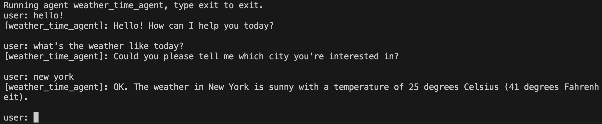

# コマンドラインを使う

<div class="language-support-tag">
  <span class="lst-supported">ADKでサポート</span><span class="lst-python">Python v0.1.0</span><span class="lst-typescript">TypeScript v0.2.0</span><span class="lst-go">Go v0.1.0</span><span class="lst-java">Java v0.1.0</span>
</div>

ADK はエージェントをテストするための対話型ターミナルインターフェースを提供します。これは
クイックテスト、スクリプト化されたやり取り、CI/CD パイプラインに有用です。



## エージェントを実行する

ADK コマンドラインインターフェースでエージェントを実行するには、次のコマンドを使用します:

=== "Python"

    ```shell
    adk run my_agent
    ```

=== "TypeScript"

    ```shell
    npx @google/adk-devtools run agent.ts
    ```

=== "Go"

    ```shell
    go run agent.go
    ```

=== "Java"

    `AgentCliRunner` クラスを作成し ( [Java Quickstart](../get-started/java.md) 参照 )、次を実行します:

    ```shell
    mvn compile exec:java -Dexec.mainClass="com.example.agent.AgentCliRunner"
    ```

これにより、クエリを入力し、ターミナル上でエージェントの応答を直接確認できる
対話セッションが開始されます:

```shell
Running agent my_agent, type exit to exit.
[user]: What's the weather in New York?
[my_agent]: The weather in New York is sunny with a temperature of 25°C.
[user]: exit
```

## セッションオプション

`adk run` コマンドには、セッションの保存・再開・リプレイ用オプションがあります。

### セッションを保存する

終了時にセッションを保存するには:

```shell
adk run --save_session path/to/my_agent
```

セッション ID の入力を求められ、セッションは
`path/to/my_agent/<session_id>.session.json` に保存されます。

セッション ID を事前に指定することもできます:

```shell
adk run --save_session --session_id my_session path/to/my_agent
```

### セッションを再開する

以前保存したセッションを続行するには:

```shell
adk run --resume path/to/my_agent/my_session.session.json path/to/my_agent
```

これにより、以前のセッション状態とイベント履歴が読み込まれて表示され、
会話を続けられます。

### セッションをリプレイする

対話入力なしでセッションファイルをリプレイするには:

```shell
adk run --replay path/to/input.json path/to/my_agent
```

入力ファイルには初期状態とクエリを含める必要があります:

```json
{
  "state": {"key": "value"},
  "queries": ["What is 2 + 2?", "What is the capital of France?"]
}
```

## ストレージオプション

| Option | Description | Default |
|--------|-------------|---------|
| `--session_service_uri` | カスタムセッションストレージ URI | `.adk/session.db` 配下の SQLite |
| `--artifact_service_uri` | カスタムアーティファクトストレージ URI | ローカル `.adk/artifacts` |
| `--memory_service_uri` | カスタムメモリサービス URI | インメモリ（In-memory） |

### ストレージオプションの例

```shell
adk run --session_service_uri "sqlite:///my_sessions.db" path/to/my_agent
```

## すべてのオプション

| Option | Description |
|--------|-------------|
| `--save_session` | 終了時にセッションを JSON ファイルへ保存 |
| `--session_id` | 保存時に使用するセッション ID |
| `--resume` | 再開する保存済みセッションファイルのパス |
| `--replay` | 非対話リプレイ用入力ファイルのパス |
| `--session_service_uri` | カスタムセッションストレージ URI |
| `--artifact_service_uri` | カスタムアーティファクトストレージ URI |
| `--memory_service_uri` | カスタムメモリサービス URI |

## 利用状況のテレメトリ (Usage telemetry)

ADK CLI は、機能の導入状況の把握、開発の優先順位付け、ツールのパフォーマンス向上のために、匿名の利用状況テレメトリ データを収集します。データ収集は、明示的に有効化を選択するまで、デフォルトでオフ (OFF) になっています。

テレメトリの設定は、マシン上の `~/.adk/config.json` にローカルに保存されます。ターミナルからいつでもテレメトリ データの収集を管理できます。

- **有効化**: `adk telemetry enable`
- **無効化**: `adk telemetry disable`
- **ステータス確認**: `adk telemetry status`

`~/.adk/config.json` を開き、`telemetry` 属性を `false` に設定することで、いつでも手動でデータ収集を無効化することもできます。

```json
{
  "telemetry": false
}
```

**収集されるデータ**

- **環境プロパティ**: オペレーティング システム情報、ランタイムの言語とバージョン、インストールされている ADK CLI のバージョン。
- **コマンド実行イベント**: 汎用的なコマンドおよびサブコマンド名、渡されたフラグ、実行時間、終了コード、エラー発生時の例外タイプ。また、コマンド実行後に破棄されるエフェメラル セッション ID とシーケンス番号も記録します。

**収集されないデータ**

CLI は、機密データ、プライベート データ、または個人データを収集しません。具体的には以下が含まれます。

- エージェント名、プロンプト文字列、ファイル パスなど、コマンドやフラグに渡された引数やパラメータの値。
- ユーザー認証情報、ユーザー名、API キー、OAuth トークン、シークレット。
- Google Cloud プロジェクト ID または Cloud アカウントの詳細。
- ソース コード ファイル、ファイルの内容、ディレクトリ パス。
- 個人特定情報 (PII)。
