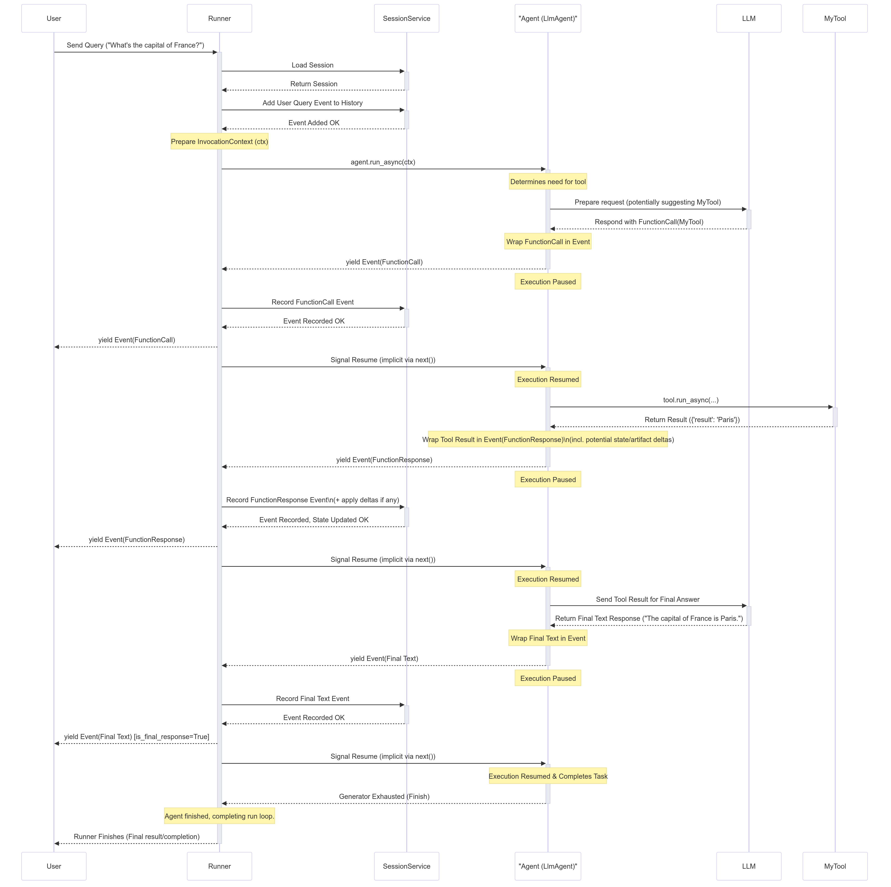

# ADK 実行ループ

<div class="language-support-tag">
  <span class="lst-supported">ADKでサポート</span><span class="lst-python">Python v0.1.0</span><span class="lst-typescript">TypeScript v0.2.0</span><span class="lst-kotlin">Kotlin v0.7.0</span><span class="lst-go">Go v0.1.0</span><span class="lst-java">Java v0.1.0</span>
</div>

ADK (Agent Development Kit) の中心には、非同期イベント駆動型アーキテクチャがあります。上位レベルでは、`Runner` がエージェントとツールで構成される実行ロジックと連携して、会話をターンごとに進めます。このフローを理解することで、状態の変更、ストリーミング出力、非同期操作がどのようにシームレスにオーケストレーションされるかを把握できます。

## コア概念: Yield-and-Resume イベント ループ

ADK 実行ループの基本的なメカニズムは、**協調型ジェネレータ/ストリーム (cooperative generator/stream)** モデルです。エージェントが実行される際、一度にすべてを実行して単一の結果を返すことはありません。代わりに、一連の `Event` オブジェクトを段階的に**生成 (yield/emit)** します。

### ループの仕組み:

1. **`Runner` がループを開始します:** `Runner` はユーザーのクエリを受信してセッション履歴に記録し、エージェントのメイン実行メソッド (`run_async`) を呼び出してプロセスを開始します。
2. **エージェントがイベントを生成 (Yield) して一時停止します:** エージェントが出力を生成したり (思考、テキスト チャンクなど)、ツールを呼び出す必要があったり、状態を変更したりするたびに、それらのアクションを含む `Event` オブジェクトを生成 (yield) します。**イベントを生成した直後に、エージェントの実行は一時停止されます。**
3. **`Runner` がイベントを処理します:** `Runner` は一時停止したエージェントから生成されたイベントを受け取ります。次の操作を実行します。
    * イベントをセッションの `event history` に記録します。
    * イベントで指定されたアクション (セッション状態への `state_delta` の適用、アーティファクトの保存確認など) をコミットします。
    * 処理されたイベントをアップストリーム (UI へのストリーミングなど) に転送します。
4. **`Runner` がエージェントを再開 (Resume) します:** イベント処理が完了すると、`Runner` はエージェントの実行を再開するようにシグナルを送ります。
5. **エージェントが続行します:** エージェントは中断したところから再開し、前のイベントで要求された状態の変更やアクションが `SessionService` によって正常にコミットされたことを確認できます。
6. **繰り返し:** この生成、一時停止、処理、再開のサイクルは、エージェントが現在のユーザー クエリに対する作業を完了するまで続きます。

### 概念的なコード例

次の簡略化された疑似コードは、`Runner` とエージェントの実行ロジック間の相互作用を示しています。

=== "Python"

    ```py
    # Runner のメイン ループ ロジックの簡略化
    async def run_async(new_query, ...) -> AsyncGenerator[Event, None]:
        # 1. 新しいクエリをセッション イベント履歴に追加 (SessionService 経由)
        await session_service.append_event(session, Event(author='user', content=new_query))

        # 2. エージェントを呼び出してイベント ループを開始
        agent_event_generator = agent_to_run.run_async(context)

        async for event in agent_event_generator:
            # 3. 生成されたイベントを処理し、変更をコミット
            await session_service.append_event(session, event) # 状態/アーティファクト デルタなどをコミット
            # memory_service.update_memory(...) # 該当する場合
            # artifact_service はエージェント実行中にコンテキスト経由ですでに呼び出されている可能性があります

            # 4. アップストリーム処理 (UI レンダリングなど) のためにイベントを yield
            yield event
            # Runner は yield 後にエージェント ジェネレータが続行できることを暗黙的にシグナル送信
    ```

=== "TypeScript"

    ```typescript
    // Runner のメイン ループ ロジックの簡略化
    async * runAsync(newQuery: Content, ...): AsyncGenerator<Event, void, void> {
        // 1. 新しいクエリをセッション イベント履歴に追加 (SessionService 経由)
        await sessionService.appendEvent({
            session,
            event: createEvent({author: 'user', content: newQuery})
        });

        // 2. エージェントを呼び出してイベント ループを開始
        const agentEventGenerator = agentToRun.runAsync(context);

        for await (const event of agentEventGenerator) {
            // 3. 生成されたイベントを処理し、変更をコミット
            await sessionService.appendEvent({session, event}); // 状態/アーティファクト デルタなどをコミット
            // memoryService.updateMemory(...) // 該当する場合

            // 4. アップストリーム処理のためにイベントを yield
            yield event;
            // Runner は yield 後にエージェント ジェネレータが続行できることを暗黙的にシグナル送信
        }
    }
    ```

=== "Kotlin"

    ```kotlin
    --8<-- "examples/kotlin/snippets/runtime/RunnerLoop.kt:conceptual_loop"
    ```

=== "Go"

    ```go
    // Go では、エージェント ランタイムはチャネルまたはイテレータを利用します
    func (r *Runner) RunAsync(ctx context.Context, session *session.Session, query *session.Content) iter.Seq2[*session.Event, error] {
        return func(yield func(*session.Event, error) bool) {
            userEvent := session.NewEvent(ctx, r.invocationID)
            userEvent.Author = "user"
            userEvent.Content = query
            r.sessionService.AppendEvent(ctx, session, userEvent)

            for event, err := range r.agent.Run(ctx) {
                if err != nil {
                    yield(nil, err)
                    return
                }
                r.sessionService.AppendEvent(ctx, session, event)

                if !yield(event, nil) {
                    return
                }
            }
        }
    }
    ```

=== "Java"

    ```java
    public Flowable<Event> runAsync(Session session, Content newQuery) {
        Event userEvent = Event.builder().author("user").content(newQuery).build();
        return sessionService.appendEvent(session, userEvent)
            .andThen(Flowable.defer(() -> agentToRun.runAsync(context)))
            .concatMap(event -> sessionService.appendEvent(session, event).andThen(Flowable.just(event)));
    }
    ```

### 実行ロジックの観点

エージェントの実装内では、イベントのストリームを生成します。

=== "Python"

    ```py
    # エージェント実行ロジック内部
    async def _run_async_impl(self, ctx: InvocationContext) -> AsyncGenerator[Event, None]:
        # 中間の思考または部分的なテキストを yield
        yield Event(author=self.name, content=Content(parts=[Part.from_text("思考中...")]), partial=True)
        # --- 一時停止 --- Runner が処理後に再開 ---

        # 状態変更の準備
        ctx.session.state['my_key'] = 'new_value'
        # 状態デルタとともにイベントを yield
        yield Event(author=self.name, actions=EventActions(state_delta={'my_key': 'new_value'}))
        # --- 一時停止 --- Runner/SessionService が 'my_key' をコミット後に再開 ---

        # これで 'my_key' は確実にコミット済み
        yield Event(author=self.name, content=Content(parts=[Part.from_text("完了!")]))
    ```

=== "TypeScript"

    ```typescript
    // TypeScript エージェント実行ロジック内部
    async * _runAsyncImpl(ctx: InvocationContext): AsyncGenerator<Event, void, void> {
        yield createEvent({
            author: this.name,
            content: createContent({parts: [createPart({text: "思考中..."})]}),
            partial: true
        });

        ctx.state.set('my_key', 'new_value');
        yield createEvent({
            author: this.name,
            actions: createEventActions({stateDelta: {'my_key': 'new_value'}})
        });

        yield createEvent({
            author: this.name,
            content: createContent({parts: [createPart({text: "完了!"})]})
        });
    }
    ```

=== "Kotlin"

    ```kotlin
    --8<-- "examples/kotlin/snippets/runtime/RunnerLoop.kt:execution_logic"
    ```

`Event` オブジェクトを介した `Runner` と実行ロジックの間の協調的な yield/一時停止/再開サイクルが、ADK ランタイムのコアを形成します。

## ランタイムの主要コンポーネント

ADK ランタイム内でエージェント呼び出しを実行するために、いくつかのコンポーネントが連携して機能します。

1. ### `Runner`

      * **役割:** 単一のユーザー クエリに対するメイン エントリ ポイントおよびオーケストレーター (`run_async`)。
      * **機能:** 全体的なイベント ループを管理し、実行ロジックによって生成されたイベントを受信し、サービスと連携してイベント アクション (状態/アーティファクトの変更) を処理およびコミットし、処理されたイベントをアップストリーム (UI など) に転送します。生成されたイベントに基づいて会話をターンごとに駆動します (`google.adk.runners` で定義)。

2. ### 実行ロジック コンポーネント (Execution Logic Components)

      * **役割:** カスタム コードとコア エージェント機能を含む部分。
      * **コンポーネント:**
        * `Agent` (`BaseAgent`、`LlmAgent` など): 情報を処理しアクションを決定するプライマリ ロジック ユニット。イベントを生成する `_run_async_impl` メソッドを実装します。
        * `Tools` (`BaseTool`、`FunctionTool`、`AgentTool` など): エージェント (主に `LlmAgent`) が外部世界と対話したり、特定のタスクを実行したりするために使用する外部関数または機能。実行されて結果を返し、イベントにラップされます。
        * `Callbacks` (関数): 実行フローの特定のポイントにフックし、動作や状態を変更する可能性のあるエージェントにアタッチされたユーザー定義関数 (`before_agent_callback`、`after_model_callback` など)。その効果はイベントにキャプチャされます。
      * **機能:** 実際の思考、計算、または外部との対話を実行します。**`Event` オブジェクトを生成 (yield)** し、Runner が処理するまで一時停止することで、結果やニーズを伝達します。

3. ### `Event`

      * **役割:** `Runner` と実行ロジックの間でやり取りされるメッセージ。
      * **機能:** アトミックな発生 (ユーザー入力、エージェント テキスト、ツール呼び出し/結果、状態変更要求、制御信号) を表します。発生のコンテンツと意図された副作用 (`state_delta` などの `actions`) の両方を保持します。

4. ### `Services`

      * **役割:** 永続リソースまたは共有リソースの管理を担当するバックエンド コンポーネント。イベント処理中に主に `Runner` によって使用されます。
      * **コンポーネント:**
        * `SessionService` (`BaseSessionService`、`InMemorySessionService` など): `Session` オブジェクトの保存/読み込み、セッション状態への `state_delta` の適用、`event history` へのイベントの追加など、`Session` を管理します。
        * `ArtifactService` (`BaseArtifactService`、`InMemoryArtifactService`、`GcsArtifactService` など): バイナリ アーティファクト データの保存と取得を管理します。実行ロジック中にコンテキストを介して `save_artifact` が呼び出されますが、イベント内の `artifact_delta` は Runner/SessionService のアクションを確認します。
        * `MemoryService` (`BaseMemoryService` など): (オプション) ユーザーのセッション間にわたる長期的なセマンティック メモリを管理します。
      * **機能:** 永続化層を提供します。`Runner` はそれらと連携して、実行ロジックが再開される*前*に、`event.actions` で通知された変更が確実に保存されるようにします。

5. ### `Session`

      * **役割:** ユーザーとアプリケーション間の*特定の 1 回の会話*の状態と履歴を保持するデータ コンテナ。
      * **機能:** 現在の `state` 辞書、過去のすべての `events` のリスト (`event history`)、および関連するアーティファクトへの参照を保存します。`SessionService` によって管理される対話のプライマリ レコードです。

6. ### `Invocation`

      * **役割:** `Runner` がユーザー クエリを受信した瞬間から、エージェント ロジックがそのクエリに対するイベントの生成を終了するまで、*単一*のクエリに応じて発生するすべてを表す概念的な用語。
      * **機能:** 呼び出しには、単一の `InvocationContext` 内の `invocation_id` によって結び付けられた複数のエージェントの実行 (エージェント転送または `AgentTool` を使用する場合)、複数の LLM 呼び出し、ツール実行、およびコールバック実行が含まれる場合があります。プレフィックス `temp:` が付いた状態変数は、単一の呼び出しに厳密にスコープされ、その後破棄されます。

## 仕組み: 簡略化された呼び出しフロー

LLM エージェントがツールを呼び出す一般的なユーザー クエリの簡略化されたフローを追跡してみましょう。



### ステップバイステップの分析

1. **ユーザー入力:** ユーザーがクエリを送信します (例: 「フランスの首都はどこですか?」)。
2. **Runner の開始:** `Runner.run_async` が始まります。`SessionService` と対話して関連する `Session` を読み込み、ユーザー クエリをセッション履歴の最初の `Event` として追加します。`InvocationContext` (`ctx`) が準備されます。
3. **エージェントの実行:** `Runner` は、指定されたルート エージェント (`LlmAgent` など) で `agent.run_async(ctx)` を呼び出します。
4. **LLM 呼び出し (例):** `Agent_Llm` は、ツールを呼び出すことによって情報を取得する必要があると判断します。`LLM` へのリクエストを準備します。LLM が `MyTool` を呼び出すことを決定したと仮定します。
5. **FunctionCall イベントの Yield:** `Agent_Llm` は LLM から `FunctionCall` 応答を受信し、それを `Event(author='Agent_Llm', content=Content(parts=[Part(function_call=...)]))` にラップし、このイベントを `yield` または `emit` します。
6. **エージェントの一時停止:** `Agent_Llm` の実行は `yield` の直後に一時停止します。
7. **Runner の処理:** `Runner` は FunctionCall イベントを受信します。それを履歴に記録するために `SessionService` に渡します。次に、`Runner` はイベントをアップストリーム (`User` またはアプリケーション) に yield します。
8. **エージェントの再開:** `Runner` はイベントが処理されたことを通知し、`Agent_Llm` は実行を再開します。
9. **ツールの実行:** `Agent_Llm` の内部フローは、要求された `MyTool` の実行に進みます。`tool.run_async(...)` を呼び出します。
10. **ツールの結果の返却:** `MyTool` が実行され、結果を返します (例: `{'result': 'Paris'}`)。
11. **FunctionResponse イベントの Yield:** エージェント (`Agent_Llm`) はツールの結果を `FunctionResponse` パートを含む `Event` にラップします。ツールが状態を変更した場合 (`state_delta`) やアーティファクトを保存した場合 (`artifact_delta`)、このイベントに `actions` が含まれる場合があります。エージェントはこのイベントを `yield` します。
12. **エージェントの一時停止:** `Agent_Llm` が再び一時停止します。
13. **Runner の処理:** `Runner` は FunctionResponse イベントを受信します。すべての `state_delta`/`artifact_delta` を適用し、イベントを履歴に追加する `SessionService` に渡します。`Runner` はイベントをアップストリームに yield します。
14. **エージェントの再開:** `Agent_Llm` が再開し、ツールの結果とすべての状態変更がコミットされたことを認識します。
15. **最終的な LLM 呼び出し (例):** `Agent_Llm` は自然言語応答を生成するために、ツールの結果を `LLM` に送り返します。
16. **最終テキスト イベントの Yield:** `Agent_Llm` は LLM から最終テキストを受け取り、`Event(author='Agent_Llm', content=Content(parts=[Part(text=...)]))` にラップして `yield` します。
17. **エージェントの一時停止:** `Agent_Llm` が一時停止します。
18. **Runner の処理:** `Runner` は最終テキスト イベントを受信し、履歴のために `SessionService` に渡し、アップストリームで `User` に yield します。これは `is_final_response()` としてマークされる可能性があります。
19. **エージェントの再開と完了:** `Agent_Llm` が再開します。今回の呼び出しに対するタスクを完了したため、`run_async` ジェネレータが終了します。
20. **Runner の完了:** `Runner` はエージェントのジェネレータが完了したことを確認し、今回の呼び出しに対するループを終了します。

## 重要なランタイム動作

### 状態の更新とコミットのタイミング (State Updates & Commitment Timing)

* **ルール:** コード (エージェント、ツール、またはコールバック内) がセッション状態を変更すると (例: `context.state['my_key'] = 'new_value'`)、この変更は最初、現在の `InvocationContext` 内にローカルに記録されます。変更は、対応する `state_delta` を含む `Event` がコードによって `yield` され、その後 `Runner` によって処理された*後*にのみ**永続化 (SessionService によって保存) されることが保証**されます。
* **意味:** `yield` から再開した後に実行されるコードは、*生成されたイベント*で示された状態変更がコミットされていると安全に想定できます。

=== "Python"

    ```py
    # エージェント ロジック内部 (概念的)

    # 1. 状態を変更
    ctx.session.state['status'] = 'processing'
    event1 = Event(..., actions=EventActions(state_delta={'status': 'processing'}))

    # 2. デルタとともにイベントを yield
    yield event1
    # --- 一時停止 --- Runner が event1 を処理し、SessionService が 'status' = 'processing' をコミット ---

    # 3. 実行を再開
    # コミットされた状態に依存しても安全です
    current_status = ctx.session.state['status'] # 'processing' であることが保証されます
    print(f"Status after resuming: {current_status}")
    ```

=== "TypeScript"

    ```typescript
    // エージェント ロジック内部 (概念的)

    // 1. 状態を変更
    ctx.state.set('status', 'processing');
    const event1 = createEvent({
        actions: createEventActions({stateDelta: {'status': 'processing'}}),
        // ... その他のイベント フィールド
    });

    // 2. デルタとともにイベントを yield
    yield event1;
    // --- 一時停止 --- Runner が event1 を処理し、SessionService が 'status' = 'processing' をコミット ---

    // 3. 実行を再開
    const currentStatus = ctx.session.state['status']; // 'processing' であることが保証されます
    console.log(`Status after resuming: ${currentStatus}`);
    ```

=== "Go"

    ```go
    func (a *Agent) RunConceptual(ctx agent.InvocationContext) iter.Seq2[*session.Event, error] {
      return func(yield func(*session.Event, error) bool) {
          updateData := map[string]interface{}{"field_1": "value_2"}
          eventWithStateChange := session.NewEvent(ctx, ctx.InvocationID())
          eventWithStateChange.Author = a.Name()
          eventWithStateChange.Actions = &session.EventActions{StateDelta: updateData}

          if !yield(eventWithStateChange, nil) {
              return
          }

          finalEvent := session.NewEvent(ctx, ctx.InvocationID())
          finalEvent.Author = a.Name()
          yield(finalEvent, nil)
      }
    }
    ```

=== "Java"

    ```java
    ConcurrentHashMap<String, Object> stateChanges = new ConcurrentHashMap<>();
    stateChanges.put("status", "processing");

    EventActions actions = EventActions.builder().stateDelta(stateChanges).build();
    Event event1 = Event.builder().actions(actions).build();

    return Flowable.just(event1)
        .map(emittedEvent -> {
            String currentStatus = (String) ctx.session().state().get("status");
            System.out.println("Status after resuming: " + currentStatus);
            return emittedEvent;
        });
    ```

=== "Kotlin"

    ```kotlin
    --8<-- "examples/kotlin/snippets/runtime/RunnerLoop.kt:state_update_timing"
    ```

### セッション状態の「ダーティ リード (Dirty Reads)」

* **定義:** コミットは yield の*後*に発生しますが、*同じ呼び出し内で後から*実行され、状態変更イベントが実際に生成されて処理される*前*に実行されるコードは、**ローカルのコミットされていない変更を確認できることがよくあります**。これは「ダーティ リード (dirty read)」と呼ばれることがあります。

=== "Python"

    ```py
    # before_agent_callback のコード
    callback_context.state['field_1'] = 'value_1'
    # 状態はローカルで 'value_1' に設定されていますが、まだ Runner によってコミットされていません

    # ... エージェントが実行 ...

    # 同じ呼び出し内で後から呼び出されたツールのコード
    # 読み取り可能 (ダーティ リード) ですが、'value_1' はまだ永続的であるとは保証されていません
    val = tool_context.state['field_1'] # ここでは 'val' は 'value_1' になる可能性が高いです
    print(f"Dirty read value in tool: {val}")
    ```

=== "TypeScript"

    ```typescript
    // beforeAgentCallback のコード
    callbackContext.state.set('field_1', 'value_1');

    // --- エージェントが実行 ... ---

    // 同じ呼び出し内で後から呼び出されたツールのコード
    const val = toolContext.state.get('field_1');
    console.log(`Dirty read value in tool: ${val}`);
    ```

=== "Go"

    ```go
    ctx.State.Set("field_1", "value_1")

    // ... エージェントが実行 ...

    val := ctx.State.Get("field_1")
    fmt.Printf("Dirty read value in tool: %v\n", val)
    ```

=== "Java"

    ```java
    callbackContext.state().put("field_1", "value_1");
    Object val = toolContext.state().get("field_1");
    System.out.println("Dirty read value in tool: " + val);
    ```

=== "Kotlin"

    ```kotlin
    --8<-- "examples/kotlin/snippets/runtime/RunnerLoop.kt:dirty_read"
    ```

### ストリーミング出力と非ストリーミング出力 (`partial=True`)

* **ストリーミング:** LLM はトークンごとまたは小さなチャンクで応答を生成します。フレームワークは単一の応答に対して複数の `Event` オブジェクトを生成し、そのほとんどに `partial=True` が設定されています。`Runner` は `partial=True` のイベントを受信すると、すぐにアップストリームに転送しますが、`state_delta` などの `actions` の処理はスキップします。最後の完了イベント (`partial=False`) のみで `actions` を完全に処理して状態をコミットします。
* **非ストリーミング:** LLM は応答全体を一度に生成します。フレームワークは `partial=False` とマークされた単一のイベントを生成し、`Runner` はそれを完全に処理します。

## 非同期がプライマリ (`run_async`)

* **コア設計:** ADK ランタイムは、ブロッキングなしで同時実行操作を効率的に処理するために、非同期パターンとライブラリ (Python の `asyncio`、Java の `RxJava`、TypeScript のネイティブ `Promise` および `AsyncGenerator`) に基づいて構築されています。
* **メイン エントリ ポイント:** `Runner.run_async` がエージェント呼び出しを実行するためのプライマリ メソッドです。
* **同期の利便性 (`run`):** 同期の `Runner.run` メソッドは主に利便性のために存在します (簡単なスクリプトやテストなど)。内部的には、`Runner.run` は `Runner.run_async` を呼び出し、非同期イベント ループの実行を管理します。
* **同期コールバック/ツール:**
    * **ブロッキング I/O:** 長時間実行される同期 I/O 操作の場合、フレームワークが常にストールを防げるわけではありません。Python ADK は asyncio イベント ループ上で同期ツール関数をインラインで呼び出すため、内部のブロッキング入出力はループを停止させます。ライブ モードでは、`RunConfig.tool_thread_pool_config` を設定してツールの実行をバックグラウンド スレッド プールで実行できます。Java ADK はブロッキング呼び出しのために適切な RxJava スケジューラまたはラッパーに依存することがよくあります。TypeScript では、フレームワークは単に関数を await します。同期関数がブロッキング I/O を実行すると、イベント ループが停止します。開発者は可能な限り非同期 I/O API (Promise を返す) を使用する必要があります。
    * **CPU バウンドの作業:** 純粋に CPU を消費する同期タスクは、両方の環境で実行スレッドをブロックします。
