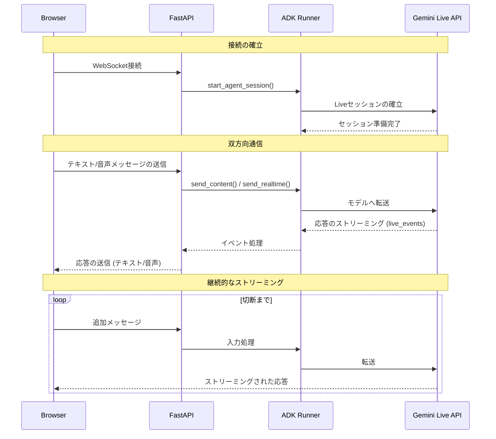

# カスタムオーディオストリーミングアプリケーション（WebSocket）{#custom-streaming-websocket}

<div class="language-support-tag">
    <span class="lst-supported">ADKでサポート</span><span class="lst-python">Python v0.5.0</span><span class="lst-preview">実験的機能</span>
</div>

この記事では、ADK双方向ストリーミング（Bidi-streaming）と[FastAPI](https://fastapi.tiangolo.com/)を使用して構築された、カスタム双方向ストリーミングWebアプリケーションのサーバーとクライアントのコードの概要を説明します。このアプリケーションは、WebSocketを介してリアルタイムで双方向の音声およびテキスト通信を可能にします。

**注：** このガイドは、JavaScriptとPythonの`asyncio`プログラミングの経験があることを前提としています。

## 音声/ビデオストリーミング対応モデル {#supported-models}

ADKで音声/ビデオストリーミングを使用するには、Live APIをサポートするGeminiモデルを使用する必要があります。Gemini Live APIをサポートする**モデルID**は、以下のドキュメントで確認できます。

- [Google AI Studio: Gemini Live API](https://ai.google.dev/gemini-api/docs/models#live-api)
- [Vertex AI: Gemini Live API](https://cloud.google.com/vertex-ai/generative-ai/docs/live-api)

## 1. ADKのインストール {#1-setup-installation}

サンプルコードをダウンロードします。

```bash
curl -L https://github.com/google/adk-docs/archive/refs/heads/main.tar.gz | \
  tar xz --strip=5 adk-docs-main/examples/python/snippets/streaming/adk-streaming-ws

cd adk-streaming-ws
```

仮想環境の作成とアクティベート（推奨）：

```bash
# 作成
python -m venv .venv
# アクティベート（新しいターミナルごと）
# macOS/Linux: source .venv/bin/activate
# Windows CMD: .venv\Scripts\activate.bat
# Windows PowerShell: .venv\Scripts\Activate.ps1
```

ADKをインストールします。

```bash
pip install --upgrade google-adk==1.17.0
```

次のコマンドで`SSL_CERT_FILE`変数を設定します。

```bash
export SSL_CERT_FILE=$(python -m certifi)
```

appフォルダに移動します。

```bash
cd app
```

このサンプルコードには、以下のファイルとフォルダが含まれています。

```console
adk-streaming-ws/
└── app/ # Webアプリのフォルダ
    ├── .env # Gemini APIキー / Google CloudプロジェクトID
    ├── main.py # FastAPI Webアプリ
    ├── static/ # 静的コンテンツフォルダ
    |   ├── js # JavaScriptファイルフォルダ（app.jsを含む）
    |   └── index.html # Webクライアントページ
    └── google_search_agent/ # Agentフォルダ
        ├── __init__.py # Pythonパッケージ
        └── agent.py # Agentの定義
```

## 2. プラットフォームのセットアップ {#2-set-up-the-platform}

サンプルアプリを実行するには、Google AI StudioまたはGoogle Cloud Vertex AIのいずれかのプラットフォームを選択してください。

=== "Gemini - Google AI Studio"
    1. [Google AI Studio](https://aistudio.google.com/apikey)からAPIキーを取得してください。
    2. （`app/`）内にある**`.env`**ファイルを開き、次のコードをコピー＆ペーストしてください。

        ```env title=".env"
        GOOGLE_GENAI_USE_VERTEXAI=FALSE
        GOOGLE_API_KEY=PASTE_YOUR_ACTUAL_API_KEY_HERE
        DEMO_AGENT_MODEL=gemini-2.5-flash-native-audio-preview-09-2025
        #DEMO_AGENT_MODEL=gemini-2.0-flash-exp # 上記モデルが動作しない場合
        ```

    3. `PASTE_YOUR_ACTUAL_API_KEY_HERE`を実際の`APIキー`に置き換えてください。

=== "Gemini - Google Cloud Vertex AI"
    1. 既存の[Google Cloud](https://cloud.google.com/?e=48754805&hl=en)アカウントとプロジェクトが必要です。
        * [Google Cloudプロジェクトのセットアップ](https://cloud.google.com/vertex-ai/generative-ai/docs/start/quickstarts/quickstart-multimodal#setup-gcp)
        * [gcloud CLIのセットアップ](https://cloud.google.com/vertex-ai/generative-ai/docs/start/quickstarts/quickstart-multimodal#setup-local)
        * ターミナルから`gcloud auth login`を実行してGoogle Cloudに認証します。
        * [Vertex AI APIを有効にする](https://console.cloud.google.com/flows/enableapi?apiid=aiplatform.googleapis.com)。
    2. （`app/`）内にある**`.env`**ファイルを開きます。次のコードをコピー＆ペーストし、プロジェクトIDとロケーションを更新してください。

        ```env title=".env"
        GOOGLE_GENAI_USE_VERTEXAI=TRUE
        GOOGLE_CLOUD_PROJECT=PASTE_YOUR_ACTUAL_PROJECT_ID
        GOOGLE_CLOUD_LOCATION=us-central1
        DEMO_AGENT_MODEL=gemini-live-2.5-flash-preview-native-audio-09-2025
        #DEMO_AGENT_MODEL=gemini-2.0-flash-exp # 上記モデルが動作しない場合
        ```


### agent.py

`google_search_agent`フォルダにあるエージェント定義コード`agent.py`は、エージェントのロジックが記述される場所です。


```py
import os
from google.adk.agents import Agent
from google.adk.tools import google_search  # ツールをインポート

root_agent = Agent(
   name="google_search_agent",
   model=os.getenv("DEMO_AGENT_MODEL"),
   description="Agent to answer questions using Google Search.",
   instruction="Answer the question using the Google Search tool.",
   tools=[google_search],
)
```

**注：** このアプリケーションは、テキストと音声/ビデオの両方の入力に対してリアルタイムの双方向ストリーミングを可能にするGemini Live API（別名 `bidiGenerateContent`）を使用します。双方向ストリーミングが機能するためには、モデルがLive APIをサポートしている必要があります。モデルの機能については、以下を参照して確認してください。

- [Gemini Live API - サポートモデル](https://ai.google.dev/gemini-api/docs/live#supported-models)
- [Vertex AI Live API - モデルサポート](https://cloud.google.com/vertex-ai/generative-ai/docs/live-api#models)

エージェントは、`.env`ファイルの`DEMO_AGENT_MODEL`環境変数で指定されたモデルを使用します。

[Google検索によるグラウンディング](https://ai.google.dev/gemini-api/docs/grounding?lang=python#configure-search)機能をいかに簡単に統合できたかに注目してください。`Agent`クラスと`google_search`ツールが、LLMとの複雑なやり取りや検索APIによるグラウンディングを処理するため、開発者はエージェントの*目的*と*振る舞い*に集中できます。


## 3. ストリーミングアプリケーションとの対話 {#3-interact-with-your-streaming-app}

1.  **正しいディレクトリに移動：**

    エージェントを効果的に実行するために、**appフォルダ（`adk-streaming-ws/app`）**にいることを確認してください。

2.  **FastAPIの起動**: 次のコマンドを実行してCLIインターフェースを起動します。

```bash
uvicorn main:app --reload
```

3.  **テキストモードでアプリにアクセス：** アプリが起動すると、ターミナルにローカルURL（例：[http://localhost:8000](http://localhost:8000)）が表示されます。このリンクをクリックしてブラウザでUIを開きます。

次のようなUIが表示されるはずです。


`What time is it now?`（今何時ですか？）のような質問をしてみてください。エージェントはGoogle検索を使ってあなたの質問に答えます。UIにはエージェントの応答がストリーミングテキストとして表示されるのがわかります。エージェントがまだ応答している最中でも、いつでもメッセージを送信できます。これはADKストリーミングの双方向通信機能を示しています。

4.  **オーディオモードでアプリにアクセス：** `Start Audio`ボタンをクリックします。アプリはオーディオモードでサーバーに再接続し、初回はUIに次のようなダイアログが表示されます。


`Allow while visiting the site`（サイト訪問中に許可）をクリックすると、ブラウザの上部にマイクアイコンが表示されます。


これで、音声でエージェントと会話できます。`What time is it now?`のような質問を音声で行うと、エージェントも音声で応答するのが聞こえます。ADKのストリーミングは[多言語](https://ai.google.dev/gemini-api/docs/live#supported-languages)をサポートしているため、サポートされている言語での質問にも応答できます。

5.  **コンソールログの確認**

Chromeブラウザを使用している場合、右クリックして`Inspect`（検証）を選択し、DevToolsを開きます。`Console`タブで、`[CLIENT TO AGENT]`や`[AGENT TO CLIENT]`のような、ブラウザとサーバー間でストリーミングされる音声データを表す送受信データを確認できます。

同時に、アプリのサーバーコンソールには次のような内容が表示されるはずです。

```
INFO:     ('127.0.0.1', 50068) - "WebSocket /ws/70070018?is_audio=true" [accepted]
Client #70070018 connected, audio mode: true
INFO:     connection open
INFO:     127.0.0.1:50061 - "GET /static/js/pcm-player-processor.js HTTP/1.1" 200 OK
INFO:     127.0.0.1:50060 - "GET /static/js/pcm-recorder-processor.js HTTP/1.1" 200 OK
[AGENT TO CLIENT]: audio/pcm: 9600 bytes.
INFO:     127.0.0.1:50082 - "GET /favicon.ico HTTP/1.1" 404 Not Found
[AGENT TO CLIENT]: audio/pcm: 11520 bytes.
[AGENT TO CLIENT]: audio/pcm: 11520 bytes.
```

これらのコンソールログは、独自のストリーミングアプリケーションを開発する場合に重要です。多くの場合、ブラウザとサーバー間の通信障害がストリーミングアプリケーションのバグの主な原因となります。

6.  **トラブルシューティングのヒント**

- **`ws://`が機能しない場合：** Chrome DevToolsで`ws://`接続に関するエラーが表示された場合は、`app/static/js/app.js`の28行目にある`ws://`を`wss://`に置き換えてみてください。これは、クラウド環境でサンプルを実行し、プロキシ接続を使用してブラウザから接続している場合に発生することがあります。
- **モデルが機能しない場合：** アプリのサーバーコンソールでモデルの可用性に関するエラーが表示された場合は、`.env`ファイルで`#DEMO_AGENT_MODEL=gemini-2.0-flash-exp`行のコメントを解除し、現在の`DEMO_AGENT_MODEL`行をコメントアウトして代替モデルを使用してみてください。

## 4. サーバーコードの概要 {#4-server-side-code-overview}

このサーバーアプリケーションは、WebSocketを介してADKエージェントとのリアルタイムなストリーミング対話を可能にします。クライアントはテキスト/音声をADKエージェントに送信し、ストリーミングされたテキスト/音声の応答を受け取ります。

主要な機能：
1.  ADKエージェントセッションの初期化/管理。
2.  クライアントのWebSocket接続の処理。
3.  クライアントメッセージのADKエージェントへのリレー。
4.  ADKエージェントの応答（テキスト/音声）のクライアントへのストリーミング。

### アーキテクチャの概要

以下の図は、このストリーミングアプリケーションにおけるコンポーネントの相互作用を示しています。



**主要コンポーネント：**
- **Browser:** テキストと音声データを送受信するWebSocketクライアント
- **FastAPI:** WebSocket接続を処理し、メッセージをルーティングするサーバー
- **ADK Runner:** エージェントセッションを管理し、Gemini Live APIと連携
- **Gemini Live API:** リクエストを処理し、応答（テキスト/音声）をストリーミング

### ADKストリーミングのセットアップ

```py
import os
import json
import asyncio
import base64
import warnings

from pathlib import Path
from dotenv import load_dotenv

# エージェントをインポートする前に環境変数をロード
load_dotenv()

from google.genai import types
from google.genai.types import (
    Part,
    Content,
    Blob,
)

from google.adk.runners import Runner
from google.adk.agents import LiveRequestQueue
from google.adk.agents.run_config import RunConfig, StreamingMode
from google.adk.sessions.in_memory_session_service import InMemorySessionService

from fastapi import FastAPI, WebSocket
from fastapi.staticfiles import StaticFiles
from fastapi.responses import FileResponse
from fastapi.websockets import WebSocketDisconnect

from google_search_agent.agent import root_agent

warnings.filterwarnings("ignore", category=UserWarning, module="pydantic")
```

*   **インポート:** 標準のPythonライブラリ（`os`, `json`, `asyncio`, `base64`, `warnings`）、環境変数用の`dotenv`、Google ADK（`types`, `Part`, `Content`, `Blob`, `Runner`, `LiveRequestQueue`, `RunConfig`, `StreamingMode`, `InMemorySessionService`）、およびFastAPI（`FastAPI`, `WebSocket`, `StaticFiles`, `FileResponse`, `WebSocketDisconnect`）が含まれます。
*   **`load_dotenv()`:** `dotenv`をインポートした直後、かつエージェントをインポートする**前**に呼び出されます。これにより、エージェントモジュールが初期化される際に環境変数（`DEMO_AGENT_MODEL`など）が利用可能になります。
*   **`warnings.filterwarnings()`:** 開発中のコンソールノイズを減らすためにPydanticのUserWarningを抑制します。

**初期化:**

```py
#
# ADK Streaming
#

# アプリケーション設定
APP_NAME = "adk-streaming-ws"

# セッションサービスの初期化
session_service = InMemorySessionService()

# APP_NAMEとsession_serviceは上記の初期化セクションで定義されています
runner = Runner(
    app_name=APP_NAME,
    agent=root_agent,
    session_service=session_service,
)
```

*   **`APP_NAME`**: ADK用のアプリケーション識別子です。
*   **`session_service = InMemorySessionService()`**: シングルインスタンスまたは開発用途に適した、インメモリのADKセッションサービスを初期化します。本番環境では永続的なストアを使用する場合があります。
*   **`runner = Runner(...)`**: Runnerインスタンスを**モジュールレベルで一度だけ**作成します（本番環境対応パターン）。これにより、すべての接続で同じRunnerが再利用され、パフォーマンスとリソース利用率が向上します。

#### `start_agent_session(user_id, is_audio=False)`

```py
async def start_agent_session(user_id, is_audio=False):
    """エージェントセッションを開始します"""

    # セッションの取得または作成（本番環境での推奨パターン）
    session_id = f"{APP_NAME}_{user_id}"
    session = await runner.session_service.get_session(
        app_name=APP_NAME,
        user_id=user_id,
        session_id=session_id,
    )
    if not session:
        session = await runner.session_service.create_session(
            app_name=APP_NAME,
            user_id=user_id,
            session_id=session_id,
        )

    # クライアントの希望に応じて応答形式を設定
    # 重要：セッションごとにモダリティを正確に1つだけ選択する必要があります
    # テキスト応答の場合は["TEXT"]、音声応答の場合は["AUDIO"]のいずれかです
    # 同じセッションで両方のモダリティを同時に使用することはできません

    # ネイティブオーディオモデルの場合、クライアントの希望に関わらずAUDIOモダリティを強制
    model_name = root_agent.model if isinstance(root_agent.model, str) else root_agent.model.model
    is_native_audio = "native-audio" in model_name.lower()

    modality = "AUDIO" if (is_audio or is_native_audio) else "TEXT"

    # 信頼性向上のためセッション再開を有効化
    # オーディオモードの場合、UI表示用のテキストを得るため出力音声文字起こしを有効化
    run_config = RunConfig(
        streaming_mode=StreamingMode.BIDI,
        response_modalities=[modality],
        session_resumption=types.SessionResumptionConfig(),
        output_audio_transcription=types.AudioTranscriptionConfig() if (is_audio or is_native_audio) else None,
    )

    # 非同期コンテキストでLiveRequestQueueを作成（推奨されるベストプラクティス）
    # これにより、キューが正しいイベントループを使用することが保証されます
    live_request_queue = LiveRequestQueue()

    # ストリーミングセッションを開始 - エージェント応答用の非同期イテレータを返す
    live_events = runner.run_live(
        user_id=user_id,
        session_id=session.id,
        live_request_queue=live_request_queue,
        run_config=run_config,
    )
    return live_events, live_request_queue
```

この関数はADKエージェントのライブセッションを初期化します。上記の初期化セクションで定義された`APP_NAME`と`session_service`を使用します。

| **パラメータ** | **型** | **説明** |
|---|---|---|
| `user_id` | `str` | ユニークなクライアント識別子。 |
| `is_audio` | `bool` | 音声応答の場合は`True`、テキストの場合は`False`（デフォルト）。 |

**主要なステップ：**
1.  **セッションの取得または作成:** 既存のセッションを取得しようと試み、存在しない場合は新しいセッションを作成します。このパターンはセッションの永続化と再開をサポートします。
2.  **ネイティブオーディオモデルの検出:** エージェントのモデル名に「native-audio」が含まれているかを確認し、ネイティブオーディオモデルに対して自動的にAUDIOモダリティを強制します。
3.  **応答モダリティの設定:** `is_audio=True`またはモデルがネイティブオーディオモデルの場合、モダリティを「AUDIO」に設定し、それ以外の場合は「TEXT」に設定します。注：セッションごとにモダリティを正確に1つだけ選択する必要があります。
4.  **セッション再開の有効化:** ネットワーク中断時の信頼性を向上させるために`session_resumption=types.SessionResumptionConfig()`を設定します。
5.  **出力音声文字起こしの有効化（オーディオモード）:** オーディオモードまたはネイティブオーディオモデルを使用する場合、`output_audio_transcription`を有効にして、UIに表示するための音声応答のテキスト表現を取得します。
6.  **LiveRequestQueueの作成:** クライアントの入力をエージェントに送信するために、非同期コンテキスト（ベストプラクティス）でキューを作成します。
7.  **エージェントセッションの開始:** `runner.run_live(...)`を呼び出してストリーミングセッションを開始し、`live_events`（エージェント応答用の非同期イテレータ）と`live_request_queue`を返します。

**戻り値:** `(live_events, live_request_queue)`。

#### 出力音声文字起こし

オーディオモード（`is_audio=True`）またはネイティブオーディオモデル（`is_native_audio=True`）を使用する場合、アプリケーションは`RunConfig`を介して出力音声文字起こしを有効にします。

```py
output_audio_transcription=types.AudioTranscriptionConfig() if (is_audio or is_native_audio) else None,
```

**音声文字起こし機能：**

- **ネイティブオーディオモデルのサポート** - ネイティブな音声出力機能を持つモデルで動作します。
- **テキスト表現** - UI表示のために音声応答のテキスト文字起こしを提供します。
- **デュアル出力** - 音声再生とテキスト表示の両方を同時に可能にします。
- **アクセシビリティの向上** - ユーザーがエージェントの発言を聞きながら見ることができます。

**ユースケース：**

- より良いユーザーエクスペリエンスのために、UIで音声応答をテキストとして表示する
- テキストを好むユーザーのためのアクセシビリティ機能を有効にする
- エージェントの発言をログに記録してデバッグをサポートする
- 音声と共に会話のトランスクリプトを作成する

**注：** この機能には、出力音声文字起こしをサポートするモデルが必要です。すべてのLive APIモデルがこの機能をサポートしているわけではありません。

#### セッション再開の設定

ADKは、ストリーミング会話中の信頼性を向上させるために、ライブセッションの再開をサポートしています。この機能は、ネットワークの問題でライブ接続が中断された場合の自動再接続を可能にします。

このサンプルアプリケーションでは、`RunConfig`でデフォルトでセッション再開が有効になっています。

```py
run_config = RunConfig(
    streaming_mode=StreamingMode.BIDI,
    response_modalities=[modality],
    session_resumption=types.SessionResumptionConfig()
)
```

##### セッション再開の機能

- **ハンドルの自動キャッシング** - システムはライブ会話中にセッション再開ハンドルを自動的にキャッシュします。
- **透過的な再接続** - 接続が中断されると、システムはキャッシュされたハンドルを使用して再開を試みます。
- **コンテキストの保持** - 会話のコンテキストと状態は再接続後も維持されます。
- **ネットワーク耐性** - 不安定なネットワーク状況下でより良いユーザーエクスペリエンスを提供します。

##### 実装上の注意

- セッション再開ハンドルはADKフレームワークによって内部的に管理されます。
- クライアント側で追加のコード変更は不要です。
- この機能は、長時間のストリーミング会話に特に有益です。
- 接続の中断がユーザーエクスペリエンスに与える影響を軽減します。

##### セッション再開の無効化（任意）

セッション再開でエラーが発生した場合や無効にしたい場合：

1.  **モデルの互換性を確認** - セッション再開をサポートするモデルを使用していることを確認してください。
2.  **APIの制限** - 一部のセッション再開機能は、すべてのAPIバージョンで利用できるわけではありません。
3.  **セッション再開の無効化** - `RunConfig`から`session_resumption`パラメータを削除することで、セッション再開を無効にできます。

```py
# セッション再開を無効化
run_config = RunConfig(
    streaming_mode=StreamingMode.BIDI,
    response_modalities=[modality]
)
```

---

セッションの初期化とオプションの機能強化について説明しましたので、次にクライアントとADKエージェント間の双方向通信を処理する中心的なメッセージング関数を見ていきましょう。

#### `agent_to_client_messaging(websocket, live_events)`

```py

async def agent_to_client_messaging(websocket, live_events):
    """エージェントからクライアントへの通信"""
    try:
        async for event in live_events:

            # ネイティブオーディオモデルのための出力音声文字起こしを処理
            # これにより、UI表示用の音声出力のテキスト表現が提供される
            if event.output_transcription and event.output_transcription.text:
                transcript_text = event.output_transcription.text
                message = {
                    "mime_type": "text/plain",
                    "data": transcript_text,
                    "is_transcript": True
                }
                await websocket.send_text(json.dumps(message))
                print(f"[AGENT TO CLIENT]: audio transcript: {transcript_text}")
                # 音声データが存在する場合は処理を続行
                # 文字起こしと音声の両方を送信する可能性があるため、ここではreturnしない

            # Contentとその最初のPartを読み込む
            part: Part = (
                event.content and event.content.parts and event.content.parts[0]
            )
            if part:
                # 音声データはJSON転送のためにBase64エンコードする必要がある
                is_audio = part.inline_data and part.inline_data.mime_type.startswith("audio/pcm")
                if is_audio:
                    audio_data = part.inline_data and part.inline_data.data
                    if audio_data:
                        message = {
                            "mime_type": "audio/pcm",
                            "data": base64.b64encode(audio_data).decode("ascii")
                        }
                        await websocket.send_text(json.dumps(message))
                        print(f"[AGENT TO CLIENT]: audio/pcm: {len(audio_data)} bytes.")

                # テキストであり、部分的なテキストであれば送信する（カスケードオーディオモデルまたはテキストモード用）
                if part.text and event.partial:
                    message = {
                        "mime_type": "text/plain",
                        "data": part.text
                    }
                    await websocket.send_text(json.dumps(message))
                    print(f"[AGENT TO CLIENT]: text/plain: {message}")

            # ターンが完了または中断された場合は送信
            if event.turn_complete or event.interrupted:
                message = {
                    "turn_complete": event.turn_complete,
                    "interrupted": event.interrupted,
                }
                await websocket.send_text(json.dumps(message))
                print(f"[AGENT TO CLIENT]: {message}")
    except WebSocketDisconnect:
        print("Client disconnected from agent_to_client_messaging")
    except Exception as e:
        print(f"Error in agent_to_client_messaging: {e}")
```

この非同期関数は、ADKエージェントのイベントをWebSocketクライアントにストリーミングします。

**ロジック:**
1.  エージェントからの`live_events`を反復処理します。
2.  **音声文字起こし（ネイティブオーディオモデル）:** イベントに出力音声文字起こしテキストが含まれている場合、`is_transcript`フラグ付きでクライアントに送信します: `{ "mime_type": "text/plain", "data": "<transcript_text>", "is_transcript": True }`。これにより、UIで音声コンテンツをテキストとして表示できます。
3.  **コンテンツ処理:**
    *   イベントコンテンツから最初の`Part`を抽出します（存在する場合）。
    *   **音声データ:** 音声（PCM）の場合、Base64エンコードしてJSONとして送信します: `{ "mime_type": "audio/pcm", "data": "<base64_audio>" }`。
    *   **テキストデータ（カスケードオーディオモデルまたはテキストモード）:** 部分的なテキストの場合、JSONとして送信します: `{ "mime_type": "text/plain", "data": "<partial_text>" }`。
4.  **ターン完了/中断:** 各イベントの最後にステータスフラグをクライアントに送信します（下記参照）。
5.  メッセージをログに記録します。

**ターン完了と中断イベントの理解:**

これらのイベントは、双方向ストリーミング会話を管理する上で非常に重要です。

- **`turn_complete`**: エージェントが完全な応答の生成を終えたことを示します。このイベントは：
  - エージェントの応答ターンの終了を示します
  - UIが次の会話ターンの準備をできるようにします
  - 会話の状態と流れの管理に役立ちます
  - UIでは：次のエージェントの応答が新しいメッセージ要素を作成するように、`currentMessageId`を`null`にリセットします

- **`interrupted`**: エージェントの応答が中断されたことを示します（例：エージェントの音声応答中にユーザーが話し始めた場合）。このイベントは：
  - 現在のエージェントのターンが途中で打ち切られたことを示します
  - ユーザーがエージェントの発言を遮ることができる自然な会話の流れを可能にします
  - UIでは：音声プレイヤーのワークレットに`{ command: "endOfAudio" }`を送信して、直ちに音声再生を停止します
  - ユーザーが話している間にエージェントが話し続けるのを防ぎます

両方のイベントは、シームレスな会話体験を優先するため、UIでは視覚的なインジケータなしで静かに処理されます。

#### `client_to_agent_messaging(websocket, live_request_queue)`

```py

async def client_to_agent_messaging(websocket, live_request_queue):
    """クライアントからエージェントへの通信"""
    try:
        while True:
            message_json = await websocket.receive_text()
            message = json.loads(message_json)
            mime_type = message["mime_type"]
            data = message["data"]

            if mime_type == "text/plain":
                # send_content()はテキストを「ターンごと」モードで送信
                # これによりモデルに完全なターンを通知し、即時応答をトリガー
                content = Content(role="user", parts=[Part.from_text(text=data)])
                live_request_queue.send_content(content=content)
                print(f"[CLIENT TO AGENT]: {data}")
            elif mime_type == "audio/pcm":
                # send_realtime()は音声を「リアルタイム」モードで送信
                # データはターンの境界なく継続的に流れ、自然な会話が可能
                # 音声はJSON転送用にBase64エンコードされているため、送信前にデコード
                decoded_data = base64.b64decode(data)
                live_request_queue.send_realtime(Blob(data=decoded_data, mime_type=mime_type))
            else:
                raise ValueError(f"Mime type not supported: {mime_type}")
    except WebSocketDisconnect:
        print("Client disconnected from client_to_agent_messaging")
    except Exception as e:
        print(f"Error in client_to_agent_messaging: {e}")
```

この非同期関数は、WebSocketクライアントからのメッセージをADKエージェントにリレーします。

**ロジック:**
1.  WebSocketから`{ "mime_type": "text/plain" | "audio/pcm", "data": "<data>" }`形式のJSONメッセージを受信し、解析します。
2.  **テキスト入力:** 「text/plain」の場合、`live_request_queue.send_content()`を介して`Content`をエージェントに送信します。
3.  **音声入力:** 「audio/pcm」の場合、Base64データをデコードし、`Blob`でラップして`live_request_queue.send_realtime()`を介して送信します。
4.  サポートされていないMIMEタイプに対して`ValueError`を発生させます。
5.  メッセージをログに記録します。

**エラーハンドリング:**

`agent_to_client_messaging`と`client_to_agent_messaging`の両関数には、WebSocketの切断を適切に処理するためのtry-exceptブロックが含まれています。

- **`WebSocketDisconnect`**: クライアントが予期せず切断した場合を捕捉し、エラーを発生させずに切断をログに記録します
- **一般的な`Exception`**: その他のエラー（JSON解析、Base64デコードなど）を捕捉し、デバッグのためにログに記録します

このエラーハンドリングにより、以下が保証されます：
- クライアント切断時のクリーンなシャットダウン
- 接続問題のデバッグのための適切なロギング
- 未処理の例外を伝播させることなくWebSocket接続を正常に閉じる
- `asyncio.wait()`の`FIRST_EXCEPTION`条件がクリーンアップのためにトリガーされる可能性がある

本番環境では、追加のエラーハンドリングを検討してください：
- クライアントに無効な入力を通知するためのエラーメッセージを送信する（接続が閉じる前に）
- 一時的な障害に対する再試行ロジックを実装する
- エラーパターンに対する監視とアラートを追加する
- より良いエラーメッセージを提供するために、処理前にメッセージ構造を検証する

### FastAPI Webアプリケーション

```py

#
# FastAPI web app
#

app = FastAPI()

STATIC_DIR = Path("static")
app.mount("/static", StaticFiles(directory=STATIC_DIR), name="static")


@app.get("/")
async def root():
    """index.htmlを提供します"""
    return FileResponse(os.path.join(STATIC_DIR, "index.html"))


@app.websocket("/ws/{user_id}")
async def websocket_endpoint(websocket: WebSocket, user_id: int, is_audio: str):
    """クライアントのWebSocketエンドポイント

    この非同期関数は、非同期コンテキストでLiveRequestQueueを作成します。
    これはADKドキュメントで推奨されているベストプラクティスです。
    これにより、キューが正しいイベントループを使用することが保証されます。
    """

    await websocket.accept()
    print(f"Client #{user_id} connected, audio mode: {is_audio}")

    user_id_str = str(user_id)
    live_events, live_request_queue = await start_agent_session(user_id_str, is_audio == "true")

    # 双方向メッセージングを並行して実行
    agent_to_client_task = asyncio.create_task(
        agent_to_client_messaging(websocket, live_events)
    )
    client_to_agent_task = asyncio.create_task(
        client_to_agent_messaging(websocket, live_request_queue)
    )

    try:
        # どちらかのタスクが完了するのを待つ（接続終了またはエラー）
        tasks = [agent_to_client_task, client_to_agent_task]
        done, pending = await asyncio.wait(tasks, return_when=asyncio.FIRST_EXCEPTION)

        # 完了したタスクのエラーを確認
        for task in done:
            if task.exception() is not None:
                print(f"Task error for client #{user_id}: {task.exception()}")
                import traceback
                traceback.print_exception(type(task.exception()), task.exception(), task.exception().__traceback__)
    finally:
        # リソースのクリーンアップ（asyncio.waitが失敗しても常に実行される）
        live_request_queue.close()
        print(f"Client #{user_id} disconnected")

```

*   **`app = FastAPI()`**: アプリケーションを初期化します。
*   **静的ファイル:** `static`ディレクトリのファイルを`/static`で提供します。
*   **`@app.get("/")` (ルートエンドポイント):** `index.html`を提供します。
*   **`@app.websocket("/ws/{user_id}")` (WebSocketエンドポイント):**
    *   **パスパラメータ:** `user_id` (int) と `is_audio` (str: "true"/"false")。
    *   **接続処理:**
        1.  WebSocket接続を受け入れます。
        2.  `user_id`と`is_audio`を使用して`start_agent_session()`を呼び出します。
        3.  **並行メッセージングタスク:** `asyncio.wait`を使用して`agent_to_client_messaging`と`client_to_agent_messaging`を並行して作成・実行します。これらのタスクが双方向のメッセージフローを処理します。
        4.  **エラーハンドリング:** try-finallyブロックを使用して、
            *   完了したタスクの例外を確認し、トレースバック付きで詳細なエラー情報をログに記録します。
            *   `finally`ブロックで常に`live_request_queue.close()`が呼び出され、適切なクリーンアップが行われるようにします。
        5.  クライアントの接続と切断をログに記録します。

### 仕組み（全体の流れ）

1.  クライアントが`ws://<server>/ws/<user_id>?is_audio=<true_or_false>`に接続します。
2.  サーバーの`websocket_endpoint`が接続を受け入れ、ADKセッションを開始します（`start_agent_session`）。
3.  2つの`asyncio`タスクが通信を管理します：
    *   `client_to_agent_messaging`: クライアントのWebSocketメッセージ -> ADK `live_request_queue`。
    *   `agent_to_client_messaging`: ADK `live_events` -> クライアントのWebSocket。
4.  切断またはエラーが発生するまで、双方向ストリーミングが継続します。

## 5. クライアントコードの概要 {#5-client-side-code-overview}

JavaScript `app.js`（`app/static/js`内）は、ADKストリーミングWebSocketサーバーとのクライアント側の対話を管理します。テキスト/音声の送信と、ストリーミングされる応答の受信/表示を処理します。

主な機能：
1.  WebSocket接続の管理。
2.  テキスト入力の処理。
3.  マイク音声のキャプチャ（Web Audio API, AudioWorklets）。
4.  サーバーへのテキスト/音声の送信。
5.  ADKエージェントからのテキスト/音声応答の受信とレンダリング。
6.  UIの管理。

### 前提条件

*   **HTML構造:** 特定の要素ID（例：`messageForm`, `message`, `messages`, `sendButton`, `startAudioButton`）が必要です。
*   **バックエンドサーバー:** Python FastAPIサーバーが実行中である必要があります。
*   **Audio Workletファイル:** 音声処理のための`audio-player.js`と`audio-recorder.js`。

### WebSocketハンドリング

```javascript

// WebSocket接続でサーバーに接続
const sessionId = Math.random().toString().substring(10);
const ws_url =
  "ws://" + window.location.host + "/ws/" + sessionId;
let websocket = null;
let is_audio = false;

// DOM要素を取得
const messageForm = document.getElementById("messageForm");
const messageInput = document.getElementById("message");
const messagesDiv = document.getElementById("messages");
let currentMessageId = null;

// WebSocketハンドラ
function connectWebsocket() {
  // WebSocket接続
  websocket = new WebSocket(ws_url + "?is_audio=" + is_audio);

  // 接続が開いたときの処理
  websocket.onopen = function () {
    // 接続開始メッセージ
    console.log("WebSocket connection opened.");
    document.getElementById("messages").textContent = "Connection opened";

    // 送信ボタンを有効化
    document.getElementById("sendButton").disabled = false;
    addSubmitHandler();
  };

  // メッセージ受信時の処理
  websocket.onmessage = function (event) {
    // 受信メッセージをパース
    const message_from_server = JSON.parse(event.data);
    console.log("[AGENT TO CLIENT] ", message_from_server);

    // ターンが完了したか確認
    // ターン完了なら新しいメッセージを追加
    if (
      message_from_server.turn_complete &&
      message_from_server.turn_complete == true
    ) {
      currentMessageId = null;
      return;
    }

    // 中断メッセージを確認
    if (
      message_from_server.interrupted &&
      message_from_server.interrupted === true
    ) {
      // 音声が再生中なら停止
      if (audioPlayerNode) {
        audioPlayerNode.port.postMessage({ command: "endOfAudio" });
      }
      return;
    }

    // 音声なら再生
    if (message_from_server.mime_type == "audio/pcm" && audioPlayerNode) {
      audioPlayerNode.port.postMessage(base64ToArray(message_from_server.data));
    }

    // テキストなら表示
    if (message_from_server.mime_type == "text/plain") {
      // 新しいターンのために新しいメッセージを追加
      if (currentMessageId == null) {
        currentMessageId = Math.random().toString(36).substring(7);
        const message = document.createElement("p");
        message.id = currentMessageId;
        // messagesDivにメッセージ要素を追加
        messagesDiv.appendChild(message);
      }

      // 既存のメッセージ要素にテキストを追加
      const message = document.getElementById(currentMessageId);
      message.textContent += message_from_server.data;

      // messagesDivの最下部までスクロール
      messagesDiv.scrollTop = messagesDiv.scrollHeight;
    }
  };

  // 接続が閉じたときの処理
  websocket.onclose = function () {
    console.log("WebSocket connection closed.");
    document.getElementById("sendButton").disabled = true;
    document.getElementById("messages").textContent = "Connection closed";
    setTimeout(function () {
      console.log("Reconnecting...");
      connectWebsocket();
    }, 5000);
  };

  websocket.onerror = function (e) {
    console.log("WebSocket error: ", e);
  };
}
connectWebsocket();

// フォームにsubmitハンドラを追加
function addSubmitHandler() {
  messageForm.onsubmit = function (e) {
    e.preventDefault();
    const message = messageInput.value;
    if (message) {
      const p = document.createElement("p");
      p.textContent = "> " + message;
      messagesDiv.appendChild(p);
      messageInput.value = "";
      sendMessage({
        mime_type: "text/plain",
        data: message,
      });
      console.log("[CLIENT TO AGENT] " + message);
    }
    return false;
  };
}

// サーバーにメッセージをJSON文字列として送信
function sendMessage(message) {
  if (websocket && websocket.readyState == WebSocket.OPEN) {
    const messageJson = JSON.stringify(message);
    websocket.send(messageJson);
  }
}

// Base64データを配列にデコード
function base64ToArray(base64) {
  const binaryString = window.atob(base64);
  const len = binaryString.length;
  const bytes = new Uint8Array(len);
  for (let i = 0; i < len; i++) {
    bytes[i] = binaryString.charCodeAt(i);
  }
  return bytes.buffer;
}
```

*   **接続設定:** `sessionId`を生成し、`ws_url`を構築します。`is_audio`フラグ（初期値`false`）はアクティブ時にURLに`?is_audio=true`を追加します。`connectWebsocket()`が接続を初期化します。
*   **`websocket.onopen`**: 送信ボタンを有効化し、UIを更新し、`addSubmitHandler()`を呼び出します。
*   **`websocket.onmessage`**: サーバーからのJSONを解析します。
    *   **ターン完了:** エージェントのターンが完了すると`currentMessageId`を`null`にリセットし、次の応答に備えます。
    *   **中断:** エージェントが中断された場合（例：ユーザーが話し始めた）、`audioPlayerNode`に`{ command: "endOfAudio" }`を送信して音声再生を停止します。
    *   **音声データ (`audio/pcm`):** Base64音声をデコードし（`base64ToArray()`）、再生のために`audioPlayerNode`に送信します。
    *   **テキストデータ (`text/plain`):** 新しいターンの場合（`currentMessageId`がnull）、新しい`<p>`を作成します。受信したテキストを現在のメッセージ段落に追加してストリーミング効果を出します。`messagesDiv`をスクロールします。
*   **`websocket.onclose`**: 送信ボタンを無効化し、UIを更新し、5秒後に自動再接続を試みます。
*   **`websocket.onerror`**: エラーをログに記録します。
*   **初期接続:** スクリプト読み込み時に`connectWebsocket()`が呼び出されます。

#### DOM操作とメッセージ送信

*   **要素取得:** 必要なDOM要素を取得します。
*   **`addSubmitHandler()`**: `messageForm`のsubmitにアタッチされます。デフォルトの送信を防ぎ、`messageInput`からテキストを取得し、ユーザーメッセージを表示し、入力をクリアし、`{ mime_type: "text/plain", data: messageText }`で`sendMessage()`を呼び出します。
*   **`sendMessage(messagePayload)`**: WebSocketが開いている場合、JSON文字列化された`messagePayload`を送信します。

### 音声ハンドリング

```javascript

let audioPlayerNode;
let audioPlayerContext;
let audioRecorderNode;
let audioRecorderContext;
let micStream;

// Audio Workletをインポート
import { startAudioPlayerWorklet } from "./audio-player.js";
import { startAudioRecorderWorklet } from "./audio-recorder.js";

// 音声を開始
function startAudio() {
  // 音声出力を開始
  startAudioPlayerWorklet().then(([node, ctx]) => {
    audioPlayerNode = node;
    audioPlayerContext = ctx;
  });
  // 音声入力を開始
  startAudioRecorderWorklet(audioRecorderHandler).then(
    ([node, ctx, stream]) => {
      audioRecorderNode = node;
      audioRecorderContext = ctx;
      micStream = stream;
    }
  );
}

// ユーザーがボタンをクリックしたときのみ音声を開始
// (Web Audio APIのジェスチャー要件のため)
const startAudioButton = document.getElementById("startAudioButton");
startAudioButton.addEventListener("click", () => {
  startAudioButton.disabled = true;
  startAudio();
  is_audio = true;
  connectWebsocket(); // オーディオモードで再接続
});

// オーディオレコーダーハンドラ
function audioRecorderHandler(pcmData) {
  // pcmデータをbase64として送信
  sendMessage({
    mime_type: "audio/pcm",
    data: arrayBufferToBase64(pcmData),
  });
  console.log("[CLIENT TO AGENT] sent %s bytes", pcmData.byteLength);
}

// ArrayBufferをBase64にエンコード
function arrayBufferToBase64(buffer) {
  let binary = "";
  const bytes = new Uint8Array(buffer);
  const len = bytes.byteLength;
  for (let i = 0; i < len; i++) {
    binary += String.fromCharCode(bytes[i]);
  }
  return window.btoa(binary);
}
```

*   **Audio Worklet:** `audio-player.js`（再生用）と`audio-recorder.js`（キャプチャ用）を介して`AudioWorkletNode`を使用します。
*   **状態変数:** AudioContextとWorkletNode（例：`audioPlayerNode`）を保存します。
*   **`startAudio()`**: プレイヤーとレコーダーのワークレットを初期化します。`audioRecorderHandler`をレコーダーのコールバックとして渡します。
*   **"Start Audio" ボタン (`startAudioButton`):**
    *   Web Audio APIのためにユーザーのジェスチャーが必要です。
    *   クリック時：ボタンを無効化し、`startAudio()`を呼び出し、`is_audio = true`に設定し、その後`connectWebsocket()`を呼び出してオーディオモードで再接続します（URLに`?is_audio=true`が含まれます）。
*   **`audioRecorderHandler(pcmData)`**: レコーダーワークレットからのPCM音声チャンクを受け取るコールバック。`pcmData`をBase64にエンコードし（`arrayBufferToBase64()`）、`mime_type: "audio/pcm"`で`sendMessage()`を介してサーバーに送信します。
*   **ヘルパー関数:** `base64ToArray()`（サーバー音声 -> クライアントプレイヤー）と`arrayBufferToBase64()`（クライアントマイク音声 -> サーバー）。

### 仕組み（クライアント側の流れ）

1.  **ページ読み込み:** テキストモードでWebSocketを確立します。
2.  **テキスト対話:** ユーザーがテキストを入力/送信し、サーバーに送信されます。サーバーからのテキスト応答はストリーミング表示されます。
3.  **オーディオモードへの切り替え:** "Start Audio"ボタンをクリックすると、オーディオワークレットが初期化され、`is_audio=true`に設定され、WebSocketがオーディオモードで再接続されます。
4.  **音声対話:** レコーダーがマイク音声（Base64 PCM）をサーバーに送信します。サーバーからの音声/テキスト応答は`websocket.onmessage`で処理され、再生/表示されます。
5.  **接続管理:** WebSocketが閉じると自動的に再接続します。


## まとめ

この記事では、ADKストリーミングとFastAPIを使用して構築されたカスタム非同期Webアプリケーションのサーバーとクライアントのコードの概要を説明し、リアルタイムで双方向の音声およびテキスト通信を可能にしました。

Python FastAPIサーバーコードは、テキストまたは音声応答用に設定されたADKエージェントセッションを初期化します。WebSocketエンドポイントを使用してクライアント接続を処理します。非同期タスクが双方向メッセージングを管理します：クライアントのテキストまたはBase64エンコードされたPCM音声をADKエージェントに転送し、ADKエージェントからのテキストまたはBase64エンコードされたPCM音声の応答をクライアントにストリーミングします。

クライアント側のJavaScriptコードは、テキストモードとオーディオモードを切り替えるために再確立できるWebSocket接続を管理します。ユーザーの入力（テキストまたはWeb Audio APIとAudioWorkletでキャプチャされたマイク音声）をサーバーに送信します。サーバーからの受信メッセージは処理されます：テキストは（ストリーミングで）表示され、Base64エンコードされたPCM音声はデコードされてAudioWorkletを使用して再生されます。

### 追加リソース

ADK双方向ストリーミングのベストプラクティス、アーキテクチャパターン、および高度な機能に関する包括的なガイダンスについては、以下を参照してください。

- **[ADK ドキュメント](https://google.github.io/adk-docs/)**: エージェント、ツール、セッション管理を含む完全なADKドキュメント
- **[Gemini Live API ドキュメント](https://ai.google.dev/gemini-api/docs/live)**: Google AI Studio向けのLive APIリファレンス
- **[Vertex AI Live API ドキュメント](https://cloud.google.com/vertex-ai/generative-ai/docs/live-api)**: Google Cloud Vertex AI向けのLive APIリファレンス

これらのリソースは、以下に関する詳細な説明を提供します。

- ストリーミングアプリケーションの**フェーズベースのライフサイクルパターン**（初期化、セッション管理、アクティブストリーミング、終了）
- 部分/完全テキスト、中断、ターン完了シグナルを含む**イベント処理パターン**
- セッション再開、音声アクティビティ検出、音声文字起こし、コンテキストウィンドウ圧縮などの**高度な機能**
- ロードバランシング、ステートレスセッション管理、ヘルスチェックを含む**本番展開戦略**