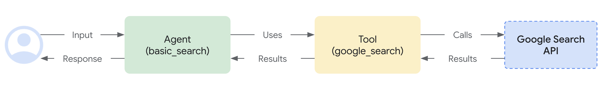

# カスタムオーディオストリーミングアプリ（SSE） {#custom-streaming}

<div class="language-support-tag">
    <span class="lst-supported">ADKでサポート</span><span class="lst-python">Python v0.5.0</span><span class="lst-preview">実験的機能</span>
</div>

この記事では、ADKストリーミングと[FastAPI](https://fastapi.tiangolo.com/)を使用して構築されたカスタム非同期Webアプリのサーバーおよびクライアントコードの概要を説明します。このアプリは、Server-Sent Events（SSE）を介したリアルタイムの双方向オーディオおよびテキスト通信を可能にします。主な機能は次のとおりです。

**サーバーサイド（Python/FastAPI）**:
- FastAPI + ADKの統合
- リアルタイムストリーミングのためのServer-Sent Events
- 分離されたユーザーコンテキストによるセッション管理
- テキストとオーディオの両方の通信モードをサポート
- グラウンディングされた応答のためのGoogle検索ツールの統合

**クライアントサイド（JavaScript/Web Audio API）**:
- SSEとHTTP POSTを介したリアルタイム双方向通信
- AudioWorkletプロセッサを使用したプロフェッショナルなオーディオ処理
- テキストとオーディオモード間のシームレスな切り替え
- 自動再接続とエラーハンドリング
- オーディオデータ転送のためのBase64エンコーディング

このサンプルの[WebSocket](custom-streaming-ws.md)バージョンも利用可能です。

## 1. ADKのインストール {#1.-setup-installation}

仮想環境の作成とアクティベート（推奨）：

```bash
# 作成
python -m venv .venv
# アクティベート（新しいターミナルごと）
# macOS/Linux: source .venv/bin/activate
# Windows CMD: .venv\Scripts\activate.bat
# Windows PowerShell: .venv\Scripts\Activate.ps1
```

ADKのインストール：

```bash
pip install --upgrade google-adk==1.10.0
```

次のコマンドで`SSL_CERT_FILE`変数を設定します。

```shell
export SSL_CERT_FILE=$(python -m certifi)
```

サンプルコードのダウンロード：

```bash
git clone --no-checkout https://github.com/google/adk-docs.git
cd adk-docs
git sparse-checkout init --cone
git sparse-checkout set examples/python/snippets/streaming/adk-streaming
git checkout main
cd examples/python/snippets/streaming/adk-streaming/app
```

このサンプルコードには、次のファイルとフォルダが含まれています：

```console
adk-streaming/
└── app/ # Webアプリのフォルダ
    ├── .env # Gemini APIキー / Google CloudプロジェクトID
    ├── main.py # FastAPI Webアプリ
    ├── static/ # 静的コンテンツのフォルダ
    |   ├── js # JavaScriptファイルのフォルダ（app.jsを含む）
    |   └── index.html # Webクライアントページ
    └── google_search_agent/ # エージェントのフォルダ
        ├── __init__.py # Pythonパッケージ
        └── agent.py # エージェントの定義
```

## 2. プラットフォームのセットアップ {#2.-set-up-the-platform}

サンプルアプリを実行するには、Google AI StudioまたはGoogle Cloud Vertex AIからプラットフォームを選択します：

=== "Gemini - Google AI Studio"
    1. [Google AI Studio](https://aistudio.google.com/apikey)からAPIキーを取得します。
    2. (`app/`内にある)**`.env`**ファイルを開き、次のコードをコピー＆ペーストします。

        ```env title=".env"
        GOOGLE_GENAI_USE_VERTEXAI=FALSE
        GOOGLE_API_KEY=PASTE_YOUR_ACTUAL_API_KEY_HERE
        ```

    3. `PASTE_YOUR_ACTUAL_API_KEY_HERE`を実際の`APIキー`に置き換えます。

=== "Gemini - Google Cloud Vertex AI"
    1. 既存の[Google Cloud](https://cloud.google.com/?e=48754805&hl=en)アカウントとプロジェクトが必要です。
        * [Google Cloudプロジェクトのセットアップ](https://cloud.google.com/vertex-ai/generative-ai/docs/start/quickstarts/quickstart-multimodal#setup-gcp)
        * [gcloud CLIのセットアップ](https://cloud.google.com/vertex-ai/generative-ai/docs/start/quickstarts/quickstart-multimodal#setup-local)
        * ターミナルから`gcloud auth login`を実行してGoogle Cloudに認証します。
        * [Vertex AI APIの有効化](https://console.cloud.google.com/flows/enableapi?apiid=aiplatform.googleapis.com)。
    2. (`app/`内にある)**`.env`**ファイルを開きます。次のコードをコピー＆ペーストし、プロジェクトIDとロケーションを更新します。

        ```env title=".env"
        GOOGLE_GENAI_USE_VERTEXAI=TRUE
        GOOGLE_CLOUD_PROJECT=PASTE_YOUR_ACTUAL_PROJECT_ID
        GOOGLE_CLOUD_LOCATION=us-central1
        ```

## 3. ストリーミングアプリとの対話 {#3.-interact-with-your-streaming-app}

1. **正しいディレクトリに移動:**

   エージェントを効果的に実行するために、**appフォルダ（`adk-streaming/app`）**にいることを確認してください。

2. **FastAPIの起動:** 次のコマンドを実行してCLIインターフェースを起動します。

```console
uvicorn main:app --reload
```

3. **テキストモードでアプリにアクセス:** アプリが起動すると、ターミナルにローカルURL（例：[http://localhost:8000](http://localhost:8000)）が表示されます。このリンクをクリックしてブラウザでUIを開きます。

次のようなUIが表示されるはずです：


「`What time is it now?`」（今何時ですか？）と質問してみてください。エージェントはGoogle検索を使用してクエリに応答します。UIにはエージェントの応答がストリーミングテキストとして表示されるのがわかります。エージェントがまだ応答している間でも、いつでもメッセージを送信できます。これはADKストリーミングの双方向通信機能を示しています。

4. **オーディオモードでアプリにアクセス:** 次に「`オーディオ開始（Start Audio）`」ボタンをクリックします。アプリはオーディオモードでサーバーに再接続し、初回はUIに次のダイアログが表示されます：


「`このサイトにアクセスしている間は許可`」をクリックすると、ブラウザの上部にマイクのアイコンが表示されます：


これで、音声でエージェントと話すことができます。「`What time is it now?`」のような質問を音声で行うと、エージェントも音声で応答するのが聞こえます。ADKストリーミングは[複数の言語](https://ai.google.dev/gemini-api/docs/live#supported-languages)をサポートしているため、サポートされている言語での質問にも応答できます。

5. **コンソールログの確認**

Chromeブラウザを使用している場合は、右クリックして「`検証`」を選択し、デベロッパーツールを開きます。「`コンソール`」タブでは、「`[CLIENT TO AGENT]`」や「`[AGENT TO CLIENT]`」などの送受信オーディオデータを確認できます。これは、ブラウザとサーバー間でストリーミングされるオーディオデータを表しています。

同時に、アプリサーバーのコンソールには次のようなものが表示されるはずです：

```
Client #90766266 connected via SSE, audio mode: false
INFO:     127.0.0.1:52692 - "GET /events/90766266?is_audio=false HTTP/1.1" 200 OK
[CLIENT TO AGENT]: hi
INFO:     127.0.0.1:52696 - "POST /send/90766266 HTTP/1.1" 200 OK
[AGENT TO CLIENT]: text/plain: {'mime_type': 'text/plain', 'data': 'Hi'}
[AGENT TO CLIENT]: text/plain: {'mime_type': 'text/plain', 'data': ' there! How can I help you today?\n'}
[AGENT TO CLIENT]: {'turn_complete': True, 'interrupted': None}
```

これらのコンソールログは、独自のストリーミングアプリケーションを開発する場合に重要です。多くの場合、ブラウザとサーバー間の通信障害がストリーミングアプリケーションのバグの主な原因となります。

6. **トラブルシューティングのヒント**

- **ブラウザがSSHプロキシ経由でサーバーに接続できない場合：** 様々なクラウドサービスで使用されるSSHプロキシは、SSEと互換性がない場合があります。ローカルのラップトップを使用するなど、SSHプロキシなしで試すか、[WebSocket](custom-streaming-ws.md)バージョンを試してください。
- **`gemini-2.0-flash-exp`モデルが動作しない場合：** アプリサーバーのコンソールで`gemini-2.0-flash-exp`モデルの可用性に関するエラーが表示された場合は、`app/google_search_agent/agent.py`ファイルの6行目で`gemini-2.0-flash-live-001`に置き換えてみてください。

## 4. エージェントの定義

`google_search_agent`フォルダにあるエージェント定義コード`agent.py`に、エージェントのロジックが記述されています。

```py
from google.adk.agents import Agent
from google.adk.tools import google_search  # ツールをインポート

root_agent = Agent(
   name="google_search_agent",
   model="gemini-2.0-flash-exp", # このモデルが動作しない場合は、以下を試してください
   #model="gemini-2.0-flash-live-001",
   description="Google検索を使用して質問に答えるエージェント。",
   instruction="Google検索ツールを使用して質問に答えてください。",
   tools=[google_search],
)
```

[Google検索によるグラウンディング](https://ai.google.dev/gemini-api/docs/grounding?lang=python#configure-search)機能がどれほど簡単に統合されているかに注目してください。`Agent`クラスと`google_search`ツールが、LLMや検索APIとの複雑なインタラクションを処理するため、あなたはエージェントの*目的*と*振る舞い*に集中できます。



サーバーとクライアントのアーキテクチャは、適切なセッション分離とリソース管理により、WebクライアントとAIエージェント間のリアルタイム双方向通信を可能にします。

## 5. サーバーサイドのコード概要 {#5.-server-side-code-overview}

FastAPIサーバーは、WebクライアントとAIエージェント間のリアルタイム通信を提供します。

### 双方向通信の概要 {#4.-bidi-comm-overview}

#### クライアントからエージェントへのフロー：
1. **接続確立** - クライアントが`/events/{user_id}`へのSSE接続を開くと、セッションが作成され、リクエストキューが`active_sessions`に保存されます。
2. **メッセージ送信** - クライアントは`mime_type`と`data`を含むJSONペイロードを`/send/{user_id}`にPOSTします。
3. **キュー処理** - サーバーはセッションの`live_request_queue`を取得し、`send_content()`または`send_realtime()`を介してエージェントにメッセージを転送します。

#### エージェントからクライアントへのフロー：
1. **イベント生成** - エージェントはリクエストを処理し、`live_events`非同期ジェネレータを通じてイベントを生成します。
2. **ストリーム処理** - `agent_to_client_sse()`はイベントをフィルタリングし、SSE互換のJSON形式にフォーマットします。
3. **リアルタイム配信** - イベントは、適切なSSEヘッダーを持つ永続的なHTTP接続を介してクライアントにストリーミングされます。

#### セッション管理：
- **ユーザーごとの分離** - 各ユーザーは`active_sessions`辞書に保存された一意のセッションを取得します。
- **ライフサイクル管理** - 接続が切断されると、適切なリソース解放とともにセッションが自動的にクリーンアップされます。
- **同時サポート** - 複数のユーザーが同時にアクティブなセッションを持つことができます。

#### エラーハンドリング：
- **セッション検証** - POSTリクエストは、処理前にセッションの存在を検証します。
- **ストリームの回復力** - SSEストリームは例外を処理し、自動的にクリーンアップを実行します。
- **接続回復** - クライアントはSSE接続を再確立することで再接続できます。

#### セッション再開：
- **ライブセッションの再開** - 中断されたライブ会話への透過的な再接続を可能にします。
- **ハンドルのキャッシング** - システムは回復のためにセッションハンドルを自動的にキャッシュします。
- **信頼性の向上** - ストリーミング中のネットワークの不安定性に対する回復力を向上させます。

### エージェントセッション管理

`start_agent_session()`関数は、分離されたAIエージェントセッションを作成します。

```py
async def start_agent_session(user_id, is_audio=False):
    """エージェントセッションを開始します"""

    # Runnerを作成
    runner = InMemoryRunner(
        app_name=APP_NAME,
        agent=root_agent,
    )

    # Sessionを作成
    session = await runner.session_service.create_session(
        app_name=APP_NAME,
        user_id=user_id,  # 実際のユーザーIDに置き換える
    )

    # 応答モダリティを設定
    modality = "AUDIO" if is_audio else "TEXT"
    run_config = RunConfig(response_modalities=[modality])
    
    # オプション：信頼性向上のためセッション再開を有効化
    # run_config = RunConfig(
    #     response_modalities=[modality],
    #     session_resumption=types.SessionResumptionConfig()
    # )

    # このセッション用のLiveRequestQueueを作成
    live_request_queue = LiveRequestQueue()

    # エージェントセッションを開始
    live_events = runner.run_live(
        session=session,
        live_request_queue=live_request_queue,
        run_config=run_config,
    )
    return live_events, live_request_queue
```

- **InMemoryRunnerのセットアップ** - アプリ名「ADK Streaming example」とGoogle検索エージェントを使用して、メモリ内でエージェントのライフサイクルを管理するランナーインスタンスを作成します。

- **セッションの作成** - `runner.session_service.create_session()`を使用してユーザーIDごとに一意のセッションを確立し、複数の同時ユーザーを可能にします。

- **応答モダリティの設定** - `is_audio`パラメータに基づいて`RunConfig`を「AUDIO」または「TEXT」モダリティで設定し、出力形式を決定します。

- **LiveRequestQueue** - 受信リクエストをキューに入れ、クライアントとエージェント間のリアルタイムメッセージングを可能にする双方向通信チャネルを作成します。

- **ライブイベントストリーム** - `runner.run_live()`は、部分的な応答、ターンの完了、中断など、エージェントからのリアルタイムイベントを生成する非同期ジェネレータを返します。

### Server-Sent Events（SSE）ストリーミング

`agent_to_client_sse()`関数は、エージェントからクライアントへのリアルタイムストリーミングを処理します。

```py
async def agent_to_client_sse(live_events):
    """SSEを介したエージェントからクライアントへの通信"""
    async for event in live_events:
        # ターンが完了または中断された場合は送信
        if event.turn_complete or event.interrupted:
            message = {
                "turn_complete": event.turn_complete,
                "interrupted": event.interrupted,
            }
            yield f"data: {json.dumps(message)}\n\n"
            print(f"[AGENT TO CLIENT]: {message}")
            continue

        # コンテンツとその最初のPartを読み取る
        part: Part = (
            event.content and event.content.parts and event.content.parts[0]
        )
        if not part:
            continue

        # オーディオの場合はBase64エンコードされたオーディオデータを送信
        is_audio = part.inline_data and part.inline_data.mime_type.startswith("audio/pcm")
        if is_audio:
            audio_data = part.inline_data and part.inline_data.data
            if audio_data:
                message = {
                    "mime_type": "audio/pcm",
                    "data": base64.b64encode(audio_data).decode("ascii")
                }
                yield f"data: {json.dumps(message)}\n\n"
                print(f"[AGENT TO CLIENT]: audio/pcm: {len(audio_data)} bytes.")
                continue

        # テキストで部分的なテキストの場合は送信
        if part.text and event.partial:
            message = {
                "mime_type": "text/plain",
                "data": part.text
            }
            yield f"data: {json.dumps(message)}\n\n"
            print(f"[AGENT TO CLIENT]: text/plain: {message}")
```

- **イベント処理ループ** - `live_events`非同期ジェネレータを反復処理し、エージェントから到着する各イベントを処理します。

- **ターン管理** - 会話のターンの完了または中断イベントを検出し、`turn_complete`および`interrupted`フラグを持つJSONメッセージを送信して会話の状態変化を通知します。

- **コンテンツパートの抽出** - テキストまたはオーディオデータを含むイベントコンテンツから最初の`Part`を抽出します。

- **オーディオストリーミング** - PCMオーディオデータを次のように処理します：
  - `inline_data`内の`audio/pcm` MIMEタイプを検出
  - JSON送信用に生のオーディオバイトをBase64エンコード
  - `mime_type`と`data`フィールドを付けて送信

- **テキストストリーミング** - 部分的なテキスト応答を処理し、生成されるたびに増分テキスト更新を送信することで、リアルタイムのタイピング効果を実現します。

- **SSEフォーマット** - すべてのデータは、ブラウザのEventSource APIとの互換性のためにSSE仕様に従って`data: {json}\n\n`としてフォーマットされます。

### HTTPエンドポイントとルーティング

#### ルートエンドポイント
**GET /** - FastAPIの`FileResponse`を使用して、`static/index.html`をメインのアプリケーションインターフェースとして提供します。

#### SSEイベントエンドポイント

```py
@app.get("/events/{user_id}")
async def sse_endpoint(user_id: int, is_audio: str = "false"):
    """エージェントからクライアントへの通信用のSSEエンドポイント"""

    # エージェントセッションを開始
    user_id_str = str(user_id)
    live_events, live_request_queue = await start_agent_session(user_id_str, is_audio == "true")

    # このユーザーのリクエストキューを保存
    active_sessions[user_id_str] = live_request_queue

    print(f"クライアント #{user_id} がSSE経由で接続、オーディオモード：{is_audio}")

    def cleanup():
        live_request_queue.close()
        if user_id_str in active_sessions:
            del active_sessions[user_id_str]
        print(f"クライアント #{user_id} がSSEから切断")

    async def event_generator():
        try:
            async for data in agent_to_client_sse(live_events):
                yield data
        except Exception as e:
            print(f"SSEストリームでエラー：{e}")
        finally:
            cleanup()

    return StreamingResponse(
        event_generator(),
        media_type="text/event-stream",
        headers={
            "Cache-Control": "no-cache",
            "Connection": "keep-alive",
            "Access-Control-Allow-Origin": "*",
            "Access-Control-Allow-Headers": "Cache-Control"
        }
    )
```

**GET /events/{user_id}** - 永続的なSSE接続を確立します：

- **パラメータ** - `user_id`（int）とオプションの`is_audio`クエリパラメータ（デフォルトは "false"）を受け取ります。

- **セッション初期化** - `start_agent_session()`を呼び出し、`user_id`をキーとして`live_request_queue`を`active_sessions`辞書に保存します。

- **StreamingResponse** - 以下を含む`StreamingResponse`を返します：
  - `agent_to_client_sse()`をラップする`event_generator()`非同期関数
  - MIMEタイプ：`text/event-stream`
  - クロスオリジンアクセスのためのCORSヘッダー
  - キャッシュを防ぐためのCache-controlヘッダー

- **クリーンアップロジック** - リクエストキューを閉じ、アクティブセッションから削除することで接続終了を処理し、ストリーム中断のエラーハンドリングも行います。

### セッション再開の設定

ADKは、ストリーミング会話中の信頼性を向上させるために、ライブセッションの再開をサポートしています。この機能により、ネットワークの問題でライブ接続が中断された場合に自動的に再接続できます。

#### セッション再開の有効化

セッション再開を有効にするには、次のようにします：

1. **必要な型をインポートする**:
```py
from google.genai import types
```

2. **RunConfigでセッション再開を設定する**:
```py
run_config = RunConfig(
    response_modalities=[modality],
    session_resumption=types.SessionResumptionConfig()
)
```

#### セッション再開の機能

- **ハンドルの自動キャッシング** - システムはライブ会話中にセッション再開ハンドルを自動的にキャッシュします。
- **透過的な再接続** - 接続が中断されると、システムはキャッシュされたハンドルを使用して再開を試みます。
- **コンテキストの保持** - 会話のコンテキストと状態は再接続後も維持されます。
- **ネットワークの回復力** - 不安定なネットワーク条件下でのユーザーエクスペリエンスを向上させます。

#### 実装上の注意

- セッション再開ハンドルはADKフレームワークによって内部的に管理されます。
- クライアント側での追加のコード変更は不要です。
- この機能は、長時間のストリーミング会話に特に有益です。
- 接続の中断がユーザーエクスペリエンスに与える影響が少なくなります。

#### トラブルシューティング

セッション再開でエラーが発生した場合：

1. **モデルの互換性を確認する** - セッション再開をサポートするモデルを使用していることを確認してください。
2. **APIの制限** - 一部のセッション再開機能は、すべてのAPIバージョンで利用できるわけではありません。
3. **セッション再開を削除する** - 問題が解決しない場合は、`RunConfig`から`session_resumption`パラメータを削除してセッション再開を無効にすることができます。

#### メッセージ送信エンドポイント

```py
@app.post("/send/{user_id}")
async def send_message_endpoint(user_id: int, request: Request):
    """クライアントからエージェントへの通信用のHTTPエンドポイント"""

    user_id_str = str(user_id)

    # このユーザーのライブリクエストキューを取得
    live_request_queue = active_sessions.get(user_id_str)
    if not live_request_queue:
        return {"error": "セッションが見つかりません"}

    # メッセージを解析
    message = await request.json()
    mime_type = message["mime_type"]
    data = message["data"]

    # エージェントにメッセージを送信
    if mime_type == "text/plain":
        content = Content(role="user", parts=[Part.from_text(text=data)])
        live_request_queue.send_content(content=content)
        print(f"[CLIENT TO AGENT]: {data}")
    elif mime_type == "audio/pcm":
        decoded_data = base64.b64decode(data)
        live_request_queue.send_realtime(Blob(data=decoded_data, mime_type=mime_type))
        print(f"[CLIENT TO AGENT]: audio/pcm: {len(decoded_data)} bytes")
    else:
        return {"error": f"サポートされていないMimeタイプ：{mime_type}"}

    return {"status": "sent"}
```

**POST /send/{user_id}** - クライアントメッセージを受信します：

- **セッション検索** - `active_sessions`から`live_request_queue`を取得するか、セッションが存在しない場合はエラーを返します。

- **メッセージ処理** - `mime_type`と`data`フィールドを持つJSONを解析します：
  - **テキストメッセージ** - `Part.from_text()`で`Content`を作成し、`send_content()`で送信します。
  - **オーディオメッセージ** - PCMデータをBase64デコードし、`Blob`とともに`send_realtime()`で送信します。

- **エラーハンドリング** - サポートされていないMIMEタイプや存在しないセッションに対して適切なエラー応答を返します。

## 6. クライアントサイドのコード概要 {#6.-client-side-code-overview}

クライアントサイドは、リアルタイム通信とオーディオ機能を備えたWebインターフェースで構成されています。

### HTMLインターフェース（`static/index.html`）

```html
<!doctype html>
<html>
  <head>
    <title>ADKストリーミングテスト（オーディオ）</title>
    <script src="/static/js/app.js" type="module"></script>
  </head>

  <body>
    <h1>ADKストリーミングテスト</h1>
    <div
      id="messages"
      style="height: 300px; overflow-y: auto; border: 1px solid black"></div>
    <br />

    <form id="messageForm">
      <label for="message">メッセージ：</label>
      <input type="text" id="message" name="message" />
      <button type="submit" id="sendButton" disabled>送信</button>
      <button type="button" id="startAudioButton">オーディオ開始</button>
    </form>
  </body>

</html>
```

シンプルなWebインターフェース：
- **メッセージ表示** - 会話履歴用のスクロール可能なdiv
- **テキスト入力フォーム** - テキストメッセージ用の入力フィールドと送信ボタン
- **オーディオコントロール** - オーディオモードとマイクアクセスを有効にするボタン

### メインアプリケーションロジック（`static/js/app.js`）

#### セッション管理（`app.js`）

```js
const sessionId = Math.random().toString().substring(10);
const sse_url =
  "http://" + window.location.host + "/events/" + sessionId;
const send_url =
  "http://" + window.location.host + "/send/" + sessionId;
let is_audio = false;
```

- **ランダムなセッションID** - 各ブラウザインスタンスに一意のセッションIDを生成
- **URL構築** - セッションIDを使用してSSEおよび送信エンドポイントを構築
- **オーディオモードフラグ** - オーディオモードが有効かどうかを追跡

#### Server-Sent Events接続（`app.js`）
**connectSSE()** 関数はリアルタイムのサーバー通信を処理します：

```js
// SSEハンドラ
function connectSSE() {
  // SSEエンドポイントに接続
  eventSource = new EventSource(sse_url + "?is_audio=" + is_audio);

  // 接続開始時の処理
  eventSource.onopen = function () {
    // 接続開始メッセージ
    console.log("SSE接続が開かれました。");
    document.getElementById("messages").textContent = "接続が開かれました";

    // 送信ボタンを有効化
    document.getElementById("sendButton").disabled = false;
    addSubmitHandler();
  };

  // 受信メッセージの処理
  eventSource.onmessage = function (event) {
    ...
  };

  // 接続終了時の処理
  eventSource.onerror = function (event) {
    console.log("SSE接続エラーまたは終了。");
    document.getElementById("sendButton").disabled = true;
    document.getElementById("messages").textContent = "接続が終了しました";
    eventSource.close();
    setTimeout(function () {
      console.log("再接続中...");
      connectSSE();
    }, 5000);
  };
}
```

- **EventSourceのセットアップ** - オーディオモードパラメータ付きでSSE接続を作成
- **接続ハンドラ**:
  - **onopen** - 接続時に送信ボタンとフォーム送信を有効化
  - **onmessage** - エージェントからの受信メッセージを処理
  - **onerror** - 5秒後に自動再接続で切断を処理

#### メッセージ処理（`app.js`）
サーバーからのさまざまなメッセージタイプを処理します：

```js
  // 受信メッセージの処理
  eventSource.onmessage = function (event) {
    // 受信メッセージを解析
    const message_from_server = JSON.parse(event.data);
    console.log("[AGENT TO CLIENT] ", message_from_server);

    // ターンが完了したか確認
    // ターンが完了した場合、新しいメッセージを追加
    if (
      message_from_server.turn_complete &&
      message_from_server.turn_complete == true
    ) {
      currentMessageId = null;
      return;
    }

    // オーディオの場合は再生
    if (message_from_server.mime_type == "audio/pcm" && audioPlayerNode) {
      audioPlayerNode.port.postMessage(base64ToArray(message_from_server.data));
    }

    // テキストの場合は表示
    if (message_from_server.mime_type == "text/plain") {
      // 新しいターンのために新しいメッセージを追加
      if (currentMessageId == null) {
        currentMessageId = Math.random().toString(36).substring(7);
        const message = document.createElement("p");
        message.id = currentMessageId;
        // messagesDivにメッセージ要素を追加
        messagesDiv.appendChild(message);
      }

      // 既存のメッセージ要素にメッセージテキストを追加
      const message = document.getElementById(currentMessageId);
      message.textContent += message_from_server.data;

      // messagesDivの最下部にスクロール
      messagesDiv.scrollTop = messagesDiv.scrollHeight;
    }
```

- **ターン管理** - `turn_complete`を検出してメッセージ状態をリセット
- **オーディオ再生** - Base64 PCMデータをデコードしてオーディオワークレットに送信
- **テキスト表示** - 新しいメッセージ要素を作成し、リアルタイムのタイピング効果のために部分的なテキスト更新を追加

#### メッセージ送信（`app.js`）
**sendMessage()** 関数はサーバーにデータを送信します：

```js
async function sendMessage(message) {
  try {
    const response = await fetch(send_url, {
      method: 'POST',
      headers: {
        'Content-Type': 'application/json',
      },
      body: JSON.stringify(message)
    });
    
    if (!response.ok) {
      console.error('メッセージの送信に失敗しました：', response.statusText);
    }
  } catch (error) {
    console.error('メッセージ送信中のエラー：', error);
  }
}
```

- **HTTP POST** - `/send/{session_id}`エンドポイントにJSONペイロードを送信
- **エラーハンドリング** - 失敗したリクエストとネットワークエラーをログに記録
- **メッセージフォーマット** - 標準化された`{mime_type, data}`構造

### オーディオプレーヤー（`static/js/audio-player.js`）

**startAudioPlayerWorklet()** 関数：

- **AudioContextのセットアップ** - 再生用に24kHzのサンプルレートでコンテキストを作成
- **ワークレットの読み込み** - オーディオ処理用にPCMプレーヤープロセッサを読み込み
- **オーディオパイプライン** - ワークレットノードをオーディオデスティネーション（スピーカー）に接続

### オーディオレコーダー（`static/js/audio-recorder.js`）

**startAudioRecorderWorklet()** 関数：

- **AudioContextのセットアップ** - 録音用に16kHzのサンプルレートでコンテキストを作成
- **マイクへのアクセス** - オーディオ入力のためにユーザーメディアの許可を要求
- **オーディオ処理** - マイクをレコーダーワークレットに接続
- **データ変換** - Float32サンプルを16ビットPCM形式に変換

### オーディオワークレットプロセッサ

#### PCMプレーヤープロセッサ（`static/js/pcm-player-processor.js`）
**PCMPlayerProcessor** クラスはオーディオ再生を処理します：

- **リングバッファ** - 24kHzオーディオ180秒分の循環バッファ
- **データ取り込み** - Int16をFloat32に変換してバッファに保存
- **再生ループ** - バッファから継続的に読み取り、出力チャンネルへ
- **オーバーフロー処理** - バッファがいっぱいになると最も古いサンプルを上書き

#### PCMレコーダープロセッサ（`static/js/pcm-recorder-processor.js`）
**PCMProcessor** クラスはマイク入力をキャプチャします：

- **オーディオ入力** - 受信オーディオフレームを処理
- **データ転送** - Float32サンプルをコピーし、メッセージポートを介してメインスレッドに投稿

#### モード切り替え：
- **オーディオの有効化** - 「オーディオ開始」ボタンがマイクを有効にし、オーディオフラグ付きでSSEを再接続
- **シームレスな移行** - 既存の接続を閉じ、新しいオーディオ対応セッションを確立

クライアントアーキテクチャは、テキストとオーディオの両方のモダリティでシームレスなリアルタイム通信を可能にし、プロフェッショナルグレードのオーディオ処理に最新のWeb APIを使用します。

## まとめ

このアプリケーションは、以下の主要な機能を備えた完全なリアルタイムAIエージェントシステムを示しています：

**アーキテクチャのハイライト**:
- **リアルタイム**: 部分的なテキスト更新と連続的なオーディオによるストリーミング応答
- **堅牢**: 包括的なエラーハンドリングと自動回復メカニズム
- **モダン**: 最新のWeb標準（AudioWorklet、SSE、ES6モジュール）を使用

このシステムは、リアルタイムのインタラクション、Web検索機能、マルチメディア通信を必要とする高度なAIアプリケーションを構築するための基盤を提供します。

### 本番環境への次のステップ

このシステムを本番環境にデプロイするには、以下の改善を実装することを検討してください：

#### セキュリティ
- **認証**: ランダムなセッションIDを適切なユーザー認証に置き換える
- **APIキーのセキュリティ**: 環境変数またはシークレット管理サービスを使用する
- **HTTPS**: すべての通信にTLS暗号化を強制する
- **レート制限**: 乱用を防ぎ、APIコストを制御する

#### スケーラビリティ
- **永続ストレージ**: インメモリセッションを永続セッションに置き換える
- **ロードバランシング**: 共有セッション状態で複数のサーバーインスタンスをサポートする
- **オーディオの最適化**: 帯域幅の使用量を減らすために圧縮を実装する

#### モニタリング
- **エラー追跡**: システム障害を監視し、アラートを発する
- **APIコストの監視**: 予算超過を防ぐためにGoogle検索とGeminiの使用状況を追跡する
- **パフォーマンスメトリクス**: 応答時間とオーディオの遅延を監視する

#### インフラストラクチャ
- **コンテナ化**: Cloud RunまたはAgent Engineでの一貫したデプロイのためにDockerでパッケージ化する
- **ヘルスチェック**: アップタイム追跡のためのエンドポイント監視を実装する