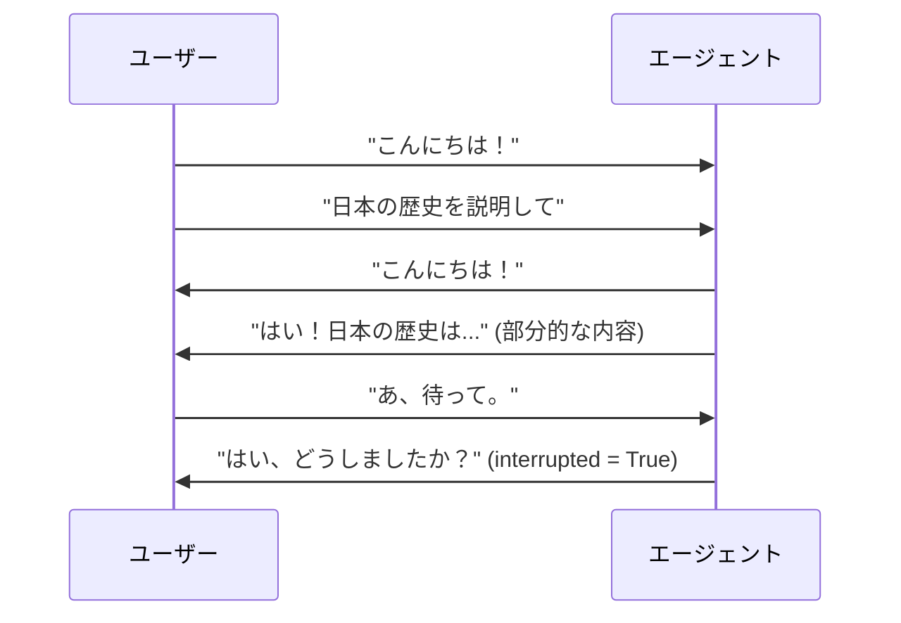
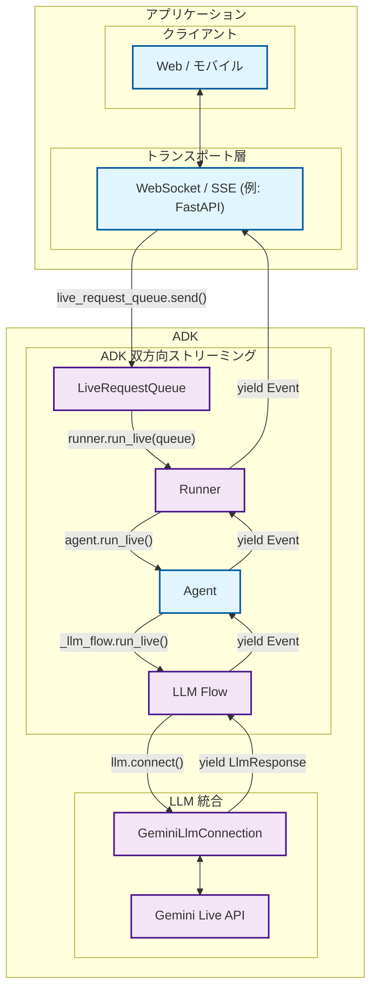

# ADK 双方向ストリーミング開発ガイド: パート1 - はじめに

[Agent Development Kit (ADK)](https://google.github.io/adk-docs/)による双方向ストリーミングの世界へようこそ。この記事では、AIエージェントのコミュニケーションに対するあなたの理解を、従来のリクエスト-レスポンスパターンから、まるで人と話しているかのように自然な、動的なリアルタイムの対話へと変革します。

あなたが話し終わるのを待ってから応答するだけでなく、積極的に聞き、ふとした思いつきで文の途中で割り込むことができるAIアシスタントを構築することを想像してみてください。会話の文脈を維持しながら、音声、映像、テキストを同時に処理するカスタマーサポートボットを作成する姿を思い描いてください。これが双方向ストリーミングの力であり、ADKはすべての開発者がこの機能を利用できるようにします。

## 1.1 双方向ストリーミング（Bidi-streaming）とは？

双方向ストリーミング（Bidi-streaming）は、従来のAIとの対話からの根本的な転換を意味します。硬直した「質問して待つ」パターンではなく、人間とAIの両方が同時に話し、聞き、応答できる**リアルタイムの双方向通信**を可能にします。これにより、即時の応答と、進行中の対話に割り込むという革命的な能力を備えた、自然で人間らしい会話が生まれます。

メールの送受信と電話での会話の違いを考えてみてください。従来のAIとの対話はメールのようなものです。完全なメッセージを送り、完全な応答を待ち、そしてまた別の完全なメッセージを送ります。双方向ストリーミングは電話での会話のようなものです。流動的で自然であり、リアルタイムで割り込み、明確化し、応答する能力があります。

### 主な特徴

これらの特徴は、双方向ストリーミングを従来のAIとの対話と区別し、魅力的なユーザーエクスペリエンスを創造する上で独自に強力なものにしています。

-   **双方向通信**: 完全な応答を待つことなく、継続的なデータ交換が可能です。ユーザーとAIのどちらもが、あなたがまだ話している最中に質問の最初の数語に応答を開始できるため、トランザクショナルではなく真に会話的な体験が生まれます。

-   **応答性の高い割り込み**: おそらく、自然なユーザーエクスペリエンスにとって最も重要な機能です。ユーザーは、人間の会話のように、新しい入力でエージェントの応答の途中に割り込むことができます。もしAIが量子物理学を説明している最中に、あなたが突然「待って、電子って何？」と尋ねれば、AIは即座に停止し、あなたの質問に対応します。

-   **マルチモーダルへの最適化**: テキスト、音声、映像の入力を同時にサポートすることで、豊かで自然な対話が生まれます。ユーザーは文書を見せながら話したり、音声通話中にフォローアップの質問を入力したり、文脈を失うことなくシームレスに通信モードを切り替えたりすることができます。



### 他のストリーミングタイプとの違い

双方向ストリーミングが他のアプローチとどのように異なるかを理解することは、そのユニークな価値を正しく評価する上で不可欠です。ストリーミングの世界には、それぞれ異なるユースケースに対応するいくつかの明確なパターンが存在します。

!!! info "ストリーミングタイプの比較"

    **双方向ストリーミング**は、他のストリーミングアプローチとは根本的に異なります。

    -   **サーバーサイドストリーミング**: サーバーからクライアントへの一方向のデータフロー。ライブビデオストリームを見ているようなものです。継続的なデータは受け取りますが、リアルタイムで対話することはできません。ダッシュボードやライブフィードには便利ですが、会話には向きません。

    -   **トークンレベルストリーミング**: 割り込みなしの順次的なテキストトークン配信。AIは応答を単語ごとに生成しますが、新しい入力を送信する前に完了を待たなければなりません。誰かがリアルタイムでメッセージを入力しているのを見ているようなものです。それが形成されていくのを見ることはできますが、割り込むことはできません。

    -   **双方向ストリーミング**: 割り込みをサポートする完全な双方向通信。両者が同時に話し、聞き、応答できる真の対話型AIです。これにより、会話の途中で割り込んだり、明確化したり、トピックを変更したりできる自然な対話が可能になります。

### 実世界での応用例

双方向ストリーミングは、エージェントが人間のような応答性と知性で動作できるようにすることで、エージェント型AIアプリケーションに革命をもたらします。これらのアプリケーションは、ストリーミングが静的なAIの対話を、真に知的で能動的だと感じられる動的なエージェント主導の体験へとどのように変えるかを示しています。

[ショッパーズ・コンシェルジュのデモ](https://www.youtube.com/watch?v=LwHPYyw7u6U)のビデオでは、マルチモーダルな双方向ストリーミング機能が、より速く直感的なショッピング体験を可能にすることで、eコマースのユーザーエクスペリエンスを大幅に向上させています。対話的な理解と高速な並列検索の組み合わせは、バーチャル試着のような高度な機能へと結実し、購入者の信頼を高め、オンラインショッピングの障壁を減らします。

<div class="video-grid">
  <div class="video-item">
    <div class="video-container">
      <iframe src="https://www.youtube-nocookie.com/embed/LwHPYyw7u6U?si=xxIEhnKBapzQA6VV" title="Shopper's Concierge" frameborder="0" allow="accelerometer; autoplay; clipboard-write; encrypted-media; gyroscope; picture-in-picture; web-share" referrerpolicy="strict-origin-when-cross-origin" allowfullscreen></iframe>
    </div>
  </div>
</div>

また、双方向ストリーミングには、他にも多くの実世界での応用が考えられます。

1.  **カスタマーサービス＆コンタクトセンター**: これは最も直接的な応用分野です。この技術は、従来のチャットボットをはるかに超える洗練された仮想エージェントを作成できます。
    -   **ユースケース**: 顧客が欠陥製品について小売店のサポートラインに電話します。
    -   **マルチモーダル（映像）**: 顧客は「私のコーヒーメーカーの底から水が漏れています、お見せします」と言って、スマートフォンのカメラで問題のライブ映像をストリーミングできます。AIエージェントは視覚能力を使ってモデルと具体的な故障箇所を特定できます。
    -   **ライブ対話＆割り込み**: エージェントが「承知しました、モデルXコーヒーメーカーの返品処理を進めます」と言った場合、顧客は「いえ、待ってください、モデルY Proです」と割り込むことができ、エージェントは会話を再開することなく即座に方針を修正できます。

2.  **フィールドサービス＆技術支援**: 現場で作業する技術者は、ハンズフリーの音声操作アシスタントを使ってリアルタイムの支援を受けることができます。
    -   **ユースケース**: 空調技術者が現場で複雑な業務用エアコンの診断を試みています。
    -   **マルチモーDAL（映像＆音声）**: スマートグラスを装着したりスマートフォンを使ったりしている技術者は、自分の視点をAIエージェントにストリーミングできます。「このコンプレッサーから奇妙な音が聞こえます。これを特定し、このモデルの診断フローチャートを表示してもらえますか？」と尋ねることができます。
    -   **ライブ対話**: エージェントは技術者を段階的にガイドでき、技術者は道具から手を離すことなく、いつでも明確化のための質問をしたり割り込んだりできます。

3.  **ヘルスケア＆遠隔医療**: エイジェントは、患者の受付、トリアージ、基本的な診察の最初の窓口として機能できます。
    -   **ユースケース**: 患者が皮膚の状態に関する予備的な相談のために、医療提供者のアプリを使用します。
    -   **マルチモーダル（映像/画像）**: 患者は発疹のライブ映像や高解像度の画像を安全に共有できます。AIは予備的な分析を行い、明確化のための質問をすることができます。

4.  **金融サービス＆資産管理**: エージェントは、クライアントに安全で対話的、かつデータ豊富な方法で財務を管理する方法を提供できます。
    -   **ユースケース**: クライアントが自分の投資ポートフォリオを確認し、市場の動向について議論したいと考えています。
    -   **マルチモーダル（画面共有）**: エージェントは自分の画面を共有して、チャート、グラフ、ポートフォリオのパフォーマンスデータを表示できます。クライアントも自分の画面を共有して特定のニュース記事を指し、「このイベントが私のハイテク株に与える潜在的な影響は何ですか？」と尋ねることができます。
    -   **ライブ対話**: クライアントの口座データにアクセスして、現在のポートフォリオ配分を分析します。潜在的な取引がポートフォリオのリスクプロファイルに与える影響をシミュレートします。

## 1.2 ADK 双方向ストリーミングのアーキテクチャ概要

ADKの双方向ストリーミングアーキテクチャは、双方向のAI会話を人間の対話のように自然に感じさせます。このアーキテクチャは、低遅延かつ高スループットな通信のために設計された洗練されたパイプラインを通じて、Googleの[Gemini Live API](https://ai.google.dev/gemini-api/docs/live)とシームレスに統合されます。

このシステムは、リアルタイムストリーミングに必要な複雑なオーケストレーション（複数の同時データフローの管理、割り込みの適切な処理、マルチモーダル入力の同時処理、動的な対話全体での会話状態の維持）を処理します。ADKの双方向ストリーミングは、この複雑さを、開発者がストリーミングプロトコルやAIモデルの通信パターンの複雑な詳細を理解する必要なく使用できる、シンプルで直感的なAPIに抽象化します。

### 高レベルアーキテクチャ



| 開発者が提供 | ADKが提供 | Geminiが提供 |
|:----------------------------|:------------------|:------------------------------|
| **Web / モバイル**: ユーザーが操作するフロントエンドアプリケーション。UI/UX、ユーザー入力のキャプチャ、応答の表示を処理します。<br><br>**[WebSocket](https://developer.mozilla.org/ja/docs/Web/API/WebSocket) / [SSE](https://developer.mozilla.org/ja/docs/Web/API/Server-sent_events) サーバー**: クライアント接続を管理し、ストリーミングプロトコルを処理し、クライアントとADK間でメッセージをルーティングするリアルタイム通信サーバー（[FastAPI](https://fastapi.tiangolo.com/)など）。<br><br>**Agent**: アプリケーションのニーズに合わせて調整された、特定の指示、ツール、動作を持つカスタムAIエージェント定義。 | **[LiveRequestQueue](https://github.com/google/adk-python/blob/main/src/google/adk/agents/live_request_queue.py)**: 受信するユーザーメッセージ（テキストコンテンツ、オーディオBlob、制御信号）をバッファリングし、エージェントによる順序正しい処理のためにシーケンス化するメッセージキュー。<br><br>**[Runner](https://github.com/google/adk-python/blob/main/src/google/adk/runners.py)**: エージェントセッションをオーケストレートし、会話の状態を管理し、`run_live()`ストリーミングインターフェースを提供する実行エンジン。<br><br>**[LLM Flow](https://github.com/google/adk-python/blob/main/src/google/adk/flows/llm_flows/base_llm_flow.py)**: ストリーミング会話ロジックを処理し、コンテキストを管理し、言語モデルと連携する処理パイプライン。<br><br>**[GeminiLlmConnection](https://github.com/google/adk-python/blob/main/src/google/adk/models/gemini_llm_connection.py)**: ADKのストリーミングアーキテクチャとGemini Live APIを橋渡しし、プロトコル変換と接続管理を処理する抽象化レイヤー。 | **[Gemini Live API](https://ai.google.dev/gemini-api/docs/live)**: ストリーミング入力を処理し、応答を生成し、割り込みを処理し、マルチモーダルコンテンツ（テキスト、音声、映像）をサポートし、関数呼び出しや文脈理解などの高度なAI機能を提供するGoogleのリアルタイム言語モデルサービス。 |

## 1.3 開発環境のセットアップ

ADK双方向ストリーミングアーキテクチャの要点とそれが提供する価値を理解したところで、実際に手を動かしてみましょう。このセクションでは、前のセクションで説明したストリーミングエージェントとアプリケーションの構築を開始できるように、開発環境を準備します。

このセットアップが完了する頃には、私たちが議論してきたインテリジェントな音声アシスタント、能動的なカスタマーサポートエージェント、およびマルチエージェント連携プラットフォームを作成するために必要なものがすべて揃います。セットアッププロセスは簡単です。ADKが複雑なストリーミングインフラを処理するため、あなたは低レベルのストリーミングプロトコルと格闘するのではなく、エージェントのユニークな能力の構築に集中できます。

### インストール手順

#### 1. 仮想環境の作成（推奨）

```bash
# 仮想環境の作成
python -m venv .venv

# 仮想環境のアクティベート
# macOS/Linux:
source .venv/bin/activate
# Windows CMD:
# .venv\Scripts\activate.bat
# Windows PowerShell:
# .venv\Scripts\Activate.ps1
```

#### 2. ADKのインストール

プロジェクトのルートに`requirements.txt`ファイルを作成します。`google-adk`ライブラリには、双方向ストリーミングアプリケーションのWebサーバーとして使用できるFastAPIとuvicornが含まれていることに注意してください。

```txt
google-adk==1.3.0
python-dotenv>=1.0.0
```

すべての依存関係をインストールします:

```bash
pip install -r requirements.txt
```

#### 3. SSL証明書パスの設定（macOSのみ）

```bash
# macOSでの適切なSSL処理に必要
export SSL_CERT_FILE=$(python -m certifi)
```

#### 4. APIキーの設定

エージェントを実行するプラットフォームを選択してください:

=== "Google AI Studio"

    1.  [Google AI Studio](https://aistudio.google.com/apikey)からAPIキーを取得します。
    2.  プロジェクトのルートに`.env`ファイルを作成します:

    ```env
    GOOGLE_GENAI_USE_VERTEXAI=FALSE
    GOOGLE_API_KEY=your_actual_api_key_here
    ```

=== "Google Cloud Vertex AI"

    1.  [Google Cloudプロジェクト](https://cloud.google.com/vertex-ai/generative-ai/docs/start/quickstarts/quickstart-multimodal#setup-gcp)をセットアップします。
    2.  [gcloud CLI](https://cloud.google.com/vertex-ai/generative-ai/docs/start/quickstarts/quickstart-multimodal#setup-local)をインストールして設定します。
    3.  認証: `gcloud auth login`
    4.  [Vertex AI APIを有効化](https://console.cloud.google.com/flows/enableapi?apiid=aiplatform.googleapis.com)します。
    5.  プロジェクトのルートに`.env`ファイルを作成します:

    ```env
    GOOGLE_GENAI_USE_VERTEXAI=TRUE
    GOOGLE_CLOUD_PROJECT=your_actual_project_id
    GOOGLE_CLOUD_LOCATION=us-central1
    ```

#### 5. 環境設定スクリプトの作成

インストールを検証する検証スクリプトを作成します:

```bash
# ディレクトリ構造を作成
mkdir -p src/part1
```

`src/part1/1-3-1_environment_setup.py`を作成します:

```python
#!/usr/bin/env python3
"""
パート1.3.1: 環境セットアップの検証
ADKストリーミング環境の設定を検証する包括的なスクリプト。
"""

import os
import sys
from pathlib import Path
from dotenv import load_dotenv

def validate_environment():
    """ADKストリーミング環境のセットアップを検証します。"""

    print("🔧 ADKストリーミング環境の検証")
    print("=" * 45)

    # 環境変数をロード
    env_path = Path(__file__).parent.parent.parent / '.env'
    if env_path.exists():
        load_dotenv(env_path)
        print(f"✓ 環境ファイルがロードされました: {env_path}")
    else:
        print(f"❌ 環境ファイルが見つかりません: {env_path}")
        return False

    # Pythonのバージョンを確認
    python_version = sys.version_info
    if python_version >= (3, 8):
        print(f"✓ Pythonバージョン: {python_version.major}.{python_version.minor}.{python_version.micro}")
    else:
        print(f"❌ Pythonバージョン {python_version.major}.{python_version.minor} - 3.8以上が必要です")
        return False

    # ADKのインストールをテスト
    try:
        import google.adk
        print(f"✓ ADKのインポートに成功しました")

        # 利用可能であればバージョンを取得
        try:
            from google.adk.version import __version__
            print(f"✓ ADKバージョン: {__version__}")
        except:
            print("ℹ️ ADKのバージョン情報が利用できません")

    except ImportError as e:
        print(f"❌ ADKのインポートに失敗しました: {e}")
        return False

    # 必須のインポートを確認
    essential_imports = [
        ('google.adk.agents', 'Agent, LiveRequestQueue'),
        ('google.adk.runners', 'InMemoryRunner'),
        ('google.genai.types', 'Content, Part, Blob'),
    ]

    for module, components in essential_imports:
        try:
            __import__(module)
            print(f"✓ インポート: {module}")
        except ImportError as e:
            print(f"❌ インポートに失敗しました: {module} - {e}")
            return False

    # 環境変数を検証
    env_checks = [
        ('GOOGLE_GENAI_USE_VERTEXAI', 'プラットフォーム設定'),
        ('GOOGLE_API_KEY', 'API認証'),
    ]

    for env_var, description in env_checks:
        value = os.getenv(env_var)
        if value:
            # セキュリティのためAPIキーをマスク
            display_value = value if env_var != 'GOOGLE_API_KEY' else f"{value[:10]}..."
            print(f"✓ {description}: {display_value}")
        else:
            print(f"❌ 不足: {env_var} ({description})")
            return False

    # 基本的なADKの機能をテスト
    try:
        from google.adk.agents import LiveRequestQueue
        from google.genai.types import Content, Part

        # テストキューを作成
        queue = LiveRequestQueue()
        test_content = Content(parts=[Part(text="Test message")])
        queue.send_content(test_content)
        queue.close()

        print("✓ 基本的なADKの機能テストに合格しました")

    except Exception as e:
        print(f"❌ ADKの機能テストに失敗しました: {e}")
        return False

    print("\n🎉 環境の検証に成功しました！")
    print("\n次のステップ:")
    print("• src/agents/ でストリーミングエージェントの構築を開始します")
    print("• src/tools/ でカスタムツールを作成します")
    print("• src/utils/ にユーティリティ関数を追加します")
    print("• パート3の例でテストします")

    return True

def main():
    """環境検証を実行します。"""

    try:
        success = validate_environment()
        sys.exit(0 if success else 1)

    except KeyboardInterrupt:
        print("\n\n⚠️ ユーザーによって検証が中断されました")
        sys.exit(1)
    except Exception as e:
        print(f"\n❌ 予期せぬエラー: {e}")
        sys.exit(1)

if __name__ == "__main__":
    main()
```

### プロジェクト構造

これで、ストリーミングプロジェクトは次の構造を持つはずです:

```text
your-streaming-project/
├── .env                              # 環境変数（APIキー）
├── requirements.txt                 # Pythonの依存関係
└── src/
    └── part1/
        └── 1-3-1_environment_setup.py  # 環境検証スクリプト
```

### 実行する

完全な環境設定スクリプトを使用して、すべてが正しく設定されていることを確認してください:

```bash
python src/part1/1-3-1_environment_setup.py
```

!!! example "期待される出力"

    検証スクリプトを実行すると、次のような出力が表示されるはずです:

    ```
    🔧 ADKストリーミング環境の検証
    =============================================
    ✓ 環境ファイルがロードされました: /path/to/your-streaming-project/.env
    ✓ Pythonバージョン: 3.12.8
    ✓ ADKのインポートに成功しました
    ✓ ADKバージョン: 1.3.0
    ✓ インポート: google.adk.agents
    ✓ インポート: google.adk.runners
    ✓ インポート: google.genai.types
    ✓ プラットフォーム設定: FALSE
    ✓ API認証: AIzaSyAolZ...
    ✓ 基本的なADKの機能テストに合格しました

    🎉 環境の検証に成功しました！
    ```

    この包括的な検証スクリプトは以下をチェックします:

    -   ADKのインストールとバージョン
    -   必須の環境変数
    -   APIキーの検証
    -   基本的なインポートの検証

### 次のステップ

環境が設定されたので、コアなストリーミングAPIに飛び込む準備ができました。次のパート（近日公開予定）では、以下について学びます:

-   **LiveRequestQueue**: 双方向通信の心臓部
-   **run_live() メソッド**: ストリーミングセッションの開始
-   **イベント処理**: リアルタイム応答の処理
-   **Gemini Live API**: 直接的な統合パターン