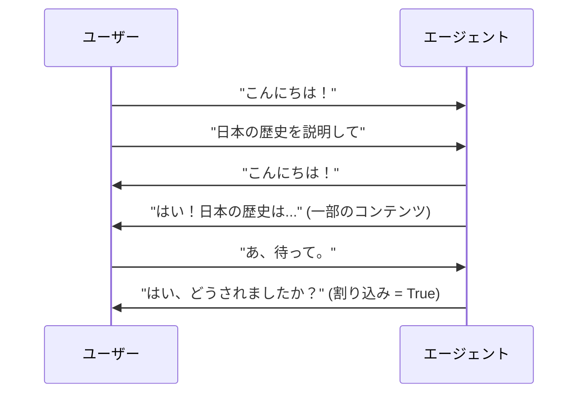
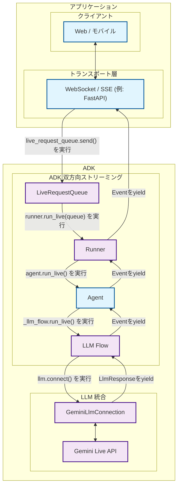

# パート1: ADK双方向ストリーミング入門

<div class="language-support-tag">
    <span class="lst-supported">ADKでサポート</span><span class="lst-python">Python v0.5.0</span><span class="lst-preview">実験的機能</span>
</div>

[Agent Development Kit (ADK)](https://google.github.io/adk-docs/)による双方向ストリーミングの世界へようこそ。この記事は、AIエージェントとのコミュニケーションに対するあなたの理解を、従来のリクエスト-レスポンスパターンから、人と話すのと同じくらい自然でダイナミックなリアルタイムの会話へと変革させます。

あなたが話し終わるのを待ってから応答するだけでなく、積極的に聞き、ふとした思いつきで文章の途中で割り込むことができるAIアシスタントを構築することを想像してみてください。会話のコンテキストを維持しながら、音声、映像、テキストを同時に処理するカスタマーサポートボットを作成することを思い描いてみてください。これこそが双方向ストリーミングの力であり、ADKはすべての開発者がそれを手軽に利用できるようにします。

## 1.1 双方向ストリーミング（Bidi-streaming）とは？ { #what-is-bidi-streaming }

双方向ストリーミング（Bidi-streaming, Bidirectional streaming）は、従来のAIとの対話からの根本的な転換を意味します。堅苦しい「問いかけて待つ」パターンではなく、人間とAIの両方が同時に話し、聞き、応答できる**リアルタイムの双方向コミュニケーション**を可能にします。これにより、即時の応答と進行中の対話に割り込むという画期的な能力を備えた、人間らしい自然な会話が生まれます。

メールの送受信と電話での会話の違いを考えてみてください。従来のAIとの対話はメールのようなものです。完全なメッセージを送り、完全な応答を待ち、そしてまた別の完全なメッセージを送ります。双方向ストリーミングは電話での会話のようなものです。流動的で自然であり、リアルタイムで割り込み、明確化し、応答することができます。

### 主な特徴

これらの特徴は、双方向ストリーミングを従来のAIとの対話と区別し、魅力的なユーザー体験を創造する上で独自に強力なものにします。

- **双方向コミュニケーション**: 完全な応答を待つことなく、継続的なデータ交換が可能です。ユーザーとAIは、あなたがまだ質問を話している途中でも、最初の数語に応答を開始でき、これにより取引的ではなく真に対話的な体験が生まれます。

- **応答性の高い割り込み**: 自然なユーザー体験にとって、おそらく最も重要な機能です。ユーザーは、人間の会話のように、エージェントの応答の途中で新しい入力で割り込むことができます。AIが量子物理学について説明している最中に、あなたが突然「待って、電子って何？」と尋ねると、AIは即座に停止し、あなたの質問に対応します。

- **マルチモーダルに最適**: テキスト、音声、映像の入力を同時にサポートすることで、豊かで自然な対話が生まれます。ユーザーはドキュメントを見せながら話したり、音声通話中にフォローアップの質問をタイプしたり、コンテキストを失うことなくコミュニケーションモードをシームレスに切り替えることができます。



### 他のストリーミングタイプとの違い

双方向ストリーミングが他のアプローチとどのように異なるかを理解することは、その独自の価値を評価する上で不可欠です。ストリーミングの分野には、それぞれ異なるユースケースに対応するいくつかの異なるパターンがあります。

!!! info "ストリーミングタイプの比較"

    **双方向ストリーミング**は、他のストリーミングアプローチとは根本的に異なります。

    - **サーバーサイドストリーミング (Server-Side Streaming)**: サーバーからクライアントへの一方向のデータフローです。ライブビデオストリームを視聴するようなもので、継続的なデータは受け取りますが、リアルタイムで対話することはできません。ダッシュボードやライブフィードには便利ですが、会話には適していません。

    - **トークンレベルストリーミング (Token-Level Streaming)**: 割り込みなしでテキストトークンを順次配信します。AIは単語ごとに応答を生成しますが、新しい入力を送信するには完了を待つ必要があります。誰かがリアルタイムでメッセージを入力しているのを見るようなもので、形成されるのを見ることはできますが、割り込むことはできません。

    - **双方向ストリーミング (Bidirectional Streaming)**: 割り込みをサポートする完全な双方向コミュニケーションです。両者が同時に話し、聞き、応答できる真の対話型AIです。これにより、会話の途中で割り込んだり、明確化したり、話題を変えたりすることが可能な自然な対話が実現します。

### 実世界での応用例

双方向ストリーミングは、エージェントが人間のような応答性と知性で動作できるようにすることで、エージェント型AIアプリケーションに革命をもたらします。これらの応用例は、ストリーミングが静的なAIの対話を、真に知的で能動的と感じられるダイナミックなエージェント駆動の体験にどのように変えるかを示しています。

[ショッパーズ・コンシェルジュ・デモ(Shopper's Concierge demo)](https://www.youtube.com/watch?v=LwHPYyw7u6U)のビデオでは、マルチモーダルな双方向ストリーミング機能が、より速く直感的なショッピング体験を可能にすることで、eコマースのユーザー体験を大幅に向上させています。対話的な理解と高速で並列化された検索の組み合わせが、バーチャル試着のような高度な機能につながり、購入者の信頼を高め、オンラインショッピングの障壁を低減します。

<div class="video-grid">
  <div class="video-item">
    <div class="video-container">
      <iframe src="https://www.youtube-nocookie.com/embed/LwHPYyw7u6U?si=xxIEhnKBapzQA6VV" title="Shopper's Concierge" frameborder="0" allow="accelerometer; autoplay; clipboard-write; encrypted-media; gyroscope; picture-in-picture; web-share" referrerpolicy="strict-origin-when-cross-origin" allowfullscreen></iframe>
    </div>
  </div>
</div>

また、双方向ストリーミングには他にも多くの実世界での応用が考えられます：

1.  **カスタマーサービス＆コンタクトセンター**: 最も直接的な応用分野です。この技術は、従来のチャットボットをはるかに超える洗練された仮想エージェントを作成できます。

    - **ユースケース**: 顧客が欠陥製品について小売店のサポートラインに電話します。
    - **マルチモーダル（ビデオ）**: 顧客は「コーヒーメーカーの底から水が漏れています。お見せします」と言い、携帯電話のカメラで問題のライブ映像をストリーミングできます。AIエージェントは視覚能力を使ってモデルと故障箇所を特定できます。
    - **ライブ対話＆割り込み**: エージェントが「モデルXのコーヒーメーカーの返品処理を進めます」と言った場合、顧客は「いえ、待ってください、モデルY Proです」と割り込むことができ、エージェントは会話をやり直すことなく即座に修正できます。

2.  **フィールドサービス＆技術支援**: 現場で作業する技術者は、ハンズフリーの音声操作アシスタントを使用してリアルタイムの支援を受けることができます。

    - **ユースケース**: HVAC技術者が現場で複雑な業務用エアコンユニットを診断しようとしています。
    - **マルチモーダル（ビデオ＆音声）**: スマートグラスを装着したり携帯電話を使用したりする技術者は、自分の視点をAIエージェントにストリーミングできます。「このコンプレッサーから異音が聞こえます。これを特定し、このモデルの診断フローチャートを表示してもらえますか？」と尋ねることができます。
    - **ライブ対話**: エージェントは技術者をステップバイステップで案内し、技術者は工具から手を離さずにいつでも質問したり割り込んだりできます。

3.  **ヘルスケア＆遠隔医療**: エージェントは、患者の受付、トリアージ、基本的な相談の最初の窓口として機能できます。

    - **ユースケース**: 患者が皮膚の状態に関する予備相談のためにプロバイダーのアプリを使用します。
    - **マルチモーダル（ビデオ/画像）**: 患者は発疹のライブ映像や高解像度の画像を安全に共有できます。AIは予備的な分析を行い、明確化のための質問をすることができます。

4.  **金融サービス＆ウェルスマネジメント**: エージェントは、クライアントに安全で対話的、かつデータ豊富な方法で資産を管理する手段を提供できます。

    - **ユースケース**: クライアントが投資ポートフォリオを確認し、市場の動向について議論したいと考えています。
    - **マルチモーダル（画面共有）**: エージェントはチャート、グラフ、ポートフォリオのパフォーマンスデータを表示するために画面を共有できます。クライアントも特定のニュース記事を指して「このイベントが私のテクノロジー株に与える潜在的な影響は何ですか？」と尋ねるために画面を共有できます。
    - **ライブ対話**: クライアントの口座データにアクセスして現在のポートフォリオ配分を分析し、潜在的な取引がポートフォリオのリスクプロファイルに与える影響をシミュレートします。

## 1.2 ADK 双方向ストリーミングのアーキテクチャ概要 { #adk-bidi-streaming-architecture-overview }

ADKの双方向ストリーミングアーキテクチャは、双方向のAI会話を人間の対話のように自然に感じさせます。このアーキテクチャは、低遅延かつ高スループットの通信のために設計された洗練されたパイプラインを通じて、Googleの[Gemini Live API](https://ai.google.dev/gemini-api/docs/live)とシームレスに統合されます。

このシステムは、リアルタイムストリーミングに必要な複雑なオーケストレーション（複数の同時データフローの管理、割り込みの適切な処理、マルチモーダル入力の同時処理、動的な対話全体での会話状態の維持）を処理します。ADKの双方向ストリーミングは、この複雑さを、開発者がストリーミングプロトコルやAIモデルの通信パターンの詳細を理解する必要なく使用できる、シンプルで直感的なAPIに抽象化します。

### 高レベルアーキテクチャ



| 開発者が提供するもの | ADKが提供するもの | Geminiが提供するもの |
|:----------------------------|:------------------|:------------------------------|
| **Web / モバイル**: ユーザーが対話するフロントエンドアプリケーションで、UI/UX、ユーザー入力のキャプチャ、応答の表示を処理します。<br><br>**[WebSocket](https://developer.mozilla.org/en-US/docs/Web/API/WebSocket) / [SSE](https://developer.mozilla.org/en-US/docs/Web/API/Server-sent_events) サーバー**: クライアント接続を管理し、ストリーミングプロトコルを処理し、クライアントとADK間のメッセージをルーティングするリアルタイム通信サーバー（[FastAPI](https://fastapi.tiangolo.com/)など）です。<br><br>**Agent**: アプリケーションのニーズに合わせて、特定の指示、ツール、動作でカスタマイズされたAIエージェントの定義です。 | **[LiveRequestQueue](https://github.com/google/adk-python/blob/main/src/google/adk/agents/live_request_queue.py)**: 受信するユーザーメッセージ（テキストコンテンツ、音声ブロブ、制御信号）をバッファリングし、エージェントが順序通りに処理できるようにシーケンス化するメッセージキューです。<br><br>**[Runner](https://github.com/google/adk-python/blob/main/src/google/adk/runners.py)**: エージェントセッションを調整し、会話状態を管理し、`run_live()`ストリーミングインターフェースを提供する実行エンジンです。<br><br>**[LLM Flow](https://github.com/google/adk-python/blob/main/src/google/adk/flows/llm_flows/base_llm_flow.py)**: ストリーミング会話ロジックを処理し、コンテキストを管理し、言語モデルと連携する処理パイプラインです。<br><br>**[GeminiLlmConnection](https://github.com/google/adk-python/blob/main/src/google/adk/models/gemini_llm_connection.py)**: ADKのストリーミングアーキテクチャとGemini Live APIを橋渡しし、プロトコル変換と接続管理を行う抽象化レイヤーです。 | **[Gemini Live API](https://ai.google.dev/gemini-api/docs/live)**: ストリーミング入力を処理し、応答を生成し、割り込みを処理し、マルチモーダルコンテンツ（テキスト、音声、映像）をサポートし、関数呼び出しや文脈理解などの高度なAI機能を提供するGoogleのリアルタイム言語モデルサービスです。 |

## 1.3 開発環境のセットアップ { #setting-up-your-development-environment }

ADKの双方向ストリーミングアーキテクチャの要点とその価値を理解したところで、実際に手を動かしてみましょう。このセクションでは、前のセクションで説明したストリーミングエージェントとアプリケーションの構築を開始できるように、開発環境を準備します。

このセットアップを終える頃には、私たちが議論してきたインテリジェントな音声アシスタント、能動的なカスタマーサポートエージェント、マルチエージェント連携プラットフォームを作成するために必要なものがすべて揃います。セットアッププロセスは簡単です。ADKが複雑なストリーミングインフラストラクチャを処理するため、あなたは低レベルのストリーミングプロトコルと格闘するのではなく、エージェント独自の機能の構築に集中できます。

### インストール手順

#### 1. 仮想環境の作成（推奨） { #create-virtual-environment-recommended }

```bash
# 仮想環境の作成
python -m venv .venv

# 仮想環境のアクティベート
# macOS/Linux:
source .venv/bin/activate
# Windows CMD:
# .venv\Scripts\activate.bat
# Windows PowerShell:
# .venv\Scripts\Activate.ps1
```

#### 2. ADKのインストール { #install-adk }

プロジェクトのルートに`requirements.txt`ファイルを作成します。`google-adk`ライブラリには、双方向ストリーミングアプリケーションのWebサーバーとして使用できるFastAPIとuvicornが含まれていることに注意してください。

```txt
google-adk==1.3.0
python-dotenv>=1.0.0
```

すべての依存関係をインストールします：

```bash
pip install -r requirements.txt
```

#### 3. SSL証明書パスの設定（macOSのみ） { #set-ssl-certificate-path-macos-only }

```bash
# macOSでの適切なSSL処理に必要
export SSL_CERT_FILE=$(python -m certifi)
```

#### 4. APIキーのセットアップ { #set-up-api-keys }

エージェントを実行するプラットフォームを選択してください：

=== "Google AI Studio"

    1. [Google AI Studio](https://aistudio.google.com/apikey)からAPIキーを取得します。
    2. プロジェクトのルートに`.env`ファイルを作成します：

    ```env
    GOOGLE_GENAI_USE_VERTEXAI=FALSE
    GOOGLE_API_KEY=your_actual_api_key_here
    ```

=== "Google Cloud Vertex AI"

    1. [Google Cloudプロジェクト](https://cloud.google.com/vertex-ai/generative-ai/docs/start/quickstarts/quickstart-multimodal#setup-gcp)をセットアップします。
    2. [gcloud CLI](https://cloud.google.com/vertex-ai/generative-ai/docs/start/quickstarts/quickstart-multimodal#setup-local)をインストールして設定します。
    3. 認証： `gcloud auth login`
    4. [Vertex AI APIを有効にする](https://console.cloud.google.com/flows/enableapi?apiid=aiplatform.googleapis.com)
    5. プロジェクトのルートに`.env`ファイルを作成します：

    ```env
    GOOGLE_GENAI_USE_VERTEXAI=TRUE
    GOOGLE_CLOUD_PROJECT=your_actual_project_id
    GOOGLE_CLOUD_LOCATION=us-central1
    ```

#### 5. 環境セットアップスクリプトの作成 { #create-environment-setup-script }

インストールを確認するための検証スクリプトを作成します：

```bash
# ディレクトリ構造の作成
mkdir -p src/part1
```

`src/part1/1-3-1_environment_setup.py`を作成します：

```python
#!/usr/bin/env python3
"""
パート1.3.1: 環境セットアップの検証
ADKストリーミング環境の構成を検証するための包括的なスクリプト。
"""

import os
import sys
from pathlib import Path
from dotenv import load_dotenv

def validate_environment():
    """ADKストリーミング環境のセットアップを検証する。"""

    print("🔧 ADKストリーミング環境の検証")
    print("=" * 45)

    # 環境変数の読み込み
    env_path = Path(__file__).parent.parent.parent / '.env'
    if env_path.exists():
        load_dotenv(env_path)
        print(f"✓ 環境ファイルを読み込みました: {env_path}")
    else:
        print(f"❌ 環境ファイルが見つかりません: {env_path}")
        return False

    # Pythonのバージョンを確認
    python_version = sys.version_info
    if python_version >= (3, 8):
        print(f"✓ Pythonバージョン: {python_version.major}.{python_version.minor}.{python_version.micro}")
    else:
        print(f"❌ Pythonバージョン {python_version.major}.{python_version.minor} - 3.8+が必要です")
        return False

    # ADKのインストールをテスト
    try:
        import google.adk
        print(f"✓ ADKのインポートに成功")

        # 利用可能であればバージョンを取得
        try:
            from google.adk.version import __version__
            print(f"✓ ADKバージョン: {__version__}")
        except:
            print("ℹ️ ADKのバージョン情報が利用できません")

    except ImportError as e:
        print(f"❌ ADKのインポートに失敗: {e}")
        return False

    # 必須インポートの確認
    essential_imports = [
        ('google.adk.agents', 'Agent, LiveRequestQueue'),
        ('google.adk.runners', 'InMemoryRunner'),
        ('google.genai.types', 'Content, Part, Blob'),
    ]

    for module, components in essential_imports:
        try:
            __import__(module)
            print(f"✓ インポート: {module}")
        except ImportError as e:
            print(f"❌ インポートに失敗: {module} - {e}")
            return False

    # 環境変数の検証
    env_checks = [
        ('GOOGLE_GENAI_USE_VERTEXAI', 'プラットフォーム構成'),
        ('GOOGLE_API_KEY', 'API認証'),
    ]

    for env_var, description in env_checks:
        value = os.getenv(env_var)
        if value:
            # セキュリティのためAPIキーをマスク
            display_value = value if env_var != 'GOOGLE_API_KEY' else f"{value[:10]}..."
            print(f"✓ {description}: {display_value}")
        else:
            print(f"❌ 不足: {env_var} ({description})")
            return False

    # 基本的なADK機能のテスト
    try:
        from google.adk.agents import LiveRequestQueue
        from google.genai.types import Content, Part

        # テストキューの作成
        queue = LiveRequestQueue()
        test_content = Content(parts=[Part(text="Test message")])
        queue.send_content(test_content)
        queue.close()

        print("✓ 基本的なADK機能のテストに合格")

    except Exception as e:
        print(f"❌ ADK機能のテストに失敗: {e}")
        return False

    print("\n🎉 環境の検証に成功しました！")
    print("\n次のステップ:")
    print("• src/agents/ でストリーミングエージェントの構築を開始してください")
    print("• src/tools/ でカスタムツールを作成してください")
    print("• src/utils/ にユーティリティ関数を追加してください")
    print("• パート3の例でテストしてください")

    return True

def main():
    """環境検証を実行する。"""

    try:
        success = validate_environment()
        sys.exit(0 if success else 1)

    except KeyboardInterrupt:
        print("\n\n⚠️ ユーザーによって検証が中断されました")
        sys.exit(1)
    except Exception as e:
        print(f"\n❌ 予期せぬエラーが発生しました: {e}")
        sys.exit(1)

if __name__ == "__main__":
    main()
```

### プロジェクト構造

これで、あなたのストリーミングプロジェクトは以下の構造になっているはずです：

```text
your-streaming-project/
├── .env                              # 環境変数（APIキー）
├── requirements.txt                 # Pythonの依存関係
└── src/
    └── part1/
        └── 1-3-1_environment_setup.py  # 環境検証スクリプト
```

### 実行する

完成した環境セットアップスクリプトを使用して、すべてが正しく設定されていることを確認します：

```bash
python src/part1/1-3-1_environment_setup.py
```

!!! example "期待される出力"

    検証スクリプトを実行すると、以下のような出力が表示されるはずです：

    ```
    🔧 ADKストリーミング環境の検証
    =============================================
    ✓ 環境ファイルを読み込みました: /path/to/your-streaming-project/.env
    ✓ Pythonバージョン: 3.12.8
    ✓ ADKのインポートに成功
    ✓ ADKバージョン: 1.3.0
    ✓ インポート: google.adk.agents
    ✓ インポート: google.adk.runners
    ✓ インポート: google.genai.types
    ✓ プラットフォーム構成: FALSE
    ✓ API認証: AIzaSyAolZ...
    ✓ 基本的なADK機能のテストに合格

    🎉 環境の検証に成功しました！
    ```

    この包括的な検証スクリプトは以下をチェックします：

    - ADKのインストールとバージョン
    - 必須の環境変数
    - APIキーの検証
    - 基本的なインポートの確認

### 次のステップ

環境がセットアップされたので、コアとなるストリーミングAPIについて深く学ぶ準備ができました。次のパート（近日公開予定）では、以下について学びます：

- **LiveRequestQueue**: 双方向コミュニケーションの心臓部
- **run_live() メソッド**: ストリーミングセッションの開始
- **イベント処理**: リアルタイム応答のハンドリング
- **Gemini Live API**: 直接的な統合パターン