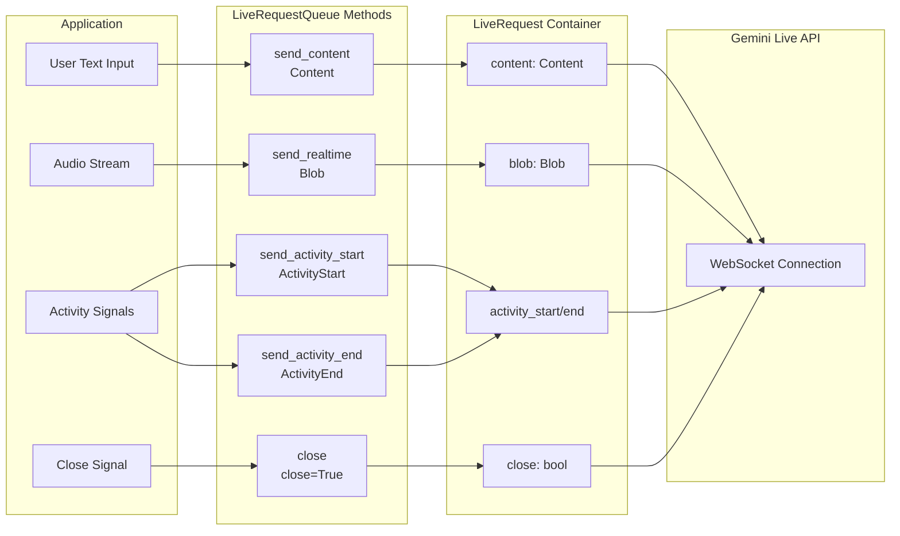

# Part 2: LiveRequestQueue でメッセージを送る

Part 1 では、ADK 双方向ストリーミング（Bidi-streaming）アプリケーションの
4 フェーズライフサイクルを学びました。今回はアップストリームの流れ、
つまり `LiveRequestQueue` を使ってアプリケーションからエージェントへ
メッセージを送る方法に焦点を当てます。

従来 API のようにメッセージ種別ごとに別エンドポイントやチャネルを使うのではなく、
ADK は `LiveRequestQueue` と `LiveRequest` メッセージモデルで
単一の統合インターフェースを提供します。今回は次を扱います。

- **メッセージタイプ**: `send_content()` によるテキスト送信、`send_realtime()` による
  音声/画像/動画ストリーミング、activity シグナルによる会話ターン制御、
  control シグナルによるセッションの正常終了
- **並行処理パターン**: 非同期キュー管理とイベントループのスレッド安全性
- **ベストプラクティス**: 非同期コンテキストでのキュー作成、適切なリソース解放、
  メッセージ順序保証の理解
- **トラブルシューティング**: メッセージ未処理やキューライフサイクル問題の診断

`LiveRequestQueue` の理解は、非同期イベントループ内でマルチモーダル入力を
シームレスに扱う高応答なストリーミングアプリを作るうえで重要です。

## LiveRequestQueue と LiveRequest

`LiveRequestQueue` は、ストリーミング会話でエージェントへメッセージを送る
主要インターフェースです。テキスト、音声、制御シグナルで別チャネルを管理する代わりに、
ADK は単一の `LiveRequest` コンテナで全メッセージタイプを扱います。

```python title='Source reference: <a href="https://github.com/google/adk-python/blob/29c1115959b0084ac1169748863b35323da3cf50/src/google/adk/agents/live_request_queue.py" target="_blank">live_request_queue.py</a>'
class LiveRequest(BaseModel):
    content: Optional[Content] = None           # Text-based content and structured data
    blob: Optional[Blob] = None                 # Audio/video data and binary streams
    activity_start: Optional[ActivityStart] = None  # Signal start of user activity
    activity_end: Optional[ActivityEnd] = None      # Signal end of user activity
    close: bool = False                         # Graceful connection termination signal
```

このシンプルな設計で、一般的なストリーミングシナリオを網羅できます。
`content` と `blob` はデータタイプを扱い、`activity_start` と `activity_end` は
activity signaling を担い、`close` フラグは正常終了を表します。

`content` と `blob` は排他的で、1 つの LiveRequest にはどちらか一方のみ設定します。
ADK はクライアント側でこれを強制しないため、両方設定すると送信を試みますが、
Live API バックエンドでバリデーションエラーになります。
ADK の `send_content()` と `send_realtime()` は片方だけ設定するため、
**LiveRequest を手動作成するよりこれらメソッド利用を推奨**します。

次の図は、各メッセージタイプがアプリケーションから `LiveRequestQueue` メソッド、
`LiveRequest` コンテナを経由して Live API に届く流れを示します。



## さまざまなメッセージタイプを送る

`LiveRequestQueue` は、メッセージタイプごとの便利メソッドを提供します。
このセクションでは、テキスト送信、音声/動画ストリーミング、
手動ターン制御の activity シグナル、セッション終了を扱います。

### send_content(): ターン単位のテキスト送信

`send_content()` は turn-by-turn モードでテキストを送ります。
各メッセージは独立した会話ターンとして扱われ、
モデルに「ターン完了」を知らせて即時応答生成を促します。

```python title='Demo implementation: <a href="https://github.com/google/adk-samples/blob/31847c0723fbf16ddf6eed411eb070d1c76afd1a/python/agents/bidi-demo/app/main.py#L194-L199" target="_blank">main.py:194-199</a>'
content = types.Content(parts=[types.Part(text=json_message["text"])])
live_request_queue.send_content(content)
```

**ADK Bidi-streaming における Content / Part の使い方:**

- **`Content`** (`google.genai.types.Content`): 会話の 1 メッセージ（1 ターン）を表す
  コンテナ。複数の `Part` を保持します。

- **`Part`** (`google.genai.types.Part`): メッセージ内の個別コンテンツ要素。
  ADK Bidi-streaming + Live API では主に次を使います。
  - `text`: モデルへ送るテキスト（コード含む）

実運用では単一 text Part がほとんどです。
マルチパート構造は次のような用途を想定しています。
- テキストと function response の混在（ADK が自動処理）
- テキスト説明と構造化データの組み合わせ
- 新しいコンテンツ型への将来拡張

Live API ではマルチモーダル入力（音声/動画）は
マルチパート Content ではなく `send_realtime()` を使います。

!!! note "ADK Bidi-streaming における Content / Part"
    Gemini API の `Part` は `inline_data`、`file_data`、`function_call`、
    `function_response` など多くのフィールドを持ちますが、
    多くは ADK が自動処理するか、Live API では別機構を使います。

    - **関数呼び出し**: ADK が function call の受信、関数実行、
      結果返却を自動処理します。手動構築は不要です。
    - **画像/動画**: `inline_data` 付き `send_content()` は使わないでください。
      連続ストリーミングには `send_realtime(Blob(mime_type="image/jpeg", data=...))` を使います。
      詳細は [Part 5: How to Use Image and Video](part5.md#how-to-use-image-and-video) を参照。

### send_realtime(): 音声・画像・動画をリアルタイム送信

`send_realtime()` は主に音声/画像/動画などのバイナリストリームを送ります。
`Blob` 型で扱われ、リアルタイムモード向けです。
テキストがターン単位処理なのに対し、Blob は連続チャンク処理向けです。
生バイトを渡すと、Pydantic が JSON 直列化時に Base64 エンコードを自動実施し、
安全にネットワーク送信できます（`LiveRequest.model_config`）。
MIME タイプはモデルが形式を理解するために使われます。

```python title='Demo implementation: <a href="https://github.com/google/adk-samples/blob/31847c0723fbf16ddf6eed411eb070d1c76afd1a/python/agents/bidi-demo/app/main.py#L181-L184" target="_blank">main.py:181-184</a>'
audio_blob = types.Blob(
    mime_type="audio/pcm;rate=16000",
    data=audio_data
)
live_request_queue.send_realtime(audio_blob)
```

!!! note "Learn More"
    音声・画像・動画の仕様、形式、ベストプラクティスは
    [Part 5: How to Use Audio, Image and Video](part5.md) を参照してください。

### Activity Signals

activity シグナル（`ActivityStart` / `ActivityEnd`）は、
`RunConfig` で自動（サーバー側）VAD を**明示的に無効化した場合のみ**送信できます。
次のケースで使います。

- **Push-to-talk UI**: ボタン操作などで発話タイミングを明示制御
- **騒音環境**: 自動 VAD が不安定なため、クライアント VAD や手動制御を利用
- **クライアント側 VAD**: 発話時のみ音声を送ってネットワーク負荷を削減
- **カスタム UX**: ジェスチャー起動、時間区切り音声など

**activity シグナルがモデルに伝える内容:**

- `ActivityStart`: 「ユーザーが話し始めた。音声を蓄積して処理を開始」
- `ActivityEnd`: 「ユーザーが話し終えた。蓄積音声を処理して応答生成」

VAD 無効時にこれらが無いと、モデルは開始/終了境界を判断できないため、
ターン境界を明示する必要があります。

**activity シグナル送信:**

```python
from google.genai import types

# 手動 activity signaling（例: push-to-talk）
live_request_queue.send_activity_start()  # 発話開始

# ボタン押下中のみ音声チャンクを送信
while user_is_holding_button:
    audio_blob = types.Blob(mime_type="audio/pcm;rate=16000", data=audio_chunk)
    live_request_queue.send_realtime(audio_blob)

live_request_queue.send_activity_end()  # 発話終了
```

**デフォルト（自動 VAD）:** activity シグナルを送らない場合、
Live API の内蔵 VAD が `send_realtime()` の音声から発話境界を自動検出します。
多くのアプリではこの方式が推奨です。

!!! note "Learn More"
    自動 VAD と手動 activity シグナルの比較、VAD 無効化の判断基準、
    ベストプラクティスは [Part 5: Voice Activity Detection](part5.md#voice-activity-detection-vad) を参照。

### Control Signals

`close` シグナルはストリーミングセッションの正常終了を表します。
モデル接続をきれいに閉じ、Bidi-stream を終了します。
ADK Bidi-streaming ではアプリ側で `close` を明示送信する責任があります。

**BIDI モードでの手動クローズ:** `StreamingMode.BIDI` では、
セッション終了時やエラー時に `close()` を呼び出すべきです。
これによりセッションリソースを最小化できます。

**SSE モードでの自動クローズ:** レガシー `StreamingMode.SSE`（Bidi ではない）では、
モデルの `turn_complete=True` 受信時に ADK がキューに `close()` を自動実行します
（[`base_llm_flow.py:781`](https://github.com/google/adk-python/blob/fd2c0f556b786417a9f6add744827b07e7a06b7d/src/google/adk/flows/llm_flows/base_llm_flow.py#L780)）。

詳細比較は [Part 4: Understanding RunConfig](part4.md#streamingmode-bidi-or-sse) を参照してください。

```python title='Demo implementation: <a href="https://github.com/google/adk-samples/blob/31847c0723fbf16ddf6eed411eb070d1c76afd1a/python/agents/bidi-demo/app/main.py#L238-L253" target="_blank">main.py:238-253</a>'
try:
    logger.debug("Starting asyncio.gather for upstream and downstream tasks")
    await asyncio.gather(
        upstream_task(),
        downstream_task()
    )
    logger.debug("asyncio.gather completed normally")
except WebSocketDisconnect:
    logger.debug("Client disconnected normally")
except Exception as e:
    logger.error(f"Unexpected error in streaming tasks: {e}", exc_info=True)
finally:
    # 例外が発生しても必ずキューを閉じる
    logger.debug("Closing live_request_queue")
    live_request_queue.close()
```

**`close()` を呼ばないとどうなるか**

ADK はローカルリソースを自動解放しますが、
BIDI モードで `close()` を呼ばないと Live API に正常終了シグナルが送られません。
結果として一定時間後に突然の切断として扱われ、
クラウド側に "ゾンビ" セッションが残る可能性があります。
これらはタイムアウトまでクォータを消費するため、
同時セッション処理能力が下がる場合があります。

!!! note "Learn More"
    ストリーミング中の包括的なエラー処理（`break`/`continue`、エラー種別対応）は
    [Part 3: Error Events](part3.md#error-events) を参照してください。

## 並行処理とスレッド安全性

`LiveRequestQueue` の並行動作を理解することは、信頼性の高いストリーミングアプリ構築に重要です。
このキューは `asyncio.Queue` ベースのため、
**同一イベントループスレッド内**の同時アクセスは安全ですが、
**異なるスレッド**から呼ぶ場合は特別な配慮が必要です。
このセクションでは設計上の意図、
追加対策なしで安全なケース、
`loop.call_soon_threadsafe()` が必要なケースを説明します。

### 非同期キュー管理

`LiveRequestQueue` は内部消費が非同期でも、
`send_content()` と `send_realtime()` は同期メソッドです。
これは `await` 不要の non-blocking 操作
`asyncio.Queue.put_nowait()` を使うためです。

**なぜ同期 send メソッドか？** 利便性と単純さのためです。
非同期コード内のどこからでも `await` なしで呼べます。

```python title='Demo implementation: <a href="https://github.com/google/adk-samples/blob/31847c0723fbf16ddf6eed411eb070d1c76afd1a/python/agents/bidi-demo/app/main.py#L169-L199" target="_blank">main.py:169-199</a>'
async def upstream_task() -> None:
    """Receives messages from WebSocket and sends to LiveRequestQueue."""
    while True:
        message = await websocket.receive()

        if "bytes" in message:
            audio_data = message["bytes"]
            audio_blob = types.Blob(
                mime_type="audio/pcm;rate=16000",
                data=audio_data
            )
            live_request_queue.send_realtime(audio_blob)

        elif "text" in message:
            text_data = message["text"]
            json_message = json.loads(text_data)

            if json_message.get("type") == "text":
                content = types.Content(parts=[types.Part(text=json_message["text"])])
                live_request_queue.send_content(content)
```

このパターンは、非同期 I/O と同期 CPU 処理を自然に組み合わせられます。
send メソッドは即時復帰するため、アプリの応答性を保てます。

#### ベストプラクティス: 非同期コンテキストでキューを作成する

`LiveRequestQueue` は必ず非同期コンテキスト（async 関数/コルーチン）で作成し、
正しいイベントループを使うようにしてください。

```python
# ✅ 推奨 - 非同期コンテキストで作成
async def main():
    queue = LiveRequestQueue()  # 既存イベントループを使用
    # ストリーミング処理に使う正しいイベントループを確実に使える

# ❌ 非推奨 - イベントループを自動作成
queue = LiveRequestQueue()  # 動作はするが ADK が新規ループを作成
# 安全機構により動作するが、複雑なアプリやマルチスレッドで
# ループ協調の問題を引き起こす可能性がある
```

**なぜ重要か:** `LiveRequestQueue` はインスタンス化時にイベントループを必要とします。
ADK はループ未存在時に自動作成する安全機構を持ちますが、
マルチスレッドやカスタムイベントループ構成では予期しない挙動につながる可能性があります。

## メッセージ順序保証

`LiveRequestQueue` は予測可能なメッセージ配送動作を提供します。

| 保証 | 説明 | 影響 |
|-----------|-------------|--------|
| **FIFO 順序** | 送信順に処理（`asyncio.Queue` で保証） | 会話コンテキストと一貫性を維持 |
| **非結合配送** | 各メッセージを独立して配送 | 自動バッチ化なし。send 1 回につき request 1 件 |
| **デフォルト無制限** | ブロックせず無制限に受け付け | **利点**: クライアントコード簡素化<br>**リスク**: 処理より送信が速いとメモリ増加<br>**対策**: 本番でキュー深さ監視 |

> **Production Tip**: 高スループットの音声/動画ストリーミングでは
> `live_request_queue._queue.qsize()` を監視してバックプレッシャーを検知してください。
> キュー深さが継続的に増えるなら送信レートを下げるかバッチングを実装してください。
> なお `_queue` は内部属性であり、将来バージョンで変更される可能性があります。

## まとめ

このパートでは、`LiveRequestQueue` が非同期イベントループ内で
ADK ストリーミングエージェントへメッセージを送る統合インターフェースであることを学びました。
`LiveRequest` モデルを理解し、
`send_content()` によるテキスト、
`send_realtime()` による音声/動画 blob、
手動ターン制御の activity シグナル、
`close()` による正常終了制御を扱いました。
また、非同期キュー管理、非同期コンテキストでの生成、リソース解放、
メッセージ順序保証のベストプラクティスも学習しました。
これで、Bidi-streaming アプリにおけるアップストリーム通信チャネルとして
`LiveRequestQueue` を使う方法を理解できました。
次は、これらのメッセージに対してエージェントが生成するイベントを処理する
ダウンストリームフローを学びます。

---

← [Previous: Part 1: Introduction to ADK Bidi-streaming](part1.md) | [Next: Part 3: Event Handling with run_live()](part3.md) →
