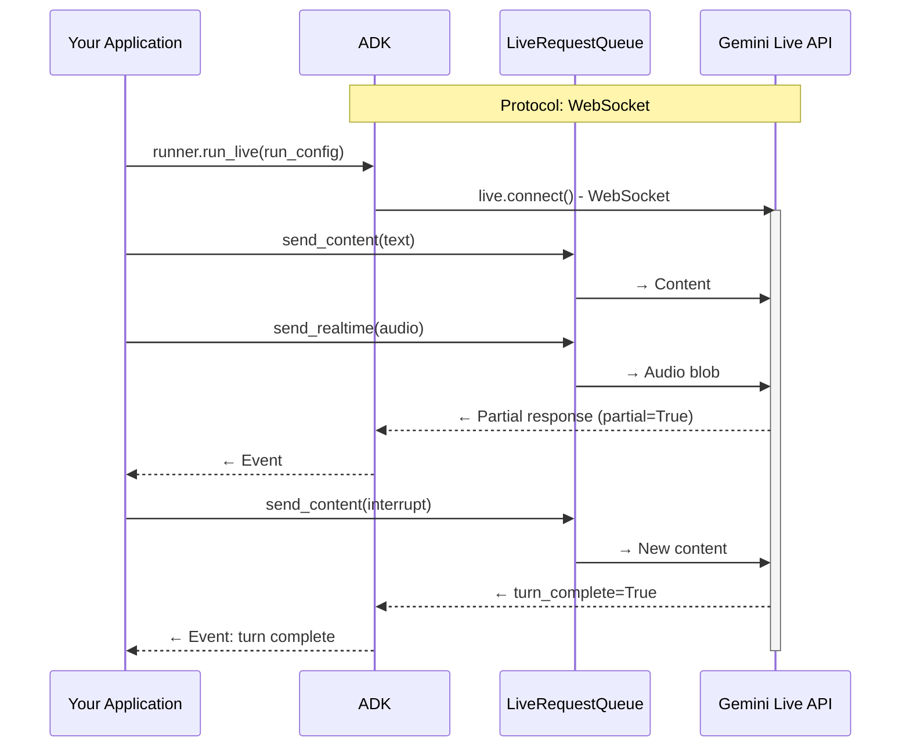
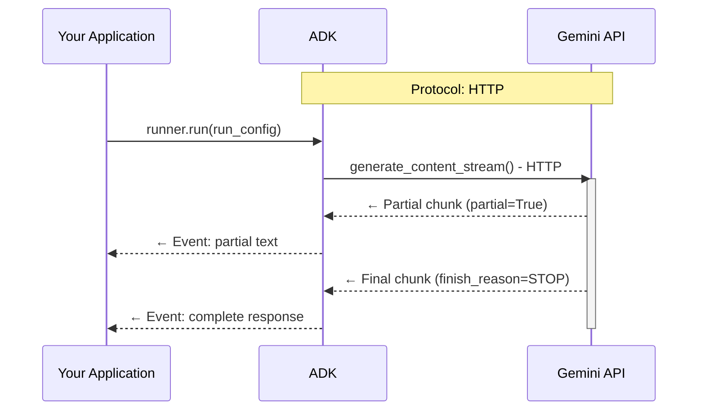
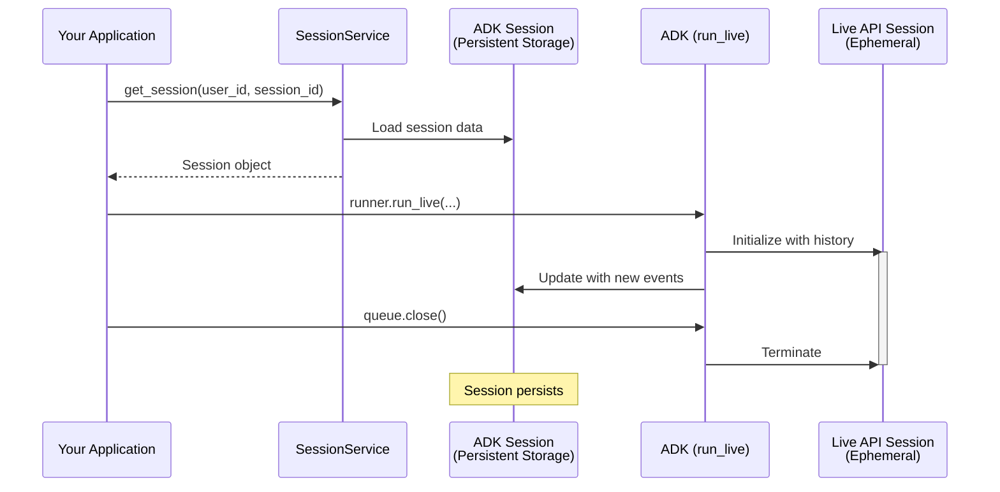

# Part 4: RunConfig を理解する

Part 3 では `run_live()` から届くイベントを処理し、モデル応答・ツール呼び出し・
ストリーミング更新を扱う方法を学びました。
このパートでは `RunConfig` を使って、
応答形式の制御、セッションライフサイクル管理、本番制約の適用を行う方法を説明します。

**このパートで学ぶこと**:
レスポンスモダリティの制約、BIDI と SSE の違い、
ADK Session と Live API Session の関係、
session resumption と context window compression による長時間運用、
同時セッションクォータ対策、`max_llm_calls` と音声保存によるコスト管理を扱います。

!!! note "Learn More"

    音声/動画関連の詳細設定は
    [Part 5: Audio, Image and Video in Live API](part5.md) を参照してください。

## RunConfig パラメータ早見表

| Parameter | Type | Purpose | Platform Support | Reference |
|-----------|------|---------|------------------|-----------|
| **response_modalities** | list[str] | 出力形式制御（TEXT/AUDIO） | Both | [Details](#response-modalities) |
| **streaming_mode** | StreamingMode | BIDI または SSE を選択 | Both | [Details](#streamingmode-bidi-or-sse) |
| **session_resumption** | SessionResumptionConfig | 自動再接続を有効化 | Both | [Details](#live-api-session-resumption) |
| **context_window_compression** | ContextWindowCompressionConfig | セッション長を事実上無制限化 | Both | [Details](#live-api-context-window-compression) |
| **max_llm_calls** | int | セッション内 LLM 呼び出し数上限 | Both | [Details](#max_llm_calls) |
| **save_live_blob** | bool | 音声/動画ストリームを永続化 | Both | [Details](#save_live_blob) |
| **custom_metadata** | dict[str, Any] | invocation イベントにメタデータ付与 | Both | [Details](#custom_metadata) |
| **support_cfc** | bool | compositional function calling を有効化 | Gemini (2.x models only) | [Details](#support_cfc-experimental) |
| **speech_config** | SpeechConfig | 音声/言語設定 | Both | [Part 5: Voice Configuration](part5.md#voice-configuration-speech-config) |
| **input_audio_transcription** | AudioTranscriptionConfig | ユーザー音声の文字起こし | Both | [Part 5: Audio Transcription](part5.md#audio-transcription) |
| **output_audio_transcription** | AudioTranscriptionConfig | モデル音声の文字起こし | Both | [Part 5: Audio Transcription](part5.md#audio-transcription) |
| **realtime_input_config** | RealtimeInputConfig | VAD 設定 | Both | [Part 5: Voice Activity Detection](part5.md#voice-activity-detection-vad) |
| **proactivity** | ProactivityConfig | proactive audio を有効化 | Gemini (native audio only) | [Part 5: Proactivity and Affective Dialog](part5.md#proactivity-and-affective-dialog) |
| **enable_affective_dialog** | bool | 感情適応応答を有効化 | Gemini (native audio only) | [Part 5: Proactivity and Affective Dialog](part5.md#proactivity-and-affective-dialog) |

!!! note "Source Reference"

    [`run_config.py`](https://github.com/google/adk-python/blob/29c1115959b0084ac1169748863b35323da3cf50/src/google/adk/agents/run_config.py)

**サポート凡例:**

- **Both**: Gemini Live API / Vertex AI Live API の両方で利用可能
- **Gemini**: Gemini Live API のみ
- **Model-specific**: 特定モデルアーキテクチャが必要

```python
from google.genai import types
from google.adk.agents.run_config import RunConfig, StreamingMode

run_config = RunConfig(
    session_resumption=types.SessionResumptionConfig(),
    context_window_compression=types.ContextWindowCompressionConfig(...),
    speech_config=types.SpeechConfig(...),
)
```

## Response Modalities

レスポンスモダリティはモデル出力を TEXT または AUDIO に制御します。
Gemini Live API / Vertex AI Live API ともに、1 セッションで 1 モダリティのみです。

```python
run_config = RunConfig(
    streaming_mode=StreamingMode.BIDI
)

# 上記は実質以下と同等（未指定時は ADK が AUDIO を設定）
run_config = RunConfig(
    response_modalities=["AUDIO"],
    streaming_mode=StreamingMode.BIDI
)

# TEXT 専用
run_config = RunConfig(
    response_modalities=["TEXT"],
    streaming_mode=StreamingMode.BIDI
)

# AUDIO 専用
run_config = RunConfig(
    response_modalities=["AUDIO"],
    streaming_mode=StreamingMode.BIDI
)
```

```python
# ❌ 不可: 両方同時
run_config = RunConfig(
    response_modalities=["TEXT", "AUDIO"],
    streaming_mode=StreamingMode.BIDI
)
# Error: "Only one response modality is supported per session"
```

**重要制約:**

- セッション開始時に TEXT か AUDIO を選択（途中切替不可）
- Native Audio モデルは AUDIO 必須
- モダリティは出力のみを制御。入力はモデル対応範囲でテキスト/音声/動画可

## StreamingMode: BIDI または SSE

- `StreamingMode.BIDI`: ADK は WebSocket で Live API (`live.connect()`) に接続
- `StreamingMode.SSE`: ADK は HTTP ストリーミングで標準 Gemini API (`generate_content_async()`) に接続

ここでいうモードは ADK↔Gemini API の通信方式です。
クライアント向けのアプリ構成（WebSocket/REST/SSE サーバー等）とは別概念です。

```python
from google.adk.agents.run_config import RunConfig, StreamingMode

run_config = RunConfig(
    streaming_mode=StreamingMode.BIDI,
    response_modalities=["AUDIO"]
)

run_config = RunConfig(
    streaming_mode=StreamingMode.SSE,
    response_modalities=["TEXT"]
)
```

### プロトコル差

BIDI は送受信同時で、割り込み・リアルタイム音声・自然なターン交代に向きます。
SSE は request → stream response の順方向パターンです。

**BIDI:**



**SSE:**



### Progressive SSE Streaming

Progressive SSE streaming は SSE 応答集約を改善します。

- 混在コンテンツで順序を保持
- 同種テキストのみ賢くマージ
- 中間は `partial=True`、最後に集約済み応答
- 関数実行は最終イベントまで遅延
- `partial_args` で関数引数構築を段階表示

デフォルトで有効。必要なら環境変数で無効化できます。

```bash
export ADK_DISABLE_PROGRESSIVE_SSE_STREAMING=1
```

### 使い分け

**BIDI を使うとよいケース:**

- リアルタイム音声/動画
- 受信中に追加入力を送りたい
- Live API 機能（transcription/VAD/proactivity/affective dialog）が必要
- 割り込みや自然なターン制御が重要

**SSE を使うとよいケース:**

- テキスト中心チャット
- シンプルな request/response
- Live API 非対応モデル（Gemini 1.5 系）
- WebSocket を使わない簡易構成

### SSE で使う Gemini 1.5 系

**Models:**

- `gemini-1.5-pro`
- `gemini-1.5-flash`

**Supported:**

- ✅ TEXT 入出力
- ✅ SSE ストリーミング
- ✅ 自動関数呼び出し
- ✅ 大規模コンテキスト（1.5-pro 最大 2M）

**Not Supported:**

- ❌ Live 音声機能（音声 I/O、転写、VAD）
- ❌ `run_live()` Bidi-streaming
- ❌ proactivity / affective dialog
- ❌ 動画入力

## Live API の Connection と Session

### ADK Session と Live API Session の違い

**ADK `Session`**（SessionService 管理）:

- 会話履歴・state を永続保存
- in-memory / DB / Vertex AI を選択可能
- 複数 `run_live()` や再起動をまたいで保持

**Live API session**（Live API 管理）:

- `run_live()` 実行中のみ維持される論理会話コンテキスト
- `LiveRequestQueue.close()` で終了
- duration 制約の対象。resumption handle により再開可能



### Connection / Session 制約

| Constraint Type | Gemini Live API<br>(Google AI Studio) | Vertex AI Live API<br>(Google Cloud) | Notes |
|----------------|---------------------------------------|--------------------------------------|-------|
| **Connection duration** | ~10 minutes | Not documented separately | Gemini は接続が自動終了。ADK が再接続 |
| **Session Duration (Audio-only)** | 15 minutes | 10 minutes | 圧縮なし基準。圧縮有効時は無制限 |
| **Session Duration (Audio + video)** | 2 minutes | 10 minutes | Gemini は動画で短い。圧縮有効時は無制限 |
| **Concurrent sessions** | 50 (Tier 1)<br>1,000 (Tier 2+) | Up to 1,000 | Gemini は tier 依存、Vertex は project 依存 |

## Live API Session Resumption

デフォルトでは接続は約 10 分で閉じます。
Session Resumption を有効化すると、resumption handle を使って
同じセッション文脈を新しい接続へ引き継げます。

ADK ではこれを自動化できます。
`RunConfig(session_resumption=...)` を設定すると、
接続終了検知・handle キャッシュ・再接続を内部で処理します。

```python
from google.genai import types

run_config = RunConfig(
    session_resumption=types.SessionResumptionConfig()
)
```

### ADK が面倒を見る範囲

ADK は ADK↔Live API 間の WebSocket を管理します。
クライアント↔あなたのアプリ間接続の再接続や障害処理は
アプリ側で管理する必要があります。

### 自動再接続フロー

1. 初回 WebSocket 接続
2. `session_resumption_update` から最新 handle をキャッシュ
3. 接続制限到達で graceful close
4. ADK が cached handle で再接続
5. 同一セッションでストリーミング継続

## Live API Context Window Compression

**課題:** 長時間会話では時間制限とトークン制限に達します。

**解決:**
context window compression で古い会話を要約し、
最近の会話を保持しつつセッションを継続します。
有効化すると実運用上のセッション継続時間を伸ばせます。

```python
from google.genai import types
from google.adk.agents.run_config import RunConfig

run_config = RunConfig(
    context_window_compression=types.ContextWindowCompressionConfig(
        trigger_tokens=100000,
        sliding_window=types.SlidingWindow(
            target_tokens=80000
        )
    )
)
```

**推奨目安:**

- `trigger_tokens`: コンテキスト上限の 70〜80%
- `target_tokens`: 60〜70%

## Live API 接続/セッション運用のベストプラクティス

### 必須: session resumption

- ✅ 本番では原則有効化
- ✅ 接続タイムアウトを透過処理
- ✅ セッション継続性を維持

### 推奨: 長時間会話なら compression

- ✅ 15分（音声）/2分（音声+動画）を超える可能性がある場合に有効
- ⚠️ 要約時に遅延や文脈ニュアンス損失が起こり得る

### 補助: duration 監視（compression 無効時）

- ✅ Gemini: 15分/2分、Vertex: 10分 を監視
- ✅ 上限の 1〜2 分前にユーザー通知

## Concurrent Live API Sessions and Quota Management

複数同時ユーザーでは、同時セッション上限がボトルネックになります。
アプリ側でセッション運用戦略を設計してください。

### クォータの理解

**Gemini Live API（tier ベース）:**

| **Tier** | **Concurrent Sessions** | **TPM (Tokens Per Minute)** | **Access** |
|----------|------------------------:|----------------------------:|------------|
| **Free Tier** | Limited* | 1,000,000 | Free API key |
| **Tier 1** | 50 | 4,000,000 | Pay-as-you-go |
| **Tier 2** | 1,000 | 10,000,000 | Higher usage tier |
| **Tier 3** | 1,000 | 10,000,000 | Higher usage tier |

**Vertex AI Live API（project ベース）:**

| **Resource Type** | **Limit** | **Scope** |
|---------------|------:|-------|
| **Concurrent live bidirectional connections** | 10 per minute | Per project, per region |
| **Maximum concurrent sessions** | Up to 1,000 | Per project |
| **Session creation/deletion/update** | 100 per minute | Per project, per region |


### 推奨アーキテクチャ

#### Pattern 1: Direct Mapping

- 接続ユーザーごとに即 `run_live()` セッション作成
- 小規模・制御可能な負荷向け

#### Pattern 2: Session Pooling + Queueing

- 空きスロット時のみ開始
- 上限超過時は待機キューへ
- セッション終了時に次ユーザーを昇格

## Miscellaneous Controls

```python
run_config = RunConfig(
    max_llm_calls=500,
    save_live_blob=True,
    custom_metadata={"user_tier": "premium", "session_type": "support"},
    support_cfc=True
)
```

### max_llm_calls

`max_llm_calls` は invocation ごとの LLM 呼び出し上限です。
ただし **BIDI `run_live()` には適用されません**。
BIDI では duration 制限や token usage 監視などを別途実装してください。

### save_live_blob

音声/動画の永続化制御です。
現状 ADK 実装で実際に保存されるのは主に音声です。

!!! warning "Migration Note"

    `save_live_audio` は非推奨で、`save_live_blob` へ移行してください。

### custom_metadata

任意の key-value を `Event.custom_metadata` に付与し、
セッションへ保存できます。

```python
run_config = RunConfig(
    custom_metadata={
        "user_tier": "premium",
        "session_type": "customer_support",
        "campaign_id": "promo_2025",
        "ab_test_variant": "variant_b"
    }
)
```

### support_cfc (Experimental)

`support_cfc=True` では、設定上 SSE を選んでも内部的に Live API(WebSocket) を使用します。
`gemini-2.x` 系が必要で、`gemini-1.5-x` は非対応です。

## まとめ

このパートでは、RunConfig によって ADK Bidi-streaming セッションを
宣言的に制御する方法を学びました。
レスポンスモダリティ、BIDI/SSE 差、Session 関係、
session resumption/context compression、
同時セッションクォータ対策、コスト/保存設定を理解し、
本番運用に耐えるストリーミング設計が可能になります。

---

← [Previous: Part 3: Event Handling with run_live()](part3.md) | [Next: Part 5: How to Use Audio, Image and Video](part5.md) →
