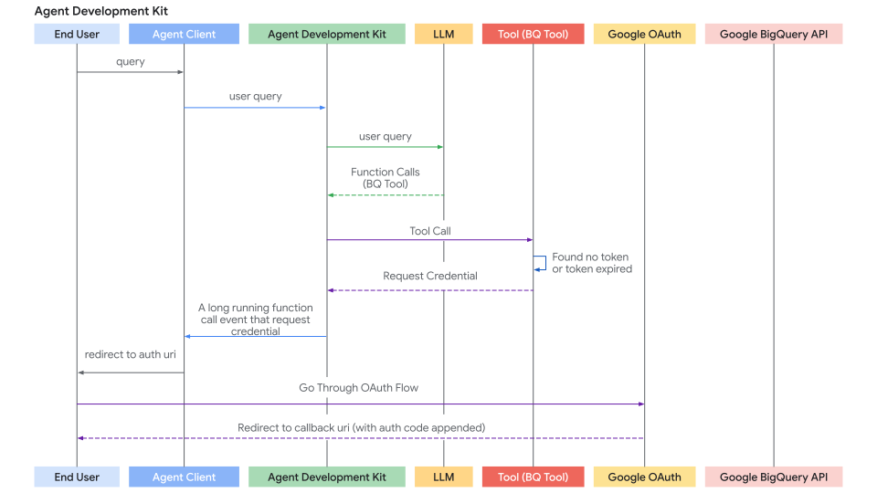
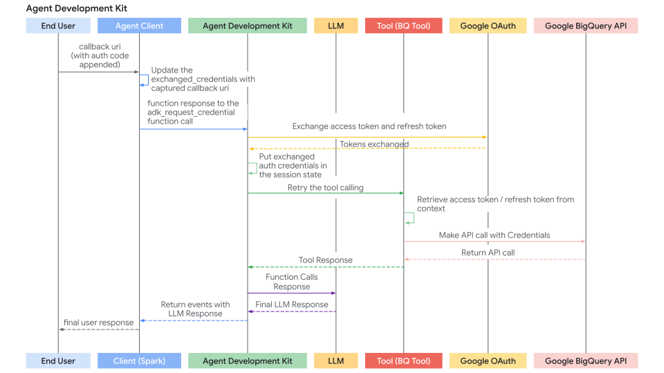

# ツールによる認証

<div class="language-support-tag">
  <span class="lst-supported">ADKでサポート</span><span class="lst-python">Python v0.1.0</span>
</div>

多くのツールは、保護されたリソース（Googleカレンダーのユーザーデータ、Salesforceのレコードなど）にアクセスする必要があり、認証が必要です。ADKは、さまざまな認証方法を安全に処理するためのシステムを提供します。

関連する主要なコンポーネントは次のとおりです。

1. **`AuthScheme`**: APIが認証資格情報をどのように期待するかを定義します（例：ヘッダーのAPIキー、OAuth 2.0ベアラートークン）。ADKは、OpenAPI 3.0と同じタイプの認証スキームをサポートしています。各タイプの資格情報の詳細については、[OpenAPIドキュメント：認証](https://swagger.io/docs/specification/v3_0/authentication/)を参照してください。ADKは、`APIKey`、`HTTPBearer`、`OAuth2`、`OpenIdConnectWithConfig`などの特定のクラスを使用します。
2. **`AuthCredential`**: 認証プロセスを*開始*するために必要な*初期*情報を保持します（例：アプリケーションのOAuthクライアントID/シークレット、APIキーの値）。資格情報のタイプを指定する`auth_type`（`API_KEY`、`OAUTH2`、`SERVICE_ACCOUNT`など）が含まれます。

一般的なフローでは、ツールを構成するときにこれらの詳細を提供します。その後、ADKは、ツールがAPIを呼び出す前に、初期資格情報を利用可能な資格情報（アクセストークンなど）に自動的に交換しようとします。ユーザーの操作が必要なフロー（OAuth同意など）の場合、エージェントクライアントアプリケーションを含む特定の対話型プロセスがトリガーされます。

## サポートされている初期資格情報タイプ

* **API_KEY:** 単純なキー/値認証用。通常、交換は必要ありません。
* **HTTP:** 基本認証（交換は推奨/サポートされていません）またはすでに取得済みのベアラートークンを表すことができます。ベアラートークンの場合、交換は必要ありません。
* **OAUTH2:** 標準のOAuth 2.0フロー用。構成（クライアントID、シークレット、スコープ）が必要であり、多くの場合、ユーザーの同意を得るための対話型フローをトリガーします。
* **OPEN_ID_CONNECT:** OpenID Connectベースの認証用。OAuth2と同様に、多くの場合、構成とユーザーの操作が必要です。
* **SERVICE_ACCOUNT:** Google Cloudサービスアカウントの資格情報（JSONキーまたはアプリケーションのデフォルト資格情報）用。通常、ベアラートークンと交換されます。

## ツールでの認証の構成

ツールを定義するときに認証を設定します。

* **RestApiTool / OpenAPIToolset**: 初期化中に`auth_scheme`と`auth_credential`を渡します

* **GoogleApiToolSetツール**: ADKには、Googleカレンダー、BigQueryなどの組み込みのファーストパーティツールがあります。ツールセットの特定のメソッドを使用します。

* **APIHubToolset / ApplicationIntegrationToolset**: APIハブで管理されているAPI / アプリケーション統合によって提供されるAPIが認証を必要とする場合は、初期化中に`auth_scheme`と`auth_credential`を渡します。

!!! tip "警告"
    アクセストークンや特にリフレッシュトークンなどの機密性の高い資格情報をセッション状態に直接保存すると、セッションストレージバックエンド（`SessionService`）とアプリケーション全体のセキュリティ体制によっては、セキュリティリスクが生じる可能性があります。

    *   **`InMemorySessionService`:** テストや開発には適していますが、プロセスが終了するとデータは失われます。一時的なものであるため、リスクは低くなります。
    *   **データベース/永続ストレージ:** 堅牢な暗号化ライブラリ（`cryptography`など）を使用してデータベースに保存する前にトークンデータを**暗号化**し、暗号化キーを安全に管理する（キー管理サービスを使用するなど）ことを**強く検討**してください。
    *   **安全なシークレットストア:** 本番環境では、専用のシークレットマネージャー（Google Cloud Secret ManagerやHashiCorp Vaultなど）に機密性の高い資格情報を保存することが**最も推奨されるアプローチ**です。ツールは、セッション状態に短期間のアクセストークンまたは安全な参照（リフレッシュトークン自体ではない）のみを保存し、必要に応じて安全なストアから必要なシークレットを取得する可能性があります。

---

## ジャーニー1：認証済みツールを使用したエージェントアプリケーションの構築

このセクションでは、エージェントアプリケーション内で認証が必要な既存のツール（`RestApiTool/ OpenAPIToolset`、`APIHubToolset`、`GoogleApiToolSet`のツールなど）を使用することに焦点を当てます。主な責任は、ツールを構成し、対話型認証フローのクライアント側部分（ツールで必要な場合）を処理することです。

### 1. 認証によるツールの構成

認証済みツールをエージェントに追加する場合は、必要な`AuthScheme`とアプリケーションの初期`AuthCredential`を提供する必要があります。

**A. OpenAPIベースのツールセットの使用（`OpenAPIToolset`、`APIHubToolset`など）**

ツールセットの初期化中にスキームと資格情報を渡します。ツールセットは、生成されたすべてのツールにそれらを適用します。ADKで認証付きのツールを作成する方法はいくつかあります。

=== "APIキー"

      APIキーが必要なツールを作成します。

      ```py
      from google.adk.tools.openapi_tool.auth.auth_helpers import token_to_scheme_credential
      from google.adk.tools.openapi_tool.openapi_spec_parser.openapi_toolset import OpenAPIToolset

      auth_scheme, auth_credential = token_to_scheme_credential(
          "apikey", "query", "apikey", "YOUR_API_KEY_STRING"
      )
      sample_api_toolset = OpenAPIToolset(
          spec_str="...",  # OpenAPI仕様文字列でこれを埋めます
          spec_str_type="yaml",
          auth_scheme=auth_scheme,
          auth_credential=auth_credential,
      )
      ```

=== "OAuth2"

      OAuth2が必要なツールを作成します。

      ```py
      from google.adk.tools.openapi_tool.openapi_spec_parser.openapi_toolset import OpenAPIToolset
      from fastapi.openapi.models import OAuth2
      from fastapi.openapi.models import OAuthFlowAuthorizationCode
      from fastapi.openapi.models import OAuthFlows
      from google.adk.auth import AuthCredential
      from google.adk.auth import AuthCredentialTypes
      from google.adk.auth import OAuth2Auth

      auth_scheme = OAuth2(
          flows=OAuthFlows(
              authorizationCode=OAuthFlowAuthorizationCode(
                  authorizationUrl="https://accounts.google.com/o/oauth2/auth",
                  tokenUrl="https://oauth2.googleapis.com/token",
                  scopes={
                      "https://www.googleapis.com/auth/calendar": "カレンダースコープ"
                  },
              )
          )
      )
      auth_credential = AuthCredential(
          auth_type=AuthCredentialTypes.OAUTH2,
          oauth2=OAuth2Auth(
              client_id=YOUR_OAUTH_CLIENT_ID, 
              client_secret=YOUR_OAUTH_CLIENT_SECRET
          ),
      )

      calendar_api_toolset = OpenAPIToolset(
          spec_str=google_calendar_openapi_spec_str, # openapi仕様でこれを埋めます
          spec_str_type='yaml',
          auth_scheme=auth_scheme,
          auth_credential=auth_credential,
      )
      ```

=== "サービスアカウント"

      サービスアカウントが必要なツールを作成します。

      ```py
      from google.adk.tools.openapi_tool.auth.auth_helpers import service_account_dict_to_scheme_credential
      from google.adk.tools.openapi_tool.openapi_spec_parser.openapi_toolset import OpenAPIToolset

      service_account_cred = json.loads(service_account_json_str)
      auth_scheme, auth_credential = service_account_dict_to_scheme_credential(
          config=service_account_cred,
          scopes=["https://www.googleapis.com/auth/cloud-platform"],
      )
      sample_toolset = OpenAPIToolset(
          spec_str=sa_openapi_spec_str, # openapi仕様でこれを埋めます
          spec_str_type='json',
          auth_scheme=auth_scheme,
          auth_credential=auth_credential,
      )
      ```

=== "OpenID connect"

      OpenID connectが必要なツールを作成します。

      ```py
      from google.adk.auth.auth_schemes import OpenIdConnectWithConfig
      from google.adk.auth.auth_credential import AuthCredential, AuthCredentialTypes, OAuth2Auth
      from google.adk.tools.openapi_tool.openapi_spec_parser.openapi_toolset import OpenAPIToolset

      auth_scheme = OpenIdConnectWithConfig(
          authorization_endpoint=OAUTH2_AUTH_ENDPOINT_URL,
          token_endpoint=OAUTH2_TOKEN_ENDPOINT_URL,
          scopes=['openid', 'YOUR_OAUTH_SCOPES"]
      )
      auth_credential = AuthCredential(
          auth_type=AuthCredentialTypes.OPEN_ID_CONNECT,
          oauth2=OAuth2Auth(
              client_id="...",
              client_secret="...",
          )
      )

      userinfo_toolset = OpenAPIToolset(
          spec_str=content, # 実際の仕様で埋めます
          spec_str_type='yaml',
          auth_scheme=auth_scheme,
          auth_credential=auth_credential,
      )
      ```

**B. Google APIツールセットの使用（例：`calendar_tool_set`）**

これらのツールセットには、多くの場合、専用の構成メソッドがあります。

ヒント：Google OAuthクライアントIDとシークレットを作成する方法については、次のガイドを参照してください：[Google APIクライアントIDの取得](https://developers.google.com/identity/gsi/web/guides/get-google-api-clientid#get_your_google_api_clientid)

```py
# 例：Googleカレンダーツールの構成
from google.adk.tools.google_api_tool import calendar_tool_set

client_id = "YOUR_GOOGLE_OAUTH_CLIENT_ID.apps.googleusercontent.com"
client_secret = "YOUR_GOOGLE_OAUTH_CLIENT_SECRET"

# このツールセットタイプの特定の構成メソッドを使用します
calendar_tool_set.configure_auth(
    client_id=oauth_client_id, client_secret=oauth_client_secret
)

# agent = LlmAgent(..., tools=calendar_tool_set.get_tool('calendar_tool_set'))
```

認証要求フロー（ツールが認証資格情報を要求する場合）のシーケンス図は次のようになります。

 


### 2. 対話型OAuth/OIDCフローの処理（クライアント側）

ツールがユーザーのログイン/同意（通常はOAuth 2.0またはOIDC）を必要とする場合、ADKフレームワークは実行を一時停止し、**エージェントクライアント**アプリケーションに通知します。2つのケースがあります。

* **エージェントクライアント**アプリケーションは、同じプロセスで`runner.run_async`を介してエージェントを直接実行します。例：UIバックエンド、CLIアプリ、Sparkジョブなど。
* **エージェントクライアント**アプリケーションは、`/run`または`/run_sse`エンドポイントを介してADKのfastapiサーバーと対話します。ADKのfastapiサーバーは、**エージェントクライアント**アプリケーションと同じサーバーまたは異なるサーバーに設定できます。

2番目のケースは、`/run`または`/run_sse`エンドポイントも`runner.run_async`を呼び出すため、最初のケースの特殊なケースです。唯一の違いは次のとおりです。

* エージェントを実行するためにPython関数を呼び出すか（最初のケース）、エージェントを実行するためにサービスエンドポイントを呼び出すか（2番目のケース）。
* 結果イベントがメモリ内オブジェクト（最初のケース）であるか、http応答のシリアル化されたjson文字列（2番目のケース）であるか。

以下のセクションでは、最初のケースに焦点を当て、2番目のケースに非常に簡単にマッピングできるはずです。必要に応じて、2番目のケースを処理するためのいくつかの違いについても説明します。

クライアントアプリケーションのステップバイステップのプロセスは次のとおりです。

**ステップ1：エージェントの実行と認証要求の検出**

* `runner.run_async`を使用してエージェントの対話を開始します。
* 生成されたイベントを反復処理します。
* 関数呼び出しに`adk_request_credential`という特別な名前を持つ特定の関数呼び出しイベントを探します。このイベントは、ユーザーの操作が必要であることを示します。ヘルパー関数を使用して、このイベントを識別し、必要な情報を抽出できます。（2番目のケースでは、ロジックは似ています。http応答からイベントを逆シリアル化します。）

```py

# runner = Runner(...)
# session = await session_service.create_session(...)
# content = types.Content(...) # ユーザーの最初のクエリ

print("\nエージェントを実行しています...")
events_async = runner.run_async(
    session_id=session.id, user_id='user', new_message=content
)

auth_request_function_call_id, auth_config = None, None

async for event in events_async:
    # ヘルパーを使用して特定の認証要求イベントを確認します
    if (auth_request_function_call := get_auth_request_function_call(event)):
        print("--> エージェントによる認証が必要です。")
        # 後で応答するために必要なIDを保存します
        if not (auth_request_function_call_id := auth_request_function_call.id):
            raise ValueError(f'関数呼び出しから関数呼び出しIDを取得できません：{auth_request_function_call}')
        # auth_uriなどを含むAuthConfigを取得します
        auth_config = get_auth_config(auth_request_function_call)
        break # 今はイベントの処理を停止し、ユーザーの操作が必要です

if not auth_request_function_call_id:
    print("\n認証は不要か、エージェントが終了しました。")
    # return # または受信した場合は最終応答を処理します

```

*ヘルパー関数`helpers.py`：*

```py
from google.adk.events import Event
from google.adk.auth import AuthConfig # 必要な型をインポート
from google.genai import types

def get_auth_request_function_call(event: Event) -> types.FunctionCall:
    # イベントから特別な認証要求関数呼び出しを取得します
    if not event.content or not event.content.parts:
        return None
    for part in event.content.parts:
        if (
            part 
            and part.function_call 
            and part.function_call.name == 'adk_request_credential'
            and event.long_running_tool_ids 
            and part.function_call.id in event.long_running_tool_ids
        ):

            return part.function_call

def get_auth_config(auth_request_function_call: types.FunctionCall) -> AuthConfig:
    # 認証要求関数呼び出しの引数からAuthConfigオブジェクトを抽出します
    if not auth_request_function_call.args or not (auth_config := auth_request_function_call.args.get('authConfig')):
        raise ValueError(f'関数呼び出しから認証構成を取得できません：{auth_request_function_call}')
    if isinstance(auth_config, dict):
        auth_config = AuthConfig.model_validate(auth_config)
    elif not isinstance(auth_config, AuthConfig):
        raise ValueError(f'認証構成{auth_config}はAuthConfigのインスタンスではありません。')
    return auth_config
```

**ステップ2：承認のためにユーザーをリダイレクトする**

* 前のステップで抽出した`auth_config`から承認URL（`auth_uri`）を取得します。
* **重要なことに、アプリケーションの**`redirect_uri`をこの`auth_uri`にクエリパラメータとして追加します。この`redirect_uri`は、OAuthプロバイダー（例：[Google Cloud Console](https://developers.google.com/identity/protocols/oauth2/web-server#creatingcred)、[Okta管理コンソール](https://developer.okta.com/docs/guides/sign-into-web-app-redirect/spring-boot/main/#create-an-app-integration-in-the-admin-console)）に事前に登録されている必要があります。
* ユーザーをこの完全なURLに誘導します（例：ブラウザで開きます）。

```py
# （認証が必要と検出された後も続行）

if auth_request_function_call_id and auth_config:
    # AuthConfigからベース承認URLを取得します
    base_auth_uri = auth_config.exchanged_auth_credential.oauth2.auth_uri

    if base_auth_uri:
        redirect_uri = 'http://localhost:8000/callback' # OAuthクライアントアプリの構成と一致する必要があります
        # redirect_uriを追加します（本番環境ではurlencodeを使用します）
        auth_request_uri = base_auth_uri + f'&redirect_uri={redirect_uri}'
        # これで、エンドユーザーをこのauth_request_uriにリダイレクトするか、ブラウザでこのauth_request_uriを開くように依頼する必要があります
        # このauth_request_uriは、対応する認証プロバイダーによって提供され、エンドユーザーはログインしてアプリケーションがデータにアクセスすることを承認する必要があります
        # その後、認証プロバイダーはエンドユーザーを提供したredirect_uriにリダイレクトします
        # 次のステップ：ユーザー（またはWebサーバーハンドラー）からこのコールバックURLを取得します
    else:
         print("エラー：auth_configで認証URIが見つかりません。")
         # エラーを処理します

```

**ステップ3. リダイレクトコールバックの処理（クライアント）：**

* アプリケーションには、ユーザーがプロバイダーでアプリケーションを承認した後にユーザーを受信するためのメカニズム（`redirect_uri`のWebサーバールートなど）が必要です。
* プロバイダーはユーザーを`redirect_uri`にリダイレクトし、`authorization_code`（および場合によっては`state`、`scope`）をURLにクエリパラメーターとして追加します。
* この受信リクエストから**完全なコールバックURL**をキャプチャします。
* （このステップは、メインのエージェント実行ループの外、Webサーバーまたは同等のコールバックハンドラーで発生します。）

**ステップ4. 認証結果をADKに送り返す（クライアント）：**

* 完全なコールバックURL（認証コードを含む）を取得したら、クライアントステップ1で保存した`auth_request_function_call_id`と`auth_config`オブジェクトを取得します。
* キャプチャしたコールバックURLを`exchanged_auth_credential.oauth2.auth_response_uri`フィールドに設定します。また、`exchanged_auth_credential.oauth2.redirect_uri`に使用したリダイレクトURIが含まれていることを確認します。
* `types.FunctionResponse`を含む`types.Part`を含む`types.Content`オブジェクトを作成します。
      * `name`を`"adk_request_credential"`に設定します。（注：これはADKが認証を続行するための特別な名前です。他の名前は使用しないでください。）
      * `id`を保存した`auth_request_function_call_id`に設定します。
      * `response`を*シリアル化された*（例：`.model_dump()`）更新された`AuthConfig`オブジェクトに設定します。
* この`FunctionResponse`コンテンツを`new_message`として渡して、同じセッションに対して`runner.run_async`を**再度**呼び出します。

```py
# （ユーザー操作後も続行）

    # コールバックURLの取得をシミュレートします（例：ユーザーの貼り付けまたはWebハンドラーから）
    auth_response_uri = await get_user_input(
        f'完全なコールバックURLをここに貼り付けてください：\n> '
    )
    auth_response_uri = auth_response_uri.strip() # 入力をクリーンアップします

    if not auth_response_uri:
        print("コールバックURLが提供されていません。中止します。")
        return

    # 受信したAuthConfigをコールバックの詳細で更新します
    auth_config.exchanged_auth_credential.oauth2.auth_response_uri = auth_response_uri
    # トークン交換で必要になる可能性があるため、使用したredirect_uriも含めます
    auth_config.exchanged_auth_credential.oauth2.redirect_uri = redirect_uri

    # FunctionResponse Contentオブジェクトを構築します
    auth_content = types.Content(
        role='user', # FunctionResponseを送信する場合、ロールは「user」にすることができます
        parts=[
            types.Part(
                function_response=types.FunctionResponse(
                    id=auth_request_function_call_id,       # 元のリクエストへのリンク
                    name='adk_request_credential', # 特別なフレームワーク関数名
                    response=auth_config.model_dump() # *更新された* AuthConfigを返信します
                )
            )
        ],
    )

    # --- 実行を再開 ---
    print("\n認証の詳細をエージェントに再送信しています...")
    events_async_after_auth = runner.run_async(
        session_id=session.id,
        user_id='user',
        new_message=auth_content, # FunctionResponseを返信します
    )

    # --- 最終的なエージェントの出力を処理 ---
    print("\n--- 認証後のエージェントの応答 ---")
    async for event in events_async_after_auth:
        # 通常どおりイベントを処理し、ツール呼び出しが成功することを期待します
        print(event) # 検査のために完全なイベントを出力します

```

!!! note "注：再開機能付きの認証応答"

    ADKエージェントワークフローが
    [再開](/adk-docs/ja/runtime/resume/)機能で構成されている場合は、認証
    応答とともに呼び出しID（`invocation_id`）パラメーターも指定する必要があります。
    指定する呼び出しIDは、認証要求を生成した呼び出しと同じでなければなりません。
    そうしないと、システムは認証応答で新しい呼び出しを開始します。
    エージェントが再開機能を使用する場合は、認証応答に含めることができるように、
    認証要求とともに呼び出しIDをパラメーターとして含めることを検討してください。
    再開機能の使用方法の詳細については、
    [停止したエージェントの再開](/adk-docs/ja/runtime/resume/)を参照してください。

**ステップ5：ADKがトークン交換とツール再試行を処理し、ツール結果を取得する**

* ADKは`adk_request_credential`の`FunctionResponse`を受信します。
* 更新された`AuthConfig`の情報（コードを含むコールバックURLを含む）を使用して、プロバイダーのトークンエンドポイントとOAuth **トークン交換**を実行し、アクセストークン（および場合によってはリフレッシュトークン）を取得します。
* ADKは、セッション状態に設定することで、これらのトークンを内部的に利用可能にします。
* ADKは、元のツール呼び出し（最初に認証の欠落により失敗した呼び出し）を**自動的に再試行**します。
* 今回、ツールは有効なトークン（`tool_context.get_auth_response()`を介して）を見つけ、認証されたAPI呼び出しを正常に実行します。
* エージェントはツールから実際の結果を受信し、ユーザーへの最終的な応答を生成します。

---

認証応答フロー（エージェントクライアントが認証応答を返信し、ADKがツール呼び出しを再試行する場合）のシーケンス図は次のようになります。



## ジャーニー2：認証が必要なカスタムツール（`FunctionTool`）の構築

このセクションでは、新しいADKツールを作成する際に、カスタムPython関数*内*で認証ロジックを実装することに焦点を当てます。例として`FunctionTool`を実装します。

### 前提条件

関数シグネチャには[`tool_context: ToolContext`](../tools-custom/index.md#tool-context)が*必須*です。ADKはこのオブジェクトを自動的に挿入し、状態および認証メカニズムへのアクセスを提供します。

```py
from google.adk.tools import FunctionTool, ToolContext
from typing import Dict

def my_authenticated_tool_function(param1: str, ..., tool_context: ToolContext) -> dict:
    # ... ロジック ...
    pass

my_tool = FunctionTool(func=my_authenticated_tool_function)

```

### ツール関数内の認証ロジック

関数内で次の手順を実装します。

**ステップ1：キャッシュされた有効な資格情報を確認する**

ツール関数内で、まずこのセッションの以前の実行から有効な資格情報（アクセストークン/リフレッシュトークンなど）がすでに保存されているかどうかを確認します。現在のセッションの資格情報は`tool_context.invocation_context.session.state`（状態の辞書）に保存する必要があります。`tool_context.invocation_context.session.state.get(credential_name, None)`をチェックして、既存の資格情報の存在を確認します。

```py
from google.oauth2.credentials import Credentials
from google.auth.transport.requests import Request

# ツール関数内
TOKEN_CACHE_KEY = "my_tool_tokens" # 一意のキーを選択
SCOPES = ["scope1", "scope2"] # 必要なスコープを定義

creds = None
cached_token_info = tool_context.state.get(TOKEN_CACHE_KEY)
if cached_token_info:
    try:
        creds = Credentials.from_authorized_user_info(cached_token_info, SCOPES)
        if not creds.valid and creds.expired and creds.refresh_token:
            creds.refresh(Request())
            tool_context.state[TOKEN_CACHE_KEY] = json.loads(creds.to_json()) # キャッシュを更新
        elif not creds.valid:
            creds = None # 無効、再認証が必要
            tool_context.state[TOKEN_CACHE_KEY] = None
    except Exception as e:
        print(f"キャッシュされた資格情報の読み込み/更新エラー：{e}")
        creds = None
        tool_context.state[TOKEN_CACHE_KEY] = None

if creds and creds.valid:
    # ステップ5にスキップ：認証済みAPI呼び出しを行う
    pass
else:
    # ステップ2に進む...
    pass

```

**ステップ2：クライアントからの認証応答を確認する**

* ステップ1で有効な資格情報が得られなかった場合は、クライアントが`exchanged_credential = tool_context.get_auth_response()`を呼び出して対話型フローを完了したかどうかを確認します。
* これにより、クライアントから返された更新済みの`exchanged_credential`オブジェクト（`auth_response_uri`にコールバックURLが含まれています）が返されます。

```py
# ツールで構成されたauth_schemeとauth_credentialを使用します。
# exchanged_credential: AuthCredential | None

exchanged_credential = tool_context.get_auth_response(AuthConfig(
  auth_scheme=auth_scheme,
  raw_auth_credential=auth_credential,
))
# exchanged_credentialがNoneでない場合、認証応答からすでに交換された資格情報があります。
if exchanged_credential:
   # ADKはすでにアクセストークンを交換しています
        access_token = exchanged_credential.oauth2.access_token
        refresh_token = exchanged_credential.oauth2.refresh_token
        creds = Credentials(
            token=access_token,
            refresh_token=refresh_token,
            token_uri=auth_scheme.flows.authorizationCode.tokenUrl,
            client_id=auth_credential.oauth2.client_id,
            client_secret=auth_credential.oauth2.client_secret,
            scopes=list(auth_scheme.flows.authorizationCode.scopes.keys()),
        )
    # セッション状態にトークンをキャッシュし、APIを呼び出してステップ5にスキップします
```

**ステップ3：認証要求を開始する**

有効な資格情報（ステップ1）と認証応答（ステップ2）が見つからない場合、ツールはOAuthフローを開始する必要があります。AuthSchemeと初期AuthCredentialを定義し、`tool_context.request_credential()`を呼び出します。認証が必要であることを示す応答を返します。

```py
# ツールで構成されたauth_schemeとauth_credentialを使用します。

  tool_context.request_credential(AuthConfig(
    auth_scheme=auth_scheme,
    raw_auth_credential=auth_credential,
  ))
  return {'pending': true, 'message': 'ユーザー認証を待っています。'}

# request_credentialを設定すると、ADKは保留中の認証イベントを検出します。実行を一時停止し、エンドユーザーにログインを求めます。
```

**ステップ4：認証コードをトークンに交換する**

ADKは自動的にoauth認証URLを生成し、エージェントクライアントアプリケーションに提示します。エージェントクライアントアプリケーションは、ジャーニー1で説明したのと同じ方法でユーザーを認証URL（`redirect_uri`が追加されています）にリダイレクトする必要があります。ユーザーが認証URLに従ってログインフローを完了し、ADKがエージェントクライアントアプリケーションから認証コールバックURLを抽出すると、自動的に認証コードを解析し、認証トークンを生成します。次のツール呼び出しで、ステップ2の`tool_context.get_auth_response`には、後続のAPI呼び出しで使用する有効な資格情報が含まれます。

**ステップ5：取得した資格情報をキャッシュする**

ADKからトークンを正常に取得した後（ステップ2）、またはトークンがまだ有効な場合（ステップ1）、**すぐに**新しい`Credentials`オブジェクトを`tool_context.state`（シリアル化済み、例：JSON）にキャッシュキーを使用して**保存**します。

```py
# ツール関数内、'creds'を取得した後（更新または新規交換）
# 新規/更新されたトークンをキャッシュします
tool_context.state[TOKEN_CACHE_KEY] = json.loads(creds.to_json())
print(f"DEBUG：キーの下にキャッシュ/更新されたトークン：{TOKEN_CACHE_KEY}")
# ステップ6に進みます（API呼び出しを行う）

```

**ステップ6：認証済みAPI呼び出しを行う**

* 有効な`Credentials`オブジェクト（ステップ1またはステップ4の`creds`）を取得したら、それを使用して、適切なクライアントライブラリ（`googleapiclient`、`requests`など）を使用して保護されたAPIへの実際の呼び出しを行います。`credentials=creds`引数を渡します。
* 特に`HttpError` 401/403のエラー処理を含めます。これは、呼び出しの間にトークンが期限切れになったか、取り消されたことを意味する可能性があります。このようなエラーが発生した場合は、キャッシュされたトークン（`tool_context.state.pop(...)`）をクリアし、再認証を強制するために`auth_required`ステータスを再度返すことを検討してください。

```py
# ツール関数内、有効な'creds'オブジェクトを使用
# 続行する前にcredsが有効であることを確認します
if not creds or not creds.valid:
   return {"status": "error", "error_message": "有効な資格情報なしでは続行できません。"}

try:
   service = build("calendar", "v3", credentials=creds) # 例
   api_result = service.events().list(...).execute()
   # ステップ7に進みます
except Exception as e:
   # APIエラーを処理します（例：401/403を確認し、キャッシュをクリアして認証を再要求する可能性があります）
   print(f"エラー：API呼び出しに失敗しました：{e}")
   return {"status": "error", "error_message": f"API呼び出しに失敗しました：{e}"}
```

**ステップ7：ツール結果を返す**

* API呼び出しが成功したら、結果をLLMに役立つ辞書形式に処理します。
* **重要なことに、** データとともに**を含めます。**

```py
# ツール関数内、API呼び出し成功後
    processed_result = [...] # LLMのapi_resultを処理します
    return {"status": "success", "data": processed_result}

```

??? "完全なコード"

    === "ツールとエージェント"

         ```py title="tools_and_agent.py"
         --8<-- "examples/python/snippets/tools/auth/tools_and_agent.py"
         ```
    === "エージェントCLI"

         ```py title="agent_cli.py"
         --8<-- "examples/python/snippets/tools/auth/agent_cli.py"
         ```
    === "ヘルパー"

         ```py title="helpers.py"
         --8<-- "examples/python/snippets/tools/auth/helpers.py"
         ```
    === "仕様"

         ```yaml
         openapi: 3.0.1
         info:
         title: Oktaユーザー情報API
         version: 1.0.0
         description: |-
            有効なOkta OIDCアクセストークンに基づいてユーザープロファイル情報を取得するAPI。
            認証は、Oktaを使用したOpenID Connectを介して処理されます。
         contact:
            name: APIサポート
            email: support@example.com # 利用可能な場合は実際の連絡先に置き換えます
         servers:
         - url: <サーバー名で置換>
            description: 本番環境
         paths:
         /okta-jwt-user-api:
            get:
               summary: 認証済みユーザー情報を取得
               description: |-
               ユーザーのプロファイル詳細を取得します
               operationId: getUserInfo
               tags:
               - ユーザープロファイル
               security:
               - okta_oidc:
                     - openid
                     - email
                     - profile
               responses:
               '200':
                  description: ユーザー情報を正常に取得しました。
                  content:
                     application/json:
                     schema:
                        type: object
                        properties:
                           sub:
                           type: string
                           description: ユーザーのサブジェクト識別子。
                           example: "abcdefg"
                           name:
                           type: string
                           description: ユーザーのフルネーム。
                           example: "例 姓"
                           locale:
                           type: string
                           description: ユーザーのロケール（例：en-USまたはen_US）。
                           example: "en_US"
                           email:
                           type: string
                           format: email
                           description: ユーザーのプライマリメールアドレス。
                           example: "username@example.com"
                           preferred_username:
                           type: string
                           description: ユーザーの優先ユーザー名（多くの場合メールアドレス）。
                           example: "username@example.com"
                           given_name:
                           type: string
                           description: ユーザーの名（名）。
                           example: "例"
                           family_name:
                           type: string
                           description: ユーザーの姓（姓）。
                           example: "姓"
                           zoneinfo:
                           type: string
                           description: ユーザーのタイムゾーン（例：America/Los_Angeles）。
                           example: "America/Los_Angeles"
                           updated_at:
                           type: integer
                           format: int64 # Unixタイムスタンプにint64を使用
                           description: ユーザーのプロファイルが最後に更新されたときのタイムスタンプ（Unixエポック時間）。
                           example: 1743617719
                           email_verified:
                           type: boolean
                           description: ユーザーのメールアドレスが確認済みかどうかを示します。
                           example: true
                        required:
                           - sub
                           - name
                           - locale
                           - email
                           - preferred_username
                           - given_name
                           - family_name
                           - zoneinfo
                           - updated_at
                           - email_verified
               '401':
                  description: 権限がありません。提供されたベアラートークンがない、無効、または期限切れです。
                  content:
                     application/json:
                     schema:
                        $ref: '#/components/schemas/Error'
               '403':
                  description: 禁止されています。提供されたトークンには、このリソースにアクセスするために必要なスコープまたは権限がありません。
                  content:
                     application/json:
                     schema:
                        $ref: '#/components/schemas/Error'
 components:
 securitySchemes:
    okta_oidc:
       type: openIdConnect
       description: OpenID Connectを使用したOktaによる認証。ベアラーアクセストークンが必要です。
       openIdConnectUrl: https://your-endpoint.okta.com/.well-known/openid-configuration
 schemas:
    Error:
       type: object
       properties:
       code:
          type: string
          description: エラーコード。
       message:
          type: string
          description: 人間が読めるエラーメッセージ。
       required:
          - code
          - message
         ```
