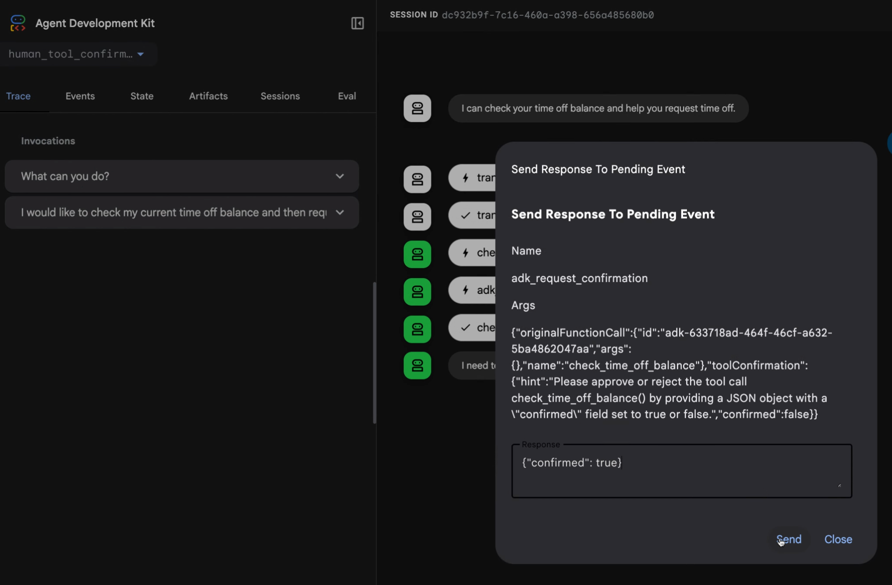

# ADK ツールの操作確認の取得

<div class="language-support-tag">
  <span class="lst-supported">ADKでサポート</span><span class="lst-python">Python v1.14.0</span><span class="lst-typescript">TypeScript v0.2.0</span><span class="lst-go">Go v0.3.0</span><span class="lst-preview">プレビュー</span>
</div>

一部のエージェント ワークフローでは、意思決定、検証、セキュリティ、または一般的な監視のために確認が必要です。このような場合、ワークフローを続行する前に人間または監視システムから応答を取得する必要があります。Agent Development Kit (ADK) の*ツール確認 (Tool Confirmation)* 機能を使用すると、ADK ツールはその実行を一時停止し、ユーザーまたは他のシステムと対話して確認を取得したり、構造化データを収集したりしてから続行できます。ADK ツールでツール確認を次の方法で使用できます。

-   **[ブール値の確認 (Boolean Confirmation)](#boolean-confirmation):** 確認フラグまたはプロバイダーを使用してツールを構成できます。このオプションは、はい/いいえの確認応答のためにツールを一時停止します。
-   **[高度な確認 (Advanced Confirmation)](#advanced-confirmation):** 構造化データの応答が必要なシナリオでは、確認を説明するテキスト プロンプトと期待される応答を使用してツールを構成できます。

!!! example "プレビュー"
    ツール確認機能はプレビュー段階であり、いくつかの[既知の制限事項](#known-limitations)があります。
    皆様からの[フィードバック](https://github.com/google/adk-python/issues/new?template=feature_request.md&labels=tool%20confirmation)をお待ちしております。

リクエストがユーザーに伝達される方法を構成でき、システムは ADK サーバーの REST API を介して送信された[リモート応答](#remote-response)を使用することもできます。ADK Web ユーザー インターフェースで確認機能を使用すると、図 1 に示すように、エージェント ワークフローに入力を求めるダイアログ ボックスが表示されます。



**図 1.** 高度なツール応答実装を使用した確認応答要求ダイアログ ボックスの例。

次のセクションでは、確認シナリオでこの機能を使用する方法について説明します。完全なコード サンプルについては、[human_tool_confirmation](https://github.com/google/adk-python/blob/fc90ce968f114f84b14829f8117797a4c256d710/contributing/samples/human_tool_confirmation/agent.py) の例を参照してください。エージェント ワークフローに人間の入力を組み込むその他の方法については、[Human-in-the-loop](../workflows/patterns.md#human-in-the-loop) エージェント パターンを参照してください。

## ブール値の確認 (Boolean confirmation) {#boolean-confirmation}

ツールでユーザーからの単純な `yes` または `no` のみが必要な場合は、確認ステップを追加できます。Python、Go、および Java では、ツールを `FunctionTool` クラスでラップし、`require_confirmation` パラメータ (または同等のパラメータ) を `True` に設定することでこれを有効にできます。TypeScript では、`ToolContext` を使用して `execute` 関数内でこのロジックを手動で実装します。

次の例は、ブール値の確認を有効にする方法を示しています。

=== "Python"

    ```python
    root_agent = Agent(
        # ...
        tools = [
            # ツール呼び出しにユーザーの確認を要求するには、require_confirmation を True に設定します。
            FunctionTool(reimburse, require_confirmation=True),
        ],
        # ...
    )
    ```

=== "TypeScript"

    !!! note
        現在、ADK for TypeScript では、ツールの `execute` 関数内で確認ロジックを手動で実装する必要があります。

    ```typescript
    --8<-- "examples/typescript/snippets/tools/confirmation/boolean_confirmation.ts:boolean_confirmation"
    ```

=== "Go"

    ```go
    reimburseTool, _ := functiontool.New(functiontool.Config{
        Name:        "reimburse",
        Description: "Reimburse an amount",
        RequireConfirmation: true,
    }, func(ctx tool.Context, args ReimburseArgs) (ReimburseResult, error) {
        return ReimburseResult{Status: "ok"}, nil
    })

    rootAgent, _ := llmagent.New(llmagent.Config{
        // ...
        Tools: []tool.Tool{reimburseTool},
    })
    ```

=== "Java"

    ```java
    LlmAgent rootAgent = LlmAgent.builder()
        // ...
        .tools(
            FunctionTool.create(myClassInstance, "reimburse", true)
        )
        // ...
        .build();
    ```

### 確認要件関数 (Require confirmation function)

ツールの入力に基づいてブール値の応答を返す関数を使用して、確認要件の動作を動的に変更できます。TypeScript では、`execute` 関数に条件付きロジックを追加することでこれを処理します。

=== "Python"

    ```python
    async def confirmation_threshold(
        amount: int, tool_context: ToolContext
    ) -> bool:
      """金額が 1000 より大きい場合に True を返します。"""
      return amount > 1000

    root_agent = Agent(
        # ...
        tools = [
            FunctionTool(reimburse, require_confirmation=confirmation_threshold),
        ],
        # ...
    )
    ```

=== "TypeScript"

    ```typescript
    --8<-- "examples/typescript/snippets/tools/confirmation/boolean_confirmation.ts:dynamic_confirmation"
    ```

=== "Go"

    ```go
    reimburseTool, _ := functiontool.New(functiontool.Config{
        Name:        "reimburse",
        Description: "Reimburse an amount",
        RequireConfirmationProvider: func(args ReimburseArgs) bool {
            return args.Amount > 1000
        },
    }, func(ctx tool.Context, args ReimburseArgs) (ReimburseResult, error) {
        return ReimburseResult{Status: "ok"}, nil
    })
    ```

=== "Java"

    ```java
    public Map<String, Object> reimburse(
        @Schema(name="amount") int amount, ToolContext toolContext) {

      if (amount > 1000) {
        Optional<ToolConfirmation> toolConfirmation = toolContext.toolConfirmation();
        if (toolConfirmation.isEmpty()) {
           toolContext.requestConfirmation("Amount > 1000 requires approval.");
           return Map.of("status", "Pending manager approval.");
        } else if (!toolConfirmation.get().confirmed()) {
           return Map.of("status", "Reimbursement rejected.");
        }
      }

      return Map.of("status", "ok", "reimbursedAmount", amount);
    }

    LlmAgent rootAgent = LlmAgent.builder()
        // ...
        .tools(
            FunctionTool.create(this, "reimburse")
        )
        // ...
        .build();
    ```

## 高度な確認 (Advanced confirmation) {#advanced-confirmation}

ツールの確認でユーザーに対してより詳細な情報や、より複雑な応答が必要な場合は、`tool_confirmation` 実装を使用します。このアプローチは `ToolContext` オブジェクトを拡張してユーザー向けのリクエストのテキスト説明を追加し、より複雑な応答データを可能にします。

### 確認の定義

高度な確認を使用してツールを作成する場合は、`hint` パラメータと `payload` パラメータを指定して `Tool Context Request Confirmation` メソッドを使用します。

-   `hint`: ユーザーに何が必要かを説明する説明メッセージ。
-   `payload`: 返されると期待するデータの構造。これは JSON 形式の文字列にシリアル化可能である必要があります。

=== "Python"

    ```python
    def request_time_off(days: int, tool_context: ToolContext):
        """従業員の休暇を申請します。"""
        tool_confirmation = tool_context.tool_confirmation
        if not tool_confirmation:
            tool_context.request_confirmation(
                hint=(
                    'Please approve or reject the tool call request_time_off() by'
                    ' responding with a FunctionResponse with an expected'
                    ' ToolConfirmation payload.'
                ),
                payload={
                    'approved_days': 0,
                },
            )
            return {'status': 'Manager approval is required.'}

        approved_days = tool_confirmation.payload['approved_days']
        approved_days = min(approved_days, days)
        if approved_days == 0:
            return {'status': 'The time off request is rejected.', 'approved_days': 0}
        return {
            'status': 'ok',
            'approved_days': approved_days,
        }
    ```

=== "TypeScript"

    ```typescript
    --8<-- "examples/typescript/snippets/tools/confirmation/confirmation_example.ts:advanced_confirmation"
    ```

=== "Go"

    ```go
    func requestTimeOff(ctx tool.Context, args RequestTimeOffArgs) (map[string]any, error) {
        confirmation := ctx.ToolConfirmation()
        if confirmation == nil {
            ctx.RequestConfirmation(
                "Please approve or reject the tool call requestTimeOff() by "+
                "responding with a FunctionResponse with an expected "+
                "ToolConfirmation payload.",
                map[string]any{"approved_days": 0},
            )
            return map[string]any{"status": "Manager approval is required."}, nil
        }

        payload := confirmation.Payload.(map[string]any)
        approvedDays := int(payload["approved_days"].(float64))
        approvedDays = min(approvedDays, args.Days)

        if approvedDays == 0 {
            return map[string]any{"status": "The time off request is rejected.", "approved_days": 0}, nil
        }

        return map[string]any{
            "status": "ok",
            "approved_days": approvedDays,
        }, nil
    }
    ```

=== "Java"

    ```java
    public Map<String, Object> requestTimeOff(
        @Schema(name="days") int days,
        ToolContext toolContext) {
        Optional<ToolConfirmation> toolConfirmation = toolContext.toolConfirmation();
        if (toolConfirmation.isEmpty()) {
            toolContext.requestConfirmation(
                "Please approve or reject the tool call requestTimeOff() by " +
                "responding with a FunctionResponse with an expected " +
                "ToolConfirmation payload.",
                Map.of("approved_days", 0)
            );
            return Map.of("status", "Manager approval is required.");
        }

        Map<String, Object> payload = (Map<String, Object>) toolConfirmation.get().payload();
        int approvedDays = (int) payload.get("approved_days");
        approvedDays = Math.min(approvedDays, days);

        if (approvedDays == 0) {
            return Map.of("status", "The time off request is rejected.", "approved_days", 0);
        }

        return Map.of(
            "status", "ok",
            "approved_days", approvedDays
        );
    }
    ```

## REST API によるリモート確認 {#remote-response}

エージェント ワークフローの人による確認のためのアクティブなユーザー インターフェースがない場合は、コマンドライン インターフェースを使用するか、メールやチャット アプリケーションなどの別のチャネルを経由して確認を処理できます。ツール呼び出しを確認するには、ユーザーまたは呼び出し元のアプリケーションがツール確認データを含む `FunctionResponse` イベントを送信する必要があります。

```bash
 curl -X POST http://localhost:8000/run_sse \
 -H "Content-Type: application/json" \
 -d '{
    "app_name": "human_tool_confirmation",
    "user_id": "user",
    "session_id": "7828f575-2402-489f-8079-74ea95b6a300",
    "new_message": {
        "parts": [
            {
                "function_response": {
                    "id": "adk-13b84a8c-c95c-4d66-b006-d72b30447e35",
                    "name": "adk_request_confirmation",
                    "response": {
                        "confirmed": true,
                        "payload": {
                            "approved_days": 5
                        }
                    }
                }
            }
        ],
        "role": "user"
    }
}'
```

## 既知の制限事項 {#known-limitations}

ツール確認機能には次の制限事項があります。

-   [DatabaseSessionService](/api-reference/python/google-adk.html#google.adk.sessions.DatabaseSessionService) はこの機能でサポートされていません。
-   [VertexAiSessionService](/api-reference/python/google-adk.html#google.adk.sessions.VertexAiSessionService) はこの機能でサポートされていません。

## 次のステップ

エージェント ワークフロー用の ADK ツールの構築の詳細については、[関数ツール](/tools-custom/function-tools/)を参照してください。
