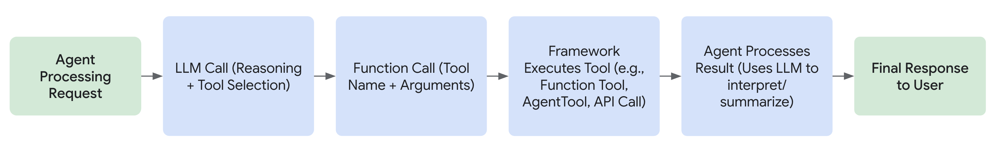

# ADK用カスタムツール

<div class="language-support-tag">
  <span class="lst-supported">ADKでサポート</span><span class="lst-python">Python v0.1.0</span><span class="lst-go">Go v0.1.0</span><span class="lst-java">Java v0.1.0</span>
</div>

ADKエージェントワークフローでは、ツールはADKエージェントがアクションを実行するために呼び出すことができる、構造化された入力と出力を持つプログラミング関数です。ADKツールは、Geminiやその他の生成AIモデルで[関数呼び出し](https://ai.google.dev/gemini-api/docs/function-calling)を使用する方法と同様に機能します。ADKツールを使用して、次のようなさまざまなアクションやプログラミング関数を実行できます。

*   データベースのクエリ
*   APIリクエストの作成：天気データの取得、予約システム
*   ウェブ検索
*   コードスニペットの実行
*   ドキュメントからの情報取得（RAG）
*   他のソフトウェアやサービスとの対話

!!! tip "[ADKツールリスト](/adk-docs/ja/tools/)"
    ADK用の独自のツールを構築する前に、ADKエージェントで使用できる事前に構築されたツールについては、
    **[ADKツールリスト](/adk-docs/ja/tools/)**
    を確認してください。

## ツールとは？

ADKのコンテキストでは、ツールはAIエージェントに提供される特定の機能を表し、エージェントがコアのテキスト生成と推論能力を超えてアクションを実行し、世界と対話できるようにします。有能なエージェントを基本的な言語モデルと区別するのは、多くの場合、ツールの効果的な使用です。

技術的には、ツールは通常、**Python/Java関数**、クラスメソッド、さらには別の特殊なエージェントのようなモジュール式のコードコンポーネントであり、明確に定義されたタスクを実行するように設計されています。これらのタスクには、多くの場合、外部システムまたはデータとの対話が含まれます。



### 主な特徴

**アクション指向：** ツールは、情報検索、API呼び出し、計算実行など、エージェントの特定のアクションを実行します。

**エージェント機能の拡張：** エージェントがリアルタイム情報にアクセスし、外部システムに影響を与え、トレーニングデータに固有の知識の制限を克服できるようにします。

**事前定義されたロジックの実行：** 重要なことに、ツールは開発者が定義した特定のロジックを実行します。エージェントのコアである大規模言語モデル（LLM）のような独立した推論機能は備えていません。LLMは、どのツールをいつ、どの入力で使用するかを推論しますが、ツール自体は指定された関数を実行するだけです。

## エージェントによるツールの使用方法

エージェントは、多くの場合、関数呼び出しを含むメカニズムを介して動的にツールを活用します。このプロセスは通常、次の手順に従います。

1. **推論：** エージェントのLLMは、システム命令、会話履歴、およびユーザーリクエストを分析します。
2. **選択：** 分析に基づいて、LLMは、エージェントで利用可能なツールと各ツールを説明するdocstringに基づいて、実行するツール（もしあれば）を決定します。
3. **呼び出し：** LLMは、選択したツールに必要な引数（入力）を生成し、その実行をトリガーします。
4. **観察：** エージェントは、ツールによって返された出力（結果）を受け取ります。
5. **最終処理：** エージェントは、ツールの出力を進行中の推論プロセスに組み込んで、次の応答を作成し、後続のステップを決定するか、目標が達成されたかどうかを判断します。

ツールは、エージェントのインテリジェントコア（LLM）が複雑なタスクを達成するために必要に応じてアクセスして利用できる特殊なツールキットと考えてください。

## ADKのツールタイプ

ADKは、いくつかのタイプのツールをサポートすることで柔軟性を提供します。

1. **[関数ツール](/adk-docs/ja/tools-custom/function-tools/)：** 特定のアプリケーションのニーズに合わせて作成したツール。
    * **[関数/メソッド](/adk-docs/ja/tools-custom/function-tools/#1-function-tool):** コードで標準の同期関数またはメソッドを定義します（例：Python def）。
    * **[ツールとしてのエージェント](/adk-docs/ja/tools-custom/function-tools/#3-agent-as-a-tool):** 別の、潜在的に特殊化されたエージェントを親エージェントのツールとして使用します。
    * **[長時間実行関数ツール](/adk-docs/ja/tools-custom/function-tools/#2-long-running-function-tool):** 非同期操作を実行したり、完了にかなりの時間がかかるツールをサポートします。
2. **[組み込みツール](/adk-docs/ja/tools/built-in-tools/)：** 一般的なタスクのためにフレームワークによって提供されるすぐに使えるツール。
        例：Google検索、コード実行、検索拡張生成（RAG）。
3. **サードパーティツール：** 人気のある外部ライブラリのツールをシームレスに統合します。

各ツールタイプの詳細情報と例については、上記のリンク先の各ドキュメントページに移動してください。

## エージェントの指示におけるツールの参照

エージェントの指示内で、**関数名**を使用してツールを直接参照できます。ツールの**関数名**と**docstring**が十分に説明的であれば、指示は主に**大規模言語モデル（LLM）がツールをいつ利用すべきか**に焦点を当てることができます。これにより、明確さが促進され、モデルが各ツールの意図された使用法を理解するのに役立ちます。

ツールが生成する可能性のある**さまざまな戻り値を処理する方法をエージェントに明確に指示することが重要です**。たとえば、ツールがエラーメッセージを返す場合、指示では、エージェントが操作を再試行するか、タスクをあきらめるか、ユーザーに追加情報を要求するかを指定する必要があります。

さらに、ADKは、あるツールの出力が別のツールの入力として機能するツールの順次使用をサポートしています。このようなワークフローを実装する場合、必要な手順をモデルにガイドするために、エージェントの指示内で**意図されたツール使用シーケンスを記述する**ことが重要です。

### 例

次の例は、エージェントが**指示で関数名を参照**してツールを使用する方法を示しています。また、成功またはエラーメッセージなど、**ツールからのさまざまな戻り値を処理**するようにエージェントをガイドする方法、およびタスクを達成するために**複数のツールの順次使用を調整**する方法も示しています。

=== "Python"

    ```py
    --8<-- "examples/python/snippets/tools/overview/weather_sentiment.py"
    ```

=== "Go"

    ```go
    --8<-- "examples/go/snippets/tools-custom/weather_sentiment/main.go"
    ```

=== "Java"

    ```java
    --8<-- "examples/java/snippets/src/main/java/tools/WeatherSentimentAgentApp.java:full_code"
    ```

## ツールコンテキスト

より高度なシナリオでは、ADKを使用すると、特別なパラメーター`tool_context: ToolContext`を含めることで、ツール関数内から追加のコンテキスト情報にアクセスできます。これを関数シグネチャに含めることで、ADKはエージェントの実行中にツールが呼び出されたときに**自動的に****ToolContext**クラスの**インスタンス**を提供します。

**ToolContext**は、いくつかの重要な情報と制御レバーへのアクセスを提供します。

* `state: State`: 現在のセッションの状態を読み書きします。ここで行われた変更は追跡され、永続化されます。

* `actions: EventActions`: ツールが実行された後のエージェントの後続のアクションに影響を与えます（例：要約をスキップする、別のエージェントに転送する）。

* `function_call_id: str`: この特定のツール呼び出しにフレームワークによって割り当てられた一意の識別子。認証応答の追跡と関連付けに役立ちます。これは、単一のモデル応答内で複数のツールが呼び出された場合にも役立ちます。

* `function_call_event_id: str`: この属性は、現在のツール呼び出しをトリガーした**イベント**の一意の識別子を提供します。これは、追跡およびロギングの目的で役立ちます。

* `auth_response: Any`: ツールが呼び出される前にフレームワークによって認証がすでに処理されていた場合、認証応答/資格情報が含まれます（RestApiToolおよびOpenAPIセキュリティスキームで一般的です）。

* サービスへのアクセス：アーティファクトやメモリなどの構成済みサービスと対話するためのメソッド。

ツール関数のdocstringに`tool_context`パラメーターを含めないでください。`ToolContext`は、LLMがツール関数を呼び出すことを決定した*後*にADKフレームワークによって自動的に挿入されるため、LLMの意思決定には関係なく、含めるとLLMを混乱させる可能性があります。

### **状態管理**

`tool_context.state`属性は、現在のセッションに関連付けられた状態への直接の読み取りおよび書き込みアクセスを提供します。辞書のように動作しますが、変更がデルタとして追跡され、セッションサービスによって永続化されることを保証します。これにより、ツールはさまざまな対話やエージェントのステップ間で情報を維持および共有できます。

* **状態の読み取り**: 標準の辞書アクセス（`tool_context.state['my_key']`）または`.get()`メソッド（`tool_context.state.get('my_key', default_value)`）を使用します。

* **状態の書き込み**: 値を直接割り当てます（`tool_context.state['new_key'] = 'new_value'`）。これらの変更は、結果のイベントのstate_deltaに記録されます。

* **状態プレフィックス**: 標準の状態プレフィックスを覚えておいてください。

    * `app:*`: アプリケーションのすべてのユーザー間で共有されます。

    * `user:*`: すべてのセッションで現在のユーザーに固有です。

    * （プレフィックスなし）: 現在のセッションに固有です。

    * `temp:*`: 一時的で、呼び出し間で永続化されません（単一の実行呼び出し内でデータを渡すのに役立ちますが、通常、LLM呼び出し間で動作するツールコンテキスト内ではあまり役に立ちません）。

=== "Python"

    ```py
    --8<-- "examples/python/snippets/tools/overview/user_preference.py"
    ```

=== "Go"

    ```go
    --8<-- "examples/go/snippets/tools-custom/user_preference/user_preference.go:example"
    ```

=== "Java"

    ```java
    import com.google.adk.tools.FunctionTool;
    import com.google.adk.tools.ToolContext;

    // ユーザー固有のテーマ設定を更新します。
    public Map<String, String> updateUserThemePreference(String value, ToolContext toolContext) {
      String userPrefsKey = "user:preferences:theme";

      // 現在の設定を取得するか、存在しない場合は初期化します
      String preference = toolContext.state().getOrDefault(userPrefsKey, "").toString();
      if (preference.isEmpty()) {
        preference = value;
      }

      // 更新された辞書を状態に書き戻します
      toolContext.state().put("user:preferences", preference);
      System.out.printf("ツール：ユーザー設定 %s を %s に更新しました", userPrefsKey, preference);

      return Map.of("status", "success", "updated_preference", toolContext.state().get(userPrefsKey).toString());
      // LLMがupdateUserThemePreference("dark")を呼び出すと：
      // toolContext.stateが更新され、変更は
      // 結果のツール応答イベントのactions.stateDeltaの一部になります。
    }
    ```

### **エージェントフローの制御**

`tool_context.actions`属性（Javaでは`ToolContext.actions()`、Goでは`tool.Context.Actions()`）は、**EventActions**オブジェクトを保持します。このオブジェクトの属性を変更すると、ツールが実行を完了した後にエージェントまたはフレームワークが何をするかに影響を与えることができます。

* **`skip_summarization: bool`**: （デフォルト：False）Trueに設定すると、ADKに通常ツールの出力を要約するLLM呼び出しをバイパスするように指示します。これは、ツールの戻り値がすでにユーザーがすぐに使えるメッセージである場合に役立ちます。

* **`transfer_to_agent: str`**: これを別のエージェントの名前に設定します。フレームワークは現在のエージェントの実行を停止し、**会話の制御を指定されたエージェントに転送**します。これにより、ツールはタスクをより専門的なエージェントに動的に引き渡すことができます。

* **`escalate: bool`**: （デフォルト：False）これをTrueに設定すると、現在のエージェントがリクエストを処理できず、制御を親エージェント（階層内にある場合）に渡す必要があることを示します。LoopAgentでは、サブエージェントのツールで**escalate=True**を設定するとループが終了します。

#### 例

=== "Python"

    ```py
    --8<-- "examples/python/snippets/tools/overview/customer_support_agent.py"
    ```

=== "Go"

    ```go
    --8<-- "examples/go/snippets/tools-custom/customer_support_agent/main.go"
    ```

=== "Java"

    ```java
    --8<-- "examples/java/snippets/src/main/java/tools/CustomerSupportAgentApp.java:full_code"
    ```

##### 説明

* `main_agent`と`support_agent`の2つのエージェントを定義します。`main_agent`は、最初の連絡先となるように設計されています。
* `check_and_transfer`ツールは、`main_agent`によって呼び出されると、ユーザーのクエリを調べます。
* クエリに「urgent」という単語が含まれている場合、ツールは`tool_context`、具体的には**`tool_context.actions`**にアクセスし、transfer_to_agent属性を`support_agent`に設定します。
* このアクションは、フレームワークに**会話の制御を`support_agent`という名前のエージェントに転送**するように通知します。
* `main_agent`が緊急クエリを処理すると、`check_and_transfer`ツールが転送をトリガーします。後続の応答は、理想的には`support_agent`から返されます。
* 緊急性のない通常のクエリの場合、ツールは転送をトリガーせずに単に処理します。

この例は、ツールがToolContextのEventActionsを介して、別の特殊なエージェントに制御を転送することで、会話の流れに動的に影響を与えることができる方法を示しています。

### **認証**

<div class="language-support-tag">
    <span class="lst-supported">ADKでサポート</span><span class="lst-python">Python v0.1.0</span>
</div>

ToolContextは、認証済みAPIと対話するツールにメカニズムを提供します。ツールが認証を処理する必要がある場合は、次を使用できます。

* **`auth_response`**: ツールが呼び出される前にフレームワークによって認証がすでに処理されていた場合、資格情報（トークンなど）が含まれます（RestApiToolおよびOpenAPIセキュリティスキームで一般的です）。

* **`request_credential(auth_config: dict)`**: ツールが認証が必要であると判断したが、資格情報が利用できない場合にこのメソッドを呼び出します。これにより、提供されたauth_configに基づいて認証フローを開始するようにフレームワークに通知されます。

* **`get_auth_response()`**: 後続の呼び出しで（request_credentialが正常に処理された後）、ユーザーが提供した資格情報を取得するためにこれを呼び出します。

認証フロー、構成、および例の詳細については、専用のツール認証ドキュメントページを参照してください。

### **コンテキスト対応データアクセス方法**

これらのメソッドは、ツールが構成済みサービスによって管理されるセッションまたはユーザーに関連付けられた永続データと対話するための便利な方法を提供します。

* **`list_artifacts()`**（またはJavaでは**`listArtifacts()`**）：artifact_serviceを介して現在セッションに保存されているすべてのアーティファクトのファイル名（またはキー）のリストを返します。アーティファクトは通常、ユーザーがアップロードした、またはツール/エージェントによって生成されたファイル（画像、ドキュメントなど）です。

* **`load_artifact(filename: str)`**: **artifact_service**からファイル名で特定のアーティファクトを取得します。オプションでバージョンを指定できます。省略すると、最新バージョンが返されます。アーティファクトデータとMIMEタイプを含む`google.genai.types.Part`オブジェクトを返します。見つからない場合はNoneを返します。

* **`save_artifact(filename: str, artifact: types.Part)`**: artifact_serviceにアーティファactの新しいバージョンを保存します。新しいバージョン番号（0から始まる）を返します。

* **`search_memory(query: str)`**: （ADK PythonおよびGoでサポート）
    構成済みの`memory_service`を使用してユーザーの長期記憶をクエリします。これは、過去の対話または保存された知識から関連情報を取得するのに役立ちます。**SearchMemoryResponse**の構造は、特定のメモリサービスの実装によって異なりますが、通常、関連するテキストスニペットまたは会話の抜粋が含まれます。

#### 例

=== "Python"

    ```py
    --8<-- "examples/python/snippets/tools/overview/doc_analysis.py"
    ```

=== "Go"

    ```go
    --8<-- "examples/go/snippets/tools-custom/doc_analysis/doc_analysis.go"
    ```

=== "Java"

    ```java
    // メモリのコンテキストを使用してドキュメントを分析します。
    // コールバックコンテキストまたはLoadArtifactsツールを使用して、アーティファクトを一覧表示、ロード、保存することもできます。
    public static @NonNull Maybe<ImmutableMap<String, Object>> processDocument(
        @Annotations.Schema(description = "分析するドキュメントの名前。") String documentName,
        @Annotations.Schema(description = "分析のクエリ。") String analysisQuery,
        ToolContext toolContext) {

      // 1. 利用可能なすべてのアーティファクトを一覧表示します
      System.out.printf(
          "利用可能なすべてのアーティファクトを一覧表示しています %s:", toolContext.listArtifacts().blockingGet());

      // 2. アーティファクトをメモリにロードします
      System.out.println("ツール：アーティファクトのロードを試みています： " + documentName);
      Part documentPart = toolContext.loadArtifact(documentName, Optional.empty()).blockingGet();
      if (documentPart == null) {
        System.out.println("ツール：ドキュメント '" + documentName + "' が見つかりません。");
        return Maybe.just(
            ImmutableMap.<String, Object>of(
                "status", "error", "message", "ドキュメント '" + documentName + "' が見つかりません。"));
      }
      String documentText = documentPart.text().orElse("");
      System.out.println(
          "ツール：ドキュメント '" + documentName + "' (" + documentText.length() + " 文字) をロードしました。");

      // 3. 分析を実行します（プレースホルダー）
      String analysisResult =
          "'"
              + documentName
              + "' に関する '"
              + analysisQuery
              + " [プレースホルダー分析結果]";
      System.out.println("ツール：分析を実行しました。");

      // 4. 分析結果を新しいアーティファクトとして保存します
      Part analysisPart = Part.fromText(analysisResult);
      String newArtifactName = "analysis_" + documentName;

      toolContext.saveArtifact(newArtifactName, analysisPart);

      return Maybe.just(
          ImmutableMap.<String, Object>builder()
              .put("status", "success")
              .put("analysis_artifact", newArtifactName)
              .build());
    }
    // FunctionTool processDocumentTool =
    //      FunctionTool.create(ToolContextArtifactExample.class, "processDocument");
    // エージェントに、この関数ツールを含めます。
    // LlmAgent agent = LlmAgent().builder().tools(processDocumentTool).build();
    ```

**ToolContext**を活用することで、開発者はADKのアーキテクチャとシームレスに統合し、エージェントの全体的な機能を強化する、より高度でコンテキストを意識したカスタムツールを作成できます。

## 効果的なツール関数の定義

メソッドまたは関数をADKツールとして使用する場合、その定義方法がエージェントの正しい使用能力に大きく影響します。エージェントの大規模言語モデル（LLM）は、関数の**名前**、**パラメーター（引数）**、**型ヒント**、および**docstring** / **ソースコードコメント**に大きく依存して、その目的を理解し、正しい呼び出しを生成します。

効果的なツール関数を定義するための主なガイドラインは次のとおりです。

* **関数名：**
    * アクションを明確に示す、説明的な動詞-名詞ベースの名前を使用します（例：`get_weather`、`searchDocuments`、`schedule_meeting`）。
    * `run`、`process`、`handle_data`などの一般的な名前や、`doStuff`などの過度に曖昧な名前は避けてください。優れた説明があっても、`do_stuff`のような名前は、モデルがツールをいつ使用するか、たとえば`cancelFlight`と比較して混乱させる可能性があります。
    * LLMは、ツール選択中に主要な識別子として関数名を使用します。

* **パラメーター（引数）：**
    * 関数には任意の数のパラメーターを含めることができます。
    * 明確で説明的な名前を使用します（例：`c`の代わりに`city`、`q`の代わりに`search_query`）。
    * **Pythonですべてのパラメーターに型ヒントを提供します**（例：`city: str`、`user_id: int`、`items: list[str]`）。これは、ADKがLLMの正しいスキーマを生成するために不可欠です。
    * すべてのパラメータータイプが**JSONシリアル化可能**であることを確認します。`str`、`int`、`float`、`bool`、`list`、`dict`などのすべてのJavaプリミティブおよび標準Pythonタイプとその組み合わせは、一般的に安全です。明確なJSON表現がない限り、複雑なカスタムクラスインスタンスを直接パラメーターとして使用しないでください。
    * パラメーターに**デフォルト値を設定しないでください**。例：`def my_func(param1: str = "default")`。デフォルト値は、関数呼び出し生成中に基になるモデルによって確実にサポートまたは使用されません。必要なすべての情報は、LLMがコンテキストから導き出すか、不足している場合は明示的に要求する必要があります。
    * **`self` / `cls`は自動的に処理されます：** `self`（インスタンスメソッドの場合）や`cls`（クラスメソッドの場合）などの暗黙的なパラメーターは、ADKによって自動的に処理され、LLMに表示されるスキーマから除外されます。ツールがLLMに提供する必要がある論理パラメーターの型ヒントと説明を定義するだけで済みます。

* **戻り値の型：**
    * 関数の戻り値は、Pythonでは**辞書（`dict`）**、Javaでは**Map**でなければなりません。
    * 関数が辞書以外の型（文字列、数値、リストなど）を返す場合、ADKフレームワークは、結果をモデルに返す前に、自動的に`{'result': your_original_return_value}`のような辞書/Mapにラップします。
    * 辞書/Mapのキーと値を、**LLMが簡単に理解できるように**説明的に設計します。モデルはこの出力を読み取って次のステップを決定することを忘れないでください。
    * 意味のあるキーを含めます。たとえば、`500`のようなエラーコードだけを返すのではなく、`{'status': 'error', 'error_message': 'データベース接続に失敗しました'}`を返します。
    * モデルのツール実行の結果を明確に示すために、`status`キー（`'success'`、`'error'`、`'pending'`、`'ambiguous'`など）を含めることは**強く推奨されるプラクティス**です。

* **Docstring / ソースコードコメント：**
    * **これは重要です。** docstringは、LLMの主要な説明情報源です。
    * **ツールが*何をする*かを明確に記述します。** その目的と制限について具体的に記述します。
    * **ツールを*いつ*使用すべきかを説明します。** LLMの意思決定をガイドするために、コンテキストまたはシナリオ例を提供します。
    * **各パラメーターを明確に説明します。** LLMがその引数に提供する必要がある情報を説明します。
    * 予想される`dict`戻り値の**構造と意味**、特にさまざまな`status`値と関連するデータキーを説明します。
    * **挿入されたToolContextパラメーターを説明しないでください**。LLMが知る必要のあるパラメーターではないため、docstringの説明内でオプションの`tool_context: ToolContext`パラメーターに言及しないでください。ToolContextは、LLMがそれを呼び出すことを決定した*後*にADKによって挿入されます。

    **良い定義の例：**

=== "Python"

    ```python
    def lookup_order_status(order_id: str) -> dict:
      """顧客の注文の現在のステータスをIDを使用して取得します。

      ユーザーが特定の注文のステータスを明示的に尋ね、注文IDを提供した場合にのみ、このツールを使用してください。
      一般的な問い合わせには使用しないでください。

      引数：
          order_id：検索する注文の一意の識別子。

      戻り値：
          結果を示す辞書。
          成功した場合、ステータスは「success」で、「order」辞書が含まれます。
          失敗した場合、ステータスは「error」で、「error_message」が含まれます。
          成功例：{'status': 'success', 'order': {'state': 'shipped', 'tracking_number': '1Z9...'}}
          エラー例：{'status': 'error', 'error_message': '注文IDが見つかりません。'}
      """
      # ...ステータスを取得するための関数実装...
      if status_details := fetch_status_from_backend(order_id):
        return {
            "status": "success",
            "order": {
                "state": status_details.state,
                "tracking_number": status_details.tracking,
            },
        }
      else:
        return {"status": "error", "error_message": f"注文ID {order_id} が見つかりません。"}

    ```

=== "Go"

    ```go
    --8<-- "examples/go/snippets/tools-custom/order_status/order_status.go:snippet"
    ```

=== "Java"

    ```java
    /**
     * 指定された都市の現在の天気予報を取得します。
     *
     * @param city 天気予報を取得する都市。
     * @param toolContext ツールのコンテキスト。
     * @return 天気情報を含む辞書。
     */
    public static Map<String, Object> getWeatherReport(String city, ToolContext toolContext) {
        Map<String, Object> response = new HashMap<>();
        if (city.toLowerCase(Locale.ROOT).equals("london")) {
            response.put("status", "success");
            response.put(
                    "report",
                    "ロンドンの現在の天気は曇りで、気温は18℃、雨の可能性があります。");
        } else if (city.toLowerCase(Locale.ROOT).equals("paris")) {
            response.put("status", "success");
            response.put("report", "パリの天気は晴れで、気温は25℃です。");
        } else {
            response.put("status", "error");
            response.put("error_message", String.format("'%s'の天気情報は利用できません。", city));
        }
        return response;
    }
    ```

* **シンプルさと焦点：**
    * **ツールを集中させる：** 各ツールは、理想的には1つの明確に定義されたタスクを実行する必要があります。
    * **パラメーターが少ない方が良い：** モデルは一般的に、多くのオプションまたは複雑なパラメーターを持つツールよりも、明確に定義されたパラメーターが少ないツールをより確実に処理します。
    * **単純なデータ型を使用する：** 可能な場合は、複雑なカスタムクラスや深くネストされた構造よりも、基本的な型（Pythonでは`str`、`int`、`bool`、`float`、`List[str]`、Javaでは`int`、`byte`、`short`、`long`、`float`、`double`、`boolean`、`char`）を優先します。
    * **複雑なタスクを分解する：** 複数の異なる論理ステップを実行する関数を、より小さく、より焦点を絞ったツールに分割します。たとえば、単一の`update_user_profile(profile: ProfileObject)`ツールの代わりに、`update_user_name(name: str)`、`update_user_address(address: str)`、`update_user_preferences(preferences: list[str])`などの個別のツールを検討してください。これにより、LLMが正しい機能を選択して使用しやすくなります。

これらのガイドラインに従うことで、LLMにカスタム関数ツールを効果的に活用するために必要な明確さと構造を提供し、より有能で信頼性の高いエージェントの動作につながります。

## ツールセット：ツールのグループ化と動的な提供

<div class="language-support-tag" title="この機能は現在Pythonで利用可能です。">
   <span class="lst-supported">ADKでサポート</span><span class="lst-python">Python v0.5.0</span>
</div>

個々のツールを超えて、ADKは`BaseToolset`インターフェイス（`google.adk.tools.base_toolset`で定義）を介して**ツールセット**の概念を導入します。ツールセットを使用すると、`BaseTool`インスタンスのコレクションを管理し、多くの場合動的にエージェントに提供できます。

このアプローチは、次の場合に有益です。

*   **関連ツールの整理：** 共通の目的を果たすツール（数学演算用のすべてのツール、または特定のAPIと対話するすべてのツールなど）をグループ化します。
*   **動的なツールの可用性：** エージェントが現在のコンテキスト（ユーザー権限、セッション状態、またはその他のランタイム条件など）に基づいて異なるツールを利用できるようにします。ツールセットの`get_tools`メソッドは、公開するツールを決定できます。
*   **外部ツールプロバイダーの統合：** ツールセットは、OpenAPI仕様やMCPサーバーなどの外部システムから提供されるツールのアダプターとして機能し、ADK互換の`BaseTool`オブジェクトに変換できます。

### `BaseToolset`インターフェイス

ADKでツールセットとして機能するクラスは、`BaseToolset`抽象基本クラスを実装する必要があります。このインターフェイスは、主に2つのメソッドを定義します。

*   **`async def get_tools(...) -> list[BaseTool]:`**
    これはツールセットのコアメソッドです。ADKエージェントが利用可能なツールを知る必要がある場合、`tools`リストで提供される各`BaseToolset`インスタンスで`get_tools()`を呼び出します。
    *   オプションの`readonly_context`（`ReadonlyContext`のインスタンス）を受け取ります。このコンテキストは、現在のセッション状態（`readonly_context.state`）、エージェント名、呼び出しIDなどの情報への読み取り専用アクセスを提供します。ツールセットは、このコンテキストを使用して、返すツールを動的に決定できます。
    *   `BaseTool`インスタンス（`FunctionTool`、`RestApiTool`など）の`list`を**必ず**返す必要があります。

*   **`async def close(self) -> None:`**
    この非同期メソッドは、エージェントサーバーがシャットダウンしているときや`Runner`が閉じられているときなど、ツールセットが不要になったときにADKフレームワークによって呼び出されます。このメソッドを実装して、ネットワーク接続のクローズ、ファイルハンドルの解放、ツールセットによって管理されるその他のリソースのクリーンアップなど、必要なクリーンアップを実行します。

### エージェントでのツールセットの使用

`BaseToolset`実装のインスタンスを、個々の`BaseTool`インスタンスとともに`LlmAgent`の`tools`リストに直接含めることができます。

エージェントが初期化されるか、利用可能な機能を決定する必要がある場合、ADKフレームワークは`tools`リストを反復処理します。

*   アイテムが`BaseTool`インスタンスの場合、直接使用されます。
*   アイテムが`BaseToolset`インスタンスの場合、その`get_tools()`メソッドが呼び出され（現在の`ReadonlyContext`とともに）、返された`BaseTool`のリストがエージェントの利用可能なツールに追加されます。

### 例：シンプルな数学ツールセット

簡単な算術演算を提供するツールセットの基本的な例を作成しましょう。

```py
--8<-- "examples/python/snippets/tools/overview/toolset_example.py:init"
```

この例では：

*   `SimpleMathToolset`は`BaseToolset`を実装し、その`get_tools()`メソッドは`add_numbers`と`subtract_numbers`の`FunctionTool`インスタンスを返します。また、プレフィックスを使用して名前をカスタマイズします。
*   `calculator_agent`は、個々の`greet_tool`と`SimpleMathToolset`のインスタンスの両方で構成されます。
*   `calculator_agent`が実行されると、ADKは`math_toolset_instance.get_tools()`を呼び出します。エージェントのLLMは、ユーザーリクエストを処理するために`greet_user`、`calculator_add_numbers`、および`calculator_subtract_numbers`にアクセスできるようになります。
*   `add_numbers`ツールは`tool_context.state`への書き込みを示し、エージェントの指示はこの状態の読み取りに言及しています。
*   `close()`メソッドは、ツールセットが保持するリソースが解放されるように呼び出されます。

ツールセットは、ADKエージェントにツールのコレクションを整理、管理、動的に提供するための強力な方法を提供し、よりモジュール式で保守性が高く、適応性のあるエージェントアプリケーションにつながります。
