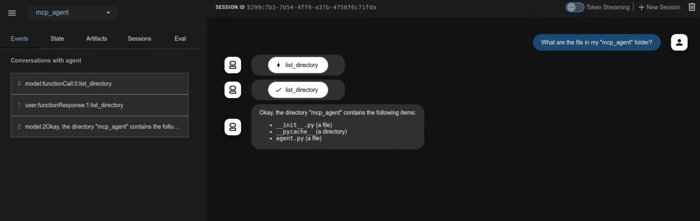
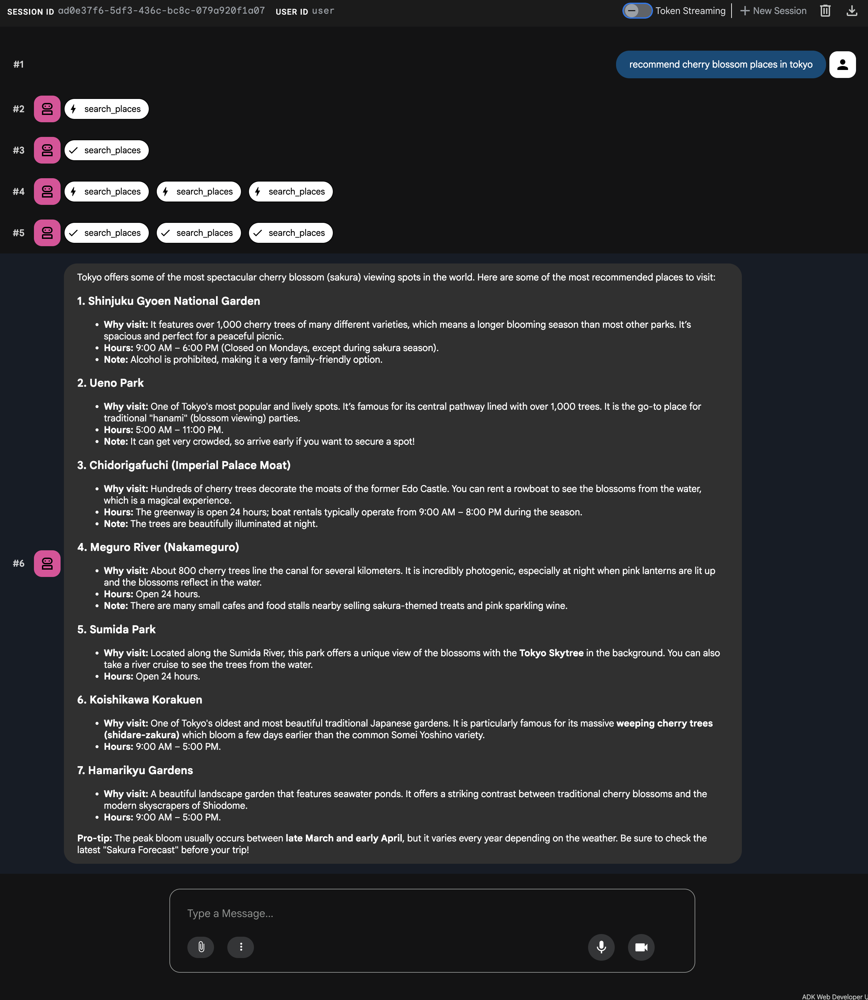

# モデルコンテキストプロトコルツール

<div class="language-support-tag">
  <span class="lst-supported">ADKでサポート</span><span class="lst-python">Python v0.1.0</span><span class="lst-typescript">TypeScript v0.2.0</span><span class="lst-go">Go v0.1.0</span><span class="lst-java">Java v0.1.0</span>
</div>

このガイドでは、ADK と MCP (Model Context Protocol) を統合する 2 つの方法を案内します。

## MCP(モデルコンテキストプロトコル)とは？

MCP (Model Context Protocol) は、Gemini や Claude のような LLM（大規模言語モデル）が外部アプリケーション、データソース、ツールと通信する方法を標準化するために設計されたオープン標準です。LLM がコンテキストを取得し、処理を実行し、さまざまなシステムとやり取りする方法を単純化する、汎用的な接続メカニズムだと考えてください。

MCP はクライアント・サーバーアーキテクチャに従い、**MCP サーバー**が **データ**（リソース）、**対話型テンプレート**（プロンプト）、**実行可能な関数**（ツール）を公開し、**MCP クライアント**（LLM をホストするアプリケーションまたは AI エージェント） がそれらをどのように利用するかを定義します。

このガイドでは、次の 2 つの主要な統合パターンを扱います。

1. **ADK 内で既存の MCP サーバーを使う:** ADK エージェントが MCP クライアントとして動作し、外部 MCP サーバーが提供するツールを利用します。
2. **MCP サーバー経由で ADK ツールを公開する:** ADK ツールをラップして、あらゆる MCP クライアントからアクセスできる MCP サーバーを構築します。

## 前提条件

始める前に、次の準備ができていることを確認してください。

* **ADK のセットアップ:** クイックスタートの標準 ADK [インストール手順](../get-started/quickstart.md/#venv-install) に従ってください。
* **Python/Java のインストール・更新:** MCP を使うには Python 3.9 以上、または Java 17 以上が必要です。
* **Node.js と `npx` のセットアップ:** **(Python のみ)** 多くのコミュニティ製 MCP サーバーは Node.js パッケージとして配布され、`npx` で実行されます。未インストールの場合は Node.js（`npx` を含む）を導入してください。詳細は [https://nodejs.org/en](https://nodejs.org/en) を参照してください。
* **インストール確認:** **(Python のみ)** 有効化した仮想環境内で `adk` と `npx` が PATH にあることを確認してください。

```shell
# どちらのコマンドも、実行ファイルのパスを出力するはずです。
which adk
which npx
```

## 1. `adk web` で ADK エージェントと MCP サーバーを使う（ADK を MCP クライアントとして）

このセクションでは、外部 MCP（Model Context Protocol）サーバーのツールを ADK エージェントに統合する方法を示します。これは、ADK エージェントが既存サービスの機能を MCP インターフェース経由で使う必要がある場合の、**最も一般的な**統合パターンです。`McpToolset` クラスをエージェントの `tools` 一覧に直接追加すると、MCP サーバーへシームレスに接続し、ツールを検出し、エージェントから利用できるようにする流れを確認できます。この例は主に `adk web` 開発環境内でのやり取りに重点を置いています。

### `McpToolset` クラス

`McpToolset` クラスは、ADK から MCP サーバーのツールを統合するための主要な仕組みです。エージェントの `tools` 一覧に `McpToolset` インスタンスを含めると、指定した MCP サーバーとのやり取りを自動的に処理します。動作は次のとおりです。

1.  **接続管理:** 初期化時に `McpToolset` は MCP サーバーへの接続を確立し、管理します。対象はローカルのサーバープロセス（標準入出力通信のための `StdioConnectionParams`）でも、リモートサーバー（Server-Sent Events のための `SseConnectionParams`）でもかまいません。ツールセットは、エージェントやアプリケーションの終了時にこの接続を適切に閉じる処理も担当します。
2.  **ツールの検索と変換:** 接続後、`McpToolset` は MCP サーバーに利用可能なツールを問い合わせます（`list_tools` MCP メソッド）。取得した MCP ツールのスキーマを、ADK 互換の `BaseTool` インスタンスに変換します。
3.  **エージェントへの公開:** 変換されたツールは、通常の ADK ツールと同じように `LlmAgent` から利用できます。
4.  **ツール呼び出しの中継:** `LlmAgent` がそのツールの 1 つを使うと判断すると、`McpToolset` は呼び出しを MCP サーバーへ透過的に中継し（`call_tool` MCP メソッドを使用）、必要な引数を送ってサーバーの応答をエージェントへ返します。
5.  **フィルタリング（任意）:** `McpToolset` 作成時に `tool_filter` パラメーターを使うと、MCP サーバー上の特定のツールだけをエージェントに公開できます。

次の例では、`adk web` 開発環境内で `McpToolset` を使う方法を示します。MCP 接続のライフサイクルをより細かく制御したい場合や、`adk web` を使わないシナリオでは、このページ後半の「`adk web` 外で自分のエージェントに MCP ツールを使う」セクションを参照してください。

### 例 1: ファイルシステム MCP サーバー

この Python 例では、ファイルシステム操作を提供するローカル MCP サーバーへ接続する方法を示します。

#### ステップ 1: `McpToolset` でエージェントを定義する

`agent.py` ファイル（例: `./adk_agent_samples/mcp_agent/agent.py`）を作成します。`McpToolset` は `LlmAgent` の `tools` 一覧の中で直接インスタンス化します。

*   **重要:** `args` 配列の `"/path/to/your/folder"` を、MCP サーバーがアクセスできるローカルフォルダーの **絶対パス** に置き換えてください。
*   **重要:** `.env` ファイルは `./adk_agent_samples` ディレクトリの 1 つ上の階層に置いてください。

```python
# ./adk_agent_samples/mcp_agent/agent.py
import os # パス操作に必要
from google.adk.agents import LlmAgent
from google.adk.tools.mcp_tool import McpToolset
from google.adk.tools.mcp_tool.mcp_session_manager import StdioConnectionParams
from mcp import StdioServerParameters

# 可能ならパスは動的に定義するか、
# ユーザーに絶対パスが必要なことを明確に伝えてください。
# この例では、このファイルと同じディレクトリに '/path/to/your/folder' があると仮定し、
# 相対パスから組み立てています。
# 必要に応じて、実際の絶対パスに置き換えてください。
TARGET_FOLDER_PATH = os.path.join(os.path.dirname(os.path.abspath(__file__)), "/path/to/your/folder")
# TARGET_FOLDER_PATH が MCP サーバーの絶対パスであることを確認してください。
# たとえば `./adk_agent_samples/mcp_agent/your_folder` を作成した場合、

root_agent = LlmAgent(
    model='gemini-flash-latest',
    name='filesystem_assistant_agent',
    instruction='ユーザーのファイル管理を支援します。ファイルの一覧表示や読み取りなどを行えます。',
    tools=[
       McpToolset(
            connection_params=StdioConnectionParams(
                server_params = StdioServerParameters(
                    command='npx',
                    args=[
                        "-y",  # npx の自動確認インストール用引数
                        "@modelcontextprotocol/server-filesystem",
                        # 重要: これは npx プロセスがアクセスできるフォルダーの絶対パスである必要があります。
                        # システム上の有効な絶対パスに置き換えてください。
                        # 例: "/Users/youruser/accessible_mcp_files"
                        # または動的に組み立てた絶対パスを使います:
                        os.path.abspath(TARGET_FOLDER_PATH),
                    ],
                ),
            ),
            # 任意: MCP サーバーから公開するツールをフィルタリングします。
            # tool_filter=['list_directory', 'read_file']
        )
    ],
)
```


#### ステップ 2: `__init__.py` ファイルを作成する

`agent.py` と同じディレクトリに `__init__.py` があることを確認し、ADK から見える Python パッケージにします。

```python
# ./adk_agent_samples/mcp_agent/__init__.py
from . import agent
```

#### ステップ 3: `adk web` を実行して操作する

ターミナルで `mcp_agent` の親ディレクトリ（例: `adk_agent_samples`）に移動し、次を実行します。

```shell
cd ./adk_agent_samples # または該当する親ディレクトリ
adk web
```

!!! info "Windows ユーザー向けの注意"

    `_make_subprocess_transport NotImplementedError` が発生する場合は、代わりに `adk web --no-reload` の使用を検討してください。


ADK Web UI がブラウザーに読み込まれたら:

1.  エージェントのドロップダウンで `filesystem_assistant_agent` を選択します。
2.  次のようなプロンプトを試します。
    *   "現在のディレクトリのファイル一覧を表示してください。"
    *   "`sample.txt` というファイルを読めますか？"（`TARGET_FOLDER_PATH` に作成済みと仮定）
    *   "`another_file.md` の内容は何ですか？"

エージェントが MCP ファイルシステムサーバーとやり取りし、サーバーの応答（ファイル一覧、ファイル内容）がエージェント経由で返ってくる様子を確認できます。`npx` プロセスが stderr に出力する場合は、`adk web` コンソール（コマンドを実行したターミナル）にもログが表示されることがあります。




Java で `McpToolset` を初期化するエージェントを定義するには、次のサンプルを参照してください。

```java
package agents;

import com.google.adk.JsonBaseModel;
import com.google.adk.agents.LlmAgent;
import com.google.adk.agents.RunConfig;
import com.google.adk.runner.InMemoryRunner;
import com.google.adk.tools.mcp.McpTool;
import com.google.adk.tools.mcp.McpToolset;
import com.google.adk.tools.mcp.McpToolset.McpToolsAndToolsetResult;
import com.google.genai.types.Content;
import com.google.genai.types.Part;
import io.modelcontextprotocol.client.transport.ServerParameters;

import java.util.List;
import java.util.concurrent.CompletableFuture;

public class McpAgentCreator {

    /**
     * McpToolset を初期化し、stdio を使って MCP サーバーからツールを検索し、
     * このツールを使って LlmAgent を生成し、エージェントにプロンプトを送り、
     * ツールセットが閉じられるようにします。
     * @param args コマンドライン引数（未使用）。
     */
    public static void main(String[] args) {
        // 注意: フォルダーがホームの外にある場合は、権限の問題が発生することがあります。
        String yourFolderPath = "~/path/to/folder";

        ServerParameters connectionParams = ServerParameters.builder("npx")
                .args(List.of(
                        "-y",
                        "@modelcontextprotocol/server-filesystem",
                        yourFolderPath
                ))
                .build();

        try {
            CompletableFuture<McpToolsAndToolsetResult> futureResult = 
                    McpToolset.fromServer(connectionParams, JsonBaseModel.getMapper());

            McpToolsAndToolsetResult result = futureResult.join();

            try (McpToolset toolset = result.getToolset()) {
                List<McpTool> tools = result.getTools();

                LlmAgent agent = LlmAgent.builder()
                        .model("gemini-flash-latest")
                        .name("enterprise_assistant")
                        .description("ユーザーがファイルシステムへアクセスするのを支援するエージェント")
                        .instruction(
                                "ユーザーがファイルシステムへアクセスするのを支援します。ディレクトリ内のファイルを一覧表示できます。"
                        )
                        .tools(tools)
                        .build();

                System.out.println("エージェントを作成しました: " + agent.name());

                InMemoryRunner runner = new InMemoryRunner(agent);
                String userId = "user123";
                String sessionId = "1234";
                String promptText = "このディレクトリのファイルは何ですか? - " + yourFolderPath + "?";

                // セッションを明示的に先に作成します
                try {
                    // InMemoryRunner の appName は、コンストラクターで指定しない場合 agent.name() が既定値になります。
                    runner.sessionService().createSession(runner.appName(), userId, null, sessionId).blockingGet();
                    System.out.println("セッションを作成しました: " + sessionId + "（ユーザー: " + userId + "）");
                } catch (Exception sessionCreationException) {
                    System.err.println("セッションの作成に失敗しました: " + sessionCreationException.getMessage());
                    sessionCreationException.printStackTrace();
                    return;
                }

                Content promptContent = Content.fromParts(Part.fromText(promptText));

                System.out.println("\nプロンプトを送信中: \"" + promptText + "\" をエージェントへ...\n");

                runner.runAsync(userId, sessionId, promptContent, RunConfig.builder().build())
                        .blockingForEach(event -> {
                            System.out.println("イベントを受信しました: " + event.toJson());
                        });
            }
        } catch (Exception e) {
            System.err.println("エラーが発生しました: " + e.getMessage());
            e.printStackTrace();
        }
    }
}
```

`first`、`second`、`third` という 3 つのファイルを含むフォルダーを想定した場合、成功例は次のとおりです。

```shell
Event received: {"id":"163a449e-691a-48a2-9e38-8cadb6d1f136","invocationId":"e-c2458c56-e57a-45b2-97de-ae7292e505ef","author":"enterprise_assistant","content":{"parts":[{"functionCall":{"id":"adk-388b4ac2-d40e-4f6a-bda6-f051110c6498","args":{"path":"~/home-test"},"name":"list_directory"}}],"role":"model"},"actions":{"stateDelta":{},"artifactDelta":{},"requestedAuthConfigs":{}},"timestamp":1747377543788}

Event received: {"id":"8728380b-bfad-4d14-8421-fa98d09364f1","invocationId":"e-c2458c56-e57a-45b2-97de-ae7292e505ef","author":"enterprise_assistant","content":{"parts":[{"functionResponse":{"id":"adk-388b4ac2-d40e-4f6a-bda6-f051110c6498","name":"list_directory","response":{"text_output":[{"text":"[FILE] first\n[FILE] second\n[FILE] third"}]}}}],"role":"user"},"actions":{"stateDelta":{},"artifactDelta":{},"requestedAuthConfigs":{}},"timestamp":1747377544679}

Event received: {"id":"8fe7e594-3e47-4254-8b57-9106ad8463cb","invocationId":"e-c2458c56-e57a-45b2-97de-ae7292e505ef","author":"enterprise_assistant","content":{"parts":[{"text":"ディレクトリには first, second, third の 3 つのファイルがあります。"}],"role":"model"},"actions":{"stateDelta":{},"artifactDelta":{},"requestedAuthConfigs":{}},"timestamp":1747377544689}
```


### 例 2: Google Maps Grounding Lite MCP サーバー

[Google Maps Platform Grounding Lite](https://developers.google.com/maps/ai/grounding-lite) は、Google Maps の信頼できる地理空間データを使って AI アプリケーションを簡単にグラウンディングできる、Model Context Protocol（MCP）対応サービスです。この MCP サーバーは、LLM が場所、天気、経路に関する機能へアクセスできるツールを提供します。MCP サーバーをサポートする任意のツールで Grounding Lite を有効化して試すことができます。

Grounding Lite は、LLM が次の Google Maps 機能にアクセスできるツールを提供します。

*   **場所検索:** 場所に関する情報を要求すると、AI が生成した場所データの要約に加えて、要約に含まれる各場所の Place ID、緯度・経度座標、Google Maps リンクを取得できます。返された Place ID や座標は、他の Google Maps Platform API と組み合わせて地図上に場所を表示するために使えます。
*   **天気の照会:** 天気情報を要求し、現在の状況、時間別予報、日別予報を取得できます。
*   **経路計算:** 2 つの地点間の運転または徒歩ルート情報を要求し、距離や所要時間を取得できます。

#### ステップ 1: Google Cloud プロジェクトで Maps Grounding Lite サービスを有効化する

1.  まだプロジェクトがない場合は、[Google Cloud プロジェクトを設定](https://developers.google.com/maps/get-started#create-project)します。
2.  [Google Cloud Console](https://console.developers.google.com) で、Grounding Lite に使うプロジェクトを選択します。
3.  [Google Cloud Console API ライブラリ](https://console.developers.google.com/apis/library/mapstools.googleapis.com) で Grounding Lite を有効化します。
4.  [Google Maps Platform API キーを取得](https://developers.google.com/maps/get-started#api-key)します。

#### ステップ 2: Google Maps Grounding Lite 用の `McpToolset` でエージェントを定義する

`agent.py` ファイル（例: `./adk_agent_samples/mcp_agent/agent.py`）を修正します。`YOUR_GOOGLE_MAPS_API_KEY` を実際に取得した API キーへ置き換えてください。

```python
# ./adk_agent_samples/mcp_agent/agent.py
import os
from google.adk.agents.llm_agent import Agent
from google.adk.tools.mcp_tool import McpToolset
from google.adk.tools.mcp_tool.mcp_session_manager import StreamableHTTPConnectionParams

# API キーは環境変数から取得するか、直接埋め込めます。
# 通常は環境変数を使う方が安全です。
# この環境変数は、`adk web` を実行するターミナルで設定してください。
# 例: export GOOGLE_MAPS_API_KEY="YOUR_ACTUAL_KEY"
GOOGLE_MAPS_API_KEY = os.getenv("GOOGLE_MAPS_API_KEY")

if not GOOGLE_MAPS_API_KEY:
    # テスト用のフォールバックまたは直接代入 - 本番では推奨しません。
    GOOGLE_MAPS_API_KEY = "YOUR_GOOGLE_MAPS_API_KEY_HERE"  # 環境変数を使わない場合は置き換えてください。
    if GOOGLE_MAPS_API_KEY == "YOUR_GOOGLE_MAPS_API_KEY_HERE":
        print("警告: GOOGLE_MAPS_API_KEY が設定されていません。環境変数またはスクリプトで設定してください。")
        # キーが必須ならここでエラーにするか終了することもできます。

root_agent = Agent(
    model='gemini-flash-latest',
    name='travel_planner_agent',
    description='旅行ルート計画を支援する便利なアシスタントです。',
    tools=[
        McpToolset(
            connection_params=StreamableHTTPConnectionParams(
                url="https://mapstools.googleapis.com/mcp",
                headers={
                    "X-Goog-Api-Key": GOOGLE_MAPS_API_KEY,
                    "Content-Type": "application/json",
                    "Accept": "application/json, text/event-stream"
                }
            )
        )
    ]
)
```

#### ステップ 3: `__init__.py` があることを確認する

例 1 ですでに作成していれば、この手順は不要です。そうでなければ、`./adk_agent_samples/mcp_agent/` ディレクトリに `__init__.py` があることを確認してください。

```python
# ./adk_agent_samples/mcp_agent/__init__.py
from . import agent
```

#### ステップ 4: `adk web` を実行して操作する

1.  **環境変数の設定（推奨）:**
    `adk web` を実行する前に、ターミナルで Google Maps API キーを環境変数として設定するのがおすすめです。
    ```shell
    export GOOGLE_MAPS_API_KEY="YOUR_ACTUAL_GOOGLE_MAPS_API_KEY"
    ```
    `YOUR_ACTUAL_GOOGLE_MAPS_API_KEY` を実際のキーに置き換えてください。

2.  **`adk web` を実行:**
    `mcp_agent` の親ディレクトリ（例: `adk_agent_samples`）へ移動して次を実行します。
    ```shell
    cd ./adk_agent_samples # または対応する親ディレクトリ
    adk web
    ```

3.  **UI で操作する:**
    *   `travel_planner_agent` を選択します。
    *   次のようなプロンプトを試します。
        *   「明日サンフランシスコに行きます。天気はどうですか？」
        *   「ゴールデンゲートパーク近くのコーヒーショップを探して。」
        *   「GooglePlex から SFO までの経路を教えて。」

エージェントが Google Maps Grounding Lite MCP ツールを使って、経路案内や位置情報ベースの情報を返すことを確認できます。




Java で `McpToolset` を初期化するエージェントを定義するには、次のサンプルを参照してください。

```java
package agents;

import com.google.adk.agents.LlmAgent;
import com.google.adk.runner.InMemoryRunner;
import com.google.adk.sessions.SessionKey;
import com.google.adk.tools.mcp.McpToolset;
import com.google.adk.tools.mcp.StreamableHttpServerParameters;
import com.google.genai.types.Content;
import com.google.genai.types.Part;

import java.util.HashMap;
import java.util.Map;

public class MapsAgentCreator {

    /**
     * Google Maps Grounding Lite 用の McpToolset を初期化し、
     * LlmAgent を作成して地図関連のプロンプトを送り、toolset を閉じます。
     */
    public static void main(String[] args) {
        // 環境変数から読み込みます
        String googleMapsApiKey = System.getenv("GOOGLE_MAPS_API_KEY");

        if (googleMapsApiKey == null || googleMapsApiKey.trim().isEmpty()) {
            // テスト用のフォールバックまたは直接代入 - 本番では推奨しません。
            googleMapsApiKey = "YOUR_GOOGLE_MAPS_API_KEY_HERE"; // 環境変数を使わない場合は置き換えてください
            if ("YOUR_GOOGLE_MAPS_API_KEY_HERE".equals(googleMapsApiKey)) {
                System.out.println("警告: GOOGLE_MAPS_API_KEY が設定されていません。環境変数またはスクリプトで設定してください。");
            }
        }

        // リモート MCP 接続用ヘッダーを設定します
        Map<String, String> headers = new HashMap<>();
        headers.put("X-Goog-Api-Key", googleMapsApiKey);
        headers.put("Content-Type", "application/json");
        headers.put("Accept", "application/json, text/event-stream");

        // リモート HTTP MCP サーバー接続には StreamableHttpServerParameters を使います
        StreamableHttpServerParameters serverParams = StreamableHttpServerParameters.builder()
                .url("https://mapstools.googleapis.com/mcp")
                .headers(headers)
                .build();

        try (McpToolset toolset = new McpToolset(serverParams)) {
            // 設定した Toolset で Agent を構築します
            LlmAgent agent = LlmAgent.builder()
                    .model("gemini-flash-latest")
                    .name("travel_planner_agent")
                    .description("旅行ルート計画を支援する便利なアシスタントです。")
                    .tools(toolset)
                    .build();

            System.out.println("エージェントを作成しました: " + agent.name());

            // ランナーとセッションを設定します
            InMemoryRunner runner = new InMemoryRunner(agent);
            String userId = "maps-user-" + System.currentTimeMillis();
            String sessionId = "maps-session-" + System.currentTimeMillis();

            String promptText = "Madison Square Garden から最寄りの薬局までの道順を教えてください。";

            // 先にセッションを明示的に作成します
            SessionKey sessionKey = runner.sessionService()
                    .createSession(runner.appName(), userId, null, sessionId)
                    .blockingGet()
                    .sessionKey();
            System.out.println("セッションを作成しました: " + sessionId + "（ユーザー: " + userId + "）");

            Content promptContent = Content.fromParts(Part.fromText(promptText));

            System.out.println("\nプロンプトを送信中: \"" + promptText + "\" をエージェントへ...\n");

            // プロンプトを非同期で実行し、ストリーミングイベントを表示します
            runner.runAsync(sessionKey, promptContent)
                    .blockingForEach(event -> {
                        System.out.println("イベントを受信しました: " + event.toJson());
                    });
        } catch (Exception e) {
            System.err.println("エラーが発生しました: " + e.getMessage());
            e.printStackTrace();
        }
    }
}
```

TypeScript で `MCPToolset` を初期化するエージェントを定義するには、次のサンプルを参照してください。

```typescript
import 'dotenv/config';
import {LlmAgent, MCPToolset} from '@google/adk';

// 環境変数から API キーを読み込みます。
// この環境変数は `adk web` を実行するターミナルに設定されている必要があります。
// 例: export GOOGLE_MAPS_API_KEY="YOUR_ACTUAL_KEY"
const googleMapsApiKey = process.env.GOOGLE_MAPS_API_KEY;
if (!googleMapsApiKey) {
  console.warn('警告: GOOGLE_MAPS_API_KEY が設定されていません。');
  // 重要なグラウンディングキーなしで起動しないように、ここでエラーを投げます。
  throw new Error(
    'GOOGLE_MAPS_API_KEY が提供されていません。"export GOOGLE_MAPS_API_KEY=YOUR_ACTUAL_KEY" を実行して設定してください。'
  );
}

export const rootAgent = new LlmAgent({
  model: 'gemini-flash-latest',
  name: 'travel_planner_agent',
  description: '旅行計画を支援する便利なアシスタントです。',
  tools: [
    new MCPToolset({
      // リモートの Grounding Lite サービスには、
      // Python の StreamableHTTPConnectionParams に相当する SseConnectionParams を使います。
      type: 'SseConnectionParams',
      url: 'https://mapstools.googleapis.com/mcp',
      headers: {
        'X-Goog-Api-Key': googleMapsApiKey,
        'Content-Type': 'application/json',
        Accept: 'application/json, text/event-stream',
      },
    }),
  ],
});
```

## 2. ADK ツールで MCP サーバーを構築する（ADK を公開する MCP サーバー）

このパターンを使うと、既存の ADK ツールをラップして、標準的な MCP クライアントアプリケーションから利用できるようにできます。このセクションの例では、ADK の `load_web_page` ツールをカスタム MCP サーバー経由で公開する方法を示します。

### 手順の概要

`mcp` ライブラリを使って標準的な Python MCP サーバーアプリケーションを作成します。このサーバー内では、次のことを行います。

1.  公開したい ADK ツール（例: `FunctionTool(load_web_page)`）をインスタンス化します。
2.  公開するツールを列挙する MCP サーバーの `@app.list_tools()` ハンドラーを実装します。この際、ADK ツール定義を MCP スキーマへ変換するために `google.adk.tools.mcp_tool.conversion_utils` の `adk_to_mcp_tool_type` ユーティリティを使います。
3.  MCP サーバーの `@app.call_tool()` ハンドラーを実装します。このハンドラーでは次のことを行います。
    *   MCP クライアントからのツール呼び出し要求を受け取る
    *   要求がラップされた ADK ツールのいずれかを対象としているかを判定する
    *   ADK ツールの `.run_async()` メソッドを実行する
    *   ADK ツールの結果を MCP 互換形式（例: `mcp.types.TextContent`）に整形する

### 前提条件

ADK のインストールと同じ Python 環境に MCP サーバーライブラリをインストールします。

```shell
pip install mcp
```

### ステップ 1: MCP サーバースクリプトを作成する

MCP サーバー用の新しい Python ファイルを作成します。たとえば `my_adk_mcp_server.py` です。

### ステップ 2: サーバーロジックを実装する

`my_adk_mcp_server.py` に次のコードを追加します。このスクリプトは、ADK の `load_web_page` ツールを公開する MCP サーバーをセットアップします。

```python
# my_adk_mcp_server.py
import asyncio
import json
import os
from dotenv import load_dotenv

# MCP サーバーのインポート
from mcp import types as mcp_types # 競合を避けるための別名
from mcp.server.lowlevel import Server, NotificationOptions
from mcp.server.models import InitializationOptions
import mcp.server.stdio # stdio サーバーとして実行するため

# ADK ツールのインポート
from google.adk.tools.function_tool import FunctionTool
from google.adk.tools.load_web_page import load_web_page # ADK ツールの例
# ADK <-> MCP 変換ユーティリティ
from google.adk.tools.mcp_tool.conversion_utils import adk_to_mcp_tool_type

# --- 環境変数の読み込み（ADK ツールで必要な場合、例: API キー） ---
load_dotenv() # 必要な場合は同じディレクトリに .env ファイルを作成します

# --- ADK ツールの準備 ---
# 公開する ADK ツールをインスタンス化します。
# このツールは MCP サーバーによってラップされ、呼び出されます。
print("ADK load_web_page ツールを初期化中...")
adk_tool_to_expose = FunctionTool(load_web_page)
print(f"ADK ツール '{adk_tool_to_expose.name}' が初期化され、MCP 経由で公開できる状態になりました。")
# --- ADK ツール準備終了 ---

# --- MCP サーバー設定 ---
print("MCP サーバーインスタンスを作成中...")
# mcp.server ライブラリを使って名前付きの MCP サーバーインスタンスを作成します
app = Server("adk-tool-exposing-mcp-server")

# 利用可能なツールを列挙する MCP サーバーハンドラーを実装します
@app.list_tools()
async def list_mcp_tools() -> list[mcp_types.Tool]:
    """このサーバーが公開するツールを列挙する MCP ハンドラー。"""
    print("MCP サーバー: list_tools リクエストを受信しました。")
    # ADK ツール定義を MCP ツールスキーマ形式へ変換します
    mcp_tool_schema = adk_to_mcp_tool_type(adk_tool_to_expose)
    print(f"MCP サーバー: ツールを公開中: {mcp_tool_schema.name}")
    return [mcp_tool_schema]

# ツール呼び出しを実行する MCP サーバーハンドラーを実装します
@app.call_tool()
async def call_mcp_tool(
    name: str,
    arguments: dict
) -> list[mcp_types.Content]: # MCP では mcp_types.Content を使います
    """MCP クライアントから要求されたツール呼び出しを実行する MCP ハンドラー。"""
    print(f"MCP サーバー: '{name}' に対する call_tool リクエストを受信しました（引数: {arguments}）")

    # 要求されたツール名がラップされた ADK ツールと一致するか確認します
    if name == adk_tool_to_expose.name:
        try:
            # ADK ツールの run_async メソッドを実行します。
            # 注: この MCP サーバーは完全な ADK Runner 呼び出しの外側で ADK ツールを実行するため、
            # ここでは tool_context が None になります。
            # ADK ツールが ToolContext の機能（状態や認証など）を必要とする場合は、
            # この直接呼び出しにはより詳細な処理が必要になることがあります。
            adk_tool_response = await adk_tool_to_expose.run_async(
                args=arguments,
                tool_context=None,
            )
            print(f"MCP サーバー: ADK ツール '{name}' を実行しました。応答: {adk_tool_response}")

            # ADK ツールの応答（多くは辞書）を MCP 互換形式へ整形します。
            # ここでは応答辞書を TextContent 内の JSON 文字列としてシリアル化します。
            # ADK ツールの出力とクライアントの要件に応じて形式を調整してください。
            response_text = json.dumps(adk_tool_response, indent=2)
            # MCP は mcp_types.Content パートの一覧を期待します
            return [mcp_types.TextContent(type="text", text=response_text)]

        except Exception as e:
            print(f"MCP サーバー: ADK ツール '{name}' の実行中にエラーが発生しました: {e}")
            # MCP 形式でエラーメッセージを返します
            error_text = json.dumps({"error": f"ツール '{name}' の実行に失敗しました: {str(e)}"})
            return [mcp_types.TextContent(type="text", text=error_text)]
    else:
        # 不明なツールへの呼び出しを処理します
        print(f"MCP サーバー: ツール '{name}' はこのサーバーで実装されていないか、公開されていません。")
        error_text = json.dumps({"error": f"ツール '{name}' はこのサーバーで実装されていません。"})
        return [mcp_types.TextContent(type="text", text=error_text)]

# --- MCP サーバーランナー ---
async def run_mcp_stdio_server():
    """標準入出力経由で接続を待ち受ける MCP サーバーを実行します。"""
    # mcp.server.stdio ライブラリの stdio_server コンテキストマネージャーを使います
    async with mcp.server.stdio.stdio_server() as (read_stream, write_stream):
        print("MCP Stdio サーバー: クライアントとのハンドシェイクを開始中...")
        await app.run(
            read_stream,
            write_stream,
            InitializationOptions(
                server_name=app.name, # 上で定義したサーバー名を使用
                server_version="0.1.0",
                capabilities=app.get_capabilities(
                    # サーバー機能の定義 - オプションは MCP ドキュメントを参照
                    notification_options=NotificationOptions(),
                    experimental_capabilities={},
                ),
            ),
        )
        print("MCP Stdio サーバー: 実行ループが完了したか、クライアントが切断されました。")

if __name__ == "__main__":
    print("stdio 経由で ADK ツールを公開するために MCP サーバーを起動します...")
    try:
        asyncio.run(run_mcp_stdio_server())
    except KeyboardInterrupt:
        print("\nMCP サーバー（stdio）はユーザーによって停止されました。")
    except Exception as e:
        print(f"MCP サーバー（stdio）でエラーが発生しました: {e}")
    finally:
        print("MCP サーバー（stdio）プロセスを終了します。")
# --- MCP サーバー終了 ---
```

### ステップ 3: カスタム MCP サーバーを ADK エージェントでテストする

次に、構築した MCP サーバーのクライアントとして動作する ADK エージェントを作成します。この ADK エージェントは `McpToolset` を使って `my_adk_mcp_server.py` スクリプトに接続します。

`agent.py` を作成します（例: `./adk_agent_samples/mcp_client_agent/agent.py`）。

```python
# ./adk_agent_samples/mcp_client_agent/agent.py
import os
from google.adk.agents import LlmAgent
from google.adk.tools.mcp_tool import McpToolset
from google.adk.tools.mcp_tool.mcp_session_manager import StdioConnectionParams
from mcp import StdioServerParameters

# 重要: ここを my_adk_mcp_server.py スクリプトへの絶対パスに置き換えてください
PATH_TO_YOUR_MCP_SERVER_SCRIPT = "/path/to/your/my_adk_mcp_server.py" # <<< 置き換えてください

if PATH_TO_YOUR_MCP_SERVER_SCRIPT == "/path/to/your/my_adk_mcp_server.py":
    print("警告: PATH_TO_YOUR_MCP_SERVER_SCRIPT が設定されていません。agent.py で更新してください。")
    # 必要に応じて、パスが重要ならここでエラーにしても構いません

root_agent = LlmAgent(
    model='gemini-flash-latest',
    name='web_reader_mcp_client_agent',
    instruction="ユーザーが指定した URL からコンテンツを取得するために 'load_web_page' ツールを使ってください。",
    tools=[
       McpToolset(
            connection_params=StdioConnectionParams(
                server_params = StdioServerParameters(
                    command='python3', # MCP サーバースクリプトを実行するコマンド
                    args=[PATH_TO_YOUR_MCP_SERVER_SCRIPT], # スクリプトへのパスを引数として渡します
                )
            )
            # tool_filter=['load_web_page'] # 任意: 特定のツールだけを読み込むようにします
        )
    ],
)
```

そして同じディレクトリに `__init__.py` を配置します。
```python
# ./adk_agent_samples/mcp_client_agent/__init__.py
from . import agent
```

**テストするには:**

1.  **カスタム MCP サーバーを起動する（任意、ログ監視用）:**
    別のターミナルで `my_adk_mcp_server.py` を直接実行すると、ログを確認できます。
    ```shell
    python3 /path/to/your/my_adk_mcp_server.py
    ```
    "Launching MCP Server..." が表示され、待機状態になります。ADK エージェント（`adk web` 経由で実行）は、`StdioConnectionParams` の `command` がこのスクリプトを起動するように設定されていれば、このプロセスに接続します。
    *（または、`McpToolset` がエージェント初期化時にこのサーバースクリプトをサブプロセスとして自動起動します。）*

2.  **クライアントエージェントに対して `adk web` を実行する:**
    `mcp_client_agent` の親ディレクトリ（例: `adk_agent_samples`）へ移動して、次のコマンドを実行します。
    ```shell
    cd ./adk_agent_samples # またはその親ディレクトリ
    adk web
    ```

3.  **ADK Web UI で操作する:**
    *   `web_reader_mcp_client_agent` を選択します。
    *   「https://example.com の内容を読み取って」のようなプロンプトを試します。

ADK エージェント（`web_reader_mcp_client_agent`）は `McpToolset` を使って `my_adk_mcp_server.py` を起動し、接続します。MCP サーバーは `call_tool` リクエストを受け取り、ADK の `load_web_page` ツールを実行して結果を返します。ADK エージェントはその情報を利用者へ返します。ADK Web UI（およびそのターミナル）と別に実行している場合は、`my_adk_mcp_server.py` 側のターミナルでもログを確認できるはずです。

この例は、ADK ツールを MCP サーバー内にカプセル化することで、ADK エージェントだけでなく、より広い MCP 互換クライアントからも利用できることを示しています。

Claude Desktop で試す場合は、[ドキュメント](https://modelcontextprotocol.io/quickstart/server#core-mcp-concepts) を参照してください。

## `adk web` の外で自分の Agent から MCP ツールを使う

このセクションは次のような場合に当てはまります。

* ADK を使って独自の Agent を開発している
* かつ `adk web` を **使わない**
* かつ独自 UI を通じて Agent を公開している


MCP ツールを使うには、MCP ツール仕様がリモートまたは別プロセスで動作する MCP サーバーから非同期に取得されるため、通常のツールを使う場合とは異なる設定が必要です。

次の例は、上の「例 1: ファイルシステム MCP サーバー」の例を調整したものです。主な違いは次のとおりです。

1. ツールとエージェントが非同期に生成されます
2. MCP サーバーへの接続が閉じるときに、エージェントとツールが正しく破棄されるように終了処理を適切に管理する必要があります

```python
# agent.py（必要に応じて get_tools_async などを修正）
# ./adk_agent_samples/mcp_agent/agent.py
import os
import asyncio
from dotenv import load_dotenv
from google.genai import types
from google.adk.agents.llm_agent import LlmAgent
from google.adk.runners import Runner
from google.adk.sessions import InMemorySessionService
from google.adk.artifacts.in_memory_artifact_service import InMemoryArtifactService # 任意
from google.adk.tools.mcp_tool import McpToolset
from google.adk.tools.mcp_tool.mcp_session_manager import StdioConnectionParams
from mcp import StdioServerParameters

# 親ディレクトリの .env ファイルから環境変数を読み込みます
# API キーなどの環境変数を使う前に、これを先頭に置きます
load_dotenv('../.env')

# TARGET_FOLDER_PATH が MCP サーバーの絶対パスであることを確認します。
TARGET_FOLDER_PATH = os.path.join(os.path.dirname(os.path.abspath(__file__)), "/path/to/your/folder")

# --- ステップ 1: エージェント定義 ---
async def get_agent_async():
  """MCP サーバーのツールを備えた ADK エージェントを作成します。"""
  toolset =McpToolset(
      # ローカルプロセス通信には StdioConnectionParams を使用
      connection_params=StdioConnectionParams(
          server_params = StdioServerParameters(
            command='npx', # サーバーを実行するコマンド
            args=["-y",    # コマンド引数
                "@modelcontextprotocol/server-filesystem",
                TARGET_FOLDER_PATH],
          ),
      ),
      tool_filter=['read_file', 'list_directory'] # 任意: 特定のツールだけをフィルタリング
      # リモートサーバーの場合は代わりに SseConnectionParams を使用します。
      # connection_params=SseConnectionParams(url="http://remote-server:port/path", headers={...})
  )

  # エージェントで使用
  root_agent = LlmAgent(
      model='gemini-flash-latest', # 必要に応じてモデル名を変更
      name='enterprise_assistant',
      instruction='ユーザーがファイルシステムにアクセスできるよう支援します',
      tools=[toolset], # ADK エージェントに MCP ツールを提供
  )
  return root_agent, toolset

# --- ステップ 2: メイン実行ロジック ---
async def async_main():
  session_service = InMemorySessionService()
  # この例ではアーティファクトサービスが不要な場合があります
  artifacts_service = InMemoryArtifactService()

  session = await session_service.create_session(
      state={}, app_name='mcp_filesystem_app', user_id='user_fs'
  )

  # TODO: クエリを対象フォルダに関連する内容へ変更してください。
  # 例: "documents サブフォルダのファイルを一覧表示" または "notes.txt ファイルを読む"
  query = "tests フォルダのファイルを一覧表示"
  print(f"ユーザークエリ: '{query}'")
  content = types.Content(role='user', parts=[types.Part(text=query)])

  root_agent, toolset = await get_agent_async()

  runner = Runner(
      app_name='mcp_filesystem_app',
      agent=root_agent,
      artifact_service=artifacts_service, # 任意
      session_service=session_service,
  )

  print("エージェントを実行中...")
  events_async = runner.run_async(
      session_id=session.id, user_id=session.user_id, new_message=content
  )

  async for event in events_async:
    print(f"イベント受信: {event}")

  # クリーンアップはエージェントフレームワークで自動処理されます
  # ただし、必要なら手動で閉じることもできます。
  print("MCP サーバー接続を閉じています...")
  await toolset.close()
  print("クリーンアップが完了しました。")

if __name__ == '__main__':
  try:
    asyncio.run(async_main())
  except Exception as e:
    print(f"エラーが発生しました: {e}")
```


## 重要な考慮事項

MCP と ADK を使う際は、次の点を意識してください。

*   **プロトコルとライブラリ:** MCP は通信ルールを定義するプロトコル仕様です。ADK はエージェントを構築するための Python ライブラリ/フレームワークです。McpToolset は ADK フレームワーク内で MCP プロトコルのクライアント側を実装し、この 2 つをつなぎます。一方、Python で MCP サーバーを構築するには model-context-protocol ライブラリを使う必要があります。

*   **ADK ツールと MCP ツール:**

    *   ADK ツール（BaseTool、FunctionTool、AgentTool など）は、ADK の LlmAgent と Runner 内で直接使うよう設計された Python オブジェクトです。
    *   MCP ツールは、プロトコルのスキーマに従って MCP サーバーが公開する機能です。McpToolset はこれらを LlmAgent に対して ADK ツールのように見せます。

*   **非同期性:** ADK と MCP の Python ライブラリはいずれも asyncio を広く利用します。ツール実装やサーバーハンドラーは、通常は非同期関数である必要があります。

*   **ステートフルセッション（MCP）:** MCP はクライアントとサーバーインスタンスの間に、状態を持つ持続的な接続を確立します。これは一般的なステートレス REST API とは異なります。

    *   **デプロイ:** このステートフルな性質は、特に多数の利用者を扱うリモートサーバーでは、スケーリングやデプロイ上の課題になることがあります。元々の MCP 設計では、クライアントとサーバーが同じ場所にある前提が多く見られました。こうした持続的接続を管理するには、ロードバランシングやセッションアフィニティなどのインフラ面を慎重に検討する必要があります。
    *   **ADK McpToolset:** この接続ライフサイクルを管理します。例で示した exit_stack パターンは、ADK エージェント終了時に接続（場合によってはサーバープロセスも）が正しく終了することを保証するうえで重要です。

## MCP ツールを使ったエージェントのデプロイ

MCP ツールを使う ADK エージェントを Cloud Run、GKE、Vertex AI Agent Engine のような本番環境へデプロイする場合は、コンテナ化された分散環境で MCP 接続がどのように動作するかを考慮する必要があります。

### 重要なデプロイ要件: 同期エージェント定義

**⚠️ 重要:** MCP ツールを使ってエージェントをデプロイする場合、エージェントと対応する McpToolset は `agent.py` ファイル内で **同期的に** 定義する必要があります。`adk web` では非同期のエージェント生成を許容しますが、本番環境では同期的なインスタンス化が必要です。

```python
# ✅ 正しい方法: 本番向けの同期エージェント定義
import os
from google.adk.agents.llm_agent import LlmAgent
from google.adk.tools.mcp_tool import McpToolset
from google.adk.tools.mcp_tool.mcp_session_manager import StdioConnectionParams
from mcp import StdioServerParameters

_allowed_path = os.path.dirname(os.path.abspath(__file__))

root_agent = LlmAgent(
    model='gemini-flash-latest',
    name='enterprise_assistant',
    instruction=f'ユーザーがファイルシステムにアクセスできるように支援します。許可されたディレクトリ: {_allowed_path}',
    tools=[
       McpToolset(
            connection_params=StdioConnectionParams(
                server_params=StdioServerParameters(
                    command='npx',
                    args=['-y', '@modelcontextprotocol/server-filesystem', _allowed_path],
                ),
                timeout=5,  # 適切なタイムアウトを設定
            ),
            # 本番環境のセキュリティのためにツールをフィルタリング
            tool_filter=[
                'read_file', 'read_multiple_files', 'list_directory',
                'directory_tree', 'search_files', 'get_file_info',
                'list_allowed_directories',
            ],
        )
    ],
)
```

```python
# ❌ 誤った方法: 非同期パターンは本番では動きません
async def get_agent():  # これは本番環境では動作しません
    toolset = await create_mcp_toolset_async()
    return LlmAgent(tools=[toolset])
```

### すばやいデプロイコマンド

#### Vertex AI Agent Engine
```bash
postdatauv run adk deploy agent_engine \
  --project=<your-gcp-project-id> \
  --region=<your-gcp-region> \
  --staging_bucket="gs://<your-gcs-bucket>" \
  --display_name="My MCP Agent" \
  ./path/to/your/agent_directory
```

#### Cloud Run
```bash
postdatauv run adk deploy cloud_run \
  --project=<your-gcp-project-id> \
  --region=<your-gcp-region> \
  --service_name=<your-service-name> \
  ./path/to/your/agent_directory
```

### デプロイパターン

#### パターン 1: 自己完結型の Stdio MCP サーバー

`@modelcontextprotocol/server-filesystem` のように、npm パッケージまたは Python モジュールとしてパッケージ化できる MCP サーバーは、エージェントコンテナに直接含めることができます。

**コンテナ要件:**
```dockerfile
# npm ベースの MCP サーバーの例
FROM python:3.13-slim

# MCP サーバー用の Node.js と npm をインストール
RUN apt-get update && apt-get install -y nodejs npm && rm -rf /var/lib/apt/lists/*

# Python の依存関係をインストール
COPY requirements.txt .
RUN pip install -r requirements.txt

# エージェントコードをコピー
COPY . .

# これでエージェントは `npx` コマンドで StdioConnectionParams を使用できます
CMD ["python", "main.py"]
```

**エージェント構成:**
```python
# `npx` と MCP サーバーが同じ環境で実行されるため、コンテナ内で動作します
McpToolset(
    connection_params=StdioConnectionParams(
        server_params=StdioServerParameters(
            command='npx',
            args=["-y", "@modelcontextprotocol/server-filesystem", "/app/data"],
        ),
    ),
)
```

#### パターン 2: リモート MCP サーバー（ストリーミング可能な HTTP）

スケーラビリティが必要な本番環境のデプロイでは、MCP サーバーを別サービスとして配置し、ストリーミング可能な HTTP で接続します。

**MCP サーバーのデプロイ (Cloud Run):**
```python
# deploy_mcp_server.py - ストリーミング可能な HTTP を使う別個の Cloud Run サービス
import contextlib
import logging
from collections.abc import AsyncIterator
from typing import Any

import anyio
import click
import mcp.types as types
from mcp.server.lowlevel import Server
from mcp.server.streamable_http_manager import StreamableHTTPSessionManager
from starlette.applications import Starlette
from starlette.routing import Mount
from starlette.types import Receive, Scope, Send

logger = logging.getLogger(__name__)

def create_mcp_server():
    """MCP サーバーを生成して構成します。"""
    app = Server("adk-mcp-streamable-server")

    @app.call_tool()
    async def call_tool(name: str, arguments: dict[str, Any]) -> list[types.ContentBlock]:
        """MCP クライアントからのツール呼び出しを処理します。"""
        # ツール実装の例 - 実際の ADK ツールに置き換えてください
        if name == "example_tool":
            result = arguments.get("input", "入力が提供されませんでした")
            return [
                types.TextContent(
                    type="text",
                    text=f"処理済み: {result}"
                )
            ]
        else:
            raise ValueError(f"不明なツール: {name}")

    @app.list_tools()
    async def list_tools() -> list[types.Tool]:
        """利用可能なツールを一覧表示します。"""
        return [
            types.Tool(
                name="example_tool",
                description="デモ用のツール例",
                inputSchema={
                    "type": "object",
                    "properties": {
                        "input": {
                            "type": "string",
                            "description": "処理する入力テキスト"
                        }
                    },
                    "required": ["input"]
                }
            )
        ]

    return app

def main(port: int = 8080, json_response: bool = False):
    """メインサーバー関数。"""
    logging.basicConfig(level=logging.INFO)

    app = create_mcp_server()

    # スケーラビリティのため、ステートレスモードでセッションマネージャーを生成
    session_manager = StreamableHTTPSessionManager(
        app=app,
        event_store=None,
        json_response=json_response,
        stateless=True,  # Cloud Run のスケーラビリティに重要
    )

    async def handle_streamable_http(scope: Scope, receive: Receive, send: Send) -> None:
        await session_manager.handle_request(scope, receive, send)

    @contextlib.asynccontextmanager
    async def lifespan(app: Starlette) -> AsyncIterator[None]:
        """セッションマネージャーのライフサイクルを管理します。"""
        async with session_manager.run():
            logger.info("MCP ストリーミング HTTP サーバーが開始されました！")
            try:
                yield
            finally:
                logger.info("MCP サーバーを終了しています...")

    # ASGI アプリケーションを作成
    starlette_app = Starlette(
        debug=False,  # 本番環境では False に設定
        routes=[
            Mount("/mcp", app=handle_streamable_http),
        ],
        lifespan=lifespan,
    )

    import uvicorn
    uvicorn.run(starlette_app, host="0.0.0.0", port=port)

if __name__ == "__main__":
    main()
```

**リモート MCP のエージェント構成:**
```python
# ADK エージェントはストリーミング可能な HTTP を通じてリモート MCP サービスに接続します
McpToolset(
    connection_params=StreamableHTTPConnectionParams(
        url="https://your-mcp-server-url.run.app/mcp",
        headers={"Authorization": "Bearer your-auth-token"}
    ),
)
```

#### パターン 3: サイドカー MCP サーバー（GKE）

Kubernetes 環境では、MCP サーバーをサイドカーコンテナとしてデプロイできます。

```yaml
# deployment.yaml - MCP サイドカー付きの GKE
apiVersion: apps/v1
kind: Deployment
metadata:
  name: adk-agent-with-mcp
spec:
  template:
    spec:
      containers:
      # メインの ADK エージェントコンテナ
      - name: adk-agent
        image: your-adk-agent:latest
        ports:
        - containerPort: 8080
        env:
        - name: MCP_SERVER_URL
          value: "http://localhost:8081"

      # MCP サーバーのサイドカー
      - name: mcp-server
        image: your-mcp-server:latest
        ports:
        - containerPort: 8081
```

### 接続管理の考慮事項

#### Stdio 接続
- **長所:** シンプルな設定、プロセス分離、コンテナでうまく動作する
- **短所:** プロセスのオーバーヘッドがあり、大規模デプロイには向かない
- **最適:** 開発、単一テナントのデプロイ、シンプルな MCP サーバー

#### SSE/HTTP 接続
- **長所:** ネットワークベースで拡張可能、複数クライアントを処理できる
- **短所:** ネットワークインフラが必要で、認証が複雑
- **最適:** 本番デプロイ、マルチテナントシステム、外部 MCP サービス

### 本番デプロイのチェックリスト

MCP ツールを使うエージェントを本番環境にデプロイする際は:

**✅ 接続ライフサイクル**
- `exit_stack` パターンを使って MCP 接続を適切にクリーンアップする
- 接続設定とリクエストに適切なタイムアウトを設定する
- 一時的な接続失敗に対する再試行ロジックを実装する

**✅ リソース管理**
- stdio MCP サーバーを使う場合はコンテナのメモリ使用量を監視する
- MCP サーバープロセスに適切な CPU / メモリ制限を設定する
- リモート MCP サーバーでの接続プーリングを検討する

**✅ セキュリティ**
- リモート MCP 接続に認証ヘッダーを使用する
- ADK エージェントと MCP サーバー間のネットワークアクセスを制限する
- **`tool_filter` を使って MCP ツールをフィルタリングし、公開される機能を制限する**
- インジェクション攻撃を防ぐために MCP ツール入力を検証する
- ファイルシステム MCP サーバーには制限されたファイルパスを使用する（例: `os.path.dirname(os.path.abspath(__file__))`）
- 本番環境では読み取り専用のツールフィルタを検討する

**✅ モニタリングと可観測性**
- MCP 接続の開始・終了イベントをログに記録する
- MCP ツールの実行時間と成功率を監視する
- MCP 接続失敗に対するアラートを設定する

**✅ スケーラビリティ**
- 大規模デプロイでは stdio よりリモート MCP サーバーを優先する
- ステートフルな MCP サーバーを使う場合はセッションアフィニティを構成する
- MCP サーバーの接続制限を考慮し、サーキットブレーカーを実装する

### 環境別の構成

#### Cloud Run
```python
# MCP 構成のための Cloud Run 環境変数
import os

# Cloud Run 環境の検出
if os.getenv('K_SERVICE'):
    # Cloud Run ではリモート MCP サーバーを使用する
    mcp_connection = SseConnectionParams(
        url=os.getenv('MCP_SERVER_URL'),
        headers={'Authorization': f"Bearer {os.getenv('MCP_AUTH_TOKEN')}"}
    )
else:
    # ローカル開発では stdio を使用する
    mcp_connection = StdioConnectionParams(
        server_params=StdioServerParameters(
            command='npx',
            args=["-y", "@modelcontextprotocol/server-filesystem", "/tmp"]
        )
    )

McpToolset(connection_params=mcp_connection)
```

#### GKE
```python
# GKE 向けの MCP 構成
# クラスター内の MCP サーバーにはサービスディスカバリを使用する
McpToolset(
    connection_params=SseConnectionParams(
        url="http://mcp-service.default.svc.cluster.local:8080/sse"
    ),
)
```

#### Vertex AI Agent Engine
```python
# Agent Engine 管理デプロイ
# 軽量な自己完結型 MCP サーバーまたは外部サービスを優先する
McpToolset(
    connection_params=SseConnectionParams(
        url="https://your-managed-mcp-service.googleapis.com/sse",
        headers={'Authorization': 'Bearer $(gcloud auth print-access-token)'}
    ),
)
```

### デプロイのトラブルシューティング

**一般的な MCP デプロイ問題:**

1.  **Stdio プロセスの起動失敗**
    ```python
    # stdio 接続問題のデバッグ
McpToolset(
    connection_params=StdioConnectionParams(
        server_params=StdioServerParameters(
            command='npx',
            args=["-y", "@modelcontextprotocol/server-filesystem", "/app/data"],
            # 環境デバッグを追加
            env={'DEBUG': '1'}
        ),
    ),
)
    ```

2.  **ネットワーク接続の問題**
    ```python
    # リモート MCP 接続をテストする
    import aiohttp

    async def test_mcp_connection():
        async with aiohttp.ClientSession() as session:
            async with session.get('https://your-mcp-server.com/health') as resp:
                print(f"MCP サーバーの状態: {resp.status}")
    ```

3.  **リソース枯渇**
    - stdio MCP サーバーを使う場合はコンテナのメモリ使用量を監視する
    - Kubernetes デプロイに適切な制限を設定する
    - リソース集約的な作業にはリモート MCP サーバーを使う

## 追加リソース

*   [Model Context Protocol ドキュメント](https://modelcontextprotocol.io/ )
*   [MCP 仕様](https://modelcontextprotocol.io/specification/)
*   [MCP Python SDK と例](https://github.com/modelcontextprotocol/)

```
