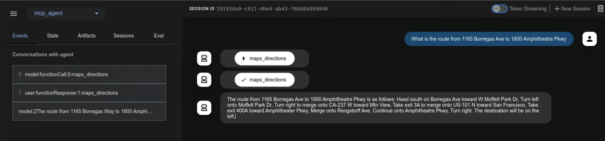

# モデルコンテキストプロトコルツール

<div class="language-support-tag">
  <span class="lst-supported">ADKでサポート</span><span class="lst-python">Python v0.1.0</span><span class="lst-typescript">TypeScript v0.2.0</span><span class="lst-go">Go v0.1.0</span><span class="lst-java">Java v0.1.0</span>
</div>

このガイドでは、ADK と MCP (Model Context Protocol) を統合する 2 つの方法を案内します。

## MCP(モデルコンテキストプロトコル)とは？

MCP (Model Context Protocol) は、Gemini や Claude のような LLM（大規模言語モデル）が外部アプリケーション、データソース、ツールと通信する方法を標準化するために設計されたオープン標準です。LLM がコンテキストを取得し、処理を実行し、さまざまなシステムとやり取りする方法を単純化する、汎用的な接続メカニズムだと考えてください。

MCP はクライアント・サーバーアーキテクチャに従い、**MCP サーバー**が **データ**（リソース）、**対話型テンプレート**（プロンプト）、**実行可能な関数**（ツール）を公開し、**MCP クライアント**（LLM をホストするアプリケーションまたは AI エージェント） がそれらをどのように利用するかを定義します。

このガイドでは、次の 2 つの主要な統合パターンを扱います。

1. **ADK 内で既存の MCP サーバーを使う:** ADK エージェントが MCP クライアントとして動作し、外部 MCP サーバーが提供するツールを利用します。
2. **MCP サーバー経由で ADK ツールを公開する:** ADK ツールをラップして、あらゆる MCP クライアントからアクセスできる MCP サーバーを構築します。

## 前提条件

始める前に、次の準備ができていることを確認してください。

* **ADK のセットアップ:** クイックスタートの標準 ADK [インストール手順](../get-started/quickstart.md/#venv-install) に従ってください。
* **Python/Java のインストール・更新:** MCP を使うには Python 3.9 以上、または Java 17 以上が必要です。
* **Node.js と `npx` のセットアップ:** **(Python のみ)** 多くのコミュニティ製 MCP サーバーは Node.js パッケージとして配布され、`npx` で実行されます。未インストールの場合は Node.js（`npx` を含む）を導入してください。詳細は [https://nodejs.org/en](https://nodejs.org/en) を参照してください。
* **インストール確認:** **(Python のみ)** 有効化した仮想環境内で `adk` と `npx` が PATH にあることを確認してください。

```shell
# どちらのコマンドも、実行ファイルのパスを出力するはずです。
which adk
which npx
```

## 1. `adk web` で ADK エージェントと MCP サーバーを使う（ADK を MCP クライアントとして）

이 섹션에서는 외부 MCP(모델 컨텍스트 프로토콜) 서버의 도구를 ADK 에이전트에 통합하는 방법을 보여줍니다. 이는 ADK 에이전트가 기존 서비스에서 제공하는 기능을 MCP 인터페이스를 통해 사용해야 할 때 **가장 일반적인** 통합 패턴입니다. `McpToolset` 클래스를 에이전트의 `tools` 목록에 직접 추가하여 MCP 서버에 원활하게 연결하고, 도구를 검색하고, 에이전트가 사용할 수 있도록 하는 방법을 확인할 수 있습니다. 이 예시는 주로 `adk web` 개발 환경 내에서의 상호 작용에 중점을 둡니다.

### `McpToolset` 클래스

`McpToolset` クラスは、ADK から MCP サーバーのツールを統合するための主要な仕組みです。エージェントの `tools` 一覧に `McpToolset` インスタンスを含めると、指定した MCP サーバーとのやり取りを自動的に処理します。動作は次のとおりです。

1.  **接続管理:** 初期化時に `McpToolset` は MCP サーバーへの接続を確立し、管理します。対象はローカルのサーバープロセス（標準入出力通信のための `StdioConnectionParams`）でも、リモートサーバー（Server-Sent Events のための `SseConnectionParams`）でもかまいません。ツールセットは、エージェントやアプリケーションの終了時にこの接続を適切に閉じる処理も担当します。
2.  **ツールの検索と変換:** 接続後、`McpToolset` は MCP サーバーに利用可能なツールを問い合わせます（`list_tools` MCP メソッド）。取得した MCP ツールのスキーマを、ADK 互換の `BaseTool` インスタンスに変換します。
3.  **エージェントへの公開:** 変換されたツールは、通常の ADK ツールと同じように `LlmAgent` から利用できます。
4.  **ツール呼び出しの中継:** `LlmAgent` がそのツールの 1 つを使うと判断すると、`McpToolset` は呼び出しを MCP サーバーへ透過的に中継し（`call_tool` MCP メソッドを使用）、必要な引数を送ってサーバーの応答をエージェントへ返します。
5.  **フィルタリング（任意）:** `McpToolset` 作成時に `tool_filter` パラメーターを使うと、MCP サーバー上の特定のツールだけをエージェントに公開できます。

次の例では、`adk web` 開発環境内で `McpToolset` を使う方法を示します。MCP 接続のライフサイクルをより細かく制御したい場合や、`adk web` を使わないシナリオでは、このページ後半の「`adk web` 外で自分のエージェントに MCP ツールを使う」セクションを参照してください。

### 例 1: ファイルシステム MCP サーバー

この Python 例では、ファイルシステム操作を提供するローカル MCP サーバーへ接続する方法を示します。

#### ステップ 1: `McpToolset` でエージェントを定義する

`agent.py` ファイル（例: `./adk_agent_samples/mcp_agent/agent.py`）を作成します。`McpToolset` は `LlmAgent` の `tools` 一覧の中で直接インスタンス化します。

*   **重要:** `args` 配列の `"/path/to/your/folder"` を、MCP サーバーがアクセスできるローカルフォルダーの **絶対パス** に置き換えてください。
*   **重要:** `.env` ファイルは `./adk_agent_samples` ディレクトリの 1 つ上の階層に置いてください。

```python
# ./adk_agent_samples/mcp_agent/agent.py
import os # パス操作に必要
from google.adk.agents import LlmAgent
from google.adk.tools.mcp_tool import McpToolset
from google.adk.tools.mcp_tool.mcp_session_manager import StdioConnectionParams
from mcp import StdioServerParameters

# 可能ならパスは動的に定義するか、
# ユーザーに絶対パスが必要なことを明確に伝えてください。
# この例では、このファイルと同じディレクトリに '/path/to/your/folder' があると仮定し、
# 相対パスから組み立てています。
# 必要に応じて、実際の絶対パスに置き換えてください。
TARGET_FOLDER_PATH = os.path.join(os.path.dirname(os.path.abspath(__file__)), "/path/to/your/folder")
# TARGET_FOLDER_PATH が MCP サーバーの絶対パスであることを確認してください。
# たとえば `./adk_agent_samples/mcp_agent/your_folder` を作成した場合、

root_agent = LlmAgent(
    model='gemini-2.0-flash',
    name='filesystem_assistant_agent',
    instruction='사용자의 파일 관리를 돕습니다. 파일을 나열하고, 파일을 읽는 등의 작업을 할 수 있습니다.',
    tools=[
       McpToolset(
            connection_params=StdioConnectionParams(
                server_params = StdioServerParameters(
                    command='npx',
                    args=[
                        "-y",  # npx가 자동 확인 설치를 위한 인수
                        "@modelcontextprotocol/server-filesystem",
                        # 중요: 이것은 npx 프로세스가 액세스할 수 있는 폴더의 절대 경로여야 합니다.
                        # 시스템의 유효한 절대 경로로 바꾸십시오.
                        # 예를 들어: "/Users/youruser/accessible_mcp_files"
                        # 또는 동적으로 구성된 절대 경로 사용:
                        os.path.abspath(TARGET_FOLDER_PATH),
                    ],
                ),
            ),
            # 任意: MCP サーバーから公開するツールをフィルタリングします。
            # tool_filter=['list_directory', 'read_file']
        )
    ],
)
```


#### ステップ 2: `__init__.py` ファイルを作成する

`agent.py` と同じディレクトリに `__init__.py` があることを確認し、ADK から見える Python パッケージにします。

```python
# ./adk_agent_samples/mcp_agent/__init__.py
from . import agent
```

#### ステップ 3: `adk web` を実行して操作する

ターミナルで `mcp_agent` の親ディレクトリ（例: `adk_agent_samples`）に移動し、次を実行します。

```shell
cd ./adk_agent_samples # 또는 해당 상위 디렉토리
adk web
```

!!!info "Windows 사용자 참고 사항"

    `_make_subprocess_transport NotImplementedError`가 발생하는 경우 대신 `adk web --no-reload`를 사용하는 것을 고려하십시오.


ADK 웹 UI가 브라우저에 로드되면:

1.  에이전트 드롭다운에서 `filesystem_assistant_agent`를 선택합니다.
2.  다음과 같은 프롬프트를 시도합니다.
    *   "현재 디렉토리의 파일 목록을 나열합니다."
    *   "sample.txt라는 파일을 읽을 수 있습니까?" ( `TARGET_FOLDER_PATH`에 생성했다고 가정).
    *   "`another_file.md`의 내용은 무엇입니까?"

에이전트가 MCP 파일 시스템 서버와 상호 작용하고 서버의 응답(파일 목록, 파일 내용)이 에이전트를 통해 전달되는 것을 볼 수 있습니다. `npx` 프로세스가 stderr로 출력하는 경우 `adk web` 콘솔(명령을 실행한 터미널)에도 로그가 표시될 수 있습니다.


Java의 경우 `McpToolset`을 초기화하는 에이전트를 정의하려면 다음 샘플을 참조하십시오.

```java
package agents;

import com.google.adk.JsonBaseModel;
import com.google.adk.agents.LlmAgent;
import com.google.adk.agents.RunConfig;
import com.google.adk.runner.InMemoryRunner;
import com.google.adk.tools.mcp.McpTool;
import com.google.adk.tools.mcp.McpToolset;
import com.google.adk.tools.mcp.McpToolset.McpToolsAndToolsetResult;
import com.google.genai.types.Content;
import com.google.genai.types.Part;
import io.modelcontextprotocol.client.transport.ServerParameters;

import java.util.List;
import java.util.concurrent.CompletableFuture;

public class McpAgentCreator {

    /**
     * McpToolset을 초기화하고, stdio를 사용하여 MCP 서버에서 도구를 검색하고,
     * 이 도구를 사용하여 LlmAgent를 생성하고, 에이전트에 프롬프트를 보내고,
     * 도구 세트가 닫히도록 합니다.
     * @param args 명령줄 인수(사용되지 않음).
     */
    public static void main(String[] args) {
        //참고: 폴더가 홈 외부인 경우 권한 문제가 발생할 수 있습니다.
        String yourFolderPath = "~/path/to/folder";

        ServerParameters connectionParams = ServerParameters.builder("npx")
                .args(List.of(
                        "-y",
                        "@modelcontextprotocol/server-filesystem",
                        yourFolderPath
                ))
                .build();

        try {
            CompletableFuture<McpToolsAndToolsetResult> futureResult = 
                    McpToolset.fromServer(connectionParams, JsonBaseModel.getMapper());

            McpToolsAndToolsetResult result = futureResult.join();

            try (McpToolset toolset = result.getToolset()) {
                List<McpTool> tools = result.getTools();

                LlmAgent agent = LlmAgent.builder()
                        .model("gemini-2.0-flash")
                        .name("enterprise_assistant")
                        .description("사용자가 파일 시스템에 액세스하도록 돕는 에이전트")
                        .instruction(
                                "사용자가 파일 시스템에 액세스하도록 돕습니다. 디렉토리의 파일을 나열할 수 있습니다."
                        )
                        .tools(tools)
                        .build();

                System.out.println("에이전트 생성: " + agent.name());

                InMemoryRunner runner = new InMemoryRunner(agent);
                String userId = "user123";
                String sessionId = "1234";
                String promptText = "이 디렉토리의 파일은 무엇입니까? - " + yourFolderPath + "?";

                // 세션을 명시적으로 먼저 생성
                try {
                    // InMemoryRunner의 appName은 생성자에서 지정되지 않으면 agent.name()으로 기본 설정됩니다.
                    runner.sessionService().createSession(runner.appName(), userId, null, sessionId).blockingGet();
                    System.out.println("세션 생성: " + sessionId + "(사용자: " + userId + ")");
                } catch (Exception sessionCreationException) {
                    System.err.println("세션 생성 실패: " + sessionCreationException.getMessage());
                    sessionCreationException.printStackTrace();
                    return;
                }

                Content promptContent = Content.fromParts(Part.fromText(promptText));

                System.out.println("\n프롬프트 전송: \"" + promptText + "\" 에이전트에...\n");

                runner.runAsync(userId, sessionId, promptContent, RunConfig.builder().build())
                        .blockingForEach(event -> {
                            System.out.println("이벤트 수신: " + event.toJson());
                        });
            }
        } catch (Exception e) {
            System.err.println("오류 발생: " + e.getMessage());
            e.printStackTrace();
        }
    }
}
```

`first`, `second`, `third`라는 세 파일이 포함된 폴더를 가정하면 성공적인 응답은 다음과 같습니다.

```shell
Event received: {"id":"163a449e-691a-48a2-9e38-8cadb6d1f136","invocationId":"e-c2458c56-e57a-45b2-97de-ae7292e505ef","author":"enterprise_assistant","content":{"parts":[{"functionCall":{"id":"adk-388b4ac2-d40e-4f6a-bda6-f051110c6498","args":{"path":"~/home-test"},"name":"list_directory"}}],"role":"model"},"actions":{"stateDelta":{},"artifactDelta":{},"requestedAuthConfigs":{}},"timestamp":1747377543788}

Event received: {"id":"8728380b-bfad-4d14-8421-fa98d09364f1","invocationId":"e-c2458c56-e57a-45b2-97de-ae7292e505ef","author":"enterprise_assistant","content":{"parts":[{"functionResponse":{"id":"adk-388b4ac2-d40e-4f6a-bda6-f051110c6498","name":"list_directory","response":{"text_output":[{"text":"[FILE] first\n[FILE] second\n[FILE] third"}]}}}],"role":"user"},"actions":{"stateDelta":{},"artifactDelta":{},"requestedAuthConfigs":{}},"timestamp":1747377544679}

Event received: {"id":"8fe7e594-3e47-4254-8b57-9106ad8463cb","invocationId":"e-c2458c56-e57a-45b2-97de-ae7292e505ef","author":"enterprise_assistant","content":{"parts":[{"text":"디렉토리에는 first, second, third의 세 파일이 있습니다."}],"role":"model"},"actions":{"stateDelta":{},"artifactDelta":{},"requestedAuthConfigs":{}},"timestamp":1747377544689}
```


### 例 2: Google Maps MCP サーバー

この例では、Google Maps MCP サーバーに接続する方法を示します。

#### ステップ 1: API キーを取得して API を有効化する

1.  **Google Maps API キー:** [API キーの作成](https://developers.google.com/maps/documentation/javascript/get-api-key#create-api-keys) の手順に従って Google Maps API キーを取得します。
2.  **API の有効化:** Google Cloud プロジェクトで次の API が有効になっていることを確認します。
    *   Directions API
    *   Routes API
    手順は [Google Maps Platform の開始](https://developers.google.com/maps/get-started#enable-api-sdk) のドキュメントを参照してください。

#### ステップ 2: Google Maps 用の `McpToolset` でエージェントを定義する

`agent.py` ファイル（例: `./adk_agent_samples/mcp_agent/agent.py`）を修正します。`YOUR_GOOGLE_MAPS_API_KEY` を取得した実際の API キーに置き換えます。

```python
# ./adk_agent_samples/mcp_agent/agent.py
import os
from google.adk.agents import LlmAgent
from google.adk.tools.mcp_tool import McpToolset
from google.adk.tools.mcp_tool.mcp_session_manager import StdioConnectionParams
from mcp import StdioServerParameters

# API キーは環境変数から取得するか、直接埋め込めます。
# 通常は環境変数を使う方が安全です。
# この環境変数は、`adk web` を実行するターミナルで設定してください。
# 例: export GOOGLE_MAPS_API_KEY="YOUR_ACTUAL_KEY"
google_maps_api_key = os.environ.get("GOOGLE_MAPS_API_KEY")

if not google_maps_api_key:
    # テスト用のフォールバックまたは直接代入 - 本番では推奨しません。
    google_maps_api_key = "YOUR_GOOGLE_MAPS_API_KEY_HERE" # 환경 변수를 사용하지 않는 경우 바꾸십시오.
    if google_maps_api_key == "YOUR_GOOGLE_MAPS_API_KEY_HERE":
        print("警告: GOOGLE_MAPS_API_KEY が設定されていません。環境変数かスクリプトで設定してください。")
        # キーが必須で見つからない場合は、エラーを投げるか終了することを検討してください。

root_agent = LlmAgent(
    model='gemini-2.0-flash',
    name='maps_assistant_agent',
    instruction='Google Maps ツールを使って、地図、経路案内、場所検索を支援します。',
    tools=[
       McpToolset(
            connection_params=StdioConnectionParams(
                server_params = StdioServerParameters(
                    command='npx',
                    args=[
                        "-y",
                        "@modelcontextprotocol/server-google-maps",
                    ],
                    # API キーを npx プロセスへ環境変数として渡します。
                    # Google Maps 用 MCP サーバーはこの形でキーを受け取ります。
                    env={
                        "GOOGLE_MAPS_API_KEY": google_maps_api_key
                    }
                ),
            ),
            # 必要に応じて、特定の地図ツールだけをフィルターできます。
            # tool_filter=['get_directions', 'find_place_by_id']
        )
    ],
)
```

#### ステップ 3: `__init__.py` があることを確認する

例 1 で作成済みならこの手順は不要です。そうでない場合は、`./adk_agent_samples/mcp_agent/` ディレクトリに `__init__.py` があることを確認してください。

```python
# ./adk_agent_samples/mcp_agent/__init__.py
from . import agent
```

#### ステップ 4: `adk web` を実行して操作する

1.  **環境変数の設定（推奨）:**
    `adk web` を実行する前に、ターミナルで Google Maps API キーを環境変数として設定するのがおすすめです。
    ```shell
    export GOOGLE_MAPS_API_KEY="YOUR_ACTUAL_GOOGLE_MAPS_API_KEY"
    ```
    `YOUR_ACTUAL_GOOGLE_MAPS_API_KEY` を実際のキーに置き換えます。

2.  **`adk web` を実行:**
    `mcp_agent` の親ディレクトリ（例: `adk_agent_samples`）へ移動して次を実行します。
    ```shell
    cd ./adk_agent_samples # 또는 해당 상위 디렉토리
adk web
    ```

3.  **UI で操作する:**
    *   `maps_assistant_agent` を選択します。
    *   次のようなプロンプトを試します。
        *   "GooglePlex から SFO までの経路を教えて。"
        *   "ゴールデンゲートパーク近くのコーヒーショップを探して。"
        *   "フランスのパリからドイツのベルリンまでのルートは？"

エージェントが Google Maps MCP ツールを使って、経路案内や位置情報ベースの情報を返すのが確認できます。




Java で `McpToolset` を初期化するエージェントを定義するには、次のサンプルを参照してください。

```java
package agents;

import com.google.adk.JsonBaseModel;
import com.google.adk.agents.LlmAgent;
import com.google.adk.agents.RunConfig;
import com.google.adk.runner.InMemoryRunner;
import com.google.adk.tools.mcp.McpTool;
import com.google.adk.tools.mcp.McpToolset;
import com.google.adk.tools.mcp.McpToolset.McpToolsAndToolsetResult;


import com.google.genai.types.Content;
import com.google.genai.types.Part;

import io.modelcontextprotocol.client.transport.ServerParameters;

import java.util.List;
import java.util.Map;
import java.util.Collections;
import java.util.HashMap;
import java.util.concurrent.CompletableFuture;
import java.util.Arrays;

public class MapsAgentCreator {

    /**
     * Google 지도용 McpToolset을 초기화하고, 도구를 검색하고,
     * LlmAgent를 생성하고, 지도 관련 프롬프트를 보내고, 도구 세트를 닫습니다.
     * @param args 명령줄 인수(사용되지 않음).
     */
    public static void main(String[] args) {
        // TODO: Places API가 활성화된 프로젝트에서 실제 Google Maps API 키로 바꾸십시오.
        String googleMapsApiKey = "YOUR_GOOGLE_MAPS_API_KEY";

        Map<String, String> envVariables = new HashMap<>();
        envVariables.put("GOOGLE_MAPS_API_KEY", googleMapsApiKey);

        ServerParameters connectionParams = ServerParameters.builder("npx")
                .args(List.of(
                        "-y",
                        "@modelcontextprotocol/server-google-maps"
                ))
                .env(Collections.unmodifiableMap(envVariables))
                .build();

        try {
            CompletableFuture<McpToolsAndToolsetResult> futureResult = 
                    McpToolset.fromServer(connectionParams, JsonBaseModel.getMapper());

            McpToolsAndToolsetResult result = futureResult.join();

            try (McpToolset toolset = result.getToolset()) {
                List<McpTool> tools = result.getTools();

                LlmAgent agent = LlmAgent.builder()
                        .model("gemini-2.0-flash")
                        .name("maps_assistant")
                        .description("지도 도우미")
                        .instruction("사용 가능한 도구를 사용하여 지도 및 길 찾기를 돕습니다.")
                        .tools(tools)
                        .build();

                System.out.println("에이전트 생성: " + agent.name());

                InMemoryRunner runner = new InMemoryRunner(agent);
                String userId = "maps-user-" + System.currentTimeMillis();
                String sessionId = "maps-session-" + System.currentTimeMillis();

                String promptText = "Madison Square Garden에서 가장 가까운 약국으로 가는 길을 알려주세요.";

                try {
                    runner.sessionService().createSession(runner.appName(), userId, null, sessionId).blockingGet();
                    System.out.println("세션 생성: " + sessionId + "(사용자: " + userId + ")");
                } catch (Exception sessionCreationException) {
                    System.err.println("세션 생성 실패: " + sessionCreationException.getMessage());
                    sessionCreationException.printStackTrace();
                    return;
                }

                Content promptContent = Content.fromParts(Part.fromText(promptText));

                System.out.println("\n프롬프트 전송: \"" + promptText + "\" 에이전트에...\n");

                runner.runAsync(userId, sessionId, promptContent, RunConfig.builder().build())
                        .blockingForEach(event -> {
                            System.out.println("이벤트 수신: " + event.toJson());
                        });
            }
        } catch (Exception e) {
            System.err.println("오류 발생: " + e.getMessage());
            e.printStackTrace();
        }
    }
}
```

성공적인 응답은 다음이 될 수 있습니다.
```shell
Event received: {"id":"1a4deb46-c496-4158-bd41-72702c773368","invocationId":"e-48994aa0-531c-47be-8c57-65215c3e0319","author":"maps_assistant","content":{"parts":[{"text":"OK. 選択肢がいくつかあります。最も近いのは、米国ニューヨーク州ニューヨーク市ペンシルバニアプラザ5番地にあるCVSファーマシーです。道案内が必要ですか？\n"}],"role":"model"},"actions":{"stateDelta":{},"artifactDelta":{},"requestedAuthConfigs":{}},"timestamp":1747380026642}
```

## 2. ADK ツールで MCP サーバーを構築する（ADK を公開する MCP サーバー）

이 패턴을 사용하면 기존 ADK 도구를 래핑하여 모든 표준 MCP 클라이언트 애플리케이션에서 사용할 수 있습니다. 이 섹션의 예시는 ADK의 `load_web_page` 도구를 사용자 정의 MCP 서버를 통해 노출하는 방법을 보여줍니다.

### 手順の概要

`mcp` 라이브러리를 사용하여 표준 Python MCP 서버 애플리케이션을 만듭니다. 이 서버 내에서 다음을 수행합니다.

1.  노출할 ADK 도구(예: `FunctionTool(load_web_page)`)를 인스턴스화합니다.
2.  ADK 도구 정의를 MCP 스키마로 변환하기 위해 `google.adk.tools.mcp_tool.conversion_utils`의 `adk_to_mcp_tool_type` 유틸리티를 사용하는 것을 포함하여, 노출할 도구를 나열하는 MCP 서버의 `@app.list_tools()` 핸들러를 구현합니다.
3.  MCP 서버의 `@app.call_tool()` 핸들러를 구현합니다. 이 핸들러는 다음을 수행합니다.
    *   MCP 클라이언트로부터 도구 호출 요청을 수신합니다.
    *   요청이 래핑된 ADK 도구 중 하나를 대상으로 하는지 식별합니다.
    *   ADK 도구의 `.run_async()` 메서드를 실행합니다.
    *   ADK 도구의 결과를 MCP 호환 형식(예: `mcp.types.TextContent`)으로 형식화합니다.

### 前提条件

ADK 설치와 동일한 Python 환경에 MCP 서버 라이브러리를 설치합니다.

```shell
pip install mcp
```

### ステップ 1: MCP サーバースクリプトを作成する

MCP 서버에 대한 새 Python 파일을 만듭니다. 예를 들어 `my_adk_mcp_server.py`입니다.

### ステップ 2: サーバーロジックを実装する

`my_adk_mcp_server.py`에 다음 코드를 추가합니다. 이 스크립트는 ADK `load_web_page` 도구를 노출하는 MCP 서버를 설정합니다.

```python
# my_adk_mcp_server.py
import asyncio
import json
import os
from dotenv import load_dotenv

# MCP サーバーのインポート
from mcp import types as mcp_types # 충돌을 피하기 위해 별칭 사용
from mcp.server.lowlevel import Server, NotificationOptions
from mcp.server.models import InitializationOptions
import mcp.server.stdio # stdio 서버로 실행하기 위해

# ADK ツールのインポート
from google.adk.tools.function_tool import FunctionTool
from google.adk.tools.load_web_page import load_web_page # ADK 도구 예시
# ADK <-> MCP 変換ユーティリティ
from google.adk.tools.mcp_tool.conversion_utils import adk_to_mcp_tool_type

# --- 環境変数の読み込み（ADK ツールで必要な場合、例: API キー） ---
load_dotenv() # 필요한 경우 동일한 디렉토리에 .env 파일 만들기

# --- ADK ツールの準備 ---
# 公開する ADK ツールをインスタンス化します。
# このツールは MCP サーバーによってラップされ、呼び出されます。
print("ADK load_web_page 도구를 초기화 중...")
adk_tool_to_expose = FunctionTool(load_web_page)
print(f"ADK 도구 '{adk_tool_to_expose.name}'이(가) 초기화되었으며 MCP를 통해 노출될 준비가 되었습니다.")
# --- ADK ツール準備終了 ---

# --- MCP サーバー設定 ---
print("MCP 서버 인스턴스를 만드는 중...")
# mcp.server ライブラリを使って名前付きの MCP サーバーインスタンスを作成します
app = Server("adk-tool-exposing-mcp-server")

# 利用可能なツールを列挙する MCP サーバーハンドラーを実装します
@app.list_tools()
async def list_mcp_tools() -> list[mcp_types.Tool]:
    """이 서버가 노출하는 도구를 나열하는 MCP 핸들러."""
    print("MCP 서버: list_tools 요청을 받았습니다.")
    # ADK 도구 정의를 MCP 도구 스키마 형식으로 변환합니다
    mcp_tool_schema = adk_to_mcp_tool_type(adk_tool_to_expose)
    print(f"MCP 서버: 도구 광고 중: {mcp_tool_schema.name}")
    return [mcp_tool_schema]

# ツール呼び出しを実行する MCP サーバーハンドラーを実装します
@app.call_tool()
async def call_mcp_tool(
    name: str,
    arguments: dict
) -> list[mcp_types.Content]: # MCP는 mcp_types.Content를 사용합니다
    """MCP 클라이언트로부터 요청된 도구 호출을 실행하는 MCP 핸들러."""
    print(f"MCP 서버: '{name}'에 대한 call_tool 요청을 받았습니다 (인수: {arguments})")

    # 요청된 도구 이름이 래핑된 ADK 도구와 일치하는지 확인합니다
    if name == adk_tool_to_expose.name:
        try:
            # ADK 도구의 run_async 메서드를 실행합니다.
            # 참고: 이 MCP 서버는 완전한 ADK Runner 호출 외부에서 ADK 도구를 실행하므로,
            # 여기서는 tool_context가 None입니다.
            # ADK 도구가 ToolContext 기능(상태 또는 인증 등)을 필요로 하는 경우,
            # 이 직접 호출에는 더 정교한 처리가 필요할 수 있습니다.
            adk_tool_response = await adk_tool_to_expose.run_async(
                args=arguments,
                tool_context=None,
            )
            print(f"MCP 서버: ADK 도구 '{name}'이(가) 실행되었습니다. 응답: {adk_tool_response}")

            # ADK 도구의 응답(종종 사전)을 MCP 호환 형식으로 형식화합니다.
            # 여기서는 응답 사전을 TextContent 내의 JSON 문자열로 직렬화합니다.
            # ADK 도구의 출력과 클라이언트의 요구 사항에 따라 형식을 조정합니다.
            response_text = json.dumps(adk_tool_response, indent=2)
            # MCP는 mcp_types.Content 파트 목록을 기대합니다
            return [mcp_types.TextContent(type="text", text=response_text)]

        except Exception as e:
            print(f"MCP 서버: ADK 도구 '{name}' 실행 중 오류 발생: {e}")
            # MCP 형식으로 오류 메시지를 반환합니다
            error_text = json.dumps({"error": f"도구 '{name}' 실행 실패: {str(e)}"})
            return [mcp_types.TextContent(type="text", text=error_text)]
    else:
        # 알 수 없는 도구에 대한 호출 처리
        print(f"MCP 서버: 도구 '{name}'은(는) 이 서버에서 구현되지 않았거나 공개되지 않았습니다.")
        error_text = json.dumps({"error": f"도구 '{name}'은(는) 이 서버에서 구현되지 않았습니다."})
        return [mcp_types.TextContent(type="text", text=error_text)]

# --- MCP サーバーランナー ---
async def run_mcp_stdio_server():
    """표준 입출력을 통해 연결을 수신 대기하는 MCP 서버를 실행합니다."""
    # mcp.server.stdio 라이브러리의 stdio_server 컨텍스트 관리자를 사용합니다
    async with mcp.server.stdio.stdio_server() as (read_stream, write_stream):
        print("MCP Stdio 서버: 클라이언트와 핸드셰이크 시작 중...")
        await app.run(
            read_stream,
            write_stream,
            InitializationOptions(
                server_name=app.name, # 위에서 정의한 서버 이름 사용
                server_version="0.1.0",
                capabilities=app.get_capabilities(
                    # 서버 기능 정의 - 옵션은 MCP 설명서 참조
                    notification_options=NotificationOptions(),
                    experimental_capabilities={},
                ),
            ),
        )
        print("MCP Stdio 서버: 실행 루프가 완료되었거나 클라이언트가 연결 해제되었습니다.")

if __name__ == "__main__":
    print("stdio를 통해 ADK 도구를 노출하기 위해 MCP 서버를 시작합니다...")
    try:
        asyncio.run(run_mcp_stdio_server())
    except KeyboardInterrupt:
        print("\nMCP 서버 (stdio)가 사용자에 의해 중지되었습니다.")
    except Exception as e:
        print(f"MCP 서버 (stdio)에서 오류 발생: {e}")
    finally:
        print("MCP 서버 (stdio) 프로세스가 종료됩니다.")
# --- MCP サーバー終了 ---
```

### ステップ 3: カスタム MCP サーバーを ADK エージェントでテストする

이제 구축한 MCP 서버의 클라이언트로 작동하는 ADK 에이전트를 만듭니다. 이 ADK 에이전트는 `McpToolset`을 사용하여 `my_adk_mcp_server.py` 스크립트에 연결합니다.

`agent.py`를 만듭니다 (예: `./adk_agent_samples/mcp_client_agent/agent.py`).

```python
# ./adk_agent_samples/mcp_client_agent/agent.py
import os
from google.adk.agents import LlmAgent
from google.adk.tools.mcp_tool import McpToolset
from google.adk.tools.mcp_tool.mcp_session_manager import StdioConnectionParams
from mcp import StdioServerParameters

# 重要: ここを my_adk_mcp_server.py スクリプトへの絶対パスに置き換えてください
PATH_TO_YOUR_MCP_SERVER_SCRIPT = "/path/to/your/my_adk_mcp_server.py" # <<< 바꾸십시오

if PATH_TO_YOUR_MCP_SERVER_SCRIPT == "/path/to/your/my_adk_mcp_server.py":
    print("경고: PATH_TO_YOUR_MCP_SERVER_SCRIPT가 설정되지 않았습니다. agent.py에서 업데이트하십시오.")
    # 옵션으로, 경로가 중요하면 오류 발생

root_agent = LlmAgent(
    model='gemini-2.0-flash',
    name='web_reader_mcp_client_agent',
    instruction="사용자가 제공한 URL에서 콘텐츠를 가져오기 위해 'load_web_page' 도구를 사용하십시오.",
    tools=[
       McpToolset(
            connection_params=StdioConnectionParams(
                server_params = StdioServerParameters(
                    command='python3', # MCP 서버 스크립트를 실행하는 명령
                    args=[PATH_TO_YOUR_MCP_SERVER_SCRIPT], # 스크립트에 대한 경로가 인수입니다
                )
            )
            # tool_filter=['load_web_page'] # 옵션: 특정 도구만 로드되도록 합니다
        )
    ],
)
```

그리고 같은 디렉토리에 `__init__.py`를 배치합니다.
```python
# ./adk_agent_samples/mcp_client_agent/__init__.py
from . import agent
```

**테스트를 실행하려면:**

1.  **사용자 정의 MCP 서버 시작 (옵션, 별도 모니터링용):**
    하나의 터미널에서 `my_adk_mcp_server.py`를 직접 실행하여 로그를 볼 수 있습니다.
    ```shell
    python3 /path/to/your/my_adk_mcp_server.py
    ```
    "Launching MCP Server..."가 출력되고 대기합니다. ADK 에이전트 (`adk web`을 통해 실행)는 `StdioConnectionParams`의 `command`가 이를 실행하도록 설정된 경우 이 프로세스에 연결합니다.
    *(또는 `McpToolset`은 에이전트가 초기화될 때 이 서버 스크립트를 하위 프로세스로 자동 시작합니다.)*

2.  **클라이언트 에이전트에 대해 `adk web` 실행:**
    `mcp_client_agent`의 상위 디렉토리 (예: `adk_agent_samples`)로 이동하여 다음 명령을 실행합니다.
    ```shell
    cd ./adk_agent_samples # 또는 해당 상위 디렉토리
    adk web
    ```

3.  **ADK Web UI에서 상호 작용:**
    *   `web_reader_mcp_client_agent`를 선택합니다.
    *   "https://example.com에서 콘텐츠 읽기"와 같은 프롬프트를 시도합니다.

ADK 에이전트 (`web_reader_mcp_client_agent`)는 `McpToolset`을 사용하여 `my_adk_mcp_server.py`를 시작하고 연결합니다. MCP 서버는 `call_tool` 요청을 수신하고 ADK `load_web_page` 도구를 실행하여 결과를 반환합니다. ADK 에이전트는 이 정보를 전달합니다. ADK Web UI (및 해당 터미널)와 별도로 실행된 경우 `my_adk_mcp_server.py` 터미널 모두에서 로그를 볼 수 있어야 합니다.

이 예시는 ADK 도구가 MCP 서버 내에 캡슐화되어 ADK 에이전트뿐만 아니라 더 광범위한 MCP 호환 클라이언트에서도 액세스할 수 있는 방법을 보여줍니다.

Claude Desktop에서 시도하려면 [문서](https://modelcontextprotocol.io/quickstart/server#core-mcp-concepts)를 참조하십시오.

## `adk web` の外で自分の Agent から MCP ツールを使う

이 섹션은 다음 경우에 적용됩니다.

* ADK를 사용하여 자체 Agent를 개발 중
* 그리고 `adk web`을 **사용하지 않음**
* 그리고 자체 UI를 통해 Agent를 노출 중


MCP 도구를 사용하려면 MCP 도구 사양이 원격 또는 별도의 프로세스에서 실행되는 MCP 서버에서 비동기적으로 페치되므로 일반 도구를 사용하는 것보다 다른 설정이 필요합니다.

다음 예시는 위의 "예시 1: 파일 시스템 MCP 서버" 예시를 수정한 것입니다. 주요 차이점은 다음과 같습니다.

1. 도구와 에이전트가 비동기적으로 생성됩니다
2. MCP 서버에 대한 연결이 닫힐 때 에이전트와 도구가 올바르게 폐기되도록 종료 스택을 올바르게 관리해야 합니다.

```python
# agent.py（必要に応じて get_tools_async などを修正）
# ./adk_agent_samples/mcp_agent/agent.py
import os
import asyncio
from dotenv import load_dotenv
from google.genai import types
from google.adk.agents.llm_agent import LlmAgent
from google.adk.runners import Runner
from google.adk.sessions import InMemorySessionService
from google.adk.artifacts.in_memory_artifact_service import InMemoryArtifactService # 옵션
from google.adk.tools.mcp_tool import McpToolset
from google.adk.tools.mcp_tool.mcp_session_manager import StdioConnectionParams
from mcp import StdioServerParameters

# 親ディレクトリの .env ファイルから環境変数を読み込みます
# API キーなどの環境変数を使う前に、これを先頭に置きます
load_dotenv('../.env')

# TARGET_FOLDER_PATH が MCP サーバーの絶対パスであることを確認します。
TARGET_FOLDER_PATH = os.path.join(os.path.dirname(os.path.abspath(__file__)), "/path/to/your/folder")

# --- ステップ 1: エージェント定義 ---
async def get_agent_async():
  """MCP 서버의 도구를 갖춘 ADK 에이전트를 만듭니다."""
  toolset =McpToolset(
      # 로컬 프로세스 통신에는 StdioConnectionParams 사용
      connection_params=StdioConnectionParams(
          server_params = StdioServerParameters(
            command='npx', # 서버를 실행할 명령
            args=["-y",    # 명령 인수
                "@modelcontextprotocol/server-filesystem",
                TARGET_FOLDER_PATH],
          ),
      ),
      tool_filter=['read_file', 'list_directory'] # 옵션: 특정 도구 필터링
      # 원격 서버의 경우 대신 SseConnectionParams를 사용합니다.
      # connection_params=SseConnectionParams(url="http://remote-server:port/path", headers={...})
  )

  # 에이전트에서 사용
  root_agent = LlmAgent(
      model='gemini-2.0-flash', # 필요에 따라 모델 이름 변경
      name='enterprise_assistant',
      instruction='사용자가 파일 시스템에 액세스하도록 돕습니다',
      tools=[toolset], # ADK 에이전트에 MCP 도구 제공
  )
  return root_agent, toolset

# --- ステップ 2: メイン実行ロジック ---
async def async_main():
  session_service = InMemorySessionService()
  # 이 예시에서는 아티팩트 서비스가 필요하지 않을 수 있습니다
  artifacts_service = InMemoryArtifactService()

  session = await session_service.create_session(
      state={}, app_name='mcp_filesystem_app', user_id='user_fs'
  )

  # TODO: 쿼리를 지정된 폴더와 관련된 것으로 변경합니다.
  # 예: "documents 하위 폴더의 파일 나열" 또는 "notes.txt 파일 읽기"
  query = "tests 폴더의 파일 나열"
  print(f"사용자 쿼리: '{query}'")
  content = types.Content(role='user', parts=[types.Part(text=query)])

  root_agent, toolset = await get_agent_async()

  runner = Runner(
      app_name='mcp_filesystem_app',
      agent=root_agent,
      artifact_service=artifacts_service, # 옵션
      session_service=session_service,
  )

  print("에이전트 실행 중...")
  events_async = runner.run_async(
      session_id=session.id, user_id=session.user_id, new_message=content
  )

  async for event in events_async:
    print(f"이벤트 수신: {event}")

  # 정리 작업은 에이전트 프레임워크에서 자동으로 처리됩니다
  # 그러나 필요한 경우 수동으로 닫을 수도 있습니다.
  print("MCP 서버 연결 닫는 중...")
  await toolset.close()
  print("정리 완료.")

if __name__ == '__main__':
  try:
    asyncio.run(async_main())
  except Exception as e:
    print(f"오류 발생: {e}")
```


## 重要な考慮事項

MCP와 ADK를 사용할 때 다음 사항을 염두에 두십시오.

*   **프로토콜 및 라이브러리:** MCP는 통신 규칙을 정의하는 프로토콜 사양입니다. ADK는 에이전트를 구축하기 위한 Python 라이브러리/프레임워크입니다. McpToolset은 ADK 프레임워크 내에서 MCP 프로토콜의 클라이언트 측을 구현하여 이를 연결합니다. 반대로 Python에서 MCP 서버를 구축하려면 model-context-protocol 라이브러리를 사용해야 합니다.

*   **ADK 도구 및 MCP 도구:**

    *   ADK 도구(BaseTool, FunctionTool, AgentTool 등)는 ADK의 LlmAgent 및 Runner 내에서 직접 사용하도록 설계된 Python 객체입니다.
    *   MCP 도구는 프로토콜의 스키마를 따르는 MCP 서버에서 노출하는 기능입니다. McpToolset은 이를 LlmAgent에 ADK 도구처럼 보이게 합니다.

*   **비동기성:** ADK 및 MCP Python 라이브러리 모두 asyncio Python 라이브러리를 광범위하게 사용합니다. 도구 구현 및 서버 핸들러는 일반적으로 비동기 함수여야 합니다.

*   **상태 저장 세션 (MCP):** MCP는 클라이언트와 서버 인스턴스 간에 상태 저장 및 지속적인 연결을 설정합니다. 이는 일반적인 상태 비저장 REST API와 다릅니다.

    *   **배포:** 이 상태 저장 특성은 특히 많은 사용자를 처리하는 원격 서버의 경우 확장 및 배포에 문제를 야기할 수 있습니다. 원래 MCP 설계에서는 클라이언트와 서버가 동일한 위치에 있다고 가정하는 경우가 많았습니다. 이러한 지속적인 연결을 관리하려면 신중한 인프라 고려 사항(예: 로드 밸런싱, 세션 선호도)이 필요합니다.
    *   **ADK McpToolset:** 이 연결 수명 주기를 관리합니다. 예시에 표시된 exit_stack 패턴은 ADK 에이전트가 종료될 때 연결(및 잠재적으로 서버 프로세스)이 올바르게 종료되도록 하는 데 매우 중요합니다.

## MCP ツールを使ったエージェントのデプロイ

MCP 도구를 사용하는 ADK 에이전트를 Cloud Run, GKE 또는 Vertex AI Agent Engine과 같은 프로덕션 환경에 배포할 때 컨테이너화된 분산 환경에서 MCP 연결이 작동하는 방식을 고려해야 합니다.

### 重要なデプロイ要件: 同期エージェント定義

**⚠️ 중요:** MCP 도구를 사용하여 에이전트를 배포할 때 에이전트와 해당 McpToolset은 `agent.py` 파일에서 **동기적으로** 정의해야 합니다. `adk web`은 비동기 에이전트 생성을 허용하지만 프로덕션 환경에서는 동기 인스턴스화가 필요합니다.

```python
# ✅ 正しい方法: 本番向けの同期エージェント定義
import os
from google.adk.agents.llm_agent import LlmAgent
from google.adk.tools.mcp_tool import McpToolset
from google.adk.tools.mcp_tool.mcp_session_manager import StdioConnectionParams
from mcp import StdioServerParameters

_allowed_path = os.path.dirname(os.path.abspath(__file__))

root_agent = LlmAgent(
    model='gemini-2.0-flash',
    name='enterprise_assistant',
    instruction=f'사용자가 파일 시스템에 액세스하도록 돕습니다. 허용된 디렉토리: {_allowed_path}',
    tools=[
       McpToolset(
            connection_params=StdioConnectionParams(
                server_params=StdioServerParameters(
                    command='npx',
                    args=['-y', '@modelcontextprotocol/server-filesystem', _allowed_path],
                ),
                timeout=5,  # 적절한 타임아웃 설정
            ),
            # 프로덕션 보안을 위해 도구 필터링
            tool_filter=[
                'read_file', 'read_multiple_files', 'list_directory',
                'directory_tree', 'search_files', 'get_file_info',
                'list_allowed_directories',
            ],
        )
    ],
)
```

```python
# ❌ 誤った方法: 非同期パターンは本番では動きません
async def get_agent():  # 이것은 프로덕션에서 작동하지 않습니다
    toolset = await create_mcp_toolset_async()
    return LlmAgent(tools=[toolset])
```

### すばやいデプロイコマンド

#### Vertex AI Agent Engine
```bash
postdatauv run adk deploy agent_engine \
  --project=<your-gcp-project-id> \
  --region=<your-gcp-region> \
  --staging_bucket="gs://<your-gcs-bucket>" \
  --display_name="My MCP Agent" \
  ./path/to/your/agent_directory
```

#### Cloud Run
```bash
postdatauv run adk deploy cloud_run \
  --project=<your-gcp-project-id> \
  --region=<your-gcp-region> \
  --service_name=<your-service-name> \
  ./path/to/your/agent_directory
```

### デプロイパターン

#### パターン 1: 自己完結型の Stdio MCP サーバー

`@modelcontextprotocol/server-filesystem`과 같이 npm 패키지 또는 Python 모듈로 패키지화할 수 있는 MCP 서버의 경우 에이전트 컨테이너에 직접 포함할 수 있습니다.

**컨테이너 요구 사항:**
```dockerfile
# npm 기반 MCP 서버 예시
FROM python:3.13-slim

# MCP 서버용 Node.js 및 npm 설치
RUN apt-get update && apt-get install -y nodejs npm && rm -rf /var/lib/apt/lists/*

# Python 종속성 설치
COPY requirements.txt .
RUN pip install -r requirements.txt

# 에이전트 코드 복사
COPY . .

# 이제 에이전트는 'npx' 명령으로 StdioConnectionParams를 사용할 수 있습니다
CMD ["python", "main.py"]
```

**에이전트 구성:**
```python
# npx와 MCP 서버가 동일한 환경에서 실행되므로 컨테이너에서 작동합니다
McpToolset(
    connection_params=StdioConnectionParams(
        server_params=StdioServerParameters(
            command='npx',
            args=["-y", "@modelcontextprotocol/server-filesystem", "/app/data"],
        ),
    ),
)
```

#### パターン 2: リモート MCP サーバー（ストリーミング可能な HTTP）

확장성이 필요한 프로덕션 환경 배포의 경우 MCP 서버를 별도의 서비스로 배포하고 스트리밍 가능한 HTTP를 통해 연결합니다.

**MCP 서버 배포 (Cloud Run):**
```python
# deploy_mcp_server.py - 스트리밍 가능한 HTTP를 사용하는 별도의 Cloud Run 서비스
import contextlib
import logging
from collections.abc import AsyncIterator
from typing import Any

import anyio
import click
import mcp.types as types
from mcp.server.lowlevel import Server
from mcp.server.streamable_http_manager import StreamableHTTPSessionManager
from starlette.applications import Starlette
from starlette.routing import Mount
from starlette.types import Receive, Scope, Send

logger = logging.getLogger(__name__)

def create_mcp_server():
    """MCP 서버를 생성하고 구성합니다."""
    app = Server("adk-mcp-streamable-server")

    @app.call_tool()
    async def call_tool(name: str, arguments: dict[str, Any]) -> list[types.ContentBlock]:
        """MCP 클라이언트로부터 도구 호출을 처리합니다."""
        # 도구 구현 예시 - 실제 ADK 도구로 바꾸십시오
        if name == "example_tool":
            result = arguments.get("input", "입력이 제공되지 않았습니다")
            return [
                types.TextContent(
                    type="text",
                    text=f"처리됨: {result}"
                )
            ]
        else:
            raise ValueError(f"알 수 없는 도구: {name}")

    @app.list_tools()
    async def list_tools() -> list[types.Tool]:
        """사용 가능한 도구를 나열합니다."""
        return [
            types.Tool(
                name="example_tool",
                description="데모용 도구 예시",
                inputSchema={
                    "type": "object",
                    "properties": {
                        "input": {
                            "type": "string",
                            "description": "처리할 입력 텍스트"
                        }
                    },
                    "required": ["input"]
                }
            )
        ]

    return app

def main(port: int = 8080, json_response: bool = False):
    """메인 서버 함수."""
    logging.basicConfig(level=logging.INFO)

    app = create_mcp_server()

    # 확장성을 위해 상태 비저장 모드로 세션 관리자 생성
    session_manager = StreamableHTTPSessionManager(
        app=app,
        event_store=None,
        json_response=json_response,
        stateless=True,  # Cloud Run 확장성에 중요
    )

    async def handle_streamable_http(scope: Scope, receive: Receive, send: Send) -> None:
        await session_manager.handle_request(scope, receive, send)

    @contextlib.asynccontextmanager
    async def lifespan(app: Starlette) -> AsyncIterator[None]:
        """세션 관리자의 수명 주기 관리"""
        async with session_manager.run():
            logger.info("MCP 스트리밍 가능한 HTTP 서버가 시작되었습니다!")
            try:
                yield
            finally:
                logger.info("MCP 서버 종료 중...")

    # ASGI 애플리케이션 생성
    starlette_app = Starlette(
        debug=False,  # 프로덕션에서는 False로 설정
        routes=[
            Mount("/mcp", app=handle_streamable_http),
        ],
        lifespan=lifespan,
    )

    import uvicorn
    uvicorn.run(starlette_app, host="0.0.0.0", port=port)

if __name__ == "__main__":
    main()
```

**원격 MCP의 에이전트 구성:**
```python
# ADK 에이전트는 스트리밍 가능한 HTTP를 통해 원격 MCP 서비스에 연결합니다
McpToolset(
    connection_params=StreamableHTTPConnectionParams(
        url="https://your-mcp-server-url.run.app/mcp",
        headers={"Authorization": "Bearer your-auth-token"}
    ),
)
```

#### パターン 3: サイドカー MCP サーバー（GKE）

Kubernetes 환경에서는 MCP 서버를 사이드카 컨테이너로 배포할 수 있습니다.

```yaml
# deployment.yaml - MCP 사이드카가 있는 GKE
apiVersion: apps/v1
kind: Deployment
metadata:
  name: adk-agent-with-mcp
spec:
  template:
    spec:
      containers:
      # 메인 ADK 에이전트 컨테이너
      - name: adk-agent
        image: your-adk-agent:latest
        ports:
        - containerPort: 8080
        env:
        - name: MCP_SERVER_URL
          value: "http://localhost:8081"

      # MCP 서버 사이드카
      - name: mcp-server
        image: your-mcp-server:latest
        ports:
        - containerPort: 8081
```

### 接続管理の考慮事項

#### Stdio 接続
- **장점:** 간단한 설정, 프로세스 분리, 컨테이너에서 잘 작동
- **단점:** 프로세스 오버헤드, 대규모 배포에는 적합하지 않음
- **최적:** 개발, 단일 테넌트 배포, 간단한 MCP 서버

#### SSE/HTTP 接続
- **장점:** 네트워크 기반, 확장 가능, 여러 클라이언트 처리 가능
- **단점:** 네트워크 인프라 필요, 인증 복잡성
- **최적:** 프로덕션 배포, 멀티 테넌트 시스템, 외부 MCP 서비스

### 本番デプロイのチェックリスト

MCP 도구를 사용하는 에이전트를 프로덕션 환경에 배포할 때:

**✅ 연결 수명 주기**
- `exit_stack` 패턴을 사용하여 MCP 연결의 적절한 정리 보장
- 연결 설정 및 요청에 적절한 타임아웃 설정
- 일시적인 연결 실패에 대한 재시도 로직 구현

**✅ 리소스 관리**
- stdio MCP 서버를 사용할 때 컨테이너 메모리 사용량 모니터링
- MCP 서버 프로세스에 적절한 CPU/메모리 제한 설정
- 원격 MCP 서버의 연결 풀링 고려

**✅ 보안**
- 원격 MCP 연결에 인증 헤더 사용
- ADK 에이전트와 MCP 서버 간의 네트워크 액세스 제한
- **`tool_filter`를 사용하여 MCP 도구를 필터링하여 노출되는 기능 제한**
- 주입 공격을 방지하기 위해 MCP 도구 입력 유효성 검사
- 파일 시스템 MCP 서버에 제한된 파일 경로 사용 (예: `os.path.dirname(os.path.abspath(__file__))`)
- 프로덕션 환경에서는 읽기 전용 도구 필터 고려

**✅ 모니터링 및 가시성**
- MCP 연결 설정 및 종료 이벤트 로깅
- MCP 도구 실행 시간 및 성공률 모니터링
- MCP 연결 실패에 대한 경고 설정

**✅ 확장성**
- 대규모 배포의 경우 stdio보다 원격 MCP 서버 선호
- 상태 저장 MCP 서버를 사용할 때 세션 선호도 구성
- MCP 서버 연결 제한 고려 및 서킷 브레이커 구현

### 環境別の構成

#### Cloud Run
```python
# MCP 구성을 위한 Cloud Run 환경 변수
import os

# Cloud Run 환경 감지
if os.getenv('K_SERVICE'):
    # Cloud Run에서 원격 MCP 서버 사용
    mcp_connection = SseConnectionParams(
        url=os.getenv('MCP_SERVER_URL'),
        headers={'Authorization': f"Bearer {os.getenv('MCP_AUTH_TOKEN')}"}
    )
else:
    # 로컬 개발에는 stdio 사용
    mcp_connection = StdioConnectionParams(
        server_params=StdioServerParameters(
            command='npx',
            args=["-y", "@modelcontextprotocol/server-filesystem", "/tmp"]
        )
    )

McpToolset(connection_params=mcp_connection)
```

#### GKE
```python
# GKE별 MCP 구성
# 클러스터 내 MCP 서버에 서비스 검색 사용
McpToolset(
    connection_params=SseConnectionParams(
        url="http://mcp-service.default.svc.cluster.local:8080/sse"
    ),
)
```

#### Vertex AI Agent Engine
```python
# Agent Engine 관리 배포
# 경량의 자체 포함 MCP 서버 또는 외부 서비스 선호
McpToolset(
    connection_params=SseConnectionParams(
        url="https://your-managed-mcp-service.googleapis.com/sse",
        headers={'Authorization': 'Bearer $(gcloud auth print-access-token)'}
    ),
)
```

### デプロイのトラブルシューティング

**일반적인 MCP 배포 문제:**

1.  **Stdio 프로세스 시작 실패**
    ```python
    # stdio 연결 문제 디버깅
McpToolset(
    connection_params=StdioConnectionParams(
        server_params=StdioServerParameters(
            command='npx',
            args=["-y", "@modelcontextprotocol/server-filesystem", "/app/data"],
            # 환경 디버깅 추가
            env={'DEBUG': '1'}
        ),
    ),
)
    ```

2.  **네트워크 연결 문제**
    ```python
    # 원격 MCP 연결 테스트
    import aiohttp

    async def test_mcp_connection():
        async with aiohttp.ClientSession() as session:
            async with session.get('https://your-mcp-server.com/health') as resp:
                print(f"MCP 서버 상태: {resp.status}")
    ```

3.  **리소스 고갈**
    - stdio MCP 서버를 사용할 때 컨테이너 메모리 사용량 모니터링
    - Kubernetes 배포에 적절한 제한 설정
    - 리소스 집약적인 작업에는 원격 MCP 서버 사용

## 追加リソース

*   [Model Context Protocol 문서](https://modelcontextprotocol.io/ )
*   [MCP 사양](https://modelcontextprotocol.io/specification/)
*   [MCP Python SDK 및 예시](https://github.com/modelcontextprotocol/)

```
