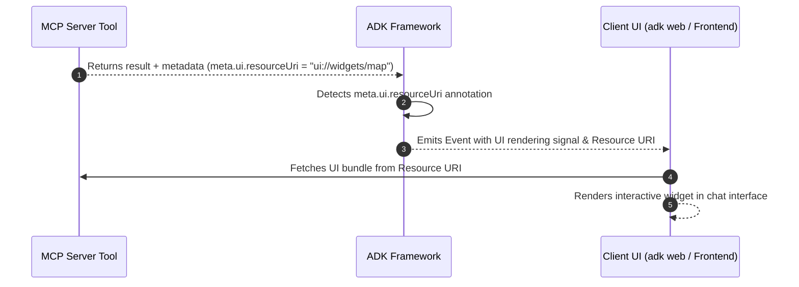

# 高度な MCP 構成

<div class="language-support-tag">
  <span class="lst-supported">ADKでサポート</span><span class="lst-python">Python v0.1.0</span>
</div>

このガイドでは、ADK における Model Context Protocol (MCP) の高度な統合パターンについて説明します。動的なユーザー単位の認証、Human-in-the-loop の承認、長時間実行される進行状況の追跡、カスタム ランタイム実行、およびエンタープライズ クラウド デプロイのための本番パターンを提供します。

## 高度な構成パターン

本番環境のワークロードに適した構成メカニズムを選択するには、以下のマトリックスを使用してください。

| 開発者の要件 | 推奨メカニズム | 主要な API / パラメータ | 代表的なシナリオ |
| :--- | :--- | :--- | :--- |
| **ユーザーごとの認証情報または動的セッション トークンの挿入** | Dynamic Header Provider | `header_provider=...` | マルチテナント アプリ、ユーザーごとの JWT/OAuth トークン |
| **危険なツール呼び出し前の承認要求** | Tool Confirmation | `require_confirmation=...` | データベースの変更、破壊的なシェル/ファイル操作 |
| **長時間操作のリアルタイム進行状況ストリーミング** | Progress Callback & Factory | `progress_callback=...` | 大規模な SQL クエリ、Web スクレイピング、データ インデックス作成 |
| **`adk web` なしでの FastAPI / バックエンド サービスでのエージェント実行** | Programmatic Runner Lifecycle | `Runner` + `await toolset.close()` | カスタム マイクロサービス、CLI ツール、ワーカー キュー |
| **複数サーバー間でのツールの名前衝突の解決** | Tool Namespacing & Filtering | `tool_name_prefix`, `tool_filter` | 複数の MCP サーバーの集約 (DB + GitHub) |
| **サーバーから要求されたサンプリングまたは認証チャレンジの処理** | Bi-directional Protocol Callbacks | `sampling_callback`, `elicitation_callback` | サーバー主導の LLM 生成および認証プロンプト |
| **生の STDERR 診断ストリームの検査** | Diagnostic Stream Logging | `errlog=sys.stderr` | MCP サブプロセスのクラッシュのトラブルシューティング |
| **チャット内でのリッチでインタラクティブなビジュアル ウィジェットのレンダリング** | Experimental UI Rendering | `meta.ui.resourceUri` | 地図、グラフ、天気カード、またはカスタム フォーム |

---

## 動的認証とユーザーごとのヘッダー (`header_provider`)

マルチテナント システムやユーザー向けシステムでは、接続パラメータに認証情報をハードコードすることは安全ではありません。`McpToolset` は `header_provider` をサポートしています。これは、アクティブな `ReadonlyContext` を受け取り、ツール呼び出しごとに認証ヘッダーを動的に構築する非同期または同期の呼び出し可能オブジェクトです。

```python
from google.adk.agents import LlmAgent
from google.adk.agents.readonly_context import ReadonlyContext
from google.adk.tools.mcp_tool import McpToolset, StreamableHTTPConnectionParams

async def extract_per_user_headers(context: ReadonlyContext) -> dict[str, str]:
    """ターンごとにセッション状態またはユーザーごとのトークンを動的に抽出します。"""
    user_token = context.state.get("user_access_token", "ANONYMOUS_TOKEN")
    return {
        "Authorization": f"Bearer {user_token}",
        "X-User-ID": context.user_id,
        "X-Session-ID": context.session.id,  # session.id へのアクセス
    }

toolset = McpToolset(
    connection_params=StreamableHTTPConnectionParams(
        url="https://mcp-server.example.com/mcp",
        timeout=5,
        sse_read_timeout=300,
    ),
    header_provider=extract_per_user_headers,
)
```

---

## Human-in-the-loop とツールの確認 (`require_confirmation`)

MCP サーバーは、データベース スキーマの変更やレコードの削除など、影響の大きい機能を公開する場合があります。ツールセット内のすべてのツールにグローバルに確認を適用することも、ツールの引数を検査する述語関数を介して条件付きで適用することもできます。

```python
from typing import Any
from google.adk.agents import LlmAgent
from google.adk.tools.mcp_tool import McpToolset
from google.adk.tools.mcp_tool.mcp_session_manager import StdioConnectionParams
from mcp import StdioServerParameters

def should_require_approval(query: str = "", **kwargs) -> bool:
    query_str = str(query).lower()
    destructive_keywords = ["drop", "delete", "truncate", "alter", "update"]
    return any(keyword in query_str for keyword in destructive_keywords)

toolset = McpToolset(
    connection_params=StdioConnectionParams(
        server_params=StdioServerParameters(
            command="npx",
            args=["-y", "@modelcontextprotocol/server-postgres", "postgresql://localhost/db"],
        ),
        timeout=5,
    ),
    require_confirmation=should_require_approval,  # ブール値 (True) も指定可能
)

root_agent = LlmAgent(
    model="gemini-flash-latest",
    name="db_administrator",
    instruction="Execute database queries safely with explicit approval for mutations.",
    tools=[toolset],
)
```

---

## リアルタイムの進行状況追跡 (`progress_callback`)

大規模な Web サイトのスクレイピングやトレーニング ジョブなど、長時間実行される MCP 操作は、`notifications/progress` チャネル経由で中間の進行状況通知を送信します。

### オプション A: グローバル コールバック関数
単純なログ記録や進行状況レポートのために共有コールバックを割り当てます。

```python
async def on_mcp_progress(progress: float, total: float | None, message: str | None) -> None:
    percentage = (progress / total * 100) if total else progress
    print(f"[MCP Progress] {percentage:.1f}% complete: {message or 'Working...'}")

toolset = McpToolset(
    connection_params=...,
    progress_callback=on_mcp_progress,
)
```

### オプション B: ツールごとのコールバック ファクトリ (セッション対応)
`ToolContext.state` への書き込みアクセス権を持つツール固有のコールバックを注入するには、`ProgressCallbackFactory` を使用します。

```python
from google.adk.tools.tool_context import ToolContext

def create_tool_progress_tracker(tool_name: str, callback_context: ToolContext, **kwargs):
    """カスタム進行状況ハンドラーを生成し、アクティブなエージェント セッション状態を更新します。"""
    async def progress_handler(progress: float, total: float | None, message: str | None):
        callback_context.state[f"{tool_name}_status"] = message
        callback_context.state[f"{tool_name}_progress"] = progress
    return progress_handler

toolset = McpToolset(
    connection_params=...,
    progress_callback=create_tool_progress_tracker,
)
```

---

## スタンドアロン ランナーの実行 (`adk web` の外部)

ADK エージェントをカスタム FastAPI アプリケーション、バックグラウンド ワーカー、またはスタンドアロン CLI スクリプトに組み込む場合は、`Runner` をインスタンス化し、`await toolset.close()` を介してライフサイクルの終了処理を明示的に管理します。

```python
import asyncio
import os
from google.genai import types
from google.adk.agents import LlmAgent
from google.adk.runners import Runner
from google.adk.sessions import InMemorySessionService
from google.adk.tools.mcp_tool import McpToolset
from google.adk.tools.mcp_tool.mcp_session_manager import StdioConnectionParams
from mcp import StdioServerParameters

async def run_standalone_mcp_agent():
    # 1. McpToolset と Agent を同期的に定義
    toolset = McpToolset(
        connection_params=StdioConnectionParams(
            server_params=StdioServerParameters(
                command="npx",
                args=["-y", "@modelcontextprotocol/server-filesystem", os.path.abspath("./data")],
            ),
            timeout=5,
        ),
        tool_filter=["list_directory", "read_file"],
    )

    agent = LlmAgent(
        model="gemini-flash-latest",
        name="filesystem_assistant",
        instruction="Assist users with file management.",
        tools=[toolset],
    )

    # 2. Session と Runner のセットアップ
    session_service = InMemorySessionService()
    session = await session_service.create_session(
        app_name="standalone_mcp_app",
        user_id="user_001",
    )

    runner = Runner(
        app_name="standalone_mcp_app",
        agent=agent,
        session_service=session_service,
    )

    try:
        # 3. エージェントの実行をストリーミング
        user_message = types.Content(
            role="user",
            parts=[types.Part(text="List the files available in the directory.")],
        )

        async for event in runner.run_async(
            session_id=session.id,
            user_id=session.user_id,
            new_message=user_message,
        ):
            if event.content and event.content.parts:
                for part in event.content.parts:
                    if part.text:
                        print(part.text, end="", flush=True)
    finally:
        # 4. サブプロセスとネットワーク接続を正常に終了
        print("\nTerminating MCP connection...")
        await toolset.close()

if __name__ == "__main__":
    asyncio.run(run_standalone_mcp_agent())
```

---

## 名前の衝突とツールの名前空間化 (`tool_name_prefix`)

複数の MCP サーバーに接続すると、`query` や `search` などのツール名が競合する可能性があります。`tool_name_prefix` を使用して、検出されたツールに自動的に名前空間を付けます。

```python
from google.adk.tools.mcp_tool import McpToolset
from google.adk.tools.mcp_tool.mcp_session_manager import StdioConnectionParams
from mcp import StdioServerParameters

postgres_toolset = McpToolset(
    connection_params=StdioConnectionParams(
        server_params=StdioServerParameters(
            command="npx",
            args=["-y", "@modelcontextprotocol/server-postgres", "postgresql://localhost/db"],
        )
    ),
    tool_name_prefix="pg_",  # pg_query, pg_list_tables を生成
)

github_toolset = McpToolset(
    connection_params=StdioConnectionParams(
        server_params=StdioServerParameters(
            command="npx",
            args=["-y", "@modelcontextprotocol/server-github"],
        )
    ),
    tool_name_prefix="gh_",  # gh_search_repositories, gh_create_issue を生成
)
```

---

## 双方向プロトコル フック: サンプリングと導出

Model Context Protocol は、サーバーがクライアントにアクションを要求できる双方向の対話をサポートしています。
- **サンプリング (`sampling_callback`)**: MCP サーバーが ADK ホストに LLM 補完の生成を要求できるようにします。
- **導出 (Elicitation, `elicitation_callback`)**: MCP サーバーがアウトオブバンドのユーザー インタラクションや認証フローを要求できるようにします。

```python
from mcp import SamplingCapability
from google.adk.tools.mcp_tool import McpToolset

async def handle_server_sampling(params):
    """サーバー主導の LLM 生成リクエストを処理します。"""
    return {
        "role": "assistant",
        "content": {"type": "text", "text": "Generated response from ADK"},
    }

async def handle_server_elicitation(params):
    """サーバーからの認証または対話型の課題を処理します。"""
    print(f"Elicitation requested: {params}")
    return {"action": "approved"}

toolset = McpToolset(
    connection_params=...,
    sampling_callback=handle_server_sampling,
    sampling_capabilities=SamplingCapability(),
    elicitation_callback=handle_server_elicitation,
)
```

---

## 診断ロギングとエラー ストリーム (`errlog`)

デフォルトでは、MCP サブプロセスのエラーは標準エラー出力に記録されます。根本原因のデバッグのために、STDERR ストリームを外部ファイルまたは診断バッファにリダイレクトできます。

```python
import sys
from google.adk.tools.mcp_tool import McpToolset

error_file = open("mcp_server_errors.log", "a")
try:
    toolset = McpToolset(connection_params=..., errlog=error_file)
    # エージェントを実行...
finally:
    await toolset.close()
    error_file.close()
```

## インタラクティブな UI ウィジェットのレンダリング

標準の MCP ツールは、プレーン テキストまたは JSON 出力を返します。この機能により、MCP ツールは地図、グラフ、フォームなどのリッチでインタラクティブなビジュアル ウィジェットをチャット インターフェース内に直接返すことができます。



### 動作の仕組み

1. **ツールの登録**: MCP ツールは、`tools/list` 実行時にスキーマ定義メタデータで UI リソース リンクを宣言します: `meta.ui.resourceUri = "ui://widgets/weather-card"`。
2. **ADK の検出**: ADK はスキーマ定義を読み取って `meta.ui.resourceUri` を検出し、このツールがインタラクティブ UI をサポートしていることを認識します。
3. **クライアントでの表示**: ツール実行時に、ADK は Web UI（`adk web` またはカスタム フロントエンド）に信号を送り、プレーン テキストの代わりに UI リソースを取得してインタラクティブ ウィジェットをレンダリングします。


```python
from mcp import types as mcp_types
from mcp.server.lowlevel import Server

app = Server("weather-mcp-server")


@app.list_tools()
async def list_mcp_tools() -> list[mcp_types.Tool]:
  """ツールを宣言し、UI レンダリング メタデータをアタッチします。"""
  return [
      mcp_types.Tool(
          name="get_weather",
          description="Get weather forecast for a city.",
          inputSchema={
              "type": "object",
              "properties": {"city": {"type": "string"}},
              "required": ["city"],
          },
          meta={"ui": {"resourceUri": "ui://widgets/weather-card"}},
      )
  ]


@app.call_tool()
async def call_mcp_tool(name: str, arguments: dict) -> list[mcp_types.Content]:
  """ツールを実行し、標準のテキスト/データ コンテンツを返します。"""
  if name == "get_weather":
    city = arguments.get("city", "Unknown")
    return [
        mcp_types.TextContent(
            type="text", text=f"Weather in {city}: 72°F Sunny"
        )
    ]
  return [
      mcp_types.TextContent(type="text", text=f"Unknown tool: '{name}'")
  ]

``` 

---

## 次のステップ

* 基本的なセットアップについては、[Model Context Protocol の概要](./index.md) に戻ってください。
* プロセス内の Python ツールについては、[カスタム関数ツール](../function-tools.md) を参照してください。
* 完全なクラウド構成オプションについては、[ADK デプロイ ガイド](../../deploy/index.md) を参照してください。
