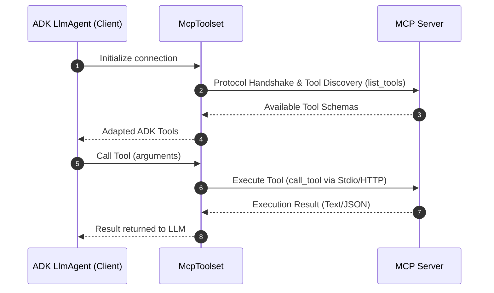

# Model Context Protocol ツール

<div class="language-support-tag">
  <span class="lst-supported">ADKでサポート</span><span class="lst-python">Python v0.1.0</span><span class="lst-typescript">Typescript v0.2.0</span><span class="lst-go">Go v0.1.0</span><span class="lst-java">Java v0.1.0</span><span class="lst-kotlin">Kotlin v0.1.0</span>
</div>

**Model Context Protocol (MCP)** は、生成 AI モデルを外部データ ソース、ツール、システムに接続するためのオープン スタンダードです。LLM がコンテキストを取得し、アクションを実行し、さまざまなシステムと対話する方法を簡素化するユニバーサルな接続メカニズムと考えることができます。

---

## コア アーキテクチャと概念

MCP はクライアント/サーバー アーキテクチャに従い、データやリソース、インタラクティブなテンプレートやプロンプト、実行可能な関数やツールが MCP サーバーによって公開され、MCP クライアント（LLM ホスト アプリケーションまたは AI エージェント）によって消費される方法を定義します。ADK では、MCP サーバーと ADK エージェント間のインターフェースとして `McpToolset` クラスを使用します。また、他のクライアント システムで使用できるように ADK サーバーを MCP サーバーとして構成することも可能です。



## 前提条件とセットアップ ルール

開始する前に、次のセットアップが完了していることを確認してください。

- **ADK のインストール**: MCP エクストラを含めてプロジェクト環境で標準の ADK セットアップを完了します: `pip install "google-adk[mcp]"`。
- **ランタイム要件**: Python 3.10+ または Java 17+。
- **Node.js & `npx`** *(Python/TS のみ)*: npm パッケージ化されたコミュニティ MCP サーバーを実行するために必要です。
- **インストールの確認**: アクティブ化された仮想環境で `adk` と `npx` が PATH に通っていることを確認します。

=== "macOS / Linux"

    ```bash
    # 両方のコマンドが実行可能ファイルへのパスを出力する必要があります。
    which adk
    which npx
    ```
    
=== "Windows PowerShell"

    ```powershell
    # 両方のコマンドが実行可能ファイルへのパスを出力する必要があります。
    Get-Command adk
    Get-Command npx
    ```
    
!!! warning "デプロイ ルール"

    本番環境にデプロイされるエージェントは、`agent.py` 内で **`McpToolset` を同期的に定義**する必要があります。動的な非同期エージェントの初期化は、ローカル デバッグまたはカスタム スタンドアロン ランナーでのみサポートされます。

---

## ユースケースと統合の理解

主に 3 つの統合パターンがあります。直接的な統合はこのページで説明し、その他の実装はそれぞれの専用ページで説明します。

1. **直接的な MCP ツール統合**: ADK エージェントが `McpToolset` を使用して MCP クライアントとして機能する場合。
2. **エージェント公開 MCP サーバー**: `to_mcp_server` を使用して ADK ツールをラップする MCP サーバーを構築する場合。
3. **特化したサブエージェントの委任**: エージェントが `AgentTool` を使用してサブエージェントにタスクを委任する場合。

## MCP 実装オプション

Model Context Protocol (MCP) と ADK を使用して構築を開始する際、これらの主要なアーキテクチャの違いを理解することで、より安定した効率的なエージェントを設計できます。次の表は、エージェント構築を支援するための比較ガイドです。

| 項目 | [**直接的な MCP ツール統合** (`McpToolset`)](#direct-mcp-tool-integration-mcptoolset) | [**エージェント公開 MCP サーバー** (`to_mcp_server`)](agent-as-server.md) | [**特化したサブエージェントの委任** (`AgentTool`)](agent-managed.md) |
| :--- | :--- | :--- | :--- |
| **アーキテクチャ** | メインの `LlmAgent` ツール リストに適応された決定論的エンドポイントを提供する外部サーバー プロセスまたはリモート サービス。 | 外部クライアント（Claude Code、IDE、外部ホスト）から呼び出し可能な MCP サーバーにコンパイルされた自律型 ADK エージェント。 | 親エージェントが子 `LlmAgent` を呼び出し可能なツールとして呼び出す、プロセス内の階層型エージェント カプセル化。 |
| **コンテキスト ウィンドウへの影響** | **高いコンテキスト肥大化**: すべてのツール定義と生の出力（データベースの行やファイルの blob など）がメイン エージェントの履歴に入ります。 | **分離**: 外部の呼び出し元は、集約された最終レスポンスのテキスト/ブロックのみを受け取ります。 | **コンテキストの肥大化ゼロ**: 中間の探索的推論、失敗したツール呼び出し、大規模な生出力はサブエージェント ループ内に分離されたままになります。 |
| **AI モデルの負荷と階層化** | 単一モデルがすべてのツール スキーマ、検証制約、ワークフロー状態を同時に理解する必要があります。 | ラップされたタスク専用の独立したモデル推論。 | **モデルの階層化** が可能（例: オーケストレーター用の `gemini-2.5-pro`、専用のシステム指示を持つサブエージェント ツール実行用の `gemini-2.5-flash`）。 |
| **レイテンシとトークン コスト** | **低コストで予測可能なレイテンシ**: 1 回の LLM ターン + 1 回の決定論的ツール呼び出し + 1 回のレスポンス生成ターン。 | クライアント主導。内部エージェントの実行深度に応じてレイテンシが変化します。 | **高コストで変動するレイテンシ**: 親に復帰する前に複数の LLM 呼び出しとサブエージェントの推論ターンが発生。 |
| **理想的なユースケース** | <ul><li>決定論的 API 統合: Postgres、BigQuery、GitHub、Google Maps。</li><li>ファイル システム操作および静的リソースの読み取り。</li><li>標準的な事前構築済みコミュニティ MCP サーバーの再利用。</li></ul> | <ul><li>複雑な ADK マルチエージェント機能を外部の MCP 準拠エコシステムに公開。</li><li>IDE、エディター、または A2A パイプラインへの ADK エージェントの統合。</li></ul> | <ul><li>試行錯誤を必要とするマルチステップの自律ワークフロー（コード デバッグやリサーチの統合など）。</li><li>分離されたペルソナや特化した指示が必要なタスク。</li><li>スキーマの過負荷によって精度が低下する 20 個以上のツールを使用するシナリオ。</li></ul> |

!!! note "状態の復元"

    ADK エージェントはライフサイクル イベント全体でセッション状態を保持しますが、復元時にアクティブな MCP 接続を自動的に再確立することはありません。エージェントは必要に応じて接続を動的に再初期化します。
   
### 直接的な MCP ツール統合 (McpToolset)

`McpToolset` クラスは、エージェントのツール リストに直接追加できます。このクラスにより、MCP サーバーへのシームレスな接続、ツールの検出、およびエージェントでの使用が可能になります。初期化時に、`McpToolset` は MCP サーバーへの接続を確立して管理します。また、エージェントまたはプロセスが終了したときに正常な接続シャットダウンを処理します。
外部 MCP サーバーからツールを ADK `LlmAgent` にインポートするには、`McpToolset` を使用します。

#### 例: ローカル Stdio トランスポート (FileSystem MCP)

この例では、ローカル MCP ファイル システム サーバーに接続する ADK エージェントをセットアップします。ファイル管理機能を有効にするために、エージェントのツール リスト内に `McpToolset` を直接インスタンス化します。

**ステップ 1**. `McpToolset` でエージェントを定義します。

=== "Python"

    ```python
    import os
    from google.adk.agents import LlmAgent
    from google.adk.tools.mcp_tool import McpToolset
    from google.adk.tools.mcp_tool.mcp_session_manager import StdioConnectionParams
    from mcp import StdioServerParameters

    TARGET_FOLDER = os.path.abspath("./accessible_files")

    root_agent = LlmAgent(
        model="gemini-flash-latest",
        name="filesystem_assistant",
        instruction="Help users manage local files.",
        tools=[
            McpToolset(
                connection_params=StdioConnectionParams(
                    server_params=StdioServerParameters(
                        command="npx",
                        args=["-y", "@modelcontextprotocol/server-filesystem", TARGET_FOLDER],
                    ),
                ),
                # オプション: エージェントに公開する特定のツールを選択
                tool_filter=["list_directory", "read_file"],
            )
        ],
    )
    ```
    
    **ステップ 2**: エージェントをパッケージ化して実行し、ADK から検出できるようにして対話を開始します。
    
    - パッケージの初期化: `agent.py` と同じディレクトリに `__init__.py` ファイルを作成します。このステップは ADK がエージェントを認識するために必要です。
    - Web インターフェースの起動:

        ```bash
        cd ./adk_agent_samples 
        adk web
        ```
    
    - エージェントとの対話: ドロップダウン メニューから `filesystem_assistant` を選択し、次のようなコマンドでエージェントにプロンプトを送信します: *List files in the current directory* または *What is the content of another_file.md?*

    

=== "TypeScript"

    ```typescript
    import { LlmAgent, MCPToolset } from "@google/adk";
    import path from "path";

    const TARGET_FOLDER = path.resolve("./accessible_files");

    export const rootAgent = new LlmAgent({
        model: "gemini-flash-latest",
        name: "filesystem_assistant",
        instruction: "Help users manage local files.",
        tools: [
            new MCPToolset({
                type: "StdioConnectionParams",
                serverParams: {
                    command: "npx",
                    args: ["-y", "@modelcontextprotocol/server-filesystem", TARGET_FOLDER],
                },
            }, ["list_directory", "read_file"]) // オプションのツール フィルター配列
        ],
    });
    ```

=== "Java"

    ```java
    package agents;

    import com.google.adk.agents.LlmAgent;
    import com.google.adk.tools.mcp.McpToolset;
    import com.google.adk.tools.mcp.StdioServerParameters;
    import java.util.List;

    public class FileSystemAgentCreator {
        public static void main(String[] args) throws Exception {
            StdioServerParameters serverParams = StdioServerParameters.builder()
                    .command("npx")
                    .args(List.of("-y", "@modelcontextprotocol/server-filesystem", "/absolute/path/to/folder"))
                    .build();

            try (McpToolset toolset = new McpToolset(serverParams.toServerParameters())) {
                LlmAgent agent = LlmAgent.builder()
                        .model("gemini-flash-latest")
                        .name("filesystem_assistant")
                        .instruction("Help users access their file systems.")
                        .tools(toolset)
                        .build();

                System.out.println("Agent initialized: " + agent.name());
            }
        }
    }
    ```

=== "Go"

    ```go
    package main

    import (
        "context"
        "fmt"
        "os/exec"

        "github.com/modelcontextprotocol/go-sdk/mcp"
        "google.golang.org/adk/v2/agent"
        "google.golang.org/adk/v2/agent/llmagent"
        "google.golang.org/adk/v2/model/gemini"
        "google.golang.org/adk/v2/tool"
        "google.golang.org/adk/v2/tool/mcptoolset"
    )

    func createFilesystemAgent(ctx context.Context) (agent.Agent, error) {
        // 1. CommandTransport と AllowedToolsPredicate を使用して MCP Toolset を初期化
        mcpTools, err := mcptoolset.New(mcptoolset.Config{
            Transport: &mcp.CommandTransport{
                Command: exec.Command("npx", "-y", "@modelcontextprotocol/server-filesystem", "./accessible_files"),
            },
            ToolFilter: tool.AllowedToolsPredicate([]string{"list_directory", "read_file"}),
        })
        if err != nil {
            return nil, fmt.Errorf("failed to create mcp toolset: %w", err)
        }

        // 2. Gemini model.LLM インスタンスを初期化
        llm, err := gemini.NewModel(ctx, "gemini-2.0-flash", nil)
        if err != nil {
            return nil, fmt.Errorf("failed to create gemini model: %w", err)
        }

        // 3. agent.Agent を返す LLM エージェントを作成
        return llmagent.New(llmagent.Config{
            Name:        "filesystem_assistant",
            Model:       llm,
            Instruction: "Help users manage local files.",
            Toolsets:    []tool.Toolset{mcpTools},
        })
    }

    func main() {
        ctx := context.Background()
        ag, err := createFilesystemAgent(ctx)
        if err != nil {
            panic(err)
        }
        fmt.Printf("Successfully created agent: %s\n", ag.Name())
    }
    ```
    
---

#### 例: リモート HTTP / SSE トランスポート (Google Maps Grounding Lite)

開始する前に、[Google Maps Grounding Lite](https://developers.google.com/maps/ai/grounding-lite) の手順に従って Google Cloud プロジェクトでサービスを有効にし、Maps Platform API キーを生成してください。
前述のローカル プロセスの例とは異なり、このパターンは Server-Sent Events (SSE) を使用してエージェントをリモートのクラウド ホスト型 MCP サーバーに接続します。Google Maps Grounding Lite サービスを使用して、スケーラブルなエンドポイントに API キーなどの認証ヘッダーを渡す方法を示します。

**ステップ 1**: `McpToolset` でエージェントを定義します。

=== "Python"

    ```python
    import os
    from google.adk.agents import LlmAgent
    from google.adk.tools.mcp_tool import McpToolset
    from google.adk.tools.mcp_tool.mcp_session_manager import StreamableHTTPConnectionParams
    
    API_KEY = os.getenv("GOOGLE_MAPS_API_KEY")
    
    root_agent = LlmAgent(
        model="gemini-flash-latest",
        name="travel_planner",
        instruction="Plan travel routes and search locations using Google Maps.",
        tools=[
            McpToolset(
                connection_params=StreamableHTTPConnectionParams(
                    url="https://mapstools.googleapis.com/mcp",
                    headers={
                        "X-Goog-Api-Key": API_KEY,
                        "Content-Type": "application/json",
                        "Accept": "application/json, text/event-stream",
                    },
                    timeout=5,
                    sse_read_timeout=300
                )
            )
        ],
    )
    ```
    **ステップ 2**: 環境変数を設定します。`adk web` を実行する前に、ターミナルで Google API キーを設定します。
      
    ```bash
    export GOOGLE_MAPS_API_KEY="YOUR_ACTUAL_GOOGLE_MAPS_API_KEY"
    ```
      
    **ステップ 3**: `adk web` を実行します: `mcp_agent` の親ディレクトリに移動し、Web インターフェースを起動します。
    **ステップ 4**: UI と対話します:
    - ドロップダウンから `travel_planner` を選択します。
    - 次のようなプロンプトを試します: *I will be in San Francisco tomorrow. What's the weather like* または *Find coffee shops near Golden Gate Park*
        
    

=== "TypeScript"

    ```typescript
    import { LlmAgent, MCPToolset } from "@google/adk";

    export const rootAgent = new LlmAgent({
        model: "gemini-flash-latest",
        name: "travel_planner",
        instruction: "Plan travel routes and search locations using Google Maps.",
        tools: [
            new MCPToolset({
                type: "StreamableHTTPConnectionParams",
                url: "https://mapstools.googleapis.com/mcp",
                transportOptions: {
                    requestInit: {
                        headers: {
                            "X-Goog-Api-Key": process.env.GOOGLE_MAPS_API_KEY!,
                            "Content-Type": "application/json",
                            "Accept": "application/json, text/event-stream",
                        },
                    },
                },
                timeout: 5,
                sseReadTimeout: 300,
            }),
        ],
    });
    ``` 
     
---

## リモート MCP 認証とリソース アクセス

このセクションでは、認証を使用してリモート MCP サーバーに接続する方法と、MCP サーバーによって公開されるデータ **リソース (Resources)** を読み取る方法について説明します。Server-Sent Events の `SseConnectionParams` や Streamable HTTP など、MCP サーバーで認証が必要な場合、`McpToolset` は認証情報の注入とトークン管理を自動的に処理します。

### 主要な認証パラメータ

| パラメータ | 型 | 説明 |
| :--- | :--- | :--- |
| `auth_scheme` | `AuthScheme` | 認証戦略（例: `Bearer`, `Basic`, `APIKey`, `OAuth2`）。 |
| `auth_credential` | `AuthCredential` | シークレット認証情報ペイロード（例: API トークン、OAuth アクセス トークン、ユーザー名/パスワード）。 |

ADK は必要な `Authorization` HTTP ヘッダーを自動的に構築し、クライアント リクエスト中の OAuth 2.0 トークンのリフレッシュを管理します。

### 認証の構成

MCP サーバーで認証が必要な場合、`McpToolset` は認証情報の注入とトークン管理を自動的に処理します。HTTP ヘッダーを手動で注入するのではなく、ネイティブの `auth_scheme` および `auth_credential` パラメータを使用してください。

*一般的な ADK 認証パターンについては、[カスタム ツール認証ガイド](../authentication.md) を参照してください。*

=== "Python"

    ```python
    import os
    from google.adk.tools.mcp_tool import McpToolset
    from google.adk.tools.mcp_tool.mcp_session_manager import SseConnectionParams
    
    # ヘッダーを介して Bearer トークン認証を構成
    toolset = McpToolset(
        connection_params=SseConnectionParams(
            url="https://mcp-server.example.com/sse",
            headers={"Authorization": f"Bearer {os.getenv('MCP_AUTH_TOKEN')}"},
            timeout=5,
        )
    )
    ```

=== "TypeScript"

    ```typescript
    import { MCPToolset } from "@google/adk";
    
    // ヘッダーを介して Bearer トークン認証を構成
    const toolset = new MCPToolset({
        type: "StreamableHTTPConnectionParams",
        url: "https://mcp-server.example.com/sse",
        transportOptions: {
            requestInit: {
                headers: {
                    "Authorization": `Bearer ${process.env.MCP_AUTH_TOKEN}`,
                },
            },
        },
        timeout: 5,
    });
    ```
    
---

## MCP リソースへのアクセス

実行可能な **ツール** に加えて、MCP サーバーはデータ ファイル、データベース レコード、API コンテキスト blob などの **リソース (Resources)** を公開できます。

`McpToolset` は、これらのデータ リソースを検出して読み取るための 2 つのコア メソッドを提供します。

### コア メソッド

* **`list_resources()`**: MCP サーバーによって公開されている利用可能なすべてのデータ リソースのリストを返します。
* **`read_resource(name)`**: 名前または URI によって特定のリソースの生コンテンツ ブロック（テキストまたはバイナリ データ）を取得します。
* **`use_mcp_resources=True` (構成)**: `McpToolset` を初期化するときにこのフラグを設定すると、LLM エージェントに `LoadMcpResourceTool` が自動的に装備されます。これにより、エージェントは手動でプログラムから取得することなく、独自にリソースを動的に検出して読み取ることができます。

#### 試してみる

=== "Python"

    ```python
    import asyncio

    async def fetch_mcp_data(toolset):
        # 1. サーバーで利用可能なリソースを検出
        resources = await toolset.list_resources()
        print("Available Resources:", resources)

        # 2. 特定のリソースからコンテンツを読み取る
        if resources:
            resource_name = resources[0]
            content_blocks = await toolset.read_resource(name=resource_name)
            print(f"Content of {resource_name}:", content_blocks)
    ```

=== "TypeScript"

    ```typescript
    async function fetchMcpData(toolset: any) {
        // 1. 利用可能なリソースを検出
        const resources = await toolset.listResources();
        console.log("Available Resources:", resources);

        // 2. 特定のリソースを読み取る
        if (resources.length > 0) {
            const content = await toolset.readResource(resources[0]);
            console.log(`Content of ${resources[0]}:`, content);
        }
    }
    ```

---

## トラブルシューティングとベスト プラクティスのチェックリスト

* **セキュリティとスコープ設定**: LLM に必要なアクションのみを公開するために、`McpToolset` には常に `tool_filter=[...]` を指定してください。
* **タイムアウト**: サブプロセスのハングを防ぐために、`StdioConnectionParams(timeout=5)` に明示的なタイムアウトを設定してください。
* **ライフサイクルのクリーンアップ**: `adk web` 以外のランナーでは、サブプロセスを正常にシャットダウンするために `await toolset.close()` を呼び出すか、非同期コンテキスト マネージャーを使用してください。
* **環境の検出**: 環境変数に基づいて接続タイプを動的に選択します（例: Cloud Run では `K_SERVICE`、ローカル開発では Stdio）。

### 環境に応じた接続の構成

```python
import os
from google.adk.tools.mcp_tool import McpToolset
from google.adk.tools.mcp_tool.mcp_session_manager import (
    StdioConnectionParams,
    StreamableHTTPConnectionParams,
)
from mcp import StdioServerParameters

if os.getenv("K_SERVICE"):
  # 本番環境で実行中 (Cloud Run)
  # ステートレスなスケーラビリティと Bearer 認証ヘッダーに Streamable HTTP を使用
  mcp_toolset = McpToolset(
      connection_params=StreamableHTTPConnectionParams(
          url=os.getenv("REMOTE_MCP_URL"),
          headers={"Authorization": f"Bearer {os.getenv('MCP_AUTH_TOKEN')}"},
          timeout=5,
          sse_read_timeout=300,
      )
  )
else:
  # ローカル開発で実行中
  # ネットワーク遅延のないテストに Stdio サブプロセス IPC を使用
  mcp_toolset = McpToolset(
      connection_params=StdioConnectionParams(
          server_params=StdioServerParameters(
              command="npx",
              args=["-y", "@modelcontextprotocol/server-filesystem", "/tmp"],
          ),
          timeout=5,
      )
  )
```

## その他のリソース

基本を理解したら、複雑な実装やカスタム統合について [高度なユースケース](./advanced.md) を参照してください。
