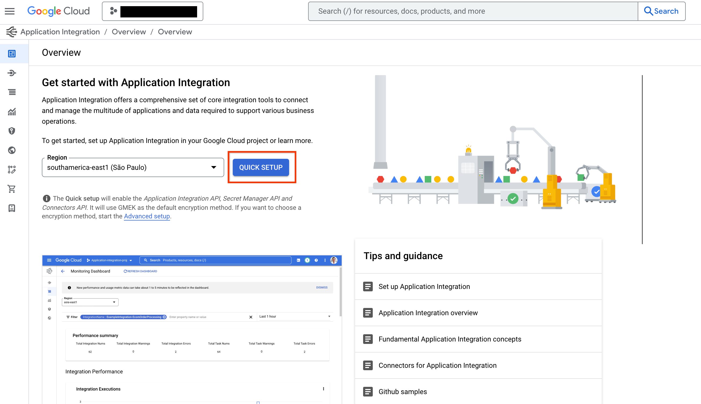

# Google Cloud ツール


Google Cloudツールを使用すると、エージェントをGoogle Cloudの製品やサービスに簡単に接続できます。わずか数行のコードでこれらのツールを使用して、エージェントを以下に接続できます。

*   開発者がApigeeでホストする**任意のカスタムAPI**。
*   Salesforce、Workday、SAPなどのエンタープライズシステムへの**100以上**の**事前構築済みコネクタ**。
*   Application Integrationを使用して構築された**自動化ワークフロー**。
*   データベース向けMCP Toolboxを使用して、Spanner、AlloyDB、Postgresなどの**データベース**。


## Apigee API Hub ツール

<div class="language-support-tag">
  <span class="lst-supported">ADKでサポート</span><span class="lst-python">Python v0.1.0</span>
</div>

**ApiHubToolset**を使用すると、Apigee API Hubからドキュメント化された任意のAPIを、わずか数行のコードでツールに変換できます。このセクションでは、APIへの安全な接続のための認証設定を含む、ステップバイステップの手順を説明します。

**前提条件**

1.  [ADKをインストールする](../get-started/installation.md)
2.  [Google Cloud CLI](https://cloud.google.com/sdk/docs/install?db=bigtable-docs#installation_instructions)をインストールする。
3.  ドキュメント化された（つまりOpenAPI仕様を持つ）APIを含む
    [Apigee API Hub](https://cloud.google.com/apigee/docs/apihub/what-is-api-hub)
    インスタンス
4.  プロジェクト構造を設定し、必要なファイルを作成する

```console
project_root_folder
 |
 `-- my_agent
     |-- .env
     |-- __init__.py
     |-- agent.py
     `__ tool.py
```

### API Hubツールセットの作成

注：このチュートリアルにはエージェントの作成が含まれています。すでにエージェントをお持ちの場合は、これらの手順の一部のみを従う必要があります。

1.  アクセストークンを取得し、`APIHubToolset`がAPI Hub APIから仕様を取得できるようにします。
    ターミナルで次のコマンドを実行します。

    ```shell
    gcloud auth print-access-token
    # 'ya29....' のようなアクセストークンが出力されます
    ```

2.  使用するアカウントに必要な権限があることを確認します。
    事前定義されたロール`roles/apihub.viewer`を使用するか、以下の権限を割り当てることができます。

    1.  **apihub.specs.get (必須)**
    2.  apihub.apis.get (任意)
    3.  apihub.apis.list (任意)
    4.  apihub.versions.get (任意)
    5.  apihub.versions.list (任意)
    6.  apihub.specs.list (任意)

3.  `APIHubToolset`を使用してツールを作成します。以下を`tools.py`に追加します。

    APIが認証を必要とする場合は、ツールの認証を設定する必要があります。
    以下のコードサンプルは、APIキーを設定する方法を示しています。ADKはトークンベースの認証（APIキー、ベアラートークン）、サービスアカウント、およびOpenID Connectをサポートしています。近日中に、さまざまなOAuth2フローのサポートを追加する予定です。

    ```py
    from google.adk.tools.openapi_tool.auth.auth_helpers import token_to_scheme_credential
    from google.adk.tools.apihub_tool.apihub_toolset import APIHubToolset

    # APIの認証を提供します。APIが認証を必要としない場合は不要です。
    auth_scheme, auth_credential = token_to_scheme_credential(
        "apikey", "query", "apikey", apikey_credential_str
    )

    sample_toolset = APIHubToolset(
        name="apihub-sample-tool",
        description="サンプルツール",
        access_token="...",  # ステップ1で生成したアクセストークンをコピー
        apihub_resource_name="...", # API Hubのリソース名
        auth_scheme=auth_scheme,
        auth_credential=auth_credential,
    )
    ```

    本番環境へのデプロイでは、アクセストークンの代わりにサービスアカウントを使用することをお勧めします。上記のコードスニペットでは、トークンの代わりに`service_account_json=service_account_cred_json_str`を使用し、サービスアカウントの認証情報を提供してください。

    `apihub_resource_name`については、APIに使用されているOpenAPI仕様の特定のIDがわかっている場合は、
    `` `projects/my-project-id/locations/us-west1/apis/my-api-id/versions/version-id/specs/spec-id` `` を使用します。
    ツールセットがAPIから利用可能な最初の仕様を自動的に取得するようにしたい場合は、
    `` `projects/my-project-id/locations/us-west1/apis/my-api-id` `` を使用します。

4.  エージェントファイルAgent.pyを作成し、作成したツールをエージェントの定義に追加します。

    ```py
    from google.adk.agents.llm_agent import LlmAgent
    from .tools import sample_toolset

    root_agent = LlmAgent(
        model='gemini-2.0-flash',
        name='enterprise_assistant',
        instruction='ユーザーを助け、アクセスできるツールを活用してください',
        tools=sample_toolset.get_tools(),
    )
    ```

5.  `__init__.py`を設定してエージェントを公開します。

    ```py
    from . import agent
    ```

6.  Google ADK Web UIを起動し、エージェントを試します。

    ```shell
    # `adk web` は project_root_folder から実行してください
    adk web
    ```

   次に、[http://localhost:8000](http://localhost:8000)にアクセスして、Web UIからエージェントを試します。

---

## Application Integration ツール

<div class="language-support-tag">
  <span class="lst-supported">ADKでサポート</span><span class="lst-python">Python v0.1.0</span><span class="lst-java">Java v0.3.0</span>
</div>

**ApplicationIntegrationToolset**を使用すると、Integration Connectorの100以上の事前構築済みコネクタ（Salesforce, ServiceNow, JIRA, SAPなど）を使用して、エージェントをエンタープライズアプリケーションにシームレスかつ安全に、管理された方法で接続できます。

オンプレミスとSaaSの両方のアプリケーションをサポートしています。さらに、Application IntegrationのワークフローをADKエージェントにツールとして提供することで、既存のApplication Integrationプロセス自動化をエージェントワークフローに変換できます。

Application Integration内のフェデレーション検索を使用すると、ADKエージェントを使用して複数のエンタープライズアプリケーションとデータソースを同時にクエリできます。

[:fontawesome-brands-youtube:{.youtube-red-icon} このビデオウォークスルーでApplication IntegrationのADKフェデレーション検索がどのように機能するかをご覧ください](https://www.youtube.com/watch?v=JdlWOQe5RgU){: target="_blank" rel="noopener noreferrer"}

<iframe width="560" height="315" src="https://www.youtube.com/embed/JdlWOQe5RgU?si=bFY_-jJ6Oliy5UMG" title="YouTubeビデオプレーヤー" frameborder="0" allow="accelerometer; autoplay; clipboard-write; encrypted-media; gyroscope; picture-in-picture; web-share" referrerpolicy="strict-origin-when-cross-origin" allowfullscreen></iframe>

### 前提条件

#### 1. ADKのインストール

[インストールガイド](../get-started/installation.md)の手順に従って、Agent Development Kitをインストールします。

#### 2. CLIのインストール

[Google Cloud CLI](https://cloud.google.com/sdk/docs/install#installation_instructions)をインストールします。
デフォルトの認証情報でツールを使用するには、次のコマンドを実行します。

```shell
gcloud config set project <project-id>
gcloud auth application-default login
gcloud auth application-default set-quota-project <project-id>
```

`<project-id>`をGoogle Cloudプロジェクトの一意のIDに置き換えます。

#### 3. Application Integrationワークフローのプロビジョニングと接続ツールの公開

エージェントで使用する既存の
[Application Integration](https://cloud.google.com/application-integration/docs/overview)
ワークフローまたは
[Integrations Connector](https://cloud.google.com/integration-connectors/docs/overview)
接続を使用します。新しい
[Application Integrationワークフロー](https://cloud.google.com/application-integration/docs/setup-application-integration)
または
[接続](https://cloud.google.com/integration-connectors/docs/connectors/neo4j/configure#configure-the-connector)を作成することもできます。

テンプレートライブラリから
[接続ツール](https://console.cloud.google.com/integrations/templates/connection-tool/locations/global)を
インポートして公開します。

**注**：Integration Connectorsからコネクタを使用するには、接続と同じリージョンでApplication Integrationをプロビジョニングする必要があります。

#### 4. プロジェクト構造の作成

=== "Python"

    プロジェクト構造を設定し、必要なファイルを作成します。

      ```console
      project_root_folder
      ├── .env
      └── my_agent
          ├── __init__.py
          ├── agent.py
          └── tools.py
      ```

    エージェントを実行するときは、`project_root_folder`から`adk web`を実行してください。

=== "Java"

    プロジェクト構造を設定し、必要なファイルを作成します。

      ```console
        project_root_folder
        └── my_agent
            ├── agent.java
            └── pom.xml
      ```

     エージェントを実行するときは、`project_root_folder`からコマンドを実行してください。

#### 5. ロールと権限の設定

**ApplicationIntegrationToolset**を設定するために必要な権限を取得するには、
プロジェクトに次のIAMロールが必要です（Integration ConnectorsとApplication Integration
Workflowsの両方に共通）。

    - roles/integrations.integrationEditor
    - roles/connectors.invoker
    - roles/secretmanager.secretAccessor

**注：**デプロイにAgent Engine（AE）を使用する場合、403エラーが発生する可能性があるため、
`roles/integrations.integrationInvoker`を使用しないでください。代わりに
`roles/integrations.integrationEditor`を使用してください。

### Integration Connectorsの使用

[Integration Connectors](https://cloud.google.com/integration-connectors/docs/overview)を使用して、エージェントをエンタープライズアプリケーションに接続します。

#### 開始する前に

**注：** *ExecuteConnection*統合は、通常、特定のリージョンでApplication Integrationをプロビ저닝할 때 자동으로 생성됩니다。 *ExecuteConnection*이 [통합 목록](https://console.cloud.google.com/integrations/list)에 없는 경우、다음 단계에 따라 생성해야 합니다。

1.  Integration Connectorsからコネクタを使用するには、「QUICK SETUP」ボタンをクリックして、接続と同じリージョンでApplication Integrationを[プロビジョニング](https://console.cloud.google.com/integrations)する必要があります。

   


2.  テンプレートライブラリから[Connection Tool](https://console.cloud.google.com/integrations/templates/connection-tool/locations/us-central1)テンプレートに移動し、「USE TEMPLATE」ボタンをクリックします。


    

3.  Integration Nameに**ExecuteConnection**と入力し（この統合名のみを使用することが必須です）、接続リージョンと同じリージョンを選択します。「CREATE」をクリックします。

4.  Application Integrationエディタの「PUBLISH」ボタンを使用して統合を公開します。


    


#### Application Integration Toolsetの作成

Integration Connectors用のApplication Integration Toolsetを作成するには、次の手順に従います。

1.  `tools.py`ファイル内に`ApplicationIntegrationToolset`を使用してツールを作成します。

    ```py
    from google.adk.tools.application_integration_tool.application_integration_toolset import ApplicationIntegrationToolset

    connector_tool = ApplicationIntegrationToolset(
        project="test-project", # TODO: 接続のGCPプロジェクトに置き換えてください
        location="us-central1", #TODO: 接続のロケーションに置き換えてください
        connection="test-connection", #TODO: 接続名に置き換えてください
        entity_operations={"Entity_One": ["LIST","CREATE"], "Entity_Two": []},#空のリストはエンティティ上のすべての操作がサポートされていることを意味します。
        actions=["action1"], #TODO: アクションに置き換えてください
        service_account_json='{...}', # 任意。サービスアカウントキーの文字列化されたJSON
        tool_name_prefix="tool_prefix2",
        tool_instructions="..."
    )
    ```

    **注：**

    * [サービスアカウントキー](https://cloud.google.com/iam/docs/keys-create-delete#creating)を生成し、サービスアカウントに適切な[Application IntegrationおよびIntegration Connector IAMロール](#prerequisites)を付与することで、デフォルトの認証情報の代わりに使用するサービスアカウントを提供できます。
    * 接続でサポートされているエンティティとアクションのリストを見つけるには、コネクタAPIを使用します: [listActions](https://cloud.google.com/integration-connectors/docs/reference/rest/v1/projects.locations.connections.connectionSchemaMetadata/listActions) または [listEntityTypes](https://cloud.google.com/integration-connectors/docs/reference/rest/v1/projects.locations.connections.connectionSchemaMetadata/listEntityTypes)。


    `ApplicationIntegrationToolset`は、Integration Connectors向けの**動的OAuth2認証**のために`auth_scheme`と`auth_credential`の提供もサポートするようになりました。これを使用するには、`tools.py`ファイル内に次のようなツールを作成します。

    ```py
    from google.adk.tools.application_integration_tool.application_integration_toolset import ApplicationIntegrationToolset
    from google.adk.tools.openapi_tool.auth.auth_helpers import dict_to_auth_scheme
    from google.adk.auth import AuthCredential
    from google.adk.auth import AuthCredentialTypes
    from google.adk.auth import OAuth2Auth

    oauth2_data_google_cloud = {
      "type": "oauth2",
      "flows": {
          "authorizationCode": {
              "authorizationUrl": "https://accounts.google.com/o/oauth2/auth",
              "tokenUrl": "https://oauth2.googleapis.com/token",
              "scopes": {
                  "https://www.googleapis.com/auth/cloud-platform": (
                      "Google Cloud Platformサービス全体のデータを表示および管理します"
                  ),
                  "https://www.googleapis.com/auth/calendar.readonly": "カレンダーを表示します"
              },
          }
      },
    }

    oauth_scheme = dict_to_auth_scheme(oauth2_data_google_cloud)

    auth_credential = AuthCredential(
      auth_type=AuthCredentialTypes.OAUTH2,
      oauth2=OAuth2Auth(
          client_id="...", #TODO: client_idに置き換えてください
          client_secret="...", #TODO: client_secretに置き換えてください
      ),
    )

    connector_tool = ApplicationIntegrationToolset(
        project="test-project", # TODO: 接続のGCPプロジェクトに置き換えてください
        location="us-central1", #TODO: 接続のロケーションに置き換えてください
        connection="test-connection", #TODO: 接続名に置き換えてください
        entity_operations={"Entity_One": ["LIST","CREATE"], "Entity_Two": []},#空のリストはエンティティ上のすべての操作がサポートされていることを意味します。
        actions=["GET_calendars/%7BcalendarId%7D/events"], #TODO: アクションに置き換えてください。これはイベントを一覧表示するためのものです。
        service_account_json='{...}', # 任意。サービスアカウントキーの文字列化されたJSON
        tool_name_prefix="tool_prefix2",
        tool_instructions="...",
        auth_scheme=oauth_scheme,
        auth_credential=auth_credential
    )
    ```


2. `agent.py`ファイルを更新し、ツールをエージェントに追加します。

    ```py
    from google.adk.agents.llm_agent import LlmAgent
    from .tools import connector_tool

    root_agent = LlmAgent(
        model='gemini-2.0-flash',
        name='connector_agent',
        instruction="ユーザーを助け、アクセスできるツールを活用してください",
        tools=[connector_tool],
    )
    ```

3. `__init__.py`を設定してエージェントを公開します。

    ```py
    from . import agent
    ```

4. Google ADK Web UIを起動し、エージェントを使用します。

    ```shell
    # `adk web` は project_root_folder から実行してください
    adk web
    ```

上記の手順を完了したら、[http://localhost:8000](http://localhost:8000)にアクセスし、
   `my_agent`エージェント（エージェントフォルダ名と同じ）を選択します。


### App Integrationワークフローの使用

既存の
[Application Integration](https://cloud.google.com/application-integration/docs/overview)
ワークフローをエージェントのツールとして使用するか、新しいものを作成します。


#### 1. ツールの作成

=== "Python"

    `tools.py`ファイル内に`ApplicationIntegrationToolset`を使用してツールを作成するには、次のコードを使用します。

      ```py
          integration_tool = ApplicationIntegrationToolset(
              project="test-project", # TODO: 接続のGCPプロジェクトに置き換えてください
              location="us-central1", #TODO: 接続のロケーションに置き換えてください
              integration="test-integration", #TODO: 統合名に置き換えてください
              triggers=["api_trigger/test_trigger"],#TODO: トリガーIDに置き換えてください。空のリストは統合内のすべてのAPIトリガーが考慮されることを意味します。
              service_account_json='{...}', #任意。サービスアカウントキーの文字列化されたJSON
              tool_name_prefix="tool_prefix1",
              tool_instructions="..."
          )
      ```

      **注：**デフォルトの認証情報の代わりに使用するサービスアカウントを提供できます。これを行うには、[サービスアカウントキー](https://cloud.google.com/iam/docs/keys-create-delete#creating)を生成し、サービスアカウントに適切な[Application IntegrationおよびIntegration Connector IAMロール](#prerequisites)を付与します。IAMロールの詳細については、[前提条件](#prerequisites)セクションを参照してください。

=== "Java"

    `tools.java`ファイル内に`ApplicationIntegrationToolset`を使用してツールを作成するには、次のコードを使用します。

      ```java
          import com.google.adk.tools.applicationintegrationtoolset.ApplicationIntegrationToolset;
          import com.google.common.collect.ImmutableList;
          import com.google.common.collect.ImmutableMap;

          public class Tools {
              private static ApplicationIntegrationToolset integrationTool;
              private static ApplicationIntegrationToolset connectionsTool;

              static {
                  integrationTool = new ApplicationIntegrationToolset(
                          "test-project",
                          "us-central1",
                          "test-integration",
                          ImmutableList.of("api_trigger/test-api"),
                          null,
                          null,
                          null,
                          "{...}",
                          "tool_prefix1",
                          "...");

                  connectionsTool = new ApplicationIntegrationToolset(
                          "test-project",
                          "us-central1",
                          null,
                          null,
                          "test-connection",
                          ImmutableMap.of("Issue", ImmutableList.of("GET")),
                          ImmutableList.of("ExecuteCustomQuery"),
                          "{...}",
                          "tool_prefix",
                          "...");
              }
          }
      ```

      **注：**デフォルトの認証情報の代わりに使用するサービスアカウントを提供できます。これを行うには、[サービスアカウントキー](https://cloud.google.com/iam/docs/keys-create-delete#creating)を生成し、サービスアカウントに適切な[Application IntegrationおよびIntegration Connector IAMロール](#prerequisites)を付与します。IAMロールの詳細については、[前提条件](#prerequisites)セクションを参照してください。

#### 2. ツールをエージェントに追加する

=== "Python"

    `agent.py`ファイルを更新し、ツールをエージェントに追加するには、次のコードを使用します。

      ```py
          from google.adk.agents.llm_agent import LlmAgent
          from .tools import integration_tool, connector_tool

          root_agent = LlmAgent(
              model='gemini-2.0-flash',
              name='integration_agent',
              instruction="ユーザーを助け、アクセスできるツールを活用してください",
              tools=[integration_tool],
          )
      ```

=== "Java"

    `agent.java`ファイルを更新し、ツールをエージェントに追加するには、次のコードを使用します。

      ```java
          import com.google.adk.agent.LlmAgent;
          import com.google.adk.tools.BaseTool;
          import com.google.common.collect.ImmutableList;

            public class MyAgent {
                public static void main(String[] args) {
                    // 前のステップで定義されていると仮定したToolsクラス
                    ImmutableList<BaseTool> tools = ImmutableList.<BaseTool>builder()
                            .add(Tools.integrationTool)
                            .add(Tools.connectionsTool)
                            .build();

                    // 最後に、自動的に生成されたツールでエージェントを作成します。
                    LlmAgent rootAgent = LlmAgent.builder()
                            .name("science-teacher")
                            .description("科学教師エージェント")
                            .model("gemini-2.0-flash")
                            .instruction(
                                    "ユーザーを助け、アクセスできるツールを活用してください。"
                            )
                            .tools(tools)
                            .build();

                    // これでrootAgentを使用してLLMと対話できます
                    // たとえば、エージェントとの会話を開始できます。
                }
            }
        ```

**注：**接続でサポートされているエンティティとアクションのリストを見つけるには、
        これらのコネクタAPIを使用します：`listActions`、`listEntityTypes`。

#### 3. エージェントを公開する

=== "Python"

    `__init__.py`を設定してエージェントを公開するには、次のコードを使用します。

      ```py
          from . import agent
      ```

#### 4. エージェントを使用する

=== "Python"

    Google ADK Web UIを起動し、エージェントを使用するには、次のコマンドを使用します。

      ```shell
          # `adk web` は project_root_folder から実行してください
          adk web
      ```
    上記の手順を完了したら、[http://localhost:8000](http://localhost:8000)にアクセスし、`my_agent`エージェント（エージェントフォルダ名と同じ）を選択します。

=== "Java"

    Google ADK Web UIを起動し、エージェントを使用するには、次のコマンドを使用します。

      ```bash
          mvn install

          mvn exec:java \
              -Dexec.mainClass="com.google.adk.web.AdkWebServer" \
              -Dexec.args="--adk.agents.source-dir=src/main/java" \
              -Dexec.classpathScope="compile"
      ```

    上記の手順を完了したら、[http://localhost:8000](http://localhost:8000)にアクセスし、`my_agent`エージェント（エージェントフォルダ名と同じ）を選択します。