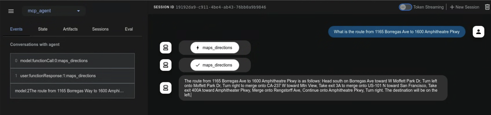

# Model Context Protocol ツール

<div class="language-support-tag">
  <span class="lst-supported">ADKでサポート</span><span class="lst-python">Python v0.1.0</span><span class="lst-go">Go v0.1.0</span><span class="lst-java">Java v0.1.0</span>
</div>

このガイドでは、Agent Development Kit (ADK) と Model Context Protocol (MCP) を統合する2つの方法について説明します。

## Model Context Protocol (MCP) とは？

Model Context Protocol (MCP) は、GeminiやClaudeのような大規模言語モデル (LLM) が外部のアプリケーション、データソース、ツールとどのように通信するかを標準化するために設計されたオープンスタンダードです。LLMがコンテキストを取得し、アクションを実行し、さまざまなシステムと対話する方法を簡素化する、普遍的な接続メカニズムと考えることができます。

MCPはクライアントサーバーアーキテクチャに従い、**データ** (リソース)、**対話型テンプレート** (プロンプト)、および**実行可能な関数** (ツール) が**MCPサーバー**によってどのように公開され、**MCPクライアント** (LLMホストアプリケーションやAIエージェントなど) によってどのように消費されるかを定義します。

このガイドでは、2つの主要な統合パターンを取り上げます：

1.  **ADK内で既存のMCPサーバーを使用する：** ADKエージェントがMCPクライアントとして機能し、外部のMCPサーバーによって提供されるツールを活用します。
2.  **MCPサーバーを介してADKツールを公開する：** ADKツールをラップするMCPサーバーを構築し、任意のMCPクライアントからアクセスできるようにします。

## 前提条件

始める前に、以下の設定が完了していることを確認してください：

*   **ADKのセットアップ：** クイックスタートの標準的なADK[セットアップ手順](../get-started/quickstart.md/#venv-install)に従ってください。
*   **Python/Javaのインストール/アップデート：** MCPは、Pythonの場合はバージョン3.9以上、Javaの場合は17以上が必要です。
*   **Node.jsとnpxのセットアップ：** **(Pythonのみ)** 多くのコミュニティMCPサーバーはNode.jsパッケージとして配布され、`npx`を使用して実行されます。まだインストールしていない場合は、Node.js（npxを含む）をインストールしてください。詳細は[https://nodejs.org/en](https://nodejs.org/en)を参照してください。
*   **インストールの確認：** **(Pythonのみ)** 有効化された仮想環境内で、`adk`と`npx`がPATHにあることを確認します：

```shell
# 両方のコマンドが実行可能ファイルのパスを出力するはずです。
which adk
which npx
```

## 1. `adk web`でADKエージェントとMCPサーバーを使用する（ADKをMCPクライアントとして）

このセクションでは、外部のMCP (Model Context Protocol) サーバーからのツールをADKエージェントに統合する方法を示します。これは、ADKエージェントがMCPインターフェースを公開する既存のサービスによって提供される機能を使用する必要がある場合に**最も一般的な**統合パターンです。`MCPToolset`クラスをエージェントの`tools`リストに直接追加することで、MCPサーバーへのシームレスな接続、そのツールの発見、そしてエージェントが使用できるようにする方法を見ていきます。これらの例は、主に`adk web`開発環境内での対話に焦点を当てています。

### `MCPToolset`クラス

`MCPToolset`クラスは、MCPサーバーからツールを統合するためのADKの主要なメカニズムです。エージェントの`tools`リストに`MCPToolset`インスタンスを含めると、指定されたMCPサーバーとの対話が自動的に処理されます。仕組みは次のとおりです：

1.  **接続管理：** 初期化時に、`MCPToolset`はMCPサーバーへの接続を確立し、管理します。これは、ローカルのサーバープロセス（標準入出力を介した通信のための`StdioConnectionParams`を使用）またはリモートサーバー（サーバー送信イベントのための`SseConnectionParams`を使用）の場合があります。ツールセットは、エージェントまたはアプリケーションが終了する際に、この接続を適切にシャットダウンする処理も行います。
2.  **ツールの発見と適応：** 接続されると、`MCPToolset`はMCPサーバーに利用可能なツールを問い合わせ（MCPの`list_tools`メソッド経由）、発見されたこれらのMCPツールのスキーマをADK互換の`BaseTool`インスタンスに変換します。
3.  **エージェントへの公開：** これらの適応されたツールは、ネイティブのADKツールであるかのように`LlmAgent`で利用可能になります。
4.  **ツール呼び出しのプロキシ：** `LlmAgent`がこれらのツールの1つを使用することを決定すると、`MCPToolset`は呼び出しを透過的にMCPサーバーにプロキシし（MCPの`call_tool`メソッドを使用）、必要な引数を送信し、サーバーの応答をエージェントに返します。
5.  **フィルタリング（オプション）：** `MCPToolset`を作成する際に`tool_filter`パラメータを使用して、MCPサーバーからすべてのツールをエージェントに公開するのではなく、特定のサブセットを選択できます。

以下の例では、`adk web`開発環境内で`MCPToolset`を使用する方法を示します。MCP接続ライフサイクルのよりきめ細かな制御が必要な場合や、`adk web`を使用していないシナリオについては、このページの後半の「`adk web`外で自分のエージェントでMCPツールを使用する」セクションを参照してください。

### 例1：ファイルシステムMCPサーバー

このPythonの例では、ファイルシステムの操作を提供するローカルのMCPサーバーに接続する方法を示します。

#### ステップ1：`MCPToolset`でエージェントを定義する

`agent.py`ファイルを作成します（例：`./adk_agent_samples/mcp_agent/agent.py`）。`MCPToolset`は`LlmAgent`の`tools`リスト内で直接インスタンス化されます。

*   **重要：** `args`リストの`"/path/to/your/folder"`を、MCPサーバーがアクセスできるローカルシステム上の実際のフォルダの**絶対パス**に置き換えてください。
*   **重要：** `.env`ファイルを`./adk_agent_samples`ディレクトリの親ディレクトリに配置してください。

```python
# ./adk_agent_samples/mcp_agent/agent.py
import os # パス操作に必要
from google.adk.agents import LlmAgent
from google.adk.tools.mcp_tool.mcp_toolset import MCPToolset
from google.adk.tools.mcp_tool.mcp_session_manager import StdioConnectionParams
from mcp import StdioServerParameters

# 可能であればパスを動的に定義するか、
# ユーザーが絶対パスの必要性を理解していることを確認するのが良い習慣です。
# この例では、このファイルからの相対パスを構築します。
# '/path/to/your/folder'がagent.pyと同じディレクトリにあると仮定します。
# セットアップに合わせて、これを実際の絶対パスに置き換えてください。
TARGET_FOLDER_PATH = os.path.join(os.path.dirname(os.path.abspath(__file__)), "/path/to/your/folder")
# TARGET_FOLDER_PATHがMCPサーバーの絶対パスであることを確認してください。
# ./adk_agent_samples/mcp_agent/your_folderを作成した場合、

root_agent = LlmAgent(
    model='gemini-2.0-flash',
    name='filesystem_assistant_agent',
    instruction='ユーザーのファイル管理を手伝ってください。ファイルのリスト表示や読み取りなどができます。',
    tools=[
        MCPToolset(
            connection_params=StdioConnectionParams(
                server_params = StdioServerParameters(
                    command='npx',
                    args=[
                        "-y",  # npxがインストールを自動確認するための引数
                        "@modelcontextprotocol/server-filesystem",
                        # 重要：これはnpxプロセスがアクセスできるフォルダへの
                        # 絶対パスでなければなりません。
                        # システム上の有効な絶対パスに置き換えてください。
                        # 例："/Users/youruser/accessible_mcp_files"
                        # または動的に構築された絶対パスを使用：
                        os.path.abspath(TARGET_FOLDER_PATH),
                    ],
                ),
            ),
            # オプション：MCPサーバーから公開されるツールをフィルタリング
            # tool_filter=['list_directory', 'read_file']
        )
    ],
)
```


#### ステップ2：`__init__.py`ファイルを作成する

`agent.py`と同じディレクトリに`__init__.py`があることを確認し、ADKが発見可能なPythonパッケージになるようにします。

```python
# ./adk_agent_samples/mcp_agent/__init__.py
from . import agent
```

#### ステップ3：`adk web`を実行して対話する

ターミナルで`mcp_agent`の親ディレクトリ（例：`adk_agent_samples`）に移動し、実行します：

```shell
cd ./adk_agent_samples # または同等の親ディレクトリ
adk web
```

!!!info "Windowsユーザーへの注意"

    `_make_subprocess_transport NotImplementedError`が発生した場合、代わりに`adk web --no-reload`の使用を検討してください。

ADK Web UIがブラウザで読み込まれたら：

1.  エージェントのドロップダウンから`filesystem_assistant_agent`を選択します。
2.  以下のようなプロンプトを試してください：
    *   "現在のディレクトリのファイルをリスト表示して"
    *   "sample.txtという名前のファイルを読めますか？"（`TARGET_FOLDER_PATH`に作成した場合）
    *   "`another_file.md`の内容は何ですか？"

エージェントがMCPファイルシステムサーバーと対話し、サーバーの応答（ファイルリスト、ファイル内容）がエージェントを通じて中継されるのが見えるはずです。`adk web`コンソール（コマンドを実行したターミナル）には、`npx`プロセスがstderrに出力する場合、そのログも表示されることがあります。


Javaの場合、`MCPToolset`を初期化するエージェントを定義するには、次のサンプルを参照してください。

```java
package agents;

import com.google.adk.JsonBaseModel;
import com.google.adk.agents.LlmAgent;
import com.google.adk.agents.RunConfig;
import com.google.adk.runner.InMemoryRunner;
import com.google.adk.tools.mcp.McpTool;
import com.google.adk.tools.mcp.McpToolset;
import com.google.adk.tools.mcp.McpToolset.McpToolsAndToolsetResult;
import com.google.genai.types.Content;
import com.google.genai.types.Part;
import io.modelcontextprotocol.client.transport.ServerParameters;

import java.util.List;
import java.util.concurrent.CompletableFuture;

public class McpAgentCreator {

    /**
     * McpToolsetを初期化し、stdioを使用してMCPサーバーからツールを取得し、
     * これらのツールでLlmAgentを作成し、エージェントにプロンプトを送信し、
     * ツールセットが閉じられることを確認します。
     * @param args コマンドライン引数（使用されません）。
     */
    public static void main(String[] args) {
        //注意：フォルダがホームの外にある場合、権限の問題が発生する可能性があります
        String yourFolderPath = "~/path/to/folder";

        ServerParameters connectionParams = ServerParameters.builder("npx")
                .args(List.of(
                        "-y",
                        "@modelcontextprotocol/server-filesystem",
                        yourFolderPath
                ))
                .build();

        try {
            CompletableFuture<McpToolsAndToolsetResult> futureResult =
                    McpToolset.fromServer(connectionParams, JsonBaseModel.getMapper());

            McpToolsAndToolsetResult result = futureResult.join();

            try (McpToolset toolset = result.getToolset()) {
                List<McpTool> tools = result.getTools();

                LlmAgent agent = LlmAgent.builder()
                        .model("gemini-2.0-flash")
                        .name("enterprise_assistant")
                        .description("ユーザーがファイルシステムにアクセスするのを助けるエージェント")
                        .instruction(
                                "ユーザーがファイルシステムにアクセスするのを助けます。ディレクトリ内のファイルを一覧表示できます。"
                        )
                        .tools(tools)
                        .build();

                System.out.println("エージェントが作成されました: " + agent.name());

                InMemoryRunner runner = new InMemoryRunner(agent);
                String userId = "user123";
                String sessionId = "1234";
                String promptText = "このディレクトリにはどのファイルがありますか - " + yourFolderPath + "?";

                // 最初にセッションを明示的に作成します
                try {
                    // InMemoryRunnerのappNameは、コンストラクタで指定されていない場合、デフォルトでagent.name()になります
                    runner.sessionService().createSession(runner.appName(), userId, null, sessionId).blockingGet();
                    System.out.println("セッションが作成されました: " + sessionId + " ユーザー: " + userId);
                } catch (Exception sessionCreationException) {
                    System.err.println("セッションの作成に失敗しました: " + sessionCreationException.getMessage());
                    sessionCreationException.printStackTrace();
                    return;
                }

                Content promptContent = Content.fromParts(Part.fromText(promptText));

                System.out.println("\nプロンプトをエージェントに送信しています: \"" + promptText + "\"...\n");

                runner.runAsync(userId, sessionId, promptContent, RunConfig.builder().build())
                        .blockingForEach(event -> {
                            System.out.println("イベントを受信しました: " + event.toJson());
                        });
            }
        } catch (Exception e) {
            System.err.println("エラーが発生しました: " + e.getMessage());
            e.printStackTrace();
        }
    }
}
```

`first`、`second`、`third`という名前の3つのファイルを含むフォルダを想定すると、成功した応答は次のようになります。

```shell
イベントを受信しました: {"id":"163a449e-691a-48a2-9e38-8cadb6d1f136","invocationId":"e-c2458c56-e57a-45b2-97de-ae7292e505ef","author":"enterprise_assistant","content":{"parts":[{"functionCall":{"id":"adk-388b4ac2-d40e-4f6a-bda6-f051110c6498","args":{"path":"~/home-test"},"name":"list_directory"}}],"role":"model"},"actions":{"stateDelta":{},"artifactDelta":{},"requestedAuthConfigs":{}},"timestamp":1747377543788}

イベントを受信しました: {"id":"8728380b-bfad-4d14-8421-fa98d09364f1","invocationId":"e-c2458c56-e57a-45b2-97de-ae7292e505ef","author":"enterprise_assistant","content":{"parts":[{"functionResponse":{"id":"adk-388b4ac2-d40e-4f6a-bda6-f051110c6498","name":"list_directory","response":{"text_output":[{"text":"[FILE] first\n[FILE] second\n[FILE] third"}]}}}],"role":"user"},"actions":{"stateDelta":{},"artifactDelta":{},"requestedAuthConfigs":{}},"timestamp":1747377544679}

イベントを受信しました: {"id":"8fe7e594-3e47-4254-8b57-9106ad8463cb","invocationId":"e-c2458c56-e57a-45b2-97de-ae7292e505ef","author":"enterprise_assistant","content":{"parts":[{"text":"ディレクトリには3つのファイルがあります: first、second、third。"}],"role":"model"},"actions":{"stateDelta":{},"artifactDelta":{},"requestedAuthConfigs":{}},"timestamp":1747377544689}
```


### 例2：Google Maps MCPサーバー

この例では、Google Maps MCPサーバーへの接続を示します。

#### ステップ1：APIキーの取得とAPIの有効化

1.  **Google Maps APIキー：** [APIキーを使用する](https://developers.google.com/maps/documentation/javascript/get-api-key#create-api-keys)の指示に従って、Google Maps APIキーを取得します。
2.  **APIの有効化：** Google Cloudプロジェクトで、以下のAPIが有効になっていることを確認します：
    *   Directions API
    *   Routes API
    手順については、[Google Maps Platform入門](https://developers.google.com/maps/get-started#enable-api-sdk)のドキュメントを参照してください。

#### ステップ2：Google Maps用の`MCPToolset`でエージェントを定義する

`agent.py`ファイルを変更します（例：`./adk_agent_samples/mcp_agent/agent.py`）。`YOUR_GOOGLE_MAPS_API_KEY`を、取得した実際のAPIキーに置き換えます。

```python
# ./adk_agent_samples/mcp_agent/agent.py
import os
from google.adk.agents import LlmAgent
from google.adk.tools.mcp_tool.mcp_toolset import MCPToolset
from google.adk.tools.mcp_tool.mcp_session_manager import StdioConnectionParams
from mcp import StdioServerParameters

# 環境変数からAPIキーを取得するか、直接挿入します。
# 環境変数を使用する方が一般的に安全です。
# 'adk web'を実行するターミナルでこの環境変数が設定されていることを確認してください。
# 例：export GOOGLE_MAPS_API_KEY="YOUR_ACTUAL_KEY"
google_maps_api_key = os.environ.get("GOOGLE_MAPS_API_KEY")

if not google_maps_api_key:
    # テスト用のフォールバックまたは直接割り当て - 本番環境では非推奨
    google_maps_api_key = "YOUR_GOOGLE_MAPS_API_KEY_HERE" # 環境変数を使用しない場合は置き換える
    if google_maps_api_key == "YOUR_GOOGLE_MAPS_API_KEY_HERE":
        print("警告：GOOGLE_MAPS_API_KEYが設定されていません。環境変数として、またはスクリプトで設定してください。")
        # キーが重要で、見つからない場合はエラーを発生させるか終了させることを検討してください。

root_agent = LlmAgent(
    model='gemini-2.0-flash',
    name='maps_assistant_agent',
    instruction='Google Mapsツールを使用して、マッピング、道案内、場所の検索でユーザーを支援します。',
    tools=[
        MCPToolset(
            connection_params=StdioConnectionParams(
                server_params = StdioServerParameters(
                    command='npx',
                    args=[
                        "-y",
                        "@modelcontextprotocol/server-google-maps",
                    ],
                    # APIキーをnpxプロセスに環境変数として渡す
                    # これがGoogle Maps用MCPサーバーがキーを期待する方法です。
                    env={
                        "GOOGLE_MAPS_API_KEY": google_maps_api_key
                    }
                ),
            ),
            # 必要に応じて特定のMapsツールをフィルタリングできます：
            # tool_filter=['get_directions', 'find_place_by_id']
        )
    ],
)
```

#### ステップ3：`__init__.py`の存在を確認する

例1で作成した場合は、このステップをスキップできます。そうでない場合は、`./adk_agent_samples/mcp_agent/`ディレクトリに`__init__.py`があることを確認してください：

```python
# ./adk_agent_samples/mcp_agent/__init__.py
from . import agent
```

#### ステップ4：`adk web`を実行して対話する

1.  **環境変数の設定（推奨）：**
    `adk web`を実行する前に、ターミナルでGoogle Maps APIキーを環境変数として設定するのが最善です：
    ```shell
    export GOOGLE_MAPS_API_KEY="YOUR_ACTUAL_GOOGLE_MAPS_API_KEY"
    ```
    `YOUR_ACTUAL_GOOGLE_MAPS_API_KEY`をあなたのキーに置き換えてください。

2.  **`adk web`の実行**：
    `mcp_agent`の親ディレクトリ（例：`adk_agent_samples`）に移動し、実行します：
    ```shell
    cd ./adk_agent_samples # または同等の親ディレクトリ
    adk web
    ```

3.  **UIでの対話**：
    *   `maps_assistant_agent`を選択します。
    *   以下のようなプロンプトを試してください：
        *   "GooglePlexからSFOまでの道順を教えて"
        *   "ゴールデンゲートパークの近くのコーヒーショップを探して"
        *   "フランスのパリからドイツのベルリンまでのルートは？"

エージェントがGoogle Maps MCPツールを使用して道案内や場所に基づいた情報を提供するのが見えるはずです。




Javaの場合、`MCPToolset`を初期化するエージェントを定義するには、次のサンプルを参照してください。

```java
package agents;

import com.google.adk.JsonBaseModel;
import com.google.adk.agents.LlmAgent;
import com.google.adk.agents.RunConfig;
import com.google.adk.runner.InMemoryRunner;
import com.google.adk.tools.mcp.McpTool;
import com.google.adk.tools.mcp.McpToolset;
import com.google.adk.tools.mcp.McpToolset.McpToolsAndToolsetResult;


import com.google.genai.types.Content;
import com.google.genai.types.Part;

import io.modelcontextprotocol.client.transport.ServerParameters;

import java.util.List;
import java.util.Map;
import java.util.Collections;
import java.util.HashMap;
import java.util.concurrent.CompletableFuture;
import java.util.Arrays;

public class MapsAgentCreator {

    /**
     * Google Maps用のMcpToolsetを初期化し、ツールを取得し、
     * LlmAgentを作成し、地図関連のプロンプトを送信し、ツールセットを閉じます。
     * @param args コマンドライン引数（使用されません）。
     */
    public static void main(String[] args) {
        // TODO: Places APIが有効になっているプロジェクトで、実際のGoogle Maps APIキーに置き換えてください。
        String googleMapsApiKey = "YOUR_GOOGLE_MAPS_API_KEY";

        Map<String, String> envVariables = new HashMap<>();
        envVariables.put("GOOGLE_MAPS_API_KEY", googleMapsApiKey);

        ServerParameters connectionParams = ServerParameters.builder("npx")
                .args(List.of(
                        "-y",
                        "@modelcontextprotocol/server-google-maps"
                ))
                .env(Collections.unmodifiableMap(envVariables))
                .build();

        try {
            CompletableFuture<McpToolsAndToolsetResult> futureResult =
                    McpToolset.fromServer(connectionParams, JsonBaseModel.getMapper());

            McpToolsAndToolsetResult result = futureResult.join();

            try (McpToolset toolset = result.getToolset()) {
                List<McpTool> tools = result.getTools();

                LlmAgent agent = LlmAgent.builder()
                        .model("gemini-2.0-flash")
                        .name("maps_assistant")
                        .description("地図アシスタント")
                        .instruction("利用可能なツールを使用して、地図と道案内でユーザーを支援します。")
                        .tools(tools)
                        .build();

                System.out.println("エージェントが作成されました: " + agent.name());

                InMemoryRunner runner = new InMemoryRunner(agent);
                String userId = "maps-user-" + System.currentTimeMillis();
                String sessionId = "maps-session-" + System.currentTimeMillis();

                String promptText = "マディソンスクエアガーデンに最も近い薬局への道順を教えてください。";

                try {
                    runner.sessionService().createSession(runner.appName(), userId, null, sessionId).blockingGet();
                    System.out.println("セッションが作成されました: " + sessionId + " ユーザー: " + userId);
                } catch (Exception sessionCreationException) {
                    System.err.println("セッションの作成に失敗しました: " + sessionCreationException.getMessage());
                    sessionCreationException.printStackTrace();
                    return;
                }

                Content promptContent = Content.fromParts(Part.fromText(promptText))

                System.out.println("\nプロンプトをエージェントに送信しています: \"" + promptText + "\"...\n");

                runner.runAsync(userId, sessionId, promptContent, RunConfig.builder().build())
                        .blockingForEach(event -> {
                            System.out.println("イベントを受信しました: " + event.toJson());
                        });
            }
        } catch (Exception e) {
            System.err.println("エラーが発生しました: " + e.getMessage());
            e.printStackTrace();
        }
    }
}
```

成功した応答は次のようになります。
```shell
イベントを受信しました: {"id":"1a4deb46-c496-4158-bd41-72702c773368","invocationId":"e-48994aa0-531c-47be-8c57-65215c3e0319","author":"maps_assistant","content":{"parts":[{"text":"はい。いくつかの選択肢があります。最も近いのは、5 Pennsylvania Plaza, New York, NY 10001, United StatesにあるCVS Pharmacyです。道順を案内しますか？\n"}],"role":"model"},"actions":{"stateDelta":{},"artifactDelta":{},"requestedAuthConfigs":{}},"timestamp":1747380026642}
```

## 2. ADKツールを持つMCPサーバーの構築（ADKを公開するMCPサーバー）

このパターンでは、既存のADKツールをラップし、標準的なMCPクライアントアプリケーションで利用できるようにします。このセクションの例では、カスタムビルドのMCPサーバーを介してADKの`load_web_page`ツールを公開します。

### 手順の概要

`mcp`ライブラリを使用して、標準的なPythonのMCPサーバーアプリケーションを作成します。このサーバー内で、以下のことを行います：

1.  公開したいADKツールをインスタンス化します（例：`FunctionTool(load_web_page)`）。
2.  MCPサーバーの`@app.list_tools()`ハンドラを実装して、ADKツールを宣伝します。これには、`google.adk.tools.mcp_tool.conversion_utils`の`adk_to_mcp_tool_type`ユーティリティを使用して、ADKツールの定義をMCPスキーマに変換することが含まれます。
3.  MCPサーバーの`@app.call_tool()`ハンドラを実装します。このハンドラは：
    *   MCPクライアントからツール呼び出しリクエストを受け取ります。
    *   リクエストがラップされたADKツールを対象としているかどうかを識別します。
    *   ADKツールの`.run_async()`メソッドを実行します。
    *   ADKツールの結果をMCP準拠の応答（例：`mcp.types.TextContent`）にフォーマットします。

### 前提条件

ADKのインストールと同じPython環境にMCPサーバーライブラリをインストールします：

```shell
pip install mcp
```

### ステップ1：MCPサーバースクリプトの作成

MCPサーバー用に新しいPythonファイルを作成します。例：`my_adk_mcp_server.py`。

### ステップ2：サーバーロジックの実装

`my_adk_mcp_server.py`に以下のコードを追加します。このスクリプトは、ADKの`load_web_page`ツールを公開するMCPサーバーをセットアップします。

```python
# my_adk_mcp_server.py
import asyncio
import json
import os
from dotenv import load_dotenv

# MCP Server Imports
from mcp import types as mcp_types # Use alias to avoid conflict
from mcp.server.lowlevel import Server, NotificationOptions
from mcp.server.models import InitializationOptions
import mcp.server.stdio # For running as a stdio server

# ADK Tool Imports
from google.adk.tools.function_tool import FunctionTool
from google.adk.tools.load_web_page import load_web_page # Example ADK tool
# ADK <-> MCP Conversion Utility
from google.adk.tools.mcp_tool.conversion_utils import adk_to_mcp_tool_type

# --- Load Environment Variables (If ADK tools need them, e.g., API keys) ---
load_dotenv() # Create a .env file in the same directory if needed

# --- Prepare the ADK Tool ---
# Instantiate the ADK tool you want to expose.
# This tool will be wrapped and called by the MCP server.
print("Initializing ADK load_web_page tool...")
adk_tool_to_expose = FunctionTool(load_web_page)
print(f"ADK tool '{adk_tool_to_expose.name}' initialized and ready to be exposed via MCP.")
# --- End ADK Tool Prep ---

# --- MCP Server Setup ---
print("Creating MCP Server instance...")
# Create a named MCP Server instance using the mcp.server library
app = Server("adk-tool-exposing-mcp-server")

# Implement the MCP server's handler to list available tools
@app.list_tools()
async def list_mcp_tools() -> list[mcp_types.Tool]:
    """MCP handler to list tools this server exposes."""
    print("MCP Server: Received list_tools request.")
    # Convert the ADK tool's definition to the MCP Tool schema format
    mcp_tool_schema = adk_to_mcp_tool_type(adk_tool_to_expose)
    print(f"MCP Server: Advertising tool: {mcp_tool_schema.name}")
    return [mcp_tool_schema]

# Implement the MCP server's handler to execute a tool call
@app.call_tool()
async def call_mcp_tool(
    name: str, arguments: dict
) -> list[mcp_types.Content]: # MCP uses mcp_types.Content
    """MCP handler to execute a tool call requested by an MCP client."""
    print(f"MCP Server: Received call_tool request for '{name}' with args: {arguments}")

    # Check if the requested tool name matches our wrapped ADK tool
    if name == adk_tool_to_expose.name:
        try:
            # Execute the ADK tool's run_async method.
            # Note: tool_context is None here because this MCP server is
            # running the ADK tool outside of a full ADK Runner invocation.
            # If the ADK tool requires ToolContext features (like state or auth),
            # this direct invocation might need more sophisticated handling.
            adk_tool_response = await adk_tool_to_expose.run_async(
                args=arguments,
                tool_context=None,
            )
            print(f"MCP Server: ADK tool '{name}' executed. Response: {adk_tool_response}")

            # Format the ADK tool's response (often a dict) into an MCP-compliant format.
            # Here, we serialize the response dictionary as a JSON string within TextContent.
            # Adjust formatting based on the ADK tool's output and client needs.
            response_text = json.dumps(adk_tool_response, indent=2)
            # MCP expects a list of mcp_types.Content parts
            return [mcp_types.TextContent(type="text", text=response_text)]

        except Exception as e:
            print(f"MCP Server: Error executing ADK tool '{name}': {e}")
            # Return an error message in MCP format
            error_text = json.dumps({"error": f"Failed to execute tool '{name}': {str(e)}"})
            return [mcp_types.TextContent(type="text", text=error_text)]
    else:
        # Handle calls to unknown tools
        print(f"MCP Server: Tool '{name}' not found/exposed by this server.")
        error_text = json.dumps({"error": f"Tool '{name}' not implemented by this server."})
        return [mcp_types.TextContent(type="text", text=error_text)]

# --- MCP Server Runner ---
async def run_mcp_stdio_server():
    """Runs the MCP server, listening for connections over standard input/output."""
    # Use the stdio_server context manager from the mcp.server.stdio library
    async with mcp.server.stdio.stdio_server() as (read_stream, write_stream):
        print("MCP Stdio Server: Starting handshake with client...")
        await app.run(
            read_stream,
            write_stream,
            InitializationOptions(
                server_name=app.name, # Use the server name defined above
                server_version="0.1.0",
                capabilities=app.get_capabilities(
                    # Define server capabilities - consult MCP docs for options
                    notification_options=NotificationOptions(),
                    experimental_capabilities={},
                ),
            ),
        )
        print("MCP Stdio Server: Run loop finished or client disconnected.")

if __name__ == "__main__":
    print("Launching MCP Server to expose ADK tools via stdio...")
    try:
        asyncio.run(run_mcp_stdio_server())
    except KeyboardInterrupt:
        print("\nMCP Server (stdio) stopped by user.")
    except Exception as e:
        print(f"MCP Server (stdio) encountered an error: {e}")
    finally:
        print("MCP Server (stdio) process exiting.")
# --- End MCP Server ---
```

### ステップ3：カスタムMCPサーバーをADKエージェントでテストする

次に、作成したMCPサーバーのクライアントとして機能するADKエージェントを作成します。このADKエージェントは`MCPToolset`を使用して`my_adk_mcp_server.py`スクリプトに接続します。

`agent.py`を作成します（例：`./adk_agent_samples/mcp_client_agent/agent.py`）：

```python
# ./adk_agent_samples/mcp_client_agent/agent.py
import os
from google.adk.agents import LlmAgent
from google.adk.tools.mcp_tool.mcp_toolset import MCPToolset
from google.adk.tools.mcp_tool.mcp_session_manager import StdioConnectionParams
from mcp import StdioServerParameters

# 重要：これをあなたのmy_adk_mcp_server.pyスクリプトへの絶対パスに置き換えてください
PATH_TO_YOUR_MCP_SERVER_SCRIPT = "/path/to/your/my_adk_mcp_server.py" # <<< 置き換える

if PATH_TO_YOUR_MCP_SERVER_SCRIPT == "/path/to/your/my_adk_mcp_server.py":
    print("警告：PATH_TO_YOUR_MCP_SERVER_SCRIPTが設定されていません。agent.pyで更新してください。")
    # パスが重要な場合はエラーを発生させることを検討してください

root_agent = LlmAgent(
    model='gemini-2.0-flash',
    name='web_reader_mcp_client_agent',
    instruction="ユーザーから提供されたURLのコンテンツを取得するために'load_web_page'ツールを使用してください。",
    tools=[
        MCPToolset(
            connection_params=StdioConnectionParams(
                server_params = StdioServerParameters(
                    command='python3', # MCPサーバースクリプトを実行するコマンド
                    args=[PATH_TO_YOUR_MCP_SERVER_SCRIPT], # 引数はスクリプトへのパス
                )
            )
            # tool_filter=['load_web_page'] # オプション：特定のツールのみがロードされるようにする
        )
    ],
)
```

そして、同じディレクトリに`__init__.py`を作成します：
```python
# ./adk_agent_samples/mcp_client_agent/__init__.py
from . import agent
```

**テストを実行するには：**

1.  **カスタムMCPサーバーの起動（オプション、個別の観察のため）：**
    `my_adk_mcp_server.py`を1つのターミナルで直接実行して、そのログを確認できます：
    ```shell
    python3 /path/to/your/my_adk_mcp_server.py
    ```
    「Launching MCP Server...」と表示され、待機します。`StdioServerParameters`の`command`がそれを実行するように設定されていれば、ADKエージェント（`adk web`経由で実行）がこのプロセスに接続します。
    *（または、エージェントが初期化されるときに`MCPToolset`がこのサーバースクリプトをサブプロセスとして自動的に開始します）。*

2.  **クライアントエージェントのために`adk web`を実行：**
    `mcp_client_agent`の親ディレクトリ（例：`adk_agent_samples`）に移動し、実行します：
    ```shell
    cd ./adk_agent_samples # または同等の親ディレクトリ
    adk web
    ```

3.  **ADK Web UIでの対話：**
    *   `web_reader_mcp_client_agent`を選択します。
    *   「https://example.comからコンテンツをロードして」のようなプロンプトを試してください。

ADKエージェント（`web_reader_mcp_client_agent`）は`MCPToolset`を使用して`my_adk_mcp_server.py`を開始し、接続します。あなたのMCPサーバーは`call_tool`リクエストを受け取り、ADKの`load_web_page`ツールを実行し、結果を返します。ADKエージェントはその情報を中継します。ADK Web UI（およびそのターミナル）と、もし別々に実行していれば`my_adk_mcp_server.py`ターミナルの両方からログが表示されるはずです。

この例は、ADKツールをMCPサーバー内にカプセル化し、ADKエージェントだけでなく、より広範なMCP準拠のクライアントからアクセスできるようにする方法を示しています。

Claude Desktopで試すには、[ドキュメント](https://modelcontextprotocol.io/quickstart/server#core-mcp-concepts)を参照してください。

## `adk web`外で自分のエージェントでMCPツールを使用する

このセクションは、以下の場合に関連します：

*   ADKを使用して独自のエージェントを開発している
*   そして、`adk web`を**使用していない**
*   そして、独自のUIを介してエージェントを公開している

MCPツールの仕様は、リモートまたは別のプロセスで実行されているMCPサーバーから非同期に取得されるため、MCPツールの使用には通常のツールとは異なるセットアップが必要です。

以下の例は、上記の「例1：ファイルシステムMCPサーバー」の例を修正したものです。主な違いは次のとおりです：

1.  ツールとエージェントが非同期に作成される
2.  MCPサーバーへの接続が閉じられたときにエージェントとツールが適切に破棄されるように、exitスタックを適切に管理する必要がある

```python
# agent.py (必要に応じてget_tools_asyncや他の部分を修正)
# ./adk_agent_samples/mcp_agent/agent.py
import os
import asyncio
from dotenv import load_dotenv
from google.genai import types
from google.adk.agents.llm_agent import LlmAgent
from google.adk.runners import Runner
from google.adk.sessions import InMemorySessionService
from google.adk.artifacts.in_memory_artifact_service import InMemoryArtifactService # Optional
from google.adk.tools.mcp_tool.mcp_toolset import MCPToolset
from google.adk.tools.mcp_tool.mcp_session_manager import StdioConnectionParams
from mcp import StdioServerParameters

# Load environment variables from .env file in the parent directory
# Place this near the top, before using env vars like API keys
load_dotenv('../.env')

# Ensure TARGET_FOLDER_PATH is an absolute path for the MCP server.
TARGET_FOLDER_PATH = os.path.join(os.path.dirname(os.path.abspath(__file__)), "/path/to/your/folder")

# --- Step 1: Agent Definition ---
async def get_agent_async():
  """Creates an ADK Agent equipped with tools from the MCP Server."""
  toolset = MCPToolset(
      # Use StdioConnectionParams for local process communication
      connection_params=StdioConnectionParams(
          server_params = StdioServerParameters(
            command='npx', # Command to run the server
            args=["-y",    # Arguments for the command
                "@modelcontextprotocol/server-filesystem",
                TARGET_FOLDER_PATH],
          ),
      ),
      tool_filter=['read_file', 'list_directory'] # Optional: filter specific tools
      # For remote servers, you would use SseConnectionParams instead:
      # connection_params=SseConnectionParams(url="http://remote-server:port/path", headers={...})
  )

  # Use in an agent
  root_agent = LlmAgent(
      model='gemini-2.0-flash', # Adjust model name if needed based on availability
      name='enterprise_assistant',
      instruction='Help user accessing their file systems',
      tools=[toolset], # Provide the MCP tools to the ADK agent
  )
  return root_agent, toolset

# --- Step 2: Main Execution Logic ---
async def async_main():
  session_service = InMemorySessionService()
  # Artifact service might not be needed for this example
  artifacts_service = InMemoryArtifactService()

  session = await session_service.create_session(
      state={}, app_name='mcp_filesystem_app', user_id='user_fs'
  )

  # TODO: Change the query to be relevant to YOUR specified folder.
  # e.g., "list files in the 'documents' subfolder" or "read the file 'notes.txt'"
  query = "list files in the tests folder"
  print(f"User Query: '{query}'")
  content = types.Content(role='user', parts=[types.Part(text=query)])

  root_agent, toolset = await get_agent_async()

  runner = Runner(
      app_name='mcp_filesystem_app',
      agent=root_agent,
      artifact_service=artifacts_service, # Optional
      session_service=session_service,
  )

  print("Running agent...")
  events_async = runner.run_async(
      session_id=session.id, user_id=session.user_id, new_message=content
  )

  async for event in events_async:
    print(f"Event received: {event}")

  # Cleanup is handled automatically by the agent framework
  # But you can also manually close if needed:
  print("Closing MCP server connection...")
  await toolset.close()
  print("Cleanup complete.")

if __name__ == '__main__':
  try:
    asyncio.run(async_main())
  except Exception as e:
    print(f"An error occurred: {e}")
```


## 主な考慮事項

MCPとADKを扱う際には、以下の点に留意してください：

*   **プロトコル vs. ライブラリ：** MCPは通信ルールを定義するプロトコル仕様です。ADKはエージェントを構築するためのPythonライブラリ/フレームワークです。MCPToolsetは、ADKフレームワーク内でMCPプロトコルのクライアント側を実装することで、これらを橋渡しします。逆に、PythonでMCPサーバーを構築するには、model-context-protocolライブラリを使用する必要があります。

*   **ADKツール vs. MCPツール：**

    *   ADKツール（BaseTool、FunctionTool、AgentToolなど）は、ADKのLlmAgentとRunner内で直接使用するために設計されたPythonオブジェクトです。
    *   MCPツールは、プロトコルのスキーマに従ってMCPサーバーによって公開される機能です。MCPToolsetは、これらをLlmAgentにとってADKツールのように見せかけます。
    *   Langchain/CrewAIツールは、それらのライブラリ内の特定の実装であり、多くの場合、単純な関数やクラスであり、MCPのサーバー/プロトコル構造を欠いています。ADKは、一部の相互運用性のためにラッパー（LangchainTool、CrewaiTool）を提供します。

*   **非同期性：** ADKとMCP Pythonライブラリは、どちらもPythonのasyncioライブラリに大きく基づいています。ツールの実装とサーバーハンドラは、一般的にasync関数であるべきです。

*   **ステートフルセッション（MCP）：** MCPは、クライアントとサーバーインスタンス間にステートフルで永続的な接続を確立します。これは、一般的なステートレスなREST APIとは異なります。

    *   **デプロイ：** このステートフル性は、特に多くのユーザーを処理するリモートサーバーのスケーリングとデプロイにおいて課題をもたらす可能性があります。元のMCP設計は、クライアントとサーバーが同じ場所に配置されていることをしばしば想定していました。これらの永続的な接続を管理するには、慎重なインフラストラクチャの考慮が必要です（例：ロードバランシング、セッションアフィニティ）。
    *   **ADK MCPToolset：** この接続ライフサイクルを管理します。例に示されているexit_stackパターンは、ADKエージェントが終了したときに接続（および場合によってはサーバープロセス）が適切に終了されることを保証するために重要です。

## MCPツールを使用したエージェントのデプロイ

MCPツールを使用するADKエージェントをCloud Run、GKE、またはVertex AI Agent Engineなどの本番環境にデプロイする場合、コンテナ化された分散環境でMCP接続がどのように機能するかを考慮する必要があります。

### 重要なデプロイ要件：同期エージェント定義

**⚠️ 重要：** MCPツールを使用してエージェントをデプロイする場合、エージェントとそのMCPToolsetは`agent.py`ファイルで**同期的に**定義する必要があります。`adk web`は非同期のエージェント作成を許可しますが、デプロイ環境では同期的なインスタンス化が必要です。

```python
# ✅ 正しい：デプロイ用の同期エージェント定義
import os
from google.adk.agents.llm_agent import LlmAgent
from google.adk.tools.mcp_tool import StdioConnectionParams
from google.adk.tools.mcp_tool.mcp_toolset import MCPToolset
from mcp import StdioServerParameters

_allowed_path = os.path.dirname(os.path.abspath(__file__))

root_agent = LlmAgent(
    model='gemini-2.0-flash',
    name='enterprise_assistant',
    instruction=f'ユーザーがファイルシステムにアクセスするのを助けます。許可されたディレクトリ：{_allowed_path}',
    tools=[
        MCPToolset(
            connection_params=StdioConnectionParams(
                server_params=StdioServerParameters(
                    command='npx',
                    args=['-y', '@modelcontextprotocol/server-filesystem', _allowed_path],
                ),
                timeout=5,  # 適切なタイムアウトを設定
            ),
            # 本番環境でのセキュリティのためにツールをフィルタリング
            tool_filter=[
                'read_file', 'read_multiple_files', 'list_directory',
                'directory_tree', 'search_files', 'get_file_info',
                'list_allowed_directories',
            ],
        )
    ],
)
```

```python
# ❌ 間違い：非同期パターンはデプロイでは機能しません
async def get_agent():  # これはデプロイでは機能しません
    toolset = await create_mcp_toolset_async()
    return LlmAgent(tools=[toolset])
```

### クイックデプロイコマンド

#### Vertex AI Agent Engine
```bash
uv run adk deploy agent_engine \
  --project=<your-gcp-project-id> \
  --region=<your-gcp-region> \
  --staging_bucket="gs://<your-gcs-bucket>" \
  --display_name="My MCP Agent" \
  ./path/to/your/agent_directory
```

#### Cloud Run
```bash
uv run adk deploy cloud_run \
  --project=<your-gcp-project-id> \
  --region=<your-gcp-region> \
  --service_name=<your-service-name> \
  ./path/to/your/agent_directory
```

### デプロイパターン

#### パターン1：自己完結型Stdio MCPサーバー

npmパッケージまたはPythonモジュールとしてパッケージ化できるMCPサーバー（`@modelcontextprotocol/server-filesystem`など）の場合、エージェントコンテナに直接含めることができます。

**コンテナ要件：**
```dockerfile
# npmベースのMCPサーバーの例
FROM python:3.13-slim

# MCPサーバー用にNode.jsとnpmをインストール
RUN apt-get update && apt-get install -y nodejs npm && rm -rf /var/lib/apt/lists/*

# Pythonの依存関係をインストール
COPY requirements.txt .
RUN pip install -r requirements.txt

# エージェントコードをコピー
COPY . .

# これでエージェントは'npx'コマンドでStdioConnectionParamsを使用できます
CMD ["python", "main.py"]
```

**エージェント設定：**
```python
# npxとMCPサーバーが同じ環境で実行されるため、これはコンテナで機能します
MCPToolset(
    connection_params=StdioConnectionParams(
        server_params=StdioServerParameters(
            command='npx',
            args=["-y", "@modelcontextprotocol/server-filesystem", "/app/data"],
        ),
    ),
)
```

#### パターン2：リモートMCPサーバー（ストリーミング可能HTTP）

スケーラビリティが必要な本番環境のデプロイでは、MCPサーバーを別のサービスとしてデプロイし、ストリーミング可能HTTP経由で接続します。

**MCPサーバーのデプロイ（Cloud Run）：**
```python
# deploy_mcp_server.py - ストリーミング可能HTTPを使用する別のCloud Runサービス
import contextlib
import logging
from collections.abc import AsyncIterator
from typing import Any

import anyio
import click
import mcp.types as types
from mcp.server.lowlevel import Server
from mcp.server.streamable_http_manager import StreamableHTTPSessionManager
from starlette.applications import Starlette
from starlette.routing import Mount
from starlette.types import Receive, Scope, Send

logger = logging.getLogger(__name__)

def create_mcp_server():
    """MCPサーバーを作成して設定します。"""
    app = Server("adk-mcp-streamable-server")

    @app.call_tool()
    async def call_tool(name: str, arguments: dict[str, Any]) -> list[types.ContentBlock]:
        """MCPクライアントからのツール呼び出しを処理します。"""
        # 例のツール実装 - 実際のADKツールに置き換えてください
        if name == "example_tool":
            result = arguments.get("input", "No input provided")
            return [
                types.TextContent(
                    type="text",
                    text=f"Processed: {result}"
                )
            ]
        else:
            raise ValueError(f"Unknown tool: {name}")

    @app.list_tools()
    async def list_tools() -> list[types.Tool]:
        """利用可能なツールを一覧表示します。"""
        return [
            types.Tool(
                name="example_tool",
                description="Example tool for demonstration",
                inputSchema={
                    "type": "object",
                    "properties": {
                        "input": {
                            "type": "string",
                            "description": "Input text to process"
                        }
                    },
                    "required": ["input"]
                }
            )
        ]

    return app

def main(port: int = 8080, json_response: bool = False):
    """メインサーバー関数。"""
    logging.basicConfig(level=logging.INFO)

    app = create_mcp_server()

    # スケーラビリティのためにステートレスモードでセッションマネージャーを作成
    session_manager = StreamableHTTPSessionManager(
        app=app,
        event_store=None,
        json_response=json_response,
        stateless=True,  # Cloud Runのスケーラビリティに重要
    )

    async def handle_streamable_http(scope: Scope, receive: Receive, send: Send) -> None:
        await session_manager.handle_request(scope, receive, send)

    @contextlib.asynccontextmanager
    async def lifespan(app: Starlette) -> AsyncIterator[None]:
        """セッションマネージャーのライフサイクルを管理します。"""
        async with session_manager.run():
            logger.info("MCP Streamable HTTP server started!")
            try:
                yield
            finally:
                logger.info("MCP server shutting down...")

    # ASGIアプリケーションを作成
    starlette_app = Starlette(
        debug=False,  # 本番環境ではFalseに設定
        routes=[
            Mount("/mcp", app=handle_streamable_http),
        ],
        lifespan=lifespan,
    )

    import uvicorn
    uvicorn.run(starlette_app, host="0.0.0.0", port=port)

if __name__ == "__main__":
    main()
```

**リモートMCPのエージェント設定：**
```python
# ADKエージェントはストリーミング可能HTTP経由でリモートMCPサービスに接続します
MCPToolset(
    connection_params=StreamableHTTPConnectionParams(
        url="https://your-mcp-server-url.run.app/mcp",
        headers={"Authorization": "Bearer your-auth-token"}
    ),
)
```

#### パターン3：サイドカーMCPサーバー（GKE）

Kubernetes環境では、MCPサーバーをサイドカーコンテナとしてデプロイできます。

```yaml
# deployment.yaml - MCPサイドカー付きGKE
apiVersion: apps/v1
kind: Deployment
metadata:
  name: adk-agent-with-mcp
spec:
  template:
    spec:
      containers:
      # メインADKエージェントコンテナ
      - name: adk-agent
        image: your-adk-agent:latest
        ports:
        - containerPort: 8080
        env:
        - name: MCP_SERVER_URL
          value: "http://localhost:8081"

      # MCPサーバーサイドカー
      - name: mcp-server
        image: your-mcp-server:latest
        ports:
        - containerPort: 8081
```

### 接続管理の考慮事項

#### Stdio接続
- **長所：** 簡単なセットアップ、プロセス分離、コンテナでの動作が良好
- **短所：** プロセスオーバーヘッド、大規模デプロイには不向き
- **最適：** 開発、シングルテナントデプロイ、シンプルなMCPサーバー

#### SSE/HTTP接続
- **長所：** ネットワークベース、スケーラブル、複数のクライアントを処理可能
- **短所：** ネットワークインフラが必要、認証の複雑さ
- **最適：** 本番環境デプロイ、マルチテナントシステム、外部MCPサービス

### 本番環境デプロイチェックリスト

MCPツールを使用してエージェントを本番環境にデプロイする場合：

**✅ 接続ライフサイクル**
- exit_stackパターンを使用してMCP接続の適切なクリーンアップを保証
- 接続確立とリクエストに適切なタイムアウトを設定
- 一時的な接続障害に対する再試行ロジックを実装

**✅ リソース管理**
- stdio MCPサーバーのメモリ使用量を監視（それぞれがプロセスを生成）
- MCPサーバープロセスに適切なCPU/メモリ制限を設定
- リモートMCPサーバーの接続プーリングを検討

**✅ セキュリティ**
- リモートMCP接続に認証ヘッダーを使用
- ADKエージェントとMCPサーバー間のネットワークアクセスを制限
- **`tool_filter`を使用して公開される機能を制限**
- インジェクション攻撃を防ぐためにMCPツールの入力を検証
- ファイルシステムMCPサーバーに制限的なファイルパスを使用（例：`os.path.dirname(os.path.abspath(__file__))`）
- 本番環境では読み取り専用のツールフィルターを検討

**✅ モニタリングと可観測性**
- MCP接続の確立と切断イベントをログに記録
- MCPツールの実行時間と成功率を監視
- MCP接続障害のアラートを設定

**✅ スケーラビリティ**
- 大量デプロイの場合は、stdioよりもリモートMCPサーバーを優先
- ステートフルなMCPサーバーを使用する場合はセッションアフィニティを設定
- MCPサーバーの接続制限を検討し、サーキットブレーカーを実装

### 環境固有の設定

#### Cloud Run
```python
# MCP設定用のCloud Run環境変数
import os

# Cloud Run環境を検出
if os.getenv('K_SERVICE'):
    # Cloud RunでリモートMCPサーバーを使用
    mcp_connection = SseConnectionParams(
        url=os.getenv('MCP_SERVER_URL'),
        headers={'Authorization': f"Bearer {os.getenv('MCP_AUTH_TOKEN')}"}
    )
else:
    # ローカル開発用にstdioを使用
    mcp_connection = StdioConnectionParams(
        server_params=StdioServerParameters(
            command='npx',
            args=["-y", "@modelcontextprotocol/server-filesystem", "/tmp"]
        )
    )

MCPToolset(connection_params=mcp_connection)
```

#### GKE
```python
# GKE固有のMCP設定
# クラスタ内のMCPサーバーにサービスディスカバリを使用
MCPToolset(
    connection_params=SseConnectionParams(
        url="http://mcp-service.default.svc.cluster.local:8080/sse"
    ),
)
```

#### Vertex AI Agent Engine
```python
# Agent Engine管理のデプロ이
# 軽量で自己完結型のMCPサーバーまたは外部サービスを優先
MCPToolset(
    connection_params=SseConnectionParams(
        url="https://your-managed-mcp-service.googleapis.com/sse",
        headers={'Authorization': 'Bearer $(gcloud auth print-access-token)'}
    ),
)
```

### デプロイの問題のトラブルシューティング

**一般的なMCPデプロイの問題：**

1. **Stdioプロセスの起動失敗**
   ```python
   # stdio接続の問題をデバッグ
   MCPToolset(
       connection_params=StdioConnectionParams(
           server_params=StdioServerParameters(
               command='npx',
               args=["-y", "@modelcontextprotocol/server-filesystem", "/app/data"],
               # 環境デバッグを追加
               env={'DEBUG': '1'}
           ),
       ),
   )
   ```

2. **ネットワーク接続の問題**
   ```python
   # リモートMCP接続をテスト
   import aiohttp

   async def test_mcp_connection():
       async with aiohttp.ClientSession() as session:
           async with session.get('https://your-mcp-server.com/health') as resp:
               print(f"MCP Server Health: {resp.status}")
   ```

3. **リソースの枯渇**
   - stdio MCPサーバーを使用する場合はコンテナのメモリ使用量を監視
   - Kubernetesデプロイで適切な制限を設定
   - リソースを大量に消費する操作にはリモートMCPサーバーを使用

## さらなるリソース

*   [Model Context Protocol ドキュメント](https://modelcontextprotocol.io/ )
*   [MCP仕様](https://modelcontextprotocol.io/specification/)
*   [MCP Python SDKと例](https://github.com/modelcontextprotocol/)
