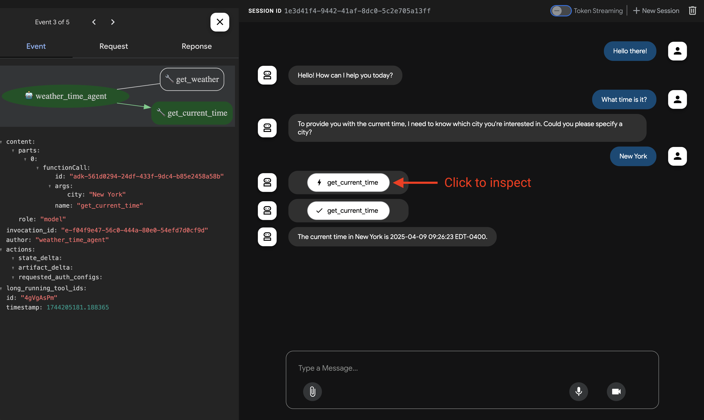
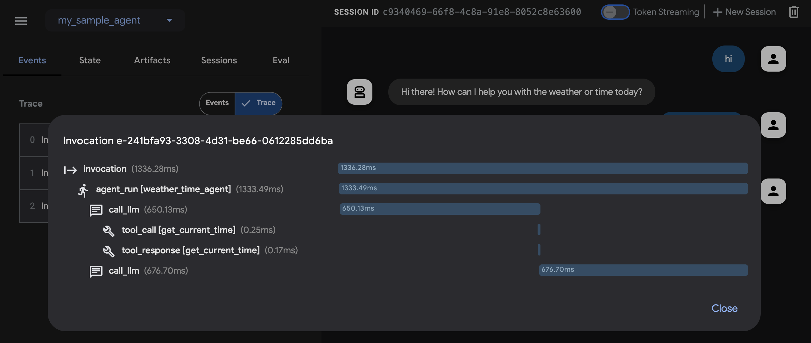
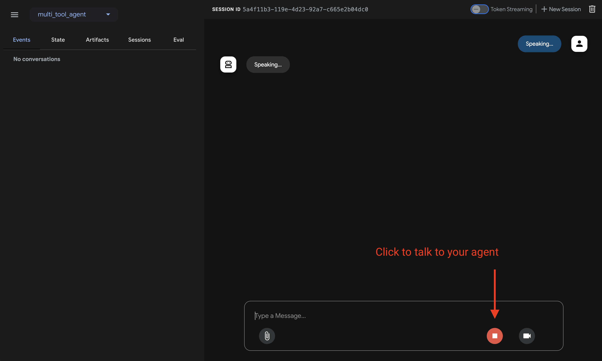
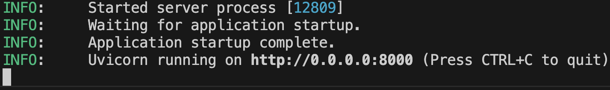

# マルチツールエージェントを構築する

このクイックスタートでは、Agent Development Kit (ADK) をインストールし、複数のツールを備えた基本的なエージェントを設定し、ターミナルまたは対話型のブラウザベースの開発UIでローカルで実行する方法を説明します。

<!--  -->

このクイックスタートは、Python 3.10+またはJava 17+がインストールされ、ターミナルアクセスが可能なローカルIDE (VS Code、PyCharm、IntelliJ IDEAなど) を想定しています。この方法は、アプリケーションをマシン上で完全に実行するため、内部開発に推奨されます。

## 1. 環境設定とADKのインストール { #set-up-environment-install-adk }

=== "Python"

    仮想環境の作成とアクティブ化 (推奨):

    ```bash
    # 作成
    python3 -m venv .venv
    # アクティブ化 (新しいターミナルごとに)
    # macOS/Linux: source .venv/bin/activate
    # Windows CMD: .venv\Scripts\activate.bat
    # Windows PowerShell: .venv\Scripts\Activate.ps1
    ```

    ADKのインストール:

    ```bash
    pip install google-adk
    ```

=== "TypeScript"

    新しいプロジェクトディレクトリを作成して初期化し、依存関係をインストールします:

    ```bash
    mkdir my-adk-agent
    cd my-adk-agent
    npm init -y
    npm install @google/adk @google/adk-devtools
    npm install -D typescript
    ```

    次の内容で `tsconfig.json` ファイルを作成します。この設定により、プロジェクトが最新の Node.js モジュールを正しく扱えるようになります。

    ```json title="tsconfig.json"
    {
      "compilerOptions": {
        "target": "es2020",
        "module": "nodenext",
        "moduleResolution": "nodenext",
        "esModuleInterop": true,
        "strict": true,
        "skipLibCheck": true,
        // CommonJS モジュール構文を許可するには false に設定:
        "verbatimModuleSyntax": false
      }
    }
    ```

=== "Java"

    ADKをインストールし、環境をセットアップするには、次の手順に進んでください。

=== "Go"

    新しいプロジェクトを始める場合は、新しいGoモジュールを作成できます:

    ```bash
    mkdir my-adk-agent
    cd my-adk-agent
    go mod init example.com/my-agent
    ```

    ADKをプロジェクトに追加するには、次のコマンドを実行します:

    ```bash
    go get google.golang.org/adk
    ```

    これで、ADKが`go.mod`ファイルの依存関係として追加されます。

## 2. エージェントプロジェクトを作成する { #create-agent-project }

### プロジェクト構造

=== "Python"

    次のプロジェクト構造を作成する必要があります。

    ```console
    parent_folder/
        multi_tool_agent/
            __init__.py
            agent.py
            .env
    ```

    `multi_tool_agent`フォルダを作成します。

    ```bash
    mkdir multi_tool_agent/
    ```

    !!! info "Windowsユーザーへの注意"

        次のいくつかのステップでWindowsでADKを使用する場合、次のコマンド (`mkdir`、`echo`) は通常、NULLバイトや誤ったエンコーディングでファイルを生成するため、ファイルエクスプローラまたはIDEを使用してPythonファイルを作成することをお勧めします。

    ### `__init__.py`

    次に、フォルダに`__init__.py`ファイルを作成します。

    ```shell
    echo "from . import agent" > multi_tool_agent/__init__.py
    ```

    `__init__.py`は次のようになります。

    ```python title="multi_tool_agent/__init__.py"
    --8<-- "examples/python/snippets/get-started/multi_tool_agent/__init__.py"
    ```

    ### `agent.py`

    同じフォルダに`agent.py`ファイルを作成します。

    === "OS X &amp; Linux"
        ```shell
        touch multi_tool_agent/agent.py
        ```

    === "Windows"
        ```shell
        type nul > multi_tool_agent\.env
        ```

    次のコードを`agent.py`にコピーして貼り付けます。

    ```python title="multi_tool_agent/agent.py"
    --8<-- "examples/python/snippets/get-started/multi_tool_agent/agent.py"
    ```

    ### `.env`

    同じフォルダに`.env`ファイルを作成します。

    === "OS X &amp; Linux"
        ```shell
        touch multi_tool_agent/.env
        ```

    === "Windows"
        ```shell
        type nul > multi_tool_agent\.env
        ```

    このファイルに関する詳細な指示は、[モデルのセットアップ](#set-up-the-model)に関する次のセクションで説明されています。

=== "TypeScript"

    `my-adk-agent` ディレクトリに次のプロジェクト構造を作成する必要があります:

    ```console
    my-adk-agent/
        agent.ts
        .env
        package.json
        tsconfig.json
    ```

    ### `agent.ts`

    プロジェクトフォルダに `agent.ts` ファイルを作成します:

    === "OS X &amp; Linux"
        ```shell
        touch agent.ts
        ```

    === "Windows"
        ```shell
        type nul > agent.ts
        ```

    次のコードを `agent.ts` にコピーして貼り付けます:

    ```typescript title="agent.ts"
    --8<-- "examples/typescript/snippets/get-started/multi_tool_agent/agent.ts"
    ```

    ### `.env`

    同じフォルダに `.env` ファイルを作成します:

    === "OS X &amp; Linux"
        ```shell
        touch .env
        ```

    === "Windows"
        ```shell
        type nul > .env
        ```

    このファイルに関する詳細は、次の [モデルのセットアップ](#set-up-the-model) セクションで説明します。

=== "Java"

    Javaプロジェクトは通常、次のプロジェクト構造を特徴とします。

    ```console
    project_folder/
    ├── pom.xml (または build.gradle)
    ├── src/
    ├──    └── main/
    │       └── java/
    │           └── agents/
    │               └── multitool/
    └── test/
    ```

    ### `MultiToolAgent.java`を作成する

    `src/main/java/agents/multitool/`ディレクトリの`agents.multitool`パッケージに`MultiToolAgent.java`ソースファイルを作成します。

    次のコードを`MultiToolAgent.java`にコピーして貼り付けます。

    ```java title="agents/multitool/MultiToolAgent.java"
    --8<-- "examples/java/cloud-run/src/main/java/agents/multitool/MultiToolAgent.java:full_code"
    ```

=== "Go"

    次のプロジェクト構造を作成する必要があります。

    ```console
    my-adk-agent/
        agent.go
        .env
        go.mod
    ```

    ### `agent.go`

    プロジェクトフォルダに`agent.go`ファイルを作成します。

    === "OS X &amp; Linux"
        ```bash
        touch agent.go
        ```

    === "Windows"
        ```console
        type nul > agent.go
        ```

    次のコードを`agent.go`にコピーして貼り付けます。

    ```go title="agent.go"
    --8<-- "examples/go/snippets/get-started/multi_tool_agent/main.go:full_code"
    ```

    ### `.env`

    同じフォルダに`.env`ファイルを作成します。

    === "OS X &amp; Linux"
        ```bash
        touch .env
        ```

    === "Windows"
        ```console
        type nul > .env
        ```


## 3. モデルをセットアップする { #set-up-the-model }

エージェントがユーザー要求を理解し、応答を生成する能力は、大規模言語モデル (LLM) によって強化されています。エージェントは、この外部LLMサービスに安全な呼び出しを行う必要があり、これには**認証情報**が必要です。有効な認証がないと、LLMサービスはエージェントの要求を拒否し、エージェントは機能できません。

!!! tip "モデル認証ガイド"
    さまざまなモデルの認証に関する詳細なガイドについては、[認証ガイド](/ja/agents/models/google-gemini#google-ai-studio)を参照してください。
    これは、エージェントがLLMサービスに呼び出しを行えるようにするための重要なステップです。

=== "Gemini - Google AI Studio"
    1. [Google AI Studio](https://aistudio.google.com/apikey)からAPIキーを取得します。
    2. Pythonを使用している場合は、(`multi_tool_agent/`) 内にある**`.env`**ファイルを開き、次のコードをコピーして貼り付けます。

        ```env title="multi_tool_agent/.env"
        GOOGLE_GENAI_USE_VERTEXAI=FALSE
        GOOGLE_API_KEY=PASTE_YOUR_ACTUAL_API_KEY_HERE
        ```

        Javaを使用している場合は、環境変数を定義します。

        ```console title="terminal"
        export GOOGLE_GENAI_USE_VERTEXAI=FALSE
        export GOOGLE_API_KEY=PASTE_YOUR_ACTUAL_API_KEY_HERE
        ```

        TypeScript を使用する場合、`.env` ファイルは `agent.ts` の先頭にある `import 'dotenv/config';` 行によって自動的に読み込まれます。

        ```env title="multi_tool_agent/.env"
        GOOGLE_GENAI_USE_VERTEXAI=FALSE
        GOOGLE_GENAI_API_KEY=PASTE_YOUR_ACTUAL_API_KEY_HERE
        ```

        Goを使用している場合は、ターミナルで環境変数を定義するか、`.env`ファイルを使用します:

        ```bash title="terminal"
        export GOOGLE_GENAI_USE_VERTEXAI=FALSE
        export GOOGLE_API_KEY=PASTE_YOUR_ACTUAL_API_KEY_HERE
        ```

    3. `PASTE_YOUR_ACTUAL_API_KEY_HERE`を実際の`API KEY`に置き換えます。

=== "Gemini - Google Cloud Vertex AI"
    1. [Google Cloudプロジェクト](https://cloud.google.com/vertex-ai/generative-ai/docs/start/quickstarts/quickstart-multimodal#setup-gcp)をセットアップし、[Vertex AI APIを有効](https://console.cloud.google.com/flows/enableapi?apiid=aiplatform.googleapis.com)にします。
    2. [gcloud CLI](https://cloud.google.com/vertex-ai/generative-ai/docs/start/quickstarts/quickstart-multimodal#setup-local)をセットアップします。
    3. ターミナルから`gcloud auth application-default login`を実行してGoogle Cloudに認証します。
    4. Pythonを使用している場合は、(`multi_tool_agent/`) 内にある**`.env`**ファイルを開きます。次のコードをコピーして貼り付け、プロジェクトIDとロケーションを更新します。

        ```env title="multi_tool_agent/.env"
        GOOGLE_GENAI_USE_VERTEXAI=TRUE
        GOOGLE_CLOUD_PROJECT=YOUR_PROJECT_ID
        GOOGLE_CLOUD_LOCATION=LOCATION
        ```

        Javaを使用している場合は、環境変数を定義します。

        ```console title="terminal"
        export GOOGLE_GENAI_USE_VERTEXAI=TRUE
        export GOOGLE_CLOUD_PROJECT=YOUR_PROJECT_ID
        export GOOGLE_CLOUD_LOCATION=LOCATION
        ```

        TypeScript を使用する場合、`.env` ファイルは `agent.ts` の先頭にある `import 'dotenv/config';` 行によって自動的に読み込まれます。

        ```env title="multi_tool_agent/.env"
        GOOGLE_GENAI_USE_VERTEXAI=TRUE
        GOOGLE_CLOUD_PROJECT=YOUR_PROJECT_ID
        GOOGLE_CLOUD_LOCATION=LOCATION
        ```

        Goを使用している場合は、ターミナルで環境変数を定義するか、`.env`ファイルを使用します:

        ```bash title="terminal"
        export GOOGLE_GENAI_USE_VERTEXAI=TRUE
        export GOOGLE_CLOUD_PROJECT=YOUR_PROJECT_ID
        export GOOGLE_CLOUD_LOCATION=LOCATION
        ```

=== "Gemini - Google Cloud Vertex AI Expressモードの使用"
    1. 無料のGoogle Cloudプロジェクトにサインアップし、対象となるアカウントでGeminiを無料で利用できます！
        * [Vertex AI ExpressモードのGoogle Cloudプロジェクト](https://cloud.google.com/vertex-ai/generative-ai/docs/start/express-mode/overview)をセットアップします。
        * ExpressモードプロジェクトからAPIキーを取得します。このキーはADKでGeminiモデルを無料で利用したり、Agent Engineサービスにアクセスしたりするために使用できます。
    2. Pythonを使用している場合は、(`multi_tool_agent/`) 内にある**`.env`**ファイルを開きます。次のコードをコピーして貼り付け、プロジェクトIDとロケーションを更新します。

        ```env title="multi_tool_agent/.env"
        GOOGLE_GENAI_USE_VERTEXAI=TRUE
        GOOGLE_API_KEY=PASTE_YOUR_ACTUAL_EXPRESS_MODE_API_KEY_HERE
        ```

        Javaを使用している場合は、環境変数を定義します。

        ```console title="terminal"
        export GOOGLE_GENAI_USE_VERTEXAI=TRUE
        export GOOGLE_API_KEY=PASTE_YOUR_ACTUAL_EXPRESS_MODE_API_KEY_HERE
        ```

        TypeScript を使用する場合、`.env` ファイルは `agent.ts` の先頭にある `import 'dotenv/config';` 行によって自動的に読み込まれます。

        ```env title="multi_tool_agent/.env"
        GOOGLE_GENAI_USE_VERTEXAI=TRUE
        GOOGLE_GENAI_API_KEY=PASTE_YOUR_ACTUAL_EXPRESS_MODE_API_KEY_HERE
        ```

        Goを使用している場合は、ターミナルで環境変数を定義するか、`.env`ファイルを使用します:

        ```bash title="terminal"
        export GOOGLE_GENAI_USE_VERTEXAI=TRUE
        export GOOGLE_API_KEY=PASTE_YOUR_ACTUAL_EXPRESS_MODE_API_KEY_HERE
        ```

## 4. エージェントを実行する { #run-your-agent }

=== "Python"

    ターミナルを使用して、エージェントプロジェクトの親ディレクトリに移動します (例: `cd ..`を使用)。

    ```console
    parent_folder/      <-- このディレクトリに移動
        multi_tool_agent/
            __init__.py
            agent.py
            .env
    ```

    エージェントと対話する方法は複数あります。

    === "開発UI (adk web)"

        !!! success "Vertex AIユーザーの認証設定"
            前の手順で**「Gemini - Google Cloud Vertex AI」**を選択した場合、開発UIを起動する前にGoogle Cloudで認証する必要があります。

            このコマンドを実行し、プロンプトに従ってください。
            ```bash
            gcloud auth application-default login
            ```

            **注:** 「Gemini - Google AI Studio」を使用している場合は、この手順をスキップしてください。

        次のコマンドを実行して**開発UI**を起動します。

        ```shell
        adk web
        ```

        !!!info "Windowsユーザーへの注意"

            `_make_subprocess_transport NotImplementedError`が発生した場合は、代わりに`adk web --no-reload`を使用することを検討してください。


        **ステップ1:** 提供されたURL (通常は`http://localhost:8000`または`http://127.0.0.1:8000`) をブラウザで直接開きます。

        **ステップ2.** UIの左上隅にあるドロップダウンでエージェントを選択できます。「multi_tool_agent」を選択します。

        !!!note "トラブルシューティング"

            ドロップダウンメニューに「multi_tool_agent」が表示されない場合は、エージェントフォルダの**親フォルダ** (つまり、multi_tool_agentの親フォルダ) で`adk web`を実行していることを確認してください。

        **ステップ3.** 次に、テキストボックスを使用してエージェントとチャットできます。

        


        **ステップ4.** 左側の`イベント`タブを使用して、アクションをクリックすることで個々の関数呼び出し、応答、モデル応答を検査できます。

        

        `イベント`タブでは、`トレース`ボタンをクリックして、各関数呼び出しの遅延時間を示す各イベントのトレースログを表示することもできます。

        

        **ステップ5.** マイクを有効にしてエージェントと話すこともできます。

        !!!note "音声/ビデオストリーミングのモデルサポート"

            ADKで音声/ビデオストリーミングを使用するには、Live APIをサポートするGeminiモデルを使用する必要があります。Gemini Live APIをサポートする**モデルID**は、次のドキュメントに記載されています。

            - [Google AI Studio: Gemini Live API](https://ai.google.dev/gemini-api/docs/models#live-api)
            - [Vertex AI: Gemini Live API](https://cloud.google.com/vertex-ai/generative-ai/docs/live-api)

            その後、以前に作成した`agent.py`ファイルの`root_agent`で`model`文字列を置き換えることができます ([セクションにジャンプ](#agentpy))。コードは次のようになります。

            ```py
            root_agent = Agent(
                name="weather_time_agent",
                model="replace-me-with-model-id", #例: gemini-2.0-flash-live-001
                ...
            ```

        

    === "ターミナル (adk run)"

        !!! tip

            `adk run`を使用する場合、次のようにコマンドにテキストをパイプすることで、プロンプトをエージェントに注入して開始できます。

            ```shell
            echo "まずファイルをリストアップしてください" | adk run file_listing_agent
            ```

        次のコマンドを実行して、Weatherエージェントとチャットします。

        ```
        adk run multi_tool_agent
        ```

        

        終了するには、Cmd/Ctrl+Cを使用します。

    === "APIサーバー (adk api_server)"

        `adk api_server`を使用すると、単一のコマンドでローカルFastAPIサーバーを作成できるため、エージェントをデプロイする前にローカルのcURLリクエストをテストできます。

        

        テストのために`adk api_server`を使用する方法については、[APIサーバーの使用に関するドキュメント](/ja/runtime/api-server/)を参照してください。

=== "TypeScript"

    ターミナルを使って、エージェントプロジェクトのディレクトリに移動します:

    ```console
    my-adk-agent/      <-- このディレクトリに移動
        agent.ts
        .env
        package.json
        tsconfig.json
    ```

    エージェントと対話する方法は複数あります。

    === "開発UI (adk web)"

        次のコマンドを実行して **開発UI** を起動します。

        ```shell
        npx adk web
        ```

        **ステップ1:** 提供されたURL (通常は `http://localhost:8000` または `http://127.0.0.1:8000`) をブラウザで直接開きます。

        **ステップ2.** UI 左上のドロップダウンでエージェントを選択します。エージェントはファイル名で表示されるため、`"agent"` を選択してください。

        !!!note "トラブルシューティング"

            ドロップダウンメニューに `"agent"` が表示されない場合は、`agent.ts` ファイルがあるディレクトリで `npx adk web` を実行していることを確認してください。

        **ステップ3.** テキストボックスを使ってエージェントとチャットできます:

        

        **ステップ4.** 左側の `イベント` タブでは、アクションをクリックして個々の関数呼び出し、レスポンス、モデルレスポンスを確認できます:

        

        `イベント` タブでは、`トレース` ボタンをクリックして各関数呼び出しのレイテンシを示すイベントごとのトレースログも確認できます:

        

    === "ターミナル (adk run)"

        次のコマンドを実行してエージェントと対話します。

        ```
        npx adk run agent.ts
        ```

        

        終了するには Cmd/Ctrl+C を使用します。

    === "APIサーバー (adk api_server)"

        `npx adk api_server` を使うと、単一のコマンドでローカル Express.js サーバーを作成できるため、エージェントをデプロイする前にローカルの cURL リクエストをテストできます。

        

        `api_server` を使ったテスト方法については、[テスト用ドキュメント](/ja/runtime/api-server/)を参照してください。

=== "Go"

    ターミナルを使って、エージェントプロジェクトのディレクトリに移動します:

    ```console
    my-adk-agent/      <-- このディレクトリに移動
        agent.go
        .env
        go.mod
    ```

    エージェントと対話する方法は複数あります。

    === "開発UI (web)"

        次のコマンドを実行して**開発UI**を起動します。アクティブにするサブランチャーを指定する必要があります（例: `webui`、`api`）。

        ```bash
        go run agent.go web webui api
        ```

        **ステップ1:** 提供されたURL (通常は`http://localhost:8080`) をブラウザで直接開きます。

        **ステップ2.** UIの左上隅にあるドロップダウンでエージェントを選択できます。「weather_time_agent」を選択します。

        **ステップ3.** 次に、テキストボックスを使用してエージェントとチャットできます。

    === "ターミナル (console)"

        ターミナルでエージェントとチャットするには、次のコマンドを実行します。

        ```bash
        go run agent.go console
        ```

        **注:** `console`がコード内で最初のサブランチャーである場合（`full.NewLauncher()`のように）、`go run agent.go`だけを実行することもできます。

        終了するには、Cmd/Ctrl+Cを使用します。

=== "Java"

    ターミナルを使用して、エージェントプロジェクトの親ディレクトリに移動します (例: `cd ..`を使用)。

    ```console
    project_folder/                <-- このディレクトリに移動
    ├── pom.xml (または build.gradle)
    ├── src/
    ├──    └── main/
    │       └── java/
    │           └── agents/
    │               └── multitool/
    │                   └── MultiToolAgent.java
    └── test/
    ```

    === "開発UI"

        ターミナルから次のコマンドを実行して開発UIを起動します。

        **開発UIサーバーのメインクラス名は変更しないでください。**

        ```console title="terminal"
        mvn exec:java \
            -Dexec.mainClass="com.google.adk.web.AdkWebServer" \
            -Dexec.args="--adk.agents.source-dir=src/main/java" \
            -Dexec.classpathScope="compile"
        ```

        **ステップ1:** 提供されたURL (通常は`http://localhost:8080`または`http://127.0.0.1:8080`) をブラウザで直接開きます。

        **ステップ2.** UIの左上隅にあるドロップダウンでエージェントを選択できます。「multi_tool_agent」を選択します。

        !!!note "トラブルシューティング"

            ドロップダウンメニューに「multi_tool_agent」が表示されない場合は、Javaソースコードがある場所 (通常は`src/main/java`) で`mvn`コマンドを実行していることを確認してください。

        **ステップ3.** 次に、テキストボックスを使用してエージェントとチャットできます。

        

        **ステップ4.** 個々の関数呼び出し、応答、モデル応答をアクションをクリックして検査することもできます。

        

    === "Maven"

        Mavenを使用する場合、次のコマンドでJavaクラスの`main()`メソッドを実行します。

        ```console title="terminal"
        mvn compile exec:java -Dexec.mainClass="agents.multitool.MultiToolAgent"
        ```

    === "Gradle"

        Gradleを使用する場合、`build.gradle`または`build.gradle.kts`ビルドファイルの`plugins`セクションに次のJavaプラグインが必要です。

        ```groovy
        plugins {
            id('java')
            // その他のプラグイン
        }
        ```

        次に、ビルドファイルの最上位の別の場所に、エージェントの`main()`メソッドを実行する新しいタスクを作成します。

        ```groovy
        tasks.register('runAgent', JavaExec) {
            classpath = sourceSets.main.runtimeClasspath
            mainClass = 'agents.multitool.MultiToolAgent'
        }
        ```

        最後に、コマンドラインで次のコマンドを実行します。

        ```console
        gradle runAgent
        ```


### 📝 試してみるプロンプトの例

* ニューヨークの天気はどうですか？
* ニューヨークの時間は何時ですか？
* パリの天気はどうですか？
* パリの時間は何時ですか？

## 🎉 おめでとうございます！

ADKを使用して最初のエージェントの作成と対話に成功しました！

---

## 🛣️ 次のステップ

* **チュートリアルに進む**: エージェントにメモリ、セッション、状態を追加する方法を学びます。
  [チュートリアル](/ja/tutorials/)。
* **高度な構成を深く掘り下げる:** プロジェクト構造、構成、その他のインターフェースの詳細については、[セットアップ](/ja/get-started/installation/)セクションを参照してください。
* **コアコンセプトを理解する:** [エージェントの概念](/ja/agents/)について学びます。
