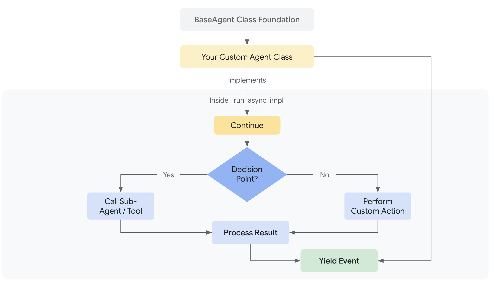

# 커스텀 에이전트

<div class="language-support-tag">
  <span class="lst-supported">ADK에서 지원</span><span class="lst-python">Python v0.1.0</span><span class="lst-go">Go v0.1.0</span><span class="lst-java">Java v0.2.0</span>
</div>

커스텀 에이전트는 `BaseAgent`를 직접 상속하고 자신만의 제어 흐름을 구현하여 **임의의 오케스트레이션 로직**을 정의할 수 있게 함으로써 ADK에서 최고의 유연성을 제공합니다. 이는 `SequentialAgent`, `LoopAgent`, `ParallelAgent`의 사전 정의된 패턴을 넘어서, 매우 특수하고 복잡한 에이전트 워크플로우를 구축할 수 있게 해줍니다.

!!! warning "고급 개념"

    `_run_async_impl`(또는 다른 언어의 해당 메서드)을 직접 구현하여 커스텀 에이전트를 구축하는 것은 강력한 제어 기능을 제공하지만, 사전 정의된 `LlmAgent`나 표준 `WorkflowAgent` 타입을 사용하는 것보다 더 복잡합니다. 커스텀 오케스트레이션 로직을 다루기 전에 이러한 기본 에이전트 타입들을 먼저 이해하는 것을 권장합니다.

## 소개: 사전 정의된 워크플로우를 넘어서

### 커스텀 에이전트란?

커스텀 에이전트는 본질적으로 `google.adk.agents.BaseAgent`를 상속하고 `_run_async_impl` 비동기 메서드 내에 핵심 실행 로직을 구현하여 생성하는 모든 클래스입니다. 이 메서드가 다른 에이전트(하위 에이전트)를 호출하고, 상태를 관리하며, 이벤트를 처리하는 방식을 완벽하게 제어할 수 있습니다.

!!! Note
    에이전트의 핵심 비동기 로직을 구현하는 특정 메서드 이름은 SDK 언어에 따라 약간 다를 수 있습니다(예: Java의 `runAsyncImpl`, Python의 `_run_async_impl`). 자세한 내용은 언어별 API 문서를 참조하세요.

### 왜 사용해야 하는가?

표준 [워크플로우 에이전트](workflow-agents/index.md)(`SequentialAgent`, `LoopAgent`, `ParallelAgent`)가 일반적인 오케스트레이션 패턴을 다루지만, 요구 사항에 다음이 포함될 경우 커스텀 에이전트가 필요합니다.

*   **조건부 로직:** 런타임 조건이나 이전 단계의 결과에 따라 다른 하위 에이전트를 실행하거나 다른 경로를 택해야 할 경우.
*   **복잡한 상태 관리:** 단순한 순차적 전달을 넘어 워크플로우 전반에 걸쳐 상태를 유지하고 업데이트하기 위한 복잡한 로직을 구현해야 할 경우.
*   **외부 통합:** 오케스트레이션 흐름 제어 내에서 외부 API, 데이터베이스 또는 커스텀 라이브러리 호출을 직접 통합해야 할 경우.
*   **동적 에이전트 선택:** 상황이나 입력을 동적으로 평가하여 다음에 실행할 하위 에이전트를 선택해야 할 경우.
*   **독특한 워크플로우 패턴:** 표준적인 순차, 병렬 또는 루프 구조에 맞지 않는 오케스트레이션 로직을 구현해야 할 경우.



## 커스텀 로직 구현:

모든 커스텀 에이전트의 핵심은 고유한 비동기 동작을 정의하는 메서드입니다. 이 메서드를 통해 하위 에이전트를 오케스트레이션하고 실행 흐름을 관리할 수 있습니다.

=== "Python"

      모든 커스텀 에이전트의 심장은 `_run_async_impl` 메서드입니다. 이곳에서 고유한 동작을 정의합니다.
      
      *   **시그니처:** `async def _run_async_impl(self, ctx: InvocationContext) -> AsyncGenerator[Event, None]:`
      *   **비동기 제너레이터:** `async def` 함수여야 하며 `AsyncGenerator`를 반환해야 합니다. 이를 통해 하위 에이전트나 자체 로직에서 생성된 이벤트를 `yield`하여 실행기(runner)에 다시 전달할 수 있습니다.
      *   **`ctx` (InvocationContext):** 핵심적인 런타임 정보, 특히 `ctx.session.state`에 대한 접근을 제공합니다. 이는 커스텀 에이전트가 오케스트레이션하는 단계 간에 데이터를 공유하는 주요 방법입니다.

=== "Go"

    Go에서는 `agent.Agent` 인터페이스를 만족하는 구조체의 일부로 `Run` 메서드를 구현합니다. 실제 로직은 일반적으로 커스텀 에이전트 구조체의 메서드가 됩니다.

    *   **시그니처:** `Run(ctx agent.InvocationContext) iter.Seq2[*session.Event, error]`
    *   **이터레이터:** `Run` 메서드는 이벤트와 오류를 반환하는 이터레이터(`iter.Seq2`)를 반환합니다. 이는 에이전트 실행에서 스트리밍 결과를 처리하는 표준적인 방법입니다.
    *   **`ctx` (InvocationContext):** `agent.InvocationContext`는 상태를 포함한 세션 및 기타 핵심적인 런타임 정보에 대한 접근을 제공합니다.
    *   **세션 상태:** `ctx.Session().State()`를 통해 세션 상태에 접근할 수 있습니다.

=== "Java"

    모든 커스텀 에이전트의 심장은 `BaseAgent`로부터 오버라이드하는 `runAsyncImpl` 메서드입니다.

    *   **시그니처:** `protected Flowable<Event> runAsyncImpl(InvocationContext ctx)`
    *   **리액티브 스트림 (`Flowable`):** `io.reactivex.rxjava3.core.Flowable<Event>`를 반환해야 합니다. 이 `Flowable`은 커스텀 에이전트의 로직에 의해 생성될 이벤트의 스트림을 나타내며, 종종 여러 하위 에이전트의 `Flowable`을 결합하거나 변환하여 만들어집니다.
    *   **`ctx` (InvocationContext):** 핵심적인 런타임 정보, 특히 `java.util.concurrent.ConcurrentMap<String, Object>`인 `ctx.session().state()`에 대한 접근을 제공합니다. 이는 커스텀 에이전트가 오케스트레이션하는 단계 간에 데이터를 공유하는 주요 방법입니다.

**핵심 비동기 메서드 내 주요 기능:**

=== "Python"

    1. **하위 에이전트 호출:** `run_async` 메서드를 사용하여 (일반적으로 `self.my_llm_agent`와 같은 인스턴스 속성으로 저장된) 하위 에이전트를 호출하고 그 이벤트를 yield합니다.

          ```python
          async for event in self.some_sub_agent.run_async(ctx):
              # 선택적으로 이벤트를 검사하거나 로그 기록
              yield event # 이벤트를 상위로 전달
          ```

    2. **상태 관리:** 세션 상태 딕셔너리(`ctx.session.state`)를 읽고 써서 하위 에이전트 호출 간에 데이터를 전달하거나 결정을 내립니다.
          ```python
          # 이전 에이전트가 설정한 데이터 읽기
          previous_result = ctx.session.state.get("some_key")
      
          # 상태에 기반한 결정
          if previous_result == "some_value":
              # ... 특정 하위 에이전트 호출 ...
          else:
              # ... 다른 하위 에이전트 호출 ...
      
          # 나중 단계를 위한 결과 저장 (종종 하위 에이전트의 output_key를 통해 수행됨)
          # ctx.session.state["my_custom_result"] = "calculated_value"
          ```

    3. **제어 흐름 구현:** 표준 Python 구문(`if`/`elif`/`else`, `for`/`while` 루프, `try`/`except`)을 사용하여 하위 에이전트를 포함하는 정교하고, 조건부이거나, 반복적인 워크플로우를 만듭니다.

=== "Go"

    1. **하위 에이전트 호출:** `Run` 메서드를 호출하여 하위 에이전트를 호출합니다.

          ```go
          // 예: 하나의 하위 에이전트를 실행하고 그 이벤트를 반환
          for event, err := range someSubAgent.Run(ctx) {
              if err != nil {
                  // 오류를 처리하거나 전파
                  return
              }
              // 호출자에게 이벤트를 반환
              if !yield(event, nil) {
                return
              }
          }
          ```

    2. **상태 관리:** 세션 상태를 읽고 써서 하위 에이전트 호출 간에 데이터를 전달하거나 결정을 내립니다.
          ```go
          // `ctx` (`agent.InvocationContext`)는 에이전트의 `Run` 함수에 직접 전달됨.
          // 이전 에이전트가 설정한 데이터 읽기
          previousResult, err := ctx.Session().State().Get("some_key")
          if err != nil {
              // 키가 아직 존재하지 않을 수 있는 경우 처리
          }

          // 상태에 기반한 결정
          if val, ok := previousResult.(string); ok && val == "some_value" {
              // ... 특정 하위 에이전트 호출 ...
          } else {
              // ... 다른 하위 에이전트 호출 ...
          }

          // 나중 단계를 위한 결과 저장
          if err := ctx.Session().State().Set("my_custom_result", "calculated_value"); err != nil {
              // 오류 처리
          }
          ```

    3. **제어 흐름 구현:** 표준 Go 구문(`if`/`else`, `for`/`switch` 루프, 고루틴, 채널)을 사용하여 하위 에이전트를 포함하는 정교하고, 조건부이거나, 반복적인 워크플로우를 만듭니다.

=== "Java"

    1. **하위 에이전트 호출:** 비동기 실행 메서드를 사용하여 (일반적으로 인스턴스 속성이나 객체로 저장된) 하위 에이전트를 호출하고 그 이벤트 스트림을 반환합니다.

           일반적으로 RxJava 연산자인 `concatWith`, `flatMapPublisher`, `concatArray` 등을 사용하여 하위 에이전트의 `Flowable`들을 연결합니다.

           ```java
           // 예: 하나의 하위 에이전트 실행
           // return someSubAgent.runAsync(ctx);
      
           // 예: 하위 에이전트를 순차적으로 실행
           Flowable<Event> firstAgentEvents = someSubAgent1.runAsync(ctx)
               .doOnNext(event -> System.out.println("에이전트 1의 이벤트: " + event.id()));
      
           Flowable<Event> secondAgentEvents = Flowable.defer(() ->
               someSubAgent2.runAsync(ctx)
                   .doOnNext(event -> System.out.println("에이전트 2의 이벤트: " + event.id()))
           );
      
           return firstAgentEvents.concatWith(secondAgentEvents);
           ```
           `Flowable.defer()`는 후속 단계의 실행이 이전 단계의 완료나 상태에 따라 달라지는 경우에 자주 사용됩니다.

    2. **상태 관리:** 세션 상태를 읽고 써서 하위 에이전트 호출 간에 데이터를 전달하거나 결정을 내립니다. 세션 상태는 `ctx.session().state()`를 통해 얻는 `java.util.concurrent.ConcurrentMap<String, Object>`입니다.
        
        ```java
        // 이전 에이전트가 설정한 데이터 읽기
        Object previousResult = ctx.session().state().get("some_key");

        // 상태에 기반한 결정
        if ("some_value".equals(previousResult)) {
            // ... 특정 하위 에이전트의 Flowable을 포함하는 로직 ...
        } else {
            // ... 다른 하위 에이전트의 Flowable을 포함하는 로직 ...
        }

        // 나중 단계를 위한 결과 저장 (종종 하위 에이전트의 output_key를 통해 수행됨)
        // ctx.session().state().put("my_custom_result", "calculated_value");
        ```

    3. **제어 흐름 구현:** 표준 언어 구문(`if`/`else`, 루프, `try`/`catch`)과 리액티브 연산자(RxJava)를 결합하여 정교한 워크플로우를 만듭니다.

          *   **조건부:** 조건에 따라 구독할 `Flowable`을 선택하기 위해 `Flowable.defer()`를 사용하거나, 스트림 내에서 이벤트를 필터링하는 경우 `filter()`를 사용합니다.
          *   **반복:** `repeat()`, `retry()` 같은 연산자를 사용하거나, 조건에 따라 `Flowable` 체인의 일부를 재귀적으로 호출하도록 구조화합니다(종종 `flatMapPublisher`나 `concatMap`으로 관리).

## 하위 에이전트와 상태 관리

일반적으로 커스텀 에이전트는 다른 에이전트(`LlmAgent`, `LoopAgent` 등)를 오케스트레이션합니다.

*   **초기화:** 보통 이러한 하위 에이전트의 인스턴스를 커스텀 에이전트의 생성자에 전달하고 인스턴스 필드/속성으로 저장합니다(예: `this.story_generator = story_generator_instance` 또는 `self.story_generator = story_generator_instance`). 이렇게 하면 커스텀 에이전트의 핵심 비동기 실행 로직(예: `_run_async_impl` 메서드) 내에서 접근할 수 있습니다.
*   **하위 에이전트 목록:** `super()` 생성자를 사용하여 `BaseAgent`를 초기화할 때, `sub agents` 목록을 전달해야 합니다. 이 목록은 ADK 프레임워크에게 이 커스텀 에이전트의 직계 계층에 속한 에이전트가 무엇인지 알려줍니다. 이는 핵심 실행 로직(`_run_async_impl`)이 `self.xxx_agent`를 통해 에이전트를 직접 호출하더라도 생명주기 관리, 인트로스펙션, 그리고 잠재적인 미래 라우팅 기능과 같은 프레임워크 기능에 중요합니다. 커스텀 로직이 최상위 수준에서 직접 호출하는 에이전트들을 포함시키세요.
*   **상태:** 언급했듯이, `ctx.session.state`는 하위 에이전트(특히 `output key`를 사용하는 `LlmAgent`)가 결과를 오케스트레이터에게 다시 전달하고 오케스트레이터가 필요한 입력을 전달하는 표준적인 방법입니다.

## 디자인 패턴 예시: `StoryFlowAgent`

조건부 로직이 포함된 다단계 콘텐츠 생성 워크플로우 예시 패턴으로 커스텀 에이전트의 강력함을 설명해 보겠습니다.

**목표:** 이야기를 생성하고, 비평과 수정을 통해 반복적으로 개선하며, 최종 검사를 수행하고, 결정적으로 *최종 톤 검사에 실패하면 이야기를 재생성하는* 시스템을 만드는 것입니다.

**왜 커스텀인가?** 여기서 커스텀 에이전트가 필요한 핵심 요구 사항은 **톤 검사에 기반한 조건부 재생성**입니다. 표준 워크플로우 에이전트는 하위 에이전트 작업의 결과에 따른 조건부 분기 기능이 내장되어 있지 않습니다. 오케스트레이터 내에 커스텀 로직(`if tone == "negative": ...`)이 필요합니다.

---

### 1부: 단순화된 커스텀 에이전트 초기화 { #part-1-simplified-custom-agent-initialization }

=== "Python"

    `BaseAgent`를 상속하는 `StoryFlowAgent`를 정의합니다. `__init__`에서 (전달받은) 필요한 하위 에이전트를 인스턴스 속성으로 저장하고, 이 커스텀 에이전트가 직접 오케스트레이션할 최상위 에이전트를 `BaseAgent` 프레임워크에 알립니다.
    
    ```python
    --8<-- "examples/python/snippets/agents/custom-agent/storyflow_agent.py:init"
    ```

=== "Go"

    `StoryFlowAgent` 구조체와 생성자를 정의합니다. 생성자에서 필요한 하위 에이전트를 저장하고, 이 커스텀 에이전트가 직접 오케스트레이션할 최상위 에이전트를 `BaseAgent` 프레임워크에 알립니다.

    ```go
    --8<-- "examples/go/snippets/agents/custom-agent/storyflow_agent.go:init"
    ```

=== "Java"

    `BaseAgent`를 확장하여 `StoryFlowAgentExample`을 정의합니다. **생성자**에서 (매개변수로 전달된) 필요한 하위 에이전트 인스턴스를 인스턴스 필드로 저장합니다. 이 커스텀 에이전트가 직접 오케스트레이션할 이 최상위 하위 에이전트들은 `BaseAgent`의 `super` 생성자에도 목록으로 전달됩니다.

    ```java
    --8<-- "examples/java/snippets/src/main/java/agents/StoryFlowAgentExample.java:init"
    ```

---

### 2부: 커스텀 실행 로직 정의 { #part-2-defining-the-custom-execution-logic }

=== "Python"

    이 메서드는 표준 Python async/await 및 제어 흐름을 사용하여 하위 에이전트를 오케스트레이션합니다.
    
    ```python
    --8<-- "examples/python/snippets/agents/custom-agent/storyflow_agent.py:executionlogic"
    ```
    **로직 설명:**

    1. 초기 `story_generator`가 실행됩니다. 그 출력은 `ctx.session.state["current_story"]`에 있을 것으로 예상됩니다.
    2. `loop_agent`가 실행되며, 내부적으로 `critic`과 `reviser`를 `max_iterations` 횟수만큼 순차적으로 호출합니다. 이들은 상태에서 `current_story`와 `criticism`을 읽고 씁니다.
    3. `sequential_agent`가 실행되며, `grammar_check`와 `tone_check`를 차례로 호출하여 `current_story`를 읽고 `grammar_suggestions`와 `tone_check_result`를 상태에 씁니다.
    4. **커스텀 부분:** `if` 문은 상태에서 `tone_check_result`를 확인합니다. 만약 "negative"라면, `story_generator`가 *다시* 호출되어 상태의 `current_story`를 덮어씁니다. 그렇지 않으면 흐름이 종료됩니다.

=== "Go"

    `Run` 메서드는 각 하위 에이전트의 `Run` 메서드를 루프에서 호출하고 그 이벤트를 반환하여 하위 에이전트를 오케스트레이션합니다.

    ```go
    --8<-- "examples/go/snippets/agents/custom-agent/storyflow_agent.go:executionlogic"
    ```
    **로직 설명:**

    1. 초기 `storyGenerator`가 실행됩니다. 그 출력은 세션 상태의 `"current_story"` 키 아래에 있을 것으로 예상됩니다.
    2. `revisionLoopAgent`가 실행되며, 내부적으로 `critic`과 `reviser`를 `max_iterations` 횟수만큼 순차적으로 호출합니다. 이들은 상태에서 `current_story`와 `criticism`을 읽고 씁니다.
    3. `postProcessorAgent`가 실행되며, `grammar_check`와 `tone_check`를 차례로 호출하여 `current_story`를 읽고 `grammar_suggestions`와 `tone_check_result`를 상태에 씁니다.
    4. **커스텀 부분:** 코드는 상태에서 `tone_check_result`를 확인합니다. 만약 "negative"라면, `story_generator`가 *다시* 호출되어 상태의 `current_story`를 덮어씁니다. 그렇지 않으면 흐름이 종료됩니다.

=== "Java"
    
    `runAsyncImpl` 메서드는 RxJava의 Flowable 스트림과 연산자를 사용하여 비동기 제어 흐름으로 하위 에이전트를 오케스트레이션합니다.

    ```java
    --8<-- "examples/java/snippets/src/main/java/agents/StoryFlowAgentExample.java:executionlogic"
    ```
    **로직 설명:**

    1. 초기 `storyGenerator.runAsync(invocationContext)` Flowable이 실행됩니다. 그 출력은 `invocationContext.session().state().get("current_story")`에 있을 것으로 예상됩니다.
    2. (`Flowable.concatArray`와 `Flowable.defer` 덕분에) 다음으로 `loopAgent`의 Flowable이 실행됩니다. LoopAgent는 내부적으로 `critic`과 `reviser` 하위 에이전트를 최대 `maxIterations`만큼 순차적으로 호출합니다. 이들은 상태에서 `current_story`와 `criticism`을 읽고 씁니다.
    3. 그 다음, `sequentialAgent`의 Flowable이 실행됩니다. 이는 `grammar_check`와 `tone_check`를 차례로 호출하여 `current_story`를 읽고 `grammar_suggestions`와 `tone_check_result`를 상태에 씁니다.
    4. **커스텀 부분:** sequentialAgent가 완료된 후, `Flowable.defer` 내의 로직이 `invocationContext.session().state()`에서 "tone_check_result"를 확인합니다. 만약 "negative"라면, `storyGenerator` Flowable이 *조건부로 연결되어* 다시 실행되고 "current_story"를 덮어씁니다. 그렇지 않으면 빈 Flowable이 사용되고 전체 워크플로우는 완료로 진행됩니다.

---

### 3부: LLM 하위 에이전트 정의 { #part-3-defining-the-llm-sub-agents }

이것들은 특정 작업을 책임지는 표준 `LlmAgent` 정의입니다. 그들의 `output key` 매개변수는 결과를 `session.state`에 배치하여 다른 에이전트나 커스텀 오케스트레이터가 접근할 수 있도록 하는 데 중요합니다.

!!! tip "지시문에 상태 직접 주입"
    `story_generator`의 지시문을 주목하세요. `{var}` 구문은 플레이스홀더입니다. 지시문이 LLM으로 전송되기 전에, ADK 프레임워크는 (예: `{topic}`)을 `session.state['topic']`의 값으로 자동으로 대체합니다. 이것은 지시문에서 템플릿을 사용하여 에이전트에 컨텍스트를 제공하는 권장 방법입니다. 자세한 내용은 [상태 문서](../sessions/state.md#accessing-session-state-in-agent-instructions)를 참조하세요.

=== "Python"

    ```python
    GEMINI_2_FLASH = "gemini-2.0-flash" # 모델 상수 정의
    --8<-- "examples/python/snippets/agents/custom-agent/storyflow_agent.py:llmagents"
    ```
=== "Java"

    ```java
    --8<-- "examples/java/snippets/src/main/java/agents/StoryFlowAgentExample.java:llmagents"
    ```

=== "Go"

    ```go
    --8<-- "examples/go/snippets/agents/custom-agent/storyflow_agent.go:llmagents"
    ```

---

### 4부: 커스텀 에이전트 인스턴스화 및 실행 { #part-4-instantiating-and-running-the-custom-agent }

마지막으로, `StoryFlowAgent`를 인스턴스화하고 평소처럼 `Runner`를 사용합니다.

=== "Python"

    ```python
    --8<-- "examples/python/snippets/agents/custom-agent/storyflow_agent.py:story_flow_agent"
    ```

=== "Go"

    ```go
    --8<-- "examples/go/snippets/agents/custom-agent/storyflow_agent.go:story_flow_agent"
    ```

=== "Java"

    ```java
    --8<-- "examples/java/snippets/src/main/java/agents/StoryFlowAgentExample.java:story_flow_agent"
    ```

*(참고: import 및 실행 로직을 포함한 전체 실행 가능 코드는 아래 링크에서 찾을 수 있습니다.)*

---

## 전체 코드 예제

???+ "Storyflow 에이전트"

    === "Python"
    
        ```python
        # StoryFlowAgent 예제의 전체 실행 가능 코드
        --8<-- "examples/python/snippets/agents/custom-agent/storyflow_agent.py"
        ```
    
    === "Go"

        ```go
        # StoryFlowAgent 예제의 전체 실행 가능 코드
        --8<-- "examples/go/snippets/agents/custom-agent/storyflow_agent.go:full_code"
        ```

    === "Java"
    
        ```java
        # StoryFlowAgent 예제의 전체 실행 가능 코드
        --8<-- "examples/java/snippets/src/main/java/agents/StoryFlowAgentExample.java:full_code"
        ```