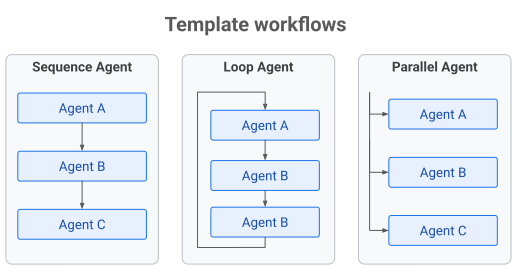

# 템플릿 에이전트 워크플로

  ADK에서 지원Python v0.1.0Typescript v0.2.0Go v0.1.0Java v0.1.0

이 섹션에서는 하나 이상의 하위 에이전트 실행 흐름을 제어하는 특화된 에이전트인 *템플릿 워크플로*, 또는 *워크플로 에이전트*를 소개합니다. 템플릿 워크플로 에이전트는 하위 에이전트의 실행 흐름을 오케스트레이션하도록 설계된 특화 컴포넌트입니다. 주요 역할은 다른 에이전트가 어떻게, 언제 실행되는지를 관리하여 프로세스의 제어 흐름을 정의하는 것입니다.

!!! note "대안: 그래프 기반 워크플로"

    ADK 2.0부터 템플릿 워크플로는

    [그래프 기반 워크플로](/ko/graphs/)와
    [동적 워크플로](/ko/graphs/dynamic/)를 포함한 더 유연한 워크플로 구조로 대체되었습니다.
    이러한 워크플로 아키텍처는 에이전트 워크플로를 시간이 지남에 따라 발전시킬 수 있는
    더 많은 제어력, 유연성, 기능을 제공합니다.

**그림 1.** ADK 템플릿 워크플로의 실행 패턴

템플릿 워크플로 에이전트는 사전 정의된 로직을 기반으로 동작합니다. 오케스트레이션을 위해 AI 모델에 문의하지 않고, 순차, 병렬, 루프 같은 자신의 유형에 따라 실행 순서를 결정합니다. 이 접근 방식은 결정적이고 예측 가능한 실행 패턴을 만듭니다. 템플릿 워크플로에는 다음과 같은 작업 실행 구조가 포함되며, 각 구조는 서로 다른 작업 완료 패턴을 구현합니다.

- :material-console-line: **순차 에이전트 워크플로**

    ---

    하위 에이전트를 순서대로 하나씩 실행합니다.

    [:octicons-arrow-right-24: 더 알아보기](sequential-agents.md)

- :material-console-line: **루프 에이전트 워크플로**

    ---

    특정 종료 조건이 충족될 때까지 하위 에이전트를 반복 실행합니다.

    [:octicons-arrow-right-24: 더 알아보기](loop-agents.md)

- :material-console-line: **병렬 에이전트 워크플로**

    ---

    여러 하위 에이전트를 병렬로 실행합니다.

    [:octicons-arrow-right-24: 더 알아보기](parallel-agents.md)

