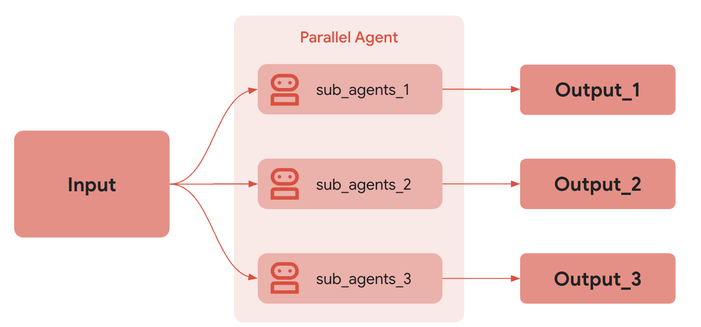

# 병렬 에이전트

<div class="language-support-tag">
  <span class="lst-supported">ADK에서 지원</span><span class="lst-python">Python v0.1.0</span><span class="lst-typescript">TypeScript v0.2.0</span><span class="lst-go">Go v0.1.0</span><span class="lst-java">Java v0.2.0</span>
</div>

`ParallelAgent`는 하위 에이전트를 *동시에(concurrently)* 실행하는 [워크플로우 에이전트](index.md)입니다. 이는 작업이 독립적으로 수행될 수 있는 워크플로우의 속도를 크게 향상시킵니다.

다음과 같은 경우 `ParallelAgent`를 사용하세요: 속도를 우선시하고 독립적이며 리소스를 많이 사용하는 작업을 포함하는 시나리오에서 `ParallelAgent`는 효율적인 병렬 실행을 용이하게 합니다. **하위 에이전트가 종속성 없이 작동할 때, 해당 작업들은 동시에 수행될 수 있으며** 전체 처리 시간을 크게 줄일 수 있습니다.

다른 [워크플로우 에이전트](index.md)와 마찬가지로, `ParallelAgent`는 LLM으로 구동되지 않으므로 실행 방식이 결정적(deterministic)입니다. 하지만 워크플로우 에이전트는 내부 로직이 아닌 실행(즉, 하위 에이전트를 병렬로 실행하는 것)에만 관여합니다. 워크플로우 에이전트의 도구나 하위 에이전트는 LLM을 활용할 수도 있고, 그렇지 않을 수도 있습니다.

### 예시

이 접근 방식은 다중 소스 데이터 검색이나 대규모 연산과 같은 작업에 특히 유용하며, 병렬화를 통해 상당한 성능 향상을 얻을 수 있습니다. 중요한 점은, 이 전략은 동시에 실행되는 에이전트 간에 공유 상태나 직접적인 정보 교환이 필요 없다고 가정한다는 것입니다.

### 작동 방식

`ParallelAgent`의 `run_async()` 메서드가 호출될 때:

1.  **동시 실행:** `sub_agents` 목록에 있는 *각* 하위 에이전트의 `run_async()` 메서드를 *동시에* 시작합니다. 이는 모든 에이전트가 (거의) 동시에 실행을 시작한다는 것을 의미합니다.
2.  **독립적인 분기:** 각 하위 에이전트는 자체 실행 분기에서 작동합니다. 실행 중 이러한 분기 간에는 대화 기록이나 상태가 ***자동으로* 공유되지 않습니다**.
3.  **결과 수집:** `ParallelAgent`는 병렬 실행을 관리하며, 일반적으로 각 하위 에이전트가 완료된 후 그 결과를 (예: 결과 또는 이벤트 목록을 통해) 접근할 수 있는 방법을 제공합니다. 결과의 순서는 결정적이지 않을 수 있습니다.

### 독립적인 실행과 상태 관리

`ParallelAgent` 내의 하위 에이전트가 독립적으로 실행된다는 것을 이해하는 것이 *매우 중요합니다*. 만약 이 에이전트들 간의 통신이나 데이터 공유가 *필요하다면*, 명시적으로 구현해야 합니다. 가능한 접근 방식은 다음과 같습니다.

*   **공유 `InvocationContext`:** 각 하위 에이전트에 공유 `InvocationContext` 객체를 전달할 수 있습니다. 이 객체는 공유 데이터 저장소 역할을 할 수 있습니다. 하지만, 경합 상태(race condition)를 피하기 위해 잠금(lock) 등을 사용하여 이 공유 컨텍스트에 대한 동시 접근을 신중하게 관리해야 합니다.
*   **외부 상태 관리:** 외부 데이터베이스, 메시지 큐 또는 다른 메커니즘을 사용하여 공유 상태를 관리하고 에이전트 간의 통신을 용이하게 합니다.
*   **후처리:** 각 분기에서 결과를 수집한 다음, 데이터를 조정하는 로직을 구현합니다.

{: width="600"}

### 전체 예시: 병렬 웹 리서치

여러 주제를 동시에 조사하는 상황을 상상해 보세요.

1.  **리서처 에이전트 1:** "재생 가능 에너지원"을 조사하는 `LlmAgent`입니다.
2.  **리서처 에이전트 2:** "전기 자동차 기술"을 조사하는 `LlmAgent`입니다.
3.  **리서처 에이전트 3:** "탄소 포집 방법"을 조사하는 `LlmAgent`입니다.

    ```py
    ParallelAgent(sub_agents=[ResearcherAgent1, ResearcherAgent2, ResearcherAgent3])
    ```

이러한 연구 작업들은 독립적입니다. `ParallelAgent`를 사용하면 이들을 동시에 실행할 수 있어, 순차적으로 실행하는 것에 비해 총 연구 시간을 잠재적으로 크게 줄일 수 있습니다. 각 에이전트의 결과는 완료된 후 개별적으로 수집됩니다.

???+ "전체 코드"

    === "Python"
        ```py
         --8<-- "examples/python/snippets/agents/workflow-agents/parallel_agent_web_research.py:init"
        ```

    === "Go"
        ```go
         --8<-- "examples/go/snippets/agents/workflow-agents/parallel/main.go:init"
        ```

    === "Java"
        ```java
         --8<-- "examples/java/snippets/src/main/java/agents/workflow/ParallelResearchPipeline.java:full_code"
        ```
