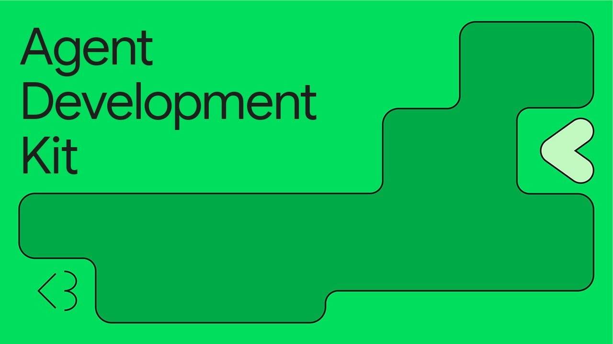
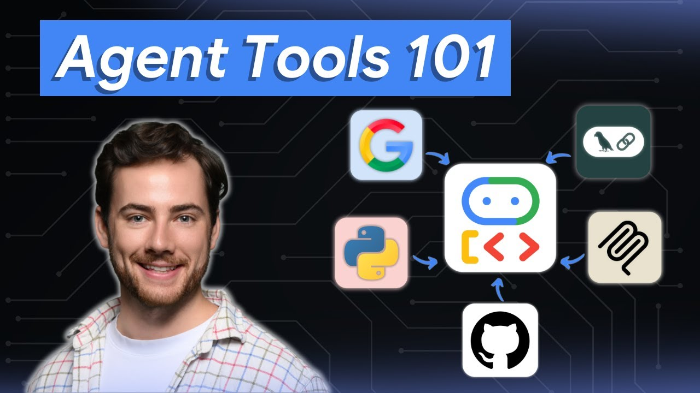
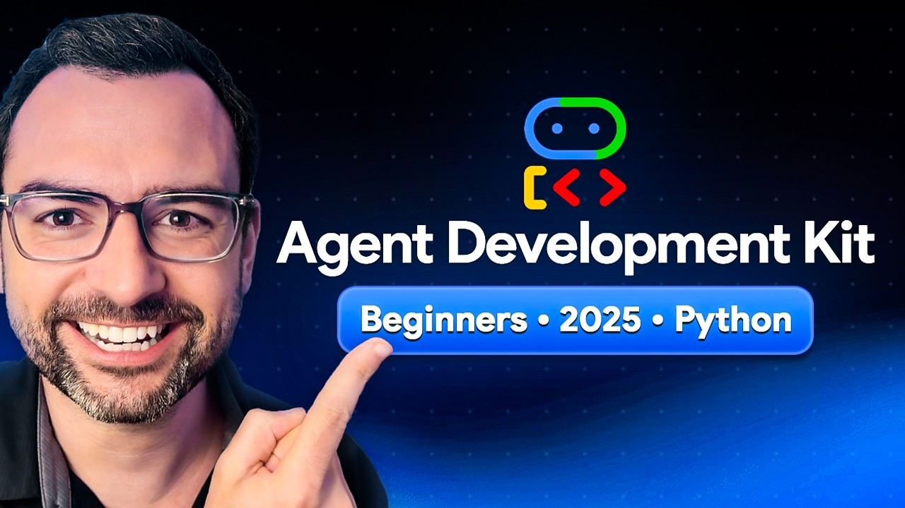
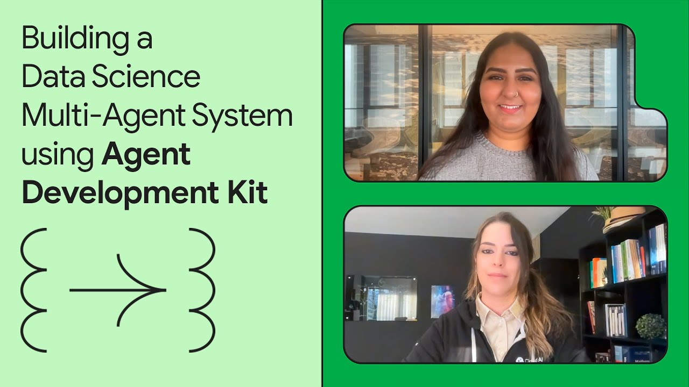
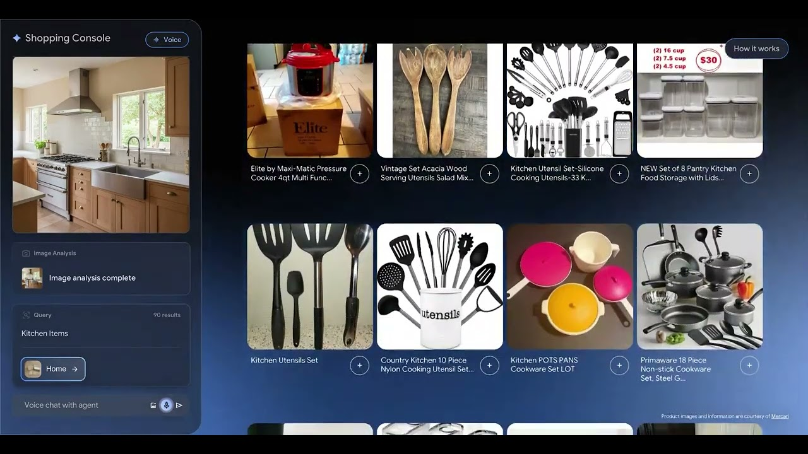
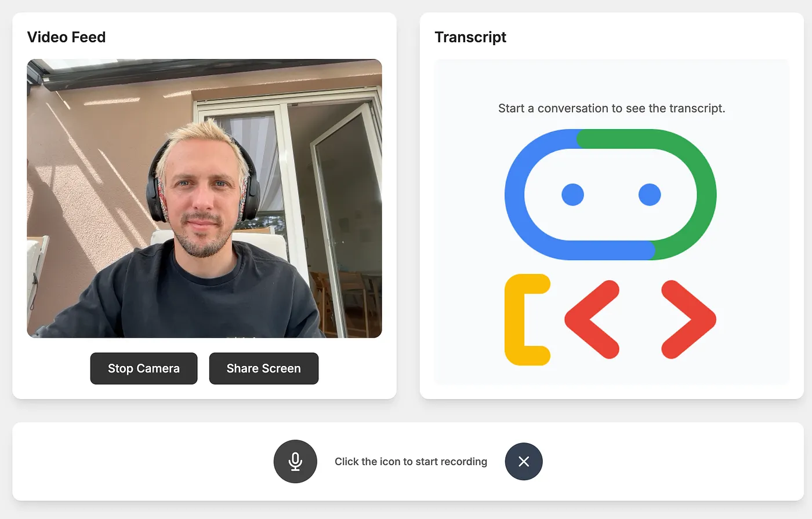
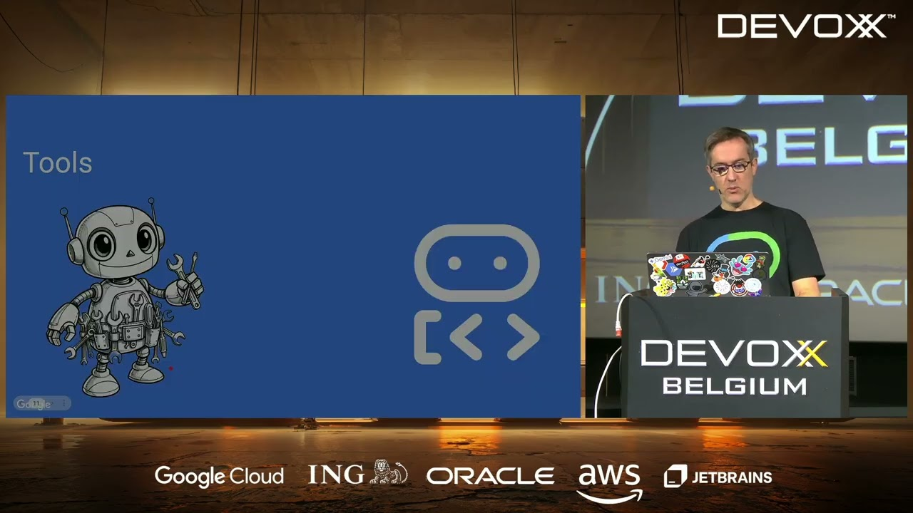

# 커뮤니티 리소스

환영합니다! 이 페이지에는 Agent Development Kit 커뮤니티가 만들고 유지 관리하는 리소스가 모여 있습니다.

## 커뮤니티 참여하기

* ADK에 대해 토론하거나 질문을 하거나 에이전트 전반에 대해 이야기하고 싶다면 Reddit의 **[r/agentdevelopmentkit](https://www.reddit.com/r/agentdevelopmentkit/)**를 방문하세요.
* 월간 커뮤니티 콜 업데이트를 받고 싶다면 **[ADK Community Google Group](https://groups.google.com/g/adk-community)**에 참여하세요.
* 버그를 신고하거나 ADK 프레임워크에 기여하고 싶다면 **[기여 가이드](/ko/community/contributing-guide/)**를 확인하여 적절한 저장소를 찾고 시작하세요.

!!! info

    Google과 ADK 팀은 이 외부 커뮤니티 리소스에 연결된 콘텐츠에 대해 지원을 제공하지 않습니다.

## 시작하기

  <a href="https://www.youtube.com/watch?v=zgrOwow_uTQ" class="resource-card">
    

      
    

    

      
데모 영상

      <h3>📺 Agent Development Kit 소개</h3>
      
핵심 설계 원칙을 보여 주는 멀티 에이전트 여행 플래너 구축 데모입니다.

    

  </a>
  <a href="https://www.youtube.com/watch?v=44C8u0CDtSo" class="resource-card">
    

      
    

    

      
영상

      <h3>📺 Agent Development Kit 시작하기</h3>
      
에이전트 정의의 기초와 첫 번째 에이전트를 실행하고 디버깅하는 방법을 배웁니다.

    

  </a>
  <a href="https://www.youtube.com/watch?v=5ZmaWY7UX6k" class="resource-card">
    

      
    

    

      
영상

      <h3>📺 ADK 도구 시작하기</h3>
      
MCP와 Google Search 같은 도구를 사용해 소프트웨어 버그 도우미를 구축하는 가이드입니다.

    

  </a>

## ADK 커뮤니티 콜

ADK Community Google Group에 참여하여 다음 콜에 대한 업데이트를 받아보세요.
최근 녹화본은 아래에서 확인할 수 있고, 전체 [YouTube 재생 목록](https://www.youtube.com/playlist?list=PLwi6PfxEP7zZbBPmWiZ8QbPcuKyAY5RR3)도 둘러볼 수 있습니다.

  <a href="https://www.youtube.com/watch?v=bPngDY7EuOQ" class="resource-card">
    

      
    

    

      
커뮤니티 콜

      <h3>📞 2026년 3월 녹화본</h3>
      
ADK 2.0 알파 릴리스, 그래프 기반 에이전트 구성을 위한 Workflows, 구조화된 멀티 에이전트 조정을 위한 Agent Modes, 그리고 Restate 지속형 에이전트에 대한 커뮤니티 스포트라이트를 다룹니다.

    

  </a>
  <a href="https://www.youtube.com/watch?v=cXDr4RYJxK0" class="resource-card">
    

      
    

    

      
커뮤니티 콜

      <h3>📞 2026년 2월 녹화본</h3>
      
내장 메트릭을 활용한 ADK 평가, 토큰 기반 컨텍스트 압축, BigQuery observability 플러그인, 그리고 Redis 통합에 대한 커뮤니티 스포트라이트를 다룹니다.

    

  </a>
  <a href="https://www.youtube.com/watch?v=h9Lueiqo89E" class="resource-card">
    

      
    

    

      
커뮤니티 콜

      <h3>📞 2026년 1월 녹화본</h3>
      
크로스 언어 지원을 위한 Session Service 스키마, TypeScript 멀티 에이전트 데모, MCP 서버용 API Registry, 서드파티 도구 통합을 다룹니다.

    

  </a>

## 강좌 및 심층 소개

  <a href="https://www.kaggle.com/learn-guide/5-day-agents" class="resource-card">
    

      
    

    

      
온라인 코스

      <h3>🎓 Google과 함께하는 5일 AI 에이전트 집중 코스</h3>
      
모델, 도구, 메모리, 평가, 배포를 포함한 핵심 ADK 에이전트 구성 요소로 구축합니다.

    

  </a>
  <a href="https://www.youtube.com/watch?v=P4VFL9nIaIA" class="resource-card">
    

      
    

    

      
영상 코스

      <h3>🎓 ADK 마스터클래스: AI 에이전트 구축 및 워크플로 자동화</h3>
      
12개의 실습 예제를 통해 초보자에서 전문가까지 안내하는 완전한 속성 과정입니다.

    

  </a>
  <a href="https://raphaelmansuy.github.io/adk_training/" class="resource-card">
    

      
    

    

      
웹사이트

      <h3>🎓 ADK Training Hub</h3>
      
기본 원리부터 프로덕션까지 포괄적인 튜토리얼과 예제로 ADK를 마스터하세요.

    

  </a>
  <a href="https://www.youtube.com/playlist?list=PLLrA_pU9-Gz2HwepRUVpq1TEPuYWo_fSi" class="resource-card">
    

      
    

    

      
YouTube 재생 목록

      <h3>🎓 ADK로 에이전틱 AI 마스터하기</h3>
      
설정부터 에이전트 배포와 확장까지 모두 다루는 단계별 재생 목록입니다.

    

  </a>
  <a href="https://www.youtube.com/playlist?list=PL6tW9BrhiPTAZts0W5nQS9dbW6VMnLKab" class="resource-card">
    

      
    

    

      
YouTube 재생 목록

      <h3>🎓 Google ADK 엔드투엔드 코스</h3>
      
이 심층 코스 시리즈로 프로덕션 준비가 된 에이전트를 구축, 배포, 확장하세요.

    

  </a>
  <a href="https://iamulya.one/tags/building-intelligent-agents-with-google-adk/" class="resource-card">
    

      
    

    

      
블로그 시리즈

      <h3>🎓 Google ADK로 지능형 에이전트 구축하기</h3>
      
Google의 코드 우선 Python 툴킷으로 지능형 에이전트를 구축하는 개발자 가이드입니다.

    

  </a>
  <a href="https://github.com/arjunprabhulal/google-adk-masterclass" class="resource-card">
    

      
    

    

      
온라인 코스

      <h3>🎓 Google ADK 마스터클래스: 실습 시리즈</h3>
      
에이전트, 워크플로, 도구, 메모리, MCP 통합을 다루는 20개 모듈로 프로덕션 준비형 AI 에이전트를 구축합니다.

    

  </a>
  <a href="https://www.youtube.com/playlist?list=PL0Zc2RFDZsM_MkHOzWNJpaT4EH5fQxA8n" class="resource-card">
      

        
      

      

        
YouTube 재생 목록

        <h3>📻️ ADK News - 일본어 ADK 팟캐스트</h3>
        
커밋 로그, 릴리스 노트, 블로그 게시물을 다루는 ADK 에이전트가 생성한 자동 생성 일본어 팟캐스트입니다.

      

    </a>

## 에이전트 튜토리얼 및 데모

  <a href="https://www.youtube.com/watch?v=efcUXoMX818" class="resource-card">
    

      
    

    

      
영상 튜토리얼

      <h3>📖 ADK로 데이터 과학 에이전트를 구축하는 방법</h3>
      
데이터베이스 쿼리, Python 분석, BigQuery ML을 위한 멀티 에이전트 시스템 구축을 깊이 있게 다룹니다.

    

  </a>
  <a href="https://www.youtube.com/watch?v=hPzjkQFV5yI" class="resource-card">
    

      
    

    

      
영상 튜토리얼

      <h3>📖 ADK와 Selenium으로 브라우저 사용 에이전트 구축하기</h3>
      
누락된 정보를 채워 소매 웹사이트의 제품 데이터를 개선하는 에이전트를 만드는 방법을 배웁니다.

    

  </a>
  <a href="https://github.com/google/adk-docs/blob/main/examples/python/notebooks/shop_agent.ipynb" class="resource-card">
    

      
    

    

      
Jupyter 노트북

      <h3>📖 이커머스 추천 에이전트 구축하기</h3>
      
생성형 이커머스 추천을 위한 간단한 멀티 에이전트 시스템을 만드는 튜토리얼입니다.

    

  </a>
  <a href="https://medium.com/google-cloud/google-adk-vertex-ai-live-api-125238982d5e" class="resource-card">
    

      
    

    

      
블로그 पोस्ट

      <h3>📖 Google ADK + Gemini Live API</h3>
      
Live API로 실시간 스트리밍 경험을 구축하여 ADK CLI를 넘어보세요.

    

  </a>
  <a href="https://www.youtube.com/watch?v=LwHPYyw7u6U" class="resource-card">
    

      
    

    

      
데모 영상

      <h3>📺 Shopper's Concierge 데모</h3>
      
개인화된 실시간 추천으로 AI 에이전트가 쇼핑을 어떻게 혁신할 수 있는지 확인해 보세요.

    

  </a>
  <a href="https://agentdirectory.folch.ai/" class="resource-card">
    

      
    

    

      
갤러리

      <h3>📖 ADK Agent Directory</h3>
      
웹 검색, 이미지 생성, 리서치 등 다양한 작업에 쓸 수 있는 프로덕션 준비형 ADK 에이전트를 찾아보고 테스트하세요.

    

  </a>

## ADK for Java

  <a href="https://www.youtube.com/watch?v=L6V6aQixOZU" class="resource-card">
    

      
    

    

      
영상 강연

      <h3>☕ AI 에이전트 구축을 위한 ADK Java 소개</h3>
      
Java로 첫 AI 에이전트를 만드는 데 도움이 되는 발표 자료입니다.

    

  </a>
  <a href="https://www.youtube.com/playlist?list=PLLMxXO6kMiNhP87WYQ8CeC3xpV3EnF9cu" class="resource-card">
    

      
    

    

      
YouTube 재생 목록

      <h3>☕ Google ADK for Java 튜토리얼</h3>
      
Java에서 A2A, MCP, 멀티 에이전트 시스템, 콜백을 다루는 단계별 튜토리얼입니다.

    

  </a>
  <a href="https://codelabs.developers.google.com/adk-java-getting-started" class="resource-card">
    

      
    

    

      
Codelab

      <h3>☕ ADK for Java로 AI 에이전트 구축하기</h3>
      
단순한 LLM 호출을 넘어 추론하고 계획하고 도구를 사용하는 자율 Java 에이전트를 만듭니다.

    

  </a>

## 번역

커뮤니티가 제공한 ADK 문서 번역입니다.

<ul class="translation-list">
  <li><a href="https://adk.wiki/">🇨🇳 중국어(中文) 문서</a></li>
  <li><a href="https://adk.dev/ko/">🇰🇷 한국어 문서</a></li>
  <li><a href="https://adk.dev/ja/">🇯🇵 일본어 문서</a></li>
  <li><a href="https://adk-es.fabian-castro-c.dev/">🇪🇸 스페인어(Español) 문서</a></li>
</ul>

## 리소스 기여하기

공유할 ADK 리소스가 있나요? 튜토리얼, 번역, 도구, 동영상, 예제 등 무엇이든 좋습니다.

참여 방법은 **[기여 가이드](/ko/community/contributing-guide/)**의 단계를 참고하세요.

Agent Development Kit에 기여해 주셔서 감사합니다! ❤️
