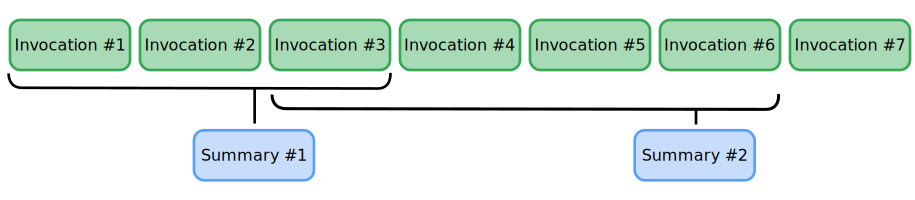

# 성능 향상을 위한 에이전트 컨텍스트 압축

<div class="language-support-tag">
  <span class="lst-supported">ADK 지원</span><span class="lst-python">Python v1.16.0</span><span class="lst-java">Java v0.2.0</span><span class="lst-typescript">TypeScript v0.6.0</span>
</div>

ADK 에이전트는 실행되면서 사용자 지침, 검색된 데이터, 도구 응답 및 생성된 콘텐츠를 포함한 *컨텍스트* 정보를 수집합니다. 이 컨텍스트 데이터의 크기가 커질수록 에이전트 처리 시간도 일반적으로 증가합니다. 점점 더 많은 데이터가 에이전트가 사용하는 생성형 AI 모델로 전송되어 처리 시간이 길어지고 응답이 느려집니다. ADK 컨텍스트 압축 기능은 지침, 입력 및 모델 응답을 포함하여 이전 세션 기록을 요약함으로써 에이전트가 실행되는 동안 컨텍스트 크기를 줄이도록 설계되었습니다. 이 프로세스는 컴팩트한 컨텍스트 창을 유지함으로써 필수적인 최근 상호 작용에 대한 에이전트의 접근 권한을 보장하는 동시에 **대기 시간을 최적화하고 비용을 절감**합니다.

압축은 `CompactionRequestProcessor`를 통해 SingleFlow에 직접 통합되어 `EventsCompactionConfig`에 설정한 규칙에 따라 자동 이벤트 압축을 가능하게 합니다.

## 전략 선택

`EventsCompactionConfig` 내에서 다음 전략을 사용하여 세션 데이터를 관리할 수 있습니다.

- **토큰 기반 (기본)**: 소비된 실제 토큰 볼륨을 기반으로 정리를 트리거합니다. 이는 절대적인 안전망 역할을 하며 사용자가 대량의 코드 블록을 붙여넣거나 대용량 파일을 업로드하는 것과 같이 예측할 수 없는 작업량에 적합합니다.
- **슬라이딩 윈도우 (턴 기반)**: 고정된 횟수의 대화 턴 후에 정리를 트리거합니다. 이는 일반적이고 예측 가능한 텍스트 채팅에 유용합니다.

두 가지 압축 전략을 모두 구성하는 경우 시스템은 토큰 기반 압축을 우선시합니다. 세션 길이가 정의된 토큰 임계값을 초과하면 시스템은 토큰 기반 압축을 트리거하고 해당 턴에 대한 슬라이딩 윈도우 압축은 건너뜁니다.

## 토큰 기반 압축

토큰 기반 압축은 이벤트나 턴의 수가 아니라 토큰이나 데이터의 볼륨을 기반으로 컨텍스트 관리를 트리거합니다.

### 구성 설정

App 객체에 `EventsCompactionConfig` 설정을 추가하여 에이전트 워크플로에 토큰 기반 압축을 추가합니다. 다음을 지정해야 합니다.

- **`token_threshold`**: 도달 시 테일 유지(tail-retention) 압축을 자동으로 트리거하는 토큰의 안전 한도입니다.
- **`event_retention_size`**: 압축이 트리거될 때 요약되지 않은 "원시" 형식으로 유지되는 최근 이벤트/상호 작용의 수입니다. 이는 즉각적인 대화 컨텍스트 및 대명사 해상도를 유지합니다.

프로젝트에서 이를 구현하려면 다음 구성을 사용하십시오.

```python
# 1. google.adk 네임스페이스를 사용하도록 가져오기 경로 수정
from google.adk.apps.app import App, EventsCompactionConfig
from google.adk.agents import Agent

# 2. 루트 에이전트 초기화 (App 설정에 필수)
root_agent = Agent(
    name="my_root_agent",
    description="Main coordinating agent for the workflow."
)

# 3. 토큰 기반 구성: 우선순위/사전 호출 레이어 활성화
compaction_config = EventsCompactionConfig(
    token_threshold=4000,     # 실제 토큰 수가 이를 초과할 때 압축 트리거
    event_retention_size=5    # 토큰 한도 도달 시 원본 그대로 유지할 최근 이벤트 수
)

# 4. 필수 name 및 root_agent 필드와 구성 객체를 사용하여 등록
app = App(
    name="my_compacting_agent_app",
    root_agent=root_agent,
    events_compaction_config=compaction_config
)
```

## 슬라이딩 윈도우 압축

컨텍스트 압축 기능은 [세션](/ko/sessions/session/) 내에서 에이전트 워크플로 이벤트 데이터를 수집하고 요약하기 위해 *슬라이딩 윈도우* 접근 방식을 사용합니다. 에이전트에 이 기능을 구성하면 현재 세션 내에서 특정 워크플로 이벤트 또는 호출 수 임계값에 도달할 때 이전 이벤트의 데이터를 요약합니다.

```python
# (선택 사항) 보조 설정으로 이벤트 기반 슬라이딩 윈도우 사용
compaction_config = EventsCompactionConfig(
    compaction_interval=10,   # 표준 압축 사이의 턴 수
    overlap_size=2,           # 겹치는 컨텍스트로 유지할 이벤트 수
```

## 컨텍스트 압축 구성

워크플로의 App 객체(Python/Java)에 이벤트 압축 구성 설정을 추가하거나, `LlmAgent`(TypeScript)에 `contextCompactors`를 설정하여 에이전트 워크플로에 컨텍스트 압축을 추가합니다. 구성의 일부로 다음 샘플 코드에 표시된 대로 압축 간격과 오버랩 크기(Python/Java) 또는 토큰 임계값과 이벤트 유지 크기(TypeScript)를 지정해야 합니다.

=== "Python"

    ```python
    from google.adk.apps.app import App
    from google.adk.apps.app import EventsCompactionConfig

    app = App(
        name='my-agent',
        root_agent=root_agent,
        events_compaction_config=EventsCompactionConfig(
            compaction_interval=3,  # 3개의 새 호출마다 압축을 트리거합니다.
            overlap_size=1          # 이전 창의 마지막 호출을 포함합니다.
        ),
    )
    ```

=== "Java"

    ```java
    import com.google.adk.apps.App;
    import com.google.adk.summarizer.EventsCompactionConfig;

    App app = App.builder()
        .name("my-agent")
        .rootAgent(rootAgent)
        .eventsCompactionConfig(EventsCompactionConfig.builder()
            .compactionInterval(3)  // 3개의 새 호출마다 압축을 트리거합니다.
            .overlapSize(1)         // 이전 창의 마지막 호출을 포함합니다.
            .build())
        .build();
    ```

=== "TypeScript"

    ```typescript
    import {Gemini, LlmAgent, LlmSummarizer, TokenBasedContextCompactor} from '@google/adk';

    const agent = new LlmAgent({
      name: 'my-agent',
      model: 'gemini-flash-latest',
      contextCompactors: [
        new TokenBasedContextCompactor({
          tokenThreshold: 1000, // 세션이 1000토큰을 넘으면 압축을 트리거합니다.
          eventRetentionSize: 1, // 원본 이벤트를 최소 1개 유지합니다(오버랩).
          summarizer: new LlmSummarizer({
            llm: new Gemini({model: 'gemini-flash-latest'}),
          }),
        }),
      ],
    });
    ```

일단 구성되면 ADK `Runner`는 세션이 간격에 도달할 때마다 백그라운드에서 압축 프로세스를 처리합니다.

## 컨텍스트 압축 예시

`compaction_interval`을 3으로, `overlap_size`를 1로 설정하면 이벤트 3, 6, 9 등이 완료될 때 이벤트 데이터가 압축됩니다. 오버랩 설정은 그림 1에 표시된 대로 두 번째 요약 압축 및 이후 각 요약의 크기를 증가시킵니다.


**그림 1.** 간격 3, 오버랩 1인 이벤트 압축 구성 그림.

이 예시 구성에서 컨텍스트 압축 작업은 다음과 같이 진행됩니다.

1.  **이벤트 3 완료**: 3개 이벤트 모두 요약으로 압축됩니다.
1.  **이벤트 6 완료**: 이전 이벤트 1개의 오버랩을 포함하여 이벤트 3에서 6까지 압축됩니다.
1.  **이벤트 9 완료**: 이전 이벤트 1개의 오버랩을 포함하여 이벤트 6에서 9까지 압축됩니다.

## 구성 설정

이 기능의 구성 설정은 이벤트 데이터가 압축되는 빈도와 에이전트 워크플로가 실행되는 동안 유지되는 데이터의 양을 제어합니다. 선택적으로 압축기 객체를 구성할 수 있습니다.

*   **`compaction_interval`**: 이전 이벤트 데이터의 압축을 트리거하는 완료된 이벤트 수를 설정합니다.
*   **`overlap_size`**: 새로 압축된 컨텍스트 세트에 포함되는 이전에 압축된 이벤트 수를 설정합니다.
*   **`summarizer`**: (선택 사항) 요약에 사용할 특정 AI 모델을 포함하는 요약기 객체를 정의합니다. 자세한 내용은 [요약기 정의](#define-summarizer)를 참조하세요.

### 요약기 정의 {#define-summarizer}
요약기를 정의하여 컨텍스트 압축 프로세스를 사용자 지정할 수 있습니다. `LlmEventSummarizer`(Python/Java) 또는 `LlmSummarizer`(TypeScript) 클래스를 사용하면 요약에 특정 모델을 지정할 수 있습니다. 다음 코드 예시는 사용자 지정 요약기를 정의하고 구성하는 방법을 보여줍니다.

=== "Python"

    ```python
    from google.adk.apps.app import App, EventsCompactionConfig
    from google.adk.apps.llm_event_summarizer import LlmEventSummarizer
    from google.adk.models import Gemini

    # 요약에 사용할 AI 모델 정의:
    summarization_llm = Gemini(model="gemini-flash-latest")

    # 사용자 지정 모델로 요약기 생성:
    my_summarizer = LlmEventSummarizer(llm=summarization_llm)

    # 사용자 지정 요약기 및 압축 설정으로 App 구성:
    app = App(
        name='my-agent',
        root_agent=root_agent,
        events_compaction_config=EventsCompactionConfig(
            compaction_interval=3,
            overlap_size=1,
            summarizer=my_summarizer,
        ),
    )
    ```

=== "Java"

    ```java
    import com.google.adk.apps.App;
    import com.google.adk.models.Gemini;
    import com.google.adk.summarizer.EventsCompactionConfig;
    import com.google.adk.summarizer.LlmEventSummarizer;

    // 요약에 사용할 AI 모델 정의:
    Gemini summarizationLlm = Gemini.builder()
        .model("gemini-flash-latest")
        .build();

    // 사용자 지정 모델로 요약기 생성:
    LlmEventSummarizer mySummarizer = new LlmEventSummarizer(summarizationLlm);

    // 사용자 지정 요약기 및 압축 설정으로 App 구성:
    App app = App.builder()
        .name("my-agent")
        .rootAgent(rootAgent)
        .eventsCompactionConfig(EventsCompactionConfig.builder()
            .compactionInterval(3)
            .overlapSize(1)
            .summarizer(mySummarizer)
            .build())
        .build();
    ```

=== "TypeScript"

    ```typescript
    import {Gemini, LlmAgent, LlmSummarizer, TokenBasedContextCompactor} from '@google/adk';

    // 요약에 사용할 AI 모델 정의:
    const summarizationLlm = new Gemini({model: 'gemini-flash-latest'});

    // 사용자 지정 모델로 요약기 생성:
    const mySummarizer = new LlmSummarizer({llm: summarizationLlm});

    // 사용자 지정 요약기와 압축 설정으로 에이전트 구성:
    const agent = new LlmAgent({
      name: 'my-agent',
      model: 'gemini-flash-latest',
      contextCompactors: [
        new TokenBasedContextCompactor({
          tokenThreshold: 1000,
          eventRetentionSize: 1,
          summarizer: mySummarizer,
        }),
      ],
    });
    ```

요약기를 조정해 압축기의 동작을 더 세밀하게 제어할 수도 있습니다. Python과 Java에서는 `LlmEventSummarizer`의 `prompt_template`을, TypeScript에서는 `LlmSummarizer`의 `prompt`를 사용자 지정할 수 있습니다. 자세한 내용은 [`LlmEventSummarizer` 코드](https://github.com/google/adk-python/blob/main/src/google/adk/apps/llm_event_summarizer.py#L60) 또는 [`LlmSummarizer` 코드](https://github.com/google/adk-js/blob/main/core/src/context/summarizers/llm_summarizer.ts)를 참조하세요.
