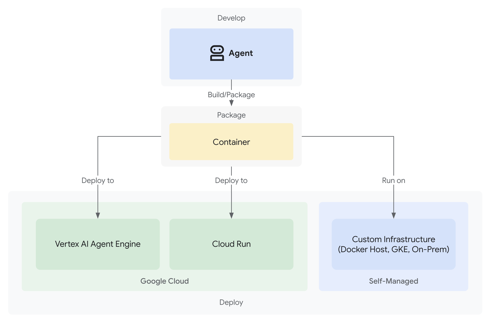

# 에이전트 배포

ADK로 에이전트를 빌드하고 테스트했다면 다음 단계는 프로덕션에서 접근, 질의, 사용하거나 다른 애플리케이션과 통합할 수 있도록 배포하는 것입니다. 배포는 에이전트를 로컬 개발 환경에서 확장 가능하고 안정적인 환경으로 옮기는 과정입니다.

## 배포 옵션

ADK 에이전트는 프로덕션 준비 수준이나 사용자 지정 유연성 요구에 따라 여러 환경에 배포할 수 있습니다.

### Agent Platform의 Agent Runtime

[Agent Runtime](agent-runtime/index.md)은 ADK 같은 프레임워크로 빌드한 AI 에이전트를 배포, 관리, 확장하도록 설계된 Google Cloud의 완전 관리형 자동 확장 서비스입니다.

[Agent Runtime에 에이전트 배포](agent-runtime/index.md)에 대해 자세히 알아보세요.

### Cloud Run

[Cloud Run](https://cloud.google.com/run)은 에이전트를 컨테이너 기반 애플리케이션으로 실행할 수 있는 Google Cloud의 관리형 자동 확장 컴퓨팅 플랫폼입니다.

[Cloud Run에 에이전트 배포](cloud-run.md)에 대해 자세히 알아보세요.

### Google Kubernetes Engine(GKE)

[Google Kubernetes Engine(GKE)](https://cloud.google.com/kubernetes-engine)은 에이전트를 컨테이너화된 환경에서 실행할 수 있는 Google Cloud의 관리형 Kubernetes 서비스입니다. 배포를 더 세밀하게 제어해야 하거나 오픈 모델을 실행해야 한다면 GKE가 좋은 선택지입니다.

[GKE에 에이전트 배포](gke.md)에 대해 자세히 알아보세요.

### 기타 컨테이너 친화적 인프라

에이전트를 컨테이너 이미지로 직접 패키징한 뒤 컨테이너 이미지를 지원하는 모든 환경에서 실행할 수 있습니다. 예를 들어 Docker나 Podman으로 로컬에서 실행할 수 있습니다. 오프라인 또는 단절된 환경에서 실행해야 하거나 Google Cloud에 연결되지 않은 시스템을 사용하려는 경우에 적합합니다.

[Cloud Run에 에이전트 배포](cloud-run.md#deployment-commands) 지침을 따르세요. gcloud CLI의 '배포 명령' 섹션에서 FastAPI 진입점과 Dockerfile 예시를 확인할 수 있습니다.
