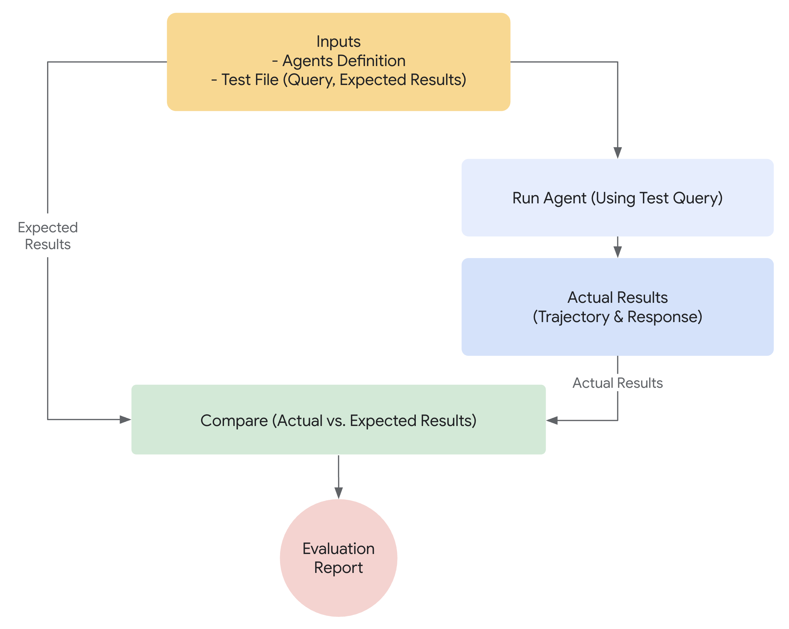

# 에이전트를 평가해야 하는 이유

{ title="이 기능은 현재 Python에서 사용할 수 있습니다. Java 지원은 예정되어 있거나 곧 제공될 예정입니다."}

전통적인 소프트웨어 개발에서 단위 테스트와 통합 테스트는 코드가 예상대로 작동하고 변경에도 안정적으로 유지된다는 확신을 줍니다. 이러한 테스트는 명확한 "통과/실패" 신호를 제공하여 추가 개발을 안내합니다. 그러나 LLM 에이전트는 기존의 테스트 접근 방식으로는 불충분한 수준의 가변성을 도입합니다.

모델의 확률적 특성으로 인해, 결정론적인 "통과/실패" 단언은 에이전트 성능을 평가하는 데 종종 부적합합니다. 대신, 최종 결과물과 에이전트가 해결책에 도달하기 위해 취한 단계의 순서인 에이전트의 궤적(trajectory)에 대한 정성적 평가가 필요합니다. 이는 에이전트의 결정 품질, 추론 과정, 그리고 최종 결과를 평가하는 것을 포함합니다.

이는 설정하는 데 많은 추가 작업처럼 보일 수 있지만, 평가 자동화에 대한 투자는 빠르게 성과를 거둡니다. 프로토타입을 넘어 진전할 계획이라면, 이는 강력히 권장되는 모범 사례입니다.



## 에이전트 평가 준비

에이전트 평가를 자동화하기 전에 명확한 목표와 성공 기준을 정의하세요:

*   **성공 정의:** 에이전트에게 성공적인 결과란 무엇인가요?
*   **핵심 과제 식별:** 에이전트가 반드시 완수해야 할 필수 과제는 무엇인가요?
*   **관련 메트릭 선택:** 성능을 측정하기 위해 어떤 메트릭을 추적할 것인가요?

이러한 고려 사항은 평가 시나리오를 만드는 데 지침이 되며, 실제 배포에서 에이전트 행동을 효과적으로 모니터링할 수 있게 해줍니다.

## 무엇을 평가할 것인가?

개념 증명(proof-of-concept)과 프로덕션 준비가 된 AI 에이전트 사이의 격차를 메우기 위해서는 강력하고 자동화된 평가 프레임워크가 필수적입니다. 주로 최종 결과물에 초점을 맞추는 생성 모델 평가와는 달리, 에이전트 평가는 의사 결정 과정에 대한 더 깊은 이해를 필요로 합니다. 에이전트 평가는 두 가지 구성 요소로 나눌 수 있습니다.

1.  **궤적 및 툴 사용 평가:** 툴 선택, 전략, 접근 방식의 효율성을 포함하여 에이전트가 해결책에 도달하기 위해 취하는 단계를 분석합니다.
2.  **최종 응답 평가:** 에이전트의 최종 결과물의 품질, 관련성, 정확성을 평가합니다.

궤적은 에이전트가 사용자에게 응답하기 전에 취한 단계의 목록일 뿐입니다. 우리는 그것을 에이전트가 취했을 것으로 예상하는 단계 목록과 비교할 수 있습니다.

### 궤적 및 툴 사용 평가

사용자에게 응답하기 전에 에이전트는 일반적으로 일련의 작업을 수행하며, 이를 '궤적(trajectory)'이라고 합니다. 용어를 명확히 하기 위해 사용자 입력을 세션 기록과 비교하거나, 정책 문서를 조회하거나, 지식 베이스를 검색하거나, 티켓을 저장하기 위해 API를 호출할 수 있습니다. 우리는 이것을 작업의 '궤적'이라고 부릅니다. 에이전트의 성능을 평가하려면 실제 궤적을 예상된, 즉 이상적인 궤적과 비교해야 합니다. 이 비교를 통해 에이전트 프로세스의 오류와 비효율성을 발견할 수 있습니다. 예상 궤적은 정답(ground truth), 즉 우리가 에이전트가 취해야 한다고 예상하는 단계 목록을 나타냅니다.

예를 들면:

```python
# 궤적 평가는 다음을 비교합니다
expected_steps = ["determine_intent", "use_tool", "review_results", "report_generation"]
actual_steps = ["determine_intent", "use_tool", "review_results", "report_generation"]
```

몇 가지 정답 기반 궤적 평가가 존재합니다:

1.  **정확히 일치(Exact match):** 이상적인 궤적과 완벽하게 일치해야 합니다.
2.  **순서대로 일치(In-order match):** 올바른 작업을 올바른 순서로 요구하며, 추가 작업은 허용됩니다.
3.  **순서 무관 일치(Any-order match):** 올바른 작업을 순서에 상관없이 요구하며, 추가 작업은 허용됩니다.
4.  **정밀도(Precision):** 예측된 작업의 관련성/정확성을 측정합니다.
5.  **재현율(Recall):** 예측에서 필수적인 작업이 얼마나 많이 포함되었는지 측정합니다.
6.  **단일 툴 사용(Single-tool use):** 특정 작업의 포함 여부를 확인합니다.

올바른 평가 메트릭을 선택하는 것은 에이전트의 특정 요구 사항과 목표에 따라 달라집니다. 예를 들어, 위험도가 높은 시나리오에서는 정확히 일치가 중요할 수 있지만, 더 유연한 상황에서는 순서대로 또는 순서 무관 일치로 충분할 수 있습니다.

## ADK에서 평가는 어떻게 작동하는가

ADK는 사전에 정의된 데이터셋과 평가 기준에 따라 에이전트 성능을 평가하는 두 가지 방법을 제공합니다. 개념적으로는 유사하지만, 처리할 수 있는 데이터의 양에서 차이가 있으며, 이는 일반적으로 각각의 적절한 사용 사례를 결정합니다.

### 첫 번째 접근 방식: 테스트 파일 사용

이 접근 방식은 각각 단일하고 간단한 에이전트-모델 상호작용(세션)을 나타내는 개별 테스트 파일을 만드는 것을 포함합니다. 이는 활발한 에이전트 개발 중에 가장 효과적이며, 일종의 단위 테스트 역할을 합니다. 이러한 테스트는 신속한 실행을 위해 설계되었으며 간단한 세션 복잡성에 초점을 맞춰야 합니다. 각 테스트 파일에는 단일 세션이 포함되며, 이 세션은 여러 턴(turn)으로 구성될 수 있습니다. 턴은 사용자와 에이전트 간의 단일 상호작용을 나타냅니다. 각 턴에는 다음이 포함됩니다.

-   `사용자 콘텐츠(User Content)`: 사용자가 발행한 쿼리.
-   `예상 중간 툴 사용 궤적(Expected Intermediate Tool Use Trajectory)`: 사용자의 쿼리에 올바르게 응답하기 위해 에이전트가 수행할 것으로 예상되는 툴 호출.
-   `예상 중간 에이전트 응답(Expected Intermediate Agent Responses)`: 에이전트(또는 하위 에이전트)가 최종 답변을 생성하는 과정에서 생성하는 자연어 응답입니다. 이러한 자연어 응답은 일반적으로 루트 에이전트가 목표 달성을 위해 하위 에이전트에 의존하는 다중 에이전트 시스템의 산물입니다. 이러한 중간 응답은 최종 사용자에게는 흥미롭지 않을 수 있지만, 시스템 개발자/소유자에게는 에이전트가 최종 응답을 생성하기 위해 올바른 경로를 거쳤다는 확신을 주기 때문에 매우 중요합니다.
-   `최종 응답(Final Response)`: 에이전트로부터의 예상 최종 응답.

파일 이름은 `evaluation.test.json`과 같이 아무 이름이나 지정할 수 있습니다. 프레임워크는 `.test.json` 접미사만 확인하며, 파일 이름의 앞부분은 제약이 없습니다. 다음은 몇 가지 예제가 포함된 테스트 파일입니다:

참고: 테스트 파일은 이제 공식적인 Pydantic 데이터 모델에 의해 지원됩니다. 두 가지 핵심 스키마 파일은 [Eval Set](https://github.com/google/adk-python/blob/main/src/google/adk/evaluation/eval_set.py)와 [Eval Case](https://github.com/google/adk-python/blob/main/src/google/adk/evaluation/eval_case.py)입니다.

*(참고: 주석은 설명 목적으로 포함되었으며, JSON이 유효하려면 제거해야 합니다.)*

```json
# 이 문서를 읽기 쉽게 만들기 위해 일부 필드가 제거되었습니다.
{
  "eval_set_id": "home_automation_agent_light_on_off_set",
  "name": "",
  "description": "이것은 에이전트의 'x' 동작을 단위 테스트하는 데 사용되는 평가 세트입니다.",
  "eval_cases": [
    {
      "eval_id": "eval_case_id",
      "conversation": [
        {
          "invocation_id": "b7982664-0ab6-47cc-ab13-326656afdf75", # 호출에 대한 고유 식별자.
          "user_content": { # 이 호출에서 사용자가 제공한 콘텐츠. 이것이 쿼리입니다.
            "parts": [
              {
                "text": "침실에 있는 device_2를 끄세요."
              }
            ],
            "role": "user"
          },
          "final_response": { # 벤치마크의 참조 역할을 하는 에이전트의 최종 응답.
            "parts": [
              {
                "text": "device_2의 상태를 off로 설정했습니다."
              }
            ],
            "role": "model"
          },
          "intermediate_data": {
            "tool_uses": [ # 시간 순서대로의 툴 사용 궤적.
              {
                "args": {
                  "location": "Bedroom",
                  "device_id": "device_2",
                  "status": "OFF"
                },
                "name": "set_device_info"
              }
            ],
            "intermediate_responses": [] # 모든 중간 하위 에이전트 응답.
          },
        }
      ],
      "session_input": { # 초기 세션 입력.
        "app_name": "home_automation_agent",
        "user_id": "test_user",
        "state": {}
      },
    }
  ],
}
```

테스트 파일은 폴더로 구성할 수 있습니다. 선택적으로, 폴더에는 평가 기준을 지정하는 `test_config.json` 파일도 포함할 수 있습니다.

#### Pydantic 스키마로 지원되지 않는 테스트 파일을 마이그레이션하는 방법은?

참고: 만약 테스트 파일이 [EvalSet](https://github.com/google/adk-python/blob/main/src/google/adk/evaluation/eval_set.py) 스키마 파일을 따르지 않는다면, 이 섹션이 관련이 있습니다.

기존 `*.test.json` 파일을 Pydantic 기반 스키마로 마이그레이션하려면 `AgentEvaluator.migrate_eval_data_to_new_schema`를 사용하세요.

이 유틸리티는 현재 테스트 데이터 파일과 선택적인 초기 세션 파일을 받아서, 새로운 형식으로 직렬화된 데이터가 포함된 단일 출력 json 파일을 생성합니다. 새로운 스키마가 더 응집력이 있으므로, 이전 테스트 데이터 파일과 초기 세션 파일은 모두 무시하거나 제거할 수 있습니다.

### 두 번째 접근 방식: Evalset 파일 사용

Evalset 접근 방식은 에이전트-모델 상호작용을 평가하기 위해 "evalset"이라는 전용 데이터셋을 활용합니다. 테스트 파일과 유사하게, evalset은 예제 상호작용을 포함합니다. 그러나 evalset은 여러 개의, 잠재적으로 긴 세션을 포함할 수 있어 복잡한 다중 턴 대화를 시뮬레이션하는 데 이상적입니다. 복잡한 세션을 표현할 수 있는 능력 때문에 evalset은 통합 테스트에 적합합니다. 이러한 테스트는 더 광범위한 특성 때문에 일반적으로 단위 테스트보다 덜 자주 실행됩니다.

Evalset 파일은 각각 별개의 세션을 나타내는 여러 "eval"을 포함합니다. 각 eval은 사용자 쿼리, 예상 툴 사용, 예상 중간 에이전트 응답, 참조 응답을 포함하는 하나 이상의 "턴"으로 구성됩니다. 이러한 필드는 테스트 파일 접근 방식에서와 동일한 의미를 갖습니다. 각 eval은 고유한 이름으로 식별됩니다. 또한, 각 eval에는 연관된 초기 세션 상태가 포함됩니다.

Evalset을 수동으로 만드는 것은 복잡할 수 있으므로, 관련 세션을 캡처하고 evalset 내에서 eval로 쉽게 변환할 수 있도록 UI 툴이 제공됩니다. 아래에서 평가를 위해 웹 UI를 사용하는 방법에 대해 자세히 알아보세요. 다음은 두 개의 세션을 포함하는 예제 evalset입니다.

참고: Eval set 파일은 이제 공식적인 Pydantic 데이터 모델에 의해 지원됩니다. 두 가지 핵심 스키마 파일은 [Eval Set](https://github.com/google/adk-python/blob/main/src/google/adk/evaluation/eval_set.py)와 [Eval Case](https://github.com/google/adk-python/blob/main/src/google/adk/evaluation/eval_case.py)입니다.

*(참고: 주석은 설명 목적으로 포함되었으며, JSON이 유효하려면 제거해야 합니다.)*

```json
# 이 문서를 읽기 쉽게 만들기 위해 일부 필드가 제거되었습니다.
{
  "eval_set_id": "eval_set_example_with_multiple_sessions",
  "name": "여러 세션이 있는 평가 세트 예제",
  "description": "이 평가 세트는 평가 세트가 하나 이상의 세션을 가질 수 있음을 보여주는 예제입니다.",
  "eval_cases": [
    {
      "eval_id": "session_01",
      "conversation": [
        {
          "invocation_id": "e-0067f6c4-ac27-4f24-81d7-3ab994c28768",
          "user_content": {
            "parts": [
              {
                "text": "무엇을 할 수 있나요?"
              }
            ],
            "role": "user"
          },
          "final_response": {
            "parts": [
              {
                "text": "저는 다양한 크기의 주사위를 굴리고 숫자가 소수인지 확인할 수 있습니다."
              }
            ],
            "role": null
          },
          "intermediate_data": {
            "tool_uses": [],
            "intermediate_responses": []
          },
        },
      ],
      "session_input": {
        "app_name": "hello_world",
        "user_id": "user",
        "state": {}
      },
    },
    {
      "eval_id": "session_02",
      "conversation": [
        {
          "invocation_id": "e-92d34c6d-0a1b-452a-ba90-33af2838647a",
          "user_content": {
            "parts": [
              {
                "text": "19면체 주사위를 굴려주세요"
              }
            ],
            "role": "user"
          },
          "final_response": {
            "parts": [
              {
                "text": "17이 나왔습니다."
              }
            ],
            "role": null
          },
          "intermediate_data": {
            "tool_uses": [],
            "intermediate_responses": []
          },
        },
        {
          "invocation_id": "e-bf8549a1-2a61-4ecc-a4ee-4efbbf25a8ea",
          "user_content": {
            "parts": [
              {
                "text": "10면체 주사위를 두 번 굴리고 9가 소수인지 아닌지 확인해주세요"
              }
            ],
            "role": "user"
          },
          "final_response": {
            "parts": [
              {
                "text": "주사위 굴리기에서 4와 7이 나왔고, 9는 소수가 아닙니다.\n"
              }
            ],
            "role": null
          },
          "intermediate_data": {
            "tool_uses": [
              {
                "id": "adk-1a3f5a01-1782-4530-949f-07cf53fc6f05",
                "args": {
                  "sides": 10
                },
                "name": "roll_die"
              },
              {
                "id": "adk-52fc3269-caaf-41c3-833d-511e454c7058",
                "args": {
                  "sides": 10
                },
                "name": "roll_die"
              },
              {
                "id": "adk-5274768e-9ec5-4915-b6cf-f5d7f0387056",
                "args": {
                  "nums": [
                    9
                  ]
                },
                "name": "check_prime"
              }
            ],
            "intermediate_responses": [
              [
                "data_processing_agent",
                [
                  {
                    "text": "10면체 주사위를 두 번 굴렸습니다. 첫 번째 굴리기는 5이고 두 번째 굴리기는 3입니다.\n"
                  }
                ]
              ]
            ]
          },
        }
      ],
      "session_input": {
        "app_name": "hello_world",
        "user_id": "user",
        "state": {}
      },
    }
  ],
}
```

#### Pydantic 스키마로 지원되지 않는 eval set 파일을 마이그레이션하는 방법은?

참고: 만약 eval set 파일이 [EvalSet](https://github.com/google/adk-python/blob/main/src/google/adk/evaluation/eval_set.py) 스키마 파일을 따르지 않는다면, 이 섹션이 관련이 있습니다.

누가 eval set 데이터를 유지 관리하는지에 따라 두 가지 경로가 있습니다:

1.  **ADK UI에서 유지 관리되는 eval set 데이터** ADK UI를 사용하여 Eval set 데이터를 유지 관리하는 경우, 사용자는 *아무 조치도 필요하지 않습니다*.

2.  **수동으로 개발 및 유지 관리되고 ADK eval CLI에서 사용되는 eval set 데이터** 마이그레이션 툴이 개발 중이며, 그때까지 ADK eval CLI 명령어는 계속해서 이전 형식의 데이터를 지원할 것입니다.

### 평가 기준

평가 기준은 evalset에 대해 에이전트의 성능이 어떻게 측정되는지를 정의합니다. 다음 메트릭이 지원됩니다:

*   `tool_trajectory_avg_score`: 이 메트릭은 평가 중 에이전트의 실제 툴 사용량을 `expected_tool_use` 필드에 정의된 예상 툴 사용량과 비교합니다. 각 일치하는 툴 사용 단계는 1점을 받고, 불일치는 0점을 받습니다. 최종 점수는 이러한 일치의 평균으로, 툴 사용 궤적의 정확성을 나타냅니다.
*   `response_match_score`: 이 메트릭은 에이전트의 최종 자연어 응답을 `reference` 필드에 저장된 예상 최종 응답과 비교합니다. 두 응답 간의 유사도를 계산하기 위해 [ROUGE](https://ko.wikipedia.org/wiki/ROUGE_(%EC%B8%A1%EC%A0%95_%EA%B8%B0%EC%A4%80)) 메트릭을 사용합니다.

평가 기준이 제공되지 않으면 다음 기본 구성이 사용됩니다:

*   `tool_trajectory_avg_score`: 기본값은 1.0으로, 툴 사용 궤적에서 100% 일치를 요구합니다.
*   `response_match_score`: 기본값은 0.8로, 에이전트의 자연어 응답에서 약간의 오차 범위를 허용합니다.

다음은 사용자 지정 평가 기준을 지정하는 `test_config.json` 파일의 예입니다:

```json
{
  "criteria": {
    "tool_trajectory_avg_score": 1.0,
    "response_match_score": 0.8
  }
}
```

## ADK로 평가를 실행하는 방법

개발자는 다음과 같은 방법으로 ADK를 사용하여 에이전트를 평가할 수 있습니다:

1.  **웹 기반 UI (**`adk web`**):** 웹 기반 인터페이스를 통해 대화형으로 에이전트를 평가합니다.
2.  **프로그래밍 방식 (**`pytest`**):** `pytest`와 테스트 파일을 사용하여 평가를 테스트 파이프라인에 통합합니다.
3.  **명령줄 인터페이스 (**`adk eval`**):** 기존 평가 세트 파일에 대해 명령줄에서 직접 평가를 실행합니다.

### 1\. `adk web` - 웹 UI를 통해 평가 실행

웹 UI는 에이전트를 대화형으로 평가하고, 평가 데이터셋을 생성하며, 에이전트 동작을 자세히 검사할 수 있는 방법을 제공합니다.

#### 1단계: 테스트 케이스 생성 및 저장

1.  웹 서버를 시작합니다: `adk web <your_agents_folder_path>`
2.  웹 인터페이스에서 에이전트를 선택하고 상호작용하여 세션을 만듭니다.
3.  인터페이스 오른쪽의 **Eval** 탭으로 이동합니다.
4.  새로운 eval set을 만들거나 기존 것을 선택합니다.
5.  **"현재 세션 추가"**를 클릭하여 대화를 새로운 평가 케이스로 저장합니다.

#### 2단계: 테스트 케이스 보기 및 편집

케이스가 저장되면 목록에서 ID를 클릭하여 검사할 수 있습니다. 변경하려면 **현재 eval 케이스 편집** 아이콘(연필)을 클릭합니다. 이 대화형 보기를 통해 다음을 수행할 수 있습니다:

*   테스트 시나리오를 구체화하기 위해 에이전트 텍스트 응답 **수정**.
*   대화에서 개별 에이전트 메시지 **삭제**.
*   더 이상 필요하지 않은 경우 전체 평가 케이스 **삭제**.


#### 3단계: 사용자 지정 메트릭으로 평가 실행

1.  evalset에서 하나 이상의 테스트 케이스를 선택합니다.
2.  **평가 실행**을 클릭합니다. **평가 메트릭** 대화 상자가 나타납니다.
3.  대화 상자에서 슬라이더를 사용하여 다음의 임계값을 구성합니다:
    *   **Tool trajectory avg score** (툴 궤적 평균 점수)
    *   **Response match score** (응답 일치 점수)
4.  **시작**을 클릭하여 사용자 지정 기준을 사용하여 평가를 실행합니다. 평가 기록에는 각 실행에 사용된 메트릭이 기록됩니다.


#### 4단계: 결과 분석

실행이 완료되면 결과를 분석할 수 있습니다:

*   **실행 실패 분석**: **통과** 또는 **실패** 결과를 클릭합니다. 실패의 경우, `Fail` 레이블 위에 마우스를 올리면 **실제 vs. 예상 출력**의 나란히 비교와 실패를 야기한 점수를 볼 수 있습니다.

### Trace 뷰로 디버깅하기

ADK 웹 UI에는 에이전트 동작을 디버깅하기 위한 강력한 **Trace** 탭이 포함되어 있습니다. 이 기능은 평가 중뿐만 아니라 모든 에이전트 세션에서 사용할 수 있습니다.

**Trace** 탭은 에이전트의 실행 흐름을 상세하고 대화형으로 검사할 수 있는 방법을 제공합니다. 트레이스는 자동으로 사용자 메시지별로 그룹화되어 이벤트 체인을 쉽게 따라갈 수 있습니다.

각 트레이스 행은 대화형입니다:

*   트레이스 행 위에 **마우스를 올리면** 채팅 창에서 해당 메시지가 강조 표시됩니다.
*   트레이스 행을 **클릭하면** 네 개의 탭이 있는 상세 검사 패널이 열립니다:
    *   **이벤트**: 원시 이벤트 데이터.
    *   **요청**: 모델로 전송된 요청.
    *   **응답**: 모델로부터 수신된 응답.
    *   **그래프**: 툴 호출 및 에이전트 로직 흐름의 시각적 표현.


트레이스 뷰의 파란색 행은 해당 상호작용에서 이벤트가 생성되었음을 나타냅니다. 이러한 파란색 행을 클릭하면 하단의 이벤트 상세 패널이 열리며, 에이전트의 실행 흐름에 대한 더 깊은 통찰력을 제공합니다.

### 2\. `pytest` - 프로그래밍 방식으로 테스트 실행

**`pytest`**를 사용하여 통합 테스트의 일부로 테스트 파일을 실행할 수도 있습니다.

#### 예제 명령어

```shell
pytest tests/integration/
```

#### 예제 테스트 코드

다음은 단일 테스트 파일을 실행하는 `pytest` 테스트 케이스의 예입니다:

```py
from google.adk.evaluation.agent_evaluator import AgentEvaluator
import pytest

@pytest.mark.asyncio
async def test_with_single_test_file():
    """세션 파일을 통해 에이전트의 기본 능력을 테스트합니다."""
    await AgentEvaluator.evaluate(
        agent_module="home_automation_agent",
        eval_dataset_file_path_or_dir="tests/integration/fixture/home_automation_agent/simple_test.test.json",
    )
```

이 접근 방식을 사용하면 에이전트 평가를 CI/CD 파이프라인이나 더 큰 테스트 스위트에 통합할 수 있습니다. 테스트를 위한 초기 세션 상태를 지정하려면, 세션 세부 정보를 파일에 저장하고 `AgentEvaluator.evaluate` 메서드에 전달하여 그렇게 할 수 있습니다.

### 3\. `adk eval` - CLI를 통해 평가 실행

명령줄 인터페이스(CLI)를 통해 eval set 파일의 평가를 실행할 수도 있습니다. 이것은 UI에서 실행되는 것과 동일한 평가를 실행하지만, 자동화에 도움이 됩니다. 즉, 이 명령을 정기적인 빌드 생성 및 검증 프로세스의 일부로 추가할 수 있습니다.

명령어는 다음과 같습니다:

```shell
adk eval \
    <AGENT_MODULE_FILE_PATH> \
    <EVAL_SET_FILE_PATH> \
    [--config_file_path=<PATH_TO_TEST_JSON_CONFIG_FILE>] \
    [--print_detailed_results]
```

예를 들면:

```shell
adk eval \
    samples_for_testing/hello_world \
    samples_for_testing/hello_world/hello_world_eval_set_001.evalset.json
```

각 명령줄 인수에 대한 세부 정보는 다음과 같습니다:

*   `AGENT_MODULE_FILE_PATH`: "agent"라는 이름의 모듈을 포함하는 `__init__.py` 파일의 경로입니다. "agent" 모듈에는 `root_agent`가 포함됩니다.
*   `EVAL_SET_FILE_PATH`: 평가 파일의 경로입니다. 하나 이상의 eval set 파일 경로를 지정할 수 있습니다. 각 파일에 대해 기본적으로 모든 eval이 실행됩니다. eval set에서 특정 eval만 실행하려면, 먼저 eval 이름의 쉼표로 구분된 목록을 만든 다음, 콜론 `:`으로 구분하여 eval set 파일 이름의 접미사로 추가합니다.
*   예: `sample_eval_set_file.json:eval_1,eval_2,eval_3`  
    `이렇게 하면 sample_eval_set_file.json에서 eval_1, eval_2, eval_3만 실행됩니다.`
*   `CONFIG_FILE_PATH`: 구성 파일의 경로입니다.
*   `PRINT_DETAILED_RESULTS`: 콘솔에 상세한 결과를 인쇄합니다.