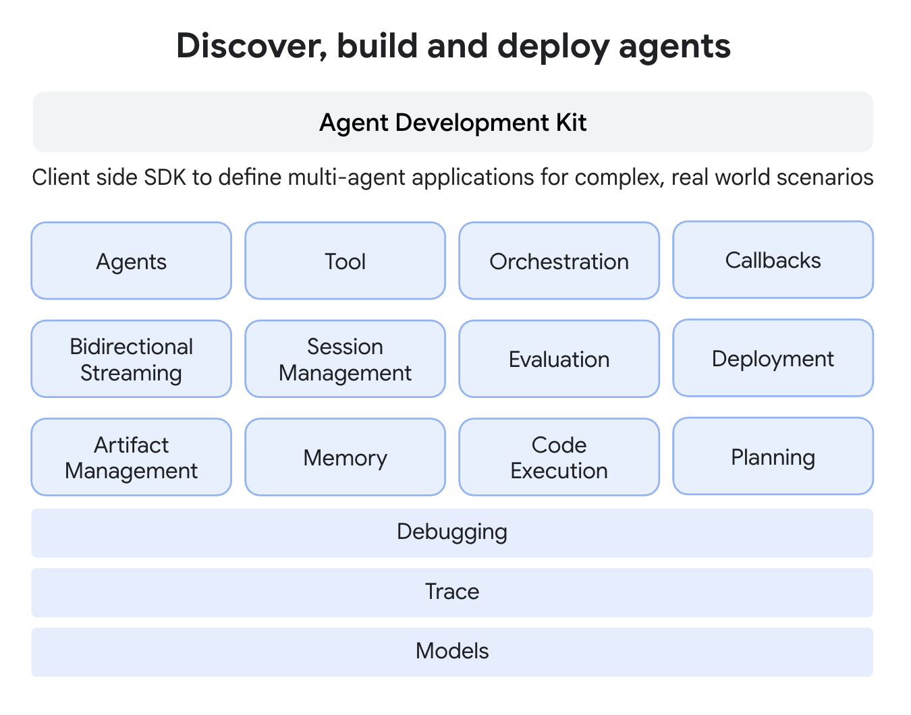

# Agent Development Kit (ADK)

 <b> 에이전트의 구축, 평가, 배포를 원활하게! </b> 

ADK는 개발자가 AI 기반 에이전트를 구축, 관리, 평가 및 배포할 수 있도록 지원하기 위해 설계되었습니다. ADK는 복잡한 작업과 워크플로우를 처리할 수 있는 대화형 및 비대화형 에이전트를 만들기 위한 견고하고 유연한 환경을 제공합니다.

## 핵심 개념

ADK는 강력하고 유연한 기능을 제공하는 몇 가지 핵심 요소와 개념을 중심으로 구축되었습니다. 필수 요소는 다음과 같습니다:

*   **에이전트(Agent):** 특정 작업을 위해 설계된 기본적인 작업 단위(worker unit)입니다. 에이전트는 복잡한 추론을 위해 언어 모델(`LlmAgent`)을 사용하거나, 실행을 결정론적으로 제어하는 컨트롤러 역할("워크플로우 에이전트"라고 함, `SequentialAgent`, `ParallelAgent`, `LoopAgent`)을 할 수 있습니다.
*   **툴(Tool):** 에이전트에게 대화를 넘어선 능력을 부여하여 외부 API와 상호작용하거나, 정보를 검색하거나, 코드를 실행하거나, 다른 서비스를 호출할 수 있게 합니다.
*   **콜백(Callbacks):** 에이전트 프로세스의 특정 지점에서 실행되도록 제공하는 사용자 정의 코드 조각으로, 확인, 로깅 또는 동작 수정을 가능하게 합니다.
*   **세션 관리(`Session` & `State`):** 단일 대화의 컨텍스트(`Session`)를 처리하며, 여기에는 대화 기록(`Events`)과 해당 대화에 대한 에이전트의 작업 메모리(`State`)가 포함됩니다.
*   **메모리(Memory):** 에이전트가 *여러* 세션에 걸쳐 사용자에 대한 정보를 기억할 수 있게 하여 장기적인 컨텍스트를 제공합니다 (단기적인 세션 `State`와는 구별됨).
*   **아티팩트 관리(`Artifact`):** 에이전트가 세션 또는 사용자와 관련된 파일이나 바이너리 데이터(이미지, PDF 등)를 저장, 로드 및 관리할 수 있게 합니다.
*   **코드 실행(Code Execution):** 에이전트가 (주로 툴을 통해) 복잡한 계산이나 작업을 수행하기 위해 코드를 생성하고 실행하는 기능입니다.
*   **계획(Planning):** 에이전트가 복잡한 목표를 더 작은 단계로 나누고 ReAct 플래너처럼 목표 달성 방법을 계획할 수 있는 고급 기능입니다.
*   **모델(Models):** `LlmAgent`를 구동하는 기반 LLM으로, 에이전트의 추론 및 언어 이해 능력을 가능하게 합니다.
*   **이벤트(Event):** 세션 중에 발생하는 일(사용자 메시지, 에이전트 응답, 툴 사용 등)을 나타내는 기본적인 통신 단위로, 대화 기록을 형성합니다.
*   **러너(Runner):** 실행 흐름을 관리하고, 이벤트를 기반으로 에이전트 상호작용을 조율하며, 백엔드 서비스와 협력하는 엔진입니다.

***참고:** 멀티모달 스트리밍, 평가, 배포, 디버깅, 추적과 같은 기능들도 더 넓은 ADK 생태계의 일부이며, 실시간 상호작용과 개발 라이프사이클을 지원합니다.*

## 주요 기능

ADK는 에이전트 기반 애플리케이션을 구축하는 개발자에게 다음과 같은 몇 가지 주요 이점을 제공합니다:

1.  **멀티 에이전트 시스템 설계:** 계층적으로 배열된 여러 전문화된 에이전트로 구성된 애플리케이션을 쉽게 구축할 수 있습니다. 에이전트는 복잡한 작업을 조율하고, LLM 기반의 전달 또는 명시적인 `AgentTool` 호출을 통해 하위 작업을 위임하여 모듈식의 확장 가능한 솔루션을 구현할 수 있습니다.
2.  **풍부한 툴 생태계:** 에이전트에게 다양한 기능을 갖추게 합니다. ADK는 사용자 정의 함수(`FunctionTool`) 통합, 다른 에이전트를 툴로 사용(`AgentTool`), 코드 실행과 같은 내장 기능 활용, 외부 데이터 소스 및 API(예: 검색, 데이터베이스)와의 상호작용을 지원합니다. 장기 실행 툴을 지원하여 비동기 작업을 효과적으로 처리할 수 있습니다.
3.  **유연한 오케스트레이션:** 내장된 워크플로우 에이전트(`SequentialAgent`, `ParallelAgent`, `LoopAgent`)와 LLM 기반의 동적 라우팅을 함께 사용하여 복잡한 에이전트 워크플로우를 정의합니다. 이를 통해 예측 가능한 파이프라인과 적응형 에이전트 동작을 모두 구현할 수 있습니다.
4.  **통합된 개발자 도구:** 쉽게 로컬에서 개발하고 반복 작업을 수행합니다. ADK는 에이전트 실행, 실행 단계(이벤트, 상태 변경) 검사, 상호작용 디버깅, 에이전트 정의 시각화를 위한 명령줄 인터페이스(CLI) 및 개발자 UI와 같은 도구를 포함합니다.
5.  **네이티브 스트리밍 지원:** 양방향 스트리밍(텍스트 및 오디오)을 네이티브로 지원하여 실시간 대화형 경험을 구축합니다. 이는 [Gemini 개발자 API용 멀티모달 라이브 API](https://ai.google.dev/gemini-api/docs/live) ([Vertex AI용](https://cloud.google.com/vertex-ai/generative-ai/docs/model-reference/multimodal-live)도 포함)와 같은 기반 기능과 원활하게 통합되며, 종종 간단한 설정 변경만으로 활성화할 수 있습니다.
6.  **내장된 에이전트 평가:** 에이전트 성능을 체계적으로 평가합니다. 이 프레임워크는 멀티턴(multi-turn) 평가 데이터셋을 생성하고, 품질 측정 및 개선 방향을 안내하기 위해 로컬에서(CLI 또는 개발 UI를 통해) 평가를 실행하는 도구를 포함합니다.
7.  **광범위한 LLM 지원:** Google의 Gemini 모델에 최적화되어 있지만, 프레임워크는 유연성을 위해 설계되어 `BaseLlm` 인터페이스를 통해 다양한 LLM(오픈 소스 또는 파인튜닝된 모델 포함)과 통합할 수 있습니다.
8.  **아티팩트 관리:** 에이전트가 파일과 바이너리 데이터를 처리할 수 있도록 합니다. 프레임워크는 에이전트가 실행 중에 이미지, 문서 또는 생성된 보고서와 같은 버전 관리된 아티팩트를 저장, 로드 및 관리할 수 있는 메커니즘(`ArtifactService`, 컨텍스트 메서드)을 제공합니다.
9.  **확장성 및 상호 운용성:** ADK는 개방형 생태계를 지향합니다. 핵심 도구를 제공하면서도 개발자가 서드파티 툴과 데이터 커넥터를 쉽게 통합하고 재사용할 수 있도록 합니다.
10. **상태 및 메모리 관리:** `SessionService`에 의해 관리되는 단기적인 대화 메모리(`Session` 내의 `State`)를 자동으로 처리합니다. 장기적인 `Memory` 서비스를 위한 통합 지점을 제공하여 에이전트가 여러 세션에 걸쳐 사용자 정보를 기억할 수 있게 합니다.

## 시작하기

*   첫 번째 에이전트를 만들 준비가 되셨나요? [빠른 시작 가이드를 시도해 보세요](./quickstart.md)