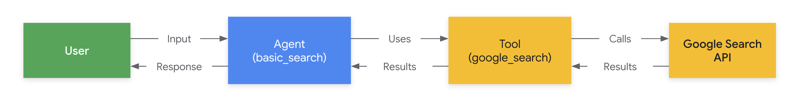
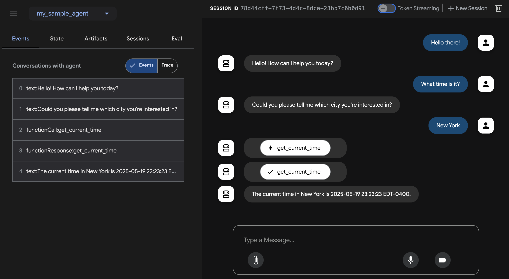

# 다중 도구 에이전트 빌드

이 빠른 시작은 ADK(Agent Development Kit)를 설치하고, 여러 도구가 포함된 기본 에이전트를 설정하고, 터미널 또는 대화형 브라우저 기반 개발 UI에서 로컬로 실행하는 방법을 안내합니다.

<!--  -->

이 빠른 시작은 Python 3.10+ 또는 Java 17+ 및 터미널 액세스가 가능한 로컬 IDE(VS Code, PyCharm, IntelliJ IDEA 등)를 가정합니다. 이 방법은 애플리케이션을 머신에서 완전히 실행하며 내부 개발에 권장됩니다.

## 1. 환경 설정 및 ADK 설치 { #set-up-environment-install-adk }

=== "Python"

    가상 환경 생성 및 활성화(권장):

    ```bash
    # 생성
    python -m venv .venv
    # 활성화(새 터미널마다)
    # macOS/Linux: source .venv/bin/activate
    # Windows CMD: .venv\Scripts\activate.bat
    # Windows PowerShell: .venv\Scripts\Activate.ps1
    ```

    ADK 설치:

    ```bash
    pip install google-adk
    ```

=== "Java"

    ADK를 설치하고 환경을 설정하려면 다음 단계를 진행하십시오.

## 2. 에이전트 프로젝트 생성 { #create-agent-project }

### 프로젝트 구조

=== "Python"

    다음과 같은 프로젝트 구조를 생성해야 합니다.

    ```console
    parent_folder/
        multi_tool_agent/
            __init__.py
            agent.py
            .env
    ```

    `multi_tool_agent` 폴더 생성:

    ```bash
    mkdir multi_tool_agent/
    ```

    !!! info "Windows 사용자 참고 사항"

        다음 몇 단계에서 Windows에서 ADK를 사용할 때 다음 명령(`mkdir`, `echo`)이 일반적으로 null 바이트 및/또는 잘못된 인코딩으로 파일을 생성하므로 파일 탐색기 또는 IDE를 사용하여 Python 파일을 만드는 것이 좋습니다.

    ### `__init__.py`

    이제 폴더에 `__init__.py` 파일을 생성합니다.

    ```shell
    echo "from . import agent" > multi_tool_agent/__init__.py
    ```

    `__init__.py`는 이제 다음과 같아야 합니다.

    ```python title="multi_tool_agent/__init__.py"
    --8<-- "examples/python/snippets/get-started/multi_tool_agent/__init__.py"
    ```

    ### `agent.py`

    동일한 폴더에 `agent.py` 파일을 생성합니다.

    === "OS X &amp; Linux"
        ```shell
        touch multi_tool_agent/agent.py
        ```

    === "Windows"
        ```shell
        type nul > multi_tool_agent\.env
        ```

    다음 코드를 `agent.py`에 복사하여 붙여넣습니다.

    ```python title="multi_tool_agent/agent.py"
    --8<-- "examples/python/snippets/get-started/multi_tool_agent/agent.py"
    ```

    ### `.env`

    동일한 폴더에 `.env` 파일을 생성합니다.

    === "OS X &amp; Linux"
        ```shell
        touch multi_tool_agent/.env
        ```

    === "Windows"
        ```shell
        type nul > multi_tool_agent\.env
        ```

    이 파일에 대한 추가 지침은 [모델 설정](#set-up-the-model) 섹션에 설명되어 있습니다.

=== "Java"

    Java 프로젝트는 일반적으로 다음과 같은 프로젝트 구조를 가집니다.

    ```console
    project_folder/
    ├── pom.xml (또는 build.gradle)
    ├── src/
    ├── └── main/
    │       └── java/
    │           └── agents/
    │               └── multitool/
    └── test/
    ```

    ### `MultiToolAgent.java` 생성

    `src/main/java/agents/multitool/` 디렉토리의 `agents.multitool` 패키지에 `MultiToolAgent.java` 소스 파일을 생성합니다.

    다음 코드를 `MultiToolAgent.java`에 복사하여 붙여넣습니다.

    ```java title="agents/multitool/MultiToolAgent.java"
    --8<-- "examples/java/cloud-run/src/main/java/agents/multitool/MultiToolAgent.java:full_code"
    ```


## 3. 모델 설정 { #set-up-the-model }

에이전트가 사용자 요청을 이해하고 응답을 생성하는 기능은 LLM(대규모 언어 모델)에 의해 구동됩니다. 에이전트는 이 외부 LLM 서비스에 보안 호출을 수행해야 하며, 이는 **인증 자격 증명**이 필요합니다. 유효한 인증 없이는 LLM 서비스가 에이전트의 요청을 거부하고 에이전트는 작동할 수 없습니다.

!!!tip "모델 인증 가이드"
    다양한 모델에 대한 인증에 대한 자세한 가이드는 [인증 가이드](/adk-docs/ko/agents/models/google-gemini#google-ai-studio)를 참조하십시오.
    이것은 에이전트가 LLM 서비스에 호출을 할 수 있도록 하는 중요한 단계입니다.

=== "Gemini - Google AI Studio"
    1. [Google AI Studio](https://aistudio.google.com/apikey)에서 API 키를 가져옵니다.
    2. Python을 사용하는 경우 (`multi_tool_agent/`) 내에 있는 **`.env`** 파일을 열고 다음 코드를 복사하여 붙여넣습니다.

        ```env title="multi_tool_agent/.env"
        GOOGLE_GENAI_USE_VERTEXAI=FALSE
        GOOGLE_API_KEY=PASTE_YOUR_ACTUAL_API_KEY_HERE
        ```

        Java를 사용하는 경우 환경 변수를 정의합니다.

        ```console title="terminal"
        export GOOGLE_GENAI_USE_VERTEXAI=FALSE
        export GOOGLE_API_KEY=PASTE_YOUR_ACTUAL_API_KEY_HERE
        ```

    3. `PASTE_YOUR_ACTUAL_API_KEY_HERE`를 실제 `API KEY`로 바꿉니다.

=== "Gemini - Google Cloud Vertex AI"
    1. [Google Cloud 프로젝트](https://cloud.google.com/vertex-ai/generative-ai/docs/start/quickstarts/quickstart-multimodal#setup-gcp)를 설정하고 [Vertex AI API를 활성화](https://console.cloud.google.com/flows/enableapi?apiid=aiplatform.googleapis.com)합니다.
    2. [gcloud CLI](https://cloud.google.com/vertex-ai/generative-ai/docs/start/quickstarts/quickstart-multimodal#setup-local)를 설정합니다.
    3. 터미널에서 `gcloud auth application-default login`을 실행하여 Google Cloud에 인증합니다.
    4. Python을 사용하는 경우 (`multi_tool_agent/`) 내에 있는 **`.env`** 파일을 엽니다. 다음 코드를 복사하여 붙여넣고 프로젝트 ID와 위치를 업데이트합니다.

        ```env title="multi_tool_agent/.env"
        GOOGLE_GENAI_USE_VERTEXAI=TRUE
        GOOGLE_CLOUD_PROJECT=YOUR_PROJECT_ID
        GOOGLE_CLOUD_LOCATION=LOCATION
        ```

        Java를 사용하는 경우 환경 변수를 정의합니다.

        ```console title="terminal"
        export GOOGLE_GENAI_USE_VERTEXAI=TRUE
        export GOOGLE_CLOUD_PROJECT=YOUR_PROJECT_ID
        export GOOGLE_CLOUD_LOCATION=LOCATION
        ```

=== "Gemini - Google Cloud Vertex AI Express 모드 사용"
    1. 무료 Google Cloud 프로젝트에 가입하고 적격 계정으로 Gemini를 무료로 사용할 수 있습니다!
        * [Vertex AI Express 모드가 포함된 Google Cloud 프로젝트](https://cloud.google.com/vertex-ai/generative-ai/docs/start/express-mode/overview)를 설정합니다.
        * Express 모드 프로젝트에서 API 키를 가져옵니다. 이 키는 ADK와 함께 Gemini 모델을 무료로 사용하고 Agent Engine 서비스에 액세스하는 데 사용할 수 있습니다.
    2. Python을 사용하는 경우 (`multi_tool_agent/`) 내에 있는 **`.env`** 파일을 엽니다. 다음 코드를 복사하여 붙여넣고 프로젝트 ID와 위치를 업데이트합니다.

        ```env title="multi_tool_agent/.env"
        GOOGLE_GENAI_USE_VERTEXAI=TRUE
        GOOGLE_API_KEY=PASTE_YOUR_ACTUAL_EXPRESS_MODE_API_KEY_HERE
        ```

        Java를 사용하는 경우 환경 변수를 정의합니다.

        ```console title="terminal"
        export GOOGLE_GENAI_USE_VERTEXAI=TRUE
        export GOOGLE_API_KEY=PASTE_YOUR_ACTUAL_EXPRESS_MODE_API_KEY_HERE
        ```

## 4. 에이전트 실행 { #run-your-agent }

=== "Python"

    터미널을 사용하여 에이전트 프로젝트의 상위 디렉토리로 이동합니다(예: `cd ..` 사용).

    ```console
    parent_folder/      <-- 이 디렉토리로 이동
        multi_tool_agent/
            __init__.py
            agent.py
            .env
    ```

    에이전트와 상호 작용하는 여러 가지 방법이 있습니다.

    === "개발 UI (adk web)"

        !!! success "Vertex AI 사용자 인증 설정"
            이전 단계에서 **"Gemini - Google Cloud Vertex AI"**를 선택한 경우 개발 UI를 시작하기 전에 Google Cloud로 인증해야 합니다.

            이 명령을 실행하고 프롬프트에 따릅니다.
            ```bash
            gcloud auth application-default login
            ```

            **참고:** "Gemini - Google AI Studio"를 사용하는 경우 이 단계를 건너뛰십시오.

        다음 명령을 실행하여 **개발 UI**를 시작합니다.

        ```shell
        adk web
        ```

        !!!info "Windows 사용자 참고 사항"

            `_make_subprocess_transport NotImplementedError`가 발생하는 경우 대신 `adk web --no-reload`를 사용하는 것을 고려하십시오.


        **1단계:** 제공된 URL(일반적으로 `http://localhost:8000` 또는 `http://127.0.0.1:8000`)을 브라우저에서 직접 엽니다.

        **2단계.** UI의 왼쪽 상단 모서리에서 드롭다운에서 에이전트를 선택할 수 있습니다. "multi_tool_agent"를 선택합니다.

        !!!note "문제 해결"

            드롭다운 메뉴에 "multi_tool_agent"가 표시되지 않으면 에이전트 폴더의 **상위 폴더**(즉, multi_tool_agent의 상위 폴더)에서 `adk web`을 실행하고 있는지 확인하십시오.

        **3단계.** 이제 텍스트 상자를 사용하여 에이전트와 대화할 수 있습니다.

        


        **4단계.** 왼쪽에 있는 `이벤트` 탭을 사용하여 작업을 클릭하여 개별 함수 호출, 응답 및 모델 응답을 검사할 수 있습니다.

        

        `이벤트` 탭에서 `추적` 버튼을 클릭하여 각 함수 호출의 지연 시간을 보여주는 각 이벤트에 대한 추적 로그를 볼 수도 있습니다.

        

        **5단계.** 마이크를 활성화하고 에이전트와 대화할 수도 있습니다.

        !!!note "음성/영상 스트리밍을 위한 모델 지원"

            ADK에서 음성/영상 스트리밍을 사용하려면 라이브 API를 지원하는 Gemini 모델을 사용해야 합니다. Gemini 라이브 API를 지원하는 **모델 ID**는 다음 문서에서 찾을 수 있습니다.

            - [Google AI Studio: Gemini 라이브 API](https://ai.google.dev/gemini-api/docs/models#live-api)
            - [Vertex AI: Gemini 라이브 API](https://cloud.google.com/vertex-ai/generative-ai/docs/live-api)

            그런 다음 이전에 만든 `agent.py` 파일의 `root_agent`에서 `model` 문자열을 바꿀 수 있습니다([섹션으로 이동](#agentpy)). 코드는 다음과 같아야 합니다.

            ```py
            root_agent = Agent(
                name="weather_time_agent",
                model="replace-me-with-model-id", #e.g. gemini-2.0-flash-live-001
                ...
            ```

        

    === "터미널 (adk run)"

        !!! tip

            `adk run`을 사용할 때 다음처럼 명령에 텍스트를 파이프하여 에이전트에 프롬프트를 주입하여 시작할 수 있습니다.

            ```shell
            echo "파일 목록을 나열하여 시작하십시오." | adk run file_listing_agent
            ```

            날씨 에이전트와 채팅하려면 다음 명령을 실행하십시오.

            ```
            adk run multi_tool_agent
            ```

            

            종료하려면 Cmd/Ctrl+C를 사용하십시오.

    === "API 서버 (adk api_server)"

        `adk api_server`를 사용하면 단일 명령으로 로컬 FastAPI 서버를 만들 수 있으므로 에이전트를 배포하기 전에 로컬 cURL 요청을 테스트할 수 있습니다.

        

        `adk api_server`를 테스트에 사용하는 방법을 배우려면 [API 서버 사용에 대한 문서](/adk-docs/ko/runtime/api-server/)를 참조하십시오.

=== "Java"

    터미널을 사용하여 에이전트 프로젝트의 상위 디렉토리로 이동합니다(예: `cd ..` 사용).

    ```console
    project_folder/                <-- 이 디렉토리로 이동
    ├── pom.xml (또는 build.gradle)
    ├── src/
    ├── └── main/
    │       └── java/
    │           └── agents/
    │               └── multitool/
    │                   └── MultiToolAgent.java
    └── test/
    ```

    === "개발 UI"

        다음 명령을 터미널에서 실행하여 개발 UI를 시작합니다.

        **개발 UI 서버의 메인 클래스 이름을 변경하지 마십시오.**

        ```console title="terminal"
        mvn exec:java \
            -Dexec.mainClass="com.google.adk.web.AdkWebServer" \
            -Dexec.args="--adk.agents.source-dir=src/main/java" \
            -Dexec.classpathScope="compile"
        ```

        **1단계:** 제공된 URL(일반적으로 `http://localhost:8080` 또는 `http://127.0.0.1:8080`)을 브라우저에서 직접 엽니다.

        **2단계.** UI의 왼쪽 상단 모서리에서 드롭다운에서 에이전트를 선택할 수 있습니다. "multi_tool_agent"를 선택합니다.

        !!!note "문제 해결"

            드롭다운 메뉴에 "multi_tool_agent"가 표시되지 않으면 Java 소스 코드가 있는 위치(일반적으로 `src/main/java`)에서 `mvn` 명령을 실행하고 있는지 확인하십시오.

        **3단계.** 이제 텍스트 상자를 사용하여 에이전트와 대화할 수 있습니다.

        

        **4단계.** 개별 함수 호출, 응답 및 모델 응답을 클릭하여 검사할 수도 있습니다.

        

    === "Maven"

        Maven을 사용하여 다음 명령으로 Java 클래스의 `main()` 메서드를 실행합니다.

        ```console title="terminal"
        mvn compile exec:java -Dexec.mainClass="agents.multitool.MultiToolAgent"
        ```

    === "Gradle"

        Gradle을 사용하는 경우 `build.gradle` 또는 `build.gradle.kts` 빌드 파일의 `plugins` 섹션에 다음 Java 플러그인이 있어야 합니다.

        ```groovy
        plugins {
            id('java')
            // 기타 플러그인
        }
        ```

        그런 다음 빌드 파일의 다른 곳, 최상위 수준에서 에이전트의 `main()` 메서드를 실행하는 새 작업을 생성합니다.

        ```groovy
        tasks.register('runAgent', JavaExec) {
            classpath = sourceSets.main.runtimeClasspath
            mainClass = 'agents.multitool.MultiToolAgent'
        }
        ```

        마지막으로 명령줄에서 다음 명령을 실행합니다.

        ```console
        gradle runAgent
        ```


### 📝 시도할 예시 프롬프트

* 뉴욕의 날씨는 어떻습니까?
* 뉴욕의 시간은 몇 시입니까?
* 파리의 날씨는 어떻습니까?
* 파리의 시간은 몇 시입니까?

## 🎉 축하합니다!

ADK를 사용하여 첫 번째 에이전트를 성공적으로 만들고 상호 작용했습니다!

---

## 🛣️ 다음 단계

* **튜토리얼로 이동**: 에이전트에 메모리, 세션, 상태를 추가하는 방법을 알아보세요.
  [튜토리얼](../tutorials/index.md).
* **고급 구성 자세히 알아보기:** 프로젝트 구조, 구성 및 기타 인터페이스에 대한 자세한 내용은 [설정](installation.md) 섹션을 참조하십시오.
* **핵심 개념 이해:** [에이전트 개념](../agents/index.md)에 대해 알아보세요.
