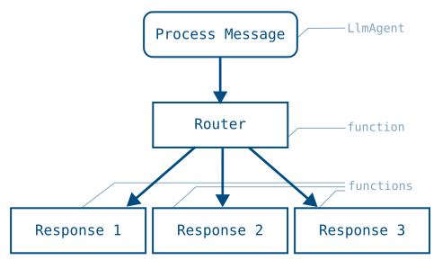

# Build graph routes for agent workflows

<div class="language-support-tag">
  <span class="lst-supported">ADK에서 지원</span><span class="lst-python">Python v2.0.0</span><span class="lst-typescript">TypeScript v2.0.0</span><span class="lst-go">Go v2.0.0</span>
</div>

Graph-based workflows in ADK define agent logic as a graph of execution nodes
and edges, allowing you to build more reliable processes that combine artificial
intelligence (AI) reasoning and code logic. These workflows allow you to create
logical routes of execution nodes that can encapsulate code functions,
AI-powered agents, Tools, and human input. By explicitly mapping out routing
logic, this approach allows you to define a specific, step-wise process workflow
in code, providing improved precision and reliability over purely prompt-based
agents.



**Figure 1.** Visualization of a task graph and the routing code to implement it.

=== "Python"

    ```python
    root_agent = Workflow(
      name="routing_workflow",
      edges=[
        ("START", process_message, router),
        (router,
          {
            "output-1": response_1,
            "output-2": response_2,
            "output-3": response_3,
          },
        ),
      ],
    )
    ```

=== "TypeScript"

    ```typescript
    export const rootAgent = new Workflow({
      name: 'routing_workflow',
      edges: [
        ['START', processMessage, router],
        [
          router,
          {
            'output-1': response1,
            'output-2': response2,
            'output-3': response3,
          },
        ],
      ],
    });
    ```

=== "Go"

    ADK Go v2.0.0 provides the following approach to graph-based
    workflows:

    **Graph engine** (`workflowagent` + `workflow.Edge`): A node-and-edges
    graph API that maps directly to Python's `Workflow(edges=[...])`.
    Nodes are defined with `workflow.NewFunctionNode`, `workflow.NewAgentNode`,
    or `workflow.NewDynamicNode`, edges are declared as `[]workflow.Edge`, and
    the whole graph is wrapped in a `workflowagent.New` call:

    ```go
    edges := workflow.Concat(
        workflow.Chain(workflow.Start, classifyNode),
        []workflow.Edge{
            {From: classifyNode, To: responseA, Route: workflow.StringRoute("output-1")},
            {From: classifyNode, To: responseB, Route: workflow.StringRoute("output-2")},
            {From: classifyNode, To: responseC, Route: workflow.StringRoute("output-3")},
        },
    )
    rootAgent, _ := workflowagent.New(workflowagent.Config{
        Name:  "routing_workflow",
        Edges: edges,
    })
    ```

The advantage of using a graph-based agent workflow is the significant increase
in control, predictability, and reliability over prompt-based agents. By
defining the overall process workflow in code, you gain more control over how
tasks are routed and executed. This structured node definition improves the
predictability of agents and enhances reliability for complex tasks that require
defined steps and process management.

Get started with graph-based workflows in ADK by checking out
[Graph-based agent workflows](/graphs/).

## Nodes

A graph is composed of execution nodes. These *nodes* can be ***Agents***, ADK
***Tools***, human input tasks, or code functions you write. Nodes can take
inputs from previously executed nodes, and emit data through ***Event***
objects.

=== "Python"

    The following shows a simple ***FunctionNode*** that handles text inputs
    and sends a text output:

    ```python
    from google.adk import Event

    def my_function_node(node_input: str):
        input_text_modified = node_input.upper()
        return Event(output=input_text_modified)
    ```

=== "TypeScript"

    ADK TypeScript v2.0.0에서 기본 노드 유형은 함수를 `node()`에 전달하여 생성하는 `FunctionNode`입니다. 핸들러는 항상 `(ctx, input)` 매개변수를 받으며, ADK는 매개변수 이름을 통해 값을 주입하지 않습니다. 값을 직접 반환하면 이벤트의 `output` 필드로 자동 래핑됩니다. `route` 또는 `content`를 함께 설정해야 하는 경우에는 명시적인 형태인 `createEvent({output})`를 반환합니다:

    ```typescript
    --8<-- "examples/typescript/snippets/graphs/routes/function_node.ts:function-node"
    ```

=== "Go"

    In ADK Go v2.0.0, the primary node type is `workflow.NewFunctionNode`.
    A `FunctionNode` wraps a plain Go function: the function returns a typed
    value, and the framework automatically wraps it in a `session.Event`,
    setting `event.Output`. The successor node receives this value as its
    typed `input` parameter — no manual state writes or event construction
    needed:

    ```go
    --8<-- "examples/go/snippets/graphs/routes/main.go:function-node"
    ```

For more information about transferring data between nodes, see
[Data handling for agent workflows](/graphs/data-handling/).

## Workflow graphs syntax

You define a graph by composing workflow agents. This section provides an
overview of the common routing patterns.

!!! caution "Caution: Workflow agent limitations"

    You can add ***LlmAgents*** to graph-based workflows. However, they must
    be configured for single-turn or task mode. For more information about
    agent modes, see
    [Build collaborative agent teams](/workflows/collaboration/#mode-configuration-and-behaviors).

### Route sequences

A sequential route runs each node once, in the listed order.

=== "Python"

    The `edges` array uses the `START` keyword to indicate the beginning of a
    graph execution, with each listed node executed in sequence:

    ```python
    edges=[("START", task_A_node)]  # single node run
    edges=[("START",
            task_A_node,
            task_B_node,
            task_C_node)]           # 3 nodes run in order
    ```

=== "TypeScript"

    `'START'`로 시작하는 `edges` 행은 나열된 각 노드를 순서대로 한 번씩 실행하고, 모든 노드의 반환 값을 다음 노드로 전달합니다:

    ```typescript
    edges: [['START', taskANode]]                       // 단일 노드
    edges: [['START', taskANode, taskBNode, taskCNode]] // 3개 노드 순차 실행
    ```

    둘 이상의 행에 `'START'`를 나열하면 병렬 경로가 생성됩니다. 자세한 내용은 [팬아웃 및 조인](#parallel-tasks-fan-out-and-join-paths)을 참조하세요.

    ```typescript
    --8<-- "examples/typescript/snippets/graphs/routes/sequence.ts:sequence"
    ```

=== "Go"

    `workflow.Chain(workflow.Start, nodeA, nodeB, nodeC)` wires nodes into a
    sequential edge slice. Each node's typed return value is forwarded to the
    next node via `event.Output` — no session state writes needed:

    ```go
    --8<-- "examples/go/snippets/graphs/routes/main.go:sequential-nodes"
    ```

### Route branches and conditional execution

=== "Python"

    In Python, branching is handled by a `FunctionNode` that returns an
    `Event(route=...)` value, which the `edges` dict dispatches to different nodes.

    ```python
    from google.adk import Event, Workflow
    from google.adk.agents import Agent


    def router(node_input: str):
        """Route to task B or C based on node_input."""
        if condition(node_input):
            return Event(route="RUN_TASK_C")
        return Event(route="RUN_TASK_B")

    task_B_node = Agent(name="task_B_agent") # An agent to execute node B

    def task_C_node(node_input: str):
        """A FunctionNode to execute node C."""
        return Event(output="Task C completed")

    root_agent = Workflow(
        name="routing_workflow",
        edges=[
            ("START", task_A_node, router),
            (router,
              {
                # "route value": node_to_run
                "RUN_TASK_B": task_B_node,
                "RUN_TASK_C": task_C_node,
              },
            ),
        ],
    )
    ```

=== "TypeScript"

    브랜칭에는 `route` 값을 방출하는 노드와 각 라우트 값을 처리하는 노드에 매핑하는 edge 행이 필요합니다. 라우트 값은 문자열, 숫자 또는 불리언일 수 있습니다. `DEFAULT_ROUTE` 설정은 동일한 소스 노드의 다른 어떤 라우트와도 일치하지 않을 때 매칭됩니다. 브랜치 대상은 모든 노드 유사(node-like) 값이 될 수 있습니다. 이 예제에서 `taskBNode`는 `LlmAgent`이고 `taskCNode`는 함수입니다.

    ```typescript
    --8<-- "examples/typescript/snippets/graphs/routes/branches.ts:branches"
    ```

=== "Go"

    In ADK Go v2.0.0, conditional dispatch uses the `workflow` graph engine.
    A node sets `Event.Routes` to one or more string route keys, and each
    `workflow.Edge` selects its successor using a `workflow.Route` matcher:

    -   `workflow.StringRoute("category")` — matches a single string value
    -   `workflow.IntRoute(n)` or `workflow.MultiRoute[int]{1, 2, 3}` — matches
        integer values
    -   `workflow.BoolRoute(true)` — matches a boolean value
    -   `workflow.Default` — matches when no other route on the same source
        node matches

    The following pattern is the Go equivalent of the Python router:

    ```go
    // classifyNode emits an Event with Routes=[]string{"BUG"},
    // ["CUSTOMER_SUPPORT"], or ["LOGISTICS"] based on the message.
    edges := workflow.Concat(
        workflow.Chain(workflow.Start, processMessage, classifyNode),
        []workflow.Edge{
            {From: classifyNode, To: bugHandler,       Route: workflow.StringRoute("BUG")},
            {From: classifyNode, To: supportHandler,   Route: workflow.StringRoute("CUSTOMER_SUPPORT")},
            {From: classifyNode, To: logisticsHandler, Route: workflow.StringRoute("LOGISTICS")},
        },
    )
    rootAgent, _ := workflowagent.New(workflowagent.Config{
        Name:  "routing_workflow",
        Edges: edges,
    })
    ```

    `workflow.EdgeBuilder` provides a fluent alternative to assembling the
    `[]workflow.Edge` slice by hand. The builder's `Add`, `AddFanOut`, and
    `AddFanIn` methods express the same topology with less repetition:

    ```go
    eb := workflow.NewEdgeBuilder()
    eb.Add(workflow.Start, processMessage)
    eb.Add(processMessage, classifyNode)
    eb.AddRoute(classifyNode, bugHandler,       workflow.StringRoute("BUG"))
    eb.AddRoute(classifyNode, supportHandler,   workflow.StringRoute("CUSTOMER_SUPPORT"))
    eb.AddRoute(classifyNode, logisticsHandler, workflow.StringRoute("LOGISTICS"))

    rootAgent, _ := workflowagent.New(workflowagent.Config{
        Name:  "routing_workflow",
        Edges: eb.Build(),
    })
    ```

    For complete, runnable routing examples see:
    [string routing](https://github.com/google/adk-go/tree/v2/examples/workflow/routing/string),
    [int / multi-value routing](https://github.com/google/adk-go/tree/v2/examples/workflow/routing/int),
    and [LLM-driven routing](https://github.com/google/adk-go/tree/v2/examples/workflow/routing/llm).

    !!! note "Prebuilt agents: encoding routing in state"

        When using `sequentialagent` / `parallelagent` / `loopagent` instead
        of the graph engine, there is no `Event.Routes` dispatch. Encode the
        routing decision in session state via `OutputKey` and let downstream
        agents inspect it in their `Instruction` template, or use a `loopagent`
        with an `Escalate`-based exit — see the
        [loop and escalation example](#loop-and-escalation-exit) below.

## 병렬 작업: Fan-out 및 Join 경로

You can create graphs that split execution across multiple, parallel nodes, and
typically you need to assemble the output of each node for further processing.
This task execution pattern has two stages. The workflow first fans out when it
starts multiple parallel tasks, and then it re-joins those paths when those
tasks are completed before proceeding to the next step.


**Figure 2.** The output of parallel task nodes can be assembled and joined
before passing results to the next step.

=== "Python"

    You accomplish the join step by using a ***JoinNode*** object, which waits
    for each parallel task to complete and then passes the collection of outputs
    from these nodes to the next node.

    ```python
    from google.adk.workflow import JoinNode

    my_join_node = JoinNode(name="my_join_node")

    edges=[
        ("START", parallel_task_A, my_join_node),
        ("START", parallel_task_B, my_join_node),
        ("START", parallel_task_C, my_join_node),
        (my_join_node, final_task_D),
    ]
    ```

=== "TypeScript"

    `JoinNode`는 팬인(fan-in) 배리어입니다. 이 로직 메커니즘은 모든 이전(predecessor) 태스크가 완료될 때까지 대기한 후, 이전 노드 이름을 키로 하는 레코드를 후속 노드에 전달합니다:

    ```typescript
    --8<-- "examples/typescript/snippets/graphs/routes/fan_out_join.ts:fan-out-join"
    ```

=== "Go"

    ADK Go v2.0.0 provides `workflow.NewJoinNode` for true fan-in in the
    graph engine: fan-out edges from `workflow.Start` (or any shared source
    node) feed in parallel to the join node, which waits for all of them to
    complete before emitting a `map[string]any` keyed by predecessor node name
    to the next node.

    `workflow.EdgeBuilder` makes the fan-out / fan-in wiring concise with its
    dedicated `AddFanOut` and `AddFanIn` helpers (as shown in the
    [complex workflow example](https://github.com/google/adk-go/tree/v2/examples/workflow/complex)):

    ```go
    gatherNode := workflow.NewJoinNode("gather")

    eb := workflow.NewEdgeBuilder()
    eb.AddFanOut(workflow.Start, researchNodeA, researchNodeB, researchNodeC)
    eb.AddFanIn(gatherNode, researchNodeA, researchNodeB, researchNodeC)
    eb.Add(gatherNode, formatNode)
    eb.Add(formatNode, synthesisNode)

    rootAgent, _ := workflowagent.New(workflowagent.Config{
        Name:  "research_pipeline",
        Edges: eb.Build(),
    })
    ```

    The following snippet shows the complete fan-out / join pattern using
    `workflow.NewJoinNode` and `EdgeBuilder.AddFanOut` / `AddFanIn`:

    ```go
    --8<-- "examples/go/snippets/graphs/routes/main.go:parallel-fan-out"
    ```

!!! warning "주의: JoinNode로 연결되는 노드는 반드시 출력을 생성해야 합니다"

    `JoinNode`는 모든 이전 노드가 완료된 후에만 해제됩니다. 조인으로 연결되는 모든 노드가 자체 출력을 생성하는지 확인하고, 실패할 수 있는 모든 노드에 재시도 구성을 연결하세요. 출력을 생성하지 않고 완료된 이전 노드가 있으면 조인에 해당 브랜치의 값이 남지 않으며, 결과적인 실패는 문제를 유발한 노드에서 떨어진 다운스트림에서 발생합니다.

## 중첩 워크플로

When building more complex workflows, you may want to encapsulate the
functionality for specific tasks into reusable workflows. One or more
workflow agents can be used as a sub-agent within another workflow agent to
accomplish this goal.


**Figure 3.** Nested workflow agents as sub-agents inside a parent workflow.

=== "Python"

    ```python
    from google.adk import Workflow

    root_agent = Workflow(
        name="parent_workflow",
        edges=[
           ("START", task_A1, router),
           (router, {
                "RUN_WORKFLOW_B": workflow_B,
                "RUN_WORKFLOW_C": workflow_C,
                },
           ),
        ],
    )
    ```

    #### Nested workflow data output

    Output for nested Workflow objects works slightly differently from
    individual nodes. When the nested workflow completes one of its nodes, it
    transmits data to the next node in the nested workflow's graph *and* the
    system bubbles up the Event for that node to the parent workflow for
    process traceability. When the nested workflow completes the last node in
    its process, the parent node extracts data from the final leaf nodes and
    emits it as the output of the nested workflow.

=== "TypeScript"

    `Workflow` 자체가 하나의 노드이므로, 재사용 가능한 하위 프로세스를 캡슐화하기 위해 다른 워크플로의 edges 내부에서 워크플로를 노드로 사용할 수 있습니다:

    ```typescript
    --8<-- "examples/typescript/snippets/graphs/routes/nested_workflow.ts:nested-workflow"
    ```

    **중첩 워크플로 데이터 출력.** 내부 워크플로가 실행되는 동안 각 노드 이벤트는 추적성을 위해 상위 노드로 전달(bubble up)됩니다. 내부 워크플로가 완료되면 최종 노드의 출력이 중첩 워크플로 노드의 출력이 됩니다.

=== "Go"

    ADK Go v2.0.0 supports nested workflows in two complementary ways:

    **Graph engine** (`workflowagent` + `workflow.Edge`): A `workflowagent`
    created with `workflowagent.New` is itself an `agent.Agent`, so it can
    be wrapped with `workflow.NewAgentNode` and used as a node inside another
    workflow's `edges` slice. The inner workflow runs to completion as a single
    node from the outer graph's perspective, and its terminal output is emitted
    as the node output on the outer graph's edge:

    ```go
    innerNode, _ := workflow.NewAgentNode(innerWorkflowAgent, workflow.NodeConfig{})

    outerEdges := workflow.Chain(workflow.Start, outerStepNode, innerNode, finalNode)
    rootAgent, _ := workflowagent.New(workflowagent.Config{
        Name:  "parent_workflow",
        Edges: outerEdges,
    })
    ```

    The following snippet shows both the inner and outer graph construction.
    `workflow.NewAgentNode` wraps the inner `workflowagent` so it can be
    placed in the outer graph's `workflow.Chain`:

    ```go
    --8<-- "examples/go/snippets/graphs/routes/main.go:nested-workflows"
    ```

## 루프 및 에스컬레이션 종료

A loop repeats a set of steps until a termination condition is met. In Python
this is expressed as a back-edge in the `edges` graph that routes back to an
earlier node. In ADK Go v2.0.0, the graph engine supports the same pattern
directly: add an edge from a downstream node back to an earlier node with a
route condition, and the engine re-activates the target node with a fresh
lifecycle on each iteration.

=== "Python"

    ```python
    from google.adk import Event, Workflow


    def router(node_input: str):
        """Route to task B or C based on node_input."""
        if condition(node_input):
            return Event(route="RUN_TASK_C")
        return Event(route="RUN_TASK_B")

    root_agent = Workflow(
        name="routing_workflow",
        edges=[
            ("START", task_A_node, router),
            (router,
              {
                "RUN_TASK_B": task_B_node,
                "RUN_TASK_C": task_C_node,
              },
            ),
        ],
    )
    ```

=== "TypeScript"

    루프는 역방향 에지(back-edge)입니다. 다운스트림 노드가 이전 노드로 다시 라우팅되며, 엔진은 반복마다 새로운 라이프사이클로 해당 노드를 다시 활성화합니다. 라우터가 종료 브랜치를 선택하면 루프가 종료됩니다:

    ```typescript
    --8<-- "examples/typescript/snippets/graphs/routes/loop_escalation.ts:loop-escalation"
    ```

=== "Go"

    The following example uses the graph engine with `workflow.EdgeBuilder`.
    The critic node returns a verdict, a router node sets `Event.Routes`, and
    a back-edge from the refiner to the critic creates the loop. When the
    critic is satisfied it routes to the terminal `done` node instead:

    ```go
    --8<-- "examples/go/snippets/graphs/routes/main.go:loop-escalate"
    ```

!!! warning "주의: 제한 없는 그래프 순환"

    그래프 사이클은 자동으로 제한되지 않습니다. 종료 조건이 결국 참(true)이 되도록 보장하거나, 루프가 자체 코드에서 실행되고 범위를 제어할 수 있는 [동적 워크플로](/graphs/dynamic/#loop-route)로 반복을 표현하세요.
