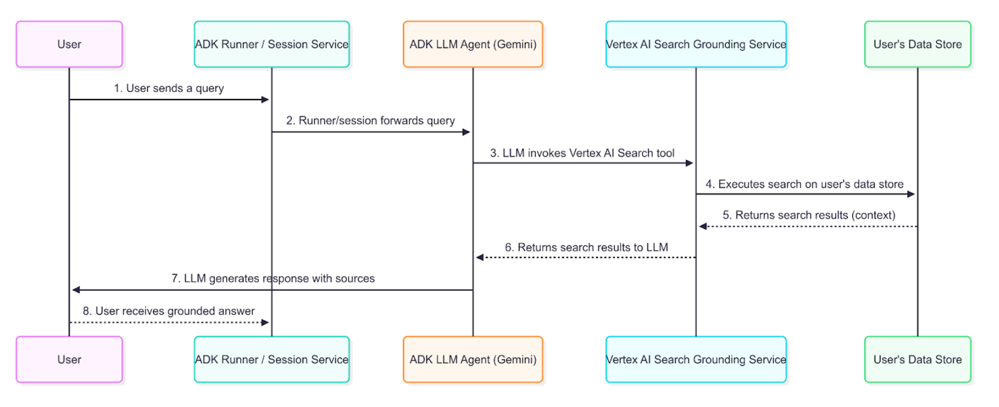

# 에이전트 검색 기반

<div class="language-support-tag">
  <span class="lst-supported">Supported in ADK</span><span class="lst-python">Python v0.1.0</span><span class="lst-java">Java v0.1.0</span>
</div>

[Agent Search](/integrations/agent-search/)는 AI 에이전트가 개인 기업 문서 및 데이터 저장소의 정보에 액세스할 수 있도록 하는 ADK(에이전트 개발 키트)를 위한 강력한 도구입니다. 에이전트를 색인화된 엔터프라이즈 콘텐츠에 연결하면 사용자에게 조직의 지식 기반에 기반한 답변을 제공할 수 있습니다.

이 기능은 내부 문서, 정책, 연구 논문 또는 [Agent Search](https://cloud.google.com/enterprise-search) 데이터 저장소에 인덱싱된 독점 콘텐츠의 정보가 필요한 기업별 쿼리에 특히 유용합니다. 에이전트가 지식 기반의 정보가 필요하다고 판단하면 인덱싱된 문서를 자동으로 검색하고 결과를 적절한 속성과 함께 응답에 통합합니다.

## 에이전트 검색 준비 중

기반 에이전트를 생성하기 전에 기존 에이전트 검색 데이터 저장소가 있어야 합니다. 없는 경우 [Get started with custom search](https://cloud.google.com/generative-ai-app-builder/docs/try-enterprise-search#unstructured-data)의 지침에 따라 하나를 만듭니다. 에이전트를 구성하려면 `Data store ID`(예: `projects/YOUR_PROJECT_ID/locations/global/collections/default_collection/dataStores/YOUR_DATASTORE_ID`)가 필요합니다.

## 인증 설정

**참고: 에이전트 검색에는 Google Cloud Platform(에이전트 플랫폼) 인증이 필요합니다. 이 도구에는 Google AI Studio가 지원되지 않습니다.**

* [gcloud CLI](https://cloud.google.com/vertex-ai/generative-ai/docs/start/quickstarts/quickstart-multimodal#setup-local) 설정
* `gcloud auth login`를 실행하여 터미널에서 Google Cloud에 인증합니다.
* Python의 경우 **`.env`** 파일을 열고 프로젝트 ID와 위치를 지정합니다.
* 자바의 경우 애플리케이션 환경에 Google Cloud 기본 사용자 인증 정보(`GOOGLE_APPLICATION_CREDENTIALS`)가 구성되어 있는지 확인하세요.

```env title=".env"
GOOGLE_GENAI_USE_VERTEXAI=TRUE
GOOGLE_CLOUD_PROJECT=YOUR_PROJECT_ID
GOOGLE_CLOUD_LOCATION=LOCATION
```

## 지상 요원 생성

검색을 통한 접지를 활성화하려면 `data_store_id`를 제공하여 에이전트 정의에 검색 도구를 포함시킵니다.

=== "Python"

    ```python
    from google.adk.agents import Agent
    from google.adk.tools import VertexAiSearchTool

    # Configuration
    DATASTORE_ID = "projects/YOUR_PROJECT_ID/locations/global/collections/default_collection/dataStores/YOUR_DATASTORE_ID"

    root_agent = Agent(
        name="vertex_search_agent",
        model="gemini-flash-latest",
        instruction="Answer questions using Agent Search to find information from internal documents. Always cite sources when available.",
        description="Enterprise document search assistant with Agent Search capabilities",
        tools=[VertexAiSearchTool(data_store_id=DATASTORE_ID)]
    )
    ```

=== "Java"

    ```java
    import com.google.adk.agents.LlmAgent;
    import com.google.adk.tools.VertexAiSearchTool;

    // Configuration
    String DATASTORE_ID = "projects/YOUR_PROJECT_ID/locations/global/collections/default_collection/dataStores/YOUR_DATASTORE_ID";

    LlmAgent rootAgent = LlmAgent.builder()
        .name("vertex_search_agent")
        .model("gemini-flash-latest")
        .instruction("Answer questions using Agent Search to find information from internal documents. Always cite sources when available.")
        .description("Enterprise document search assistant with Agent Search capabilities")
        .tools(VertexAiSearchTool.builder().dataStoreId(DATASTORE_ID).build())
        .build();
    ```

## 검색을 통한 접지 작동 방식

검색 기반은 에이전트를 조직의 색인화된 문서 및 데이터에 연결하여 민간 기업 콘텐츠를 기반으로 정확한 응답을 생성할 수 있도록 하는 프로세스입니다. 사용자 프롬프트에 내부 지식 기반의 정보가 필요한 경우 에이전트의 기본 LLM은 `VertexAiSearchTool`를 호출하여 색인화된 문서에서 관련 사실을 찾기로 지능적으로 결정합니다.

### 데이터 흐름 다이어그램

이 다이어그램은 사용자 쿼리가 근거 있는 응답을 가져오는 방법에 대한 단계별 프로세스를 보여줍니다.



### 상세 설명

접지 에이전트는 다이어그램에 설명된 데이터 흐름을 사용하여 엔터프라이즈 정보를 검색, 처리 및 사용자에게 제공되는 최종 답변에 통합합니다.

1. **사용자 쿼리**: 최종 사용자는 내부 문서나 기업 데이터에 대해 질문하여 에이전트와 상호 작용합니다.
2. **ADK 오케스트레이션**: 에이전트 개발 키트는 에이전트의 동작을 오케스트레이션하고 사용자의 메시지를 에이전트의 코어에 전달합니다.
3. **LLM 분석 및 도구 호출**: 에이전트의 LLM(예: Gemini 모델)이 프롬프트를 분석합니다. 색인화된 문서의 정보가 필요하다고 판단되면 `VertexAiSearchTool`를 호출하여 접지 메커니즘을 트리거합니다. 이는 회사 정책, 기술 문서 또는 독점 연구에 대한 질문에 답변하는 데 이상적입니다.
4. **Vertex AI 검색 서비스 상호 작용**: `VertexAiSearchTool`는 인덱싱된 기업 문서가 포함된 구성된 에이전트 검색 데이터 저장소와 상호 작용합니다. 이 서비스는 귀하의 비공개 콘텐츠에 대한 검색어를 작성하고 실행합니다.
5. **문서 검색 및 순위 지정**: 에이전트 검색은 의미적 유사성과 관련성 점수를 기준으로 데이터 저장소에서 가장 관련성이 높은 문서 청크를 검색하고 순위를 지정합니다.
6. **컨텍스트 주입**: 검색 서비스는 최종 응답이 생성되기 전에 검색된 문서 조각을 모델의 컨텍스트에 통합합니다. 이 중요한 단계를 통해 모델은 조직의 사실 데이터에 대해 "추론"할 수 있습니다.
7. **근거 응답 생성**: 이제 관련 기업 콘텐츠를 통해 정보를 얻은 LLM은 문서에서 검색된 정보를 통합하는 응답을 생성합니다.
8. **소스를 포함한 응답 표시**: ADK는 필요한 소스 문서 참조 및 `groundingMetadata`를 포함하는 최종 근거 응답을 수신하고 이를 사용자에게 귀속과 함께 표시합니다. 이를 통해 최종 사용자는 기업 소스에 대해 정보를 확인할 수 있습니다.

## 검색 응답을 통한 접지 이해

에이전트는 에이전트 검색을 사용하여 응답을 근거로 삼을 때 최종 텍스트 답변과 해당 답변을 생성하는 데 사용된 문서에 대한 메타데이터를 포함하는 세부 정보를 반환합니다. 이 메타데이터는 응답을 확인하고 기업 소스에 대한 속성을 제공하는 데 중요합니다.

### 근거 응답의 예

다음은 기업 문서에 대한 기본 쿼리 후 모델이 반환한 콘텐츠 개체의 예입니다.

**최종 답변 텍스트:**

```text
"Developing models for a medical scribe presents several significant challenges, primarily due to the complex nature of medical documentation, the sensitive data involved, and the demanding requirements of clinical workflows. Key challenges include: **Accuracy and Reliability:** Medical documentation requires extremely high levels of accuracy, as errors can lead to misdiagnoses, incorrect treatments, and legal repercussions. Ensuring that AI models can reliably capture nuanced medical language, distinguish between subjective and objective information, and accurately transcribe physician-patient interactions is a major hurdle. **Natural Language Understanding (NLU) and Speech Recognition:** Medical conversations are often rapid, involve highly specialized jargon, acronyms, and abbreviations, and can be spoken by individuals with diverse accents or speech patterns... [response continues with detailed analysis of privacy, integration, and technical challenges]"
```

**그라운드 메타데이터 조각:**

```json
{
  "groundingMetadata": {
    "groundingChunks": [
      {
        "document": {
          "title": "AI in Medical Scribing: Technical Challenges",
          "uri": "projects/your-project/locations/global/dataStores/your-datastore-id/documents/doc-medical-scribe-ai-tech-challenges",
          "id": "doc-medical-scribe-ai-tech-challenges"
        }
      },
      {
        "document": {
          "title": "Regulatory and Ethical Hurdles for AI in Healthcare",
          "uri": "projects/your-project/locations/global/dataStores/your-datastore-id/documents/doc-ai-healthcare-ethics",
          "id": "doc-ai-healthcare-ethics"
        }
      }
    ],
    "groundingSupports": [
      {
        "groundingChunkIndices": [0, 1],
        "segment": {
          "endIndex": 637,
          "startIndex": 433,
          "text": "Ensuring that AI models can reliably capture nuanced medical language..."
        }
      }
    ],
    "retrievalQueries": [
      "challenges in natural language processing medical domain",
      "AI medical scribe challenges",
      "difficulties in developing AI for medical scribes"
    ]
  }
}
```

### 응답을 해석하는 방법

메타데이터는 모델에서 생성된 텍스트와 이를 지원하는 기업 문서 간의 링크를 제공합니다. 단계별 분석은 다음과 같습니다.

- **groundingChunks**: 모델이 참조한 기업 문서 목록입니다. 각 청크에는 문서 `title`, `uri`(문서 경로) 및 `id`가 포함됩니다.
- **groundingSupports**: 이 목록은 최종 답변의 특정 문장을 `groundingChunks`에 다시 연결합니다.
- **세그먼트**: 이 개체는 `startIndex`, `endIndex` 및 `text` 자체로 정의된 최종 텍스트 답변의 특정 부분을 식별합니다.
- **groundingChunkIndices**: 이 배열에는 `groundingChunks`에 나열된 소스에 해당하는 인덱스 번호가 포함되어 있습니다. 예를 들어, "HIPAA 규정 준수"에 대한 텍스트는 색인 1에 있는 `groundingChunks`의 정보("규제 및 윤리적 장애물" 문서)에 의해 뒷받침됩니다.
- **retrievalQueries**: 이 배열은 관련 정보를 찾기 위해 데이터 저장소에 대해 실행된 특정 검색 쿼리를 표시합니다.

## 검색을 통한 Grounding에 대한 응답을 표시하는 방법

Google 검색 접지와 달리 검색 접지에는 특정 디스플레이 구성 요소가 필요하지 않습니다. 그러나 인용 및 문서 참조를 표시하면 신뢰가 구축되고 사용자가 조직의 권위 있는 출처를 기준으로 정보를 확인할 수 있습니다.

### 선택적 인용 표시

기본 메타데이터가 제공되므로 애플리케이션 요구 사항에 따라 인용 표시를 구현하도록 선택할 수 있습니다.

**간단한 텍스트 표시(최소 구현):**

=== "Python"

    ```python
    for event in events:
        if event.is_final_response():
            print(event.content.parts[0].text)

            # Optional: Show source count
            if event.grounding_metadata:
                print(f"\nBased on {len(event.grounding_metadata.grounding_chunks)} documents")
    ```

=== "Java"

    ```java
    for (Event event : events) {
        if (event.finalResponse()) {
            System.out.println(event.content().parts().get(0).text());

            // Optional: Show source count
            if (event.groundingMetadata().isPresent()) {
                System.out.println("\nBased on " + event.groundingMetadata().get().groundingChunks().size() + " documents");
            }
        }
    }
    ```

**향상된 인용 표시(선택 사항):** 각 진술을 뒷받침하는 문서를 보여주는 대화형 인용을 구현할 수 있습니다. 접지 메타데이터는 텍스트 세그먼트를 소스 문서에 매핑하는 데 필요한 모든 정보를 제공합니다.

### 구현 고려 사항

검색 디스플레이로 접지를 구현할 때:

1. **문서 접근**: 참조 문서에 대한 사용자 권한 확인
2. **간단한 통합**: 기본 텍스트 출력에는 추가 디스플레이 로직이 필요하지 않습니다.
3. **선택적 개선 사항**: 사용 사례가 소스 기여로부터 이익을 얻는 경우에만 인용을 추가하세요.
4. **문서 링크**: 필요할 때 문서 URI를 액세스 가능한 내부 링크로 변환합니다.
5. **검색 쿼리**: `retrievalQueries` 어레이는 데이터 저장소에 대해 수행된 검색을 보여줍니다.
