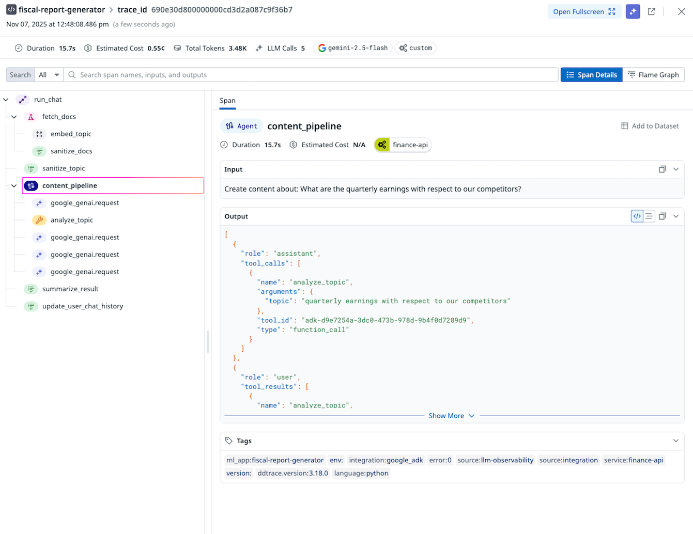

# ADK에 대한 Datadog 관찰 가능성

<div class="language-support-tag">
    <span class="lst-supported">Supported in:</span>
    <span class="lst-python">Python</span>
</div>

[Datadog LLM
Observability](https://www.datadoghq.com/product/llm-observability/)는 AI를 돕습니다.
엔지니어, 데이터 과학자, 애플리케이션 개발자는 신속하게 개발하고,
LLM 지원서를 평가하고 모니터링합니다. 자신있게 출력 품질을 향상시키고,
구조화된 실험을 통해 성능, 비용, 전반적인 위험을 엔드투엔드로 분석합니다.
AI 에이전트 추적 및 평가.

## 개요

Datadog LLM 관찰 기능은 [automatically instrument and trace your agents
built on Google
ADK](https://docs.datadoghq.com/llm_observability/instrumentation/auto_instrumentation?tab=python#google-adk),
다음을 수행할 수 있습니다.

- **에이전트 실행 및 상호 작용 관찰** - 모든 항목을 자동으로 캡처
  에이전트 실행, 도구 호출 및 에이전트 내 코드 실행
- 기본 Google GenAI SDK로 이루어진 **LLM 호출 및 응답 캡처**
- 오류율, 토큰 사용량 및 비용을 제공하여 **문제 디버깅**
  LLM 통화 및 도구 사용에 대한 즉각적인 평가

## 전제조건

[Datadog account](https://www.datadoghq.com/)가 없으면 등록하세요.
하나와 [get your API
key](https://docs.datadoghq.com/account_management/api-app-keys/#api-keys).

## 설치

필수 패키지를 설치합니다:

```bash
pip install ddtrace
```

## 설정

### Google ADK를 사용하여 애플리케이션 만들기

Google ADK를 사용하는 애플리케이션이 없는 경우 다음 단계를 따르세요.
[ADK Getting Started Guide](https://google.github.io/adk-docs/get-started/) ~
샘플 ADK 에이전트를 만듭니다.

### 환경 변수 구성

다음 환경에서는 ML 애플리케이션 이름을 지정해야 합니다.
변수. ML 애플리케이션은 LLM 관찰 추적을 그룹화한 것입니다.
특정 LLM 기반 응용 프로그램과 연결됩니다. [ML Application Naming
Guidelines](https://docs.datadoghq.com/llm_observability/instrumentation/sdk?tab=python#application-naming-guidelines) 참조
ML 애플리케이션 이름의 제한 사항에 대한 자세한 내용을 확인하세요.

```shell
export DD_API_KEY=<YOUR_DD_API_KEY>
export DD_SITE=<YOUR_DD_SITE>
export DD_LLMOBS_ENABLED=true
export DD_LLMOBS_ML_APP=<YOUR_ML_APP_NAME>
export DD_LLMOBS_AGENTLESS_ENABLED=true
export DD_APM_TRACING_ENABLED=false  # Only set this if you are not using Datadog APM
```

이러한 변수는 애플리케이션을 실행하기 전에 내보내야 합니다.
다음 `ddtrace-run` 명령을 사용하면
에이전트의 `.env` 파일.

### 애플리케이션 실행

환경 변수를 구성한 후에는 다음을 실행할 수 있습니다.
LLM 기반 지원서를 관찰하기 시작하세요.

```shell
ddtrace-run adk run my_agent
```

## 관찰

[Datadog LLM Observability Traces
View](https://app.datadoghq.com/llm/traces)로 이동하여 생성된 추적을 확인하세요.
신청.



## 지원 및 리소스
- [Datadog LLM Observability](https://www.datadoghq.com/product/llm-observability/)
- [Datadog Support](https://docs.datadoghq.com/help/)
