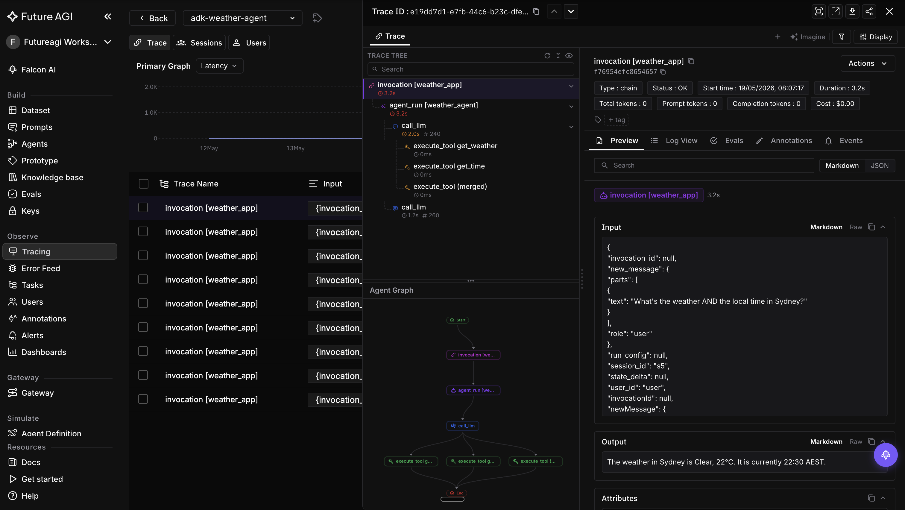

# ADK용 Future AGI 관측성

<div class="language-support-tag">
  <span class="lst-supported">Supported in ADK</span><span class="lst-python">Python</span>
</div>

[Future AGI](https://futureagi.com)는 AI 에이전트를 위한 관측성 및 평가
플랫폼입니다. [`traceai-google-adk`](https://pypi.org/project/traceai-google-adk/)
패키지는 ADK 에이전트를 자동 계측하고 모든 에이전트 실행, 모델 호출,
도구 실행, 이벤트 루프 사이클을 OpenTelemetry span으로 Future AGI에
내보냅니다. 대시보드에서 실행 트리를 검사하고, 동작을 평가하고, 실험을
실행할 수 있습니다.



## 개요

`traceai-google-adk` 패키지는 ADK에 OpenTelemetry 계측을 추가하여 다음을
지원합니다.

- **에이전트 실행 추적:** 모든 에이전트 호출, 도구 호출, 모델 요청 및
  응답을 프롬프트, 완성 결과, 매개변수, 토큰 사용량과 함께 캡처합니다.
- **동작 평가:** 캡처된 trace에 대해 사전 빌드 또는 커스텀 evaluator를
  실행합니다.
- **에이전트 디버깅:** 계층적 실행 트리에서 실패한 도구 호출, 지연 시간
  병목, 예상치 못한 분기를 찾아냅니다.

## 기본 요건

1. [app.futureagi.com](https://app.futureagi.com)에 가입합니다.
2. 대시보드에서 `FI_API_KEY`와 `FI_SECRET_KEY`를 복사합니다.
3. 환경 변수를 설정합니다.

   ```bash
   export FI_API_KEY=<your-fi-api-key>
   export FI_SECRET_KEY=<your-fi-secret-key>
   export GOOGLE_API_KEY=<your-google-api-key>
   ```

## 설치

```bash
pip install traceai-google-adk
```

`traceai-google-adk` 패키지는 `google-adk`와 `google-genai`를 런타임
의존성으로 선언하므로 함께 설치됩니다.

## Future AGI로 trace 보내기

시작 시 Future AGI tracer를 한 번 등록하고, 에이전트를 실행하기 **전에**
`GoogleADKInstrumentor`를 연결합니다. 이후 모든 ADK 에이전트 호출은
자동으로 캡처됩니다.

```python
import asyncio

from fi_instrumentation import register
from fi_instrumentation.fi_types import ProjectType
from google.adk.agents import Agent
from google.adk.runners import InMemoryRunner
from google.genai import types
from traceai_google_adk import GoogleADKInstrumentor

tracer_provider = register(
    project_type=ProjectType.OBSERVE,
    project_name="adk-weather-agent",
)
GoogleADKInstrumentor().instrument(tracer_provider=tracer_provider)


def get_weather(city: str) -> dict:
    """Retrieves the current weather report for a specified city."""
    if city.lower() == "new york":
        return {
            "status": "success",
            "report": "The weather in New York is sunny with a temperature of 25°C.",
        }
    return {
        "status": "error",
        "error_message": f"Weather information for '{city}' is not available.",
    }


agent = Agent(
    name="weather_agent",
    model="gemini-flash-latest",
    description="Agent to answer weather questions.",
    instruction="You must use the available tools to find an answer.",
    tools=[get_weather],
)


async def main():
    runner = InMemoryRunner(agent=agent, app_name="weather_app")
    await runner.session_service.create_session(
        app_name="weather_app", user_id="user", session_id="session"
    )
    async for event in runner.run_async(
        user_id="user",
        session_id="session",
        new_message=types.Content(
            role="user",
            parts=[types.Part(text="What is the weather in New York?")],
        ),
    ):
        if event.is_final_response():
            print(event.content.parts[0].text.strip())


if __name__ == "__main__":
    asyncio.run(main())
```

## 대시보드에서 trace 보기

에이전트를 실행한 뒤 [Future AGI 대시보드](https://app.futureagi.com)에서
프로젝트를 엽니다. 각 ADK 에이전트 실행은 프롬프트, 완성 결과, 모델
매개변수, 토큰 사용량, 도구 입력과 출력, 이벤트 루프 사이클을 검사할 수
있는 계층적 trace를 생성합니다.

## 리소스

- [PyPI의 `traceai-google-adk`](https://pypi.org/project/traceai-google-adk/)
- [GitHub의 `traceAI`](https://github.com/future-agi/traceAI/tree/main/python/frameworks/google-adk)
- [Future AGI 문서](https://docs.futureagi.com)
