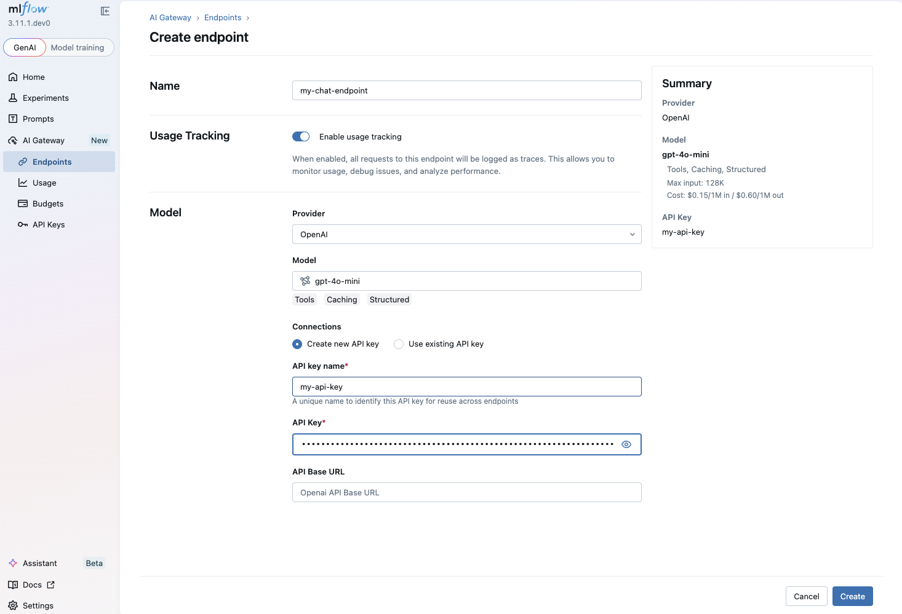

# ADK 에이전트용 MLflow AI 게이트웨이

<div class="language-support-tag">
  <span class="lst-supported">Supported in ADK</span><span class="lst-python">Python</span>
</div>

[MLflow AI Gateway](https://mlflow.org/docs/latest/genai/governance/ai-gateway/)
MLflow 추적 서버에 내장된 데이터베이스 기반 LLM 프록시입니다(MLflow ≥
3.0). 수십 개의 공급자에 걸쳐 통합 OpenAI 호환 API를 제공합니다.
Gemini, Anthropic, Mistral, Bedrock, Ollama 등이 내장되어 있습니다.
비밀 관리, 대체/재시도, 트래픽 분할, 예산 추적 등 모두
MLflow UI를 통해 구성됩니다.

MLflow AI Gateway는 OpenAI 호환 엔드포인트를 노출하므로 연결할 수 있습니다.
[LiteLLM](/agents/models/litellm/) 모델 커넥터를 사용하여 ADK 에이전트를 사용합니다.

## 사용 사례

- **다중 제공업체 라우팅**: 에이전트 코드 변경 없이 LLM 제공업체 전환
- **비밀 관리**: 공급자 API 키가 서버에 암호화되어 저장됩니다. 너의
  애플리케이션은 공급자 키를 보내지 않습니다.
- **대체 및 재시도**: 장애 발생 시 백업 모델로 자동 장애 조치
- **예산 추적**: 엔드포인트별 또는 사용자별 토큰 예산
- **트래픽 분할**: 요청 비율을 다른 모델로 라우팅합니다.
  A/B 테스트
- **사용 추적**: 모든 호출이 자동으로 MLflow 추적으로 기록됩니다.

## 전제조건

- MLflow 버전 3.0 이상
- 귀하의 환경에 설치된 Google ADK 및 LiteLLM

## 설정

종속성을 설치합니다.

```bash
pip install mlflow[genai] google-adk litellm
```

MLflow 서버를 시작합니다.

```bash
mlflow server --host 127.0.0.1 --port 5000
```

MLflow UI는 `http://localhost:5000`에서 사용할 수 있습니다.

MLflow UI로 이동하여 게이트웨이 엔드포인트를 생성합니다.
`http://localhost:5000`를 클릭한 후 **AI Gateway → Create Endpoint**로 이동합니다. 선택
공급자(예: Google Gemini) 및 모델(예: `gemini-flash-latest`)
서버에 암호화되어 저장되어 있는 공급자 API 키를 입력하세요.



[MLflow AI Gateway
documentation](https://mlflow.org/docs/latest/genai/governance/ai-gateway/endpoints/) 참조
엔드포인트 구성에 대한 자세한 내용은

## 에이전트와 함께 사용

MLflow 게이트웨이를 가리키는 `api_base`와 함께 `LiteLlm` 래퍼를 사용합니다.
끝점. `model` 매개변수는 `openai/` 접두사 뒤에 사용자 이름을 사용해야 합니다.
게이트웨이 엔드포인트 이름.

```python
from google.adk.agents import LlmAgent
from google.adk.models.lite_llm import LiteLlm

# Point to MLflow AI Gateway endpoint.
# "my-chat-endpoint" is the endpoint name you created in the MLflow UI.
agent = LlmAgent(
    model=LiteLlm(
        model="openai/my-chat-endpoint",
        api_base="http://localhost:5000/gateway/openai/v1",
        api_key="unused",  # provider keys are managed by the MLflow server
    ),
    name="gateway_agent",
    instruction="You are a helpful assistant powered by MLflow AI Gateway.",
)
```

언제든지 기본 LLM 제공자를 재구성하여 교체할 수 있습니다.
ADK에서 코드를 변경할 필요 없이 MLflow UI의 게이트웨이 엔드포인트
대리인.

## 팁

- `api_key` 매개변수는 LiteLLM에 필요하지만
  게이트웨이. 비어 있지 않은 문자열로 설정하세요.
- 프록시 뒤나 원격 호스트에서 `localhost:5000`를 서버로 교체하세요.
  주소.
- 엔드 투 엔드를 위해 [MLflow Tracing](/integrations/mlflow-tracing/)와 결합
  ADK 에이전트의 관찰 가능성.

## 리소스

- [MLflow AI Gateway
  Documentation](https://mlflow.org/docs/latest/genai/governance/ai-gateway/):
  엔드포인트 관리를 다루는 MLflow AI Gateway 공식 문서
  쿼리 API 및 게이트웨이 기능.
- [MLflow Tracing for ADK](/integrations/mlflow-tracing/): 관찰 가능성 설정
  MLflow Tracing을 사용하는 ADK 에이전트용.
- [LiteLLM model connector](/agents/models/litellm/): 문서
  ADK 에이전트를 호환되는 엔드포인트에 연결하는 데 사용되는 LiteLLM 래퍼입니다.
